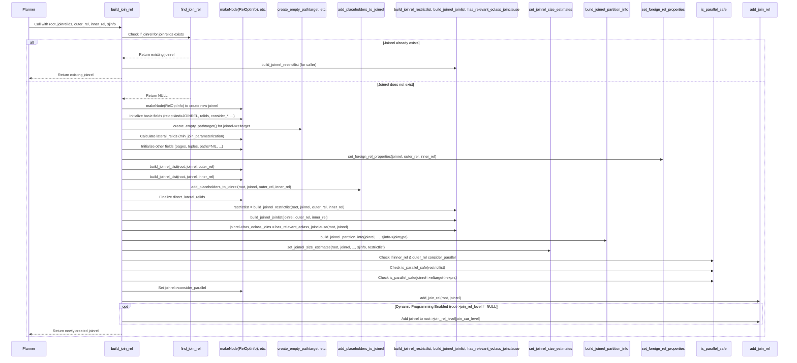
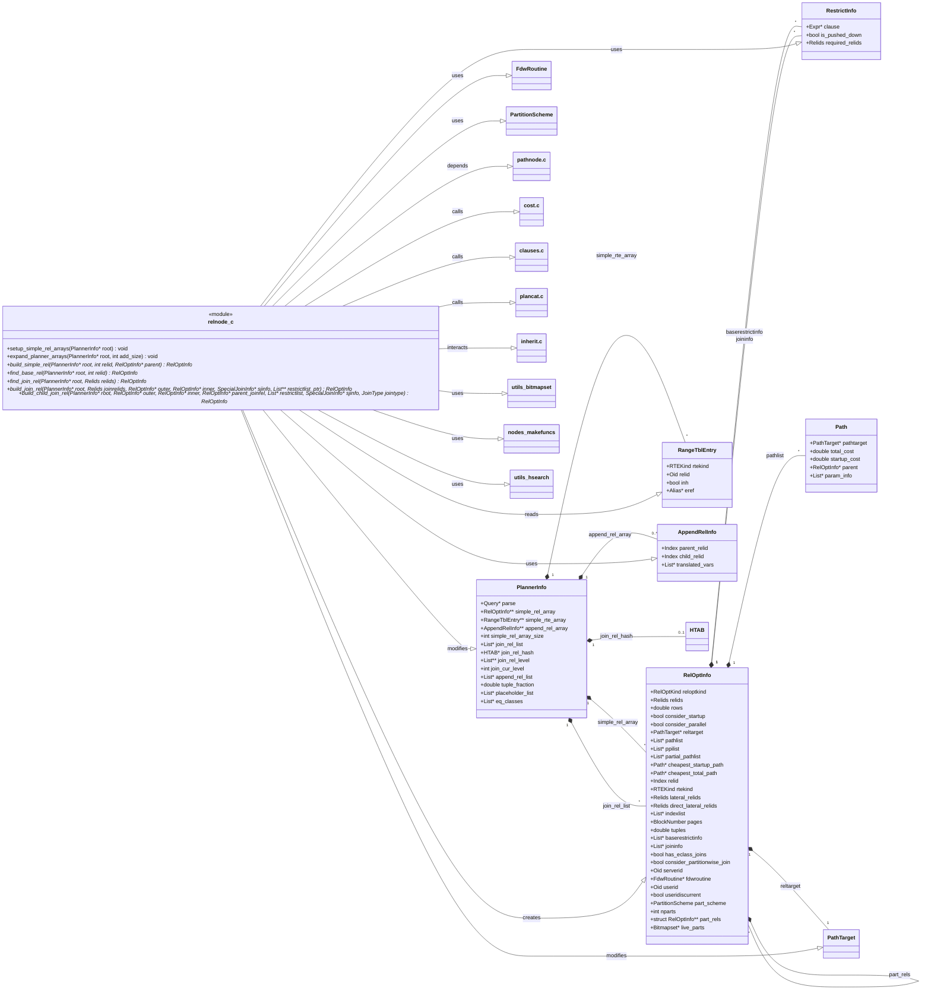

## AI辅助 PolarDB内核学习 - 49 优化器辅助功能模块(util) 核心代码 relnode.c    
    
### 作者    
digoal    
    
### 日期    
2025-04-10    
    
### 标签    
PostgreSQL , PolarDB , DuckDB , AI , 内核 , 学习 , util , 优化器 , 辅助功能模块    
    
----    
    
## 背景    
    
## 解读 优化器辅助功能模块(util) 核心代码 relnode.c    
    
好的，我们来详细解读一下 PostgreSQL 的 `src/backend/optimizer/util/relnode.c` 文件中的代码。  
  
**代码作用概述**  
  
`relnode.c` 文件是 PostgreSQL 查询优化器的核心工具之一。它的主要作用是**创建、管理和查找 `RelOptInfo` 结构**。`RelOptInfo` (Relation Optimizer Information) 是优化器内部用来表示一个“关系”的核心数据结构。这里的“关系”是一个广义的概念，可以是一个**基本表（Base Relation）**、一个**子查询（Subquery）**、一个**函数（Function）**、一个**CTE（Common Table Expression）**，或者最重要的——一个**连接关系（Join Relation）**。  
  
简单来说，当优化器处理一个 SQL 查询时，它需要为查询中涉及的每个表、子查询以及可能的表连接组合构建内部表示。`relnode.c` 提供了构建和访问这些内部表示（即 `RelOptInfo`）的基础设施。这些 `RelOptInfo` 结构存储了关于对应关系的重要信息，如：它包含哪些基本表、估计的行数和代价、可用的访问路径（索引扫描、顺序扫描等）、输出的列（目标列表）、适用的过滤条件等，为后续的路径选择和计划生成奠定基础。  
  
**多角度解读**  
  
---  
  
**1. 数据库内核开发者角度**  
  
对于内核开发者而言，`relnode.c` 是优化器早期阶段的基础模块，提供了构建查询内部表示的基本构件。  
  
* **核心数据结构 `RelOptInfo`**: 这是理解本文件的关键。开发者需要知道 `RelOptInfo` 包含了哪些字段，以及这些字段是如何在 `build_simple_rel`（用于基础关系）和 `build_join_rel`（用于连接关系）中被初始化的。例如：  
    * `relids`: 一个 `Bitmapset`，表示这个 `RelOptInfo` 节点代表了哪些 Range Table Entries (RTEs，即 FROM 子句中的表、子查询等) 的集合。对于基础关系，它只包含一个成员；对于连接关系，它是参与连接的两个子关系的 `relids` 的并集。这是查找和识别 `RelOptInfo` 的关键标识。  
    * `reloptkind`: 区分是基础表 (`RELOPT_BASEREL`)、连接关系 (`RELOPT_JOINREL`) 还是继承/分区子表 (`RELOPT_OTHER_MEMBER_REL`) 或其连接 (`RELOPT_OTHER_JOINREL`)。  
    * `rows`, `pages`, `tuples`, `allvisfrac`: 关系大小和选择性的基本估计，通常由 `get_relation_info`（对于基础表）或 `set_joinrel_size_estimates`（对于连接关系）填充。  
    * `reltarget`: (`PathTarget` 类型) 定义了该关系需要向上层节点输出的列（变量、表达式）。`build_joinrel_tlist` 负责构建连接关系的 `reltarget`。  
    * `baserestrictinfo`: (`List` of `RestrictInfo`) 存储只涉及此关系内基本表的过滤条件。  
    * `joininfo`: (`List` of `RestrictInfo`) 存储连接条件，这些条件将在此 `RelOptInfo` 代表的连接中被评估。`build_joinrel_restrictlist` 和 `build_joinrel_joinlist` 负责填充这些列表。  
    * `pathlist`, `ppilist`, `partial_pathlist`, `cheapest_*_path`: 存储为该关系生成的各种访问路径（`Path` 结构）。这些路径将在后续的路径选择阶段被评估。`relnode.c` 本身不生成路径，但它创建的 `RelOptInfo` 是存储这些路径的容器。  
    * `lateral_relids`, `direct_lateral_relids`: 处理 `LATERAL` 子查询依赖关系。  
    * `serverid`, `fdwroutine`, `userid`, `useridiscurrent`: 支持 Foreign Data Wrappers (FDW)，用于判断连接是否可以下推到外部服务器。`set_foreign_rel_properties` 负责处理。  
    * `part_scheme`, `nparts`, `part_rels`, `live_parts`, `partexprs` 等: 处理分区表相关信息，支持 Partitionwise Join。`build_joinrel_partition_info` 负责。  
  
* **性能考量**:  
    * `setup_simple_rel_arrays` 创建了 `simple_rel_array` 和 `simple_rte_array`，允许通过 Range Table Index (从1开始) 快速访问基础关系的 `RelOptInfo` 和 `RangeTblEntry`，避免了对 `PlannerInfo->parse->rtable` 列表的线性扫描。  
    * `find_join_rel` 使用了混合策略：对于少量连接关系，使用线性列表扫描 (`root->join_rel_list`)；当连接关系数量超过阈值（硬编码为 32）时，会调用 `build_join_rel_hash` 创建一个哈希表 (`root->join_rel_hash`)，将查找时间复杂度从 O(N) 优化到接近 O(1)。这对于处理复杂的多表连接查询至关重要。`JoinHashEntry` 是哈希表的条目结构，`bitmap_hash` 和 `bitmap_match` 是针对 `Relids` (Bitmapset) 的哈希和比较函数。  
    * 内存管理：代码中大量使用 `palloc`, `palloc0`, `repalloc`, `bms_copy` 等 PostgreSQL 的内存管理函数，确保所有分配的内存在查询处理结束后能被正确释放。  
  
* **模块交互**: `relnode.c` 与优化器的其他部分紧密协作：  
    * `planner.c`: 调用 `setup_simple_rel_arrays`, `build_simple_rel`, `build_join_rel` 等来构建初始的 `RelOptInfo` 集合。  
    * `plancat.c` (`get_relation_info`): 用于获取基础表（`RTE_RELATION`）的统计信息、索引信息、分区信息等，填充到 `RelOptInfo` 中。  
    * `pathnode.c`: 使用 `RelOptInfo` 中的信息（如 `reltarget`, `baserestrictinfo`）来创建 `Path` 节点。  
    * `cost.c`: 使用 `RelOptInfo` 中的大小估计 (`rows`, `tuples`) 和 `RestrictInfo` 来评估路径的成本。  
    * `inherit.c`, `partitioning/`*: 处理继承和分区，会创建 `RELOPT_OTHER_MEMBER_REL` 类型的 `RelOptInfo`，并可能调用 `expand_planner_arrays` 扩展 RTE 数组。`build_child_join_rel` 用于构建分区子连接的 `RelOptInfo`。  
    * `equivclass.c`: 等价类处理会影响 `joininfo` 和 `has_eclass_joins` 字段。  
  
---  
  
**2. 架构师角度**  
  
架构师关注的是 `relnode.c` 在整个查询优化流程中的定位和设计哲学。  
  
* **查询表示的构建模块**: `relnode.c` 是查询优化器中“自底向上”构建查询表示的关键部分。它从单个表/子查询开始 (`build_simple_rel`)，然后逐步构建代表两表连接、三表连接乃至更多表连接的 `RelOptInfo` (`build_join_rel`)。  
* **抽象与封装**: `RelOptInfo` 结构是对各种“关系”来源（表、子查询、连接等）的一种统一抽象。上层优化逻辑（如路径生成、连接顺序选择）可以基于 `RelOptInfo` 提供的接口（大小估计、限制条件、目标列等）进行工作，而不必关心其具体来源是表还是复杂的连接。  
* **支持高级特性**: 设计上考虑了对现代数据库特性的支持：  
    * **继承/分区**: 通过 `RELOPT_OTHER_MEMBER_REL` 和 `build_child_join_rel` 等机制，以及分区相关的字段，为 Partitionwise Join 等优化提供了基础结构。  
    * **FDW**: 通过 `serverid` 等字段和 `set_foreign_rel_properties` 函数，支持判断和准备 FDW 连接下推。  
    * **LATERAL**: 通过 `lateral_relids` 等字段跟踪和处理 `LATERAL` 依赖，确保正确的连接顺序和参数化路径。  
    * **并行查询**: `consider_parallel` 字段用于标记一个关系（或连接）是否适合并行执行，影响并行计划的生成。  
* **性能与扩展性的权衡**:  
    * 采用数组进行基础关系快速查找，体现了对常见场景的优化。  
    * 对连接关系查找采用动态切换列表/哈希表的策略，是在简单性和处理复杂查询性能之间的平衡。  
    * `RelOptInfo` 结构庞大，包含了大量信息，虽然增加了内存消耗，但方便了后续优化步骤直接获取所需信息，避免了重复计算。  
* **与优化策略的关联**:  
    * 对于基于动态规划（DP）的连接顺序优化，`build_join_rel` 构建的 `RelOptInfo` 代表了 DP 表中的一个状态（一个特定的连接组合）。`root->join_rel_level` 数组（如果启用DP）就用于组织这些按层级（参与连接的基础关系数量）生成的 `RelOptInfo`。  
    * 对于遗传查询优化（GEQO），虽然连接顺序选择逻辑不同，但它仍然依赖 `relnode.c` 来创建和表示候选的连接关系 (`RelOptInfo`)。`add_join_rel` 特别提到 GEQO 要求追加到列表末尾，暗示了其特定的处理流程。  
  
---  
  
**3. 用户（应用开发者和 DBA）角度**  
  
用户不直接与 C 代码交互，但 `relnode.c` 的工作方式和效率会间接影响他们：  
  
* **查询规划时间**: `relnode.c` 中的函数是查询规划（planning）阶段的一部分。对于涉及大量表连接的复杂查询，`build_join_rel` 会被频繁调用。`find_join_rel` 中哈希表的优化有助于减少规划时间，尤其是在表数量增多时。如果规划时间过长，DBA 可能需要考虑调整 `geqo_threshold` 或简化查询。  
* **执行计划的选择**: `RelOptInfo` 中包含的统计信息估计（`rows`, `tuples`）、限制条件（`baserestrictinfo`, `joininfo`）、目标列 (`reltarget`) 等，都是优化器选择最佳执行计划（如使用哪个索引、哪种连接方法、何种连接顺序）的基础。`relnode.c` 确保这些信息被正确构建和关联到对应的关系上。如果 `RelOptInfo` 的信息不准确（例如统计信息过时），优化器可能会做出次优的选择，导致查询性能下降。DBA 需要确保表的统计信息是最新的 (`ANALYZE`)。  
* **分区表性能**: `build_child_join_rel` 和相关的分区处理逻辑是实现 Partitionwise Join 的基础。当查询涉及连接两个大型分区表，并且连接键是分区键时，Partitionwise Join 可以将大连接分解为多个小分区之间的连接，显著提升性能。用户可以通过查询 `EXPLAIN` 计划来查看是否应用了 Partitionwise Join。  
* **FDW 性能**: `set_foreign_rel_properties` 等函数判断连接是否可以在外部服务器上执行。如果可以下推，通常能大幅减少需要在 PostgreSQL 服务器上处理的数据量，提高涉及外部表的查询性能。用户可以通过 `EXPLAIN` 查看 `Foreign Scan` 或 `Foreign Join` 是否被下推。  
* **理解 `EXPLAIN`**: 虽然 `EXPLAIN` 输出的是最终的执行计划树，但其背后的构建过程依赖 `RelOptInfo`。理解优化器如何内部表示关系（例如，知道 Join 节点对应一个 `RelOptInfo` 结构，其中包含了连接条件和大小估计），有助于更深入地解读 `EXPLAIN` 的结果和成本估算。  
  
---  
  
**代码内部细节与关联（图表）**  
  
**1. `build_join_rel` 核心逻辑 (Sequence Diagram)**  
  

  
**2. 主要结构和文件关联 (Mermaid Class Diagram like)**  
  

  
**关键内容深入解释**  
  
1.  **`RelOptInfo` 的核心地位**: 它是优化器中所有关系（基本表、连接、子查询等）的统一内部表示。后续几乎所有的优化步骤，包括路径生成（`pathnode.c`, `indxpath.c`, `joinpath.c`）、连接顺序选择（`joinrels.c`）、计划生成（`createplan.c`）等，都围绕着 `RelOptInfo` 进行。理解它的结构和内容是理解优化器的基础。  
  
2.  **`relids` (Bitmapset)**: 这是一个非常重要的字段。它唯一地标识了一个 `RelOptInfo` 所代表的关系集合。Bitmapset 是一种高效的整数集合表示，特别适合用于集合运算（并集、交集、成员测试），这在处理连接关系时非常频繁。例如，检查一个 `RestrictInfo`（条件）是否适用于某个 `RelOptInfo`，就是看 `RestrictInfo->required_relids` 是否是 `RelOptInfo->relids` 的子集。`find_join_rel` 使用 `relids` 作为查找键。  
  
3.  **基础关系 vs 连接关系**:  
    * `build_simple_rel` 创建基础关系 (`RELOPT_BASEREL`) 或继承/分区子关系 (`RELOPT_OTHER_MEMBER_REL`) 的 `RelOptInfo`。它会调用 `get_relation_info` 从系统目录或缓存中获取表的物理信息（大小、统计、索引等）。  
    * `build_join_rel` 创建连接关系 (`RELOPT_JOINREL`) 的 `RelOptInfo`。它不直接访问物理存储信息，而是基于其输入（`outer_rel`, `inner_rel`）的 `RelOptInfo` 来计算新连接关系的信息（如大小估计 `set_joinrel_size_estimates`，目标列 `build_joinrel_tlist`，连接条件 `build_joinrel_restrictlist`）。  
    * `build_child_join_rel` 是为 Partitionwise Join 优化的特殊版本，创建子连接 (`RELOPT_OTHER_JOINREL`)。  
  
4.  **目标列表 (`reltarget`)**: 定义了该 `RelOptInfo` 节点需要向上（向更高层的连接或最终输出）传递哪些列或表达式。`build_joinrel_tlist` 的任务是合并 `outer_rel` 和 `inner_rel` 的 `reltarget`，并只保留那些被更高层连接条件、WHERE子句或最终 SELECT 列表所需要的项。这有助于减少中间结果需要物化的列数。`add_placeholders_to_joinrel` 负责添加在当前连接层级计算出的 `PlaceHolderVar`（例如，需要在此处计算的表达式，但其输入来自子关系）。  
  
5.  **限制条件 (`baserestrictinfo` vs `joininfo`)**:  
    * `baserestrictinfo`: 存储那些只涉及当前 `RelOptInfo` 所包含的基础表的过滤条件（例如 `WHERE t1.a > 10` 对于代表 `t1` 的 `RelOptInfo`）。这些条件可以在访问该关系时尽早应用。  
    * `joininfo`: 存储那些涉及当前 `RelOptInfo` 与 *其他* `RelOptInfo` 之间连接的条件（例如 `WHERE t1.b = t2.c` 对于代表 `t1 JOIN t2` 的 `RelOptInfo`）。`build_joinrel_restrictlist` 负责从所有可用的 `RestrictInfo` 中筛选出适用于当前这对 `outer_rel` 和 `inner_rel` 的连接条件。`build_joinrel_joinlist` 则负责将子关系（`outer_rel`, `inner_rel`）的 `joininfo` 中那些在此连接层级仍未处理的、但涉及当前连接的条件，提升到新的 `joinrel` 的 `joininfo` 中。  
  
6.  **查找优化 (`find_join_rel` 的哈希表)**: 在处理 N 个表的连接时，可能需要考虑的连接组合数量是指数量级的（对于 DP 是 O(2^N)，对于 GEQO 也是大量）。频繁查找一个特定的连接组合（例如，`{t1, t3, t5}`）是否已经被创建和评估过是必需的。当表数量较多时，线性扫描 `join_rel_list` 会成为性能瓶颈，因此切换到哈希表查找 (`join_rel_hash`) 是一个关键的性能优化。  
  
**例子提升可读性**  
  
假设有查询：  
  
```sql  
SELECT t1.a, t2.b, t3.c  
FROM t1  
JOIN t2 ON t1.id = t2.t1_id  
JOIN t3 ON t2.id = t3.t2_id  
WHERE t1.x > 10 AND t3.y < 100;  
```  
  
优化器大致流程会涉及 `relnode.c`:  
  
1.  **`setup_simple_rel_arrays`**: 创建 `simple_rel_array` 和 `simple_rte_array`，大小至少为 4 (1-based index)。  
2.  **`build_simple_rel` (for t1)**:  
    * 创建 `RelOptInfo` (relid=1), `relids`={1}, `reloptkind`=BASEREL.  
    * 调用 `get_relation_info` 获取 t1 的统计信息、索引等。  
    * 将 `t1.x > 10` 加入 `baserestrictinfo`.  
    * `reltarget` 初始可能包含 `t1.a`, `t1.id`, `t1.x` (如果被需要)。  
    * 存入 `root->simple_rel_array[1]`.  
3.  **`build_simple_rel` (for t2)**: 类似地创建 `RelOptInfo` (relid=2), `relids`={2}, `reltarget` 可能包含 `t2.b`, `t2.t1_id`, `t2.id`. 存入 `root->simple_rel_array[2]`.  
4.  **`build_simple_rel` (for t3)**: 类似地创建 `RelOptInfo` (relid=3), `relids`={3}, 将 `t3.y < 100` 加入 `baserestrictinfo`, `reltarget` 可能包含 `t3.c`, `t3.t2_id`, `t3.y`. 存入 `root->simple_rel_array[3]`.  
5.  **`build_join_rel` (maybe for {t1, t2})**:  
    * `joinrelids` = {1, 2}.  
    * `find_join_rel({1, 2})` 返回 NULL (假设首次构建)。  
    * 创建新的 `RelOptInfo`, `relids`={1, 2}, `reloptkind`=JOINREL.  
    * `build_joinrel_tlist` 合并 t1 和 t2 的 `reltarget`，保留需要的列（如 `t1.a`, `t2.b`, `t2.id`）。  
    * `build_joinrel_restrictlist` 找到连接条件 `t1.id = t2.t1_id` 并返回它（供后续路径生成使用）。  
    * `build_joinrel_joinlist` 将此连接条件放入新 `RelOptInfo` 的 `joininfo` (如果适用)。  
    * `set_joinrel_size_estimates` 估算 `{t1, t2}` 连接后的大小。  
    * `add_join_rel` 将这个新的 `RelOptInfo` 加入 `root->join_rel_list` (和 hash table, 如果已创建)。  
6.  **`build_join_rel` (maybe for {{t1, t2}, t3})**:  
    * `outer_rel` 是上一步创建的 `{t1, t2}` 的 `RelOptInfo`.  
    * `inner_rel` 是 t3 的 `RelOptInfo`.  
    * `joinrelids` = {1, 2, 3}.  
    * `find_join_rel({1, 2, 3})` 返回 NULL.  
    * 创建新的 `RelOptInfo`, `relids`={1, 2, 3}, `reloptkind`=JOINREL.  
    * `build_joinrel_tlist` 合并 `{t1, t2}` 和 t3 的 `reltarget`，保留 `t1.a`, `t2.b`, `t3.c`.  
    * `build_joinrel_restrictlist` 找到连接条件 `t2.id = t3.t2_id`.  
    * `set_joinrel_size_estimates` 估算最终连接结果的大小。  
    * `add_join_rel` 将这个 `RelOptInfo` 加入列表/哈希表。  
  
这个过程会根据优化器的连接顺序策略（DP 或 GEQO）进行，可能会尝试不同的连接顺序（如先连接 {t2, t3}），每次连接都会调用 `build_join_rel` 来创建或查找对应的 `RelOptInfo`。最终，优化器会比较不同连接顺序产生的最终 `RelOptInfo` (`{1, 2, 3}`) 中最廉价的路径 (`cheapest_total_path`) 来决定执行计划。  
    
## 提示    
```    
解读下面的代码. 先用几句话阐述代码作用, 然后从数据库内核开发者、架构师、用户(应用开发者和DBA)多个角度通熟易懂的解读这个代码, 使用sequence、mermaid等图表勾勒代码内部的细节逻辑以及与其他代码文件之间的关联关系, 使用恰当的例子提升代码可读性. 关键内容务必要深入重点详细解释.    
$代码内容    
```    
    
## PolarDB & PostgreSQL 15 差异    
```    
git diff -u 50d3d22baba63613d1f1406b2ed460dc9b03c3fc f5e7493819e370d30ac2047c68c21c9fb03ce4a0 -- src/backend/optimizer/util/relnode.c    
```    
    
差异分析待补充.    
    
<b> 以上内容基于DeepSeek、QwQ及诸多AI生成, 轻微人工调整, 感谢杭州深度求索人工智能、阿里云等公司. </b>    
    
<b> AI 生成的内容请自行辨别正确性, 当然也多了些许踩坑的乐趣, 毕竟冒险是每个男人的天性.  </b>    
    
    
  
#### [期望 PostgreSQL|开源PolarDB 增加什么功能?](https://github.com/digoal/blog/issues/76 "269ac3d1c492e938c0191101c7238216")
  
  
#### [PolarDB 开源数据库](https://openpolardb.com/home "57258f76c37864c6e6d23383d05714ea")
  
  
#### [PolarDB 学习图谱](https://www.aliyun.com/database/openpolardb/activity "8642f60e04ed0c814bf9cb9677976bd4")
  
  
#### [PostgreSQL 解决方案集合](../201706/20170601_02.md "40cff096e9ed7122c512b35d8561d9c8")
  
  
#### [德哥 / digoal's Github - 公益是一辈子的事.](https://github.com/digoal/blog/blob/master/README.md "22709685feb7cab07d30f30387f0a9ae")
  
  
#### [About 德哥](https://github.com/digoal/blog/blob/master/me/readme.md "a37735981e7704886ffd590565582dd0")
  
  

  
