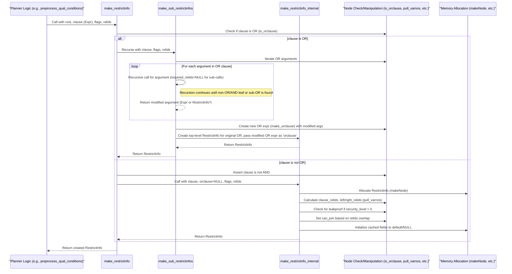
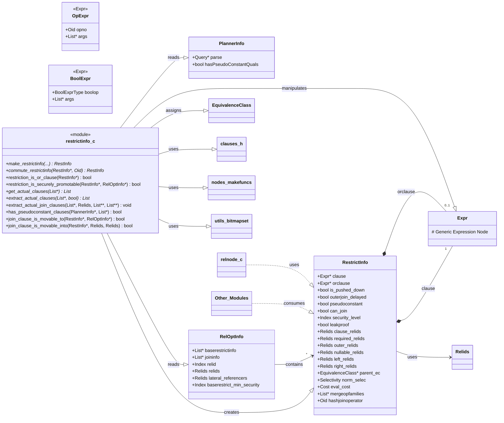

## AI辅助 PolarDB内核学习 - 50 优化器辅助功能模块(util) 核心代码 restrictinfo.c  
  
### 作者  
digoal  
  
### 日期  
2025-04-10  
  
### 标签  
PostgreSQL , PolarDB , DuckDB , AI , 内核 , 学习 , util , 优化器 , 辅助功能模块  
  
----  
  
## 背景  
  
## 解读 优化器辅助功能模块(util) 核心代码 restrictinfo.c  
  
好的，我们来解读 PostgreSQL 的 `src/backend/optimizer/util/restrictinfo.c` 文件中的代码。  
  
**代码作用概述**  
  
`restrictinfo.c` 文件主要负责**创建和管理 `RestrictInfo` 数据结构**。`RestrictInfo` 是 PostgreSQL 优化器内部用来表示**查询条件（如 WHERE 子句、JOIN ON 子句中的布尔表达式）**的一种重要结构。它不仅仅是原始表达式 (`Expr`) 的简单包装，更重要的是它**附加了大量优化器所需的上下文信息和缓存数据**，例如该条件涉及哪些关系、是否适用于特定连接算法的初步判断、与外连接相关的语义、成本和选择性估算（会被缓存）、安全性和 RLS 相关属性等。通过 `RestrictInfo`，优化器能更有效地分析、分类和利用这些查询条件来生成高效的执行计划。  
  
**多角度解读**  
  
---  
  
**1. 数据库内核开发者角度**  
  
对于内核开发者来说，`restrictinfo.c` 提供了一套基础 API，用于将解析后的布尔表达式 (`Expr`) 转化为带有丰富优化元数据的 `RestrictInfo` 对象。  
  
* **核心数据结构 `RestrictInfo`**: 理解 `RestrictInfo` 的字段是关键：  
    * `clause`: 指向原始的布尔表达式 (`Expr`)。  
    * `orclause`: 如果原始 `clause` 是一个 OR 表达式，这里会存储一个特殊处理过的版本，其子节点被 `RestrictInfo` 包裹（通过 `make_sub_restrictinfos` 实现）。否则为 NULL。  
    * `is_pushed_down`: 标记这个条件是否是从更高层的连接“下推”下来的（主要用于外连接语义）。  
    * `outerjoin_delayed`: 标记这个条件是否因为外连接语义而必须延迟评估。  
    * `pseudoconstant`: 标记这个条件在单次扫描中是否可以视为常量（例如 `col = (SELECT ...)`，子查询只执行一次）。  
    * `can_join`: 一个初步的语法标记，表示该条件（如果是二元操作符）连接了两个不同的关系集合，*可能*用作连接条件。  
    * `security_level`: 用于 RLS (Row Level Security)，表示评估此条件所需的最低安全屏障级别。  
    * `leakproof`: 标记条件涉及的函数是否是防泄漏 (leakproof) 的，影响 RLS 下的评估顺序。  
    * `has_volatile`: 缓存该条件是否包含易变 (volatile) 函数。  
    * `clause_relids`: (`Relids` - Bitmapset) 实际被该 `clause` 引用的所有基础关系的 ID 集合。通过 `pull_varnos` 计算。  
    * `required_relids`: (`Relids`) 评估该条件所必需的基础关系的 ID 集合。通常等于 `clause_relids`，但在某些特定场景（如部分索引）下可能不同。这是决定条件能在哪个 `RelOptInfo` 层级被评估的关键。  
    * `outer_relids`: (`Relids`) 如果这是一个外连接条件，并且被延迟，这里记录了连接的“外侧”（保留行）关系。  
    * `nullable_relids`: (`Relids`) 记录了在当前条件下，哪些关系可能因为更低层的外连接而产生 NULL。  
    * `left_relids`, `right_relids`: 对于二元操作符，分别记录左右操作数引用的关系 ID 集合。  
    * `parent_ec`, `left_ec`, `right_ec`: 指向相关的等价类 (`EquivalenceClass`)，用于传递推导出的条件和进行更复杂的优化。  
    * `eval_cost`, `norm_selec`, `outer_selec`: 缓存条件的评估成本和选择性估算。  
    * `mergeopfamilies`: (`List` of Oids) 缓存适用于归并连接 (Merge Join) 的操作符族。  
    * `hashjoinoperator`, `left_hasheqoperator`, `right_hasheqoperator`: 缓存适用于哈希连接 (Hash Join) 的操作符 OID。  
    * `left_bucketsize`, `right_bucketsize`, `left_mcvfreq`, `right_mcvfreq`: 缓存与哈希连接性能相关的统计信息。  
  
* **创建逻辑 (`make_restrictinfo` & `make_restrictinfo_internal`)**: `make_restrictinfo` 是入口，它会判断是否为 OR 条件，如果是则调用 `make_sub_restrictinfos` 进行递归处理，否则直接调用 `make_restrictinfo_internal`。`make_restrictinfo_internal` 负责分配 `RestrictInfo` 结构，填充传入的元数据，计算 `clause_relids` 等基本信息，并初始化所有缓存字段为“未设置”状态。  
* **OR 条件处理 (`make_sub_restrictinfos`)**: 这是处理布尔逻辑的关键部分。它递归地遍历 AND/OR 树。对于 OR 的每个子句，它会递归调用自身，确保最终的叶子节点（非 AND/OR 的简单条件）或子 OR 条件都被 `RestrictInfo` 包裹。然后，它为原始的 OR 条件创建一个顶层的 `RestrictInfo`，并将这个重新构建的、带有内部 `RestrictInfo` 节点的 OR 表达式存入 `orclause` 字段。对于 AND 条件，它只递归处理子句，然后用 `make_andclause` 重新组合结果，*不*为 AND 本身创建 `RestrictInfo`。这与优化器将 `RestrictInfo` 列表视为隐式 AND 列表的设计一致。  
* **连接条件的可移动性 (`join_clause_is_movable_to`, `join_clause_is_movable_into`)**: 这些函数是实现**参数化路径** (Parameterized Paths) 和**条件预压** (Predicate Pushing) 的核心逻辑。它们判断一个原本属于更高层连接的条件是否可以安全地“移动”到下层的扫描节点或连接节点进行评估。这需要检查：  
    1.  条件所需的所有变量在移动后的位置是否都可用（来自当前关系或外部参数）。  
    2.  条件是否确实引用了目标位置的关系（确保唯一性）。  
    3.  是否违反了外连接语义（不能移入外侧，也不能移入会使所需变量变 NULL 的内侧）。  
    4.  是否违反了 `LATERAL` 依赖关系。  
    这些检查确保了移动条件不会改变查询的语义。  
* **通勤 (`commute_restrictinfo`)**: 主要用于索引扫描。如果有一个条件 `col op const` 可以用索引，那么它的通勤形式 `const commute_op col` 可能也对应一个（不同的）索引操作符。此函数可以方便地生成通勤形式的 `RestrictInfo`。  
  
---  
  
**2. 架构师角度**  
  
架构师关注 `RestrictInfo` 如何作为标准组件支撑优化器的整体设计。  
  
* **查询条件的标准接口**: `RestrictInfo` 是优化器内部处理所有布尔条件（来自 WHERE, JOIN ON, HAVING）的标准方式。它将原始表达式与优化所需的元数据封装在一起，为后续的路径生成、代价估算、连接方法选择等步骤提供了统一的输入。  
* **解耦**: 它将表达式本身的解析与优化决策中需要的信息（如涉及关系、选择性、连接适用性）分离开。路径生成代码只需处理 `RestrictInfo`，而不必每次都重新分析 `Expr` 来获取这些信息。  
* **支持复杂优化**: `RestrictInfo` 的设计支撑了多种高级优化技术：  
    * **连接顺序规划**: `required_relids` 决定了条件最早可以在哪个连接级别（`RelOptInfo`）评估。  
    * **参数化路径/条件预压**: `join_clause_is_movable_*` 函数提供了判断条件能否下压的基础，允许将部分连接条件或过滤条件下压到扫描层（如 Index Scan with filter），从而减少需要连接的数据量。  
    * **等价类推理**: 通过 `parent_ec`, `left_ec`, `right_ec` 字段与等价类系统 (`equivclass.c`) 集成，可以推导出新的条件（例如，如果 `a=b` 且 `b=c`，可以推导出 `a=c`），这些新条件也会被包装成 `RestrictInfo`。  
    * **外连接处理**: `outerjoin_delayed`, `outer_relids`, `nullable_relids`, `is_pushed_down` 等字段精确地控制了外连接条件的评估时机和位置，保证了语义的正确性。  
    * **RLS (Row Level Security)**: `security_level` 和 `leakproof` 字段确保了在 RLS 策略存在时，条件的评估顺序符合安全要求，防止数据泄露。  
* **缓存机制**: `RestrictInfo` 内的多个字段（如成本、选择性、连接操作符）都是缓存。这意味着这些 potentially expensive 的计算只需要执行一次，结果存储在 `RestrictInfo` 中供多次使用，提高了优化器的效率。  
* **布尔逻辑表示**: 对 OR 条件的特殊处理（使用 `orclause` 字段并递归包裹子句）以及对 AND 的隐式处理（通过 `RestrictInfo` 列表）是优化器内部表示和处理布尔逻辑的一种特定设计选择。  
  
---  
  
**3. 用户（应用开发者和 DBA）角度**  
  
用户虽然不直接操作 `RestrictInfo`，但编写的 SQL 条件如何被转换为 `RestrictInfo` 以及其属性会直接影响查询性能和行为。  
  
* **条件写法的影响**:  
    * **SARGable 条件**: 那些能被优化器轻易解析并匹配索引的条件（通常形式简单，如 `column op constant` 或 `column op column`，且 `op` 是索引支持的操作符），会被有效包装进 `RestrictInfo`，更容易利用索引，`can_join` 也可能为 true。  
    * **复杂表达式/函数**: 使用复杂函数、类型转换或非标准操作符的条件，可能导致 `RestrictInfo` 难以用于索引扫描或高效连接（如 Hash/Merge Join），优化器可能回退到代价更高的顺序扫描或嵌套循环连接。  
    * **OR 条件**: `WHERE a=1 OR b=2` 这样的条件会被 `make_sub_restrictinfos` 处理。虽然可以表示，但 OR 条件通常比 AND 条件更难优化，尤其是在索引使用上（可能需要 BitmapOr 扫描）。  
* **外连接 (OUTER JOIN)**: `JOIN ON` 子句中的条件在外连接中的行为与 `WHERE` 子句不同。`RestrictInfo` 的 `outerjoin_delayed` 等标志确保了这种语义差异被正确处理。用户需要理解 `ON` 条件在连接时应用，而 `WHERE` 条件在连接后应用（对于外连接可能会过滤掉本应保留的 NULL 扩展行）。  
* **参数化查询/预编译语句**: 用户端的参数（如 `WHERE col = $1`）在优化时会被视为常量。这些条件会被包装成 `RestrictInfo`。如果参数能匹配索引，性能会很好。  
* **理解 EXPLAIN**: `EXPLAIN` 输出中的 `Filter`、`Join Filter`、`Index Cond` 等都对应着执行器实际评估的条件，这些条件源自优化器处理过的 `RestrictInfo` 列表。`RestrictInfo` 中的成本和选择性估算最终影响了 `EXPLAIN` 中显示的成本和行数估计。如果估计不准（通常因为统计信息过时或复杂条件），DBA 需要运行 `ANALYZE`。  
* **RLS 策略**: 如果表上定义了 RLS 策略，查询中的条件和策略表达式都会被转换成 `RestrictInfo`。`security_level` 和 `leakproof` 属性会影响它们的评估顺序，确保用户只能看到他们有权访问的数据。这可能引入额外的性能开销，用户可以通过 `EXPLAIN` 观察。  
  
---  
  
**代码内部逻辑与关联（图表）**  
  
**1. `make_restrictinfo` 逻辑 (Sequence Diagram)**  
  

  
**2. 主要结构和文件关联 (Mermaid Class Diagram like)**  
  

  
**关键内容深入解释**  
  
1.  **`RestrictInfo` vs `Expr`**: 这是最核心的区别。`Expr` 是解析器产生的原始表达式树，只包含表达式本身的逻辑。`RestrictInfo` 是优化器对 `Expr` 的封装，增加了大量的**上下文元数据**和**缓存空间**。优化器不直接处理裸的 `Expr` 列表，而是处理 `RestrictInfo` 列表。  
  
2.  **`required_relids`**: 这个字段至关重要，它决定了一个 `RestrictInfo`（即一个条件）**必须在哪一层连接关系 (`RelOptInfo`) 或之后才能被评估**。例如，条件 `t1.a = t2.b` 的 `required_relids` 是 `{t1, t2}`，意味着它只能在包含 t1 和 t2 的 `RelOptInfo` (或其父 `RelOptInfo`) 上下文中评估。这直接影响连接顺序的选择和条件的放置位置。  
  
3.  **`can_join`**: 这是一个早期的、**纯语法的检查**。它只看一个二元操作符表达式的左右两边是否引用了完全不同的关系集合。如果是，就标记 `can_join = true`。这*不*保证它一定能用于高效的连接算法（如 Merge or Hash Join），还需要后续检查操作符是否属于合适的族、是否有合适的哈希操作符等（这些检查的结果会缓存到 `RestrictInfo` 的其他字段中）。但 `can_join = false` 基本排除了它作为连接驱动条件的可能性。  
  
4.  **外连接处理 (`outerjoin_delayed`, `outer_relids`, `nullable_relids`)**: 这些字段协同工作以确保外连接的正确性。  
    * `outerjoin_delayed`: 如果一个 `JOIN ON` 条件引用了外连接中可能变 NULL 的内侧关系，它通常需要被延迟到连接操作之后、但在更高层连接之前评估。  
    * `outer_relids`: 记录了生成该 `RestrictInfo` 的那个外连接的“外侧”关系。  
    * `nullable_relids`: 记录了在此 `RestrictInfo` 评估点之下，哪些关系可能已经被某个外连接置为 NULL。  
    这些信息共同防止条件被错误地（过早或过晚）评估，或被错误地下推到可能改变语义的地方。  
  
5.  **条件移动性 (`join_clause_is_movable_to`/`into`)**: 这是实现高级优化的关键。允许将高层连接的条件（`RestrictInfo`）“下推”到低层扫描或连接中进行评估，可以：  
    * **提前过滤**: 减少参与后续连接的元组数量。  
    * **启用参数化路径**: 例如，对于 `SELECT ... FROM t1 JOIN t2 ON t1.id = t2.t1_id WHERE t2.value = $1`，条件 `t1.id = t2.t1_id` (假设 $1 使 `t2.value = $1` 选择性很高) 可能被认为是 "movable" 到 t1 的扫描。优化器可以创建一个计划，先扫描 t2 获取满足 `t2.value = $1` 的 `t1_id` 值，然后将这些 `t1_id` 作为参数传递给 t1 的索引扫描（参数化索引扫描），极大地提高效率。`join_clause_is_movable_into` 会被用来检查在 t1 的扫描层级（`currentrelids`={1}）和给定的参数化外部关系 t2 (`current_and_outer`={1, 2}) 下，`t1.id = t2.t1_id` 这个 `RestrictInfo` 是否满足移动条件。  
  
6.  **缓存**: `RestrictInfo` 中大量的缓存字段（选择性、成本、连接操作符、等价类指针等）避免了优化过程中对同一信息的重复计算，是优化器性能的关键。这些缓存通常在需要时才被填充（懒加载）。  
  
**例子提升可读性**  
  
考虑查询:  
  
```sql  
SELECT *  
FROM t1  
LEFT JOIN t2 ON t1.id = t2.t1_id AND t1.type = 'A'  
WHERE t2.value > 10 OR t1.status = 'active';  
```  
  
1.  `t1.id = t2.t1_id`:  
    * 会被 `make_restrictinfo` 处理。`required_relids`={t1, t2}, `clause_relids`={t1, t2}.  
    * `can_join`=true.  
    * 由于是 LEFT JOIN 的 ON 条件，`outerjoin_delayed` 可能为 false（因为它不引用只在内侧的 t2 的可能变 NULL 列，并且 t1 是外侧）。`outer_relids` 可能为 {t1}。 `nullable_relids` 可能为 {t2}。  
2.  `t1.type = 'A'`:  
    * 会被 `make_restrictinfo` 处理。`required_relids`={t1}, `clause_relids`={t1}.  
    * `can_join`=false.  
    * 虽然在 ON 子句里，但只依赖 t1（外侧），所以 `outerjoin_delayed`=false。  
3.  `t2.value > 10 OR t1.status = 'active'`:  
    * 这是一个 WHERE 条件，先被 `make_restrictinfo` 识别为 OR clause。  
    * `make_sub_restrictinfos` 会被调用：  
        * 递归处理 `t2.value > 10`：创建 `RestrictInfo` (R1), `required_relids`={t2}, `can_join`=false。因为是 WHERE 子句，`outerjoin_delayed`=false (但要注意它引用了可能为 NULL 的 t2)。  
        * 递归处理 `t1.status = 'active'`: 创建 `RestrictInfo` (R2), `required_relids`={t1}, `can_join`=false。  
    * 创建一个顶层的 `RestrictInfo` (R_OR)，`clause` 指向原始 OR 表达式，`orclause` 指向一个包含 R1 和 R2 的新 OR 表达式。`required_relids` = {t1, t2} (因为子句涉及 t1 和 t2)。  
  
在后续优化中：  
* `t1.type = 'A'` (来自 ON) 可能会被下推到对 t1 的扫描中作为过滤条件。  
* `t1.id = t2.t1_id` (来自 ON) 会被用作连接条件，可能会启用 Hash Join 或 Merge Join (如果操作符支持且有益)。  
* `R_OR` (来自 WHERE) 必须在 LEFT JOIN 操作之后评估。优化器会使用 R_OR 的 `required_relids`={t1, t2} 确保它在 t1 和 t2 连接之后处理。  
  
这个例子展示了 `RestrictInfo` 如何携带原始表达式 (`clause`)、处理布尔逻辑 (`orclause`)、记录依赖关系 (`required_relids`)、处理外连接语义 (`outerjoin_delayed` 等) 并区分条件来源（ON vs WHERE 体现在它们的 `required_relids` 和处理时机上）。  
  
## 提示  
```  
解读下面的代码. 先用几句话阐述代码作用, 然后从数据库内核开发者、架构师、用户(应用开发者和DBA)多个角度通熟易懂的解读这个代码, 使用sequence、mermaid等图表勾勒代码内部的逻辑、与其他代码文件之间的关联关系, 使用恰当的例子来解释代码的关键作用. 关键内容务必要深入重点详细解释.  
$代码内容  
```  
  
## PolarDB & PostgreSQL 15 差异  
```  
git diff -u 50d3d22baba63613d1f1406b2ed460dc9b03c3fc f5e7493819e370d30ac2047c68c21c9fb03ce4a0 -- src/backend/optimizer/util/restrictinfo.c  
```  
  
差异分析待补充.  
  
<b> 以上内容基于DeepSeek、QwQ及诸多AI生成, 轻微人工调整, 感谢杭州深度求索人工智能、阿里云等公司. </b>  
  
<b> AI 生成的内容请自行辨别正确性, 当然也多了些许踩坑的乐趣, 毕竟冒险是每个男人的天性.  </b>  
  
  
  
#### [期望 PostgreSQL|开源PolarDB 增加什么功能?](https://github.com/digoal/blog/issues/76 "269ac3d1c492e938c0191101c7238216")
  
  
#### [PolarDB 开源数据库](https://openpolardb.com/home "57258f76c37864c6e6d23383d05714ea")
  
  
#### [PolarDB 学习图谱](https://www.aliyun.com/database/openpolardb/activity "8642f60e04ed0c814bf9cb9677976bd4")
  
  
#### [PostgreSQL 解决方案集合](../201706/20170601_02.md "40cff096e9ed7122c512b35d8561d9c8")
  
  
#### [德哥 / digoal's Github - 公益是一辈子的事.](https://github.com/digoal/blog/blob/master/README.md "22709685feb7cab07d30f30387f0a9ae")
  
  
#### [About 德哥](https://github.com/digoal/blog/blob/master/me/readme.md "a37735981e7704886ffd590565582dd0")
  
  

  
