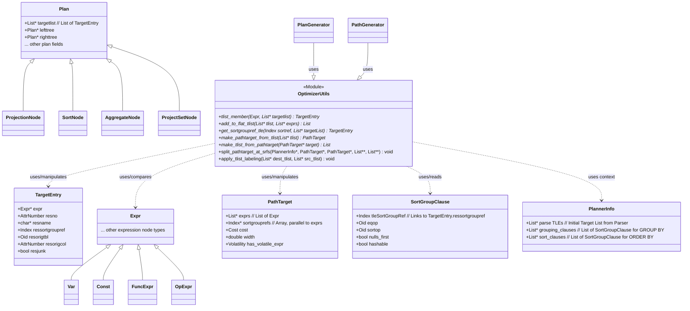
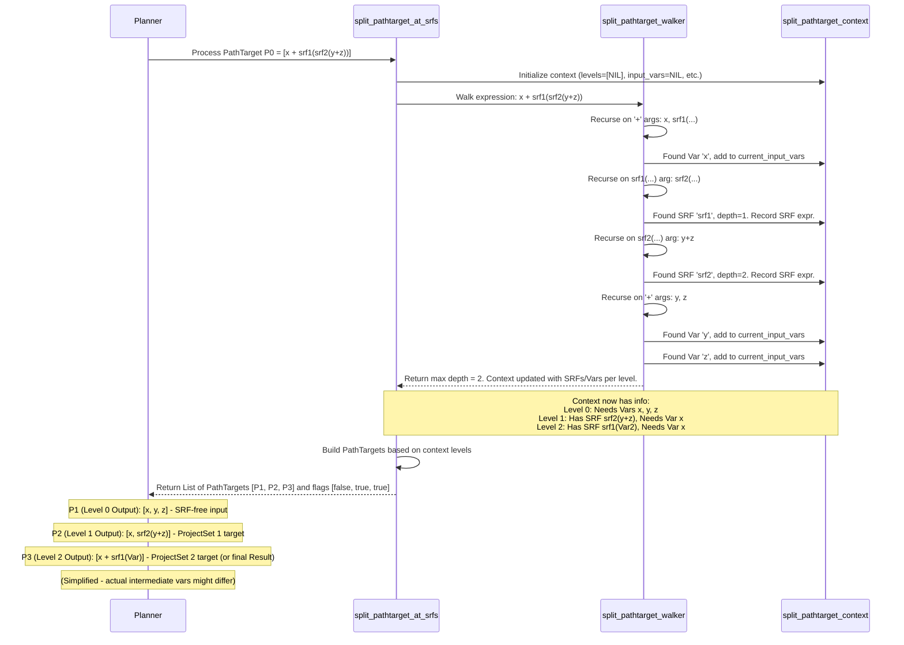

## AI辅助 PolarDB内核学习 - 51 优化器辅助功能模块(util) 核心代码 tlist.c    
    
### 作者    
digoal    
    
### 日期    
2025-04-10    
    
### 标签    
PostgreSQL , PolarDB , DuckDB , AI , 内核 , 学习 , util , 优化器 , 辅助功能模块    
    
----    
    
## 背景    
    
## 解读 优化器辅助功能模块(util) 核心代码 tlist.c    
    
好的，我们来解读一下 PostgreSQL 的 `src/backend/optimizer/util/tlist.c` 这部分代码。  
  
**代码作用概述**  
  
`tlist.c` 文件主要提供了一系列工具函数，用于在 PostgreSQL 查询优化器内部创建、操作、搜索和比较**目标列表 (Target List)**。目标列表本质上定义了一个查询计划节点（Plan Node）应该输出哪些列（或表达式）以及它们的元数据（如列名、排序/分组信息等）。这些函数是查询优化和计划生成过程中的基础构建块，确保了数据的正确投影、排序/分组依据的正确关联，并特别处理了包含集合返回函数（Set-Returning Functions, SRFs）的复杂情况。  
  
**多角度解读**  
  
---  
  
**1. 数据库内核开发者 (Kernel Developer)**  
  
* **核心数据结构:** 对内核开发者而言，`tlist` 通常指 `List *` 类型的变量，其元素是 `TargetEntry` 结构。`TargetEntry` (定义在 `nodes/parsenodes.h`) 包含一个 `Expr *expr`（表达式本身，如 `Var`、`Const`、`FuncExpr` 等），一个 `resno`（结果列号，从1开始），可选的 `resname`（列别名），`ressortgroupref`（指向 `SortGroupClause` 的引用，用于 `ORDER BY/GROUP BY`），`resorigtbl/resorigcol`（来源表/列），以及 `resjunk` 标志（标记该列是否为最终结果的一部分，`true` 表示是中间计算需要但不输出给用户的“垃圾”列）。  
* **`PathTarget` vs. `TargetEntry` List:** 内核开发者需要区分 `List *` of `TargetEntry` 和 `PathTarget`。`PathTarget` (定义在 `nodes/pathnodes.h`) 是优化器在 *路径生成 (Path Generation)* 阶段使用的更轻量级结构。它只包含 `List *exprs` 和可选的 `Index *sortgrouprefs` 数组，以及 `cost` 和 `width` 估算。它省略了 `TargetEntry` 的大部分装饰性信息（如 `resname`），专注于表达式本身和排序分组信息，便于优化器快速比较和构建不同的执行路径。`make_pathtarget_from_tlist` 和 `make_tlist_from_pathtarget` 就是在这两者之间转换的桥梁。  
* **关键操作:**  
    * **成员检查 (`tlist_member`, `tlist_member_match_var`):** 这是基础操作，用于判断某个表达式是否已存在于目标列表中。`equal()` 函数用于精确比较表达式树。`tlist_member_match_var` 提供了一个对 `Var` 节点的宽松比较（只看 `varno/varattno/varlevelsup/vartype`），这在处理类型修饰符（typmod）可能不完全匹配的场景（如函数内联后）很有用。  
    * **列表构建/修改 (`add_to_flat_tlist`, `add_column_to_pathtarget`, `add_new_column_to_pathtarget`):** 这些函数用于动态构建目标列表或 `PathTarget`，通常需要确保不引入重复表达式（除非语义需要），并正确处理 `ressortgroupref` / `sortgrouprefs` 的更新。内存管理（`palloc`, `repalloc`, `copyObject`）在这里很重要。  
    * **信息提取 (`get_tlist_exprs`, `get_sortgroupref_tle`, `extract_grouping_ops/collations/cols`):** 从目标列表或 `SortGroupClause` 列表中提取所需信息，例如只提取表达式、根据 `ressortgroupref` 查找对应的 `TargetEntry` 或表达式、提取 `GROUP BY` 子句的操作符/排序规则/列号等。这些是生成计划节点（如 Sort, GroupAggregate, HashAggregate）所需参数的关键步骤。  
    * **比较 (`tlist_same_exprs`, `tlist_same_datatypes`, `tlist_same_collations`):** 用于判断两个目标列表在核心内容（表达式、数据类型、排序规则）上是否等价。`tlist_same_exprs` 特别重要，它允许优化器判断是否可以将一个计划节点的输出直接用作另一个节点的输入，即使它们的 `TargetEntry` 标签（如 `resname`, `resjunk`）不同，只要计算的表达式相同即可，这是实现某些优化的前提（例如避免不必要的 `Result` 投影节点）。  
* **SRF 处理 (`split_pathtarget_at_srfs`):** 这是 `tlist.c` 中最复杂的部分。执行器对 SRF 的处理有限制：通常要求 SRF 出现在 `ProjectSet` 节点的顶层目标列表中。如果 SRF 嵌套在其他表达式或函数调用中（如 `SELECT x + generate_series(1, 3)` 或 `SELECT srf1(srf2(y))`），优化器必须将计算拆分成多个阶段。`split_pathtarget_at_srfs` 通过递归遍历 (`split_pathtarget_walker`) 表达式树来识别 SRF 及其嵌套深度，然后构建一系列 `PathTarget`。每个 `PathTarget` 对应一个执行层级，确保在每个需要计算 SRF 的层级（通常是一个 `ProjectSet` 节点），SRF 都位于顶层。这个过程会引入中间变量，将复杂表达式分解。  
  
---  
  
**2. 架构师 (Architect)**  
  
* **模块定位:** `tlist.c` 是查询优化器 (`src/backend/optimizer/`) 的核心工具库之一。它封装了对查询输出列表示（目标列表）的通用操作，为路径生成 (`path/`), 计划生成 (`plan/`) 等模块提供了基础服务。它体现了将通用逻辑（如列表操作、表达式比较、SRF 处理）与特定优化策略分离的设计思想。  
* **数据流:** 它处理的数据结构 (`TargetEntry`, `PathTarget`) 是连接解析器/分析器（生成初始查询树和目标列表）和计划生成器（构建最终执行计划）的关键纽带。`PathTarget` 作为优化过程中的中间表示，有助于降低路径比较和生成的复杂性。  
* **核心挑战 - SRF:** SRF 的存在给查询处理带来了架构上的挑战。`split_pathtarget_at_srfs` 的设计是应对这一挑战的关键：它通过引入额外的计划节点 (`ProjectSet`) 和中间目标列表，将原本不符合执行器要求的复杂表达式转换为多步计算，保证了功能的正确性，尽管可能会增加计划的层级。这是一种典型的用空间换取（或保证）正确性和简化执行器逻辑的设计。  
* **与执行器的接口:** `tlist.c` 处理后的目标列表（尤其是经过 `split_pathtarget_at_srfs` 处理的）直接影响最终生成的 `Plan` 树中各个节点的 `targetlist` 属性。执行器 (`src/backend/executor/`) 依赖这些 `targetlist` 来计算每个元组应该输出哪些值。`resjunk` 标志在此处尤为重要，它告诉执行器哪些列只是中间计算需要，不应返回给客户端。  
* **可扩展性:** 如果未来需要支持新的表达式类型或更复杂的投影逻辑，`tlist.c` 中的函数可能需要扩展或修改。其相对集中的设计便于维护和演进。  
  
---  
  
**3. 用户 (应用开发者 / DBA)**  
  
* **SQL 映射:** `tlist.c` 处理的逻辑直接对应于 SQL 查询中的 `SELECT` 列表、`ORDER BY` 子句和 `GROUP BY` 子句。  
    * `SELECT a, b, a+b AS sum FROM mytable`: 这里的 `a`, `b`, `a+b` 都会成为目标列表中的 `TargetEntry`。`a+b` 的 `resname` 会是 "sum"。  
    * `ORDER BY a`: 这会生成一个 `SortGroupClause`，其 `tleSortGroupRef` 会指向 `SELECT` 列表中 `a` 对应的 `TargetEntry` 的 `ressortgroupref`。`tlist.c` 中的函数（如 `get_sortgroupref_tle`）用于查找这种关联。  
    * `GROUP BY b`: 类似地，这会生成 `SortGroupClause`，并通过 `tleSortGroupRef` 关联到 `TargetEntry` `b`。`extract_grouping_ops` 等函数会提取用于分组比较的操作符（通常是 `=`）。  
* **`resjunk` 的影响:** 当你写 `SELECT a FROM t ORDER BY b` 时，即使 `b` 不在 `SELECT` 列表中，它也必须被计算出来用于排序。此时，`b` 会作为一个 `resjunk=true` 的 `TargetEntry` 出现在排序节点（Sort Node）的目标列表中。最终返回给用户的只有 `a`。DBA 在查看 `EXPLAIN` 输出时，可能会看到计划节点输出的列数多于 `SELECT` 列表的列数，这通常就是因为存在 `resjunk` 列。  
* **SRF (集合返回函数):** 应用开发者使用如 `generate_series()`, `jsonb_array_elements()`, 自定义 C 函数或 PL/pgSQL 函数返回 `SETOF record` 或 `RETURNS TABLE` 时，就引入了 SRF。如果这些 SRF 用在复杂的表达式中，例如 `SELECT key, upper(value) FROM mytable, LATERAL jsonb_to_recordset(mytable.jdata) AS x(key text, value text)` 或者 `SELECT generate_series(1, 3) + random()`，`tlist.c` 中的 `split_pathtarget_at_srfs` 逻辑就会被触发。DBA 在 `EXPLAIN` 中可能会看到 `ProjectSet` 节点，这就是该逻辑作用的结果，它确保了即使 SRF 嵌套或与其他计算混合，也能正确地为每一行输入生成多行输出，并进行后续计算。理解这一点有助于分析复杂查询的性能，因为 `ProjectSet` 节点本身也有执行开销。  
* **错误信息:** `tlist.c` 中包含一些错误检查，例如 `get_sortgroupref_tle` 中的 `elog(ERROR, "ORDER/GROUP BY expression not found in targetlist")`。如果用户写了无效的 `ORDER BY` 或 `GROUP BY` 子句（比如引用了不存在于 `SELECT` 列表或FROM子句中的列，且不符合SQL标准规则），这个阶段的检查可能会触发这类错误。  
  
---  
  
**代码逻辑与关联关系图示**  
  
**1. 关键数据结构关系 (Mermaid Class Diagram)**  
  

  
**2. `split_pathtarget_at_srfs` 逻辑示意 (Mermaid Sequence Diagram - Simplified)**  
  
假设查询为 `SELECT x + srf1(srf2(y+z)) FROM t`  
  

  
**关键作用与例子**  
  
* **`tlist_member(Expr *node, List *targetlist)`**  
    * **作用:** 检查表达式 `node` 是否已经存在于 `targetlist` 中。  
    * **例子:** 假设优化器正在为一个连接操作构建目标列表，它需要来自 `table1` 的 `colA` 和来自 `table2` 的 `colB`。后来，由于 `WHERE` 子句或其他原因，它再次发现需要 `table1.colA`。在添加之前，它会调用 `tlist_member(table1.colA_expr, current_tlist)`。如果返回非 `NULL`，则表示 `colA` 已在列表中，不需要重复添加。  
  
* **`get_sortgroupref_tle(Index sortref, List *targetList)`**  
    * **作用:** 根据 `ORDER BY` 或 `GROUP BY` 子句提供的 `sortref` 索引，在 `targetList` 中找到对应的 `TargetEntry`。  
    * **例子:** 对于 `SELECT name, age FROM users ORDER BY age;`，解析器会为 `age` 分配一个 `ressortgroupref`，比如 1，并创建一个 `SortGroupClause` 其 `tleSortGroupRef` 也为 1。当计划生成器创建 `Sort` 节点时，它需要知道按哪一列排序。它会调用 `get_sortgroupref_tle(1, final_tlist)` 来找到 `age` 对应的 `TargetEntry`，从而获取其表达式、数据类型、排序操作符等信息。  
  
* **`split_pathtarget_at_srfs(...)` (重点详解)**  
    * **作用:** 这是处理集合返回函数 (SRF) 嵌套的核心。由于执行器通常只能处理位于投影顶层的 SRF（在 `ProjectSet` 节点中），此函数负责将包含非顶层 SRF 的目标列表分解为多个层级的目标列表，每个层级对应一个计划节点（通常是 `ProjectSet` 或 `Result`），确保 SRF 在其计算层级是顶层的。  
    * **必要性:** 如果没有这个分解，执行器将无法正确处理像 `SELECT func(generate_series(1, 3))` 这样的查询，因为它不知道如何将 `generate_series` 产生的多行结果传递给 `func` 进行计算。  
    * **内部逻辑:**  
        1.  **遍历与收集:** 使用 `split_pathtarget_walker` 递归遍历目标列表中的每个表达式。  
        2.  **识别 SRF 和依赖:** 当遇到 SRF 时，记录下 SRF 表达式本身、它的嵌套深度（最内层 SRF 深度为 1，外一层为 2，以此类推）以及它依赖的变量（Vars）或其他 SRF 的输出。遇到普通变量 (Var) 时，也记录其依赖关系。  
        3.  **上下文管理 (`split_pathtarget_context`):** 这个结构体在遍历过程中收集信息，关键字段包括：  
            * `level_srfs`: 一个列表的列表，`level_srfs[i]` 包含了所有需要在深度 `i+1` 计算的 SRF 表达式。  
            * `level_input_vars`: 类似地，记录了每个深度计算所需的原始输入变量。  
            * `level_input_srfs`: 记录了每个深度计算所需的来自 *更低深度*（更早计算）的 SRF 输出。  
            * `current_depth`: 当前正在遍历的子表达式中的最大 SRF 深度。  
        4.  **层级构建:** 遍历完成后，根据 `context` 中收集到的信息，从最低深度（0，即 SRF-free 输入）开始，为每个需要计算 SRF 的深度 `d` 构建一个新的 `PathTarget`。这个 `PathTarget` 包含：  
            * 需要在深度 `d+1` 计算的 SRF (来自 `level_srfs[d]`)。  
            * 所有被更高深度计算所依赖的普通变量 (来自 `level_input_vars[d]`)。  
            * 所有被更高深度计算所依赖的、在深度 `d` 或更低深度计算出的 SRF 的输出 (来自 `level_input_srfs[d]`)。  
        5.  **最终目标列表:** 原始的目标列表作为最高层级的输出。  
    * **例子:** `SELECT x + srf1(srf2(y))`  
        * **Walker 分析:**  
            * 发现 `x` (Var, 深度0)。  
            * 发现 `srf1` (SRF, 深度 1)，其参数是 `srf2(y)`。  
            * 发现 `srf2` (SRF, 深度 2)，其参数是 `y`。  
            * 发现 `y` (Var, 深度 0)。  
        * **Context 结果 (简化):**  
            * Level 0 (输入): 需要 `x`, `y`。  
            * Level 1 (计算 `srf2`): SRF=`srf2(y)`。需要 `x` (因为顶层表达式 `x+...` 需要)。  
            * Level 2 (计算 `srf1`): SRF=`srf1(result_of_srf2)`。需要 `x`。  
        * **`split_pathtarget_at_srfs` 输出的目标列表序列:**  
            1.  `targets[0]`: `[x, y]` (SRF-free 输入) -> `targets_contain_srfs[0] = false`  
            2.  `targets[1]`: `[x, srf2(y)]` (ProjectSet 1 输出) -> `targets_contain_srfs[1] = true`  
            3.  `targets[2]`: `[x, srf1(Var)]` (其中 `Var` 引用 `srf2(y)` 的结果，ProjectSet 2 输出) -> `targets_contain_srfs[2] = true`  
            4.  `targets[3]`: `[x + Var]` (其中 `Var` 引用 `srf1(Var)` 的结果，最终 Result 节点输出) -> `targets_contain_srfs[3] = false` (如果最终表达式无 SRF)  
        * **最终计划 (示意):**  
            ```  
            Result (target: x + Var3)  
              -> ProjectSet (target: x, srf1(Var2))  
                 -> ProjectSet (target: x, srf2(y))  
                    -> Input Scan (target: x, y)  
            ```  
  
这个 `split_pathtarget_at_srfs` 函数是保证 PostgreSQL 能够正确且相对高效地处理复杂 SRF 查询的关键机制，体现了优化器在面对执行器能力限制时如何通过重构查询计划来解决问题。  
  
希望这个多角度、包含图示和重点解释的解读能够帮助你理解 `tlist.c` 的作用和重要性。  
    
## 提示    
```    
解读下面的代码. 先用几句话阐述代码作用, 然后从数据库内核开发者、架构师、用户(应用开发者和DBA)多个角度通熟易懂的解读这个代码, 使用sequence、mermaid等图表勾勒代码内部的逻辑、与其他代码文件之间的关联关系, 使用恰当的例子来解释代码的关键作用. 关键内容务必要深入重点详细解释.    
$代码内容    
```    
    
## PolarDB & PostgreSQL 15 差异    
```    
git diff -u 50d3d22baba63613d1f1406b2ed460dc9b03c3fc f5e7493819e370d30ac2047c68c21c9fb03ce4a0 -- src/backend/optimizer/util/tlist.c    
```    
    
差异分析待补充.    
    
<b> 以上内容基于DeepSeek、QwQ及诸多AI生成, 轻微人工调整, 感谢杭州深度求索人工智能、阿里云等公司. </b>    
    
<b> AI 生成的内容请自行辨别正确性, 当然也多了些许踩坑的乐趣, 毕竟冒险是每个男人的天性.  </b>    
    
  
#### [期望 PostgreSQL|开源PolarDB 增加什么功能?](https://github.com/digoal/blog/issues/76 "269ac3d1c492e938c0191101c7238216")
  
  
#### [PolarDB 开源数据库](https://openpolardb.com/home "57258f76c37864c6e6d23383d05714ea")
  
  
#### [PolarDB 学习图谱](https://www.aliyun.com/database/openpolardb/activity "8642f60e04ed0c814bf9cb9677976bd4")
  
  
#### [PostgreSQL 解决方案集合](../201706/20170601_02.md "40cff096e9ed7122c512b35d8561d9c8")
  
  
#### [德哥 / digoal's Github - 公益是一辈子的事.](https://github.com/digoal/blog/blob/master/README.md "22709685feb7cab07d30f30387f0a9ae")
  
  
#### [About 德哥](https://github.com/digoal/blog/blob/master/me/readme.md "a37735981e7704886ffd590565582dd0")
  
  

  
