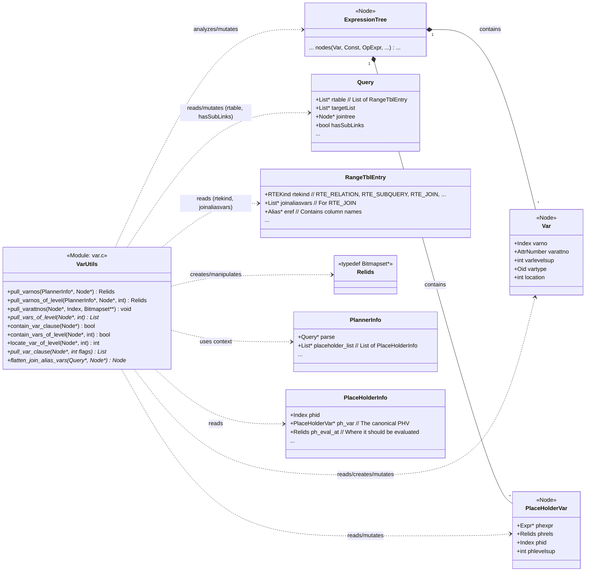

## AI辅助 PolarDB内核学习 - 52 优化器辅助功能模块(util) 核心代码 var.c      
      
### 作者      
digoal      
      
### 日期      
2025-04-10      
      
### 标签      
PostgreSQL , PolarDB , DuckDB , AI , 内核 , 学习 , util , 优化器 , 辅助功能模块      
      
----      
      
## 背景      
      
## 解读 优化器辅助功能模块(util) 核心代码 var.c      
      
好的，我们来解读一下 PostgreSQL 的 `src/backend/optimizer/util/var.c` 文件。  
  
**代码作用概述**  
  
`var.c` 文件包含了一系列用于处理 PostgreSQL 查询优化器内部 **`Var` 节点** 的工具函数。`Var` 节点是表达式树中的基本构建块，代表着对表列（或其别名）的引用。此文件中的函数主要用于：  
  
1.  **分析表达式树：** 提取表达式中引用的变量信息，例如它们属于哪个关系（`varno`）、哪个列（`varattno`）、以及它们位于哪个查询嵌套层级（`varlevelsup`）。  
2.  **检查存在性：** 判断表达式中是否包含特定层级或任何层级的变量。  
3.  **转换变量引用：** 最关键的是 `flatten_join_alias_vars` 函数，它负责将指向 JOIN（连接）操作结果列的 `Var` 引用，替换为指向原始基表列的引用。这是实现**谓词下推 (Predicate Pushdown)** 等优化的重要步骤。  
  
代码注释中提到，`PlaceHolderVar` (占位符变量，通常用于延迟计算的表达式) 和 `CurrentOfExpr` (用于 `WHERE CURRENT OF cursor`) 在某些分析场景下也被视为 `Var` 对待。  
  
**多角度解读**  
  
---  
  
**1. 数据库内核开发者 (Kernel Developer)**  
  
* **核心数据结构:** 内核开发者关注 `Var` 结构 (定义在 `nodes/primnodes.h`) 的字段：  
    * `varno`: 范围表索引 (Range Table Index)，标识变量所属的关系 (表、视图、子查询、连接等)。  
    * `varattno`: 属性编号 (Attribute Number)，标识关系中的具体列。`InvalidAttrNumber` (0) 表示整行引用。系统列有负数编号。  
    * `vartype`/`vartypmod`/`varcollid`: 变量的数据类型、类型修饰符和排序规则。  
    * `varlevelsup`: 查询嵌套层级。0 表示当前查询层级，1 表示上一层查询，以此类推。这是处理相关子查询的关键。  
    * `location`: 原始 SQL 语句中变量的位置，用于错误报告。  
* **`PlaceHolderVar (PHV)`:** 开发者需理解 PHV (`nodes/primnodes.h`) 的作用。它包含一个表达式 `phexpr` 和一个 `phrels` (表示该表达式依赖的基关系集合)。PHV 用于表示那些不能立即计算或需要推迟计算位置的表达式（常见于外连接）。`pull_varnos_walker` 中处理 PHV 的逻辑比较复杂，因为它需要根据 `PlannerInfo` 中的 `placeholder_list` 找到对应的 `PlaceHolderInfo`，并使用其 `ph_eval_at` 集合（表示 PHV 最终应该在哪个连接级别计算）来确定其依赖的 `varno`，而非简单使用 `phrels`。还需要处理 PHV 在父子表继承场景下被转换（translated）的情况。  
* **树遍历与上下文:** 代码大量使用递归树遍历函数（`expression_tree_walker`, `query_tree_walker`, `query_or_expression_tree_walker`）和修改函数（`expression_tree_mutator`, `query_tree_mutator`）。每个核心功能都有一个对应的 `_walker` 或 `_mutator` 静态函数，并通过一个 `context` 结构体传递状态（如目标 `levelsup`、收集到的 `Relids` 或 `List`）。  
* **`Relids` (Bitmapset):** `pull_varnos` 返回的是 `Relids` 类型，这是一个位图集合 (`Bitmapset`)，用于高效地存储和操作关系索引（varno）。  
* **`pull_varnos` vs. `pull_vars_of_level` vs. `pull_var_clause`:** 这些函数提供不同粒度的变量提取：  
    * `pull_varnos`: 提取指定层级的 `varno` 集合。  
    * `pull_vars_of_level`: 提取指定层级的 `Var` 和 `PHV` 节点本身（列表）。  
    * `pull_var_clause`: 根据标志位 (PVC_*) 提取 `Var`、`Aggref`、`WindowFunc` 或 `PHV` 节点，并控制是否递归进入它们的参数。这提供了最大的灵活性，用于特定的规划阶段（如聚合规划不允许在参数中找到聚合）。  
* **`flatten_join_alias_vars` (重点):**  
    * **动机:** JOIN 操作的结果在逻辑上是一个新的关系，其列是组成 JOIN 的关系的列的组合。初始查询树中可能包含直接引用这个 JOIN 结果列的 `Var`。然而，为了优化（如下推连接条件），需要将这些引用“扁平化”，即替换为对原始基表列的引用。  
    * **实现:**  
        1.  使用 `_mutator` 遍历表达式树。  
        2.  遇到 `Var` 节点时，检查其 `varno` 是否对应一个 JOIN 类型的范围表条目 (`rtekind == RTE_JOIN`) 并且 `varlevelsup` 匹配当前处理层级。  
        3.  如果是普通列引用 (`varattno > 0`)，则从 `rte->joinaliasvars` 列表中获取对应位置的表达式（这通常是来自 JOIN 输入关系的 `Var` 或更复杂的表达式），复制并替换原 `Var`。  
        4.  如果是整行引用 (`varattno == InvalidAttrNumber`)，则创建一个 `RowExpr` 节点，其参数列表是 `rte->joinaliasvars` 中所有非 NULL 表达式的（递归扁平化后的）副本。这对于执行器是必要的，因为它不能直接处理 JOIN 的整行引用。  
        5.  **层级调整:** 如果正在处理的表达式来自上层查询（`context->sublevels_up > 0`），则需要调用 `IncrementVarSublevelsUp` 来增加被替换进来的表达式中所有 `Var` 的 `varlevelsup`，以保持正确的跨层级引用。  
        6.  **递归:** 对替换进来的表达式递归调用 `flatten_join_alias_vars_mutator`，以处理嵌套 JOIN 的情况。  
        7.  **`hasSubLinks` 更新:** 如果 `joinaliasvars` 中包含 `SubLink` (子连接，即未规划的子查询表达式) 并且被替换进来，需要确保包含该表达式的 `Query` 节点的 `hasSubLinks` 标志被设置为 `true`。  
        8.  **`Relids` 更新 (`alias_relid_set`):** 在处理 `PlaceHolderVar` 等包含 `Relids` 集合的节点时，需要调用 `alias_relid_set` 将其中代表 JOIN 的 `varno` 替换为该 JOIN 对应的所有基表的 `varno` 集合。  
  
---  
  
**2. 架构师 (Architect)**  
  
* **模块定位:** `var.c` 是优化器 (`src/backend/optimizer/`) 的基础工具库，提供了对查询表达式中数据来源（变量）进行内省和转换的核心能力。它服务于优化器的多个阶段，包括预处理、连接规划、表达式简化等。  
* **核心价值 - 依赖分析:** 这些函数是进行数据依赖分析的基础。优化器需要知道一个表达式依赖于哪些关系和列，以便：  
    * 确定操作的合法性（如聚合函数参数不能包含外层变量）。  
    * 计算表达式可以在哪个阶段被求值（如确定 PlaceHolderVar 的 `ph_eval_at`）。  
    * 进行优化，如谓词下推。  
* **谓词下推的基石 (`flatten_join_alias_vars`):** 这个函数是实现谓词下推（将 `WHERE` 条件尽可能移动到靠近数据源的位置）的关键步骤。只有当条件表达式直接引用基表变量时，才能被推送到对应的扫描节点。通过将 JOIN 变量扁平化，原本看似与 JOIN 相关联的条件可能被识别为只与某个基表相关，从而实现下推。这是影响查询性能的关键优化之一。  
* **处理查询复杂性:** `varlevelsup` 的处理贯穿始终，体现了架构上对 SQL 嵌套查询和相关子查询的健壮支持。`PlaceHolderVar` 的复杂处理则展示了为支持外连接等高级特性而引入的架构元素。  
* **与执行器的关系:** `flatten_join_alias_vars` 中对整行引用的处理（转换为 `RowExpr`）直接影响了执行器接收到的计划。执行器能够处理 `RowExpr`，但通常不能直接处理指向 JOIN 的整行 `Var`。  
  
---  
  
**3. 用户 (应用开发者 / DBA)**  
  
* **SQL 映射:**  
    * `Var`: SQL 中的 `table.column`, `alias.column`, 或 `column`。  
    * `varlevelsup > 0`: 对应于相关子查询中对外层查询列的引用。例如 `SELECT e.name FROM employees e WHERE e.salary > (SELECT avg(salary) FROM employees WHERE department_id = e.department_id);` 中子查询里的 `e.department_id` 就是一个 `varlevelsup = 1` 的 `Var`。  
    * `varno`: 内部标识符，对应 `FROM` 子句中的表、别名或 JOIN。  
    * `varattno`: 内部标识符，对应列。  
* **谓词下推的影响 (`flatten_join_alias_vars`):** 这是用户能间接感受到的最重要的功能。假设查询：  
    ```sql  
    SELECT t1.a, t2.b  
    FROM table1 t1 JOIN table2 t2 ON t1.id = t2.fk  
    WHERE t1.x = 10 AND t2.y = 20;  
    ```  
    在内部，优化器可能会先构建一个表示 `t1 JOIN t2` 的中间结果，`WHERE` 子句最初可能引用这个中间结果的列。`flatten_join_alias_vars` 会将这些引用改写回 `t1.x` 和 `t2.y`。这使得优化器能够将 `t1.x = 10` 这个条件推到扫描 `table1` 的操作上，将 `t2.y = 20` 推到扫描 `table2` 的操作上。DBA 在 `EXPLAIN` 输出中会看到过滤条件出现在 `Seq Scan` 或 `Index Scan` 节点上，而不是在 `Join` 节点之后，这通常意味着更优的执行计划，因为它减少了需要连接的数据量。  
* **相关子查询的正确性:** `pull_varnos_of_level`, `contain_vars_of_level` 等函数确保了优化器能正确理解相关子查询的依赖关系，保证查询结果符合 SQL 语义。  
* **错误定位 (`locate_var_of_level`):** 如果用户写了一个语法正确但语义错误的查询，比如试图在不允许的地方使用相关变量（如聚合函数内直接使用外层变量），优化器在检查时会使用类似 `contain_vars_of_level` 的逻辑发现问题，并可能使用 `locate_var_of_level` 找到该变量在原始 SQL 中的位置，从而给出更精确的错误提示信息，帮助用户定位和修复问题。例如：“ERROR: aggregate function calls cannot contain variables from outer query level at character N”。  
  
---  
  
**代码逻辑与关联关系图示**  
  
**1. 关键数据结构与函数关系 (Mermaid Class Diagram)**  
  

  
**2. `flatten_join_alias_vars` 核心逻辑 (Mermaid Sequence Diagram - Simplified)**  
  
假设处理表达式 `j.col1 + 5`，其中 `j` 是 `t1 JOIN t2` 的别名，`col1` 来自 `t1`。  
  

  
**关键作用与例子**  
  
* **`pull_varnos(PlannerInfo *root, Node *node)`**  
    * **作用:** 收集表达式 `node` 中所有引用当前查询层级 (`levelsup == 0`) 的关系的 `varno` 集合。会考虑 `PlaceHolderVar` 的实际计算依赖关系 (`ph_eval_at`)。  
    * **例子:** 对于 `SELECT * FROM t1, t2 WHERE t1.a = t2.b AND t1.c > 5;`，在处理 `WHERE` 子句时调用 `pull_varnos(root, where_clause)` 会返回一个包含 `t1` 和 `t2` 对应 `varno` 的 `Relids` 集合（例如 `{1, 2}`）。这有助于判断该 `WHERE` 子句是连接条件还是单表过滤条件。  
  
* **`contain_vars_of_level(Node *node, int levelsup)`**  
    * **作用:** 检查表达式 `node` 中是否包含引用指定 `levelsup` 层级的 `Var` 或 `PHV`。会递归进入子查询。  
    * **例子:** 在判断一个子查询是否为相关子查询时使用。`SELECT ... FROM t1 WHERE t1.x IN (SELECT t2.y FROM t2)`，对子查询调用 `contain_vars_of_level(subquery_node, 1)` 会返回 `false`（不相关）。如果是 `(SELECT t2.y FROM t2 WHERE t2.z = t1.z)`，则会返回 `true`（相关）。  
  
* **`flatten_join_alias_vars(Query *query, Node *node)` (重点详解)**  
    * **作用:** 将表达式 `node` 中对 JOIN 输出列的引用 (`Var` 节点) 替换为对构成该 JOIN 的原始基表列的引用。同时处理整行引用，并更新相关节点的 `Relids`。这是优化器进行谓词下推等操作的基础。  
    * **必要性:** 如果没有这个扁平化过程，形如 `WHERE join_alias.column = constant` 的条件就无法被推送到 `join_alias` 的某个输入表的扫描操作上，因为该条件引用的是 JOIN 的输出，而不是基表的输入。执行器也难以直接处理对 JOIN 的整行引用。  
    * **例子 1 (谓词下推):**  
        ```sql  
        -- Query:  
        SELECT j.a, j.b FROM (t1 JOIN t2 ON t1.id = t2.fk) AS j WHERE j.x > 10;  
        -- Assume j.x comes from t1.x  
        ```  
        初始 `WHERE` 子句是 `Var(j, x) > 10`。`flatten_join_alias_vars` 将 `Var(j, x)` 替换为 `Var(t1, x)`。现在 `WHERE` 子句变为 `Var(t1, x) > 10`，优化器可以轻易识别出这是一个关于 `t1` 的过滤条件，并将其下推到对 `t1` 的扫描计划节点上。  
    * **例子 2 (整行引用):**  
        ```sql  
        -- Query:  
        SELECT j FROM (t1 JOIN t2 ON t1.id = t2.fk) AS j;  
        -- Assume t1 has cols (id, x), t2 has cols (fk, y)  
        ```  
        初始目标列表是 `Var(j, InvalidAttrNumber)`。`flatten_join_alias_vars` 将其替换为 `RowExpr(args=[Var(t1, id), Var(t1, x), Var(t2, fk), Var(t2, y)], ...)`。这样执行器就能按顺序计算每个字段来构造行。  
    * **例子 3 (嵌套 JOIN):**  
        ```sql  
        -- Query:  
        SELECT jj.a FROM ((t1 JOIN t2 ON ...) AS j1 JOIN t3 ON ...) AS jj WHERE jj.b = 5;  
        -- Assume jj.b comes from j1.b, which in turn comes from t2.b  
        ```  
        `flatten_join_alias_vars` 会递归处理：  
        1.  `Var(jj, b)` 被替换为 `Var(j1, b)` (或 `Var(t3,b)`)。  
        2.  假设是 `Var(j1, b)`，再次调用 `flatten_join_alias_vars`，将其替换为 `Var(t1, b)` 或 `Var(t2, b)`。  
        3.  最终 `WHERE` 子句中的引用指向了基表 `t1` 或 `t2` 或 `t3` 的列。  
    * **影响:** 此函数是查询优化中的关键步骤，直接影响最终生成的计划树结构和性能。通过使得条件能更早地被应用，大大减少后续操作（尤其是 JOIN）需要处理的数据量。  
  
总结来说，`var.c` 提供了处理 PostgreSQL 中变量表示的基础工具，其核心功能，特别是 `flatten_join_alias_vars`，对于实现高效的查询计划（如通过谓词下推）至关重要。  
      
## 提示      
```      
解读下面的代码. 先用几句话阐述代码作用, 然后从数据库内核开发者、架构师、用户(应用开发者和DBA)多个角度通熟易懂的解读这个代码, 使用sequence、mermaid等图表勾勒代码内部的逻辑、与其他代码文件之间的关联关系, 使用恰当的例子来解释代码的关键作用. 关键内容务必要深入重点详细解释.      
$代码内容      
```      
      
## PolarDB & PostgreSQL 15 差异      
```      
git diff -u 50d3d22baba63613d1f1406b2ed460dc9b03c3fc f5e7493819e370d30ac2047c68c21c9fb03ce4a0 -- src/backend/optimizer/util/var.c      
```      
      
差异分析待补充.      
      
<b> 以上内容基于DeepSeek、QwQ及诸多AI生成, 轻微人工调整, 感谢杭州深度求索人工智能、阿里云等公司. </b>      
      
<b> AI 生成的内容请自行辨别正确性, 当然也多了些许踩坑的乐趣, 毕竟冒险是每个男人的天性.  </b>      
      
      
  
#### [期望 PostgreSQL|开源PolarDB 增加什么功能?](https://github.com/digoal/blog/issues/76 "269ac3d1c492e938c0191101c7238216")
  
  
#### [PolarDB 开源数据库](https://openpolardb.com/home "57258f76c37864c6e6d23383d05714ea")
  
  
#### [PolarDB 学习图谱](https://www.aliyun.com/database/openpolardb/activity "8642f60e04ed0c814bf9cb9677976bd4")
  
  
#### [PostgreSQL 解决方案集合](../201706/20170601_02.md "40cff096e9ed7122c512b35d8561d9c8")
  
  
#### [德哥 / digoal's Github - 公益是一辈子的事.](https://github.com/digoal/blog/blob/master/README.md "22709685feb7cab07d30f30387f0a9ae")
  
  
#### [About 德哥](https://github.com/digoal/blog/blob/master/me/readme.md "a37735981e7704886ffd590565582dd0")
  
  

  
