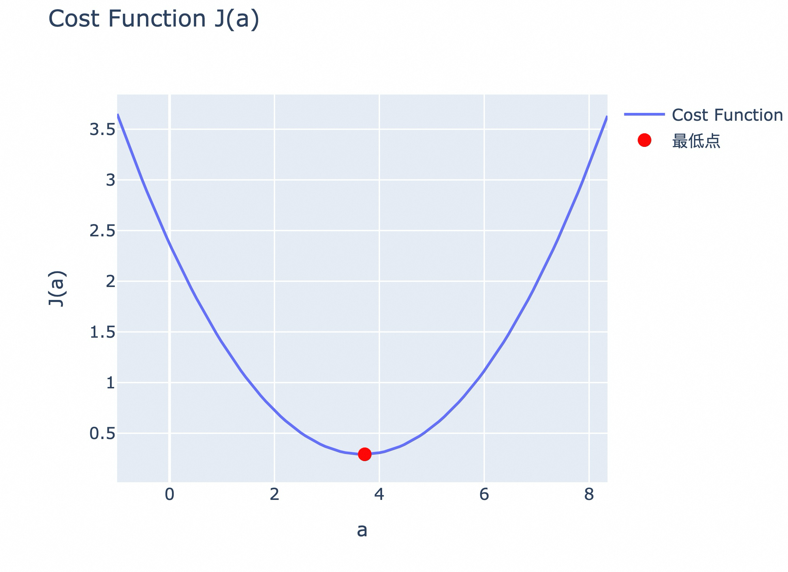
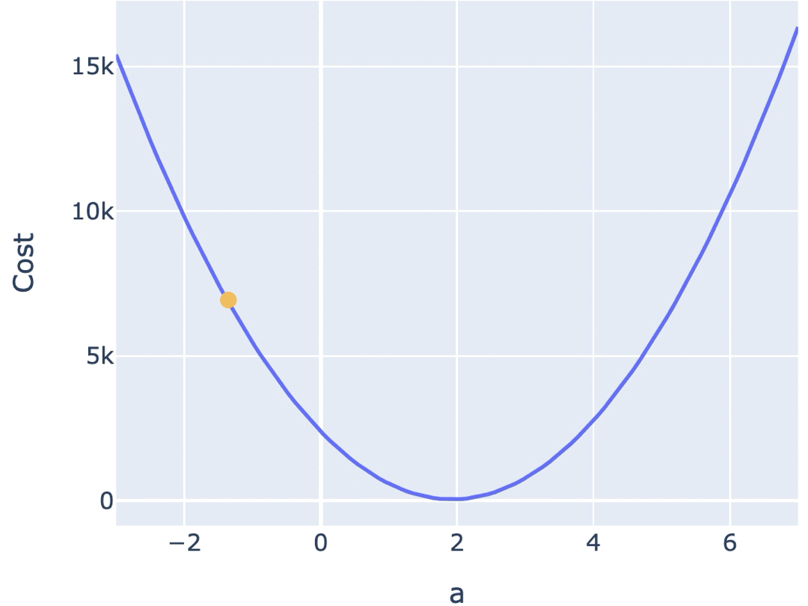
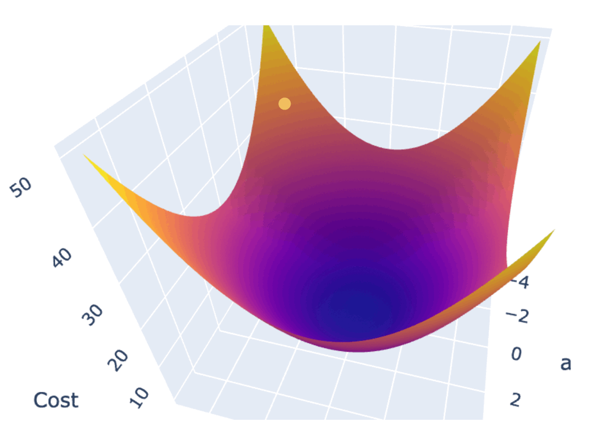
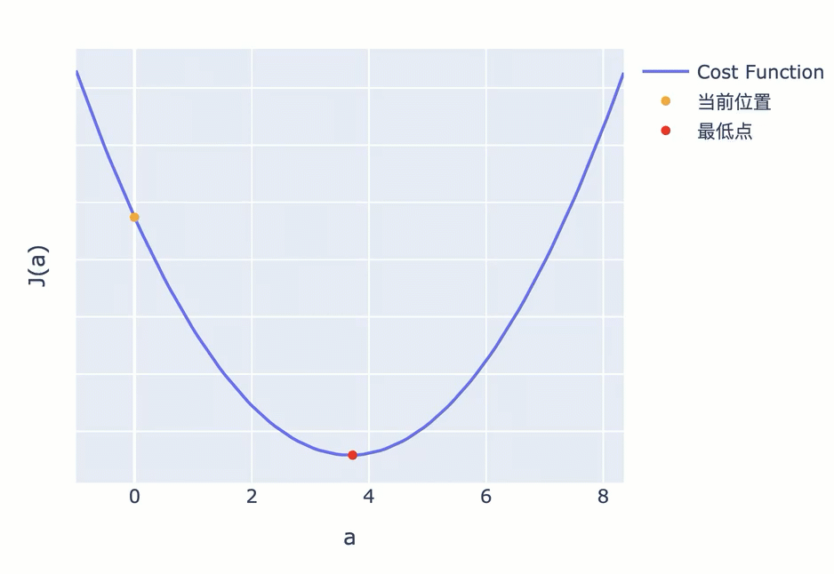

## 大模型微调之 - learning rate 设置原理  
                                                                                      
### 作者                                                          
digoal                                                          
                                                                 
### 日期                                                               
2025-04-12                                                         
                                                              
### 标签                                                            
PostgreSQL , PolarDB , DuckDB , AI , 微调 , 学习率 , 梯度下降 , 损失函数 , 训练损失 , 验证损失 , 过拟合 , 欠拟合 , learning rate      
                                                                                     
----                                                              
                                                                            
## 背景   
  
大模型微调的目的是通过监督学习来调整模型参数, 让模型在训练集和验证集上的预测结果无限逼近正确结果, 也就是算出让train loss和valid loss最低的参数.   
  
为了评估模型在整个训练集上的表现，你可以计算所有样本的损失平均值（即均方误差，Mean Squared Error，MSE）。这种用于评估模型在所有训练样本上的整体表现的函数，被称为 Cost Function（代价函数，或成本函数）。寻找最优解的任务，其实就是寻找曲线或曲面的最低点。  
  
  
  
梯度下降法是常用的求最优解的方法. 一种常见的梯度下降算法实现是，先在曲面（或曲线）上随机选择一个起点，然后通过不断小幅度调整参数，最终找到最低点（对应最优参数配置）。  
  
  
  
  
  
在数学中，梯度指向了以曲面上的某个点为起点，上升最快的方向，其反方向则是下降最快的方向。  
  
为了在最短时间内找到曲面最低点，调整参数的方向，应该朝着梯度的反方向。  
- 对于二维坐标系的曲线 f(a)，某点的梯度就是该点的斜率。  
- 对于三维坐标系里的曲面 f(a,b)，某点的梯度是由该点在 a、b 轴方向上的斜率值组成的二维向量。这表明了函数在各个输入变量方向上的变化率，并指向了增长最快的方向。计算曲面上一个点在某一个轴方向上的斜率的过程，也被称为求偏导。  
  
确定了调整参数的方向后，需要确定调整参数的幅度。  
  
按照固定步长调整参数，是最容易想到的办法，但这可能会导致你始终无法找到最低点，而是在最低附近震荡。  
  
比如下图，你按照固定步长为 1.5 来调整参数，就会出现在最低值附近反复震荡，无法进一步逼近最低点的情况。  
  
  
  
为了避免这一问题，接近最低点时，应该调低调整幅度。越接近最低点，斜率会越小，因此你可以不再使用固定步长，而是使用当前位置的斜率作为调整幅度。  
  
但也有些 Cost Function 曲线非常陡峭，直接使用斜率也可能导致你跨过最低点反复震荡。为此，你可以使用斜率的同时，对斜率乘以一个系数，来调节步长。这个系数，被称为 Learning Rate（学习率）。  
  
     
  
较小的学习率，虽然会让你耗费很多计算资源和时间，但其实有助于你更加逼近最低点。实际的模型训练工程中，也会尝试动态地调整学习率。比如百炼的模型微调功能中，提供了学习率调整策略，它允许你配置学习率线性递减、或者按照曲线来递减。阿里云的 PAI 还提供了 AutoML 工具，它可以帮助你自动找到更合适的 Learning Rate。  
  
## 参考  
`aliyun_acp_learning/大模型ACP认证教程/p2_构造大模型问答系统  
/2_7_通过微调提升模型的准确度与效率.ipynb`  
- https://github.com/AlibabaCloudDocs/aliyun_acp_learning/blob/main/%E5%A4%A7%E6%A8%A1%E5%9E%8BACP%E8%AE%A4%E8%AF%81%E6%95%99%E7%A8%8B/p2_%E6%9E%84%E9%80%A0%E5%A4%A7%E6%A8%A1%E5%9E%8B%E9%97%AE%E7%AD%94%E7%B3%BB%E7%BB%9F/2_7_%E9%80%9A%E8%BF%87%E5%BE%AE%E8%B0%83%E6%8F%90%E5%8D%87%E6%A8%A1%E5%9E%8B%E7%9A%84%E5%87%86%E7%A1%AE%E5%BA%A6%E4%B8%8E%E6%95%88%E7%8E%87.ipynb  
  
     
  
#### [期望 PostgreSQL|开源PolarDB 增加什么功能?](https://github.com/digoal/blog/issues/76 "269ac3d1c492e938c0191101c7238216")
  
  
#### [PolarDB 开源数据库](https://openpolardb.com/home "57258f76c37864c6e6d23383d05714ea")
  
  
#### [PolarDB 学习图谱](https://www.aliyun.com/database/openpolardb/activity "8642f60e04ed0c814bf9cb9677976bd4")
  
  
#### [PostgreSQL 解决方案集合](../201706/20170601_02.md "40cff096e9ed7122c512b35d8561d9c8")
  
  
#### [德哥 / digoal's Github - 公益是一辈子的事.](https://github.com/digoal/blog/blob/master/README.md "22709685feb7cab07d30f30387f0a9ae")
  
  
#### [About 德哥](https://github.com/digoal/blog/blob/master/me/readme.md "a37735981e7704886ffd590565582dd0")
  
  

  
