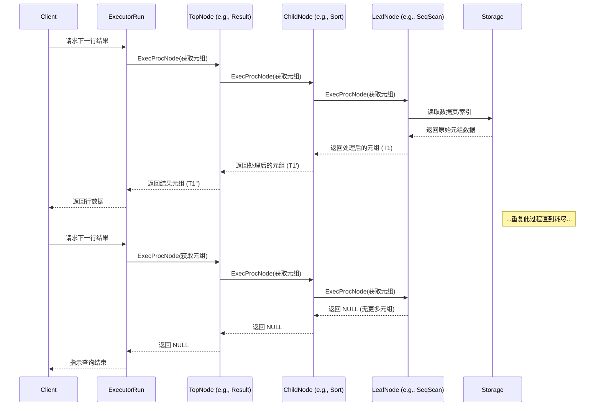
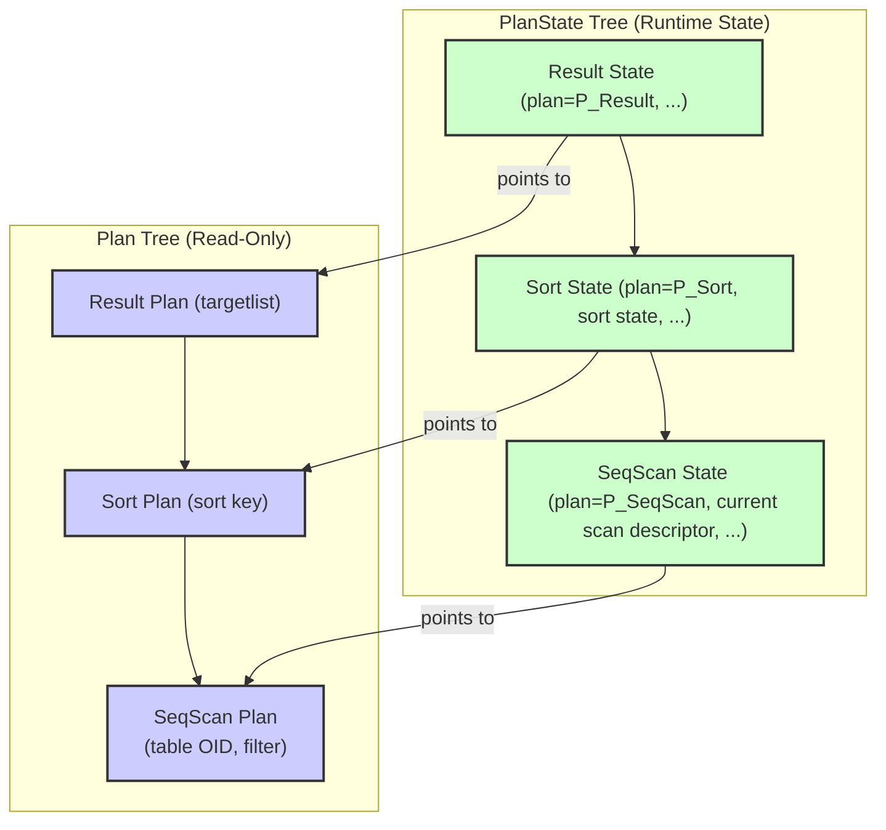

## AI辅助 PolarDB内核学习 - 53 执行器 (Executor) 概览  
  
### 作者  
digoal  
  
### 日期  
2025-04-14  
  
### 标签  
PostgreSQL , PolarDB , DuckDB , AI , 内核 , 学习 , Executor , 执行器  
  
----  
  
## 背景  
  
## 解读 执行器 (Executor) 概览  
好的，我们来详细解读一下 PostgreSQL `src/backend/executor` 代码目录的顶层设计，并从不同角度进行分析。  
  
## PostgreSQL Executor 顶层设计解读  
  
PostgreSQL 的执行器（Executor）是数据库查询处理流程中的核心组件。在查询优化器（Planner）生成最优的执行计划（Plan Tree）之后，执行器负责按照这个计划实际地获取和处理数据，最终产生查询结果。  
  
### 核心模型：需求驱动的元组处理管道 (Demand-Pull Pipeline)  
  
执行器的基本工作模式可以理解为一个“需求驱动的管道”。想象一条装配线：  
  
1.  **最终产品需求：** 用户（或上层调用者）向执行器的最顶层节点请求一个元组（一行数据）。  
2.  **逐级请求：** 该顶层节点为了能生产出这个元组，会向它的子节点请求所需的输入元组。  
3.  **传递需求：** 这个请求会沿着执行计划树（Plan Tree）向下传递，直到叶子节点（通常是表扫描节点，如顺序扫描、索引扫描）。  
4.  **生产与回传：** 叶子节点从存储层（如表或索引）获取原始数据，生成一个元组，并将其向上传递给请求它的父节点。  
5.  **处理与转换：** 中间节点（如连接、排序、聚合节点）接收到子节点的元组后，会进行相应的处理（例如，连接两个元组、根据聚合函数累加、排序等），然后将处理后的结果元组向上传递给它们的父节点。  
6.  **最终产出：** 这个过程持续进行，直到顶层节点能够根据收到的子节点元组生成一个最终结果元组，并返回给最初的请求者。  
7.  **重复或结束：** 上层调用者可以继续请求下一个元组，重复这个过程，直到顶层节点返回 NULL（或一个特殊标记），表示没有更多的元组可以生成。  
  
**Sequence Diagram 示例 (简化)**  
  

  
这种模型的**优点**在于：  
  
* **内存效率：** 一次通常只处理一个或一小批元组，不需要将所有中间结果都存储在内存中（除非节点特性要求，如排序或哈希连接）。  
* **流式处理：** 结果可以尽快地流向上层，用户可以更快地看到第一批结果，特别适用于 LIMIT 查询。  
* **模块化：** 每个计划节点（Plan Node）实现一个特定的操作，易于扩展和维护。  
  
### 关键设计一：计划树 (Plan Tree) 与 状态树 (PlanState Tree) 的分离  
  
这是一个非常重要的设计决策。优化器生成的是一个由 `Plan` 节点组成的树（Plan Tree），这个树在执行器执行期间是**只读**的。  
  
在执行器初始化阶段 (`ExecutorStart` -> `ExecInitNode`)，会根据 Plan Tree 构建一个结构完全相同（或近似，考虑分区裁剪等优化）的**并行树**，由 `PlanState` 节点组成（State Tree）。  
  
* `Plan` 节点：包含执行该步骤所需的静态信息，如表 OID、要应用的条件（表达式树）、目标列（表达式树）等。它是**无状态**的，只读的。  
* `PlanState` 节点：包含执行该步骤所需的**运行时状态**信息，如指向其对应 `Plan` 节点的指针、指向子 `PlanState` 节点的指针（或数组）、当前处理的元组、缓冲区、排序状态、哈希表、聚合累加值等等。所有在执行过程中需要修改的数据都在 `PlanState` 节点中。  
  
**Mermaid Diagram 示例 (Plan vs PlanState)**  
  

  
**分离的好处：**  
  
1.  **计划缓存与重用：** 由于 Plan Tree 是只读的，同一个查询计划可以被多个后端进程安全地重用（例如通过 `PREPARE` 语句缓存计划），只需为每次执行创建新的 PlanState Tree 即可。这大大减少了重复的查询优化开销。  
2.  **简化状态管理：** 执行过程中的所有动态变化都封装在 State Tree 中，使得状态的初始化、重置（Rescan）、清理（End）更加清晰。  
3.  **并发安全：** 只读的 Plan Tree 本身是线程/进程安全的。  
  
### 关键设计二：表达式计算 (Expression Evaluation) 的架构  
  
查询计划中的很多部分都涉及表达式计算，例如 `WHERE` 子句的过滤条件、`SELECT` 列表的计算、连接条件等。这些表达式在 Plan Tree 中也表示为树状结构（`Expr` 节点树）。  
  
然而，执行器**并不**为每个 `Expr` 节点都创建一个对应的 `ExprState` 节点来镜像树结构。相反，它采用了一种**扁平化、线性化的表示**：  
  
1.  **ExprState 节点：** 每个需要独立计算的表达式树（如一个 `WHERE` 条件、一个 `SELECT` 列的计算）对应一个 `ExprState` 节点。  
2.  **ExprEvalStep 数组：** `ExprState` 内部包含一个 `ExprEvalStep` 结构的**平面数组** (`steps[]`)。每个 `ExprEvalStep` 代表表达式计算中的一个原子操作。  
3.  **操作码 (Opcode)：** 每个 `ExprEvalStep` 有一个操作码 (`ExprEvalOp`)，指示它执行什么操作（如获取变量值、执行函数调用、执行操作符、进行布尔逻辑判断、赋值等）。  
4.  **结果存储：** 每个步骤将其结果（一个 Datum 值和一个 null 标志）存储在由 `resvalue`/`resnull` 指针指定的位置。  
5.  **线性执行：** 计算表达式时，执行器（通常是 `ExecInterpExpr` 函数）按顺序遍历 `steps[]` 数组，执行每个步骤的操作。  
  
**例子：计算 `WHERE col1 + 5 > col2`**  
  
这个表达式在 Plan Tree 中可能是这样的：  
`OpExpr (>)`  
`--> OpExpr (+)`  
`    --> Var (col1)`  
`    --> Const (5)`  
`--> Var (col2)`  
  
在 `ExecInitExpr` 初始化后，生成的 `ExprState->steps[]` 可能（概念上）是这样的：  
  
| 步骤 | Opcode             | 操作/说明                                         | 结果存储位置                                 |  
| :--- | :----------------- | :------------------------------------------------ | :------------------------------------------- |  
| 0    | `EEOP_INNER_FETCHSOME` | (如果需要) 确保 `col1`, `col2` 可用                | -                                            |  
| 1    | `EEOP_INNER_VAR`   | 获取 `col1` 的值                                    | 临时变量 `tmp1`                              |  
| 2    | `EEOP_CONST`       | 获取常量 `5` 的值                                   | 临时变量 `tmp2`                              |  
| 3    | `EEOP_FUNCEXPR`    | 调用 `+` 函数（`int4pl`），输入 `tmp1`, `tmp2`     | 临时变量 `tmp3` (加法结果)                 |  
| 4    | `EEOP_INNER_VAR`   | 获取 `col2` 的值                                    | 临时变量 `tmp4`                              |  
| 5    | `EEOP_FUNCEXPR`    | 调用 `>` 函数（`int4gt`），输入 `tmp3`, `tmp4`     | `ExprState->resvalue`/`resnull` (最终布尔结果) |  
| 6    | `EEOP_DONE`        | 标记表达式计算结束                                | -                                            |  
  
**扁平化表示的好处：**  
  
1.  **性能：**  
    * 避免了递归树遍历的开销（函数调用、栈消耗）。  
    * 线性数组访问通常比指针追逐更快（缓存友好）。  
    * 可以通过 JIT (Just-In-Time) 编译将 `steps[]` 转换成更高效的机器码。  
2.  **灵活性：** 同一套 `ExprState` 结构可以支持解释执行 (`ExecInterpExpr`) 和 JIT 编译执行。  
3.  **预计算：** `ExecInitExpr` 在初始化阶段可以进行大量的预处理和检查，将复杂性移出执行阶段，使得每次计算更轻量。例如，确定域约束检查所需的函数。  
  
### DML 操作处理 (ModifyTable Node)  
  
对于 `INSERT`, `UPDATE`, `DELETE`, `MERGE` 操作，执行计划的顶层通常是一个 `ModifyTable` 节点。  
  
* **输入：** 它从其子计划节点接收元组。  
* **`INSERT`：** 子计划提供要插入的新元组。`ModifyTable` 直接将这些元组插入目标表。  
* **`UPDATE`：** 子计划提供更新后的列值，以及一个或多个 **"垃圾列" (junk columns)** ，通常是 `ctid` (行物理位置标识符)，用于唯一标识要更新的 **旧行** 。`ModifyTable` 需要：  
    1.  使用垃圾列（如 `ctid`）找到目标表中的原始行。  
    2.  （在 `READ COMMITTED` 模式下可能需要 `EvalPlanQual` 检查并发更新，见下文）。  
    3.  从原始行中获取未被更新的列的值。  
    4.  将新列值和未更新列的值组合成一个完整的新版本元组。  
    5.  执行实际的更新操作（通常是删除旧行版本，插入新行版本）。  
* **`DELETE`：** 子计划通常只需要提供标识要删除行的垃圾列（如 `ctid`）。`ModifyTable` 找到对应的行并标记删除（或实际删除）。  
* **`MERGE`：** 这是最复杂的情况。  
    1.  优化器将 `MERGE` 转换成目标表和源表之间的连接（通常是外连接，如果存在 `WHEN NOT MATCHED`）。连接结果包含来自源表的数据和目标表的行标识垃圾列。  
    2.  `ModifyTable` 接收连接结果元组。  
    3.  如果目标表垃圾列为 NULL，表示源行在目标表中没有匹配，则依次检查 `WHEN NOT MATCHED` 条件，执行第一个满足条件的 `INSERT` 或 `DO NOTHING` 动作。  
    4.  如果目标表垃圾列不为 NULL，表示找到了匹配的目标行。`ModifyTable` 会获取该目标行，然后依次检查 `WHEN MATCHED` 条件（条件可能同时依赖源行和目标行数据），执行第一个满足条件的 `UPDATE`, `DELETE`, 或 `DO NOTHING` 动作。  
    5.  处理 `WHEN MATCHED` 时，如果目标行被并发更新或删除，需要使用 `EvalPlanQual` 重新检查并获取最新版本。  
* **`RETURNING` 子句：** 如果 DML 语句包含 `RETURNING`，`ModifyTable` 节点负责计算 `RETURNING` 表达式，并将结果作为其自身的输出元组返回给上层（最终返回给客户端）。如果 DML 没有 `RETURNING`，`ModifyTable` 通常不返回任何元组（只返回操作计数值）。  
  
### 并发控制：EvalPlanQual (READ COMMITTED 模式下的更新检查)  
  
在 `READ COMMITTED` 隔离级别下，当一个 `UPDATE`, `DELETE`, `MERGE` 或 `SELECT FOR UPDATE/SHARE` 语句试图修改或锁定一行时，如果发现这行**刚好**被另一个并发事务提交了修改，不能直接失败（像 `SERIALIZABLE` 那样），也不能直接操作这个“旧”版本。  
  
`EvalPlanQual` 机制被用来处理这种情况：  
  
1.  **检测冲突：** 执行器在尝试获取行锁或更新/删除行时，发现行已被并发修改（通过比较 `xmin`/`xmax` 等事务信息）。  
2.  **等待并获取新版本：** 等待并发事务提交，然后获取该行最新的已提交版本。  
3.  **重新评估资格 (Re-check Qualifications)：** 关键步骤！执行器需要重新运行查询的部分逻辑（特别是过滤条件 `WHERE` 和连接条件），但这次是**针对这个新版本的行**，以及查询中涉及的其他表的**原始行**（通过 `TID` 或缓存的值来确保一致性）。  
4.  **决策：**  
    * 如果新版本的行**仍然满足**查询的原始条件，那么就基于这个新版本执行 `UPDATE`（重新计算目标列）、`DELETE` 或 `LOCK` 操作。  
    * 如果新版本的行**不再满足**查询条件，那么就放弃对这一行的操作，继续处理查询中的下一行。  
  
这个过程确保了 `READ COMMITTED` 的语义：只处理在语句开始时可见且在处理时仍然满足条件的行（的最新版本）。实现上，这通常涉及在一个特殊的上下文中重新执行部分计划子树。  
  
### 异步执行 (Asynchronous Execution)  
  
为了提高涉及外部等待（如 `ForeignScan` 等待网络 I/O）的查询性能，特别是当这些节点位于 `Append` 或 `MergeAppend` 节点下时，PostgreSQL 支持异步执行。  
  
* **动机：** 当 `Append` 节点下的一个子节点（如 `ForeignScan`）因为等待 I/O 而阻塞时，串行执行模型会导致整个查询停滞。异步执行允许执行器在等待一个子节点时，去执行其他可以立即产生数据的子节点。  
* **机制：**  
    1.  `Append` 节点使用 `ExecAsyncRequest` 向支持异步的子节点（如 `ForeignScan`）请求元组。  
    2.  异步子节点（`ForeignScan`）如果不能立即提供元组，会调用 `ExecAsyncRequestPending` 注册一个回调，并告诉 `Append` 它需要等待某个文件描述符（通过 `ExecAsyncConfigureWait` 回调）。  
    3.  `Append` 节点调用 `ExecAppendAsyncEventWait` 进入事件循环，等待任何一个子节点的文件描述符就绪。  
    4.  当文件描述符就绪，事件循环调用异步子节点的 `ExecAsyncNotify` 回调。  
    5.  `ExecAsyncNotify` 回调（通常在收到网络数据后）处理数据，如果准备好了元组，就调用 `ExecAsyncRequestDone` 将元组传递回 `Append` 节点（通过 `ExecAsyncResponse` 接收）。  
    6.  `Append` 节点收到元组后，返回给上层，或者继续事件循环/请求其他子节点。  
  
这使得 `Append` 可以并发地驱动多个子计划，只要有一个子计划能产生数据，查询就能继续进行，从而掩盖 I/O 延迟。  
  
### 内存管理  
  
* **Per-Query Context：** 在 `ExecutorStart` 时创建，整个查询执行期间（包括所有 PlanState、ExprState 等）分配的内存都在这个上下文中或其子上下文中。查询结束时 (`ExecutorEnd` -> `FreeExecutorState`)，直接销毁这个上下文，可以高效、无泄漏地释放所有内存。  
* **Per-Tuple Context：** 大多数 PlanState 节点都有自己的 `ExprContext`，其中包含一个 "per-tuple" 内存上下文。这个上下文通常在处理完**每个元组**后被重置 (`ResetExprContext`)。这用于存储评估表达式时产生的临时数据（如 Datum 拷贝、展开的数组等），确保处理下一个元组前这些临时内存被释放，防止在查询执行过程中内存不断累积。  
  
## 多角度解读  
  
### 数据库内核开发者角度  
  
* **模块化与扩展性：** 执行器节点（`node*.c`）的设计是高度模块化的。添加新的扫描方式、连接算法或处理节点，主要是实现对应节点的 `Plan` 和 `PlanState` 结构，以及初始化 (`ExecInit*`)、执行 (`Exec*`)、结束 (`ExecEnd*`)、重扫 (`ExecReScan*`) 等核心函数。遵循 demand-pull 模型是关键。  
* **性能优化点：**  
    * 表达式计算的扁平化表示和 JIT 编译是关键性能优化。`execExprInterp.c` 中的解释器循环需要高度优化。  
    * `ModifyTable` 中减少行获取次数、优化垃圾列处理。  
    * `EvalPlanQual` 的效率，如何最小化重新检查的开销。  
    * 异步执行的事件循环和回调机制的效率。  
    * 内存管理，减少 `palloc`/`pfree` 开销，合理使用 per-tuple context。  
* **状态管理：** `PlanState` 的正确初始化、重置和清理至关重要，尤其是在涉及排序、哈希表、物化等需要大量状态的节点中。  
* **代码复杂度：** 表达式初始化 (`ExecInitExpr`) 和 `EvalPlanQual` 的逻辑相对复杂，需要仔细处理各种边界情况和并发交互。`MERGE` 的实现也相当复杂。  
  
### 架构师角度  
  
* **关注点分离：** Plan Tree (逻辑计划表示) 与 PlanState Tree (运行时状态) 的分离是优秀的设计，促进了可重用性、可测试性和并发安全。  
* **数据流模型：** Demand-pull 模型清晰且内存高效，但也意味着某些操作（如需要看到所有输入的排序、聚合）必须包含物化步骤。  
* **接口定义：** 每个 Plan Node 类型遵循一组标准的接口函数 (`ExecInit`, `ExecProcNode`, `ExecEnd`, `ExecReScan`)，使得系统易于理解和扩展。  
* **表达式计算引擎：** 拥有一个独立、可插拔（解释器/JIT）的表达式计算引擎是明智的，可以将这部分性能优化独立出来。  
* **并发处理：** `EvalPlanQual` 是保证 `READ COMMITTED` 语义的核心，但其性能影响需要在架构层面考虑。异步执行是应对 I/O 密集型查询的重要补充。  
* **资源管理：** 统一的 Per-Query 内存上下文和 Per-Tuple 上下文机制简化了资源管理，防止内存泄漏。  
  
### 用户 (应用开发者/DBA) 角度  
  
* **理解 `EXPLAIN`：** `EXPLAIN` 输出的计划树直接反映了执行器将要执行的操作序列。理解各个节点（Seq Scan, Index Scan, Hash Join, Sort, Aggregate 等）的工作方式有助于分析查询性能瓶颈。例如，看到 Sort 节点意味着执行器需要读取所有子节点输出并排序，这可能是内存或 I/O 密集型操作。  
* **性能调优：**  
    * 知道表达式是被解释执行还是 JIT 编译（取决于配置和表达式复杂度），可能影响复杂计算的性能。  
    * 理解 `ModifyTable` 的工作方式，特别是 `UPDATE` 需要读旧行写新行，有助于理解其开销。`RETURNING` 子句也有其成本。  
    * 意识到 `READ COMMITTED` 下的并发更新可能触发 `EvalPlanQual`，导致额外的检查开销，这可能在高并发冲突场景下影响性能。  
    * 知道 `Append` 节点（常用于 `UNION ALL` 或分区表）可以利用异步执行来提高 I/O 并行度。  
* **查询行为：** Demand-pull 模型意味着 `LIMIT` 查询通常可以很快返回第一批结果，因为执行器不需要处理完所有数据。  
* **资源消耗：** 复杂查询或处理大量数据的查询会消耗更多内存（尤其是有排序、哈希、物化节点的计划），理解 Per-Query 和 Per-Tuple 内存上下文有助于排查内存相关问题。  
  
## `executor` 目录 C 文件作用解释  
  
以下是对列出的 C 文件主要作用的解释（基于文件名和通用认知，可能有个别细节偏差）：  
  
**核心执行逻辑与流程控制:**  
  
* `execMain.c`: 执行器的主要入口点 (`ExecutorStart`, `ExecutorRun`, `ExecutorFinish`, `ExecutorEnd`) 和相关的顶层管理函数，如创建和销毁执行状态 (`CreateExecutorState`, `FreeExecutorState`)。  
* `execProcnode.c`: 包含核心的 `ExecProcNode` 函数，它是执行计划节点的主执行函数（递归驱动 demand-pull 流程的地方）。也可能包含一些通用的节点处理逻辑。  
* `execCurrent.c`: 处理 `UPDATE/DELETE ... WHERE CURRENT OF <cursor>` 相关的逻辑。  
* `execReplication.c`: 处理与逻辑复制相关的执行器逻辑（如应用 WAL 记录）。  
* `execParallel.c`: 支持并行查询执行的协调和管理逻辑。  
  
**表达式计算:**  
  
* `execExpr.c`: 表达式计算状态 (`ExprState`) 的初始化 (`ExecInitExpr`)、准备 (`ExecReadyExpr`) 和相关辅助函数。包含将 `Expr` 树转换为 `ExprEvalStep` 数组的核心逻辑 (`ExecInitExprRec`)。  
* `execExprInterp.c`: 表达式的解释执行引擎 (`ExecInterpExpr`)，逐条执行 `ExprEvalStep`。包含各种 `EEOP_*` 操作码的具体实现（或调用辅助函数）。  
  
**元组处理与管理:**  
  
* `execTuples.c`: 处理元组表槽 (`TupleTableSlot`) 的函数，包括创建、释放、物化元组、拷贝元组等。元组是执行器中数据流的基本单位。  
* `execJunk.c`: 处理 "垃圾属性" (junk attributes)，如 `ctid`、`oid` 等，这些属性在查询执行中有用（如 `UPDATE`/`DELETE` 定位行），但通常不返回给用户。包含从元组中提取或形成包含垃圾属性的元组的函数。  
  
**工具与辅助函数:**  
  
* `execUtils.c`: 包含执行器各部分使用的各种通用工具函数，可能涉及内存管理、节点初始化、错误处理、类型处理等。  
* `functions.c`: 可能包含内建 SQL 函数在执行器层面的支持代码（与 `ExprState` 执行相关）。  
* `instrument.c`: 提供执行器层面的性能度量（Instrumentation）支持，如 `EXPLAIN ANALYZE` 所需的计时和计数。  
* `spi.c`: 服务器编程接口 (Server Programming Interface)。允许 C 函数（过程语言处理器、自定义函数等）执行 SQL 查询。它在执行器内部使用一套不同的接口来调用查询处理流程。  
* `tqueue.c` / `tstoreReceiver.c`: 可能与并行查询中的元组队列或元组存储接收器相关。  
  
**特定计划节点 (Plan Node) 的实现 (`node*.c`):**  
  
* **扫描节点 (Scan Nodes):**  
    * `nodeSeqscan.c`: 顺序扫描 (Sequential Scan)。  
    * `nodeIndexscan.c`: 索引扫描 (Index Scan)。  
    * `nodeIndexonlyscan.c`: 仅索引扫描 (Index Only Scan)。  
    * `nodeBitmapHeapscan.c`: 位图堆扫描 (Bitmap Heap Scan)。  
    * `nodeBitmapIndexscan.c`: 位图索引扫描 (Bitmap Index Scan)。  
    * `nodeTidscan.c`: TID 扫描 (Tuple ID Scan)。  
    * `nodeTidrangescan.c`: TID 范围扫描。  
    * `nodeSubqueryscan.c`: 子查询扫描 (Subquery Scan)。  
    * `nodeFunctionscan.c`: 函数扫描 (Function Scan)。  
    * `nodeTableFuncscan.c`: TABLE FUNC 扫描。  
    * `nodeValuesscan.c`: VALUES 列表扫描 (Values Scan)。  
    * `nodeCtescan.c`: 公用表表达式扫描 (CTE Scan)。  
    * `nodeNamedtuplestorescan.c`: 命名元组存储扫描。  
    * `nodeWorktablescan.c`: 工作表扫描（通常用于递归查询）。  
    * `nodeForeignscan.c`: 外部表扫描 (Foreign Scan)。  
    * `nodeCustom.c`: 自定义扫描 (Custom Scan Provider)。  
    * `nodeSamplescan.c`: 采样扫描 (TABLESAMPLE)。  
* **连接节点 (Join Nodes):**  
    * `nodeNestloop.c`: 嵌套循环连接 (Nested Loop Join)。  
    * `nodeMergejoin.c`: 归并连接 (Merge Join)。  
    * `nodeHashjoin.c`: 哈希连接 (Hash Join)。  
* **物化/排序/聚合/集合操作节点:**  
    * `nodeMaterial.c`: 物化节点 (Materialize)，将子节点结果缓存起来。  
    * `nodeSort.c`: 排序节点 (Sort)。  
    * `nodeIncrementalSort.c`: 增量排序节点。  
    * `nodeGroup.c`: 分组节点 (Group)，用于没有聚合函数的 `GROUP BY`。  
    * `nodeAgg.c`: 聚合节点 (Aggregate)，处理带聚合函数的 `GROUP BY` 或窗口函数前的聚合。  
    * `nodeWindowAgg.c`: 窗口聚合节点 (Window Aggregate)，处理窗口函数。  
    * `nodeUnique.c`: 去重节点 (Unique)，移除重复元组。  
    * `nodeHash.c`: 哈希节点 (Hash)，为哈希连接或哈希聚合构建哈希表。  
    * `nodeSetOp.c`: 集合操作节点 (SetOp)，处理 `UNION`, `INTERSECT`, `EXCEPT`。  
* **控制/修改节点:**  
    * `nodeLimit.c`: 限制/偏移节点 (Limit/Offset)。  
    * `nodeResult.c`: 结果节点 (Result)，通常在计划顶部，或用于处理简单常量查询。  
    * `nodeProjectSet.c`: 投影集节点 (ProjectSet)，处理 `SELECT` 列表中有集合返回函数 (Set-Returning Function) 的情况。  
    * `nodeModifyTable.c`: 修改表节点 (ModifyTable)，处理 `INSERT`, `UPDATE`, `DELETE`, `MERGE`。  
    * `nodeLockRows.c`: 行锁定节点 (LockRows)，处理 `SELECT FOR UPDATE/SHARE`。  
* **组合/分发节点:**  
    * `nodeAppend.c`: 追加节点 (Append)，将多个子节点的结果串联起来（常用于 `UNION ALL`、分区表）。  
    * `nodeMergeAppend.c`: 归并追加节点 (Merge Append)，用于已排序输入的 `Append`。  
    * `nodeRecursiveunion.c`: 递归联合节点 (Recursive Union)，处理递归 CTE。  
    * `nodeBitmapAnd.c`: 位图与节点 (BitmapAnd)。  
    * `nodeBitmapOr.c`: 位图或节点 (BitmapOr)。  
    * `nodeGather.c`: 收集节点 (Gather)，并行查询中收集 Worker 进程的结果。  
    * `nodeGatherMerge.c`: 归并收集节点 (Gather Merge)，并行查询中合并 Worker 的有序结果。  
* **其他特殊节点:**  
    * `nodeSubplan.c`: 子计划节点 (SubPlan)，处理子查询（如 `WHERE col IN (SELECT ...)`）。  
    * `nodeMemoize.c`: 缓存节点 (Memoize)，缓存子查询结果以供重复使用，特别是在嵌套循环连接中优化对参数化扫描的调用。  
  
**异步/分区 相关:**  
  
* `execAmi.c`: "Executor AM Interface" (推测)。可能与异步执行或特定访问方法接口有关。`ami` 通常指 Access Method Interface，这里可能是执行器层面的接口。  
* `execAsync.c`: 异步执行的核心框架和回调管理 (`ExecAsyncRequest`, `ExecAsyncResponse` 等)。  
* `execPartition.c`: 处理分区表相关的执行逻辑，如运行时分区裁剪 (runtime pruning) 和元组路由 (tuple routing)。  
  
希望这个详细的解读对您理解 PostgreSQL 执行器代码有所帮助！  
  
## 提示  
```  
使用中文回复. 请参考以下内容, 解读executor代码目录的顶层设计. 从数据库内核开发者、架构师、用户(应用开发者和DBA)多个角度通熟易懂的解读这个代码, 使用sequence、mermaid图表增加可读性, 使用恰当的例子增加对代码的解释. 关键内容务必要深入重点详细解释.  
最后, 请解释executor代码目录中每个c文件的作用, c文件包括: “execAmi.c execAsync.c execCurrent.c execExpr.c execExprInterp.c execGrouping.c execIndexing.c execJunk.c execMain.c execParallel.c execPartition.c execProcnode.c execReplication.c execSRF.c execScan.c execTuples.c execUtils.c functions.c instrument.c nodeAgg.c nodeAppend.c nodeBitmapAnd.c nodeBitmapHeapscan.c nodeBitmapIndexscan.c nodeBitmapOr.c nodeCtescan.c nodeCustom.c nodeForeignscan.c nodeFunctionscan.c nodeGather.c nodeGatherMerge.c nodeGroup.c nodeHash.c nodeHashjoin.c nodeIncrementalSort.c nodeIndexonlyscan.c nodeIndexscan.c nodeLimit.c nodeLockRows.c nodeMaterial.c nodeMemoize.c nodeMergeAppend.c nodeMergejoin.c nodeModifyTable.c nodeNamedtuplestorescan.c nodeNestloop.c nodeProjectSet.c nodeRecursiveunion.c nodeResult.c nodeSamplescan.c nodeSeqscan.c nodeSetOp.c nodeSort.c nodeSubplan.c nodeSubqueryscan.c nodeTableFuncscan.c nodeTidrangescan.c nodeTidscan.c nodeUnique.c nodeValuesscan.c nodeWindowAgg.c nodeWorktablescan.c spi.c tqueue.c tstoreReceiver.c”  
<content>  
src/backend/executor/README  
...  
</content>  
```  
  
## PolarDB & PostgreSQL 15 差异  
```  
git diff -u 50d3d22baba63613d1f1406b2ed460dc9b03c3fc f5e7493819e370d30ac2047c68c21c9fb03ce4a0 -- src/backend/executor  
```  
  
差异分析待补充.  
  
<b> 以上内容基于DeepSeek、Qwen及诸多AI生成, 轻微人工调整, 感谢杭州深度求索人工智能、阿里云等公司. </b>  
  
<b> AI 生成的内容请自行辨别正确性, 当然也多了些许踩坑的乐趣, 毕竟冒险是每个男人的天性.  </b>  
  
  
#### [期望 PostgreSQL|开源PolarDB 增加什么功能?](https://github.com/digoal/blog/issues/76 "269ac3d1c492e938c0191101c7238216")
  
  
#### [PolarDB 开源数据库](https://openpolardb.com/home "57258f76c37864c6e6d23383d05714ea")
  
  
#### [PolarDB 学习图谱](https://www.aliyun.com/database/openpolardb/activity "8642f60e04ed0c814bf9cb9677976bd4")
  
  
#### [PostgreSQL 解决方案集合](../201706/20170601_02.md "40cff096e9ed7122c512b35d8561d9c8")
  
  
#### [德哥 / digoal's Github - 公益是一辈子的事.](https://github.com/digoal/blog/blob/master/README.md "22709685feb7cab07d30f30387f0a9ae")
  
  
#### [About 德哥](https://github.com/digoal/blog/blob/master/me/readme.md "a37735981e7704886ffd590565582dd0")
  
  

  
