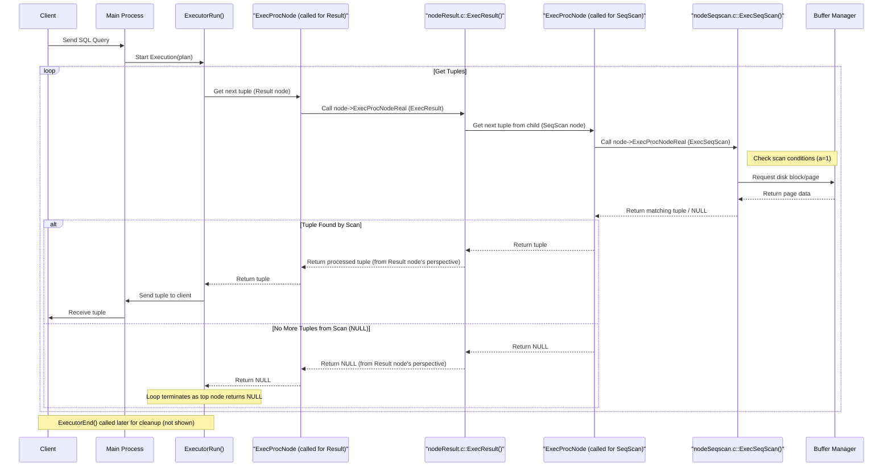
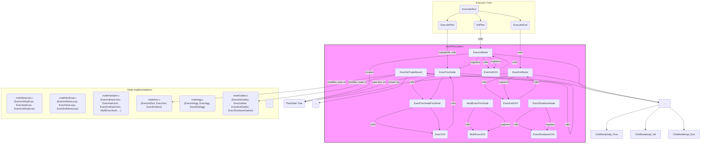

## AI辅助 PolarDB内核学习 - 55 执行器 (Executor) 核心代码 execProcnode.c 解读    
    
### 作者    
digoal    
    
### 日期    
2025-04-14    
    
### 标签    
PostgreSQL , PolarDB , DuckDB , AI , 内核 , 学习 , Executor , 执行器    
    
----    
    
## 背景    
    
## 解读 执行器 (Executor) 入口点代码 execProcnode.c    
好的，我们来详细解读一下 PostgreSQL 的 `src/backend/executor/execProcnode.c` 这段代码。  
  
**代码作用概述**  
  
`execProcnode.c` 文件是 PostgreSQL 查询执行器（Executor）的核心调度中枢。它定义了三个关键的调度函数：`ExecInitNode`、`ExecProcNode`（及其变种 `MultiExecProcNode`）和 `ExecEndNode`。这些函数负责根据查询计划树（Plan Tree）中每个节点的类型，调用相应节点类型的具体实现函数来完成初始化、处理（获取元组）和清理资源这三个生命周期阶段的操作。它实现了经典的“火山模型”（Volcano Model）或迭代器模型，通过递归调用驱动整个查询计划的执行。  
  
**多角度解读**  
  
---  
  
**1. 数据库内核开发者角度**  
  
对于内核开发者来说，`execProcnode.c` 是理解执行器工作流程的入口。  
  
* **核心职责：** 该文件的核心是实现执行节点的“调度”或“分派”（Dispatch）。优化器生成的查询计划（`Plan` 结构）是一个静态的树状结构，描述了需要执行的操作。执行器在运行时，需要为这个 `Plan` 树构建一个对应的 `PlanState` 树，`PlanState` 包含了执行时的动态信息（如当前处理到的元组、子节点状态、计算结果等）。`execProcnode.c` 中的函数就是构建和驱动 `PlanState` 树运转的关键。  
* **生命周期管理：**  
    * `ExecInitNode`: 这个函数递归地遍历 `Plan` 树，根据每个 `Plan` 节点的类型（`nodeTag`），调用对应的 `ExecInitXXX` 函数（例如 `ExecInitSeqScan`、`ExecInitNestLoop`）。`ExecInitXXX` 函数负责创建并初始化该节点的 `PlanState` 结构，包括分配内存、初始化子节点（递归调用 `ExecInitNode`）、设置函数指针（特别是 `ExecProcNode` 指针）等。最终构建出一个与 `Plan` 树结构一致的 `PlanState` 树。  
    * `ExecProcNode`: 这是执行的核心，实现了迭代器模型的 `GetNext()` 操作。当上层节点需要数据时，会调用下层节点的 `ExecProcNode` 函数。该函数首先会进行一些通用检查（如中断检查 `CHECK_FOR_INTERRUPPS()`、参数变化检查 `chgParam` -> `ExecReScan`）。然后，它通过 `PlanState` 节点中预设的 `ExecProcNode` 函数指针（在 `ExecInitNode` 时设置，可能指向 `ExecProcNodeFirst`、`ExecProcNodeInstr` 或实际的 `ExecXXX` 函数），调用特定节点的处理逻辑（如 `ExecSeqScan`、`ExecNestLoop`）。这些 `ExecXXX` 函数负责计算并返回一个元组（`TupleTableSlot`）。如果节点需要从子节点获取数据，它会递归调用其子节点的 `ExecProcNode`。如果当前节点无数据可返回，则返回 `NULL`。  
    * `ExecEndNode`: 在查询执行完毕后，此函数递归地遍历 `PlanState` 树，根据节点类型调用相应的 `ExecEndXXX` 函数（如 `ExecEndSeqScan`、`ExecEndNestLoop`），释放该节点在执行期间分配的资源（内存、文件句柄、锁等）。  
* **`switch` 语句的重要性：** `ExecInitNode`、`ExecProcNode`（间接通过函数指针）、`MultiExecProcNode` 和 `ExecEndNode` 中的 `switch (nodeTag(node))` 结构是实现多态调度的关键。每当添加一种新的计划节点类型（例如一种新的 Join 算法或 Scan 类型），开发者就需要在这些 `switch` 语句中添加相应的 case 分支，并实现对应的 `ExecInitXXX`、`ExecXXX` 和 `ExecEndXXX` 函数。这使得执行器具有良好的可扩展性。  
* **`ExecProcNode` 的封装 (`ExecProcNodeFirst`, `ExecProcNodeInstr`)：**  
    * `ExecProcNodeFirst`: 这是 `ExecProcNode` 的初始入口。它主要做两件事：1) **栈深度检查 (`check_stack_depth`)**：防止无限递归或过深的调用栈导致崩溃，但这个检查有一定开销，所以只在第一次调用时执行。2) **设置后续的 `ExecProcNode` 指针**：如果需要性能剖析（Instrumentation），则将指针指向 `ExecProcNodeInstr`；否则，直接指向节点自身的实际处理函数 (`ExecProcNodeReal`，如 `ExecSeqScan`)，避免后续调用产生不必要的函数调用开销。  
    * `ExecProcNodeInstr`: 如果开启了性能剖析 (`EXPLAIN ANALYZE`)，这个函数会在调用实际节点处理函数 (`node->ExecProcNodeReal`) 前后插入 `InstrStartNode` 和 `InstrStopNode` 调用，用于统计节点的执行时间、返回元组数等信息。  
* **`MultiExecProcNode`：** 某些节点（如 `Hash` 节点构建哈希表，`BitmapIndexScan` 构建位图）不是一次返回一个元组，而是执行一个“批量”操作，返回一个中间数据结构（如哈希表、位图）。`MultiExecProcNode` 就是为这类节点设计的调度函数，其内部结构与 `ExecProcNode` 类似，但调用的是 `MultiExecXXX` 接口。  
* **`ExecShutdownNode`：** 用于处理需要提前停止或清理异步资源的情况，例如并行查询中的 `Gather` 或 `Gather Merge` 节点需要关闭后台的 worker 进程。它会递归调用，并针对特定节点类型执行关闭逻辑。  
* **`ExecSetTupleBound`：** 这是一个优化机制。当上层节点（如 `Limit`）知道自己最多只需要 N 个元组时，可以通过此函数将这个信息传递给下层节点（特别是 `Sort`、`Append`、`Gather` 等）。下层节点可以利用这个信息进行优化，例如 `Sort` 节点可以使用内存受限的排序算法（Bounded Sort），只保留 N 个最优元组，从而节省内存和 CPU。  
  
---  
  
**2. 数据库架构师角度**  
  
架构师关注的是设计模式、模块化、可扩展性和性能。  
  
* **火山模型/迭代器模式的体现：** `execProcnode.c` 是火山模型的典型实现。`ExecProcNode` 函数扮演了 `getNext()` 接口的角色。数据流是自上而下请求（调用 `ExecProcNode`），自下而上返回（返回 `TupleTableSlot`）。这种模型的优点是：  
    * **处理流程统一：** 无论节点多么复杂，都遵循相同的接口 (`Init`, `Proc`, `End`)。  
    * **流水线处理：** 元组可以在节点间以流水线方式处理，无需等待所有中间结果都物化，提高了并行性和效率（尤其对于大数据量）。  
    * **易于组合和扩展：** 可以像搭积木一样组合不同的节点来构建复杂的查询计划。添加新节点类型相对容易，只需实现对应的接口。  
* **模块化与关注点分离：** `execProcnode.c` 作为调度中心，将通用的调度逻辑（如递归调用、中断检查、参数变化处理、生命周期管理）与特定节点的具体实现逻辑（位于 `nodeXXX.c` 文件中，如 `nodeSeqscan.c`, `nodeNestloop.c`）清晰地分离开来。这降低了系统的耦合度。  
* **性能考量：**  
    * **函数指针调用：** 使用函数指针 (`node->ExecProcNode`) 进行分派，避免了在每次调用 `ExecProcNode` 时都进行 `switch` 判断，提高了运行时效率（尤其在 `ExecProcNodeFirst` 完成设置后）。  
    * **一次性检查：** 将有开销的检查（如 `check_stack_depth`）放在 `ExecProcNodeFirst` 中，只执行一次。  
    * **可选的性能剖析：** 通过 `ExecProcNodeInstr` 包装器实现性能剖析，只有在需要时（`EXPLAIN ANALYZE`）才会引入额外的开销，对常规查询性能影响最小。  
    * **`ExecSetTupleBound` 优化：** 提供了一种自顶向下传递优化信息（元组数量上限）的机制，允许底层节点进行针对性优化。  
* **可扩展性：** `switch` 语句的设计使得添加新的执行节点类型（无论是新的扫描方法、连接方法还是物化方法）变得标准化：只需在 `src/include/nodes/plannodes.h` 中定义新的节点类型，在 `execProcnode.c` 的 `switch` 语句中添加 case，并创建对应的 `nodeXXX.c` 文件实现 `ExecInitXXX`, `ExecXXX`, `ExecEndXXX` 函数即可。  
* **并行执行的整合：** 像 `Gather` 和 `Gather Merge` 节点通过 `ExecShutdownNode` 与并行工作进程（worker）进行交互和管理，展示了该调度框架如何与更复杂的执行策略（如并行查询）集成。  
  
---  
  
**3. 用户 (应用开发者和DBA) 角度**  
  
用户虽然不直接接触这段代码，但其行为深刻影响着用户体验和数据库性能。  
  
* **`EXPLAIN` 和 `EXPLAIN ANALYZE` 的背后：**  
    * 当用户执行 `EXPLAIN SELECT ...` 时，看到的是优化器生成的查询计划（`Plan` 树），其节点类型（Seq Scan, Index Scan, Hash Join, Sort 等）直接对应 `execProcnode.c` 中 `switch` 语句的 `case`。  
    * 当用户执行 `EXPLAIN ANALYZE SELECT ...` 时，输出中显示的每个节点的实际执行时间（`actual time`）、返回行数（`rows`）、循环次数（`loops`）等信息，就是通过 `ExecProcNodeInstr` 包装器和 `node->instrument` 收集到的。理解 `execProcnode.c` 的工作方式有助于解读 `EXPLAIN ANALYZE` 的结果，判断性能瓶颈所在。  
* **查询执行过程的可视化：** `execProcnode.c` 定义了查询是如何一步步执行的。例如，一个嵌套循环连接（Nest Loop Join）：  
    1.  `ExecInitNode` 会先初始化 NestLoop 节点，然后递归初始化其外层（Outer）和内层（Inner）子节点（比如两个 Seq Scan）。  
    2.  `ExecProcNode` 调用 `ExecNestLoop`。`ExecNestLoop` 会先调用外层子节点的 `ExecProcNode`（即 `ExecSeqScan`）获取一个元组。  
    3.  拿到外层元组后，`ExecNestLoop` 会（可能需要重置并）反复调用内层子节点的 `ExecProcNode`（另一个 `ExecSeqScan`），获取所有内层元组，并与当前外层元组进行匹配，生成连接后的元组返回。  
    4.  如果内层扫描完毕，`ExecNestLoop` 会再次调用外层子节点的 `ExecProcNode` 获取下一个外层元组，重复步骤 3。  
    5.  直到外层子节点返回 `NULL`（无更多元组），`ExecNestLoop` 也返回 `NULL`。  
    6.  最后 `ExecEndNode` 会清理 NestLoop 及其子节点。  
* **理解性能瓶颈：** 知道执行器是这样工作的，就能理解为什么某些操作慢。例如，Nest Loop Join 对于内层表需要反复扫描，如果内层表很大且没有索引，性能就会很差。`Hash Join` 通过 `MultiExecProcNode` 构建哈希表，虽然初始化（Build Phase）有开销，但后续探测（Probe Phase）通常更快。`Sort` 操作如果需要大量数据排序且内存不足，会溢出到磁盘，导致 `ExecSort` 变慢。  
* **`LIMIT` 子句的优化 (`ExecSetTupleBound`)：** 用户写的 `SELECT ... LIMIT N`，可能会触发 `ExecSetTupleBound` 优化。如果 `LIMIT` 下面是一个 `ORDER BY`（对应 `Sort` 节点），数据库可能只需要找到前 N 个最小/最大的元组，而不需要对所有数据进行完全排序，从而大大提高效率。DBA 可以通过观察 `EXPLAIN ANALYZE` 中 `Sort` 节点的 `Sort Method` 是否包含 "top-N" 或 "bounded" 来确认优化是否生效。  
  
---  
  
**代码内部逻辑与关联图表**  
  
**1. Sequence Diagram (简化示例：执行 `SELECT * FROM t1 WHERE a = 1;`，假设计划为 `Result -> SeqScan(t1)` )**  
  

  
**解释:**  
这个序列图展示了顶层 `ExecutorRun` 如何反复调用 `ExecProcNode`。`ExecProcNode` 作为调度器，根据当前节点类型（先是 `Result`，再是 `SeqScan`）调用相应的实现函数 (`ExecResult`, `ExecSeqScan`)。下层节点（`SeqScan`）负责从存储中获取数据（可能通过 Buffer Manager），进行过滤，然后将元组逐层返回给上层节点，最终通过 `ExecutorRun` 发送给客户端。这个过程一直持续到最顶层节点返回 `NULL`。  
  
**2. Mermaid Diagram (组件关系)**  
  

  
**解释:**  
这个图展示了 `execProcnode.c` (Dispatcher) 如何作为 Executor Core 和各种具体的节点实现 (`nodeXXX.c`) 之间的桥梁。  
* Executor 的主要入口函数 (`ExecutorRun`, `ExecutorEnd`) 调用 `execProcnode.c` 中的核心调度函数 (`ExecInitNode`, `ExecProcNode`, `ExecEndNode`)。  
* 这些调度函数 (`EIN`, `EPN`, `EEN`, `MEPN`, `Shutdown`) 内部使用 `switch` 语句或函数指针，根据节点类型调用位于各个 `nodeXXX.c` 文件中的具体实现函数 (`ExecInitXXX`, `ExecXXX`, `ExecEndXXX`, `MultiExecXXX`, `ExecShutdownXXX`)。  
* `ExecInitNode` 负责构建 `PlanState` 树，后续的 `ExecProcNode` 和 `ExecEndNode` 则在该树上操作。  
* 节点实现函数（如 `ExecNestLoop`）可能会递归调用 `ExecProcNode` 来获取其子节点的数据。  
* `ExecSetTupleBound` 是一个特殊的交互，用于将优化信息传递给特定的子节点实现（如 `Sort`）。  
  
---  
  
**关键内容深入解释**  
  
**1. `ExecProcNode` 与火山模型 (Iterator Model)**  
  
这是 `execProcnode.c` 最核心的功能。想象一个查询计划是一棵树，每个节点代表一个操作（扫描、连接、排序等）。执行查询时，最顶层的节点（通常是 `Result` 节点）被要求产出第一个元组。它会向它的子节点发出请求：“给我一个元组”。这个子节点又会向它的子节点发出同样的请求，依此类推，直到请求到达叶子节点（如 `SeqScan` 或 `IndexScan`）。  
  
叶子节点从磁盘或其他来源获取一个原始元组，进行处理（如应用过滤条件），然后将结果元组返回给它的父节点。父节点接收到元组后，进行自己的处理（如连接操作需要等待另一个子节点也返回元组，然后组合），处理完后将结果元组再向上传递。  
  
`ExecProcNode(PlanState *node)` 函数就是这个请求传递和元组返回的接口。  
* **调用者 (Parent Node):** `TupleTableSlot *tuple = ExecProcNode(childState);`  
* **实现者 (Child Node's `ExecXXX` function called via `node->ExecProcNode`):** 计算或从更下层获取一个元组，放入 `TupleTableSlot` 中返回。如果处理完毕或没有更多数据，返回 `NULL`。  
  
**例子：**  
对于 `Nest Loop (DEPT.mgr = EMP.name)` 例子：  
1.  顶层（比如 `Result` 节点）调用 `ExecProcNode(NestLoopState)`。  
2.  `ExecNestLoop` 被调用（通过 `NestLoopState->ps.ExecProcNode` 指针）。  
3.  `ExecNestLoop` 发现需要外层元组，调用 `ExecProcNode(OuterPlanState)`（即 `SeqScanState` for DEPT）。  
4.  `ExecSeqScan` (for DEPT) 被调用，它从 DEPT 表读取一行 "shoe" 部门的数据，放入 `TupleTableSlot` 返回。  
5.  `ExecNestLoop` 收到 DEPT 元组。现在需要内层元组，它调用 `ExecProcNode(InnerPlanState)`（即 `SeqScanState` for EMP）。  
6.  `ExecSeqScan` (for EMP) 被调用，从 EMP 表读取一行数据返回。  
7.  `ExecNestLoop` 收到 EMP 元组，检查 `DEPT.mgr == EMP.name` 条件。如果匹配，组合成一个新元组，返回给顶层。如果不匹配，回到步骤 5 请求下一个 EMP 元组。  
8.  当 `ExecSeqScan` (for EMP) 返回 `NULL`（EMP 表扫描完），`ExecNestLoop` 会回到步骤 3 请求下一个 DEPT 元组。  
9.  当 `ExecSeqScan` (for DEPT) 返回 `NULL`（DEPT 表扫描完），`ExecNestLoop` 也返回 `NULL` 给顶层。  
  
这个过程清晰地体现了按需拉取（pull-based）数据的迭代器模型。  
  
**2. `Plan` vs `PlanState`**  
  
* `Plan` (`struct Plan`): 这是**静态**的查询计划结构，由优化器生成。它描述了要做什么操作、操作的对象、操作顺序等。它在查询执行期间通常**不会改变**（除非是参数化查询导致 Replan）。它定义在 `src/include/nodes/plannodes.h`。  
* `PlanState` (`struct PlanState`): 这是**动态**的执行状态结构，在 `ExecInitNode` 期间根据 `Plan` 树构建。它包含了执行一个 `Plan` 节点所需的所有运行时信息，例如：  
    * 指向对应 `Plan` 节点的指针 (`plan`)。  
    * 指向子节点 `PlanState` 的指针 (`lefttree`, `righttree`, `initPlan`, `subPlan` 等)。  
    * 当前处理的元组槽 (`ps_ResultTupleSlot`)。  
    * 表达式求值所需的上下文 (`ps_ExprContext`)。  
    * 过滤条件和投影列表的执行时状态 (`qual`, `targetlist`)。  
    * 特定节点类型的内部状态（如 `SeqScanState` 的当前扫描位置，`HashJoinState` 的哈希表）。  
    * 指向该节点实际执行函数的指针 (`ExecProcNode`, `ExecProcNodeReal`)。  
    * 性能剖析数据 (`instrument`)。  
  
`ExecInitNode` 的核心作用就是将静态的 `Plan` 转换（或“编译”）为带有运行时状态的 `PlanState` 树。`ExecProcNode` 和 `ExecEndNode` 操作的都是 `PlanState`。  
  
**3. 生命周期管理 (`ExecInitNode`, `ExecProcNode`, `ExecEndNode`)**  
  
这三个函数构成了执行器中每个节点标准化的生命周期：  
* **`ExecInitNode` (初始化阶段):** 在查询开始执行前调用一次。负责：  
    * 创建 `PlanState` 节点。  
    * 递归初始化子 `PlanState` 节点。  
    * 初始化表达式状态 (`ExecInitExpr`)。  
    * 分配节点所需的内存、数据结构（如 `HashJoin` 的哈希表）。  
    * 设置 `ExecProcNode` 函数指针。  
    * 执行 `initPlan`（初始化子查询，通常只执行一次）。  
* **`ExecProcNode` (执行阶段):** 在查询执行期间可能被调用多次。负责：  
    * 获取下一个要处理的元组（可能通过调用子节点的 `ExecProcNode`）。  
    * 对元组进行处理（过滤、投影、连接、聚合等）。  
    * 将结果元组放入 `TupleTableSlot` 返回。  
    * 如果处理完毕，返回 `NULL`。  
* **`ExecEndNode` (清理阶段):** 在查询执行结束后调用一次。负责：  
    * 释放 `ExecInitNode` 分配的资源（内存、哈希表、排序文件等）。  
    * 递归清理子 `PlanState` 节点。  
    * 确保所有状态都被正确清理，避免资源泄露。  
  
这种清晰的生命周期管理使得代码结构化，易于理解和维护。  
  
希望这个详尽的解读能够帮助你理解 `execProcnode.c` 的作用和重要性！  
    
## 提示    
```    
使用中文回复. 解读下面的代码, 先用几句话阐述代码作用, 然后从数据库内核开发者、架构师、用户(应用开发者和DBA)多个角度通熟易懂的解读这个代码, 使用sequence、mermaid等图表勾勒代码内部的逻辑、与其他代码文件之间的关联关系, 使用恰当的例子来解释代码的关键作用. 关键内容务必要深入重点详细解释.    
<code>    
src/backend/executor/execProcnode.c    
...    
</code>    
```    
    
## PolarDB & PostgreSQL 15 差异    
```    
git diff -u 50d3d22baba63613d1f1406b2ed460dc9b03c3fc f5e7493819e370d30ac2047c68c21c9fb03ce4a0 -- src/backend/executor/xxx.c    
```    
    
差异分析待补充.    
    
<b> 以上内容基于DeepSeek、Qwen及诸多AI生成, 轻微人工调整, 感谢杭州深度求索人工智能、阿里云等公司. </b>    
    
<b> AI 生成的内容请自行辨别正确性, 当然也多了些许踩坑的乐趣, 毕竟冒险是每个男人的天性.  </b>    
    
  
#### [期望 PostgreSQL|开源PolarDB 增加什么功能?](https://github.com/digoal/blog/issues/76 "269ac3d1c492e938c0191101c7238216")
  
  
#### [PolarDB 开源数据库](https://openpolardb.com/home "57258f76c37864c6e6d23383d05714ea")
  
  
#### [PolarDB 学习图谱](https://www.aliyun.com/database/openpolardb/activity "8642f60e04ed0c814bf9cb9677976bd4")
  
  
#### [PostgreSQL 解决方案集合](../201706/20170601_02.md "40cff096e9ed7122c512b35d8561d9c8")
  
  
#### [德哥 / digoal's Github - 公益是一辈子的事.](https://github.com/digoal/blog/blob/master/README.md "22709685feb7cab07d30f30387f0a9ae")
  
  
#### [About 德哥](https://github.com/digoal/blog/blob/master/me/readme.md "a37735981e7704886ffd590565582dd0")
  
  

  
