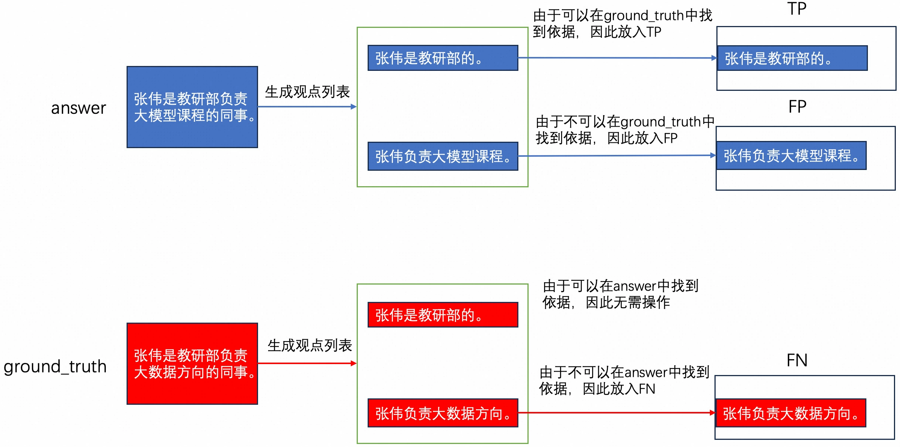
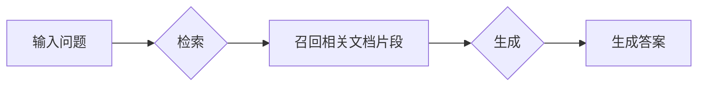
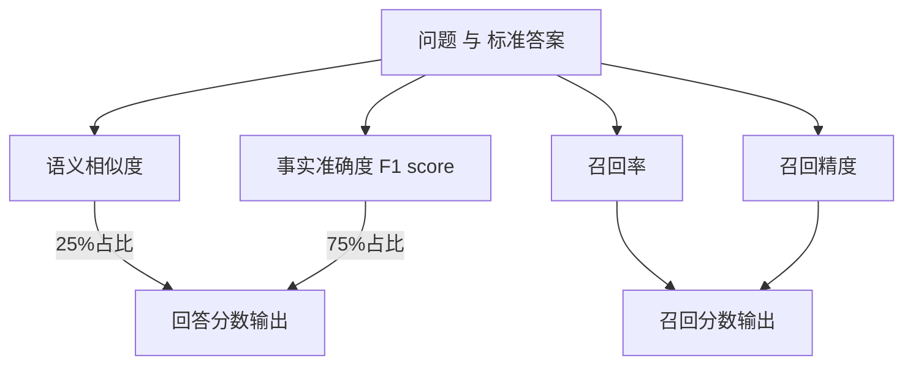
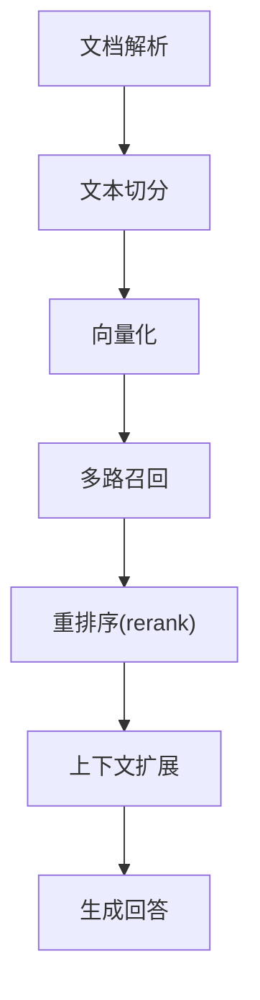
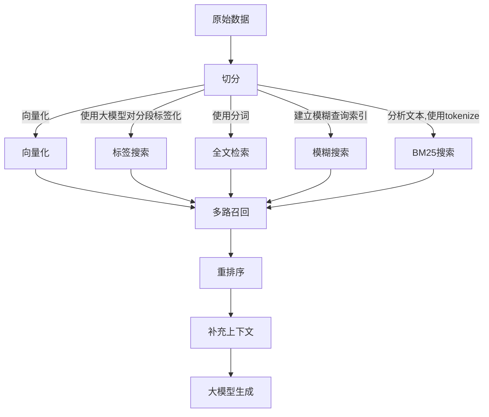

## 为什么用了RAG, 我的AI还是笨得跟猪一样! RAG效果评测与优化   
                                                                                        
### 作者                                                            
digoal                                                            
                                                                   
### 日期                                                                 
2025-04-14                                                           
                                                                
### 标签                                                              
PostgreSQL , PolarDB , DuckDB , AI , RAG , 优化     
                                                                                       
----                                                                
                                                                              
## 背景     
[《演示文稿1》](20250414_04_doc_001.pdf) 由 https://gamma.app/ 与 https://github.com/copilot/ 生成.   
  
[《演示文稿: RAG评测方法与优化思路》](20250414_04_doc_002.pdf)   
   
RAG 不用过多介绍, 大家都知道: 检索增强生成. 简单来说就是检索外部知识来提升大模型的生成效果. 为什么需要外部知识来增强大模型的生成效果呢? 因为大模型训练过程中可能没有用到某些知识, 特别是特殊领域的特殊知识, 例如:  
- 医疗行业的患者数据都是保密的, 训练大模型的企业没有办法拿到这些数据来进行训练  
- 企业的产品手册或内部资料, 训练大模型的企业没有办法拿到这些数据来进行训练  
- 由于训练大模型需要高质量的原始数据, 同时训练的内容越多, 成本越高、耗时也越长, 所以训练大模型的公司可能只会挑选公认的高质量数据, 例如论文、学术期刊、出版物、官方的产品手册等等比较正规的材料.   
  
即使使用DeepSeek、Qwen、Gemini、gpt各大巨头最顶级的模型, 在回答没被训练过的内容时, 要么一本正经的胡说八道(幻觉)、要么不知道怎么回答.  
  
为了解决这个问题RAG出现了. 微调是另一个解法, 本文重点讨论RAG.   
  
最直观的RAG使用方法是在AI聊天工具中上传相关文档, 然后再提问, 让模型参考上传的文档进行解答. 如果还没试过的话, 下面有几种支持上传文档的在线AI聊天工具, 你可以试试. 这种用法的弊端非常明显: 1、附加知识是你自己跟进问题选出来的, 不是模型根据你的问题自动检索到的, 如果你知道所有问题的相关知识, 还要模型干什么; 2、而且用起来也费劲, 每个问题都需要附加内容; 3、由于需要上传到外网, 如果是敏感的私有知识库, 容易被泄露; 4、模型能支持的上下文大小有限(例如通常可能是32K tokens), 如果相关知识散落在多篇很大的文档中, 需要人为截取, 使用非常费劲;   
- https://chat.qwen.ai/   
- https://askmanyai.cn/   
- https://yuanbao.tencent.com/chat   
  
为了解决以上问题, 出现了自动化的RAG产品. 例如   
- 内容平台型的产品, 将你发布的文章自动作为私有知识库实现RAG, 并且可以对你自己或对外提供服务. 如: 知乎直答; 微信公众号AI助手, 通过腾讯元宝支持; github copilot 将代码仓库用于RAG;  
- 可用于私有化部署的开源项目, 例如: OpenWebUI ; Dify ;    
  
自动化RAG是怎么实现的呢? 可以分为检索和生成2个阶段, 检索又可以细化为几个阶段.   
- 解析文档, 文档格式可能包括PPT、keynote、text、markdown、图片、pdf、word、excel 等. 需要统一解析为文本.    
- 切分文本, 目的是把大的文档切片. 切片也很有讲究, 切太大容易超过大模型的上下文, 也容易在RAG过程中引入与问题无关的噪音信息; 切太小的话, 容易丢失与问题相关的关键信息, 导致召回率低下, 最终导致生成效果不理想;   
- 向量化, 使用embedding模型, 把切分好的文本片段转换为向量, 便于进行向量距离相近检索, 快速找到与问题相关的片段, 用于RAG.   
- 召回, 基于向量召回 或 基于模糊查询召回 或 基于关键词匹配召回 或 加强版关键词召回(如bm25,tf/idf) 或 综合以上. 召回与问题有关的文档片段.  
- 生成, 基于问题 以及 被召回的文本片段, 让大模型生成回复.  
  
过程看起来是不是没毛病? 但是为什么用了RAG, 我的AI还是笨得跟猪一样呢?   
  
## 为什么用了RAG, 我的AI还是笨得跟猪一样?   
为了表示RAG的效果, 不能仅凭感觉, 需要有数字化的衡量!   
  
如何数字化的评测RAG效果? 有一个开源项目:   
- Ragas https://github.com/explodinggradients/ragas   
  
这个开源项目提供的方法论非常有效. 它把评测目标拆成了2个方向, 召回和生成, 并且能数字化衡量这2个方向在各个阶段的问题. 方法和算法如下:   
  
首先需要准备好一些问题和正确答案. 下面以单个问题来举例讲解.   
  
示例数据  
- 回复(answer): 张伟是教研部负责大模型课程的同事。  
- 正确答案(ground_truth): 张伟是教研部负责大数据方向的同事.   
  
1、评测回答准确率  
  
由 answer 和 ground_truth 的语义相似度和事实准确度计算得出。  
```  
Answer Correctness 的得分 = 0.25 * 语义相似度得分 + 0.75 * 事实准确度得分  
```  
  
1\.1、语义相似度得分  
  
语义相似度是通过 embedding 模型得到 answer 和 ground_truth 的文本向量，然后计算两个文本向量的相似度。向量相似度的计算有许多种方法，如余弦相似度、欧氏距离、曼哈顿距离等， Ragas 使用了最常用的余弦相似度。  
  
1\.2、事实准确度得分  
  
   
  
1\.2\.1、把正确答案拆分成若干个观点.   
  
正确答案(ground_truth)为: 张伟是教研部负责大数据方向的同事. 拆分为2个观点(事实): 工作方向, 张伟是教研部的; 工作部门, 张伟负责大数据方向;   
  
1\.2\.2、把RAG的回复结果也拆分成若干观点.   
  
回复(answer): 张伟是教研部负责大模型课程的同事。拆分为2个观点(回复): 工作方向, 张伟是教研部的; 工作部门, 张伟负责大模型课程;   
  
1\.2\.3、遍历answer与ground_truth列表，并初始化三个列表，TP、FP与FN。  
  
对于由answer生成的观点：  
- 如果该观点与ground_truth的观点相匹配，则将该观点添加到TP列表中。比如：「张伟是教研部的」。  
- 如果该观点在 ground_truth 的观点列表中找不到依据，则将该观点添加到FP列表中。比如：「张伟负责大模型课程」。  
  
对于ground_truth生成的观点：  
- 如果该观点在 answer 的观点列表中找不到依据，则将该陈述添加到FN列表中。比如：「张伟负责大数据方向」。  
- 该步骤的判断过程均由大模型提供。  
   
<b> 有点像2张表的full outer join </b>
   
1\.2\.4、统计TP、FP与FN列表的元素个数，并按照以下方式计算f1 score分数：  
```  
f1 score = tp / (tp + 0.5 * (fp + fn)) if tp > 0 else 0  
```  
  
以上文为例：`f1 score = 1/(1+0.5*(1+1)) = 0.5`  
  
1\.3、分数汇总, 得到语义相似度和事实准确度的分数后，对两者加权求和，即可得到最终的 Answer Correctness 的分数。  
```  
Answer Correctness 的得分 = 0.25 * 语义相似度得分 + 0.75 * 事实准确度得分  
```  
  
2、计算召回率和召回精度  
  
召回率可以表示: 召回的文本对正确答案涉及观点数的覆盖率?    
  
召回精度可以表示: 召回文本与问题和正确答案的相关性, 以及越相关的文本是不是排在越前面?    
  
假设有3次RAG的数据如下, 每次召回了2条文本(contexts).  
  
question	| answer	| ground_truth	| contexts	| context_recall	| context_precision  
---|---|---|---|---|---  
0	张伟是哪个部门的？	|根据提供的信息，没有提到张伟所在的部门。如果您能提供更多关于张伟的信息，我可能能够帮助您找到答案。	|张伟是教研部的成员	| `["提供⾏政管理与协调⽀持，优化⾏政⼯作流程。" , "绩效管理部 韩杉 李⻜ I902 041 ..."]`	| 0.0|0.0  
1	张伟是哪个部门的？	|张伟是人事部门的	| 张伟是教研部的成员	| `["李凯 教研部主任" , "牛顿发现了万有引力"]`	|0.0	|0.0  
2	张伟是哪个部门的？	|张伟是教研部的	| 张伟是教研部的成员	| `["牛顿发现了万有引力" , "张伟 教研部工程师，他最近在负责课程研发"]`	|1.0	|0.5  
  
由上面的数据可以看到：  
- 最后一行数据的回答是准确的  
- 过程中检索到的参考资料（contexts）中也包含了正确答案的观点，即「张伟是教研部的」。这一情况体现在了 context recall 得分为 1。  
- 但是 contexts 中并不是每一条都是和问题及答案相关的，比如「牛顿发现了万有引力」。这一情况体现在了 context precision 得分为 0.5。  
  
得分算法:   
  
`Context recall` : 召回的文本对正确答案涉及观点数的覆盖率?    
  
你已经从上文了解到 context recall 是衡量 contexts 与 ground_truth 是否一致的指标。  
  
在Ragas 中，context recall 用来描述 ground_truth 中有多少比例的观点可以得到 contexts 的支持，计算过程如下：  
- 由大模型将 ground_truth 分解成 n 个观点（statements）。  
    - 比如，可以由ground_truth「张伟是教研部的成员」生成观点列表 [张伟是教研部的]。  
- 由大模型判断每个观点能在检索到的参考资料（contexts）中找到依据，或者说 context 是否能支撑 ground_truth 的观点。  
    - 比如，这个观点在第三行数据的 contexts 中能找到依据「张伟 教研部工程师，他最近在负责课程研发」。  
- 然后 ground_truth 观点列表中，能在 contexts 中找到依据的观点占比，作为 context_recall 分数。  
    - 这里的得分为 `1 = 1/1`。       `contexts中匹配了几个观点 / ground_truth有几个观点`     
  
`Context precision` : 召回文本与问题和正确答案的相关性, 以及越相关的文本是不是排在越前面?  有价值的数据排在越前面, 分就越高.     
  
在Ragas 中，context precision 不仅衡量了 contexts 中有多少比例的 context 与 ground_truth 相关，还衡量了 contexts 中 context 的排名情况。计算过程比较复杂：  
- 按顺序读取 contexts 中的 contexti ，根据 question 与 ground_truth，判断 contexti 是否相关。相关为 1 分，否则为 0 分。  
    - 比如上面第三行数据中，context1(牛顿发现了万有引力) 是不相关的，context2 相关。  
- 对于每一个 context，以该 context 及之前 context 的分数之和作为分子，context 所处排位作为分母，计算 precision 分。  
    - 每个context算出一个得分: `1或0/其位置`    
    - 对于上面第三行数据，context1 precision 分为 `0/1 = 0`，context2 precision 分为 `1/2 = 0.5`。  
- 对每一个 context 的 precision 分求和，除以相关的 context 个数，得到 context_precision。  
    - 对于上面第三行数据，`context_precision = (0 + 0.5) / 1 = 0.5`。  
  
如果你暂时无法理解上面的计算过程也没有关系，你只需知道该指标衡量了 contexts 中 context 的排名情况。如果你感兴趣，鼓励你去阅读 Ragas 的源码。https://github.com/explodinggradients/ragas/blob/cc31f65d4b7c7cd6bbf686b9073a0dfaacfbcbc5/src/ragas/metrics/_context_precision.py#L250  
  
3、其他推荐了解的指标  
  
Ragas 还提供了很多其他的指标，这里就不一一介绍，你可以访问 Ragas 的文档来查看更多指标的适用场景和工作原理。  
  
Ragas 支持的指标可以访问：https://docs.ragas.io/en/stable/concepts/metrics/available_metrics/  
  
### 为什么用了RAG, 我的AI还是笨得跟猪一样?   
  
现在可以来回复这个问题了  
  
回答结果分值 | 召回覆盖率 分值 | 召回精度 分值 | 原因分析  
---|---|---|---  
1 低 | 高 | 高 | 模型不行, 给你了正确答案你还不会做  
2 低 | 高 | 低 | 召回的干扰/无关信息太多, 引入了很多与问题、答案不相关的内容, 且干扰信息可能排在前面  
3 低 | 低 | 高 | 召回条数不够, 未覆盖与答案相关的所有有关信息  
4 低 | 低 | 低 | 召回条数不够, 并且大都是与问题、答案无关的无效信息(干扰信息)  
  
## 解决之道  
  
对照上表, 根据原因提供以下解决方案.    
  
<b>情况1:</b> 模型不行的情况, 可以尝试更换参数量更大的模型. 或者召回的内容缺失上下文, 导致回复结果不佳, 此种情况要改进切分方法, 后面提到.   
  
<b>情况2:</b> 干扰/无关信息较多, 说明仅凭单一的向量召回或模糊查询或标签召回无法达到好的召回精度, 建议引入rerank. 使用向量召回、模糊查询、标签召多种召回方法, 同时对所有的召回结果再使用rerank模型进行排序和limit. 其中标签召回需要先对内容使用大模型进行打标(俗称KV标注, 提取出每个片段的关键信息, 例如`人物:刘德华`, `地点:杭州`这种标注)   
  
这部分和数据库的关联较大, 涉及如下, 对更细致的优化有兴趣的同学可以单独联系我交流:  一般来说数据库在AI RAG应用中常用于存储历史对话和知识库对应的原始文本以及相关的向量值、标签值. 检索方法包括 “原始文本使用模糊搜索、全文检索进行过滤. 标签使用包含、相交进行过滤. 向量使用问题的向量进行相似过滤.”   
- 向量检索加速, 可以使用pg/polardb pgvector插件, 创建向量索引
- 模糊查询加速, 可以使用pg/polardb pg_bigm插件, 创建倒排索引
- 全文检索加速, 可以使用pg/polardb pg_jieba插件, 创建倒排索引 
- 倒排索引加速, 可以使用pg/polardb jsonb/array和倒排索引 
    - 例如某条切片包含标签`[人物_刘德华, 城市_杭州]` array类型, 搜索时使用数组的包含/相交查询, 可以使用gin索引加速. 单行切片标签比较多的情况下, 可以创建字典表进行映射来压缩存储并提速.  
   
也可以使用bm25进行rerank.  [《召回精度提升插件: pg_tokenizer + VectorChord-BM25 reranking》](../202504/20250427_04.md)  
  
<b>情况3:</b> 召回条数不够, 可以增大召回条目, 例如原来只召回1条最相关的信息, 可以提升为5条.   
  
<b>情况4:</b> 召回率和召回精度都很低, 问题较大可能出在解析文本、切分文档、向量化、召回多个阶段.   
  
解析文本相关. 例如两栏的pdf文本是不是页内换行没有被正确解析, 导致错乱. 要改进解析文本的程序.    
  
切分文档相关. 要从切分方法入手, 选择合适自己的切分方法. 切分方法通常分为   
- 按固定tokens数进行切分 + 前后的少许overlaps; tokens太多容易超出大模型上下文大小, 或引入过多的噪音信息. 太少可能导致信息散乱, 缺少上下文.    
- 按句子进行切分;   
- 按段落进行切分; 有些段落可能超长.
    - 又分通用模式和父子模式. 父子模式的话召回时使用父文本, 生成时使用父文本(包含上下文信息).  因为父文本较大且包含子文本, 能更清晰的表达上下文相关语义, 而子文本可以精准的匹配问题, 可以提高召回精确度.   https://docs.dify.ai/zh-hans/guides/knowledge-base/create-knowledge-and-upload-documents/chunking-and-cleaning-text    
- 按语义; 保证一个分片内的内容语义上有关联.   
- 按章节格式(例如markdown); 仅针对特殊文本格式.   
  
甚至有可能还需要在切分之前先对文档进行处理, 如剔除重复内容. 对大型文档项目进行结构化(章节化)打标等, 并且在切分时植入打标信息.    
  
向量化相关. 排除其他问题, 可能是embedding模块太老旧, 导致转换后问题和分片相似度计算结果不佳, 可以更换新的embedding模型, 更新知识库中所有切片的向量值. 然后再重试. 如果是中文知识库, 可以考虑使用对中文支持更好的embedding模型.    
  
召回相关. 使用滑动窗口, 解决缺失上下文的问题, 通常文本中相邻内容的关联性较强, 例如abcde几个相邻分片, 在检索到c被名字时, 同时带出ab和de, 补齐上下文; 也可以尝试引入rerank;   
  
整个流程的改进汇总:  
- 解析文档阶段, 确保解析后的文档清晰条理正确, 包括能正确的解析出图片内容、公式等.   
- 切分文本阶段, 选择合适自己的切分方法, 有必要的话在切分之前先对文档进行处理, 如剔除重复内容. 对大型文档项目进行结构化(章节化)打标等, 并且在切分时植入打标信息.    
- 文本总结提炼, 例如从切分后的分段提炼出常见问题, 即这个分段可以回答什么问题? 当用户输入问题后, 与提炼的问题进行匹配, 返回原始分段将获得更加精确的回复效果. 参考: https://docs.dify.ai/zh-hans/guides/knowledge-base/create-knowledge-and-upload-documents/setting-indexing-methods   
- 向量化阶段, 使用较新的embedding模型.   
- 召回阶段, 基于向量召回 或 基于模糊查询召回 或 基于关键词匹配召回 或 综合以上. 召回与问题有关的文档片段, 然后使用rerank重排. 使用滑动窗口对rerank重排后得到的分片, 获取其上下文分片.
    - embedding模型和rerank模型推荐, 推荐下载量大, 口碑好的: https://modelscope.cn/models?name=bge   
- 生成, 基于问题 以及 被召回的文本片段, 让大模型生成回复. 效果不佳时尝试更换参数量更大的模型.   
    
最后, 也可以考虑KAG/graphRAG的论文与产品, 本质上也是把重心放在了知识库的原始资料解析、重组、知识点关联上.
- [《AI论文解读 | KAG: Boosting LLMs in Professional Domains via Knowledge Augmented Generation》](../202505/20250515_01.md)  
- [《AI论文解读 | From Local to Global: A GraphRAG Approach to Query-Focused Summarization》](../202505/20250514_02.md)  
- [《AI论文解读 | Retrieval-Augmented Generation with Graphs (GraphRAG)》](../202505/20250514_01.md)  
  
## 扩展思考  
  
问题扩写, 如果尝试了前面所有的情况, 可能是问题描述不清, 应该扩写, 或先咨询得到更多目标信息.   
  
多轮对话, 不能直接把历史问题和回复原样给模型, 容易导致上下文超长. 应该先将历史对话进行总结后, 基于总结再改写问题.  
  
除了RAG外，还有许多种大模型或者自然语言处理（NLP）的应用或任务，如Agent、NL2SQL、机器翻译、文本摘要等。Ragas提供了许多可以评测这些任务的指标。  
  
评价指标	| 使用场景	| 指标含义  
---|---|---  
ToolCallAccuracy|	Agent	|评估 LLM 在识别和调用完成特定任务所需工具方面的表现，该参数由参考工具调用与大模型做出的工具调用比较得到，取值范围是0-1。  
DataCompyScore	|NL2SQL	|评估大模型生成的SQL语句在数据库检索后得到的结果与正确结果的差异性，取值为0-1。  
LLMSQLEquivalence	|NL2SQL	|相比于上者，无需真正在数据库中进行检索，只评估大模型生成的SQL语句与正确的SQL语句的区别，取值为0-1。  
BleuScore | 通用 | 基于 n-gram 评估响应与正确答案之间的相似性。最初被设计用于评估机器翻译系统，评测时无需使用大模型，取值为0-1。BleuScore可以用来评测微调带来的收益。  
  
  
  
## 参考   
实践: [《维基百科(wikipedia) RAG 优化 | PolarDB + AI》](../202504/20250417_01.md)  
   
[《想搭建私有大模型服务? 这几个工具一定了解下 Dify | OpenWebUI | AnythingLLM + Ollama》](../202502/20250223_02.md)      
  
[《真开心, 我在github写的几千篇文章有免费的AI助手了, 不需要自建RAG.》](../202502/20250216_01.md)    
  
[《Elasticsearch vs Paradedb pg_search - RAG绝配: PostgreSQL 混合搜索插件(全文检索+语义(向量)检索)》](../202409/20240918_04.md)    
  
[《提升RAG召回效果的方法探讨》](../202408/20240823_01.md)    
  
[《介绍一个开源项目 RAGflow : 基于深度文档理解构建的开源 RAG》](../202408/20240801_01.md)    
  
[《AI大模型+全文检索+tf-idf+向量数据库+我的文章 系列之4 - RAG 自动提示微调》](../202407/20240723_01.md)    
  
[《德说-第309期, 为什么deepseek开源利好云和硬件厂商?》](../202503/20250301_01.md)    
  
[《如何 3分钟 通过OpenWebUI Ollama 搭建AI chat网站》](../202502/20250221_05.md)    
  
[《3分钟速玩Dify(高度可定制的企业级AI应用开源项目)》](../202504/20250404_01.md)    
  
https://edu.aliyun.com/certification/acp26  
  
https://github.com/AlibabaCloudDocs/aliyun_acp_learning  
   
https://github.com/AlibabaCloudDocs/aliyun_acp_learning/blob/main/%E5%A4%A7%E6%A8%A1%E5%9E%8BACP%E8%AE%A4%E8%AF%81%E6%95%99%E7%A8%8B/p2_%E6%9E%84%E9%80%A0%E5%A4%A7%E6%A8%A1%E5%9E%8B%E9%97%AE%E7%AD%94%E7%B3%BB%E7%BB%9F/2_5_%E4%BC%98%E5%8C%96RAG%E5%BA%94%E7%94%A8%E6%8F%90%E5%8D%87%E9%97%AE%E7%AD%94%E5%87%86%E7%A1%AE%E5%BA%A6.ipynb   
  
https://github.com/AlibabaCloudDocs/aliyun_acp_learning/blob/main/%E5%A4%A7%E6%A8%A1%E5%9E%8BACP%E8%AE%A4%E8%AF%81%E6%95%99%E7%A8%8B/p2_%E6%9E%84%E9%80%A0%E5%A4%A7%E6%A8%A1%E5%9E%8B%E9%97%AE%E7%AD%94%E7%B3%BB%E7%BB%9F/2_4_%E8%87%AA%E5%8A%A8%E5%8C%96%E8%AF%84%E6%B5%8B%E7%AD%94%E7%96%91%E6%9C%BA%E5%99%A8%E4%BA%BA%E7%9A%84%E8%A1%A8%E7%8E%B0.ipynb  
  
[《PostgreSQL 阿里云rds pg发布高维向量索引，支持图像识别、人脸识别 - pase 插件, 以及ivfflat,hnsw搜索算法说明》](../201912/20191219_02.md)    
  
[《数据库筑基课 - 向量类型》](../202501/20250103_01.md)    
  
[《他山之石可以攻玉 | 向量召回IO性能问题解决之道 - 线性化降维(Hilbert & Z-Order)》](../202412/20241213_03.md)    
  
[《向量数据库, 让AI聪明亿点点. 解决AI对新知识的幻觉、不知道问题, 解决AI在交流过程中的失忆问题》](../202406/20240614_01.md)    
  
[《向量搜索优化3板斧: 空间、性能、召回(recall)》](../202405/20240506_03.md)    
  
[《头大! 索引扫描和全表扫描结果不一样, 这向量数据库还能用? 教你一招大幅提升召回率(recall)》](../202404/20240417_01.md)    
  
[《DB吐槽大会,第88期 - PG向量索引的几个问题》](../202404/20240425_01.md)    
  
https://github.com/explodinggradients/ragas    
  
https://edu.aliyun.com/course/3126500/lesson/342570338  
   
---  
  
# 对外分享 PPT 大纲
  
# 为什么用了RAG, 我的AI还是笨得跟猪一样？    
## —— RAG原理、评测与优化全景实践  
  
  
## 目录  
  
1. RAG是什么  
2. 为什么要用RAG  
3. 为什么用了RAG还是效果不好  
4. 如何评判RAG的效果  
5. RAG的整体优化思路  
6. 基于维基百科数据的RAG优化实践  
7. BM25的独特之处  
8. 总结  
  
  
## 1. RAG是什么  
  
**RAG（Retrieval-Augmented Generation）**    
- 检索增强生成    
- 将检索外部知识和大模型生成结合，提升AI对新知识的理解和生成能力  
  
**RAG工作流程：**  

  
**例子：**    
假如你问AI：“蜜柑这部小说讲了什么故事？”  
- RAG会先检索包含“蜜柑”的相关文档片段，再结合这些信息生成回答。  
  
  
## 2. 为什么要用RAG  
  
- 大模型训练数据有限，无法覆盖所有领域和最新内容  
- 训练大模型昂贵，企业/个人难以持续更新  
- 很多企业/行业数据无法用于训练（如医疗、内部手册等）  
- RAG 可以让大模型临时“学会”知识，扩展其能力  
  
**例子：**    
- 医疗、法律、公司知识库等私有数据，无法直接训练进大模型，通过RAG可以在问答时临时引用。  
  
  
## 3. 为什么用了RAG还是效果不好  
  
**常见问题举例：**  
  
| 回答正确性 | 召回覆盖率 | 召回精度 | 主要原因                                           |  
|:----------:|:----------:|:--------:|:---------------------------------------------------|  
| 低         | 高         | 高       | 模型本身能力不足                                   |  
| 低         | 高         | 低       | 召回了太多无关信息，噪声影响生成                   |  
| 低         | 低         | 高       | 召回条数不够，没有涵盖答案所有观点                 |  
| 低         | 低         | 低       | 解析、切分、向量化、召回全流程都存在问题           |  
  
**例子：**    
- 问：张伟是哪个部门的？    
  - 召回内容没覆盖“教研部”→ AI无法正确回答  
  - 召回信息太杂乱→ AI被误导，答非所问  
  
  
## 4. 如何评判RAG的效果  
  
**主要评测维度：**  
  
| 指标              | 说明                                           | 计算方式/例子                          |  
|-------------------|------------------------------------------------|----------------------------------------|  
| 回答准确率        | 答案与标准答案的语义和事实准确性               | F1分数、语义相似度+事实准确度加权      |  
| 召回覆盖率        | 召回内容对答案涉及观点的覆盖比例               | context_recall = 匹配数 / 总观点数     |  
| 召回精度          | 召回内容相关性及排名准确性                     | context_precision，考虑排名和相关程度  |  
  
**表格示例：**  
  
| question           | answer                   | ground_truth          | contexts                        | context_recall | context_precision |  
|--------------------|-------------------------|----------------------|----------------------------------|---------------|------------------|  
| 张伟是哪个部门的？ | 张伟是教研部的          | 张伟是教研部的成员   | [“张伟…教研部…”, “…万有引力”]    | 1.0           | 0.5              |  
| 张伟是哪个部门的？ | 张伟是人事部门的        | 张伟是教研部的成员   | [“李凯…教研部主任”, “…万有引力”] | 0.0           | 0.0              |  
  
**Ragas评测流程简图：**  

  
  
## 5. RAG的整体优化思路  
  
**优化流程总览：**  

  
- 文档解析：格式统一，内容清洗  
- 切分方法：按tokens/句/段/章节/语义等  
- 向量化：选用新embedding模型  
- 多路召回：语义向量、分词、模糊、标签、BM25等  
- Rerank：用模型或bm25提升相关性排序  
- 上下文扩展：补齐上下文片段，防止信息断裂  
- 生成：优选大模型  
  
**优化建议举例：**  
- 召回无关信息多→引入rerank  
- 召回条数太少→提升topN  
- embedding模型老旧→升级模型  
- 切分粒度不合适→调整切分参数  
  
  
## 6. 基于维基百科数据的RAG优化实践    
测试用到的数据库: PolarDB for PostgreSQL  
- 环境: [《穷鬼玩PolarDB RAC一写多读集群系列 | 在Docker容器中用loop设备模拟共享存储搭建PolarDB RAC》](../202412/20241216_03.md)    
   
使用到的插件:  
- pgml  
- openai  
- http  
- pg_jieba  
- pg_bigm  
- vector  
- pg_tokenizer   
- VectorChord-BM25  
  
### 步骤：  
  
1. **数据准备**  
   - 下载“wikimedia/wikipedia”中文数据集  
   - DuckDB/Pg导入，字段：“id, url, title, text”  
  
2. **分段切分**  
   - 使用pgml(chunk)等分段函数  
   - 切分参数如chunk_size=500, overlap=100  
   - 分段方法:   
     ```  
     SPLITTERS = {    
         "character": CharacterTextSplitter,    
         "latex": LatexTextSplitter,    
         "markdown": MarkdownTextSplitter,    
         "nltk": NLTKTextSplitter,    
         "python": PythonCodeTextSplitter,    
         "recursive_character": RecursiveCharacterTextSplitter,    
         "spacy": SpacyTextSplitter,    
     }    
     ```  
  
3. **多路召回之, 标签 & QA提取 & 全文检索 & 模糊查询**  
   - 用大模型总结每段关键Q/A、关键词标签，存入表  
  
4. **多路召回之, 向量化与索引**  
   - embedding模型：如mxbai-embed-large  
   - 建立向量、分词、模糊、标签倒排索引  
  
5. **rerank**  
   - 语义topN、分词topN、标签topN、BM25topN等  
   - 合并后用rerank模型或BM25再排序，选topK  
  
6. **上下文扩展+RAG生成**  
   - 召回片段前后N段补齐上下文  
   - 问题+召回内容输入大模型生成最终回答  
  
**流程示意图：**  

  
  
## 7. BM25的独特之处  
  
- BM25是经典的文本相关性打分算法  
- 兼顾词频（TF）和逆文档频率（IDF），适合排序召回结果  
- 全局有意义：常用词权重低、稀有词权重高  
- 适合中文等多语言（配合分词）  
- 可作为多路召回的重要一环，提升相关性排序  
  
**例子：**  
- “蜜柑”是问题关键词，BM25能根据其在所有文档的稀有度和在每段的出现频率精准打分  
  
**SQL检索样例：**  
```sql  
SELECT id, passage, embedding <&> to_bm25query('documents_embedding_bm25', tokenize('蜜柑', 'tokenizer')) AS rank  
FROM documents  
ORDER BY rank  
LIMIT 10;  
```  
  
  
```sql  
SELECT id, passage, embedding <&> to_bm25query('documents_embedding_bm25', tokenize('人', 'tokenizer1')) AS rank    
FROM documents    
ORDER BY rank    
LIMIT 10;    
    
 id |                                                                 passage                                                                  |    rank        
----+------------------------------------------------------------------------------------------------------------------------------------------+------------    
 11 | 这女人的漂亮丈夫，在旁顾而乐之，因为他几天来，香烟、啤酒、柠檬水沾光了不少。                                                             | -1.1060982    
  9 | 那几个新派到安南或中国租界当警察的法国人，正围了那年轻善撒娇的犹太女人在调情。                                                           | -1.0914663    
  1 | 红海早过了，船在印度洋面上开驶着，但是太阳依然不饶人地迟落早起，侵占去大部分的夜。                                                       | -1.0772165    
  7 | 海风里早含着燥热，胖人身体给炎风吹干了，上一层汗结的盐霜，仿佛刚在巴勒斯坦的死海里洗过澡。                                               | -0.9989638    
  4 | 这是七月下旬，合中国旧历的三伏，一年最热的时候。在中国热得更比常年利害，事后大家都说是兵戈之象，因为这就是民国二十六年【一九三七年】。   | -0.8368523    
  8 | 毕竟是清晨，人的兴致还没给太阳晒萎，烘懒，说话做事都很起劲。                                                                             |         -0    
 10 | 俾斯麦曾说过，法国公使大使的特点，就是一句外国话不会讲；这几位警察并不懂德文，居然传情达意，引得犹太女人格格地笑，比他们的外交官强多了。 |         -0    
 12 | 红海已过，不怕热极引火，所以等一会甲板上零星果皮、纸片、瓶塞之外，香烟头定又遍处皆是。                                                   |         -0    
 13 | 法国人的思想是有名的清楚，他的文章也明白干净，但是他的做事，无不混乱、肮脏、喧哗，但看这船上的乱糟糟。                                   |         -0    
 14 | 这船，倚仗人的机巧，载满人的扰攘，寄满人的希望，热闹地行着，每分钟把沾污了人气的一小方小面，还给那无情、无尽、无际的大海。               |         -0    
(10 rows)    
```  
    
  
## 8. 总结  
  
- RAG让AI拥有“临时学习”能力，对接企业私有知识库，解决大模型“幻觉”与知识盲区  
- 评测RAG效果必须量化：召回覆盖率、召回精度、回答准确率  
- 优化RAG是一项系统工程：数据解析、切分、标签、向量化、检索、重排序、上下文扩充、生成都要关注  
- BM25等传统检索算法在混合召回和排序阶段依然不可或缺  
- 实践证明，严谨的流程+细致的优化+多路召回+再排序，才能让RAG“聪明起来”  
  
**推荐工具与项目：**  
- [Ragas评测](https://github.com/explodinggradients/ragas)  
- [VectorChord-BM25](https://github.com/tensorchord/VectorChord-bm25)  
- [pg_tokenizer](https://github.com/tensorchord/pg_tokenizer.rs)  
- [PostgresML/pgml](https://github.com/postgresml/postgresml)  
  
**参考文稿：**  
- [《为什么用了RAG, 我的AI还是笨得跟猪一样! RAG效果评测与优化》](../202504/20250414_04.md)    
- [《维基百科(wikipedia) RAG 优化 | PolarDB + AI》](../202504/20250417_01.md)    
- [《召回精度提升插件: pg_tokenizer + VectorChord-BM25 reranking》](../202504/20250427_04.md)    
- [《AI论文解读 | KAG: Boosting LLMs in Professional Domains via Knowledge Augmented Generation》](../202505/20250515_01.md)    
  
  
  
  
#### [期望 PostgreSQL|开源PolarDB 增加什么功能?](https://github.com/digoal/blog/issues/76 "269ac3d1c492e938c0191101c7238216")
  
  
#### [PolarDB 开源数据库](https://openpolardb.com/home "57258f76c37864c6e6d23383d05714ea")
  
  
#### [PolarDB 学习图谱](https://www.aliyun.com/database/openpolardb/activity "8642f60e04ed0c814bf9cb9677976bd4")
  
  
#### [PostgreSQL 解决方案集合](../201706/20170601_02.md "40cff096e9ed7122c512b35d8561d9c8")
  
  
#### [德哥 / digoal's Github - 公益是一辈子的事.](https://github.com/digoal/blog/blob/master/README.md "22709685feb7cab07d30f30387f0a9ae")
  
  
#### [About 德哥](https://github.com/digoal/blog/blob/master/me/readme.md "a37735981e7704886ffd590565582dd0")
  
  

  
