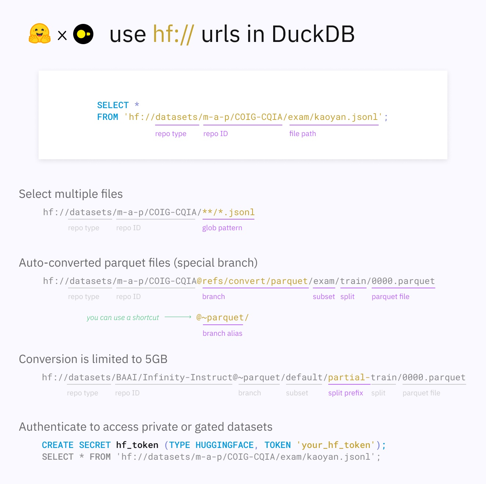

## 维基百科(wikipedia) RAG 优化 | PolarDB + AI   
      
### 作者      
digoal      
      
### 日期      
2025-04-17      
      
### 标签      
PostgreSQL , PolarDB , DuckDB , RAG   
      
----      
      
## 背景  
[《演示文稿》](20250417_01_doc_001.pdf) 由 https://gamma.app/ 与 https://github.com/copilot/ 生成.  
  
下面这篇文章介绍了为什么RAG的效果不理想?  
- [《为什么用了RAG, 我的AI还是笨得跟猪一样! RAG效果评测与优化》](../202504/20250414_04.md)    
  
原因和解决办法本文不再赘述, 参考上文.  
   
本文将以维基百科的数据集为例, 用PolarDB PostgreSQL数据库进行管理, 说明如何通过以下手段提高召回覆盖率和召回精度. 大致步骤如下:     
- 文本分段, 选择不同分段方法   
- 使用大模型分析分段, 提取分段相关的 QA pairs  
- 使用大模型分析分段, 提取标签s  
- 多路召回之: 全文检索  
- 多路召回之: 模糊查询  
- 多路召回之: 标签检索  
- 多路召回之: 向量检索  
- 多路召回之: bm25  
- rerank  
   
使用到的插件:
- pgml
- openai
- http
- pg_jieba
- pg_bigm
- vector
- pg_tokenizer 
- VectorChord-BM25 
  
RAG优化是个巨大的工程实践, 本文重点涉及了一小部分, 抛砖引玉.     
  
## 准备环境  
  
假设你已经部署好了如下环境  
  
[《穷鬼玩PolarDB RAC一写多读集群系列 | 在Docker容器中用loop设备模拟共享存储搭建PolarDB RAC》](../202412/20241216_03.md)    
  
[《穷鬼玩PolarDB RAC一写多读集群系列 | 接入私有化大模型服务》](../202412/20241230_02.md)    
  
## 下载维基百科数据集  
用到命令行工具  
  
https://huggingface.co/docs/huggingface_hub/main/en/guides/cli  
  
```  
pip install -U "huggingface_hub[cli]"  
```  
  
维基百科数据集如下, 页面中有数据格式, 分为4个字段 `id, url, title, text`  
  
https://huggingface.co/datasets/wikimedia/wikipedia  
  
我们可以只下载中文的数据集  
  
https://huggingface.co/datasets/wikimedia/wikipedia/tree/main/20231101.zh   
  
```  
train-00000-of-00006.parquet  
train-00001-of-00006.parquet  
...  
train-00005-of-00006.parquet  
```  
  
新建目录  
```  
mkdir ~/wiki  
```  
  
下载  
```  
HF_ENDPOINT=http://hf-mirror.com nohup huggingface-cli download wikimedia/wikipedia --include 20231101.zh/* --repo-type dataset --local-dir ~/wiki --cache-dir ~/wiki/.cache --resume-download --max-workers 1 >~/wiki/download.log 2>&1 &    
```  
  
PS:   
  
本来duckdb可以直接下载hf的数据集, 但是它不会自动使用代理. 导致访问失败    
  
  
  
https://huggingface.co/docs/hub/en/datasets-duckdb  
  
```  
$ HF_ENDPOINT=http://hf-mirror.com ./duckdb   
v1.2.1 8e52ec4395  
Enter ".help" for usage hints.  
Connected to a transient in-memory database.  
Use ".open FILENAME" to reopen on a persistent database.  
D select * from 'hf://datasets/wikimedia/wikipedia/20231101.zh/*.parquet' limit 1;  
IO Error:  
SSL connection failed error for HTTP GET to 'https://huggingface.co/api/datasets/wikimedia/wikipedia/tree/main/20231101.zh' with status 1718054505  
```  
  
  
## 将维基百科数据集导入PolarDB  
  
将下载好的parquet文件放到PolarDB容器可以访问到的地方  
```  
mv ~/wiki ~/data_volumn/  
  
  
./20231101.zh:   
total 3481600  
-rw-r--r--  1 digoal  staff   560M Apr 17 14:28 train-00000-of-00006.parquet  
-rw-r--r--  1 digoal  staff   251M Apr 17 14:29 train-00001-of-00006.parquet  
-rw-r--r--  1 digoal  staff   121M Apr 17 14:30 train-00002-of-00006.parquet  
-rw-r--r--  1 digoal  staff   250M Apr 17 14:32 train-00003-of-00006.parquet  
-rw-r--r--  1 digoal  staff   245M Apr 17 14:33 train-00004-of-00006.parquet  
-rw-r--r--  1 digoal  staff   214M Apr 17 14:34 train-00005-of-00006.parquet  
drwxr-xr-x  4 digoal  staff   128B Apr 17 14:34 ..  
drwxr-xr-x  8 digoal  staff   256B Apr 17 14:34 .  
```  
  
  
进入PolarDB容器  
```  
docker exec -ti pb1 bash  
```  
  
下载duckdb  
```  
cd /data  
wget https://github.com/duckdb/duckdb/releases/download/v1.2.2/duckdb_cli-linux-aarch64.zip  
sudo apt install -y unzip  
unzip duckdb_cli-linux-aarch64.zip   
```  
  
使用DuckDB查询数据集  
```  
./duckdb  
D load postgres_scanner;  
100% ▕████████████████████████████████████████████████████████████▏   
D select * from '/data/wiki/20231101.zh/*.parquet' limit 10000;  
┌─────────┬──────────────────────┬────────────────┬──────────────────────────────────────────────────────────────────────────────────────────────────────────────────────────────────────────────────────┐  
│   id    │         url          │     title      │                                                                         text                                                                         │  
│ varchar │       varchar        │    varchar     │                                                                       varchar                                                                        │  
├─────────┼──────────────────────┼────────────────┼──────────────────────────────────────────────────────────────────────────────────────────────────────────────────────────────────────────────────────┤  
│ 13      │ https://zh.wikiped…  │ 数学           │ 数学，是研究數量、结构以及空间等概念及其变化的一門学科，屬於形式科學的一種。數學利用抽象化和邏輯推理，從計數、計算、量度、對物體形狀及運動的觀察發…  │  
│ 18      │ https://zh.wikiped…  │ 哲学           │ 哲學是研究普遍的、基本问题的学科，包括存在、知识、价值、理智、心灵、语言等领域。哲学与其他学科不同之處在於哲學有獨特之思考方式，例如批判的方式、通…  │  
│ 21      │ https://zh.wikiped…  │ 文學           │ 文學（），在狭义上，是一种语言艺术，亦即使用语言文字为手段，形象化地反映客观社会生活、表达主观作者思想感情的一种艺术。文学不仅强调传达思想观念，更…  │  
│ 22      │ https://zh.wikiped…  │ 历史           │ 歷史（现代汉语词汇，古典文言文称之为史），指人类社会过去的事件和行动，以及对这些事件行为有系统的记录、诠释和研究。歷史可提供今人理解過去，作為未來…  │  
│ 25      │ https://zh.wikiped…  │ 计算机科学     │ 计算机科学（，有时缩写为）是系统性研究信息与计算的理论基础以及它们在计算机系统中如何实现与应用的实用技术的学科。 它通常被形容为对那些创造、描述以…   │  
│ 39      │ https://zh.wikiped…  │ 民族           │ 在中華人民共和國，民族是一個根據文化與血緣傳承而形成的共同體，經中華人民共和國法律認定而形成。這個单词源自19世紀的歐洲與美國，經日本傳入中國，在意…  │  
│ 45      │ https://zh.wikiped…  │ 戲劇           │ 戏剧（）是演員將某個故事或情境，以對話、歌唱或動作等方式所表演出來的藝術。戏剧有四個元素，包括了「演員」、「故事（情境）」、「舞台（表演場地）」和…  │  
│ 48      │ https://zh.wikiped…  │ 电影           │ 电影（/ ），特点是运动／移动的画面（），是一种视觉艺术作品，用来模拟透過使用动态图像来传达思想、故事、感知、感觉、美或氛围的体验。这些图像通常伴有…  │  
│ 51      │ https://zh.wikiped…  │ 音乐           │ 音樂，廣義而言，就是指任何以聲音組成的藝術。英文Music一詞源於古希臘語的μουσική（mousike），意即缪斯（muse）女神的藝術。而中文的音樂二字，許慎《說…   │  
│ 53      │ https://zh.wikiped…  │ 经济学         │ 經濟學（），為研究商品和服務關係的社會科學學門，包括其中所有的購買、生產、分配和消費等行為。\n\n普通經濟學側重於研究經濟主體和客體之間的實力變化，…  │  
│ 56      │ https://zh.wikiped…  │ 政治学         │ 政治學，或稱政治科學等，是一門对政治、治理和權力體系进行科學研究，分析政治活動、政治制度、政治思想和行為以及相關憲法和法律的社會科學。 政治學涉及…   │  
│ 57      │ https://zh.wikiped…  │ 法学           │ 法學（jurisprudence、legal theory），法律学、法律科学，是社會科學中的1門學科，研究法律此一特定社會現象、其本质与規律。所有的秩序都可以說是種「法律…  │  
│ 59      │ https://zh.wikiped…  │ 社会学         │ 社會學（）起源於19世紀末期，是一門研究社會的學科。社會學使用各種研究方法進行實證調查和批判分析，以發展及完善一套有關人類社會結構、社會行動或社會關…  │  
│ 62      │ https://zh.wikiped…  │ 军事学         │ 军事学与甚多範疇有關，主要與战争有关。此外，軍事學本身包含了各種學問。军事是政治的一部分，战争是政治的一种延续，是一国或者集团用暴力手段达到自己目…  │  
│ 66      │ https://zh.wikiped…  │ 信息科学       │ 信息科学（Information science），旧称情报学（漢語中的日語借詞），主要是指以信息为研究对象，包含資訊的分析、收集、分類、處理、儲存、檢索、傳播和保…   │  
│ 67      │ https://zh.wikiped…  │ 物理学         │ 物理學（源自，源自，转写：phýsis，直譯：大自然）是研究物質、能量的本質與性質的自然科學。由於物質與能量是所有科學研究的必須涉及的基本要素，所以物理…  │  
│ 70      │ https://zh.wikiped…  │ 天文學         │ 天文學是一門研究天體和天文現象的自然科學。它使用數學、物理和化學來解釋它們的起源和演化。天文學的研究對象包括：行星、衛星、恒星、星雲、星系和彗星等…  │  
│ 72      │ https://zh.wikiped…  │ 力学           │ 力学（）是物理学的一个分支，主要研究能量和力以及它们与物体的平衡、变形或运动的关系。\n\n发展历史 \n人们在日常劳动中使用杠杆、打水器具等等，逐渐认…   │  
│ 74      │ https://zh.wikiped…  │ 化學           │ 化學是一門研究物質的性質、組成、結構、以及变化规律的物理的子學科。化學研究的對象涉及物質之間的相互關係，或物質和能量之間的關聯。傳統的化學常常都是…  │  
│ 76      │ https://zh.wikiped…  │ 地理学         │ 地理學（）是探索地球及其特徵、居民和現象的學問，研究地球表層各圈層相互作用關係，及其空間差異與變化過程的學科體系。\n\n词源 \n英語geography一詞源自…  │  
│ ·       │          ·           │   ·            │                                                                          ·                                                                           │  
│ ·       │          ·           │   ·            │                                                                          ·                                                                           │  
│ ·       │          ·           │   ·            │                                                                          ·                                                                           │  
│ 35312   │ https://zh.wikiped…  │ 江门市         │ 江门市（官方音譯：，传统外文：、Kongmun、Kiangmoon），又称四邑、五邑，简称邑，是中华人民共和国广东省下辖的地级市，位于广东省南部，是粵港澳大灣區的…  │  
│ 35313   │ https://zh.wikiped…  │ 新会区         │ 新會（粵語新會話：，汉语拼音：），簡稱新或會，古稱冈州，因盛產蒲葵而别稱葵乡，現為中國廣東省江門市下轄的市轄區，位於珠江三角洲西部西江、潭江下游匯…  │  
│ 35314   │ https://zh.wikiped…  │ PID控制器      │ PID控制器（比例-积分-微分控制器），由比例单元（Proportional）、积分单元（Integral）和微分单元（Derivative）组成。可以透過調整這三個單元的增益，和…   │  
│ 35319   │ https://zh.wikiped…  │ 格 (数学)      │ 在数学中，格（）是其非空有限子集都有一个上确界（称为并）和一个下确界（称为交）的偏序集合（poset）。格也可以特征化为满足特定公理恒等式的代数结构。…   │  
│ 35325   │ https://zh.wikiped…  │ 半格           │ 设是一个偏序集，若对于任意的，都有最小上界（并），或者对于任意的，都有最大下界（交），则称构成一个半格。\n\n也可以将半格定义为一个代数结构。一个半…  │  
│ 35329   │ https://zh.wikiped…  │ 偏序关系       │ 偏序集合（，简写）是数学中，特别是序理论中，指配备了偏序关系的集合。\n这个理论将对集合的元素进行排序、顺序或排列等直觉概念抽象化。这种排序不必是全…  │  
│ 35331   │ https://zh.wikiped…  │ 二元关系       │ 数学上，二元关系（，或简称关系）用於讨论两种物件的连系。诸如算术中的「大於」及「等於」、几何学中的「相似」或集合论中的「为……之元素」、「为……之子集…  │  
│ 35333   │ https://zh.wikiped…  │ 袋狼           │ 袋狼（學名：），现已全部灭绝，因其身上斑纹似虎，又名塔斯马尼亚虎，曾广泛分布于新几内亚热带雨林、澳大利亚草原等地，後因人類活動只分布於塔斯馬尼亞島…  │  
│ 35334   │ https://zh.wikiped…  │ 金属材料       │ 金屬材料一般是指工業工程應用中的純金屬或合金。自然界中大約有70多種純金屬，其中常見的有金、銀、銅、鐵、鋁、錫、鎳、鉛、鋅、碳等等。而合金常指二種或…  │  
│ 35335   │ https://zh.wikiped…  │ 笛卡儿积       │ 在数学中，两个集合和的笛卡儿积（），又称直积，在集合论中表示为，是所有可能的有序对組成的集合，其中有序對的第一个对象是的成员，第二个对象是的成员。…  │  
│ 35336   │ https://zh.wikiped…  │ 有序对         │ 在数学中，有序对是两个对象的搜集，使得可以区分出其中一个是“第一个元素”而另一个是“第二个元素”（第一个元素和第二个元素也叫做左投影和右投影）。带有第…  │  
│ 35340   │ https://zh.wikiped…  │ 金屬基複合材料 │ 金属基复合材料（Metal Matrix Composite，MMC）一般是以金属或合金为连续相而颗粒，晶须或纤维形式的第二相组成的复合材料。目前其制备和加工比较困难，成…   │  
│ 35343   │ https://zh.wikiped…  │ 等价关系       │ 在数学中，等價關係（）是具有自反性，对称性，传递性的二元关系。等价关系也称为同值關係。一些等价关系的例子包括整数集上的同余，欧氏几何中的等量（），…  │  
│ 35344   │ https://zh.wikiped…  │ 666            │ 666（六百六十六）是665与667之间的自然数。\n\n在数学中 \n 666是第667个非負整数。\n 666是第333个双数，又是第544个合数。（第666个合数是806 = 2 × 13 ×…  │  
│ 35347   │ https://zh.wikiped…  │ 全序关系       │ 全序关系，也称为线性顺序（）即集合上的反对称的、传递的和完全的二元关系（一般称其为）。\n\n若满足全序关系，则下列陈述对于中的所有和成立：\n\n 反对…   │  
│ 35356   │ https://zh.wikiped…  │ 最小上界       │ 最小上界，亦称上确界（，记为sup E）是数学中序理论的一个重要概念，在格论和数学分析等领域有广泛应用。\n\n定义 \n给定偏序集合(T,≤)，对于S⊆T，S的上确…   │  
│ 35361   │ https://zh.wikiped…  │ 上界和下界     │ 設為一個偏序集，若存在，能滿足都有，則稱作集合的上界，若存在，能滿足都有，則稱作的下界。\n\n例如在實變數中，若存在一個實數，能滿足都有，則即為集合…  │  
│ 35363   │ https://zh.wikiped…  │ 最大下界       │ 在数学中，某个集合 X 的子集 E 的下确界( 或 ，记为 inf E )是小于或等于的 E 所有其他元素的最大元素，其不一定在 E 內。所以还常用术语最大下界（简写为 …  │  
│ 35366   │ https://zh.wikiped…  │ 软件开发       │ 软件开发（）是根据用户要求建造出软件系统或者系统中软件部分的一个产品开发的過程。软件开发是一项包括需求获取、开发规划、需求分析和设计、编程实现、软…  │  
│ 35372   │ https://zh.wikiped…  │ 纳米材料       │ 奈米材料广义上是三维空间中至少有一维处于奈米尺度范围或者由该尺度范围的物质为基本结构单元所构成的材料的总称。由于奈米尺寸的物质具有与宏观物质所迥异…  │  
├─────────┴──────────────────────┴────────────────┴──────────────────────────────────────────────────────────────────────────────────────────────────────────────────────────────────────────────────────┤  
│ 10000 rows (40 shown)                                                                                                                                                                        4 columns │  
└────────────────────────────────────────────────────────────────────────────────────────────────────────────────────────────────────────────────────────────────────────────────────────────────────────┘  
D   
```  
  
  
创建PolarDB数据库用户  
```  
$ psql  
  
create role digoal encrypted password '123456' login superuser;  
```  
  
将维基百科数据集导入PolarDB, 用到了DuckDB postgres_scanner插件.   
  
https://duckdb.org/docs/stable/extensions/postgres.html  
  
```  
./duckdb  
  
CREATE SECRET polardb_pb1 (  
    TYPE postgres,  
    HOST '127.0.0.1',  
    PORT 5432,  
    DATABASE postgres,  
    USER 'digoal',  
    PASSWORD '123456'  
);  
  
  
ATTACH '' AS pb1 (TYPE postgres, SECRET polardb_pb1);  
  
create table pb1.wiki (id int, url text, title text, content text);  
  
-- 例子   
  
insert into pb1.wiki select * from '/data/wiki/20231101.zh/*.parquet' limit 10000;	  
  
D select * from pb1.wiki limit 1;  
┌───────┬──────────────────────┬─────────┬───────────────────────────────────────────────────────────────────────────────────────────────────────────────────────────────────────────────────────────────┐  
│  id   │         url          │  title  │                                                                            content                                                                            │  
│ int32 │       varchar        │ varchar │                                                                            varchar                                                                            │  
├───────┼──────────────────────┼─────────┼───────────────────────────────────────────────────────────────────────────────────────────────────────────────────────────────────────────────────────────────┤  
│  13   │ https://zh.wikiped…  │ 数学    │ 数学，是研究數量、结构以及空间等概念及其变化的一門学科，屬於形式科學的一種。數學利用抽象化和邏輯推理，從計數、計算、量度、對物體形狀及運動的觀察發展而成。…   │  
└───────┴──────────────────────┴─────────┴───────────────────────────────────────────────────────────────────────────────────────────────────────────────────────────────────────────────────────────────┘  
D   
```  
  
PS: 如果你有足够的空间, 可以把parquet导出到csv, 然后使用psql copy来导入会更快.    
```  
-- duckdb  
./duckdb  
copy (select * from '/data/wiki/20231101.zh/*.parquet' ) to '/data/a.csv' (FORMAT csv, DELIMITER '|', HEADER);  
  
-- polardb  
psql   
copy wiki from '/data/a.csv' with (format csv, header on, DELIMITER '|', escape '"', QUOTE '"');  
COPY 1384748  
```
  
数据大小     
```  
postgres=# \dt+
                                           List of relations
 Schema |       Name       | Type  |  Owner   | Persistence | Access method |    Size    | Description 
--------+------------------+-------+----------+-------------+---------------+------------+-------------
 public | wiki             | table | digoal   | permanent   | heap          | 2241 MB    | 
(20 rows)
```  
   
## 准备插件和本地模型服务  
创建相应插件  
```  
$ psql  
psql (PostgreSQL 15.12 (PolarDB 15.12.3.0 build e1e6d85b debug) on aarch64-linux-gnu)  
Type "help" for help.  
  
postgres=# \d wiki  
                     Table "public.wiki"  
 Column  |       Type        | Collation | Nullable | Default   
---------+-------------------+-----------+----------+---------  
 id      | integer           |           |          |   
 url     | character varying |           |          |   
 title   | character varying |           |          |   
 content | character varying |           |          |   
  
postgres=# select count(*) from wiki ;  
  count    
---------  
 1384748  
(1 row)  
  
postgres=# create extension pg_bigm ;  
CREATE EXTENSION  
postgres=# create extension pg_jieba ;  
CREATE EXTENSION  
postgres=# create extension vector ;  
CREATE EXTENSION  
  
create extension http ;  
create extension openai ;   
```  
  
  
使用本地/远程模型   
```  
$ ollama list  
NAME                             ID              SIZE      MODIFIED       
qwen2.5-coder:3b                 e7149271c296    1.9 GB    5 hours ago       
ds-qwen2.5-1.5b-digoal:latest    2c6aaa8a497c    3.6 GB    7 weeks ago       
qwen2.5:1.5b                     65ec06548149    986 MB    7 weeks ago       
deepseek-r1:7b                   0a8c26691023    4.7 GB    2 months ago      
qwen_1.5b_test1:latest           682ad25636bd    1.1 GB    2 months ago      
deepseek-r1:1.5b                 a42b25d8c10a    1.1 GB    2 months ago      
deepseek-r1:14b                  ea35dfe18182    9.0 GB    2 months ago      
mxbai-embed-large:latest         468836162de7    669 MB    4 months ago   
  
启动本地模型  
  
OLLAMA_HOST=0.0.0.0:11434 OLLAMA_KEEP_ALIVE=-1 nohup ollama serve >> ~/.ollama.log 2>&1 &  
```  
  
  
指定模型API地址  
```  
psql  
  
alter database postgres set openai.api_uri = 'http://host.docker.internal:11434/v1/';  
```  
  
  
## 数据处理和检索优化  
### 1、分段/切片  
  
  
可以使用pgai / postgresml, 对原始数据进行分段  
  
https://github.com/postgresml/postgresml?tab=readme-ov-file#chunk  
  
https://postgresml.org/docs/open-source/pgml/api/pgml.chunk  
  
https://www.cybertec-postgresql.com/en/pgai-importing-wikipedia-into-postgresql/  
   
https://python.langchain.com/docs/how_to/#text-splitters  
  
https://python.langchain.com/docs/integrations/splitters/writer_text_splitter/#setup  
  
  
如何选择分段算法? :   
  
https://docs.dify.ai/zh-hans/guides/knowledge-base/create-knowledge-and-upload-documents/chunking-and-cleaning-text  
   
#### 使用pgml切片举例如下  
  
首先部署rust, 可参考下文：  
- [《PostgreSQL pg_bm25(open source by paradedb)：Postgres 内部的弹性质量全文搜索 性能优于tsvector tsrank 20x》](../202310/20231016_03.md)    
  
  
部署rust  
```  
curl --proto '=https' --tlsv1.2 -sSf https://sh.rustup.rs | sh  
echo ". \"\$HOME/.cargo/env\"" >> ~/.bashrc  
. ~/.bashrc  
  
  
$ rustc --version  
rustc 1.86.0 (05f9846f8 2025-03-31)  
```  
  
配置国内镜像  
```  
echo "  
[source.crates-io]            
replace-with = 'ustc'            
            
[source.ustc]            
registry = \"sparse+https://mirrors.ustc.edu.cn/crates.io-index/\"    
" >> /home/postgres/.cargo/config.toml  
```  
  
下载pgml插件代码  
```  
cd /data  
git clone --depth 1 -b v2.10.0 https://github.com/postgresml/postgresml  
```  
  
编译安装pgml插件依赖环境  
```  
cd /data/postgresml/pgml-extension/  
  
# pgrx 版本请参考不同版本的  Cargo.toml 文件   
cargo install --locked --version 0.12.9 cargo-pgrx      
cargo pgrx init    # create PGRX_HOME 后, 立即ctrl^c 退出          
cargo pgrx init --pg15=`which pg_config`    # 不用管报警     
  
   Validating /home/postgres/tmp_polardb_pg_15_base/bin/pg_config  
 Initializing data directory at /home/postgres/.pgrx/data-15  
  
  
sudo apt-get update  
sudo apt-get install -y lld libopenblas-dev  
```  
  
编译安装pgml插件  
```  
PGRX_IGNORE_RUST_VERSIONS=y cargo pgrx install --release --pg-config `which pg_config`   
```  
  
安装运行pgml时的依赖包  
```  
sudo pip3 install xgboost lightgbm scikit-learn langchain  
```  
  
配置postgresql.conf  
```  
vi ~/primary/postgresql.conf  
  
shared_preload_libraries='pgml,$libdir/polar_vfs,$libdir/polar_worker'  
```  
  
重启PolarDB for postgresql  
```  
pg_ctl restart -m fast -D ~/primary  
```  
  
在数据库中安装插件  
```  
postgres=# create extension pgml;  
INFO:  Python version: 3.10.12 (main, Jul 29 2024, 16:56:48) [GCC 11.4.0], executable: /usr/bin/python3  
INFO:  Scikit-learn 1.6.1, XGBoost 3.0.0, LightGBM 4.6.0, NumPy 2.2.4  
CREATE EXTENSION  
  
postgres=# \dx  
                                              List of installed extensions  
        Name         | Version |   Schema   |                                Description                                   
---------------------+---------+------------+----------------------------------------------------------------------------  
 http                | 1.6     | public     | HTTP client for PostgreSQL, allows web page retrieval inside the database.  
 openai              | 1.0     | public     | OpenAI client.  
 pg_bigm             | 1.2     | public     | text similarity measurement and index searching based on bigrams  
 pg_bulkload         | 3.1.22  | public     | pg_bulkload is a high speed data loading utility for PostgreSQL  
 pg_jieba            | 1.1.0   | public     | a parser for full-text search of Chinese  
 pg_stat_statements  | 1.10    | public     | track planning and execution statistics of all SQL statements executed  
 pg_trgm             | 1.6     | public     | text similarity measurement and index searching based on trigrams  
 pgml                | 2.10.0  | pgml       | Machine Learning and AI functions from postgresml.org  
 pgstattuple         | 1.5     | public     | show tuple-level statistics  
 plpgsql             | 1.0     | pg_catalog | PL/pgSQL procedural language  
 plpython3u          | 1.0     | pg_catalog | PL/Python3U untrusted procedural language  
 polar_feature_utils | 1.0     | pg_catalog | PolarDB feature utilization  
 polar_vfs           | 1.0     | public     | polar virtual file system for different storage  
 sslinfo             | 1.2     | public     | information about SSL certificates  
 vector              | 0.8.0   | public     | vector data type and ivfflat and hnsw access methods  
(15 rows)  
```  
  
使用pgml的chunk接口, 对前面导入的wikipedia进行切片  
```  
-- 先创建一个索引  
postgres=# create index on wiki (id);  
CREATE INDEX  
  
-- 切片函数pgml.chunk测试  
postgres=# SELECT id, (pgml.chunk('character', content)).chunk_index from wiki where id=100;  
 id  | chunk_index   
-----+-------------  
 100 |           1  
 100 |           2  
 100 |           3  
 100 |           4  
 100 |           5  
(5 rows)  
```  
  
  
切片函数支持的切片方法如下, 有若干种, 根据情况选择合适的    
- https://github.com/postgresml/postgresml/blob/master/pgml-extension/src/bindings/langchain/langchain.py  
  
```  
SPLITTERS = {  
    "character": CharacterTextSplitter,  
    "latex": LatexTextSplitter,  
    "markdown": MarkdownTextSplitter,  
    "nltk": NLTKTextSplitter,  
    "python": PythonCodeTextSplitter,  
    "recursive_character": RecursiveCharacterTextSplitter,  
    "spacy": SpacyTextSplitter,  
}  
```  
  
切片函数的参数介绍  
```  
postgres=# \x  
Expanded display is on.  
postgres=# \df+ pgml.chunk  
List of functions  
-[ RECORD 1 ]-------+-----------------------------------------------------------  
Schema              | pgml  
Name                | chunk  
Result data type    | TABLE(chunk_index bigint, chunk text)  
Argument data types | splitter text, text text, kwargs jsonb DEFAULT '{}'::jsonb  
Type                | func  
Volatility          | immutable  
Parallel            | safe  
Owner               | postgres  
Security            | invoker  
Access privileges   |   
Language            | c  
Source code         | chunk_wrapper  
Description         |   
```  
  
最后一个参数 kwargs, 取值取决于langchain的不同splitter的参数. 例如 CharacterTextSplitter :  
- https://python.langchain.com/docs/how_to/character_text_splitter/  
  
```  
from langchain_text_splitters import CharacterTextSplitter  
  
# Load an example document  
with open("state_of_the_union.txt") as f:  
    state_of_the_union = f.read()  
  
text_splitter = CharacterTextSplitter(  
    separator="\n\n",  
    chunk_size=1000,  
    chunk_overlap=200,  
    length_function=len,  
    is_separator_regex=False,  
)  
texts = text_splitter.create_documents([state_of_the_union])  
print(texts[0])  
```  
  
  
测试一下切片参数, 把切片分段长度改小之后, 切片增多, 每个切片变小.  
```  
SELECT id, (pgml.chunk('character', content, '{"chunk_size": 500, "chunk_overlap": 100}'::jsonb)).chunk_index from wiki where id=100;  
  
  
postgres=# SELECT id, (pgml.chunk('character', content, '{"chunk_size": 500, "chunk_overlap": 100}'::jsonb)).chunk_index from wiki where id=100;  
 id  | chunk_index   
-----+-------------  
 100 |           1  
 100 |           2  
 100 |           3  
 100 |           4  
 100 |           5  
 100 |           6  
 100 |           7  
 100 |           8  
 100 |           9  
 100 |          10  
 100 |          11  
 100 |          12  
 100 |          13  
 100 |          14  
 100 |          15  
 100 |          16  
 100 |          17  
 100 |          18  
 100 |          19  
 100 |          20  
 100 |          21  
 100 |          22  
 100 |          23  
 100 |          24  
 100 |          25  
 100 |          26  
 100 |          27  
 100 |          28  
 100 |          29  
 100 |          30  
 100 |          31  
 100 |          32  
 100 |          33  
 100 |          34  
 100 |          35  
 100 |          36  
 100 |          37  
 100 |          38  
 100 |          39  
 100 |          40  
(40 rows)  
  
postgres=# SELECT id, (pgml.chunk('character', content, '{"chunk_size": 500, "chunk_overlap": 100}'::jsonb)).* from wiki where id=100;  
-[ RECORD 1 ]---------------------------------------------------------------------------------------------------------------------------------------------------------------------------------------------  
----------------------------------------------------------------------------------------------------------------------------------------------------------------------------------------------------------  
----------------------------------------------------------------------------------------------------------------------------------------------------------------------------------------------------------  
----------------------------------------------------------------------------------------------------------------------------------------------------------------------------------------------------------  
----------------------------------------------------------------------------------------------------------------------------------------------------------------------------------------------------------  
-----------------------------------------------------------------------------------  
id          | 100  
chunk_index | 1  
chunk       | 农业属于第一級產業，包括作物种植、畜牧、渔业养殖、林业等活动，负责主副食和经济作物供应。农业的主要产品是食物、纤维、能源和原材料（例如橡胶），其中食物包括谷物、蔬菜、水果、食用油、肉类、奶  
制品、蛋和菌类。全球农业年产出约110亿吨食物，3200万吨自然纤维和40亿立方米木材。不过，其中有14%的食物在到达零售环节之前被浪费。自20世纪开始，基于单一作物种植的工业化农业开始成为世界农业产出的主要来源。    
                                                                                                                                                                                                            
                                                                                                                                                                                                            
                                                                                                                                                                                                            
                                                                                   +  
            |                                                                                                                                                                                               
                                                                                                                                                                                                            
                                                                                                                                                                                                            
                                                                                                                                                                                                            
                                                                                                                                                                                                            
                                                                                   +  
            | 农业的出现是人类文明转向定居形式的里程碑，借助野生动植物的驯化、培育与繁殖，人们获得了充足的食物与资源，并促進早期城市的发展与成型。人类在10.5万年前开始从野外采集谷物，但直到1.15万年前才开  
始种植，并在大约1万年前驯化了绵羊、山羊、猪、牛等家畜。世界上至少有11个地区独立发展出了作物种植。  
-[ RECORD 2 ]---------------------------------------------------------------------------------------------------------------------------------------------------------------------------------------------  
----------------------------------------------------------------------------------------------------------------------------------------------------------------------------------------------------------  
----------------------------------------------------------------------------------------------------------------------------------------------------------------------------------------------------------  
----------------------------------------------------------------------------------------------------------------------------------------------------------------------------------------------------------  
----------------------------------------------------------------------------------------------------------------------------------------------------------------------------------------------------------  
-----------------------------------------------------------------------------------  
id          | 100  
chunk_index | 2  
chunk       | 现代农业技术、植物育种、农业化学产品（例如杀虫剂和化肥）的发展显著增加了作物产量，但也引发了诸多生态与环境问题。选择育种和现代畜牧业技术发展增加了肉类制品产量，但也引发了动物福利和环境忧虑  
。上述环境问题包括气候变化、地下含水层枯竭、森林砍伐、抗生素耐药性和农业相关污染。农业既是环境退化的原因，也深受其影响，生物多样性丧失、荒漠化、土壤退化、气候变化等因素都会降低作物产量。進入21世紀後，可  
持續農業的比例漸漸提高，包括樸門和有機農業，著重在生態平衡與就近百里飲食。转基因作物被广泛使用，但也有部分国家。                                                                                            
                                                                                                                                                                                                            
                                                                                                                                                                                                            
                                                                                   +  
            |                                                                                                                                                                                               
                                                                                                                                                                                                            
                                                                                                                                                                                                            
                                                                                                                                                                                                            
                                                                                                                                                                                                            
                                                                                   +  
            | 定义                                                                                                                                                                                          
                                                                                                                                                                                                            
                                                                                                                                                                                                            
                                                                                                                                                                                                            
                                                                                                                                                                                                            
                                                                                   +  
            | 根據東漢時期《說文解字》和清康熙時期《康熙字典》的解釋，「農」字都是「耕種」的意思，這表示在中國古代就只有種植業才會被稱作「農業」。但现代对农业的定义更加广泛，包括利用自然资源生产维持生命  
所需的物品，如食物、纤维、林业产品、园艺作物，以及与之相关的服务。因此，广义的农业包括种植业、园艺、动物养殖（畜牧业、水产养殖等）和林业，但有时园艺和林业也被排除在外。此外，农业可因管理对象不同而分为两  
类：植物农业，主要涉及作物的培育；动物农业，主要关注农业动物产品。                                                                                                                                          
                                                                                                                                                                                                            
                                                                                                                                                                                                            
                                                                                   +  
            |                                                                                                                                                                                               
                                                                                                                                                                                                            
                                                                                                                                                                                                            
                                                                                                                                                                                                            
                                                                                                                                                                                                            
                                                                                   +  
            | 歷史  
-[ RECORD 3 ]---------------------------------------------------------------------------------------------------------------------------------------------------------------------------------------------  
----------------------------------------------------------------------------------------------------------------------------------------------------------------------------------------------------------  
----------------------------------------------------------------------------------------------------------------------------------------------------------------------------------------------------------  
----------------------------------------------------------------------------------------------------------------------------------------------------------------------------------------------------------  
----------------------------------------------------------------------------------------------------------------------------------------------------------------------------------------------------------  
-----------------------------------------------------------------------------------  
id          | 100  
chunk_index | 3  
chunk       | 起源                                                                                                                                                                                          
                                                                                                                                                                                                            
                                                                                                                                                                                                            
                                                                                                                                                                                                            
                                                                                                                                                                                                            
                                                                                   +  
            | 得益于农业发展，世界人口数量相比狩猎采集时代有了显著增长。农业独立起源于多个地区，根据分类单元至少可归为11个起源中心。早在10.5万年前，人们就已开始采集并食用野生谷物。在23,000年前新石器时代  
的黎凡特，人们开始在加利利海附近种植二粒小麦、大麦和燕麦。中国先民于13,500-8200年驯化了水稻，已知最早耕种时间距今约7,700年，而后绿豆、大豆、红豆也在此区域驯化。美索不达米亚人于13,000万-11,000万年前驯化  
绵羊。而家牛则是从10,500万年前生活在现今土耳其和巴基斯坦地区的原牛驯化而来。家猪由野猪驯化而来，此过程在欧洲、东亚和东南亚独立进行，最早驯化时间距今约10,500万年。在南美洲安第斯山脉，人们在10,000-7,000年  
前驯化了马铃薯，后续又驯化了豆子、古柯、羊驼、大羊驼和豚鼠。高粱于7,000年前在非洲萨赫勒被驯化。棉花于5,600年前在秘鲁被驯化，后也在欧亚大陆独立驯化。玉米源于野生玉蜀黍属，于6,000年前在中美洲驯化。公元前3  
,500年左右，马在欧亚大草原被驯化。关于农业的起源有大量研究，学者为此提出了众多假说。人类从狩猎采集向农业社会的转型伴随着集约化和的发展，相关过渡期案例有黎凡特地区的纳图夫文化和中国早期的新石器文化。随着  
生活方式的转变，人们开始在定居点种植采集自野外的资源，由此导致这些物种的逐步驯化。  
-[ RECORD 4 ]---------------------------------------------------------------------------------------------------------------------------------------------------------------------------------------------  
----------------------------------------------------------------------------------------------------------------------------------------------------------------------------------------------------------  
----------------------------------------------------------------------------------------------------------------------------------------------------------------------------------------------------------  
----------------------------------------------------------------------------------------------------------------------------------------------------------------------------------------------------------  
----------------------------------------------------------------------------------------------------------------------------------------------------------------------------------------------------------  
-----------------------------------------------------------------------------------  
id          | 100  
chunk_index | 4  
chunk       | 古代文明                                                                                                                                                                                      
                                                                                                                                                                                                            
                                                                                                                                                                                                            
                                                                                                                                                                                                            
                                                                                                                                                                                                            
                                                                                   +  
            |                                                                                                                                                                                               
                                                                                                                                                                                                            
                                                                                                                                                                                                            
                                                                                                                                                                                                            
                                                                                                                                                                                                            
                                                                                   +  
            | 公元前8,000年，欧亚大陆的苏美尔人开始以村庄形式定居，并依靠底格里斯河和幼发拉底河灌溉作物。其公元前3,000年的象形符号中出现了犁，公元前2,300年出现了播种犁。苏美尔农夫种植大麦、小麦、蔬菜（  
如扁豆和洋葱）、水果（例如椰棗、葡萄和无花果）。古埃及农业始于旧石器时代末期的前王朝时期，时间大约在公元前10,000年，主要依靠尼罗河和当地季节性洪水灌溉作物。当地人种植的主要粮食作物为大麦和小麦，此外还有  
亚麻和纸莎草等经济作物。印度先民在公元前9,000年前驯化了小麦、大麦和枣，后续又驯化了绵羊和山羊。在公元前8,000-6,000年的梅赫尔格尔文化中，巴基斯坦先民驯化了牛、绵羊和山羊。棉花在公元前4-5世纪驯化。此外，  
古证据显示，在公元前2,500年的印度河流域文明中，出现了使用动物牵引的犁。  
-[ RECORD 5 ]---------------------------------------------------------------------------------------------------------------------------------------------------------------------------------------------  
----------------------------------------------------------------------------------------------------------------------------------------------------------------------------------------------------------  
----------------------------------------------------------------------------------------------------------------------------------------------------------------------------------------------------------  
----------------------------------------------------------------------------------------------------------------------------------------------------------------------------------------------------------  
----------------------------------------------------------------------------------------------------------------------------------------------------------------------------------------------------------  
-----------------------------------------------------------------------------------  
id          | 100  
chunk_index | 5  
chunk       | 在中国地区，公元前5世纪开始出现谷仓建筑，以及以获取丝绸为目的的蚕业。公元1世纪开始使用水磨和水利灌溉，公元2世纪晚期开始出现带有金属犁铧和犁板的重型犁，随后这些技术向西在欧亚大陆传播。借助  
因分子钟估算，亚洲水稻的驯化时间大约在8,200-13,500年前，驯化地点位于中国西南部的珠江流域，原始物种为野生稻。古希腊和古罗马种植的主要谷物为小麦、二粒小麦和大麦，蔬菜包括豌豆、大豆和橄榄，绵羊和山羊养殖主  
要是为获取奶制品。  
  
...  
  
```
   
将分段数据写入一张新表, 包含“PK, 原始ID, 分段ID, 分段内容, 向量, 标签数组” ; 在原始数据中增加字段: “数组字段存储新表PK 对应一篇原始内容的所有分片, 向量, 标签数组” ;    
```
-- 存储分片, 以及从分片提炼的tags 
create table wiki_cks (
  id serial primary key,
  wiki_id int,
  ckid int,
  content text,
  vec vector(1024),
  tags text[]
);

-- 存储从分片提炼的QA pairs
-- 原本想使用q,a两个字段存储, 但是我这个本地模型不给力, 无法准确按数组格式来输出内容.
-- 所以选择了简单的text格式存储qa.
create table wiki_cks_qa (
  id serial primary key,
  wiki_id int,
  ckid int,
  qa text,
  vec vector(1024)
);

-- 新增映射关系, 向量  
alter table wiki add column ckids int[];
alter table wiki add column vec vector(1024);
```
   
下面使用少量样本数据. 仅用于演示.  
```
create table wiki1 (like wiki including all);
insert into wiki1 select * from wiki limit 100;
alter table wiki rename to wiki_full;
alter table wiki1 rename to wiki;
```
  
写入分片  
```
insert into wiki_cks (wiki_id, ckid, content) select id, chunk_index, chunk from (
  SELECT id, (pgml.chunk('character', content, '{"chunk_size": 500, "chunk_overlap": 100}'::jsonb)).* from wiki  
) t; 
```  
  
### 2、对分段后的数据进行处理  
   
下面使用openai插件, 参考   
- [《穷鬼玩PolarDB RAC一写多读集群系列 | 接入私有化大模型服务》](../202412/20241230_02.md)  
  
1、使用模型 总结Q/A pairs  
  
调整默认温度  
```  
CREATE OR REPLACE FUNCTION openai.prompt(context text, prompt text, model text DEFAULT NULL::text)  
 RETURNS text  
 LANGUAGE plpgsql  
AS $function$  
DECLARE  
    js jsonb;  
    req http_request;  
    res http_response;  
    api_key text;  
    api_uri text;  
    uri text;  
    chat_path text := 'chat/completions';  
BEGIN  
  
    -- Fetching settings for API key, URI  
    api_key := current_setting('openai.api_key', true);  
    api_uri := current_setting('openai.api_uri', true);  
  
    IF api_uri IS NULL THEN  
        RAISE EXCEPTION 'OpenAI: the ''openai.api_uri'' is not currently set';  
    END IF;  
  
    IF api_key IS NULL THEN  
        RAISE EXCEPTION 'OpenAI: the ''openai.api_key'' is not currently set';  
    END IF;  
  
    -- User-specified model over-rides GUC  
    IF model IS NULL THEN  
        model := current_setting('openai.prompt_model', true);  
    END IF;  
  
    uri := api_uri || chat_path;  
    RAISE DEBUG 'OpenAI: querying %', uri;  
  
    -- https://platform.openai.com/docs/guides/text-generation#building-prompts  
    js := jsonb_build_object('model', model, 'temperature', 0,  -- 设置指定温度为0   
        'messages', json_build_array(  
            jsonb_build_object('role', 'system', 'content', context),  
            jsonb_build_object('role', 'user', 'content', prompt)  
            )  
        );  
  
    RAISE DEBUG 'OpenAI: payload %', js;  
  
    -- Construct the HTTP request and fetch response  
    req := (  
        'POST',  
        uri,  
        ARRAY[http_header('Authorization', 'Bearer ' || api_key)],  
        'application/json',  
        js  
    )::http_request;  
  
    -- Execute the HTTP request  
    res := http(req);  
  
    -- Log the response for debugging purposes  
    RAISE DEBUG 'OpenAI: Response Status: %', res.status;  
    RAISE DEBUG 'OpenAI: Content: %', res.content;  
  
    -- Check if the response status code is not 200  
    IF res.status != 200 THEN  
        js := res.content::jsonb;  
        RAISE EXCEPTION 'OpenAI: request failed with status %, message: %', res.status, js->'error'->>'message';  
    END IF;  
  
    -- Return query with extracted data from JSON response  
    js := res.content::jsonb;  
    RETURN js->'choices'->0->'message'->>'content';  
END;  
$function$  
```  
  
设置http请求超时  
```  
SELECT http_set_curlopt('CURLOPT_TIMEOUT', '36000');  
```  
  
总结QA测试   
```  
select openai.prompt(   
  $$你是阅读理解专家, 善于根据内容总结出关键问题和相关解答, 并严格按指定的格式返回, 不输出任何多余的内容. 输出格式例子如下:   
    '东方最大的是哪个国家? 中国.', '中国的四大发明是什么? 造纸、火药、指南针、活字印刷.'$$,   
  $$请基于下面的内容总结关键问题和相关解答, 最多不超过5对, <content> $$||content||' </content>',   
  'qwen2.5:1.5b'   
) from wiki_cks limit 1;   
  
                                                     prompt                                                        
-----------------------------------------------------------------------------------------------------------------  
 1. 电影《深夜加油站遇見蘇格拉底》改编自哪部同名小说？                                                          +  
    - 改编自丹·米爾曼的1980年同名小說。                                                                         +  
                                                                                                                +  
 2. 电影的主要演员有哪些？                                                                                      +  
    - 主演包括史考特·馬其洛茲、尼克·諾特和艾咪·史瑪特。                                                         +  
                                                                                                                +  
 3. 电影获得了怎样的评价？                                                                                      +  
    - 获得了两极的评价，烂番茄新鲜度为25%，平均得分4.7/10，但观众的新鲜度达76%。Metacritic得分40，好坏平均参杂。  
(1 row)  
```
  
本来想让模型根据array类型的格式输出, 给出了少样本提示（Few-Shot Prompting）, 但是模型并没有给出满意的回复, 格式依旧混乱. 可能是模型较小的原因. 可以使用更大模型, 或者使用大量样本数据对小模型进行微调, 让模型可以严格按格式输出.       
  
感觉问题太多了, 不如生成1个最重要的. 生成QA  
```  
insert into wiki_cks_qa (wiki_id, ckid, qa)   
select wiki_id, ckid, openai.prompt(   
  $$你是阅读理解专家, 善于根据内容总结出最关键的问题和相关解答, 并严格按指定的格式返回, 不输出任何多余的内容. 输出格式例子如下:   
  中国的四大发明是什么? 造纸、火药、指南针、活字印刷. $$,   
  $$请基于下面的内容总结出最关键问题和相关解答, <content> $$||content||' </content>',   
  'qwen2.5:1.5b'   
) from wiki_cks;   
  
INSERT 0 200  
```  
  
  
2、使用模型 总结标签: K_Vs  
  
提取关键词例子  
```
select openai.prompt(   
  $$你是阅读理解专家, 善于根据内容总结出核心关键词, 如果有多个关键词, 使用','将关键词隔开.$$,   
  $$请基于下面的内容总结关键词, <content> $$||content||' </content>',   
  'qwen2.5:1.5b'   
) from wiki_cks limit 1; 

-[ RECORD 1 ]----------------
prompt | 蘇格拉底, 美國, 德國
```
  
生成每个分段关键词    
```
update wiki_cks set tags = ('{'||openai.prompt(   
  $$你是阅读理解专家, 善于根据内容总结出核心关键词, 如果有多个关键词, 使用','将关键词隔开.$$,   
  $$请基于下面的内容总结关键词, 最多5个关键词. <content> $$||content||' </content>',   
  'qwen2.5:1.5b'   
)||'}')::text[] ;
```
   
  
### 3、向量化  
  
使用embedding模型: `mxbai-embed-large:latest`  
```
SELECT http_set_curlopt('CURLOPT_TIMEOUT', '36000');  
update wiki set vec = (openai.vector(content, 'mxbai-embed-large:latest'))::vector(1024);  
update wiki_cks set vec = (openai.vector(content, 'mxbai-embed-large:latest'))::vector(1024);   
update wiki_cks_qa set vec = (openai.vector(qa, 'mxbai-embed-large:latest'))::vector(1024);   
```
  
  
### 4、建立索引  
  
- 倒排索引 原始文本+Q/A 中文分词: 用于分词搜索  
- 倒排索引 原始文本+Q/A: 用于模糊查询   (分词和模糊查询可以二选一)
- 倒排索引 总结标签 K_V 数组: 用于标签匹配(包含、相交)  
- 向量索引 向量字段: 用于语义搜索(向量相似)   
  
配置PolarDB  
```  
vi ~/primary/postgresql.conf  
shared_preload_libraries='pg_jieba,pg_bigm,pgml,$libdir/polar_vfs,$libdir/polar_worker'  
  
pg_ctl restart -m fast -D ~/primary  
```  
  
测试结巴分词  
```  
select to_tsvector('jiebacfg', content) from wiki limit 1;  
  
':96,97,99,173,174,176,196,214,227,228,230,313,314,317,318,321,323,325,327,329,331,332,335,340,346,350,353,356,361,369,372,376 ' ':183,185,193,201,203,209,220,222,264,266,322,324,326,328,330 '10':267 '1980':57 '2.5':302 '2006':13,66,336,341,347 '2007':79 '25':257 '30':83 '4.7':263 '40':280 '73':252 '76':275 'dan':192 'joy':225 'metacritic':278 'millman':194 'soc':211 'socrates':208 '·':22,30,37,43,52,178,187,198,216,294,363 '一名':102,119 '一部':12 '上映':75,87 '不過':153 '並':77 '丹':110,163,186 '丹戲':128 '丹經常':138 '主演':47 '人生':150 '他們':122 '伊':295 '伯':296 '作品':339,345 '價':243 '兩極':92 '分':308 '剧情片':349 '劇情':98 '劇情片':19 '加油站':3,116,233 '卻':160 '參考':315 '參雜':284 '反響':229 '史':44,217 '史考特':29,177 '合拍':17,374,378 '同名':59 '咪':42 '喬':223 '執':26 '外部':319 '大學體':107 '太陽報':288 '奪牌':104,157 '好壞':282 '娛樂將':63 '家羅傑':293 '導':27 '小說':60 '小说':358 '少年得志':103 '尼克':36,197 '平均':260,283 '年':58,67,80,342,348 '年德國':14,337 '幾句':124 '底':7,135,206,237 '廣泛':86 '影':301,368 '後':126 '得分':261,279 '從':143 '德国':377 '德國劇':351 '情片':352,355 '想':155 '操運動員':108 '改編':50 '改编':359 '故事':100 '敘述':101 '文獻':316 '新':272 '新鮮度':256 '於':65,78,115 '日':71,84 '星':303,310 '時':114 '智慧':151 '曼':55,190 '月':69,82 '有限':74 '根據':251 '格拉':6,134,205,236 '沙':23,364 '洛':33,181 '深夜':2,113,232 '滿':307 '演員':175 '為':131,262 '無數':105 '爛':249 '爾':24,54,189,365 '特':39,46,200,219,297 '獅門':62,370 '獲':239 '獲勝':156 '獲得':90,146 '瑪':45,218 '瓦':25,366 '由維克多':21 '电影':334,360,375,379 '番茄':250 '知名':291 '稱':129 '篇':253 '米':53,188 '給':298 '維克多':362 '美国':357,373 '美國':16,73,343 '美國劇':354 '老人':120,130,140,144 '聊天':141 '自丹':51 '與':15,40 '艾':41 '艾咪':215 '芝加哥':287 '英语':333 '茲':34,182 '蒙蔽':161 '蘇':5,133,204,235 '虛榮心':159 '褒':244 '觀眾':270 '許多':148 '評':242 '評價':94,305 '評論':254,292 '話':125 '說過':123 '諾':38,199 '貶':245 '身上':145 '連結':320 '遇上':117 '遇見':4,234 '達':274 '重新':85 '雙眼':165 '電':300,367 '電影':49,89,338,344,371 '電影定':64 '飾':184,202,221 '馬':31,179 '鮮度':273  
```  
  
测试模糊查询token切分是否正常. 建议数据库`ctype <> C`     
- [《PostgreSQL 模糊查询增强插件pgroonga , pgbigm (含单字、双字、多字、多字节字符) - 支持JSON模糊查询等》](../202003/20200330_01.md)    
- [《PostgreSQL 模糊查询最佳实践 - (含单字、双字、多字模糊查询方法)》](../201704/20170426_01.md)    
  
```  
postgres=# select show_bigm('刘德华');  
        show_bigm          
-------------------------  
 {刘德,"华 ",德华," 刘"}  
(1 row)  
```  
  
1、创建模糊查询索引  
```  
CREATE INDEX ON wiki USING gin (content gin_bigm_ops);  
CREATE INDEX ON wiki_cks USING gin (content gin_bigm_ops);  
CREATE INDEX ON wiki_cks_qa USING gin (qa gin_bigm_ops);  
```  
  
2、创建分词查询索引, 模糊查询和中文分词可以二选一.   
```  
CREATE INDEX ON wiki USING gin (to_tsvector('jiebacfg', content));  
CREATE INDEX ON wiki_cks USING gin (to_tsvector('jiebacfg', content));  
CREATE INDEX ON wiki_cks_qa USING gin (to_tsvector('jiebacfg', qa));  
```  
  
3、创建标签数组倒排索引  
```  
CREATE INDEX ON wiki_cks USING gin (tags);  
```  
  
4、创建向量字段索引, 注意, 召回率不仅和创建时的参数有关, 还和查询时的参数有关. 参考如下文章  
- [《头大! 索引扫描和全表扫描结果不一样, 这向量数据库还能用? 教你一招大幅提升召回率(recall)》](../202404/20240417_01.md)    
```  
set max_parallel_maintenance_workers =2;    
set maintenance_work_mem ='256MB';    
ALTER TABLE wiki SET (parallel_workers = 2);    
ALTER TABLE wiki_cks SET (parallel_workers = 2);    
ALTER TABLE wiki_cks_qa SET (parallel_workers = 2);    
create index ON wiki USING hnsw (vec vector_cosine_ops) with (m = 100, ef_construction = 1000);     
create index ON wiki_cks USING hnsw (vec vector_cosine_ops) with (m = 100, ef_construction = 1000);     
create index ON wiki_cks_qa USING hnsw (vec vector_cosine_ops) with (m = 100, ef_construction = 1000);     
```  
    
  
### 5、检索阶段   
  
混合搜索 + rerank   
```
语义相似 top_n
模糊查询 top_n
分词查询 top_n
标签查询 top_n
上述合并后 rerank, top_k 
扩取上下文分段(例如前后各取N段) 
RAG 
```
  
测试问题: 蜜柑这部小说讲了什么故事?   
  
1、语义相似 top_n  
```  
set hnsw.ef_search = 1000;    
  
with a as (  
  select (openai.vector('蜜柑这部小说讲了什么故事?', 'mxbai-embed-large:latest'))::vector(1024) as v   
),  
b as (  
  select a.*,c.* from a join lateral (select *, vec <=> a.v as simi from wiki_cks order by vec <=> a.v limit 10) c on (1=1)   
)  
select simi, b.* from b;   
```  
  
涉及操作符  
```  
postgres=# \do+ <=>  
                                            List of operators  
 Schema | Name | Left arg type | Right arg type |   Result type    |        Function        | Description   
--------+------+---------------+----------------+------------------+------------------------+-------------  
 public | <=>  | halfvec       | halfvec        | double precision | public.cosine_distance |   
 public | <=>  | sparsevec     | sparsevec      | double precision | public.cosine_distance |   
 public | <=>  | vector        | vector         | double precision | public.cosine_distance |   
(3 rows)  
```  
  
2、模糊查询 top_n  
  
提取关键词  
```  
select openai.prompt(       
  $$你是阅读理解专家, 善于根据句子总结出核心关键词, 并直接返回关键词, 而不是回答问题.$$,       
  $$请基于这句话总结关键词: <content> 蜜柑这部小说讲了什么故事? </content>$$,       
  'qwen2.5:1.5b'       
);  
  
 prompt   
--------  
 蜜柑  
(1 row)  
```  
  
使用关键词模糊查询  
```  
select * from wiki_cks where content like '%蜜柑%';  
  
postgres=# explain (analyze,verbose,timing,costs,buffers) select * from wiki_cks where content like '%蜜柑%';  
                                                          QUERY PLAN                                                            
------------------------------------------------------------------------------------------------------------------------------  
 Bitmap Heap Scan on public.wiki_cks  (cost=12.02..18.91 rows=2 width=1028) (actual time=0.140..0.152 rows=3 loops=1)  
   Output: id, wiki_id, ckid, content, vec, tags  
   Recheck Cond: (wiki_cks.content ~~ '%蜜柑%'::text)  
   Heap Blocks: exact=2  
   Buffers: shared hit=5  
   ->  Bitmap Index Scan on wiki_cks_content_idx  (cost=0.00..12.02 rows=2 width=0) (actual time=0.087..0.087 rows=3 loops=1)  
         Index Cond: (wiki_cks.content ~~ '%蜜柑%'::text)  
         Buffers: shared hit=3  
 Planning:  
   Buffers: shared hit=1  
 Planning Time: 1.425 ms  
 Execution Time: 0.270 ms  
(12 rows)  
```  
  
使用embedding再进行相似度过滤, 略.  
  
也可以使用pg_bigm插件的相似度过滤, 参考如下. 长文匹配短句不太适合, 相似度太低.   
- https://github.com/pgbigm/pg_bigm/blob/REL1_2_STABLE/docs/pg_bigm_en.md#pg_bigmsimilarity_limit  
  
```  
explain (analyze,verbose,timing,costs,buffers) select * from wiki_cks where content =% '蜜柑';  
```  
  
涉及操作符  
```  
postgres=# \do+ =%  
                                        List of operators  
 Schema | Name | Left arg type | Right arg type | Result type |      Function      | Description   
--------+------+---------------+----------------+-------------+--------------------+-------------  
 public | =%   | text          | text           | boolean     | bigm_similarity_op |   
(1 row)  
```  
  
  
3、分词查询 top_n  
   
分词和模糊查询建议二选一就可以, 下面演示如何使用分词查询.   
  
从问题中获得关键词  
```  
postgres=# select openai.prompt(       
  $$你是阅读理解专家, 善于根据句子总结出若干个核心关键词, 使用|隔开, 并直接返回关键词, 而不是回答问题.$$,       
  $$请基于这句话总结关键词: <content> 蜜柑这部小说讲了什么故事? </content>$$,       
  'qwen2.5:1.5b'       
);  
      prompt        
------------------  
 蜜柑|小说|故事  
(1 row)  
```  
  
使用分词搜索  
```  
select * from wiki_cks where to_tsvector('jiebacfg', content) @@ to_tsquery('jiebacfg', '蜜柑|小说|故事');  
  
explain (analyze,verbose,timing,costs,buffers) select * from wiki_cks where to_tsvector('jiebacfg', content) @@ to_tsquery('jiebacfg', '蜜柑|小说|故事');  
  
                                                                     QUERY PLAN                                                                        
-----------------------------------------------------------------------------------------------------------------------------------------------------  
 Bitmap Heap Scan on public.wiki_cks  (cost=28.02..38.73 rows=3 width=1028) (actual time=0.108..0.143 rows=10 loops=1)  
   Output: id, wiki_id, ckid, content, vec, tags  
   Recheck Cond: (to_tsvector('jiebacfg'::regconfig, wiki_cks.content) @@ '''蜜柑'' | ''小说'' | ''故事'''::tsquery)  
   Heap Blocks: exact=7  
   Buffers: shared hit=14  
   ->  Bitmap Index Scan on wiki_cks_to_tsvector_idx  (cost=0.00..28.02 rows=3 width=0) (actual time=0.082..0.083 rows=10 loops=1)  
         Index Cond: (to_tsvector('jiebacfg'::regconfig, wiki_cks.content) @@ '''蜜柑'' | ''小说'' | ''故事'''::tsquery)  
         Buffers: shared hit=7  
 Planning:  
   Buffers: shared hit=1  
 Planning Time: 0.671 ms  
 Execution Time: 0.222 ms  
(12 rows)  
```  
  
涉及操作符  
```  
postgres=# \do+ @@  
                                              List of operators  
   Schema   | Name | Left arg type | Right arg type | Result type |       Function       |    Description      
------------+------+---------------+----------------+-------------+----------------------+-------------------  
 pg_catalog | @@   | tsvector      | tsquery        | boolean     | ts_match_vq          | text search match  
```  
  
4、标签查询 top_n  
  
使用数组包含查询  
```  
select * from wiki_cks where tags @> '{蜜柑,小说,故事}'::text[];  
  
explain (analyze,verbose,timing,costs,buffers) select * from wiki_cks where tags @> '{蜜柑,小说,故事}'::text[];  
  
 Bitmap Heap Scan on public.wiki_cks  (cost=16.00..20.01 rows=1 width=1028) (actual time=0.187..0.189 rows=0 loops=1)  
   Output: id, wiki_id, ckid, content, vec, tags  
   Recheck Cond: (wiki_cks.tags @> '{蜜柑,小说,故事}'::text[])  
   Buffers: shared hit=7  
   ->  Bitmap Index Scan on wiki_cks_tags_idx  (cost=0.00..16.00 rows=1 width=0) (actual time=0.180..0.181 rows=0 loops=1)  
         Index Cond: (wiki_cks.tags @> '{蜜柑,小说,故事}'::text[])  
         Buffers: shared hit=7  
 Planning:  
   Buffers: shared hit=1  
 Planning Time: 0.516 ms  
 Execution Time: 0.283 ms  
(11 rows)  
```  
  
使用数组相交查询  
```  
select * from wiki_cks where tags && '{蜜柑,小说,故事}'::text[];  
  
explain (analyze,verbose,timing,costs,buffers) select * from wiki_cks where tags && '{蜜柑,小说,故事}'::text[];  
  
 Bitmap Heap Scan on public.wiki_cks  (cost=16.02..22.91 rows=2 width=1028) (actual time=0.152..0.156 rows=1 loops=1)  
   Output: id, wiki_id, ckid, content, vec, tags  
   Recheck Cond: (wiki_cks.tags && '{蜜柑,小说,故事}'::text[])  
   Heap Blocks: exact=1  
   Buffers: shared hit=8  
   ->  Bitmap Index Scan on wiki_cks_tags_idx  (cost=0.00..16.01 rows=2 width=0) (actual time=0.128..0.128 rows=1 loops=1)  
         Index Cond: (wiki_cks.tags && '{蜜柑,小说,故事}'::text[])  
         Buffers: shared hit=7  
 Planning:  
   Buffers: shared hit=4  
 Planning Time: 0.820 ms  
 Execution Time: 0.255 ms  
(12 rows)  
```  
  
涉及操作符  
```  
postgres=# \do+ @>  
                                                List of operators  
   Schema   | Name | Left arg type | Right arg type | Result type |            Function            | Description   
------------+------+---------------+----------------+-------------+--------------------------------+-------------  
 pg_catalog | @>   | anyarray      | anyarray       | boolean     | arraycontains                  | contains  
  
postgres=# \do+ &&  
                                                          List of operators  
   Schema   | Name | Left arg type | Right arg type | Result type |            Function            |           Description              
------------+------+---------------+----------------+-------------+--------------------------------+----------------------------------  
 pg_catalog | &&   | anyarray      | anyarray       | boolean     | arrayoverlap                   | overlaps  
```  
  
5、上述合并后 rerank, 再取 top_k   
  
使用rerank模型  
```
例如
ollama pull linux6200/bge-reranker-v2-m3  
```
   
如果是使用大模型云服务, 可以选择相应的rerank模型.   
  
根据以上步骤得到的ckid, 获取对应chunk content, 使用reranker模型计算每个content、以及问题的embedding, 重写计算与问题的向量举例, 取top_k.  
  
PS: 也可以使用cte一次性进行rerank, 参考: https://deepwiki.com/pgvector/pgvector/6-advanced-topics
```
-- Create text search columns and vector columns
CREATE TABLE documents (
    id SERIAL PRIMARY KEY,
    content TEXT,
    content_tsv TSVECTOR GENERATED ALWAYS AS (to_tsvector('english', content)) STORED,
    embedding VECTOR(384)
);

-- Create both indexes
CREATE INDEX ON documents USING GIN (content_tsv);
CREATE INDEX ON documents USING hnsw (embedding vector_cosine_ops);

-- Hybrid search with ranking fusion
WITH vector_results AS (
    SELECT id, embedding <=> query_vector AS vector_dist
    FROM documents 
    ORDER BY embedding <=> query_vector 
    LIMIT 100
),
text_results AS (
    SELECT id, ts_rank_cd(content_tsv, plainto_tsquery('search query')) AS text_rank
    FROM documents
    WHERE content_tsv @@ plainto_tsquery('search query')
    ORDER BY text_rank DESC
    LIMIT 100
)
SELECT id 
FROM (
    SELECT id, 
           1 / (vector_rank + text_rank + 1) AS hybrid_score
    FROM (
        SELECT id, 
               ROW_NUMBER() OVER (ORDER BY vector_dist) AS vector_rank, 
               0 AS text_rank
        FROM vector_results
        UNION ALL
        SELECT id, 
               0 AS vector_dist, 
               ROW_NUMBER() OVER (ORDER BY text_rank DESC) AS text_rank
        FROM text_results
    ) ranks
) scores
ORDER BY hybrid_score DESC
LIMIT 10;
```

  
6、扩取上下文分段(例如前后各取1段)   
  
根据第5步的到的ckid, 扩取前后各N个片段(补充上下文).  
  
7、RAG   
  
将问题+所有片段的参考内容, 提供给模型进行回复  
  
    
  
  
## 参考
https://github.com/postgresml/postgresml  
  
https://docs.dify.ai/zh-hans/guides/knowledge-base/create-knowledge-and-upload-documents/chunking-and-cleaning-text  
  
有一个项目可能在向量索引构建、索引速率、召回率方面比pgvector更优秀. 同时支持中文bm25的rerank. 如下:  
- https://github.com/tensorchord/VectorChord    
- https://github.com/tensorchord/VectorChord-bm25   
- https://github.com/tensorchord/pg_tokenizer.rs
- [《向量插件新贵 VectorChord(IVF+ RaBitQ量化), pgvector 和 milvus 都被秒杀了》](../202504/20250427_02.md)
- [《召回精度提升插件: pg_tokenizer + VectorChord-BM25 reranking》](../202504/20250427_04.md)  
  
#### [期望 PostgreSQL|开源PolarDB 增加什么功能?](https://github.com/digoal/blog/issues/76 "269ac3d1c492e938c0191101c7238216")
  
  
#### [PolarDB 开源数据库](https://openpolardb.com/home "57258f76c37864c6e6d23383d05714ea")
  
  
#### [PolarDB 学习图谱](https://www.aliyun.com/database/openpolardb/activity "8642f60e04ed0c814bf9cb9677976bd4")
  
  
#### [PostgreSQL 解决方案集合](../201706/20170601_02.md "40cff096e9ed7122c512b35d8561d9c8")
  
  
#### [德哥 / digoal's Github - 公益是一辈子的事.](https://github.com/digoal/blog/blob/master/README.md "22709685feb7cab07d30f30387f0a9ae")
  
  
#### [About 德哥](https://github.com/digoal/blog/blob/master/me/readme.md "a37735981e7704886ffd590565582dd0")
  
  

  
