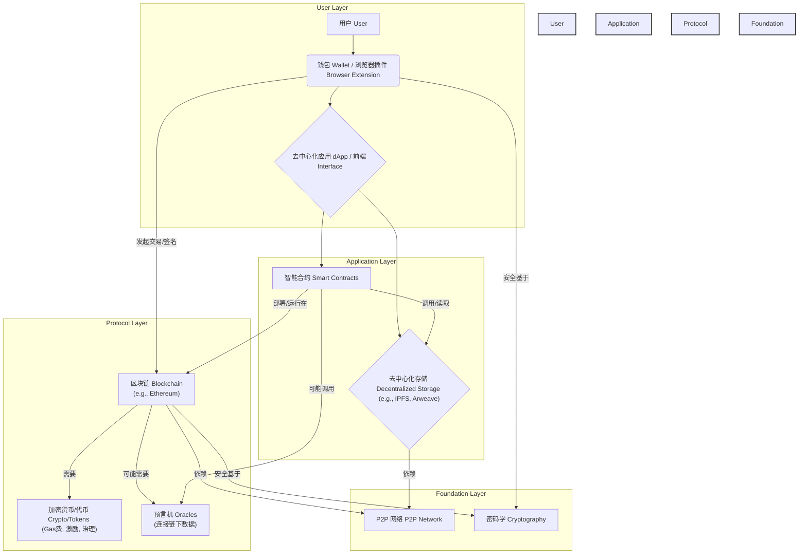

## 为什么 Web3 是下一代互联网架构   
      
### 作者      
digoal      
      
### 日期      
2025-04-23      
      
### 标签      
PostgreSQL , PolarDB , DuckDB , WEB3 , 去中心化    
      
----      
      
## 背景     
对 Ethereum.org 网站上关于 Web3 文章的中文解读：  
- https://ethereum.org/en/web3/  
  
## 什么是 Web3    
  
* **Web3 的目标**：Web3 旨在通过去中心化技术，将互联网的控制权从少数大型科技公司手中归还给用户。  
* **Web 的演变**：文章将互联网发展分为三个阶段：  
    * Web 1.0：只读的静态网页时代。  
    * Web 2.0：用户可以读写的互动时代（如社交媒体），但数据和平台主要由大公司控制。  
    * Web 3.0：用户不仅可以读写，还可以真正“拥有”自己的数据、内容和数字资产。  
* **Web3 的核心特性**：  
    * **去中心化**：网络不由单一实体控制，而是分布在许多计算机上。  
    * **无需许可**：任何人都可以参与，无需获得批准。  
    * **原生支付**：通常内置加密货币（如以太坊）进行交易，无需传统银行中介。  
    * **无需信任**：通过区块链等技术保证交易和互动的安全性与透明度，无需依赖中间人。  
* **用户赋权**：借助区块链、加密货币和 NFTs（非同质化代币）等技术，Web3 让用户对自己的数字身份、数据和资产拥有前所未有的控制权和所有权。用户还可以参与去中心化自治组织（DAO），共同管理和决策平台事务。  
* **身份和支付**：通过以太坊地址和 ENS（以太坊域名服务）简化了数字身份管理。加密货币使得支付更加直接，绕开了传统的金融机构。  
* **局限性**：文章也承认 Web3 目前还面临一些挑战，比如易用性、用户体验、普及教育以及对某些中心化基础设施的依赖等。  
  
Web3 是一个更去中心化、更公平、用户拥有更多控制权的下一代互联网愿景，尽管它仍处于发展初期。  
  
  
## Web3 背后的关键技术   
  
Web3 并不仅仅是单一的技术，而是一个由多种技术协同工作构成的生态系统，旨在构建一个去中心化、用户拥有所有权、更加开放和透明的互联网。其核心技术栈主要包括：  
  
1.  **区块链 (Blockchain)**  
    * **作用**: 这是 Web3 的基石。它是一个分布式、不可篡改、透明的数字账本。所有交易或数据记录在区块中，并通过密码学链接在一起，形成一个链条。  
    * **核心特性**:  
        * **去中心化 (Decentralization)**: 数据分布在网络的众多节点上，没有单一的控制中心，提高了系统的抗审查性和韧性。  
        * **不可篡改性 (Immutability)**: 一旦数据被写入区块链，就极难被修改或删除，保证了历史记录的真实性。  
        * **透明性 (Transparency)**: 大多数公链上的交易记录是对所有人可见的（虽然身份通常是假匿名的），增加了可审计性。  
    * **例子**: 以太坊 (Ethereum)、Solana、Polkadot、Bitcoin (虽然主要用于价值存储，但也具备基础的脚本能力)。以太坊是目前 Web3 应用最主要的底层区块链平台。  
  
2.  **智能合约 (Smart Contracts)**  
    * **作用**: 在区块链上运行的自动化脚本或程序。它们是根据预设逻辑自动执行条款的合约。当特定条件满足时，合约代码会自动执行。  
    * **核心特性**:  
        * **自动化**: 无需人工干预即可执行合约条款。  
        * **可信性**: 代码部署在区块链上，其执行结果是可预测且不可篡改的，减少了对中间信任方的依赖。  
        * **可编程性**: 使得开发者可以在区块链上构建复杂的去中心化应用 (dApps)。  
    * **例子**: Solidity (以太坊最常用的智能合约语言)、Vyper。去中心化交易所 (DEX)、借贷协议、NFT 市场等都依赖智能合约运行。  
  
3.  **加密货币/代币 (Cryptocurrencies/Tokens)**  
    * **作用**: 作为 Web3 生态系统中的价值载体和激励机制。  
    * **核心特性**:  
        * **原生支付**: 提供了一种去中心化的、无需许可的支付方式。  
        * **激励**: 用于奖励维护网络安全的节点（如矿工或验证者，通过 Gas 费或区块奖励），以及激励用户参与协议（如流动性挖矿）。  
        * **治理**: 许多项目的代币赋予持有者参与项目决策的投票权（DAO 治理）。  
        * **访问权**: 某些代币可能用于访问特定服务或功能。  
    * **例子**: ETH (以太坊的原生代币，用于支付 Gas 费)、各种 ERC-20 代币 (基于以太坊发行的同质化代币)、稳定币 (USDT, USDC)。  
  
4.  **去中心化存储 (Decentralized Storage)**  
    * **作用**: 解决区块链存储成本高、效率低的问题，提供分布式的、抗审查的数据存储方案。  
    * **核心特性**:  
        * **非中心化**: 文件被分割并存储在网络的多个节点上，而非单一服务器。  
        * **内容寻址**: 通过文件内容的哈希值（而不是位置）来检索文件，确保数据未被篡改。  
        * **冗余与持久性**: 数据有多份拷贝，提高了可用性和持久性。  
    * **例子**: IPFS (InterPlanetary File System，星际文件系统)、Arweave、Filecoin、Sia。dApps 的前端界面、NFT 的元数据等常存储在这些系统中。  
  
5.  **去中心化身份 (Decentralized Identity, DID)**  
    * **作用**: 让用户能够拥有和控制自己的数字身份，而不是依赖于中心化的身份提供商（如 Google, Facebook 登录）。  
    * **核心特性**:  
        * **用户控制**: 用户拥有其身份数据的所有权和控制权。  
        * **可验证性**: 用户可以有选择地向第三方证明其身份信息的某些方面，而无需透露所有信息（通过可验证凭证 Verifiable Credentials）。  
        * **可移植性**: 身份不被锁定在单一平台。  
    * **例子**: 用户通常使用其加密钱包地址（如以太坊地址）作为基本的 Web3 身份标识。ENS (Ethereum Name Service) 将难记的地址映射为易读的域名（如 `yourname.eth`）。W3C DID 标准正在发展中。  
  
6.  **预言机 (Oracles)**  
    * **作用**: 作为区块链与外部世界（链下数据）之间的桥梁。智能合约本身无法直接访问链下数据（如股票价格、天气信息、体育比赛结果等）。  
    * **核心特性**:  
        * **数据传输**: 安全地将链下数据输入到智能合约中，触发合约执行。  
        * **信任最小化**: 旨在通过去中心化、多数据源验证等方式，确保输入数据的准确性和可靠性。  
    * **例子**: Chainlink 是目前最广泛使用的去中心化预言机网络。  
  
7.  **点对点网络 (Peer-to-Peer, P2P) 技术**  
    * **作用**: 这是区块链、去中心化存储等技术运行的基础网络模型。节点之间直接通信和共享数据，无需中心服务器协调。  
    * **核心特性**:  
        * **无中心节点**: 提高了网络的健壮性。  
        * **直接通信**: 节点发现、数据广播等都在 P2P 网络层完成。  
    * **例子**: BitTorrent (虽然不是 Web3 原生，但展示了 P2P 的力量)、Libp2p (被 IPFS, Ethereum 等广泛使用的模块化网络栈)。  
  
8.  **密码学 (Cryptography)**  
    * **作用**: 提供安全保障的基础。  
    * **核心特性**:  
        * **哈希函数**: 用于创建数据的唯一指纹，确保数据完整性（如区块哈希）。  
        * **公钥/私钥加密**: 用于身份验证（数字签名）和安全通信，是用户控制钱包和资产的基础。  
    * **例子**: SHA-256 (比特币使用的哈希算法)、ECDSA (以太坊等使用的数字签名算法)。  
  
**这些技术如何协同工作？**  
  
一个典型的 Web3 应用 (dApp) 可能会这样运作：  
* **前端**: 用户界面可能托管在去中心化存储 (如 IPFS) 上。  
* **身份**: 用户通过连接他们的加密钱包 (如 MetaMask) 来登录和管理身份 (DID)。  
* **核心逻辑**: 应用的核心业务逻辑由部署在区块链 (如以太坊) 上的智能合约执行。  
* **数据**: 链上数据 (如代币余额) 存储在区块链上，而大文件或非关键数据可能存储在去中心化存储系统中。  
* **外部数据**: 如果需要现实世界的数据，智能合约会通过预言机 (如 Chainlink) 获取。  
* **价值交换**: 用户使用加密货币 (如 ETH 或稳定币) 支付交易费用 (Gas) 或进行应用内购买。  
  
总而言之，Web3 通过整合这些技术，试图构建一个更加开放、透明、用户自主可控的互联网基础设施和应用生态。当然，这些技术仍在快速发展中，面临着可扩展性、用户体验、监管等方面的挑战。  
  
  
## Web3 的核心技术组件及其相互关系   
  
### Web3 技术架构 Mermaid 图  
  

  
**图解说明:**  
  
1.  **用户层 (User Layer)**: 用户通过钱包（如 MetaMask）与 Web3 应用（dApp）的前端界面交互。钱包管理用户的密钥和身份。  
2.  **应用层 (Application Layer)**:  
    * dApp 的前端界面（可能托管在中心化服务器或去中心化存储上）调用后端逻辑。  
    * 后端逻辑主要由部署在区块链上的**智能合约**实现。  
    * 应用的大部分数据（如文章、图片、元数据）存储在**去中心化存储**系统（如 IPFS）中，以降低成本并提高抗审查性。智能合约中通常只存储指向这些数据的引用（如 IPFS CID）。  
3.  **协议层 (Protocol Layer)**:  
    * **区块链**是核心基础设施，提供去中心化的信任和执行环境。智能合约在此运行。  
    * **加密货币/代币**用于支付交易费用（Gas）、激励网络参与者和进行价值交换。  
    * 当智能合约需要获取现实世界的数据（如价格、天气）时，会通过**预言机**来实现。  
    * 用户的钱包直接与区块链交互以发送交易和签名消息。  
4.  **基础层 (Foundation Layer)**:  
    * **P2P 网络**支撑着区块链和去中心化存储的数据传输和节点通信。  
    * **密码学**（哈希、公私钥对等）保障了交易安全、用户身份验证和数据完整性。  
  
### 实际案例：去中心化博客平台（类似 Mirror.xyz）  
  
假设 Alice 想在一个去中心化的博客平台上发布一篇文章，并希望读者 Bob 能够阅读并给她打赏。  
  
**分步详解：**  
  
1.  **步骤 1：连接身份 (用户层 -> 协议层)**  
    * **Alice 操作**: Alice 访问去中心化博客平台的网站。她点击 "Connect Wallet" 按钮。  
    * **技术**: 她的浏览器**钱包插件** (B) (如 MetaMask) 弹出，请求授权连接。Alice 授权后，她的**区块链地址**就被用作她在该平台上的身份标识 (DID 的一种形式)。这个过程利用了**密码学** (J) 进行签名验证。  
  
2.  **步骤 2：创作与存储 (应用层)**  
    * **Alice 操作**: Alice 在平台的编辑器中撰写文章。完成后点击 "Publish"。  
    * **技术**:  
        * 平台的前端 (C) 将文章内容（文字、图片）上传到**去中心化存储网络 (E)** (如 IPFS)。  
        * IPFS 返回一个独一无二的内容标识符 (CID)，例如 `QmXyZ...`。这个 CID 代表了这篇文章的内容。  
  
3.  **步骤 3：发布上链 (应用层 -> 协议层)**  
    * **Alice 操作**: 平台提示 Alice 需要发起一笔区块链交易来记录这次发布。钱包插件弹出交易确认请求，显示需要支付少量 Gas 费。Alice 点击确认。  
    * **技术**:  
        * 钱包 (B) 使用 Alice 的私钥对交易进行**签名** (J)。  
        * 交易被发送到**区块链 (F)** (如 Ethereum)。  
        * 交易调用博客平台的**智能合约 (D)**。  
        * 智能合约执行逻辑：将 Alice 的地址与文章的 IPFS CID (从步骤 2 获得) 关联起来，记录在区块链上。这相当于声明：“地址 `0xAlice...` 发布了内容为 `QmXyZ...` 的文章”。  
        * Alice 支付的 Gas 费 (G) (用 ETH) 奖励给验证/打包这笔交易的区块链节点。  
  
4.  **步骤 4：读者发现与阅读 (应用层 -> 协议层 -> 应用层)**  
    * **Bob 操作**: Bob 访问该博客平台。  
    * **技术**:  
        * 平台前端 (C) 从**区块链 (F)** (通过读取智能合约 D 的状态) 查询最新的文章列表。它找到了 Alice 地址和对应 IPFS CID 的记录。  
        * 前端使用获取到的 IPFS CID (`QmXyZ...`) 从**去中心化存储网络 (E)** (IPFS) 拉取文章内容。  
        * 文章内容在 Bob 的浏览器中显示出来。  
  
5.  **步骤 5：打赏 (用户层 -> 协议层)**  
    * **Bob 操作**: Bob 觉得文章很棒，点击 "Tip Author" 按钮。他输入想要打赏的金额（例如 0.01 ETH），并通过他的钱包确认交易。  
    * **技术**:  
        * Bob 的钱包 (B) 创建并**签名** (J) 一笔**加密货币 (G)** 转账交易。  
        * 该交易从 Bob 的地址发送 0.01 ETH 到 Alice 在区块链 (F) 上公开的地址 (`0xAlice...`)。  
        * Bob 也需要支付 Gas 费 (G)。  
        * 交易被区块链确认后，Alice 的钱包余额增加 0.01 ETH。  
  
**这个案例体现的 Web3 特点：**  
  
* **用户拥有身份**: Alice 和 Bob 通过自己的钱包控制身份，无需平台注册。  
* **内容所有权与抗审查**: 文章内容存储在 IPFS 上，并通过区块链记录归属，不易被单一平台删除或审查。只要有人愿意在 IPFS 网络中存储 (pin) 该内容，它就一直存在。  
* **直接价值传递**: Bob 的打赏直接进入 Alice 的钱包，没有中间平台抽成（除了区块链本身的 Gas 费）。  
* **透明度**: 发布记录和打赏交易都在公共区块链上可查。  
* **组合性**: 不同技术（钱包、区块链、智能合约、IPFS、加密货币）协同工作，构成了一个完整的应用。  
  
## 哪些行业最需要web3, 为什么?
判断哪些行业“最”需要 Web3 取决于衡量标准，但通常是指那些现有模式存在显著痛点（如中心化、不透明、中介过多、用户缺乏所有权）并且 Web3 技术能提供颠覆性解决方案的行业。

以下是一些被认为最需要 Web3 的行业及其原因：

1.  **金融服务 (尤其是 DeFi - 去中心化金融)**
    * **为什么需要？**
        * **中介过多与效率低下**: 传统金融依赖银行、清算所等大量中介，流程复杂、速度慢、成本高。
        * **准入限制**: 全球仍有数十亿人无法获得基础银行服务。
        * **缺乏透明度**: 许多金融操作对普通用户不透明。
        * **中心化风险**: 单点故障、审查或机构倒闭风险。
    * **Web3 如何解决？**
        * **去中介化**: 智能合约可以自动执行金融协议（借贷、交易、衍生品），减少对传统中介的依赖。
        * **无许可访问**: 任何有互联网连接的人都可以参与 DeFi 协议，降低准入门槛。
        * **透明性**: 交易记录在公共区块链上可查询（在一定程度上）。
        * **提高效率**: 自动化流程和更快的结算速度。
        * **用户控制**: 用户通过自己的钱包掌控资产。

2.  **创意产业与娱乐 (艺术、音乐、游戏、媒体)**
    * **为什么需要？**
        * **创作者收益分配不公**: 中间平台（唱片公司、流媒体平台、画廊）抽成过高，创作者难以获得合理收入。
        * **知识产权 (IP) 保护与追踪困难**: 盗版、侵权普遍，原创者权益难保障。
        * **数字所有权模糊**: 用户购买的数字内容（音乐、游戏道具）往往只是获得了使用许可，而非真正所有权。
        * **粉丝经济连接不直接**: 创作者与粉丝的互动和价值交换依赖平台。
    * **Web3 如何解决？**
        * **NFTs (非同质化代币)**: 明确数字资产（艺术品、音乐版权、游戏道具、收藏品）的唯一所有权，可验证、可追溯、可交易。创作者可通过智能合约设定版税，在每次转售中持续获利。
        * **去中心化平台**: 减少对中间平台的依赖，让创作者更直接地触达粉丝并获得收益。
        * **代币化社区 (DAO)**: 粉丝可以通过持有代币参与社区治理，与创作者建立更紧密的联系。
        * **Play-to-Earn/Own (游戏)**: 玩家可以通过玩游戏赚取加密货币或拥有可交易的游戏内资产 (NFTs)，改变传统游戏模式。

3.  **供应链管理与物流**
    * **为什么需要？**
        * **缺乏透明度与可追溯性**: 复杂供应链中，各环节信息不透明，难以追踪产品来源、真伪和状态。
        * **数据孤岛**: 各参与方（制造商、物流商、零售商）系统不互通，数据共享困难。
        * **效率低下与错误**: 纸质文件、手动流程多，易出错且效率低。
        * **假冒伪劣**: 难以有效防止假货进入供应链。
    * **Web3 如何解决？**
        * **区块链记录**: 将关键节点信息（生产批次、物流状态、所有权转移）记录在不可篡改的区块链上，提高透明度和可追溯性。
        * **共享账本**: 所有授权参与方可以访问同一个可信的数据源。
        * **智能合约**: 自动执行协议（如货物到达自动付款），提高效率。
        * **产品溯源**: 通过将实物与区块链上的数字身份（如 NFT 或记录）绑定，验证产品真伪。

4.  **数字身份与数据主权**
    * **为什么需要？**
        * **中心化身份管理**: 用户身份信息由大型平台（Google, Facebook 等）控制，存在数据泄露、滥用风险，用户缺乏控制权。
        * **身份验证繁琐**: 需要在不同平台重复注册和验证身份。
        * **数据隐私**: 用户对自己的数据如何被使用几乎没有控制力。
    * **Web3 如何解决？**
        * **去中心化身份 (DID)**: 用户拥有并控制自己的数字身份，可以自主选择向谁、在何种程度上共享自己的信息（使用可验证凭证）。
        * **钱包即身份**: 使用加密钱包作为跨平台的统一登录和身份验证工具。
        * **数据所有权**: 结合去中心化存储，用户可以真正拥有和控制自己的数据。

**其他有显著需求的领域包括：**

* **社交媒体**: 解决数据所有权、内容审查、创作者经济等问题。
* **投票与治理**: 提高透明度和可审计性，尤其是在 DAO（去中心化自治组织）中。
* **房地产**: 通过代币化实现部分所有权，提高流动性（但面临监管挑战）。

总的来说，任何存在信任问题、依赖低效中介、缺乏透明度或用户对其数据/资产缺乏控制权的行业，都可能从 Web3 技术中获益匪浅，因此可以说是“最需要”Web3 的行业。
     
<b> 以上内容基于DeepSeek、Qwen及诸多AI生成, 轻微人工调整, 感谢杭州深度求索人工智能、阿里云等公司. </b>      
      
<b> AI 生成的内容请自行辨别正确性, 当然也多了些许踩坑的乐趣, 毕竟冒险是每个男人的天性.  </b>      
  
  
#### [期望 PostgreSQL|开源PolarDB 增加什么功能?](https://github.com/digoal/blog/issues/76 "269ac3d1c492e938c0191101c7238216")
  
  
#### [PolarDB 开源数据库](https://openpolardb.com/home "57258f76c37864c6e6d23383d05714ea")
  
  
#### [PolarDB 学习图谱](https://www.aliyun.com/database/openpolardb/activity "8642f60e04ed0c814bf9cb9677976bd4")
  
  
#### [PostgreSQL 解决方案集合](../201706/20170601_02.md "40cff096e9ed7122c512b35d8561d9c8")
  
  
#### [德哥 / digoal's Github - 公益是一辈子的事.](https://github.com/digoal/blog/blob/master/README.md "22709685feb7cab07d30f30387f0a9ae")
  
  
#### [About 德哥](https://github.com/digoal/blog/blob/master/me/readme.md "a37735981e7704886ffd590565582dd0")
  
  

  
