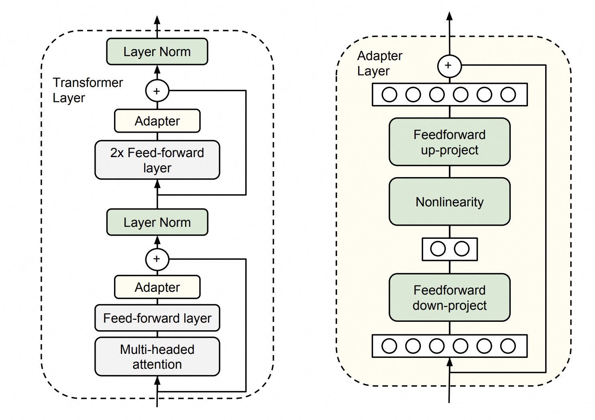

## AI论文解读 | Adapter 微调, Parameter-Efficient Transfer Learning for NLP   
                      
### 作者                      
digoal                      
                      
### 日期                      
2025-04-23                     
                      
### 标签                      
PostgreSQL , PolarDB , DuckDB , AI , 论文解读          
                      
----                      
                      
## 背景             
https://arxiv.org/pdf/1902.00751    
    
提示:    
```    
读懂《Parameter-Efficient Transfer Learning for NLP》这篇论文需要提前掌握哪些基础知识, 请给我讲一下这些基础知识, 尽量通熟易懂, 可以使用markdown支持的图形增加解释性.       
    
通熟易懂的解读《Parameter-Efficient Transfer Learning for NLP》这篇论文, 关键内容请深入讲解, 可以使用markdown支持的图形增加解释性.       
    
提取《Parameter-Efficient Transfer Learning for NLP》论文中一些重要的术语并详细解释, 可以使用markdown支持的图形示增加解释性.       
```    
    
## 1 前置知识    
《Parameter-Efficient Transfer Learning for NLP》是谷歌提出的“参数高效迁移学习”论文，也就是著名的“Adapter”方法的开山之作。为了读懂这篇论文，你需要以下几个基础知识：  
  
---  
  
### 1. 预训练-微调范式（Pretraining & Fine-tuning）  
  
- **预训练**：先在大规模语料上训练一个通用的模型（如BERT）。  
- **微调**：再用少量特定任务的数据，对模型做小幅度调整以适应新任务。  
  
**示意图**：  
  
```  
+-----------------------+   微调    +-----------------------+  
|  预训练模型（如BERT）   |   ----->  |  针对下游任务的新模型    |  
+-----------------------+          +-----------------------+  
```  
  
---  
  
### 2. Transformer模型结构  
  
Transformer是目前NLP主流的神经网络结构，具有“自注意力”机制。  
  
- **输入嵌入**（Embedding）  
- **多层编码器**（Encoder Layers）  
- **自注意力机制**（Self-Attention）  
- **残差连接和层归一化**（Residual & LayerNorm）  
  
**简化结构图**：  
  
```  
[Input] → [Embedding] → [Encoder Layer 1] → [Encoder Layer 2] → ... → [Output]  
```  
  
每个Encoder Layer包含：  
  
```  
+-----------------------------+  
|  Self-Attention             |  
+-----------------------------+  
|  Add & LayerNorm            |  
+-----------------------------+  
|  Feed Forward               |  
+-----------------------------+  
|  Add & LayerNorm            |  
+-----------------------------+  
```  
  
---  
  
### 3. 迁移学习（Transfer Learning）  
  
将一个任务上学到的知识迁移到另一个任务。NLP中常见做法：  
- 先用大数据训练通用模型  
- 再用新任务的小数据微调  
  
---  
  
### 4. 参数量与参数高效性  
  
- **全部微调**：下游任务需要为每个任务存储一套完整的大模型参数（如1亿）。  
- **参数高效**：只存储很少的新参数，其余参数共享，大大节省存储和训练成本。  
  
---  
  
### 5. Adapter方法核心思想  
  
Adapter是一种小模块，插入到Transformer各层之间，只训练这些小模块，其余参数保持不变。  
  
**Adapter结构示意**：  
  
```  
原始层输出  
    |  
    v  
+-----------------+  
|     Adapter     |  
|  (小MLP结构)     |  
+-----------------+  
    |  
    v  
加回原始层输出（残差连接）  
```  
  
**整体结构对比**：  
  
```  
普通微调：  
[Input] → [Transformer Layer 1] → ... → [Transformer Layer N] → [Output]  
          (全部参数都可训练)  
  
Adapter微调：  
[Input] → [Layer 1] → [Adapter 1] → ... → [Layer N] → [Adapter N] → [Output]  
          (仅Adapter参数可训练)  
```  
  
---  
  
### 6. 层归一化（LayerNorm）与残差连接  
  
- **LayerNorm**：规范化激活值，加快收敛、提升稳定性。  
- **残差连接**：防止梯度消失，允许信息直接传递。  
  
---  
  
### 7. 微调方式的对比  
  
| 方法         | 参数量 | 训练效率 | 存储需求 | 适用场景 |  
|--------------|--------|----------|----------|----------|  
| 全部微调     | 高     | 慢       | 高       | 任务少   |  
| Adapter微调  | 低     | 快       | 低       | 多任务   |  
  
---  
  
### 8. 基本前置知识  
  
- 神经网络基本原理（如什么是参数、激活函数等）  
- 反向传播与梯度下降  
- NLP基础任务（分类、序列标注等）  
  
---  
  
### 总结思维导图  
  
```  
预训练-微调  
   |  
   V  
Transformer结构  
   |  
   V  
迁移学习思想  
   |  
   V  
参数高效思路（Adapter）  
   |  
   V  
实际应用与对比  
```  
  
---  
  
#### 推荐阅读顺序  
  
1\. 神经网络与深度学习基础  
2\. Transformer与BERT基础  
3\. 迁移学习与微调  
4\. Adapter思想及其结构  
  
如需针对某一块深入讲解，请告诉我！  
    
## 2 解读论文    
    
好的！下面我将用通俗易懂的方式，结合图示，对《Parameter-Efficient Transfer Learning for NLP》（Adapter论文）的关键内容进行解读。    
你无需具备很深的数学背景，理解深度学习和Transformer的大致原理即可轻松阅读。  
  
---  
  
### 一、论文的核心问题是什么？  
  
#### 传统微调（Fine-tuning）的困境  
  
- 预训练模型（如BERT、GPT）很强大，但每当你要做新任务时，通常需要**复制一套完整的模型参数**进行微调。  
- 这样，**每个任务都要存储一套大模型**，比如每个任务都要再存一份1亿参数，消耗大量存储和计算资源。  
  
---  
  
### 二、论文的主要创新点  
  
**提出了一种“Adapter”结构**，只需在每层Transformer中间插入很小的“适配器”模块，    
微调时**只训练这些Adapter模块**，其余大模型参数保持不变。  
  
- **效果**：几乎不损失精度，却大大节省参数和资源。  
- **优点**：参数高效、易于多任务扩展、节省存储。  
  
---  
  
### 三、Adapter是怎么工作的？  


  
#### 1. Transformer结构回顾  
  
```  
[输入] → [Embedding] → [Encoder层1] → ... → [Encoder层N] → [输出]  
```  
  
#### 2. 插入Adapter后的结构  
  
```  
[输入]  
  |  
  v  
[Embedding]  
  |  
  v  
[Encoder层1]  
  |  
  v  
[Adapter1]   ← 只训练Adapter1的参数  
  |  
  v  
[Encoder层2]  
  |  
  v  
[Adapter2]   ← 只训练Adapter2的参数  
  |  
  v  
...  
  |  
  v  
[输出]  
```  
  
**图示（简化版）：**  
  
```  
┌────────────┐  
│ Encoder层  │  
└─────┬──────┘  
      │  
┌─────▼──────┐  
│  Adapter   │  ← 只训练Adapter参数  
└─────┬──────┘  
      │  
  (下一层)  
```  
  
---  
  
### 四、Adapter模块内部结构  
  
Adapter其实是一个极简“小神经网络”，包含两层线性变换和一个非线性激活。  
  
**结构公式：**  
  
- 输入x → 降维（Linear Down） → 激活（ReLU） → 升维（Linear Up） → 输出  
- 输出和原始输入相加（残差连接）  
  
**图示：**  
  
```  
输入x  
  │  
  ▼  
┌───────────────┐  
│  Linear Down  │  （把维度降低很多，比如原来是768，降到64）  
└───────────────┘  
  │  
  ▼  
┌───────────────┐  
│    ReLU       │  
└───────────────┘  
  │  
  ▼  
┌───────────────┐  
│  Linear Up    │  （再升回原始维度）  
└───────────────┘  
  │  
  ▼  
加回输入x（残差连接）  
  │  
  ▼  
输出  
```  
  
---  
  
### 五、参数量对比  
  
| 方法         | 每个任务需要训练的参数量 | 精度   | 存储需求 |  
|--------------|------------------------|--------|--------|  
| 全量微调     | 100%                   | 高     | 高     |  
| Adapter      | 3%~5%                  | 几乎无损| 低    |  
  
**形象比喻：**    
传统微调是“每个任务都买一栋大楼”，Adapter是“每个任务只装修几个小房间”。  
  
---  
  
### 六、Adapter的优势  
  
1\. **高效**：只需微调少量参数，节省时间和显存。  
2\. **易扩展**：多任务时，只需加Adapter，不用复制整模型。  
3\. **易于分享**：可以只发布Adapter参数，保护大模型知识产权。  
  
---  
  
### 七、实际应用举例  
  
- 用一个BERT模型作为底座，针对10个NLP任务，每个任务只训练/存储自己的Adapter模块，实现多任务“轻量切换”。  
- **如图：**  
  
```  
[通用BERT]  
      │  
 ┌────┴────┐  
 │         │  
[Adapter1][Adapter2]  
用于任务1  用于任务2  
```  
  
---  
  
### 八、论文的实验结论  
  
- 在多项NLP任务（如文本分类、问答等）上，Adapter方法与全量微调效果几乎一样。  
- 只需微调3%~4%的参数量。  
  
---  
  
### 九、总结与思维导图  
  
```  
预训练大模型  
    │  
    ├─ 全量微调：每任务复制全模型，耗资源  
    │  
    └─ Adapter微调：只加小模块，省参数，精度高  
```  
  
---  
  
### 结语  
  
**一句话总结：**    
Adapter让“一个大模型，服务多个任务”变得简单高效，极大降低了NLP迁移学习的门槛。  
  
如果你想进一步了解某一细节（如Adapter代码实现、效果对比等），欢迎追问！  
    
## 3 术语    
    
### 《Parameter-Efficient Transfer Learning for NLP》重要术语详解  
  
---  
  
#### 1. 预训练（Pretraining）  
  
**定义**：    
在大规模通用文本（如维基百科）上训练模型，让模型学会基础的语言知识。  
  
**图示**：  
```  
[大规模文本数据] --训练--> [预训练模型]  
```  
  
---  
  
#### 2. 微调（Fine-tuning）  
  
**定义**：    
将预训练好的模型用少量下游任务数据做针对性训练，从而适应具体任务。  
  
**图示**：  
```  
[预训练模型] + [下游任务数据] --微调--> [任务专用模型]  
```  
  
---  
  
#### 3. Transformer  
  
**定义**：    
目前NLP主流的神经网络结构，核心为自注意力机制（Self-Attention），能够建模长距离依赖。  
  
**简化结构**：  
```  
[输入] → [嵌入] → [多层Encoder] → [输出]  
```  
  
---  
  
#### 4. Adapter  
  
**定义**：    
一种轻量级模块，被插入到Transformer每一层之间。只在微调时训练Adapter参数，而主模型参数保持不变。  
  
**结构图**：  
```  
Transformer层输出  
     │  
┌────▼────┐  
│ Adapter │ ← (仅训练Adapter参数)  
└────┬────┘  
     │  
残差加回  
     │  
输出  
```  
  
---  
  
#### 5. 迁移学习（Transfer Learning）  
  
**定义**：    
将一个任务上学到的知识迁移到另一个任务上。NLP中常用“预训练+微调”范式。  
  
---  
  
#### 6. 参数高效（Parameter-Efficient）  
  
**定义**：    
只引入极少的新参数，复用大部分已有参数，显著减少存储和训练资源消耗。  
  
**形象比喻**：    
“改建新房间而不是重盖整栋大楼。”  
  
---  
  
#### 7. 残差连接（Residual Connection）  
  
**定义**：    
神经网络中常用结构，把输入直接加到输出上，帮助训练深层模型，防止梯度消失。  
  
**图示**：  
```  
输入  
 │  
 ▼  
[模块]  
 │  
 ▼  
输出+输入（残差）  
```  
  
---  
  
#### 8. 层归一化（Layer Normalization）  
  
**定义**：    
对每一层的输出做归一化处理，加速模型训练、提高稳定性。  
  
---  
  
#### 9. 下游任务（Downstream Task）  
  
**定义**：    
指在实际应用阶段要解决的具体任务，比如文本分类、情感分析、命名实体识别等。  
  
---  
  
#### 10. 降维（Down-Projection）与升维（Up-Projection）  
  
**定义**：    
Adapter内部先将输入特征“降维”到较小空间，再“升维”回原空间，主要作用是参数压缩和特征提取。  
  
**结构图**：  
```  
输入  
 │  
 ▼  
降维(Linear Down)  
 │  
 ▼  
激活(ReLU)  
 │  
 ▼  
升维(Linear Up)  
 │  
 ▼  
输出  
```  
  
---  
  
### 总结结构图  
  
```  
                 ┌───────────────┐  
                 │  预训练模型   │  
                 └─────┬─────────┘  
                       │  
                 ┌─────▼─────────┐  
                 │  Adapter模块  │ ← 只训练少量参数  
                 └─────┬─────────┘  
                       │  
                 ┌─────▼─────────┐  
                 │ 下游任务模型  │  
                 └───────────────┘  
```  
  
如需进一步讲解某个术语，欢迎追问！  
    
    
## 参考    
https://arxiv.org/pdf/1902.00751  
    
https://edu.aliyun.com/course/3126500/lesson/342510265    
    
https://github.com/AlibabaCloudDocs/aliyun_acp_learning/blob/main/%E5%A4%A7%E6%A8%A1%E5%9E%8BACP%E8%AE%A4%E8%AF%81%E6%95%99%E7%A8%8B/p2_%E6%9E%84%E9%80%A0%E5%A4%A7%E6%A8%A1%E5%9E%8B%E9%97%AE%E7%AD%94%E7%B3%BB%E7%BB%9F/2_7_%E9%80%9A%E8%BF%87%E5%BE%AE%E8%B0%83%E6%8F%90%E5%8D%87%E6%A8%A1%E5%9E%8B%E7%9A%84%E5%87%86%E7%A1%AE%E5%BA%A6%E4%B8%8E%E6%95%88%E7%8E%87.ipynb    
    
    
    
<b> 以上内容基于DeepSeek、QwQ及诸多AI生成, 轻微人工调整, 感谢杭州深度求索人工智能、阿里云等公司. </b>              
              
<b> AI 生成的内容请自行辨别正确性, 当然也多了些许踩坑的乐趣, 毕竟冒险是每个男人的天性.  </b>              
      
  
#### [期望 PostgreSQL|开源PolarDB 增加什么功能?](https://github.com/digoal/blog/issues/76 "269ac3d1c492e938c0191101c7238216")
  
  
#### [PolarDB 开源数据库](https://openpolardb.com/home "57258f76c37864c6e6d23383d05714ea")
  
  
#### [PolarDB 学习图谱](https://www.aliyun.com/database/openpolardb/activity "8642f60e04ed0c814bf9cb9677976bd4")
  
  
#### [PostgreSQL 解决方案集合](../201706/20170601_02.md "40cff096e9ed7122c512b35d8561d9c8")
  
  
#### [德哥 / digoal's Github - 公益是一辈子的事.](https://github.com/digoal/blog/blob/master/README.md "22709685feb7cab07d30f30387f0a9ae")
  
  
#### [About 德哥](https://github.com/digoal/blog/blob/master/me/readme.md "a37735981e7704886ffd590565582dd0")
  
  

  
