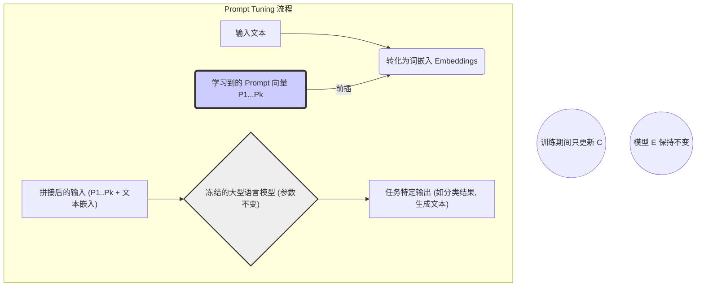
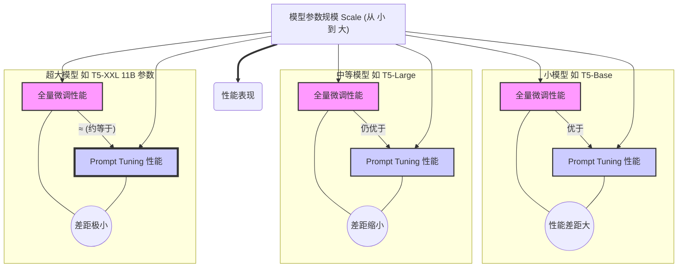

## AI论文解读 | 提示词微调, The Power of Scale for Parameter-Efficient Prompt Tuning    
    
### 作者    
digoal    
    
### 日期    
2025-04-24    
    
### 标签    
PostgreSQL , PolarDB , DuckDB , AI , 论文解读    
    
----    
    
## 背景    
https://arxiv.org/pdf/2104.08691    
    
提示:    
```    
读懂《The Power of Scale for Parameter-Efficient Prompt Tuning》这篇论文需要提前掌握哪些基础知识, 请给我讲一下这些基础知识, 尽量通熟易懂, 可以使用markdown支持的图形增加解释性.    
    
通熟易懂的解读《The Power of Scale for Parameter-Efficient Prompt Tuning》这篇论文, 关键内容请深入讲解, 可以使用markdown支持的图形增加解释性.    
    
提取《The Power of Scale for Parameter-Efficient Prompt Tuning》论文中一些重要的术语并详细解释, 可以使用markdown支持的图形示增加解释性.    
```    
    
## 1 前置知识    
  
好的，为了帮助你理解《The Power of Scale for Parameter-Efficient Prompt Tuning》这篇论文，我们来梳理一下需要掌握的基础知识。我会尽量用通俗易懂的方式解释，并使用 Markdown 图形来辅助说明。  
  
**核心目标：** 这篇论文主要探讨了一种叫做 "Prompt Tuning" (提示调优) 的技术，尤其是在 **大型语言模型 (Large Language Models, LLMs)** 上，这种技术如何在 **参数效率 (Parameter-Efficient)** 方面表现优异，并且其效果会随着模型 **规模 (Scale)** 的增大而增强。  
  
**需要掌握的基础知识点：**  
  
1.  **大型语言模型 (Large Language Models, LLMs)**  
    * **是什么：** 指的是那些在海量文本数据上训练出来的、拥有巨大参数量（通常数十亿甚至上万亿）的神经网络模型，例如 GPT-3, BERT, T5 等。  
    * **能做什么：** 它们擅长理解和生成人类语言，可以完成翻译、摘要、问答、写代码、创作等多种任务。  
    * **为什么重要：** Prompt Tuning 主要就是应用在这些大型模型上的技术。  
    * **通俗理解：** 想象一个读遍了互联网所有书籍和文章的“超级大脑”，它能理解语言的细微差别，并能根据你的要求（提示）生成相关的文本。  
  
    ```mermaid  
    graph LR  
        A[海量文本数据] --> B(训练过程);  
        B --> C{"大型语言模型 (LLM)"};  
        C --> D[理解与生成文本];  
    ```  
  
2.  **Transformer 架构**  
    * **是什么：** 这是目前主流 LLMs（如 GPT、BERT）所使用的核心神经网络架构。其关键在于 **自注意力机制 (Self-Attention Mechanism)**。  
    * **自注意力机制：** 允许模型在处理一个词时，同时关注输入序列中的所有其他词，并根据相关性分配不同的“注意力权重”。这使得模型能更好地理解上下文和长距离依赖关系。  
    * **为什么重要：** Prompt Tuning 的具体实现方式通常与 Transformer 的输入层或内部结构有关。理解其基本工作原理有助于理解 Prompt Tuning 的作用位置。  
    * **通俗理解：** 就像你阅读句子时，大脑会根据当前阅读的词，自动判断句子中哪些其他词与它关系最密切，从而更好地理解整句话的意思。Transformer 的注意力机制就是模拟这个过程。  
  
    ```mermaid  
    graph TD  
        subgraph Transformer Block  
            direction LR  
            E[输入嵌入 + 位置编码] --> F(多头自注意力);  
            F --> G(残差连接 & 层归一化);  
            G --> H(前馈神经网络);  
            H --> I(残差连接 & 层归一化);  
        end  
        I --> J[输出];  
    ```  
    *(这是一个非常简化的表示，实际结构更复杂)*  
  
3.  **迁移学习 (Transfer Learning) 与 微调 (Fine-tuning)**  
    * **是什么：**  
        * **预训练 (Pre-training):** 先用海量的通用数据训练一个基础模型 (LLM)，让它掌握广泛的语言知识。  
        * **微调 (Fine-tuning):** 然后，针对某个具体的下游任务（如情感分析、文本分类），使用该任务相关的少量标注数据，继续训练预训练好的模型，调整其 **所有** 或 **大部分** 参数，使其适应新任务。  
    * **为什么重要：** 这是在 Prompt Tuning 出现之前，让 LLM 适应新任务的最常用方法。Prompt Tuning 是对 Fine-tuning 的一种改进或替代方案。  
    * **通俗理解：** 就像一个大学生（预训练模型）先学习了各种基础知识，然后在研究生阶段（微调）专注于某个特定领域（下游任务），通过学习该领域的专业知识（任务数据）来调整自己的知识结构（模型参数）。  
  
    ```mermaid  
    graph LR  
        K["通用大模型 (Pre-trained LLM)"] -- 使用少量任务数据 --> L(微调 Fine-tuning);  
        L -- 更新所有/大部分参数 --> M{针对特定任务的模型};  
    ```  
  
4.  **Fine-tuning 的局限性 (引出 PEFT 的动机)**  
    * **问题：** 对于超大型 LLM，即使是微调，也需要为 **每一个** 新任务存储一份几乎完整的模型副本（因为大部分参数都调整了）。这导致存储成本高昂，部署和管理也非常不便。  
    * **通俗理解：** 如果你想让“超级大脑”同时擅长 100 个不同的任务，用传统微调方法，你可能需要复制 100 个几乎一样大、但细节略有不同的“大脑”，非常占地方。  
  
    ```mermaid  
    graph TD  
        N[一个大型 Pre-trained LLM] --> O(为任务 A 微调);  
        N --> P(为任务 B 微调);  
        N --> Q(为任务 C 微调);  
        O --> R["存储完整的模型 A (巨大)"];  
        P --> S["存储完整的模型 B (巨大)"];  
        Q --> T["存储完整的模型 C (巨大)"];  
        subgraph 问题  
            direction LR  
            R; S; T;  
            U((存储开销巨大))  
        end  
    ```  
  
5.  **参数高效微调 (Parameter-Efficient Fine-Tuning, PEFT)**  
    * **是什么：** 一系列旨在解决 Fine-tuning 局限性的方法。它们的核心思想是在微调时 **冻结 (freeze)** 原始 LLM 的绝大部分参数，只调整 **极少数** 参数或 **添加少量新参数** 来适应新任务。  
    * **有哪些方法：** 除了 Prompt Tuning，还包括 Adapter Tuning, LoRA (Low-Rank Adaptation), BitFit 等。  
    * **为什么重要：** Prompt Tuning 是 PEFT 家族中的一员。理解 PEFT 的目标有助于理解 Prompt Tuning 的价值。  
    * **通俗理解：** 还是那个“超级大脑”，现在我们不复制大脑了。对于每个新任务，我们只给大脑配上一个很小的“外挂”或“插件”（少量可调参数）。大脑主体保持不变，通过不同的“插件”来执行不同的任务。  
  
    ```mermaid  
    graph TD  
        V["一个大型 Pre-trained LLM (绝大部分参数冻结)"] -- 添加/调整少量参数 --> W(PEFT 模块 - 任务 A);  
        V -- 添加/调整少量参数 --> X(PEFT 模块 - 任务 B);  
        V -- 添加/调整少量参数 --> Y(PEFT 模块 - 任务 C);  
         subgraph 优点  
            direction LR  
           Z((存储开销小)) -- W & X & Y --> Z;  
           AA((训练/切换任务快)) -- W & X & Y --> AA;  
         end  
    ```  
  
6.  **提示 (Prompting) 的基本概念**  
    * **是什么：** 指通过在输入文本中添加指令、示例或上下文（即 "Prompt"），来引导 **不做任何修改** 的预训练 LLM 直接执行特定任务。  
    * **通俗理解：** 你直接告诉“超级大脑”要做什么，比如：“请把下面这句话翻译成法语：‘你好世界’”。你不需要修改大脑本身，只需要把要求说清楚。  
    * **与 Prompt Tuning 的区别：** 基本 Prompting 是设计 **人类可读的文本提示**，而 Prompt Tuning 是学习 **机器更容易理解的“软提示”**。  
  
    ```mermaid  
    graph LR  
        BB["文本提示 (如: 翻译成法语:)"] --> CC["输入文本 (如: 你好世界)"];  
        CC -- 输入给 --> DD{冻结的 LLM};  
        DD --> EE["输出 (如: Bonjour le monde)"];  
    ```  
  
7.  **提示调优 (Prompt Tuning)**  
    * **是什么：** 这篇论文的核心技术。它属于 PEFT 的一种。它 **冻结整个 LLM** 的参数，然后为每个任务学习一组 **连续的、虚拟的向量**（称为 "soft prompt" 或 "prompt embeddings"），这些向量会添加到输入文本的嵌入表示前面。在训练时，**只更新这些 Prompt 向量**，模型其他部分完全不变。  
    * **与基本 Prompting 的区别：** 基本 Prompting 需要人工设计离散的文本提示，效果可能不稳定。Prompt Tuning 则让模型自己学习最优的、连续的“提示向量”，通常效果更好、更稳定，并且这些向量参数量非常少。  
    * **为什么参数高效：** 因为只训练和存储这些少量的 Prompt 向量（比如每个任务可能只需要几百到几千个参数），而不是数十亿的模型参数。  
    * **通俗理解：** 我们不再用人类语言写提示了。想象一下，我们找到了一种特殊的“魔法咒语”（Prompt 向量），它不是文字，而是一串数字。把这串数字加在输入前面，送给那个冻结的“超级大脑”，大脑就能自动理解并执行特定任务（比如翻译）。对于每个任务，我们只需要学习并记住对应的“魔法咒语”即可，咒语本身很短。  
  
    ```mermaid  
    graph TD  
        FF[输入文本嵌入]  
        GG(可学习的 Prompt 向量) -- 添加到 --> FF;  
        FF --> HH{冻结的 LLM};  
        HH --> II[任务输出];  
        subgraph 训练过程  
            JJ((只更新 Prompt 向量 GG))  
        end  
    ```  
  
8.  **规模 (Scale) 的力量**  
    * **论文核心发现：** 这篇论文的关键洞察是，Prompt Tuning 的效果与 **底层 LLM 的规模** 密切相关。当 LLM 模型参数量**越大**时，Prompt Tuning 的表现就**越好**，甚至能达到或接近传统 Full Fine-tuning 的性能水平。而在较小的模型上，Prompt Tuning 可能不如 Fine-tuning。  
    * **为什么重要：** 这解释了为什么 Prompt Tuning 对于拥有超大模型的场景（如 Google, OpenAI 等）特别有吸引力。它证明了在足够大的模型规模下，这种参数高效的方法是极其有效的。  
    * **通俗理解：** 之前说的“魔法咒语”（Prompt 向量）在面对一个知识渊博、能力超强的“超级大脑”（超大 LLM）时，效果特别好，几乎能让它做到和经过全面专业训练（Fine-tuning）一样好。但如果面对的是一个普通大学生（较小模型），可能还是需要更全面的训练（Fine-tuning）才能达到最佳效果。  
  
    ```mermaid  
    graph LR  
        subgraph 小模型  
            KK(Fine-tuning 效果) --- LL(Prompt Tuning 效果);  
            MM((Fine-tuning 显著更优))  
        end  
        subgraph 大模型    
            NN(Fine-tuning 效果) -- 接近 --> OO(Prompt Tuning 效果);  
            PP((Prompt Tuning 表现优异，参数效率高))  
        end  
        KK & LL & NN & OO -- 随模型规模增大 --> PP & OO;  
  
    ```  
  
**总结一下你需要理解的关键路径：**  
  
了解 LLM -> 了解其基础架构 Transformer -> 了解传统的适配方法 Fine-tuning 及其缺点 -> 了解为解决缺点而生的 PEFT 思想 -> 深入理解 PEFT 中的一种具体方法 Prompt Tuning -> 理解 Prompt Tuning 的核心机制（学习 Soft Prompt）-> 掌握该论文的核心论点（Prompt Tuning 在大模型上的威力，即 Scale 的影响）。  
  
希望这些解释和图示能帮助你更好地理解这篇论文所需的基础知识！ 祝你阅读顺利！  
    
## 2 解读论文    
  
好的，我们来一起深入解读一下《The Power of Scale for Parameter-Efficient Prompt Tuning》这篇在自然语言处理领域非常有影响力的论文。我会结合你之前了解的基础知识，用通俗易懂的方式，并配合图形来讲解它的核心内容。  
  
**论文核心解决的问题：**  
  
大型语言模型 (LLMs) 非常强大，但在将其应用于特定任务时，传统的 **全量微调 (Full Fine-tuning)** 方法面临巨大的挑战：  
  
1.  **存储成本高：** 每适配一个新任务，就需要存储一个几乎全新的、巨大的模型副本。  
2.  **训练成本高：** 微调整个大模型需要大量的计算资源和时间。  
3.  **部署复杂：** 管理和提供多个大型模型副本非常麻烦。  
  
为了解决这些问题，研究者们提出了 **参数高效微调 (Parameter-Efficient Fine-Tuning, PEFT)** 的方法，而 **Prompt Tuning** 是其中一种代表性技术。但这篇论文出现之前，大家普遍认为 PEFT 方法的效果通常不如全量微调。  
  
**这篇论文的核心贡献与“惊人”发现：**  
  
这篇论文通过实验证明了一个反直觉但非常重要的结论：**Prompt Tuning 的效果与其所应用的底层语言模型的规模 (Scale) 密切相关。当模型规模足够大时，Prompt Tuning 这种参数极其高效的方法，其性能可以媲美甚至追上全量微调！**  
  
---  
  
**深入讲解关键内容：**  
  
**1. 什么是 Prompt Tuning (回顾与深化)**  
  
* **机制：** 它冻结了整个预训练 LLM 的所有参数（数十亿甚至更多）。然后，它只为每个特定任务学习一小组（比如几十到几百个）**连续的、可学习的向量**，称为 "Soft Prompt" 或 "Prompt Embeddings"。这些向量被添加到输入文本的嵌入表示前面，一起送入冻结的 LLM。  
* **训练对象：** 在训练过程中，**只有这些 Prompt 向量被更新**，LLM 本身纹丝不动。参数量极小（通常不到模型总参数的 0.1%）。  
* **与传统 Prompting 对比：** 不是人工设计 "请翻译：" 这样的文本提示，而是让模型自己学习最优的、机器更能理解的 "提示信号"（向量形式）。  
* **与全量微调对比：** 微调改变模型内部的大量知识；Prompt Tuning 则像是给模型一个精准的 "导航指令"，引导它利用已有的知识来完成任务。  
  

  
**2. 核心实验与发现：“规模”的力量 (The Power of Scale)**  
  
* **实验设计：** 作者们使用了不同规模的 T5 模型（从几千万参数到 110 亿参数的 T5-XXL）和 GPT 风格的模型。他们在各种标准的 NLP 任务（如摘要、问答、文本分类等）上，对比了两种方法的性能：  
    * **全量微调 (Full Fine-tuning):** 调整模型所有参数。  
    * **提示调优 (Prompt Tuning):** 只调整 Soft Prompt 向量。  
* **关键结果 (如下图所示)：**  
    * **小模型：** 在参数量较小的模型上，全量微调的效果显著优于 Prompt Tuning。这符合之前的普遍认知。  
    * **大模型：** **令人惊讶的是**，随着模型规模的增大（参数量达到数十亿级别），Prompt Tuning 的性能**急剧提升**，与全量微调的性能差距**迅速缩小**。  
    * **超大模型 (如 T5-XXL)：** 在最大的模型上，Prompt Tuning（只用了几百万可训练参数）的表现**几乎可以媲美**甚至在某些任务上超过了全量微调（调整了 110 亿参数）！  
  

  
**3. 为什么“规模”能增强 Prompt Tuning 的效果？(解释与推测)**  
  
论文并未给出确凿的单一原因，但提供了合理的推测：  
  
* **更丰富的隐式知识：** 超大型模型在海量数据上预训练后，内部已经蕴含了极其丰富和泛化的世界知识、语言规则和推理能力。它们更像是一个“通才”。  
* **Soft Prompt 的作用：** Prompt Tuning 学到的 Soft Prompt 向量，更像是一种高效的 “任务指令” 或 “模式触发器”。它不需要改变模型的核心知识，只需要找到一种方式来 “激活” 或 “引导” 模型利用其庞大的现有知识库来解决特定任务。  
* **规模效应：** 模型越大，其内部知识库越完善、越强大，这种 “引导” 就越有效。小模型可能知识储备不足，需要通过调整大量内部参数（微调）才能学会新任务。而大模型可能已经“万事俱备”，只欠一个精确的“提示”（Soft Prompt）。  
* **类比：** 就像让一位知识渊博的教授（大模型）去解答一个新领域的问题，你可能只需要给他几个关键提示（Soft Prompt），他就能融会贯通地给出答案。但让一个中学生（小模型）做同样的事，你可能需要给他系统地讲授很多新知识（微调）。  
  
**4. 论文的主要影响与意义**  
  
* **可行性证明：** 证明了对于超大规模模型，参数高效的 Prompt Tuning 是一种**极其有效且可行**的替代全量微调的方案。  
* **成本效益：** 极大地降低了为不同任务适配和部署大型模型的成本（存储、训练、管理）。只需要存储一个基础大模型和许多个微小的 Prompt 向量即可。  
    ```mermaid  
    graph TD  
        T["一个共享的超大 LLM (冻结)"] -- Prompt A (极小) --> U(任务 A);  
        T -- Prompt B (极小) --> V(任务 B);  
        T -- Prompt C (极小) --> W(任务 C);  
        X((大幅降低存储和部署成本));  
    ```  
* **研究方向：** 激发了更多关于 PEFT 方法的研究，以及如何更好地理解和利用大模型的内在能力。  
* **实际应用：** 为工业界和服务提供商（如 Google, Microsoft, OpenAI 等）部署和扩展大型模型服务提供了重要的技术支撑。  
  
**5. 局限性与讨论**  
  
* **模型规模阈值：** Prompt Tuning 的优势主要体现在非常大的模型上，对于中小型模型，全量微调可能仍然是更优的选择。  
* **任务依赖性：** 虽然在很多任务上表现优异，但在某些特别复杂或与预训练数据差异极大的任务上，其效果可能仍有待验证。  
* **Prompt 长度：** Soft Prompt 的长度（即学习的向量数量 `k`）是一个超参数，会影响性能，需要进行调整。  
  
**总结:**  
  
《The Power of Scale for Parameter-Efficient Prompt Tuning》这篇论文的核心信息是：**不要低估 Prompt Tuning！当你的语言模型足够大时，这种只需要训练极少量参数的方法，就能达到惊人的效果，几乎不输给需要耗费巨大资源的全量微调。** 这揭示了模型规模本身对于提升“参数效率”的重要性，并为未来如何经济、高效地利用超大型语言模型指明了方向。  
  
希望这个深入的解读对你理解这篇论文有帮助！  
    
## 3 术语    
    
好的，这是一篇关于参数高效微调大型预训练语言模型的重要论文。下面是从《The Power of Scale for Parameter-Efficient Prompt Tuning》论文中提取的一些重要术语及其详细解释（使用中文）：  
  
### 预训练语言模型 (Pre-trained Language Models, PLMs)  
  
* **解释:** 这些是使用海量文本数据和自监督学习目标（例如预测下一个词、填充被遮盖的词）训练出来的巨型神经网络模型。由于在多样化数据上进行了训练，PLMs 对语言、语法、事实和推理能力具有广泛的理解。例如 T5、BERT、GPT-3 等。从零开始训练这些模型计算成本极高，并且需要庞大的数据集。  
* **在论文中的意义:** 这篇论文的核心思想之一就是有效地适配 *冻结* 的 PLMs，这意味着绝大多数预训练模型的参数被固定不变。这是参数高效适配方法的核心所在。  
  
### 全量微调 (Fine-tuning 或 Model Tuning)  
  
* **解释:** 这是将预训练模型适配到特定下游任务的传统方法。它涉及在目标任务的标记数据集上训练整个预训练模型（或其很大一部分）。在此过程中，模型的所有参数都会被更新。  
* **在论文中的意义:** 论文使用全量微调作为对比基准。它强调了全量微调的缺点，特别是其高昂的计算成本，以及需要为每个任务存储和提供一个单独的微调模型，这对于越来越大的 PLMs 来说是一个挑战。  
  
### 提示 (Prompting)  
  
* **解释:** 在语言模型中，提示是指向模型提供一段文本（即“提示”），以引导其生成或理解达到期望的输出。这可以看作是在不改变模型内部参数的情况下，“指示”模型的一种方式。  
* **在论文中的意义:** 这篇论文建立在提示的思想之上，但超越了离散的、人类可读的文本提示，转向了“软提示”。  
  
### 软提示 (Soft Prompts 或 Continuous Prompts)  
  
* **解释:** 与离散的文本提示（它们是模型词汇表中实际词语的序列）不同，软提示是模型嵌入空间中的一系列可训练向量。这些向量不对应特定的词语，而是通过在下游任务数据上训练期间通过反向传播学习得到的。  
* **在论文中的意义:** 这是论文的核心概念。提示微调学习这些软提示来为特定任务调整冻结的 PLM。关键优势在于只需要训练这些小的提示向量，使得适配过程比微调整个模型在参数上高效得多。  
  
### 提示微调 (Prompt Tuning)  
  
* **解释:** 这是论文提出和研究的一种参数高效的适配方法。它涉及将一小段可训练的“软提示”向量序列附加到冻结的预训练语言模型的输入端。在下游任务的训练过程中，只有软提示的参数会被更新，而 PLM 的绝大多数参数保持冻结。  
  
    ```mermaid  
    graph LR  
        A[输入文本] --> B(输入嵌入)  
        P[软提示参数] --> PE(软提示嵌入)  
        PE --> C{拼接}  
        B --> C  
        C --> F[冻结的预训练语言模型]  
        F --> O[输出]  
        O --> L(计算损失)  
        L --> BP[反向传播]  
        BP --> P  
    ```  
    *图示解释提示微调过程：输入文本被嵌入并与学习到的软提示嵌入拼接，然后输入到冻结的 PLM 中。输出的损失只反向传播更新软提示参数。*  
* **在论文中的意义:** 论文证明了提示微调是一种简单而有效的适配大型 PLMs 的方法。一个关键发现是，随着预训练模型规模的增大，提示微调的性能变得与全量模型微调具有竞争力。  
  
### 参数高效微调 / 参数高效适应 (Parameter-Efficient Adaptation / Tuning)  
  
* **解释:** 这指的是一类用于将大型预训练模型适配到新任务的方法，与微调整个模型相比，它们使用的可训练参数数量大大减少。目标是降低计算成本、内存需求以及部署多个任务专用模型所需的存储空间。  
* **在论文中的意义:** 论文将提示微调定位为一种高度参数高效的适配方法。它量化了与全量微调相比可训练参数的减少量，并强调了实际优势，例如可以使用一个冻结的 PLM 实例来服务多个任务。  
  
### 规模 (Scale)  
  
* **解释:** 在这篇论文的语境中，“规模”主要指预训练语言模型的大小，特别是其包含的参数数量。  
* **在论文中的意义:** 论文的标题强调了“规模的力量”。一个重要发现是，提示微调的有效性与 PLM 的大小密切相关。随着模型变得越大（例如，达到数十亿参数），提示微调的性能与全量模型微调之间的差距就越小，这表明大型模型更容易通过一小组学习到的提示来控制。  
  
### 前缀微调 (Prefix Tuning)  
  
* **解释:** 一种相关的参数高效微调方法，它不是只在输入层，而是在 Transformer 网络的 *每一层* 的激活前面添加可训练的前缀向量。  
* **在论文中的意义:** 论文将提示微调与前缀微调进行了比较，指出提示微调是一个简化版本，因为它只在输入层添加可训练参数。论文表明，这种简化足以获得具有竞争力的结果，尤其是在模型规模较大的情况下。  
  
### 提示集成 (Prompt Ensembling)  
  
* **解释:** 论文探讨了为同一个任务训练多个独立的软提示，并在推理时结合它们的预测结果的想法。  
* **在论文中的意义:** 提示集成被提出作为一种提高性能和鲁棒性的高效方法。由于只有小的提示不同，多个提示微调的模型可以在一个批次中在冻结的 PLM 上运行，使得集成比集成完全微调的模型在计算上便宜得多。  
  
这些术语是理解《The Power of Scale for Parameter-Efficient Prompt Tuning》这篇论文的贡献及其在高效使用大型语言模型方面的影响的基础。论文表明，对于足够大的 PLMs，学习一个小的、任务特定的软提示是全量微调整个模型的一种高效替代方案。  
    
    
## 参考    
https://arxiv.org/pdf/2104.08691    
    
https://edu.aliyun.com/course/3126500/lesson/342510265    
    
https://github.com/AlibabaCloudDocs/aliyun_acp_learning/blob/main/%E5%A4%A7%E6%A8%A1%E5%9E%8BACP%E8%AE%A4%E8%AF%81%E6%95%99%E7%A8%8B/p2_%E6%9E%84%E9%80%A0%E5%A4%A7%E6%A8%A1%E5%9E%8B%E9%97%AE%E7%AD%94%E7%B3%BB%E7%BB%9F/2_7_%E9%80%9A%E8%BF%87%E5%BE%AE%E8%B0%83%E6%8F%90%E5%8D%87%E6%A8%A1%E5%9E%8B%E7%9A%84%E5%87%86%E7%A1%AE%E5%BA%A6%E4%B8%8E%E6%95%88%E7%8E%87.ipynb    
    
    
    
<b> 以上内容基于DeepSeek、QwQ及诸多AI生成, 轻微人工调整, 感谢杭州深度求索人工智能、阿里云等公司. </b>    
    
<b> AI 生成的内容请自行辨别正确性, 当然也多了些许踩坑的乐趣, 毕竟冒险是每个男人的天性.  </b>    
    
  
#### [期望 PostgreSQL|开源PolarDB 增加什么功能?](https://github.com/digoal/blog/issues/76 "269ac3d1c492e938c0191101c7238216")
  
  
#### [PolarDB 开源数据库](https://openpolardb.com/home "57258f76c37864c6e6d23383d05714ea")
  
  
#### [PolarDB 学习图谱](https://www.aliyun.com/database/openpolardb/activity "8642f60e04ed0c814bf9cb9677976bd4")
  
  
#### [PostgreSQL 解决方案集合](../201706/20170601_02.md "40cff096e9ed7122c512b35d8561d9c8")
  
  
#### [德哥 / digoal's Github - 公益是一辈子的事.](https://github.com/digoal/blog/blob/master/README.md "22709685feb7cab07d30f30387f0a9ae")
  
  
#### [About 德哥](https://github.com/digoal/blog/blob/master/me/readme.md "a37735981e7704886ffd590565582dd0")
  
  

  
