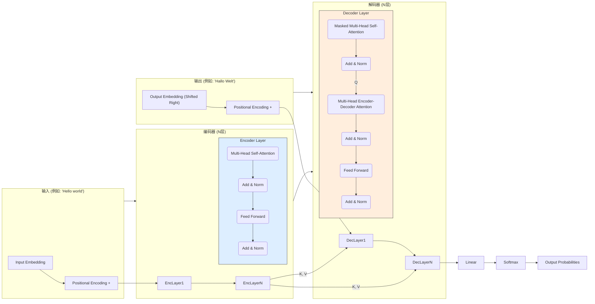

## AI论文解读 | Transformer 模型 : Attention Is All You Need  
    
### 作者    
digoal    
    
### 日期    
2025-04-25    
    
### 标签    
PostgreSQL , PolarDB , DuckDB , AI , 论文解读    
    
----    
    
## 背景    
https://arxiv.org/pdf/1706.03762    
    
提示:    
```    
读懂《Attention Is All You Need》这篇论文需要提前掌握哪些基础知识, 请给我讲一下这些基础知识, 尽量通熟易懂, 可以使用markdown支持的图形增加解释性.    
    
通熟易懂的解读《Attention Is All You Need》这篇论文, 关键内容请深入讲解, 可以使用markdown支持的图形增加解释性.    
    
提取《Attention Is All You Need》论文中一些重要的术语并详细解释, 可以使用markdown支持的图形示增加解释性.    
```    
    
## 1 前置知识    
    
好的，为了帮助你理解《Attention Is All You Need》这篇论文（也就是 Transformer 模型 ），你需要掌握一些基础概念。我会尽量用通俗易懂的方式解释，并结合 Markdown 图形来辅助理解。  
  
这篇论文的核心是提出了一种 **完全基于注意力机制（Attention Mechanism）** 的新网络架构 ，用于处理序列到序列（Sequence-to-Sequence）的任务，比如机器翻译 。它 **完全摒弃了** 之前主流模型中常用的 **循环（Recurrence）和卷积（Convolution）** 结构 。  
  
以下是你需要了解的基础知识：  
  
1.  **机器学习与深度学习基础**  
    * **神经网络 (Neural Networks)**：你需要了解神经网络的基本构成，如层（Layer）、神经元（Neuron）、权重（Weight）、偏置（Bias）、激活函数（Activation Function，论文中提到了 ReLU ）等。  
    * **模型训练 (Training)**：理解模型如何通过数据学习。这包括损失函数（Loss Function）、梯度下降（Gradient Descent）和优化器（Optimizer，论文使用了 Adam ）的基本概念。  
    * **正则化 (Regularization)**：了解防止模型过拟合（Overfitting）的技术，论文中提到了 Dropout  和 Label Smoothing 。  
  
2.  **自然语言处理 (NLP) 基础**  
    * **词嵌入 (Word Embeddings)**：将单词或符号表示为低维、稠密的向量 。这些向量能捕捉词语的语义信息。想象一下，把每个词映射到一个多维空间中的点，意思相近的词距离也相近。  
        ```mermaid  
        graph LR  
            A[单词: 国王] --> B("向量: [0.1, 0.8, ...]");  
            C[单词: 女王] --> D("向量: [0.15, 0.75, ...]");  
            E[单词: 苹果] --> F("向量: [0.9, 0.2, ...]");  
  
        style B fill:#f9f,stroke:#333,stroke-width:2px  
        style D fill:#f9f,stroke:#333,stroke-width:2px  
        style F fill:#ccf,stroke:#333,stroke-width:2px  
        ```  
        *国王和女王的向量在空间中比较接近，而苹果则较远。*  
    * **分词 (Tokenization)**：将文本句子切分成一个个小的单元（称为 token），可以是单词、子词（subword）等。论文中提到了 Byte-Pair Encoding (BPE)  和 WordPiece  作为分词方法。  
  
3.  **序列到序列 (Sequence-to-Sequence, Seq2Seq) 模型**  
    * **基本概念**：这类模型的目标是将一个输入序列转换成另一个输出序列，例如将一句英文翻译成德文 。  
    * **编码器-解码器 (Encoder-Decoder) 架构** ：这是 Seq2Seq 模型的经典架构。  
        * **编码器 (Encoder)**：读取整个输入序列（比如一句英文），并将其压缩成一个固定大小的上下文向量（Context Vector）或一系列表示 。  
        * **解码器 (Decoder)**：根据编码器的输出（上下文向量/表示），逐步生成目标序列（比如对应的德语句子）。它在生成每个词时，会考虑之前已经生成的词 。  
  
        ```mermaid  
        graph LR  
            subgraph Encoder
                direction LR  
                InputSeq[输入序列: Hello world] --> Enc(编码处理);  
                Enc --> ContextVec(上下文表示);  
            end  
            subgraph Decoder
                direction LR  
                ContextVec --> Dec(解码处理);  
                Dec -- 生成第1个词 --> Output1["Hallo"];  
                Output1 -- 作为下一步输入 --> Dec;  
                Dec -- 生成第2个词 --> Output2["Welt"];  
            end  
            Encoder --> Decoder;  
        ```  
  
4.  **循环神经网络 (Recurrent Neural Networks, RNNs)**  
    * **基本概念**：RNN 是专门处理序列数据的神经网络 。它的特点是具有“记忆”功能，当前时刻的输出依赖于之前的计算 。  
    * **局限性**：RNN 的主要问题在于其 **顺序计算（Sequential Computation）** 的特性，导致难以并行化，训练速度慢 ，并且在处理长序列时容易出现梯度消失/爆炸问题，难以捕捉长期依赖关系 。Transformer 的提出就是为了解决这些问题 。  
    * **LSTM/GRU**：为了缓解 RNN 的长期依赖问题，发展出了更复杂的变体，如长短期记忆网络 (LSTM)  和门控循环单元 (GRU) 。虽然 Transformer 摒弃了 RNN，但了解 RNN 的工作方式和局限性有助于理解 Transformer 的动机。  
  
5.  **卷积神经网络 (Convolutional Neural Networks, CNNs)**  
    * 虽然 Transformer 没有使用 CNN ，但论文提到了之前一些尝试使用 CNN 处理序列数据的模型（如 ByteNet, ConvS2S ）。了解 CNN 的基本思想（尤其是在序列上使用一维卷积提取局部特征 ）有助于理解 Transformer 与这些方法的对比。  
  
6.  **注意力机制 (Attention Mechanism)**   
    * **核心思想**：这是理解 Transformer **最关键**的概念。传统 Encoder-Decoder 模型将整个输入压缩成一个固定大小的向量，这可能成为信息瓶颈。Attention 机制允许解码器在生成每个输出词时，“关注”输入序列中不同部分的相关性，并赋予不同的“注意力权重” 。  
    * **打分机制**：通常通过计算解码器当前状态（Query）与编码器各输出（Keys）之间的“相关性得分”，然后用 Softmax 将得分转换为权重，最后将这些权重应用于编码器的输出（Values）进行加权求和，得到一个动态的上下文向量 。  
    * **为什么重要**：它使得模型可以更好地处理长序列，并关注输入中最相关的部分，而不是依赖于一个可能信息不足的固定向量 。Transformer 将这个思想发挥到了极致。  
  
        ```mermaid  
        graph TD  
            subgraph Decoder Step t
                Query(当前解码状态 Q)  
            end  
            subgraph Encoder Outputs
                K1(Key 1)  
                V1(Value 1)  
                K2(Key 2)  
                V2(Value 2)  
                K_n(Key n)  
                V_n(Value n)  
            end  
  
            Query -- 计算相似度 --> K1;  
            Query -- 计算相似度 --> K2;  
            Query -- 计算相似度 --> K_n;  
  
            K1 -- score1 --> Scores;  
            K2 -- score2 --> Scores;  
            K_n -- score_n --> Scores;  
  
            Scores -- Softmax --> Weights(权重: w1, w2, ..., wn);  
  
            Weights -- w1 --> WeightedSum;  
            V1 -- * --> WeightedSum;  
            Weights -- w2 --> WeightedSum;  
            V2 -- * --> WeightedSum;  
            Weights -- w_n --> WeightedSum;  
            V_n -- * --> WeightedSum["加权求和 ∑(wi * Vi)"];  
  
            WeightedSum --> Output_t(解码器在 t 时刻的输出);  
        ```  
        *这是一个简化版的 Attention 流程示意图。*  
  
7.  **线性代数基础**  
    * **向量 (Vectors)** 和 **矩阵 (Matrices)**：论文中大量涉及向量和矩阵运算 。你需要理解它们的基本概念和运算，特别是**矩阵乘法 (Matrix Multiplication)** 。  
    * **点积 (Dot Product)**：这是 Scaled Dot-Product Attention  的核心计算之一。  
  
8.  **其他概念**  
    * **Layer Normalization** ：一种归一化技术，用于稳定训练过程。  
    * **Residual Connections (残差连接)** ：允许信息更容易地跨层传播，有助于训练更深的网络。  
    * **Positional Encoding (位置编码)** ：由于 Transformer 没有 RNN 或 CNN 的顺序处理结构，它需要一种方法来注入序列中单词的位置信息。论文使用正弦和余弦函数来实现 。  
  
掌握了以上这些基础知识，你就能更好地理解《Attention Is All You Need》论文中提出的 Transformer 模型的结构、动机和优势了。祝你阅读顺利！  
    
## 2 解读论文    
    
好的，我们来一起深入解读一下《Attention Is All You Need》这篇开创性的论文。这篇论文提出了 **Transformer** 模型 ，它彻底改变了自然语言处理（NLP）领域，成为了现代大型语言模型（如 BERT, GPT 系列）的基础。  
  
**核心思想：只用 Attention 就够了！**  
  
在 Transformer 之前，处理序列数据（如文本）的主流模型是循环神经网络（RNNs, LSTMs, GRUs） 和卷积神经网络（CNNs）。这些模型通常结合 Attention 机制来提升性能 。  
  
而 Transformer 的革命性在于，它**完全抛弃了 RNN 和 CNN 的结构**，认为**仅仅依靠 Attention 机制**就足以捕捉序列内的依赖关系，并处理序列到序列（Seq2Seq）的任务 。  
  
**为什么抛弃 RNN/CNN？**  
  
1.  **RNN 的顺序计算瓶颈**：RNN 按时间步顺序处理信息（ $t$ 时刻的计算依赖 $t-1$ 时刻的结果）。这使得 RNN **难以并行计算**，在处理长序列时训练非常耗时 。同时，信息需要一步步传递，**捕捉长期依赖关系比较困难**（梯度消失/爆炸问题）。  
2.  **CNN 的固定感受野/路径长度**：虽然 CNN 可以并行计算 ，但标准 CNN 主要捕捉局部依赖。要捕捉长距离依赖，需要堆叠很多层，这使得任意两个位置间的**信号传播路径变长**（对数或线性级别，取决于 CNN 类型）。  
  
**Transformer 的优势：**  
  
1.  **高度并行化**：Transformer 的核心 Self-Attention 机制在计算时，每个位置都可以同时计算与其他所有位置的关联度，极大提升了计算效率和训练速度 。  
2.  **更短的路径长度**：在 Self-Attention 中，任意两个位置之间的最大路径长度是常数 O(1)，因为它们可以直接交互，这使得模型更容易学习长距离依赖关系 。  
  
下表对比了不同层类型的特性 ：  
  
| Layer Type               | Complexity per Layer     | Sequential Operations | Maximum Path Length |  
| :----------------------- | :----------------------- | :-------------------- | :------------------ |  
| **Self-Attention** | $O(n^2 \cdot d)$         | $O(1)$                | $O(1)$              |  
| Recurrent (RNN)          | $O(n \cdot d^2)$         | $O(n)$                | $O(n)$              |  
| Convolutional (k < n)    | $O(k \cdot n \cdot d^2)$ | $O(1)$                | $O(\log_k(n))$ or $O(n/k)$ |  
| Self-Attention (restricted r) | $O(r \cdot n \cdot d)$ | $O(1)$                | $O(n/r)$            |  
  
* $n$ = 序列长度, $d$ = 表示维度, $k$ = 卷积核大小, $r$ = 限制 Self-Attention 的邻域大小。  
* 可以看到 Self-Attention 在序列操作和路径长度上有明显优势。虽然复杂度是 $O(n^2 \cdot d)$，但在 $n < d$ 时（这在 NLP 中很常见 ），其计算效率优于 RNN 的 $O(n \cdot d^2)$ 。  
  
**Transformer 模型架构 (Figure 1 )**  
  
Transformer 遵循经典的 **Encoder-Decoder** 架构 ，非常适合机器翻译等任务。  
  

  
* **Encoder**：由 N=6 个相同的层堆叠而成 。  
    * 每层包含两个子层：  
        1.  **Multi-Head Self-Attention**：让输入序列中的每个词都能关注到序列中的所有其他词（包括自己），计算上下文感知的表示 。  
        2.  **Position-wise Feed-Forward Network (FFN)**：一个简单的全连接前馈网络，独立地应用于每个位置的表示 。  
    * 每个子层都使用了 **残差连接 (Residual Connection)** 和 **层归一化 (Layer Normalization)** 。即每个子层的输出是 $LayerNorm(x + Sublayer(x))$ 。这有助于训练更深的网络。  
* **Decoder**：也由 N=6 个相同的层堆叠而成 。  
    * 每层包含三个子层：  
        1.  **Masked Multi-Head Self-Attention**：与 Encoder 的 Self-Attention 类似，但是加了 "Mask" 。这个 Mask 的作用是**防止**在预测当前词 $y_i$ 时，模型能“看到”未来的词 $y_{j>i}$ 。这是为了保证解码过程的自回归（auto-regressive）特性，即预测下一个词只能依赖于已生成的词 。  
        2.  **Multi-Head Encoder-Decoder Attention**：这是连接 Encoder 和 Decoder 的关键 。它允许解码器中的每个位置 **关注** 到 **输入序列（Encoder 的输出）** 的所有位置 。这里的 Query (Q) 来自上一层 Decoder 的输出，而 Key (K) 和 Value (V) 来自 Encoder 的最终输出。  
        3.  **Position-wise Feed-Forward Network (FFN)**：与 Encoder 中的 FFN 相同 。  
    * 同样，每个子层也使用了残差连接和层归一化 。  
  
**核心机制：Attention 深入解析**  
  
Attention 机制可以理解为：根据一个 **查询 (Query, Q)**，和一系列 **键值对 (Key-Value pairs, K-V)**，计算输出。输出是 **值 (V)** 的加权和，而每个 V 对应的权重，是由 **查询 (Q)** 和它对应的 **键 (K)** 计算出来的相似度（或称为兼容性）决定的 。  
  
1.  **Scaled Dot-Product Attention (基础构件, Figure 2 左侧 )**  
    * **输入**：Query 矩阵 Q，Key 矩阵 K，Value 矩阵 V 。在 Self-Attention 中，Q, K, V 通常来自同一个来源（上一层的输出），经过不同的线性变换得到。  
    * **计算过程**：  
        1.  计算 Q 和 K 的点积： $Q K^T$ 。这衡量了每个 Query 和每个 Key 之间的相似度。  
        2.  **缩放 (Scale)**：将点积结果除以 $\sqrt{d_k}$ （ $d_k$ 是 K 或 Q 的维度）。 **为什么要缩放？** 因为如果 $d_k$ 很大，点积结果可能会变得非常大，导致 Softmax 函数进入梯度极小的区域，不利于训练 。通过缩放可以缓解这个问题 。  
        3.  **Softmax**：对缩放后的分数应用 Softmax，得到归一化的权重 。这些权重表示每个 Query 应该对每个 Value 赋予多少注意力。  
        4.  **加权求和**：将得到的权重乘以对应的 V，然后求和，得到最终的 Attention 输出 。  
    * **公式**： $Attention(Q, K, V) = softmax(\frac{QK^T}{\sqrt{d_k}})V$   
  
    ```mermaid  
    graph LR  
        subgraph ScaledDotProductAttention
            Q --> MatMul1(MatMul QKᵀ);  
            KTranspose(Kᵀ) --> MatMul1;  
            MatMul1 --> Scale(Scale by 1/√dk);  
            Scale --> Softmax;  
            Softmax --> MatMul2(MatMul Weights V);  
            V --> MatMul2;  
            MatMul2 --> Output;  
        end  
    ```  
  
2.  **Multi-Head Attention (增强版, Figure 2 右侧 )**  
    * **动机**：单一的 Attention 可能只关注到一种信息交互模式。Multi-Head Attention 允许模型在不同位置**同时关注来自不同表示子空间的信息** 。就像是用多个不同的“视角”去看待 Q, K, V 之间的关系。  
    * **过程**：  
        1.  **投影 (Project)**：将输入的 Q, K, V 通过不同的、可学习的线性变换（权重矩阵 $W^Q_i, W^K_i, W^V_i$）投影 $h$ 次（论文中 $h=8$ ），得到 $h$ 组低维度的 $Q_i, K_i, V_i$ 。维度通常是 $d_k = d_v = d_{model} / h$ 。  
        2.  **并行 Attention**：对这 $h$ 组 $Q_i, K_i, V_i$ **并行**地执行 Scaled Dot-Product Attention，得到 $h$ 个输出 $head_i$ 。  
        3.  **拼接 (Concatenate)**：将 $h$ 个 $head_i$ 拼接起来 。  
        4.  **再次投影 (Project)**：将拼接后的结果通过另一个线性变换（权重矩阵 $W^O$）投影回原始的 $d_{model}$ 维度，得到最终的 Multi-Head Attention 输出 。  
    * **公式**：  
        $MultiHead(Q, K, V) = Concat(head_1, ..., head_h)W^O$   
        其中 $head_i = Attention(QW_i^Q, KW_i^K, VW_i^V)$   
    * **好处**：虽然看起来复杂，但因为每个 head 的维度降低了 ($d_{model}/h$)，总的计算量和单头（ $h=1$ ）、全维度的 Attention 差不多 。但效果更好，因为它能捕捉更多样的特征表示 。  
  
    ```mermaid  
    graph TD  
        subgraph MultiHeadAttention
            InputQKV[Input Q, K, V] --> LinearQ1(Linear Q₁);  
            InputQKV --> LinearK1(Linear K₁);  
            InputQKV --> LinearV1(Linear V₁);  
            InputQKV --> LinearQh(Linear Qh);  
            InputQKV --> LinearKh(Linear Kh);  
            InputQKV --> LinearVh(Linear Vh);  
  
            LinearQ1 & LinearK1 & LinearV1 --> Head1(Scaled Dot-Product Attention Head 1);  
            LinearQh & LinearKh & LinearVh --> Headh(Scaled Dot-Product Attention Head h);  
  
            Head1 --> Concat;  
            Headh --> Concat(Concatenate Outputs);  
  
            Concat --> LinearFinal(Linear Wᴼ);  
            LinearFinal --> Output;  
        end  
    ```  
  
**其他关键组件**  
  
* **Position-wise Feed-Forward Networks (FFN)**：每个 Attention 子层之后都有一个 FFN 。它包含两个线性变换，中间有一个 ReLU 激活函数: $FFN(x) = max(0, xW_1 + b_1)W_2 + b_2$ 。这个网络对**每个位置**独立且相同地作用，但**不同层**之间的 FFN 参数**不同** 。它可以看作是两个核大小为 1 的卷积 。它的作用是增加模型的非线性能力和表示能力。  
* **Embeddings and Softmax**：标准的词嵌入层将输入/输出的 token 转换为 $d_{model}$ 维的向量 。解码器最终输出经过一个线性层和 Softmax 函数，得到预测下一个词的概率分布 。论文中，输入嵌入层、输出嵌入层和最后的线性层共享权重矩阵，这是一种常见的参数共享技巧 。  
* **Positional Encoding**：由于 Transformer 模型本身不包含任何关于序列顺序的信息（不像 RNN 有时间步，CNN 有空间/时间结构），我们需要**显式地注入位置信息** 论文使用正弦和余弦函数来生成位置编码向量 $PE$ ：  
    $PE_{(pos, 2i)} = sin(pos / 10000^{2i / d_{model}})$  
    $PE_{(pos, 2i+1)} = cos(pos / 10000^{2i / d_{model}})$  
    其中 $pos$ 是位置索引， $i$ 是维度索引 。这些位置编码向量会**加到**输入嵌入和输出嵌入上 。这种方式的好处是，对于任意固定的偏移量 $k$ ， $PE_{pos+k}$ 可以表示为 $PE_{pos}$ 的线性函数，这可能有助于模型学习相对位置信息 ，并且可能能够泛化到比训练时更长的序列 。  
  
**训练与成果**  
  
* 论文在 WMT 2014 英语-德语和英语-法语翻译任务上进行了实验 。  
* 使用了 Adam 优化器，并设计了一种特殊的学习率调整策略（先线性增加，后按步数的平方根倒数衰减）。  
* 使用了 Dropout  和 Label Smoothing  进行正则化。  
* 结果非常出色：Transformer (big) 模型在英德翻译上达到了 28.4 BLEU 分，超越了当时包括集成模型在内的最佳结果 。在英法翻译上也达到了 41.8 BLEU（论文后续更新了英法结果，原版是 41.0）。  
* 关键是，达到这些 SOTA 结果所需的**训练时间**比之前的模型**大大减少** 。例如，基础模型在 8 个 P100 GPU 上只需训练 12 小时 。  
* 论文还展示了 Transformer 在英语成分句法分析任务上的良好泛化能力 。  
  
**结论与影响**  
  
《Attention Is All You Need》提出了 Transformer，一个完全基于 Attention 的 Seq2Seq 模型 。它通过 Multi-Head Self-Attention 机制有效捕捉长距离依赖，同时允许高度并行化，显著提高了训练效率和模型性能 。这项工作不仅在机器翻译上取得了突破，更重要的是，其架构成为了后续众多 NLP 预训练模型（BERT, GPT 等）的核心基础，深刻地影响了整个领域的发展。  
    
## 3 术语    
    
好的，我们来提取并详细解释《Attention Is All You Need》这篇论文中的一些关键术语：  
  
1.  **序列转导模型 (Sequence Transduction Models)**  
    * **解释**: 这类模型的主要任务是将一个输入序列转换（或“转导”）成一个输出序列 。常见的例子包括机器翻译（将一种语言的句子序列转为另一种语言）、语音识别（将声音信号序列转为文字序列）和文本摘要（将长文本序列转为短文本序列）。  
    * **重要性**: Transformer 就是一种为序列转导任务设计的强大的模型架构 。  
  
2.  **编码器-解码器架构 (Encoder-Decoder Architecture)**  
    * **解释**: 这是许多序列转导模型的标准结构 。  
        * **编码器 (Encoder)**: 负责读取并理解整个输入序列，将其编码成一系列内部表示（或一个上下文向量） 。  
        * **解码器 (Decoder)**: 利用编码器的输出表示，逐步生成目标输出序列 。生成每个元素时，通常会考虑之前已生成的元素 。  
    * **重要性**: Transformer 遵循了这种宏观架构，但其内部的编码器和解码器完全由 Attention 和前馈网络构成 。  
        ```mermaid  
        graph LR  
            InputSeq --> Encoder --> EncodedRep;  
            EncodedRep --> Decoder;  
            StartToken --> Decoder -- 生成 --> Output1;  
            Output1 --> Decoder -- 生成 --> Output2;  
            Output2 --> Decoder -- 生成 --> Output_n;  
        ```  
  
3.  **注意力机制 (Attention Mechanism)**  
    * **解释**: 一种让模型在处理序列时能够“聚焦”于输入或输出序列中相关部分的技术 。它允许模型在生成输出的每一步动态地决定应该“关注”输入的哪些部分，而不是依赖一个固定的编码表示 。  
    * **重要性**: Attention 是 Transformer 模型的核心，论文标题 "Attention Is All You Need" 就强调了这一点。Transformer 完全依赖 Attention 及其变体来捕捉全局依赖 。  
  
4.  **自注意力 (Self-Attention / Intra-Attention)**  
    * **解释**: Attention 机制的一种特殊形式，它不是在输入和输出序列之间计算注意力，而是在**单个序列内部**计算注意力 。序列中的每个元素都会计算与同一序列中所有其他元素（包括自身）的注意力得分，从而得到一个考虑了全局上下文的新表示 。  
    * **重要性**: Self-Attention 是 Transformer Encoder 和 Decoder 的基本构建块，用于捕捉输入序列内部以及（在 Decoder 中）输出序列内部的依赖关系 。  
        ```mermaid  
        graph TD  
            subgraph Sequence ["Input Sequence: The cat sat"]
                Token1("The")  
                Token2("cat")  
                Token3("sat")  
            end  
            subgraph SelfAttentionOutput ["Output Representation"]
                Rep1("Rep(The)")  
                Rep2("Rep(cat)")  
                Rep3("Rep(sat)")  
            end  
  
            Token1 -- Attends to --> Token1 & Token2 & Token3;  
            Token2 -- Attends to --> Token1 & Token2 & Token3;  
            Token3 -- Attends to --> Token1 & Token2 & Token3;  
  
            Token1 & Token2 & Token3 --> Rep1;  
            Token1 & Token2 & Token3 --> Rep2;  
            Token1 & Token2 & Token3 --> Rep3;  
  
            style SelfAttentionOutput fill:#f9f,stroke:#333,stroke-width:2px  
        ```  
        *图示：每个词的表示都由序列中所有词（包括自身）的加权信息构成。*  
  
5.  **查询 (Query, Q), 键 (Key, K), 值 (Value, V)**  
    * **解释**: 这是 Attention 计算中的三个核心向量 。你可以这样理解：  
        * **Query (Q)**: 代表当前正在处理的元素，它发出“查询”，想知道其他元素与它有多相关。  
        * **Key (K)**: 代表序列中（或输入序列中）的所有元素，它们响应 Query 的查询，表明自己与 Query 的相关性。Query 和 Key 通过计算相似度（如点积）来确定注意力权重 。  
        * **Value (V)**: 也代表序列中（或输入序列中）的所有元素，它们包含实际的信息。计算出的注意力权重会作用于 Value，进行加权求和，得到最终的输出 。  
    * **重要性**: Q, K, V 是构成 Scaled Dot-Product Attention 的基本要素。在 Self-Attention 中，Q, K, V 来自同一个输入序列（经过不同的线性变换）；在 Encoder-Decoder Attention 中，Q 来自 Decoder，K 和 V 来自 Encoder 。  
        ```mermaid  
        graph TD  
            Q(Query) -- Calculate Similarity --> K1(Key 1);  
            Q -- Calculate Similarity --> K2(Key 2);  
            Q -- Calculate Similarity --> Kn(Key n);  
  
            K1 -- Similarity Score 1 --> Softmax;  
            K2 -- Similarity Score 2 --> Softmax;  
            Kn -- Similarity Score n --> Softmax;  
  
            Softmax -- Weight w1 --> WeightedSum;  
            Softmax -- Weight w2 --> WeightedSum;  
            Softmax -- Weight wn --> WeightedSum;  
  
            V1(Value 1) -- w1 * V1 --> WeightedSum;  
            V2(Value 2) -- w2 * V2 --> WeightedSum;  
            Vn(Value n) -- wn * Vn --> WeightedSum[Output = ∑ wᵢ * Vᵢ];  
  
            style WeightedSum fill:#ccf,stroke:#333,stroke-width:2px  
        ```  
  
6.  **缩放点积注意力 (Scaled Dot-Product Attention)**  
    * **解释**: Transformer 使用的具体 Attention 实现方式 。其计算过程为：计算 Query 和所有 Key 的点积，将结果除以 $\sqrt{d_k}$ （ $d_k$ 是 Key 的维度）进行缩放，然后通过 Softmax 函数得到权重，最后用这些权重对 Value 进行加权求和 。  
    * **公式**: $Attention(Q, K, V) = softmax(\frac{QK^T}{\sqrt{d_k}})V$ 。  
    * **重要性**: 这是 Transformer 中所有 Attention 模块（包括 Self-Attention 和 Encoder-Decoder Attention）的基础计算单元。缩放步骤是为了防止点积过大导致梯度消失，稳定训练过程 。  
  
7.  **多头注意力 (Multi-Head Attention)**  
    * **解释**: 与其执行单一的 Attention 函数，不如将 Q, K, V 分别线性投影 $h$ 次到更低的维度，然后并行地执行 $h$ 次 Scaled Dot-Product Attention（称为 $h$ 个 "头"）。每个头可以学习关注输入的不同方面或不同的表示子空间 。最后将这 $h$ 个头的输出拼接起来，再进行一次线性投影得到最终结果 。  
    * **重要性**: Multi-Head Attention 使得模型能够共同关注来自不同表示子空间的信息，增强了 Attention 层的表达能力，比单一 Attention 效果更好 。Transformer 中使用了 $h=8$ 个头 。  
  
8.  **位置编码 (Positional Encoding)**  
    * **解释**: 由于 Transformer 完全基于 Attention，没有 RNN 的顺序处理或 CNN 的局部卷积，它本身无法感知序列中元素的位置信息 。为了解决这个问题，需要向输入嵌入中加入位置信息。论文中使用基于正弦和余弦函数的固定编码方式来生成位置编码向量，该向量的维度与词嵌入维度相同 ($d_{model}$) 。  
    * **重要性**: 为模型提供了单词在序列中的绝对或相对位置信息，这对于理解语言至关重要 。  
  
9.  **逐位置前馈网络 (Position-wise Feed-Forward Networks, FFN)**  
    * **解释**: 在每个 Encoder 层和 Decoder 层中，多头注意力子层之后都跟着一个 FFN 。这个 FFN 包含两个线性变换和一个 ReLU 激活函数，它独立且相同地应用于序列中的**每个位置** 。  
    * **重要性**: 为模型增加了非线性变换能力，增强了模型的表达能力。可以看作是在每个位置上进行特征转换。  
  
10. **层归一化 (Layer Normalization)**  
    * **解释**: 一种归一化技术，它在层的输入的特征维度上计算均值和方差，并进行归一化 。与 Batch Normalization 不同，它不受 Batch Size 的影响。  
    * **重要性**: 在 Transformer 中，每个子层（Attention 或 FFN）的输出都会先经过残差连接，然后进行层归一化 。这有助于稳定训练过程，加速收敛，并允许使用更高的学习率。  
  
11. **残差连接 (Residual Connections)**  
    * **解释**: 也称为 Skip Connections。它将一个模块（如 Attention 或 FFN 子层）的输入直接加到该模块的输出上 。即输出为 $Input + Sublayer(Input)$（在 LayerNorm 之前）。  
    * **重要性**: 极大地缓解了深度网络中的梯度消失问题，使得信息和梯度能够更容易地在网络中传播，从而可以训练非常深的模型（Transformer 有 6 层 Encoder 和 6 层 Decoder）。  
  
12. **掩码 (Masking in Decoder Self-Attention)**  
    * **解释**: 在 Decoder 的 Self-Attention 子层中，为了保证模型的自回归（auto-regressive）特性（即预测第 $i$ 个词时只能依赖于第 $1$ 到 $i-1$ 个词），需要阻止当前位置关注到后续位置。这是通过在 Scaled Dot-Product Attention 的 Softmax 输入中，将对应于非法连接（即未来位置）的分数设置为一个非常小的负数（如负无穷）来实现的，这样 Softmax 之后的权重就会接近于 0 。  
    * **重要性**: 这是保证 Decoder 能够正确、按顺序生成目标序列的关键机制。  
  
理解这些术语及其作用，是掌握 Transformer 模型工作原理的基础。  
    
## 参考    
https://arxiv.org/pdf/1706.03762    
    
    
<b> 以上内容基于DeepSeek、QwQ及诸多AI生成, 轻微人工调整, 感谢杭州深度求索人工智能、阿里云等公司. </b>    
    
<b> AI 生成的内容请自行辨别正确性, 当然也多了些许踩坑的乐趣, 毕竟冒险是每个男人的天性.  </b>    
    
  
#### [期望 PostgreSQL|开源PolarDB 增加什么功能?](https://github.com/digoal/blog/issues/76 "269ac3d1c492e938c0191101c7238216")
  
  
#### [PolarDB 开源数据库](https://openpolardb.com/home "57258f76c37864c6e6d23383d05714ea")
  
  
#### [PolarDB 学习图谱](https://www.aliyun.com/database/openpolardb/activity "8642f60e04ed0c814bf9cb9677976bd4")
  
  
#### [PostgreSQL 解决方案集合](../201706/20170601_02.md "40cff096e9ed7122c512b35d8561d9c8")
  
  
#### [德哥 / digoal's Github - 公益是一辈子的事.](https://github.com/digoal/blog/blob/master/README.md "22709685feb7cab07d30f30387f0a9ae")
  
  
#### [About 德哥](https://github.com/digoal/blog/blob/master/me/readme.md "a37735981e7704886ffd590565582dd0")
  
  

  
