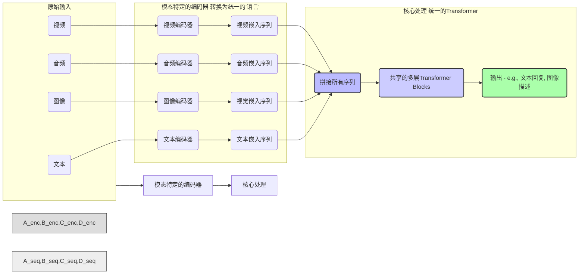

## AI论文解读 | 多模态大模型 Gemini: A Family of Highly Capable Multimodal Models
    
### 作者    
digoal    
    
### 日期    
2025-04-25    
    
### 标签    
PostgreSQL , PolarDB , DuckDB , AI , 论文解读    
    
----    
    
## 背景    
https://arxiv.org/pdf/2312.11805    
    
提示:    
```    
读懂《Gemini: A Family of Highly Capable Multimodal Models》这篇论文需要提前掌握哪些基础知识, 请给我讲一下这些基础知识, 尽量通熟易懂, 可以使用markdown支持的图形增加解释性.    
    
通熟易懂的解读《Gemini: A Family of Highly Capable Multimodal Models》这篇论文, 关键内容请深入讲解, 可以使用markdown支持的图形增加解释性.    
    
提取《Gemini: A Family of Highly Capable Multimodal Models》论文中一些重要的术语并详细解释, 可以使用markdown支持的图形示增加解释性.    
```    
    
## 1 前置知识    
    
好的，读懂《Gemini: A Family of Highly Capable Multimodal Models》这篇论文，需要对现代人工智能，特别是深度学习和大型模型有一些基础了解。别担心，我会尽量用通俗易懂的方式解释这些核心概念。你可以把这些看作是理解Gemini这栋“大厦”所需要的“地基”。

下面是一些你需要提前掌握的基础知识点：

1.  **机器学习 (Machine Learning, ML) 与深度学习 (Deep Learning, DL) 的基本概念**

    * **机器学习 (ML):** 简单来说，就是让计算机不通过明确的编程来完成任务，而是通过从数据中学习规律。想象一下教小孩子认识猫和狗，你不是告诉他猫有胡子、狗会叫等等所有细节，而是给他看大量的猫和狗的图片，他自己慢慢就学会区分了。机器学习就是这个过程。
    * **模型 (Model):** 在机器学习中，模型就是学习到的那个“规律”或者“函数”。它可以是一个简单的数学公式，也可以是一个非常复杂的结构。
    * **训练 (Training):** 这个过程就是让模型从数据中学习规律，调整模型内部的参数，使其能够完成特定任务（比如识别图片、生成文本）。
    * **参数 (Parameters):** 可以把参数看作是模型内部可以调整的“旋钮”或“权重”。训练的过程就是不断地调整这些旋钮，让模型在处理数据时表现得更好。一个模型的参数越多，通常它的能力越强，但也需要更多的数据和计算资源来训练。
    * **深度学习 (DL):** 深度学习是机器学习的一个分支，它使用一种叫做“神经网络”的复杂模型结构。之所以叫“深度”，是因为这些网络有很多层（很多层“神经元”连接在一起），每一层都对输入数据进行不同层次的抽象和处理。想象一下剥洋葱，每一层都是一个处理步骤，层数越多，能处理的信息越复杂、越抽象。

    ```mermaid
    graph LR
        A[数据] --> B(训练过程);
        B --> C[机器学习模型];
        C --> D[预测/输出];
        C -- 参数调整 --> B;
    ```
    *图示：机器学习的简单流程*

2.  **神经网络 (Neural Networks)**

    * 神经网络是深度学习的核心。它模仿人脑神经元的连接方式构建。
    * 它由很多层组成：输入层（接收数据）、隐藏层（进行复杂的计算和特征提取）和输出层（给出结果）。
    * 每一层包含多个“神经元”，神经元之间通过带有“权重”的连接相连。信息从输入层经过隐藏层，最终到达输出层。

    ```mermaid
    graph LR
        A(输入层) --> B(隐藏层1);
        B --> C(隐藏层2);
        C --> D(隐藏层n);
        D --> E(输出层);
    ```
    *图示：一个多层神经网络的简单结构*

3.  **词嵌入 (Word Embeddings) / 向量表示 (Vector Representation)**

    * 计算机无法直接理解文字、图片等信息，需要把它们转换成数字。
    * 对于文本，词嵌入是一种非常重要的技术，它把每一个单词（或更小的文本单元）表示成一个高维的数字向量（一串数字）。
    * 这些向量不仅仅是随机的数字，它们被训练成能够捕捉词语的语义信息。例如，在训练好的词嵌入空间中，“国王”的向量 - “男人”的向量 + “女人”的向量 可能非常接近 “女王”的向量。这表示向量之间的数学运算可以在一定程度上反映词语之间的语义关系。
    * 对于图片等其他模态数据，也有类似的方法将其转换成向量表示，以便模型处理。

4.  **自然语言处理 (Natural Language Processing, NLP) 基础**

    * NLP 是让计算机理解和处理人类语言的领域。
    * **Tokenization (分词):** 将连续的文本分割成独立的单元（叫做 token），通常是词或 sub-word（词的一部分）。例如，“Understanding” 可能被分成 “Understand” 和 “ing”。这有助于处理未知词汇。
    * 模型需要处理这些 token 的序列。

5.  **计算机视觉 (Computer Vision, CV) 基础 (应用于图像)**

    * CV 是让计算机“看懂”图像和视频的领域。
    * 在深度学习中，处理图像通常会用到 **卷积神经网络 (Convolutional Neural Networks, CNN)** 或 **Vision Transformer** 等模型。这些模型能够从像素数据中提取出图像的特征（比如边缘、形状、纹理，再到更高级的物体）。

6.  **序列模型 (Sequence Models) 和 注意力机制 (Attention Mechanism)**

    * 很多数据是序列形式的，比如文本（词的序列）、音频（声音信号的序列）。
    * 传统的序列模型如循环神经网络 (RNN) 和长短期记忆网络 (LSTM) 是一步一步地处理序列中的元素。
    * **注意力机制 (Attention Mechanism)** 是现代序列模型的关键创新。它的核心思想是：在处理序列中的某个元素时，模型可以“关注”或“聚焦”到序列中其他与当前元素更相关的部分。
    * **自注意力 (Self-Attention):** Transformer 模型的核心。它允许模型在处理一个序列时，让序列中的每一个元素都能直接与其他所有元素建立联系，并计算它们之间的关联强度（“注意力权重”）。这使得模型能够捕捉长距离的依赖关系，比如一句话中相隔很远的词之间的关系。

    * *通俗理解注意力:* 想象你在读一篇文章。当读到某个词时，你的大脑不是只看眼前的词，而是会快速回顾文章中之前出现的、与当前词相关的其他词语，以便更好地理解当前词的含义。注意力机制在模型中就扮演了类似的角色。

7.  **Transformer 架构**

    * Gemini 模型（以及许多现代大型语言模型如 BERT, GPT 系列）都基于 Transformer 架构。
    * Transformer 架构完全抛弃了 RNN 的循环结构，只依赖于**自注意力机制**来处理序列。
    * 它通常包含编码器 (Encoder) 和解码器 (Decoder) 两部分（或者只使用解码器，如 GPT）。编码器用于理解输入序列，解码器用于生成输出序列。
    * Transformer 的并行计算能力更强，更适合处理长序列和在硬件上进行大规模训练。

    ```mermaid
    graph LR
        A[输入序列] --> B(嵌入层);
        B --> C(位置编码);
        C --> D(Transformer编码器层);
        D --> E(Transformer解码器层);
        E --> F[输出序列];
    ```
    *图示：Transformer 模型简化结构（包含编解码器）*
    （Gemini 可能更多是基于解码器或更复杂的变体，但核心是 Transformer Blocks）

8.  **大型语言模型 (Large Language Models, LLMs)**

    * 像 Gemini 这样的模型被称为“大型”，是因为它们具有**海量的参数**（数十亿到数万亿）和在**海量数据**上进行训练。
    * **预训练 (Pre-training):** LLM 通常先在一个超大规模的文本数据集（有时也包含代码、图像等）上进行预训练，学习语言的统计规律、语法、常识等。预训练任务通常是预测序列中下一个词（Next Token Prediction）或填补被遮盖的词（Masked Language Modeling）。
    * **涌现能力 (Emergent Abilities):** 当模型的规模（参数量、数据量）达到一定程度时，会出现一些在小模型上不具备的新能力，比如零样本学习 (Zero-shot Learning) 和少样本学习 (Few-shot Learning)——在没有见过或只见过少量示例的情况下完成新任务。
    * **生成能力:** LLM 的一个主要能力是根据输入的提示 (Prompt) 生成连贯、有意义的文本。

9.  **多模态 (Multimodality)**

    * 这是 Gemini 的一个关键特性。这意味着模型不仅能处理文本，还能同时理解和处理其他类型的数据，如图像、音频、视频等。
    * 为了实现多模态，模型需要学习如何将不同类型的数据（文本、图像等）转换到同一个“共享空间”中进行表示和理解。想象一下，模型看到一张猫的图片和“猫”这个词时，它知道它们指向的是同一个概念。
    * 论文会描述 Gemini 如何整合不同模态的数据，以及如何处理涉及多种模态的任务（例如，根据图片内容生成描述、回答关于图片的问题等）。

**总结一下，要理解 Gemini 论文，你需要掌握：**

* 机器学习和深度学习的基本流程（数据、模型、训练、参数）。
* 神经网络的基本概念。
* 将数据（特别是文本和图像）表示成向量的方法（嵌入）。
* Transformer 架构的核心思想，特别是自注意力机制如何帮助模型理解序列数据。
* 大型语言模型的训练方式（预训练）和它们的一些特性（规模、涌现能力）。
* 多模态的概念，即如何让模型同时处理多种类型的数据。

有了这些基础，你就能更好地理解论文中关于 Gemini 模型架构、训练方法、以及它在不同模态任务上的表现等内容了。阅读论文时，重点关注它是如何将文本、图像等不同模态的数据输入到 Transformer 结构中，以及它如何设计训练目标来实现强大的多模态能力。

祝你阅读顺利！
    
## 2 解读论文    
    
好的，我们来用通俗易懂的方式解读《Gemini: A Family of Highly Capable Multimodal Models》这篇论文的关键内容。有了之前的基础知识，理解起来会更容易。

你可以把这篇论文想象成 Google 团队向大家介绍他们建造的一座非常先进的“大脑”，叫做 Gemini。这个“大脑”特别厉害的地方在于，它不光会读书写字（处理文本），它还会“看”图片、“听”声音，甚至能同时理解这些不同类型的信息，并且做出反应。

**论文的核心要点是什么？**

这篇论文主要介绍了以下几点：

1.  **原生多模态能力 (Native Multimodality):** 这是 Gemini 最核心、最与众不同的地方。
2.  **基于 Transformer 的统一架构 (Unified Transformer Architecture):** 它使用了大家熟悉的 Transformer 结构，但做了一些优化，并且让它可以处理所有不同类型的数据。
3.  **规模庞大且多样化的家族 (A Family of Models):** Gemini 不只是一个模型，而是一系列的模型（Ultra, Pro, Nano），针对不同的应用场景和设备进行了优化。
4.  **卓越的性能表现 (State-of-the-Art Performance):** 在大量的测试任务和基准测试上，Gemini 在很多方面都超越了之前的顶级模型。
5.  **大规模且高效的训练 (Large-scale and Efficient Training):** 训练这么一个庞大的多模态模型需要强大的技术和基础设施。

我们来深入讲解一下最关键的部分。

**1. 原生多模态能力 (Native Multimodality) - Gemini 最亮眼之处**

* **这是什么意思？** 想象一下一个婴儿学习认识世界。他看到一只猫（视觉信息），听到大人说“猫”（听觉/文本信息），同时可能还摸到猫软软的毛（触觉信息）。他不是把这些信息分开处理（先认识“猫”这个字，再认识“猫”这个图），而是把这些不同类型的信息在大脑里**同时**整合起来，形成对“猫”这个概念的完整理解。
* **传统方法 vs. Gemini 的原生方法:**
    * **传统方法 (非原生多模态):** 就像是把几个独立的小专家拼在一起。比如，有一个图像专家（图像模型）负责看图，一个文本专家（语言模型）负责读字。当你想问关于图片的问题时，先把图片给图像专家，它输出一些图片特征的描述（可能是文本），再把这个描述和你的问题一起交给文本专家来回答。这种方式是串联或并联地组合不同模态的模型，它们之间交流需要通过一个中间层（比如文本描述）。信息在转换过程中可能有丢失，而且不同模态的信息没有在最底层进行深度融合。
    * **Gemini 的原生方法:** Gemini 的设计就像那个婴儿的大脑一样。它从一开始就被设计成能够**同时接收和处理**来自不同模态（文本、图像、音频、视频）的信息。它内部的核心处理单元（基于 Transformer）能够直接理解不同模态信息之间的**关联**。

    ```mermaid
    graph LR
        subgraph 传统方法
            A1(文本输入) --> B1(文本处理模块);
            C1(图像输入) --> D1(图像处理模块);
            B1 & D1 --> E1(信息整合层);
            E1 -- 生成文本等 --> F1(输出);
            style E1 fill:#f9f,stroke:#333,stroke-width:2px
        end
        subgraph Gemini 原生多模态
            A2(文本输入) --> G(统一嵌入层);
            C2(图像输入) --> G;
            H(音频/视频输入) --> G;
            G --> I(共享Transformer核心 - 深度融合);
            I -- 生成文本等 --> J(输出);
            style I fill:#bbf,stroke:#333,stroke-width:2px
        end
    ```
    *图示：传统方法 vs. Gemini 原生多模态的简化对比。传统方法是先各自处理再整合，Gemini 是先统一表示再通过共享核心深度处理。*

* **原生多模态的好处:**
    * **更深度的理解:** 模型能更好地捕捉不同模态信息之间的细微关联。比如，看到一张图，旁边有一段描述文字，原生多模态模型能更自然地理解文字描述的是图中的哪个部分。
    * **更灵活的应用:** 可以处理各种复杂的跨模态任务，比如：
        * **图片问答:** 根据图片内容回答问题。
        * **视频理解:** 理解视频内容并进行摘要或问答。
        * **图文生成:** 根据图片生成详细描述。
        * **语音识别与理解:** 理解口语并执行任务。
        * 甚至更复杂的组合，比如输入一段视频和相关的文字说明，然后提问。
    * **更高的效率:** 相比于拼接多个模型，一个统一的模型可能更高效。

**2. 基于 Transformer 的统一架构 (Unified Transformer Architecture) - 如何实现多模态的“共享大脑”**

* **核心是 Transformer:** Gemini 的骨架依然是强大的 Transformer 模型。Transformer 特别擅长处理序列数据，并通过“注意力机制”来捕捉序列中任意位置之间的关系。
* **如何处理不同模态？** 这是关键点。Gemini 的方法是：
    * **把所有不同类型的数据都转换成一种统一的“语言”——向量序列。**
        * **文本:** 像之前说的，文本被分成 tokens，然后转换成词嵌入向量。
        * **图像:** 图像被分割成小块（patch），然后通过一个专门的图像编码器（可能是另一个较小的 Transformer 或 CNN 结构）处理，转换成一系列代表这些小块的向量（可以理解为“图像 tokens”）。
        * **音频/视频:** 类似地，音频或视频数据也被处理并转换成一系列向量（“音频 tokens”或“视频 tokens”）。
    * **拼接序列并输入到同一个 Transformer:** 现在，你有了文本的向量序列，图像的向量序列，可能还有音频、视频的向量序列。Gemini 简单粗暴地把这些序列**拼接**在一起，形成一个很长很长的统一序列。
    * **共享的 Transformer 处理一切:** 这个拼接好的序列被送入同一个大型的 Transformer 模型。这个 Transformer 模型的“注意力机制”厉害之处在于，它不仅能计算文本 token 和文本 token 之间的关系，也能计算图像 token 和图像 token 之间的关系，**更能计算文本 token 和图像 token 之间的关系！** 这就是实现深度融合的关键。模型在训练中学会了如何通过这些向量的关联来理解不同模态信息之间的对应关系。

    ```mermaid
    graph LR
        A(文本输入) --> A_emb(文本嵌入序列);
        B(图像输入) --> B_proc(图像处理);
        B_proc --> B_emb(图像嵌入序列);
        C(音频输入) --> C_proc(音频处理);
        C_proc --> C_emb(音频嵌入序列);
        D(视频输入) --> D_proc(视频处理);
        D_proc --> D_emb(视频嵌入序列);

        subgraph 拼接和统一处理
            A_emb & B_emb & C_emb & D_emb --> E(拼接后的统一序列);
            E --> F(强大的Transformer核心);
        end
        F --> G(输出 - 通常是文本);
    ```
    *图示：Gemini 数据流简化版。不同模态输入被转换为统一的嵌入序列，然后拼接送入共享的Transformer核心进行处理。*

**3. 规模庞大且多样化的家族 (A Family of Models) - Ultra, Pro, Nano**

* Gemini 不是一个单一的模型，而是根据不同的规模和性能需求，设计了不同大小的版本：
    * **Gemini Ultra:** 最大、能力最强的版本，用于处理最复杂、要求最高的任务。
    * **Gemini Pro:** 一个中等大小但能力很强的版本，用于更广泛的应用，例如支持 Google 的产品（如 Bard）。
    * **Gemini Nano:** 最小、最高效的版本，设计用于直接在移动设备等计算资源有限的终端上运行。
* 论文详细对比了这三个版本在各种任务上的性能差异，展示了这个家族能够覆盖从数据中心到手机的广泛应用场景。

**4. 卓越的性能表现 (State-of-the-Art Performance)**

* 论文花了很大篇幅展示 Gemini 在各种基准测试上的结果。这是非常重要的，因为它用客观数据证明了 Gemini 的能力。
* 测试范围非常广，包括：
    * **文本任务:** 语言理解、问答、推理、代码生成等。
    * **图像任务:** 图像描述、视觉问答 (Visual Question Answering, VQA)、目标检测等。
    * **音频任务:** 语音识别等。
    * **视频任务:** 视频理解、视频问答等。
    * **多模态任务:** 跨多种模态的复杂任务。
* 论文声称，在许多这些任务上，特别是多模态推理任务上，Gemini Ultra 的性能超越了当时的顶级模型（包括 GPT-4V 等）。
* 特别提到了在 MMLU (Massive Multitask Language Understanding) 这个衡量模型在不同领域知识和推理能力的综合性基准测试上，Gemini Ultra 取得了非常高的分数，超过了人类专家的平均水平。

**5. 大规模且高效的训练 (Large-scale and Efficient Training)**

* 训练 Gemini 这样的模型需要巨大的计算资源。论文提到使用了 Google 自研的 **TPU (Tensor Processing Unit)**，这是一种专门为机器学习设计的高效硬件。
* 训练数据集是**海量的且包含多种模态**的数据。模型需要在这些数据上进行联合训练，学习如何同时理解和处理文本、图像、音频等。
* 论文还可能提及了一些训练上的优化技术，比如为了处理长序列而改进的注意力机制、提高训练稳定性的方法等，尽管具体的细节可能不会完全公开。高效的训练使得模型能够从大规模数据中学习，并支持未来的迭代和改进。

**总结一下，Gemini 论文的关键信息就是：**

Google 构建了一个叫做 Gemini 的多模态 AI 模型家族。它最大的特点是采用了**原生多模态**设计，能将文本、图像、音频等不同类型的信息转换为统一的格式，然后在同一个强大的 **Transformer 核心**中进行深度融合和处理。这使得它能更自然、更深刻地理解不同模态信息之间的关联，从而在各种复杂的跨模态任务上展现出**卓越的性能**，并在多项基准测试中达到甚至超越了之前的最佳水平。这个家族有不同大小的版本（Ultra, Pro, Nano），以适应不同的应用需求。这一切都得益于 **大规模、多模态的联合训练**和强大的硬件支持。

阅读论文时，你可以重点关注以下部分：
* 模型架构图中，不同模态的输入是如何汇集到核心 Transformer 的。
* 它具体在哪些多模态任务上进行了评估，以及性能提升了多少。
* 论文中关于“原生多模态”的更多阐述和例子。

不同模态的输入是如何汇集到核心 Transformer 进行处理的。这是理解其“原生多模态”的关键所在。  
  
论文中描述的方法可以概括为：**将所有不同模态的原始输入数据，通过各自特定的编码器，全部转换成一种统一的、基于向量的序列表示，然后将这些不同来源的序列“拼接”在一起，形成一个超长的统一序列，最后将这个统一序列送入同一个核心的 Transformer 模型进行处理。**  
  
我们可以分解为以下几个步骤：  
  
1.  **模态特定的编码 (Modality-Specific Encoding):**  
    * 这是第一步，目标是将不同类型的原始数据（像素、音频波形、文字字符等）转换成模型能理解的数字格式，并且是**序列**的形式。  
    * **文本:** 对于文本输入，这是最直接的。文本会被分解成一个个的 token（词、子词或字符），然后通过一个文本嵌入层（Embedding Layer）将每个 token 转换成一个向量。最终得到一个文本向量序列。  
    * **图像:** 对于图像，Gemini 使用类似 Vision Transformer 的思路。图像会被分割成许多小的图像块（patches）。然后通过一个图像编码器（它本身可能是一个小型的 Transformer 或其他神经网络）处理这些图像块，将每个图像块转换成一个视觉向量（可以称之为“视觉 token”）。最终得到一个视觉向量序列。  
    * **音频:** 对于音频，音频波形会被处理（例如，转换成频谱图），然后通过一个音频编码器将其转换成一系列音频向量（“音频 token”），形成一个音频向量序列。  
    * **视频:** 视频可以看作是一系列图像帧和伴随的音频。视频处理可能更复杂，但基本思想类似：将视频分解，通过编码器转换成一系列的视频向量序列，这些序列可能捕捉了空间和时间上的信息。  
  
    * **关键点:** 在这个步骤结束时，不论是文本、图像、音频还是视频，都被“翻译”成了一种统一的“语言”——都是一系列的向量（tokens），并且这些向量存在于一个**共享的潜在空间**中，或者至少是兼容的，可以被同一个下游模块处理。  
  
2.  **序列拼接 (Sequence Concatenation):**  
    * 这是不同模态数据“汇集”到一起的关键一步。  
    * 将步骤 1 中得到的来自不同模态的向量序列，按照一定的顺序（比如，文本序列，接着是图像序列，再接着是音频序列，或者在多轮对话中，用户输入文本，然后是模型生成的图像，再是用户对图像的文本提问，这些都会被拼接起来）**简单地首尾相连，拼接成一个非常长的单一向量序列。**  
  
3.  **送入统一的 Transformer 核心 (Input to the Unified Transformer Core):**  
    * 拼接后形成的这一个超长序列，就是送入 Gemini 核心的 Transformer 模型 的输入。  
    * 这个 Transformer 模型是**跨模态共享**的。这意味着处理文本 token 的那些网络层、处理视觉 token 的那些网络层，以及处理音频 token 的那些网络层，都是同一个模型中的同一套参数。  
  
4.  **跨模态注意力机制 (Cross-Modal Attention):**  
    * 当这个拼接后的长序列在 Transformer 内部进行处理时（经过多层的自注意力计算和前馈网络），模型的注意力机制是作用在整个序列上的。  
    * 这意味着，模型在处理序列中的任何一个 token（无论它最初来自文本、图像还是音频）时，都能够计算它与序列中**所有其他 token**（包括来自**不同模态**的 token）之间的关联强度（注意力权重）。  
    * 正是通过这种跨模态的注意力计算，模型能够学习和捕捉不同模态信息之间的复杂关系。例如，文本中的一个词语（如“猫”）可以直接“关注”到图像中对应的区域（一只猫的图像块），从而建立起文本和图像之间的关联。  
  
**图形解释：**  
  
这张图更清晰地展示了数据从不同模态输入，经过模态特定编码，转换为统一序列，最终汇集到共享 Transformer 核心的过程：  
  

*图示：Gemini 多模态输入汇集到核心 Transformer 的过程。不同模态的原始数据首先通过各自的编码器转换成统一格式的向量序列，然后这些序列被拼接成一个单一的长序列，最后送入共享的 Transformer 核心进行跨模态的深度处理。*  
  
**总结：**  
  
Gemini 的架构并不是为每种模态建立一个独立的模型然后想办法让它们交流，而是设计了一个能讲“通用语言”的核心 Transformer。不同模态的输入数据就像是不同国家的语言，通过各自的“翻译官”（模态编码器）翻译成这种“通用语言”（向量序列），然后把所有翻译好的内容“汇集”（拼接）在一起，送给这个会讲“通用语言”的“超级大脑”（核心 Transformer）去理解和处理。这个“超级大脑”在处理时，可以同时看到并关联来自不同“语言”（模态）的信息，从而实现强大的多模态能力。  
  
    
## 3 术语    
    
好的，我们来提取《Gemini: A Family of Highly Capable Multimodal Models》这篇论文中的一些重要术语，并进行详细解释。理解这些术语是掌握论文核心内容的关键。

### 1. 多模态 (Multimodal) 与 原生多模态 (Native Multimodality)

* **术语解释:**
    * **多模态 (Multimodal):** 指的是模型能够处理和理解多种不同类型的数据，比如文本、图像、音频、视频等。
    * **原生多模态 (Native Multimodality):** 这是 Gemini 论文中强调的一个重要特点。它不仅仅是将处理不同模态的模块简单地拼凑在一起，而是从模型的底层设计开始，就能够**同时且深度地**理解和融合来自不同模态的信息。

* **在论文中的重要性:** 这是 Gemini 与之前很多模型最核心的区别之一。许多之前的模型可能是一个强大的语言模型**加上**一个强大的视觉模型，它们之间的交流可能需要通过中间层（比如先用视觉模型生成图片描述文本，再把文本给语言模型处理）。而 Gemini 声称其模型核心能够直接处理和理解不同模态数据之间的**内在关联**，实现更深度的跨模态推理和理解。

* **图形解释:**

    ```mermaid
    graph LR
        subgraph 非原生多模态_组合式_像把不同专家放在一起
            A1(文本输入) --> B1(文本模型);
            C1(图像输入) --> D1(图像模型);
            B1 & D1 --> E1(外部信息整合);
            E1 -- 输出 --> F1(结果);
            style E1 fill:#f9f,stroke:#333,stroke-width:2px,text-align:center
        end

        subgraph 原生多模态_Gemini_像一个能处理多种感官信息的大脑
            A2(文本输入) --> G(统一表示层);
            C2(图像输入) --> G;
            H(音频/视频输入) --> G;
            G --> I(共享的Transformer核心 - 深度融合);
            I -- 输出 --> J(结果);
            style I fill:#bbf,stroke:#333,stroke-width:2px,text-align:center
        end
    ```
    *图示：对比非原生多模态（不同模态数据先各自处理，再在外部整合）与原生多模态（不同模态数据统一表示后，在共享的核心模型中进行深度融合）。*

### 2. Transformer 架构 (Transformer Architecture)

* **术语解释:** Transformer 是一种神经网络架构，在处理序列数据方面非常强大，是近年来大型预训练模型（如 BERT, GPT 系列）的基础。它的核心是**注意力机制 (Attention Mechanism)**，特别是自注意力 (Self-Attention)。

* **在论文中的重要性:** Gemini 的核心骨架就是 Transformer。论文详细描述了它是如何基于 Transformer 构建一个**统一的架构**来处理所有模态的数据。Transformer 的并行计算能力和捕捉长距离依赖的能力对于处理长序列（包括来自不同模态拼接成的序列）至关重要。

* **图形解释:**

    ```mermaid
    graph LR
        A(输入序列) --> B(位置编码 + 嵌入层);
        B --> C{Transformer Block n};
        C --> D{Transformer Block n+1};
        D --> E(...)
        E --> F{Transformer Block N};
        F --> G(输出);
        subgraph Transformer 核心
            C;D;E;F
            style C,D,E,F fill:#ccf,stroke:#333,stroke-width:2px
        end
    ```
    *图示：Transformer 架构的简化流程。输入序列经过嵌入和位置编码后，通过多个相同的 Transformer Block 进行处理。每个 Block 都包含自注意力机制和前馈网络。*

### 3. 统一表示 / 跨模态 Tokenization & Embedding (Unified Representation / Cross-Modal Tokenization & Embedding)

* **术语解释:**
    * **统一表示 (Unified Representation):** 指将不同模态的数据转换成一种模型可以共同理解和处理的相同格式（通常是高维向量）。
    * **Tokenization & Embedding:** 这是将原始数据（如文字、图像像素）转换成模型可处理的离散单元（tokens）和其对应的向量表示（embeddings）的过程。在 Gemini 的多模态上下文中，这个过程被扩展到所有模态。图像、音频、视频等也被转换成类似于文本 token 的序列表示。

* **在论文中的重要性:** 这是实现“原生多模态”和“统一 Transformer 架构”的关键第一步。通过将所有模态的数据都转换成统一的向量序列，Gemini 的同一个 Transformer 核心就能够无差别地处理它们，并在同一个空间中学习它们之间的关系。论文会介绍 Gemini 如何将图片分割成 patches 并编码成视觉 tokens，如何将音频视频也转换成相应的 tokens，然后与文本 tokens 拼接起来。

* **图形解释:**

    ```mermaid
    graph LR
        A(文本输入) --> A_tok(文本Tokens);
        A_tok --> A_emb(文本嵌入序列);

        B(图像输入) --> B_proc(图像处理: 分割/编码);
        B_proc --> B_tok(视觉Tokens);
        B_tok --> B_emb(视觉嵌入序列);

        C(音频/视频输入) --> C_proc(音频/视频处理);
        C_proc --> C_tok(音频/视频Tokens);
        C_tok --> C_emb(音频/视频嵌入序列);

        subgraph 统一表示空间
             A_emb & B_emb & C_emb
             style 统一表示空间 fill:#efe,stroke:#333,stroke-width:2px
        end

        统一表示空间 --> D(拼接成统一序列);
        D --> E(送入共享Transformer);
    ```
    *图示：不同模态数据如何转换为统一的嵌入序列。每种模态的数据经过处理（Tokenization和Embedding）后，都变成了模型能理解的向量序列，存在于同一个“统一表示空间”中，然后被拼接起来送入核心模型。*

### 4. 模型家族 (Model Family: Ultra, Pro, Nano)

* **术语解释:** 指的是 Gemini 并不是一个单一的模型，而是由一系列不同规模、不同算力需求的版本组成。论文重点介绍了 Ultra (最大、最强)、Pro (中等、广泛应用) 和 Nano (最小、终端设备)。

* **在论文中的重要性:** 这体现了 Gemini 的实用性和可部署性。不同版本的模型可以应对不同的应用场景和设备限制，使得 Gemini 的技术能够从高端研究覆盖到个人设备。论文会详细对比这些不同版本在各种任务上的性能和资源消耗。

* **图形解释:**

    ```mermaid
    graph LR
        A[Gemini 家族] --> B(Gemini Ultra);
        A --> C(Gemini Pro);
        A --> D(Gemini Nano);

        B -- 最强大/资源需求高 --> E(复杂任务/数据中心);
        C -- 中等能力/效率好 --> F(广泛应用/云端);
        D -- 高效/资源需求低 --> G(终端设备/手机);
    ```
    *图示：Gemini 模型家族的不同成员及其大致特点和应用场景。*

### 5. 基准测试 (Benchmarks) 与 SOTA (State-of-the-Art)

* **术语解释:**
    * **基准测试 (Benchmarks):** 是行业内公认的标准测试任务或数据集集合，用于客观地衡量和比较不同模型的性能。
    * **SOTA (State-of-the-Art):** 指在某个特定的基准测试上取得了当前最好的性能结果。

* **在论文中的重要性:** 论文通过在大量（论文提到超过 30 个）文本、图像、音频、视频以及多模态基准测试上展示 Gemini 的性能，来证明其能力的强大和领先性。宣称在多个关键基准上达到 SOTA 是论文证明其贡献的核心方式。

* **例如 MMLU:** MMLU (Massive Multitask Language Understanding) 是一个衡量模型在广泛领域知识和推理能力的重要文本基准。Gemini 论文特别强调了在 MMLU 上取得的 SOTA 结果（有时甚至超过了人类专家平均水平），以此来突出其强大的通用理解和推理能力。

### 6. 大规模预训练 (Large-scale Pre-training)

* **术语解释:** 指在海量的、多样化的数据上对模型进行初始训练的过程。对于 Gemini 这样的多模态模型，这个预训练数据集包含了大量的文本、图像、音频、视频等数据，并且训练目标是让模型学习理解和处理这些不同类型的信息以及它们之间的关联。

* **在论文中的重要性:** 预训练是现代大型模型获得强大能力的基础。Gemini 的强大能力很大程度上来自于其在超大规模、多模态数据集上进行的联合预训练。这个过程学习了跨模态的通用知识和能力，使得模型在面对下游任务时无需从头学习。

理解这些术语，特别是“原生多模态”和“统一 Transformer 架构如何实现它”，将帮助你抓住 Gemini 论文的核心创新点。论文中的图表和表格通常会围绕这些概念来展示模型的结构、训练过程和性能结果。
    
## 参考    
https://arxiv.org/pdf/2312.11805    
    
    
<b> 以上内容基于DeepSeek、QwQ及诸多AI生成, 轻微人工调整, 感谢杭州深度求索人工智能、阿里云等公司. </b>    
    
<b> AI 生成的内容请自行辨别正确性, 当然也多了些许踩坑的乐趣, 毕竟冒险是每个男人的天性.  </b>    
    
  
#### [期望 PostgreSQL|开源PolarDB 增加什么功能?](https://github.com/digoal/blog/issues/76 "269ac3d1c492e938c0191101c7238216")
  
  
#### [PolarDB 开源数据库](https://openpolardb.com/home "57258f76c37864c6e6d23383d05714ea")
  
  
#### [PolarDB 学习图谱](https://www.aliyun.com/database/openpolardb/activity "8642f60e04ed0c814bf9cb9677976bd4")
  
  
#### [PostgreSQL 解决方案集合](../201706/20170601_02.md "40cff096e9ed7122c512b35d8561d9c8")
  
  
#### [德哥 / digoal's Github - 公益是一辈子的事.](https://github.com/digoal/blog/blob/master/README.md "22709685feb7cab07d30f30387f0a9ae")
  
  
#### [About 德哥](https://github.com/digoal/blog/blob/master/me/readme.md "a37735981e7704886ffd590565582dd0")
  
  

  
