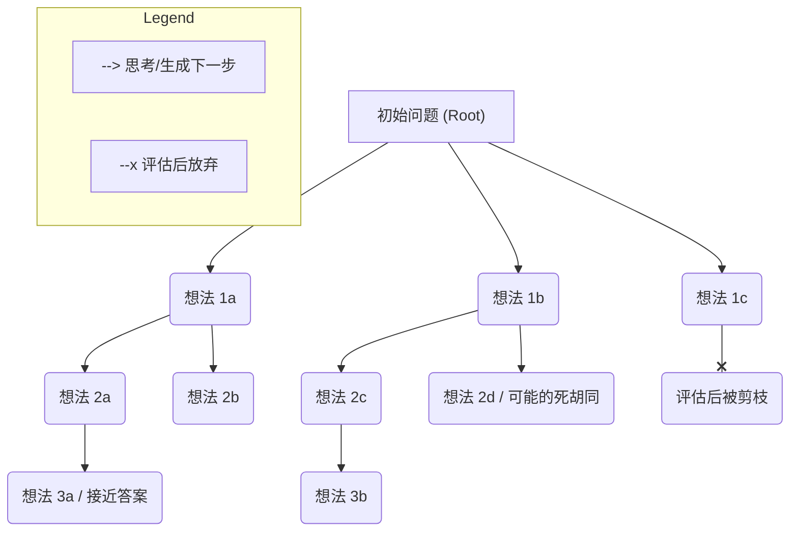
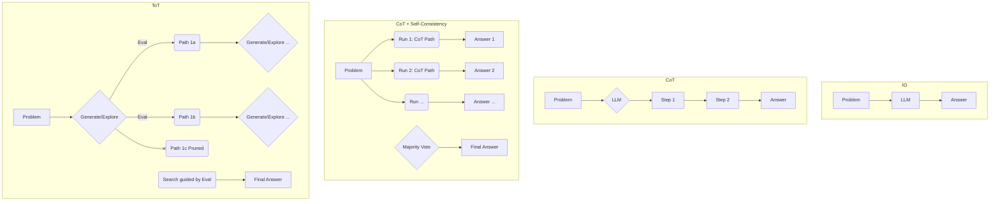

## AI论文解读 | 思维树 , Tree of Thoughts: Deliberate Problem Solving with Large Language Models   
    
### 作者    
digoal    
    
### 日期    
2025-04-26    
    
### 标签    
PostgreSQL , PolarDB , DuckDB , AI , 论文解读    
    
----    
    
## 背景    
https://arxiv.org/pdf/2305.10601    
    
提示:    
```    
读懂《Tree of Thoughts: Deliberate Problem Solving with Large Language Models》这篇论文需要提前掌握哪些基础知识, 请给我讲一下这些基础知识, 尽量通熟易懂, 可以使用markdown支持的图形增加解释性.    
    
通熟易懂的解读《Tree of Thoughts: Deliberate Problem Solving with Large Language Models》这篇论文, 关键内容请深入讲解, 可以使用markdown支持的图形增加解释性.    
    
提取《Tree of Thoughts: Deliberate Problem Solving with Large Language Models》论文中一些重要的术语并详细解释, 可以使用markdown支持的图形示增加解释性.    
```    
    
## 1 前置知识    
  
好的，为了帮助你理解《Tree of Thoughts: Deliberate Problem Solving with Large Language Models》这篇论文，我们来梳理一下所需的基础知识。我会尽量用通俗易懂的方式解释，并使用 Markdown 图形辅助说明。  
  
这篇论文的核心思想是提出一种新的方法，让大型语言模型（LLM）能够更有效地解决需要探索、评估和选择性回溯的复杂问题，模仿人类思考时探索不同思路的过程。  
  
以下是你需要了解的基础知识点：  
  
### 1. 大型语言模型 (Large Language Models, LLMs) 基础  
  
* **是什么？** LLMs 是在海量文本数据上训练出来的深度学习模型（通常是基于 Transformer 架构）。它们的核心能力是**预测下一个词**。通过不断预测，它们可以生成连贯的文本、回答问题、翻译语言等。  
* **怎么工作？** 你给它一段文字作为输入（称为**提示 Prompt**），它会根据训练时学到的模式，生成一段相关的文字作为输出。  
    ```mermaid  
    graph LR  
        A[用户输入 Prompt] --> B(大型语言模型 LLM);  
        B --> C[模型生成 Output];  
    ```  
* **关键特点：**  
    * **上下文理解：** 能理解输入文本的含义。  
    * **文本生成：** 能产生语法正确、语义相关的文本。  
    * **知识性：** 在训练数据中隐含了大量的世界知识。  
    * **局限性：** 有时会“胡说八道”（Hallucination）、缺乏真正的推理能力、容易受到提示的影响。  
  
### 2. 提示工程 (Prompt Engineering)  
  
* **是什么？** 这是设计有效输入（Prompt）以引导 LLM 产生期望输出的艺术和科学。Prompt 的好坏直接影响 LLM 的表现。  
* **常见方法：**  
    * **零样本提示 (Zero-shot Prompting):** 直接向模型提问或下达指令，不给任何示例。  
        * 例子：`请将“Hello”翻译成中文。`  
    * **少样本提示 (Few-shot Prompting):** 在 Prompt 中提供几个示例，让模型学习你想要的格式或任务类型。  
        * 例子：  
            ```  
            英文：Apple  
            中文：苹果  
  
            英文：Banana  
            中文：香蕉  
  
            英文：Orange  
            中文：？  
            ```  
    * **思维链 (Chain-of-Thought, CoT) 提示:** 这是理解 ToT 论文 *非常关键* 的前置知识。CoT 通过引导 LLM 在给出最终答案前，先输出一步一步的推理过程，来提高其在复杂推理任务上的表现。  
        * **普通提示 (Standard Prompting):**  
            ```mermaid  
            graph TD  
                A[问题] --> B{LLM};  
                B --> C(直接答案);  
            ```  
        * **思维链提示 (CoT Prompting):**  
            ```mermaid  
            graph TD  
                A[问题] --> B{LLM};  
                B --> C(思考步骤 1);  
                C --> D(思考步骤 2);  
                D --> E(思考步骤 ...);  
                E --> F(最终答案);  
            ```  
        * **为什么 CoT 有效？** 它将复杂问题分解为更小的步骤，让 LLM 可以逐步处理，减少直接跳到错误结论的可能性。  
  
### 3. 基本的搜索算法概念 (特别是树搜索)  
  
* **什么是搜索？** 在人工智能中，搜索是指在一个“状态空间”中寻找解决方案的过程。状态空间包含了所有可能的情况（状态）以及从一个状态转移到另一个状态的方式（动作）。  
* **树 (Tree) 结构：** 这是 ToT 论文的核心隐喻。想象一下解决问题的过程就像一棵树：  
    * **根节点 (Root):** 问题的初始状态。  
    * **节点 (Node):** 代表一个中间的“想法”或“思考状态”。  
    * **边 (Edge):** 代表从一个想法到下一个想法的“思考步骤”或“推理过程”。  
    * **分支 (Branch):** 代表不同的思考路径或可能性。  
    * **叶节点 (Leaf):** 代表一个潜在的最终答案或思考的终点。  
    ```mermaid  
    graph TD  
        A["初始问题 (Root)"] --> B(想法 1a);  
        A --> C(想法 1b);  
        B --> D(想法 2a);  
        B --> E(想法 2b / 死胡同);  
        C --> F(想法 2c);  
        D --> G(最终答案?);  
        F --> H(最终答案?);  
    ```  
* **搜索策略 (Search Strategy):** 如何在这棵树中进行探索？  
    * **深度优先搜索 (Depth-First Search, DFS):** 沿着一条路径一直走到底，不行再回溯换条路。  
    * **广度优先搜索 (Breadth-First Search, BFS):** 先把所有第一层的可能性都探索完，再探索第二层，以此类推。  
    * ToT 论文中会用到类似 BFS 或 Beam Search（一种保留几个最佳路径的策略）的思想来管理这棵“思想树”。  
  
### 4. ToT 与 CoT 的区别 (核心概念)  
  
* **思维链 (CoT):** 基本上是**一条**思考路径。LLM 生成一个线性的推理步骤序列。如果中间某一步错了，可能整条链就都错了，而且它不太会主动回溯或比较不同思路。  
    ```  
    问题 -> 思路A -> 思路B -> 思路C -> 答案 (一条链)  
    ```  
* **思维树 (Tree of Thoughts, ToT):** LLM 同时探索**多条**思考路径（树的分支）。它会：  
    1.  **生成多个想法 (Generate):** 从当前状态出发，让 LLM 提出多种可能的下一步想法。  
    2.  **评估这些想法 (Evaluate):** 使用 LLM 或其他方法判断哪些想法更有前景，哪些是死胡同。  
    3.  **选择性探索 (Search):** 根据评估结果，决定接下来重点探索哪些分支（比如用 BFS 或 Beam Search）。  
  
    ```mermaid  
    graph TD  
        subgraph "思维树 (ToT)"
            A[问题] --> B{生成想法};  
            B --> C["想法 1a (评估: 好)"];  
            B --> D["想法 1b (评估: 一般)"];  
            B --> E["想法 1c (评估: 差)"];  
  
            C --> F{探索 1a};  
            F --> G[想法 2a1];  
            F --> H[想法 2a2];  
  
            D --> I{探索 1b};  
            I --> J[想法 2b1];  
  
            E --x K(丢弃);  
            subgraph Legend
                L[--> 生成/探索]  
                M[--x 丢弃/回溯]  
            end  
        end  
    ```  
    * **关键优势：** ToT 允许模型进行更系统的探索，可以比较不同的中间思路，并在某条路走不通时回溯到之前的节点，尝试其他分支。这使得它在需要规划、搜索或需要创造性解决方案的任务上表现更好。  
  
### 总结  
  
要读懂 ToT 论文，你需要：  
  
1.  **了解 LLM 是什么**，它们如何通过 Prompt 工作。  
2.  **熟悉 Prompt Engineering**，特别是 **思维链 (CoT)** 的概念，因为 ToT 是对 CoT 的一个重要扩展和改进。  
3.  **理解基本的树结构和搜索概念**，因为 ToT 的核心就是用树结构来组织和探索 LLM 生成的“想法”。  
4.  **把握 ToT 的核心机制**：生成多个想法、评估想法、以及使用搜索策略（如 BFS/Beam Search）来管理这棵“思想树”，从而实现比 CoT 更强大的问题解决能力。  
  
有了这些基础，你就能更好地理解论文中描述的方法、实验设置以及它为什么能够提升 LLM 在复杂问题上的表现了。祝你阅读顺利！  
  
## 2 解读论文    
  
好的，我们来一起深入解读一下《Tree of Thoughts: Deliberate Problem Solving with Large Language Models》这篇重要的论文。我会尽量用通俗易懂的语言，结合图形，把关键点讲清楚。  
  
**论文核心目标：让大模型像人一样“深思熟虑”地解决问题**  
  
想象一下我们人类解决复杂问题（比如策划一次旅行、解一道难题、或者写一个故事）的过程：我们通常不会一步到位，而是会：  
  
1.  **思考多种可能性**：想出好几个不同的方案或思路（比如去A地还是B地？先做哪一步？）。  
2.  **评估这些可能性**：判断哪个方案更好，哪个可能行不通。  
3.  **深入探索有希望的思路**：沿着觉得靠谱的方向继续想下去。  
4.  **遇到困难时回溯**：如果一条路走不通，我们会退回来，尝试其他思路。  
  
然而，传统的大型语言模型（LLM）在解决问题时，通常比较“一条筋”：  
  
  * **输入-输出 (Input-Output, IO):** 你问它问题，它直接给答案，中间过程不透明。  
  * **思维链 (Chain-of-Thought, CoT):** 它会展示思考步骤，但通常是生成**一条**线性的思考路径。如果中间一步错了，后面很可能就全错了，而且它不太会主动探索其他可能或者回头修正。  
  
**这篇论文要解决的问题就是：** 如何让 LLM 也能拥有类似人类的这种探索、评估、选择、回溯的“深思熟虑”能力，而不是仅仅沿着一条路走下去？  
  
**核心思想：思维树 (Tree of Thoughts, ToT)**  
  
ToT 框架的核心思想就是把 LLM 的问题解决过程，从一条“链”变成一棵“树”。  
  
  * **节点 (Node):** 代表问题解决过程中的一个**中间状态**或**想法 (Thought)**。比如，在解“24点游戏”时，一个节点可能代表当前的数字和已进行的运算 `(还剩 1, 4, 5; 当前结果 6)`。  
  * **边 (Edge):** 代表从一个想法到下一个想法的**思考步骤 (Step)**。比如，用剩下的 `4` 和 `5` 做乘法得到 `20`。  
  * **树 (Tree):** 整个探索过程构成的结构，包含了所有被考虑过的想法和路径。  
  
  

  
这棵树代表了 LLM 在 ToT 框架下解决问题的过程：从初始问题出发，探索多个分支（不同的想法），评估这些分支，然后选择有希望的分支继续深入，甚至可能放弃（剪枝）那些看起来没前途的分支。  
  
**ToT 如何工作？关键机制详解 (深入讲解)**  
  
ToT 框架的运作依赖于几个关键组件的协同：  
  
1.  **想法的分解 (Thought Decomposition):**  
  
      * **做什么？** 首先要把复杂问题分解成可以一步步推进的“想法”单元。这个分解方式取决于具体任务。  
          * 对于“24点游戏”，每个想法可以是应用一步运算后的中间结果。  
          * 对于写故事，每个想法可以是一小段情节或一个段落。  
          * 对于解谜，每个想法可以是填入一个或几个单词/数字。  
      * **重要性：** 如何定义“想法”决定了树的结构和粒度。好的分解方式能让后续的生成和评估更有效。  
  
2.  **想法的生成 (Thought Generation):**  
  
      * **做什么？** 在树的某个节点（代表当前状态），需要生成**多个**可能的下一步“想法”（即创建新的分支）。  
      * **怎么做？** 这主要依靠 LLM 的能力。通过精心设计的 Prompt，让 LLM 基于当前状态提出多种可能的后续步骤。  
          * **例子 Prompt (非精确原文):** "对于当前状态 `[状态描述]`，请提出 3 个可能的下一步操作/想法。"  
      * **对比 CoT:** CoT 通常只生成 *一个* 下一步想法，而 ToT 则生成 *多个*，这是形成“树”的关键。  
  
  
    ```mermaid  
    graph LR  
        A["当前想法/状态 (Node)"] --> B{LLM Prompted to Generate};  
        B -- P1 --> C(下一步想法 1);  
        B -- P2 --> D(下一步想法 2);  
        B -- P3 --> E(下一步想法 3);  
    ```  
  
3.  **状态的评估 (State Evaluation):**  
  
      * **做什么？** 这是 ToT 的核心亮点之一。需要有一种机制来判断当前树中的各个节点（想法）的“好坏”或“前景如何”。  
      * **怎么做？** 论文提出了几种方法，通常也利用 LLM 本身：  
          * **独立评估 (Value):** 让 LLM 直接评估某个状态的价值。Prompt 可能像：“评估当前状态 `[状态描述]` 距离最终目标有多近？(例如，从 1 到 10 打分)” 或者 “这个部分解决方案看起来有希望吗？(是/否/可能)”。  
          * **投票选择 (Vote):** 生成多个后续想法后，让 LLM 对这些想法进行投票或排序，选出最好的几个。  
          * **启发式规则 (Heuristic):** 对于特定任务（如 24点），可以用一些明确的规则来判断状态是否有效或有前景（比如，是否用完了所有数字？是否超出了目标值范围？）。  
      * **重要性：** 评估使得 ToT 可以**智能地**选择探索方向，避免在无效或低效的路径上浪费计算资源。这是实现“深思熟虑”的关键，因为它允许模型判断哪些思路值得继续，哪些应该放弃。  
  
4.  **搜索算法 (Search Algorithm):**  
  
      * **做什么？** 有了生成和评估机制后，需要一个策略来决定如何在这棵不断增长的树中进行导航和探索。  
      * **怎么做？** 论文中主要使用了两种经典的树搜索算法：  
          * **广度优先搜索 (Breadth-First Search, BFS):** 一层一层地探索树。先探索所有深度为 1 的节点，再探索所有深度为 2 的节点，以此类推。比较系统化，但可能很慢且消耗资源。  
          * **束搜索 (Beam Search):** 在每一步探索时，只保留**最有希望的 `k` 个**节点（`k` 是束宽，beam width）。这是一种平衡探索广度和效率的策略。它不像 BFS 那样探索所有可能，也不像 CoT 那样只走一条路。  
  
  
    ```mermaid  
    graph TD  
        subgraph "BFS (探索所有同层节点)"
            A1[Start] --> B1 & C1 & D1;  
            B1 --> E1 & F1;  
            C1 --> G1;  
            D1 --> H1 & I1;  
            direction LR  
        end  
        subgraph "Beam Search (k=2, 每层保留最好2个)"
            A2[Start] --> B2(好) & C2(较好) & D2(差);  
            B2 --> E2(好) & F2(一般);  
            C2 --> G2(好) & H2(差);  
            direction LR  
            %% 在下一步只从 E2, F2, G2, H2 中选最好的 k=2 个继续探索  
        end  
    ```  
  
      * **重要性：** 搜索算法决定了 ToT 探索思想树的系统性和效率。它结合了生成和评估的结果，引导整个问题解决过程。  
  
**ToT 与其他方法的对比 (深入讲解)**  
  
理解 ToT 的优势，最好是和现有方法对比：  
  
| 特点         | 输入-输出 (IO) | 思维链 (CoT) | CoT + 自洽性 (Self-Consistency) | 思维树 (ToT)                      |  
| :----------- | :------------- | :----------- | :------------------------------ | :-------------------------------- |  
| **结构** | 直接映射       | 线性链       | 多条独立线性链                  | **树状结构** |  
| **思考过程** | 黑盒           | 单一路径     | 多条独立路径，最后投票          | **显式探索多路径** |  
| **探索性** | 无             | 低           | 隐式（通过多次独立运行）        | **高 (显式生成和探索分支)** |  
| **评估** | 无             | 无           | 最终答案投票                    | **评估中间状态/想法** |  
| **回溯/修正** | 无             | 难           | 难（只能重跑）                  | **支持 (通过评估和选择分支)** |  
| **例子图示** | A -\> Z         | A-\>B-\>C-\>Z   | (A-\>B-\>C-\>Z1)\<br\>(A-\>X-\>Y-\>Z2)\<br\>... -\> Vote(Z) | (见上方 ToT 图)                     |  
  

  
  * **ToT vs CoT:** CoT 像是在森林里沿着一条小路走，希望能走到终点。ToT 像是在森林里，每次遇到岔路口，都派侦察兵去探查几条路，评估哪条路更有希望，然后重点走那条路，甚至放弃死路。  
  * **ToT vs Self-Consistency:** Self-Consistency 是让 LLM 独立地走多次 CoT 的路，最后看哪个终点出现次数最多。它没有在过程中进行评估和调整。ToT 是在行走的过程中，不断评估和选择路径，更加智能和主动。  
  
**实验与结果**  
  
论文在三个需要规划和探索的任务上验证了 ToT 的效果：  
  
1.  **24点游戏 (Game of 24):** 需要搜索数字和运算的组合。ToT 表现远超 CoT。  
2.  **创意写作 (Creative Writing):** 需要生成连贯且有创意的段落，同时满足特定约束。ToT 能生成更符合要求的文本。  
3.  **迷你填字游戏 (Mini Crosswords):** 需要满足词语约束。ToT 解决率更高。  
  
结果表明，ToT 框架显著提升了 LLM 在这些复杂任务上的表现，证明了这种“深思熟虑”方法的有效性。  
  
**优势与局限**  
  
  * **优势：**  
      * 显著增强 LLM 在需要规划、搜索、探索的任务上的能力。  
      * 中间状态的评估有助于减少错误累积和“胡说八道”。  
      * 框架相对通用，可以应用于不同类型的问题。  
  * **局限/挑战：**  
      * **计算成本高：** 探索树需要多次调用 LLM 进行生成和评估，比 CoT 慢且贵。  
      * **依赖高质量的生成和评估：** 如果 LLM 生成的候选想法不好，或者评估不准确，ToT 的效果会打折扣。  
      * **Prompt 设计复杂：** 如何为特定任务设计好的分解、生成、评估的 Prompt 需要技巧。  
  
**总结**  
  
《Tree of Thoughts》这篇论文提出了一个创新且强大的框架，通过模拟人类思考时探索、评估、选择和回溯的过程，显著提升了大型语言模型解决复杂问题的能力。它将 LLM 的问题解决过程从线性的“思维链”扩展为可以系统性探索的“思维树”，并通过引入中间状态的评估和搜索策略，实现了更加“深思熟虑”的推理。虽然计算成本较高，但它为提升 LLM 的推理和规划能力开辟了新的重要方向。  
  
希望这个深入解读对你理解这篇论文有帮助！  
  
## 3 术语    
  
好的，我们来提取并详细解释一下《Tree of Thoughts: Deliberate Problem Solving with Large Language Models》论文中的一些核心术语。  
  
---  
  
### 1. 思维树 (Tree of Thoughts - ToT)  
  
* **核心定义:** ToT 是一个问题解决框架，它允许大型语言模型 (LLM) 探索**多条**不同的推理路径（像树的分支一样），评估这些路径的中间步骤（“想法”），并使用搜索算法来系统地引导整个过程，而不是像传统方法那样只遵循单一的推理链。  
* **详细解释:** 这不仅仅是一种提示技巧，而是一个**控制流程 (Control Flow)**。它把 LLM 当作一个可以生成和评估“想法”的子程序，并通过一个外部的、树状的结构来组织这些想法。这个框架模仿了人类在面对复杂问题时，会考虑多种可能性、评估优劣、深入有前景的思路、并放弃死胡同的思考方式。  
* **图形示意:**  
    ```mermaid  
    graph TD  
        A[问题] --> B{探索/生成};  
        B -- 分支1 --> C(想法 1a);  
        B -- 分支2 --> D(想法 1b);  
        B -- 分支3 --> E(想法 1c);  
        C --> F{继续探索/评估};  
        D --> G{继续探索/评估};  
        E -- 剪枝 --> H(评估后放弃);   
        F --> ...;  
        G --> ...;  
        style H fill:#f9f,stroke:#333,stroke-width:2px   
    ```  
* **重要性:** 这是论文提出的核心框架，是区别于 IO、CoT 等方法的根本所在。  
  
---  
  
### 2. 想法 (Thought)  
  
* **核心定义:** 在 ToT 框架中，“想法”指的是一段连贯的文本序列，代表了解决问题过程中的一个有意义的中间步骤或状态。  
* **详细解释:** 一个“想法”可以是一个数学问题的中间计算步骤、一个写作任务中的句子或段落、一个逻辑谜题的部分解。它不仅仅是 LLM 输出的随机文本，而是被设计为问题解决过程中的一个“思维单元”。树中的每个节点通常就对应一个“想法”。  
* **例子:**  
    * **24点游戏:** 初始想法 `输入: 4 4 5 6`. 下一个想法可以是 `(4 + 4) = 8; 剩下 5 6`. 再下一个想法可以是 `8 * 5 = 40; 剩下 6`.  
    * **写作:** 初始想法 `故事开头：一个年轻的侦探站在雨中的街头`. 下一个想法可以是 `他正在调查一起珠宝失窃案，线索指向了码头`.  
  
---  
  
### 3. 状态 (State)  
  
* **核心定义:** 代表问题解决过程在某一时刻的“快照”。在 ToT 中，一个状态通常由到达该点的一系列“想法”所定义。树中的每个节点可以被视为一个状态。  
* **详细解释:** 状态是评估和搜索的基础。我们需要评估一个**状态**是否有前景，然后决定从哪个**状态**继续生成新的想法。虽然 “想法” 和 “状态” 在论文中有时可以互换使用（一个想法导致了一个新状态），但“状态”更强调其在树结构中的位置和可被评估的特性。  
  
---  
  
### 4. 想法分解 (Thought Decomposition / Problem Decomposition)  
  
* **核心定义:** 将原始的复杂问题拆解成一系列可以通过“想法”来逐步解决的中间步骤的过程。  
* **详细解释:** 如何定义“想法”的粒度和类型就是想法分解的核心。例如，解 24 点游戏可以分解为一步步的算术运算；写作可以分解为一段段的文字生成。这个分解方式直接影响了思维树的结构和有效性。你需要设计一种分解方式，使得 LLM 能够有效地生成和评估这些中间“想法”。  
  
---  
  
### 5. 想法生成器 (Thought Generator / Generate Step)  
  
* **核心定义:** ToT 框架中负责产生**多个**可能的下一步“想法”的模块或步骤。  
* **详细解释:** 给定一个当前的想法/状态，想法生成器利用 LLM 的能力，通过特定的 Prompt，引导它提出 `k` 个不同的、可能有效的后续步骤或思路。这是思维树能够“分叉”的关键。  
* **图形示意:**  
    ```mermaid  
    graph LR  
        A[当前状态 S] -- Prompt --> B(LLM);  
        B -- Propose k=3 --> C(新想法 1 -> S');  
        B -- Propose k=3 --> D(新想法 2 -> S'');  
        B -- Propose k=3 --> E(新想法 3 -> S''');  
    ```  
  
---  
  
### 6. 状态评估器 (State Evaluator / Evaluate Step)  
  
* **核心定义:** ToT 框架中负责评估特定状态（或想法）的价值或前景的模块或步骤。  
* **详细解释:** 这是实现“深思熟虑”的关键。评估器判断当前的想法/状态是否“好”、是否“有希望”、是否“接近最终目标”或“是否有效”。评估结果将用于指导后续的搜索过程（比如决定优先探索哪些分支，或者剪掉哪些分支）。评估可以由 LLM 本身完成（通过特定 Prompt 让 LLM 打分或判断），也可以是基于规则的启发式评估。  
* **图形示意:**  
    ```mermaid  
    graph TD  
        A[状态 S'] --> B{"评估器 (LLM/Heuristic)"};  
        B --> C["评估结果: 8/10 (有希望)"];  
        D[状态 S''] --> B;  
        B --> E["评估结果: 3/10 (前景不佳)"];  
    ```  
  
---  
  
### 7. 搜索算法 (Search Algorithm)  
  
* **核心定义:** 在 ToT 框架中，用于系统性地探索“思维树”的策略或过程。  
* **详细解释:** 由于思维树可能非常庞大，需要一个有效的算法来决定探索的顺序和范围。论文中主要使用了：  
    * **广度优先搜索 (Breadth-First Search, BFS):** 按层级顺序探索，先探索所有深度为 1 的节点，再探索深度为 2 的，以此类推。确保能找到最短路径（如果以步数衡量），但可能非常耗费资源。  
    * **束搜索 (Beam Search):** 在每一步（或每一层），只保留评分最高的 `k` 个节点（`k` 是束宽）进行下一步扩展。是一种在效率和探索广度之间的折中。  
    * **深度优先搜索 (Depth-First Search, DFS):** 沿着一条路径一直走到底，如果不行再回溯。在 ToT 中也可以使用，尤其是在需要快速找到一个可行解时。  
* **重要性:** 搜索算法结合了“想法生成”和“状态评估”的结果，具体地指导了如何在思维树中前进、选择和放弃。  
  
---  
  
### 8. 思维链 (Chain-of-Thought - CoT)  
  
* **核心定义:** 一种提示技术，引导 LLM 在给出最终答案前，先生成一系列中间推理步骤。  
* **详细解释:** CoT 将 LLM 的思考过程从 `问题 -> 答案` 变成了 `问题 -> 思考步骤1 -> 思考步骤2 -> ... -> 答案`。这提高了 LLM 在推理任务上的表现。但 CoT 通常只生成**一条**思考链，缺乏探索和回溯能力。ToT 正是为了克服 CoT 的这个局限性而提出的。  
* **图形示意:**  
    ```mermaid  
    graph LR  
        A[问题] --> B(LLM: 思考步骤 1) --> C(LLM: 思考步骤 2) --> D(LLM: ... ) --> E(最终答案);  
    ```  
  
---  
  
### 9. 剪枝 (Pruning)  
  
* **核心定义:** 在树搜索过程中，根据状态评估器的结果，提前放弃或“修剪”掉那些看起来没有希望或无效的思维分支。  
* **详细解释:** 这是提高 ToT 效率的关键。如果没有剪枝，思维树可能会无限增长或探索大量无用路径。状态评估器识别出低价值的状态后，搜索算法就可以决定不再从这些状态出发生成新的想法，即进行剪枝。  
  
---  
  
### 10. 回溯 (Backtracking)  
  
* **核心定义:** 在搜索过程中，当发现当前路径无法达到目标或被评估为没有希望时，能够返回到之前的某个节点（状态），并尝试探索其他未被探索的分支的能力。  
* **详细解释:** ToT 框架通过其树状结构和搜索算法（如 DFS 或带有剪枝的 BFS/Beam Search）天然地支持了回溯。如果一条深层路径被证明无效或被剪枝，搜索算法会自动地或根据策略选择树中更高层的、有希望的节点继续探索。这与人类思考时“此路不通，换条路试试”非常相似。  
  
---  
  
理解这些术语及其相互关系，是掌握《Tree of Thoughts》这篇论文核心思想的关键。希望这些解释能帮助你更好地理解它！  
  
## 参考    
https://arxiv.org/pdf/2305.10601    
    
https://edu.aliyun.com/course/3126500/lesson/342570389    
    
https://github.com/AlibabaCloudDocs/aliyun_acp_learning/blob/main/%E5%A4%A7%E6%A8%A1%E5%9E%8BACP%E8%AE%A4%E8%AF%81%E6%95%99%E7%A8%8B/p2_%E6%9E%84%E9%80%A0%E5%A4%A7%E6%A8%A1%E5%9E%8B%E9%97%AE%E7%AD%94%E7%B3%BB%E7%BB%9F/2_6_%E7%94%A8%E6%8F%92%E4%BB%B6%E6%89%A9%E5%B1%95%E7%AD%94%E7%96%91%E6%9C%BA%E5%99%A8%E4%BA%BA%E7%9A%84%E8%83%BD%E5%8A%9B%E8%BE%B9%E7%95%8C.ipynb    
    
    
    
<b> 以上内容基于DeepSeek、QwQ及诸多AI生成, 轻微人工调整, 感谢杭州深度求索人工智能、阿里云等公司. </b>    
    
<b> AI 生成的内容请自行辨别正确性, 当然也多了些许踩坑的乐趣, 毕竟冒险是每个男人的天性.  </b>    
    
  
  
#### [期望 PostgreSQL|开源PolarDB 增加什么功能?](https://github.com/digoal/blog/issues/76 "269ac3d1c492e938c0191101c7238216")
  
  
#### [PolarDB 开源数据库](https://openpolardb.com/home "57258f76c37864c6e6d23383d05714ea")
  
  
#### [PolarDB 学习图谱](https://www.aliyun.com/database/openpolardb/activity "8642f60e04ed0c814bf9cb9677976bd4")
  
  
#### [PostgreSQL 解决方案集合](../201706/20170601_02.md "40cff096e9ed7122c512b35d8561d9c8")
  
  
#### [德哥 / digoal's Github - 公益是一辈子的事.](https://github.com/digoal/blog/blob/master/README.md "22709685feb7cab07d30f30387f0a9ae")
  
  
#### [About 德哥](https://github.com/digoal/blog/blob/master/me/readme.md "a37735981e7704886ffd590565582dd0")
  
  

  
