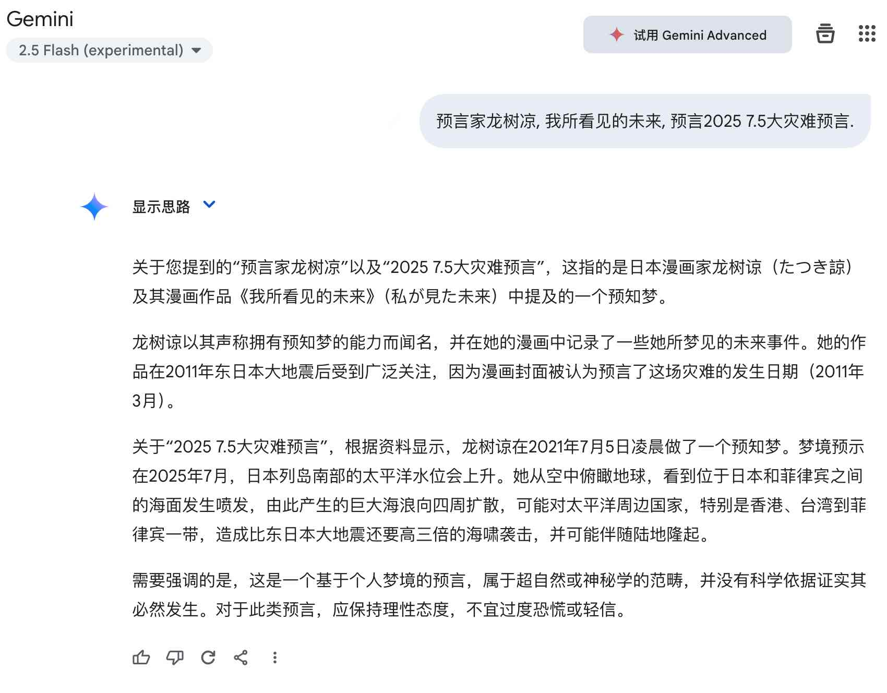
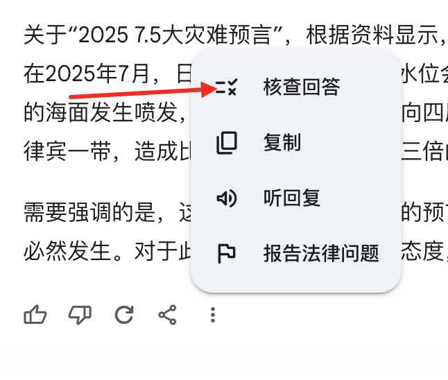
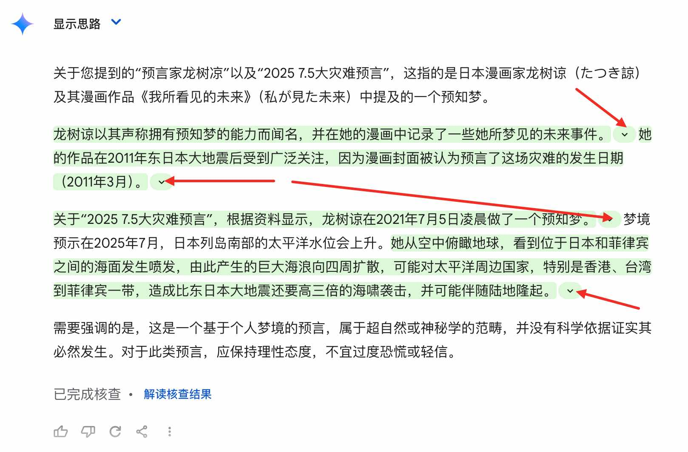
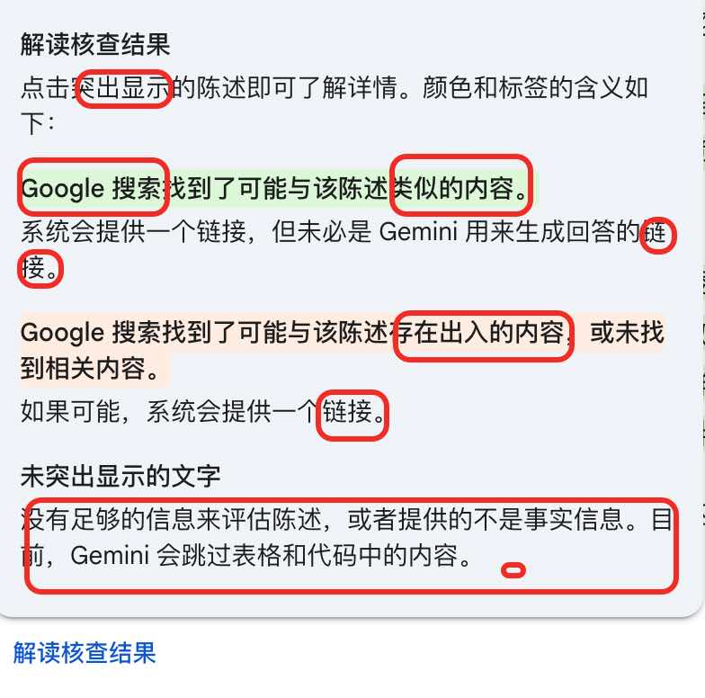
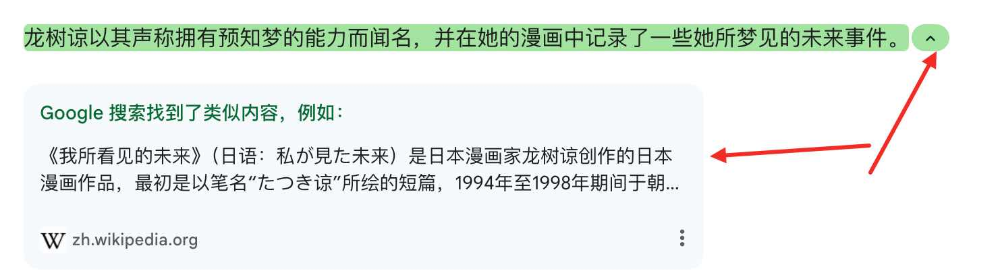

## 德说-第329期, RAG逆向应用 | 谷歌Gemini实现AI回复结果核查(证明或证伪)功能  
                  
### 作者                  
digoal                  
                  
### 日期                  
2025-04-26                 
                  
### 标签                  
PostgreSQL , PolarDB , DuckDB , RAG , 佐证 , AI , 大模型 , 胡编乱造 , 证明 , 证伪    
                  
----                  
                  
## 背景   
RAG 指使用私有知识库增强大模型对未训练知识准确度, 避免无法回复或胡编乱造的问题.  
  
反过来, 可以先让模型生成结果, 然后到公网或内网搜索可以佐证AI回复观点的内容, 用来证明或证伪AI的回复内容.  
  
谷歌Gemini就上线了这样的功能, 如下.    
  
    
  
    
  
    
  
    
  
    
  
但是还需要提醒一下, 如果用来核实的佐证材料本身就是不可靠(如可能是模型生成的、也可能本身就是不可信的内容), 可能陷入循环论证的情况. 所以在寻找佐证材料是需要先确认其可靠性.  
  
  
  
  
  
#### [期望 PostgreSQL|开源PolarDB 增加什么功能?](https://github.com/digoal/blog/issues/76 "269ac3d1c492e938c0191101c7238216")
  
  
#### [PolarDB 开源数据库](https://openpolardb.com/home "57258f76c37864c6e6d23383d05714ea")
  
  
#### [PolarDB 学习图谱](https://www.aliyun.com/database/openpolardb/activity "8642f60e04ed0c814bf9cb9677976bd4")
  
  
#### [PostgreSQL 解决方案集合](../201706/20170601_02.md "40cff096e9ed7122c512b35d8561d9c8")
  
  
#### [德哥 / digoal's Github - 公益是一辈子的事.](https://github.com/digoal/blog/blob/master/README.md "22709685feb7cab07d30f30387f0a9ae")
  
  
#### [About 德哥](https://github.com/digoal/blog/blob/master/me/readme.md "a37735981e7704886ffd590565582dd0")
  
  

  
