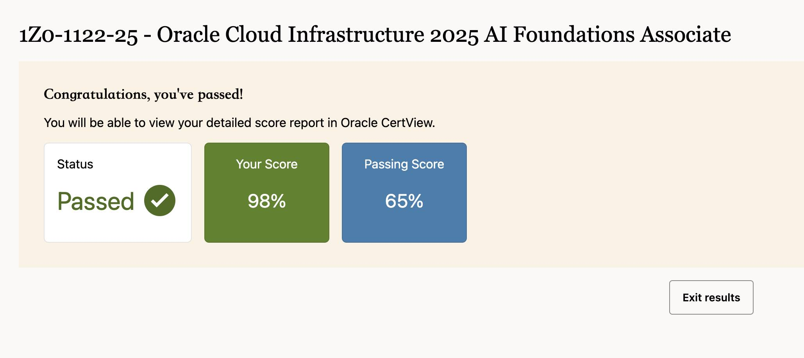
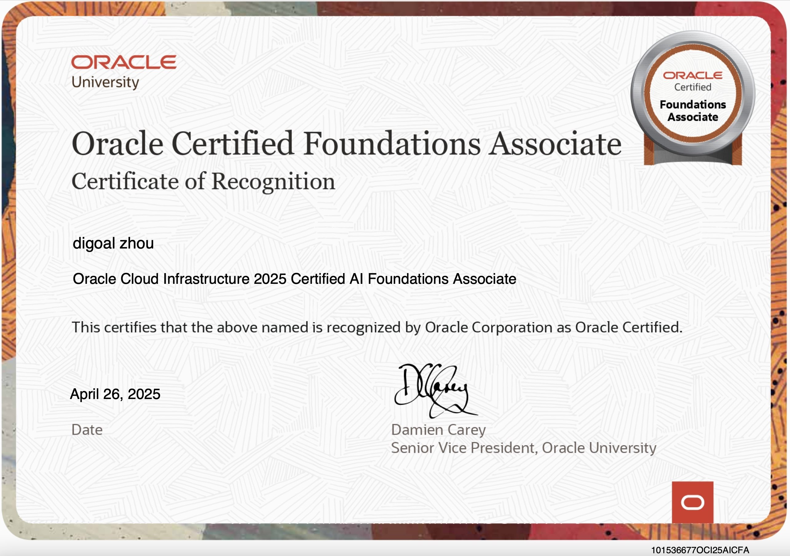

## 裸考拿下Oracle AI Foundations Associate认证    
                      
### 作者                      
digoal                      
                      
### 日期                      
2025-04-26                     
                      
### 标签                      
PostgreSQL , PolarDB , DuckDB , Oracle AI 认证     
                      
----                      
                      
## 背景       
和MySQL免费认证一个尿性: [《德说-第327期, MySQL认证免费了, 它的“阴谋”是什么?》](../202504/20250425_04.md)      
    
Oracle AI 认证也免费了, 考完告诉大家一下, 里面其实很多都是暗藏宣传自家OCI的内容, 自行甄别吧.      
    
有了阿里云大模型(LLM) ACA ACP的认证基础, 考Oracle AI Foundations Associate认证非常轻松. 40道题60分钟, 裸考居然98分通过.      
  
  
  
  
    
下面是阿里云 [《大模型(LLM) ACA ACP 通关经验分享》](../202504/20250411_01.md)  . ACA ACP考试辅导资料非常有价值, 建议学习.      
    
Oracle AI 认证在Oracle Cloud Infrastructure (OCI) 体系里     
- https://www.oracle.com/cn/education/certification/#oci     
    
搜索Oracle AI相关的认证    
- https://mylearn.oracle.com/ou/search/oracle-ai-vector-search-professional    
    
发现有3个AI相关的认证, 其中第一个是免费考的, 地址也有点不太一样exam-unproctored下.      
    
学习视频都免费, 就算不考也可以学习一下, 学到就是自己的.    
    
    
### 1、Oracle Cloud Infrastructure 2025 AI Foundations Associate    
    
免费课程:    
    
https://mylearn.oracle.com/ou/course/oracle-cloud-infrastructure-ai-foundations/147805/223411    
    
免费考试地址:    
    
https://mylearn.oracle.com/ou/exam-unproctored/oracle-cloud-infrastructure-2025-ai-foundations-associate-1z0-1122-25/147781/241962    
    
### 2、Oracle Cloud Infrastructure 2025 Generative AI Professional    
    
免费课程:    
    
https://mylearn.oracle.com/ou/learning-path/become-a-oci-generative-ai-professional/147863    
    
https://mylearn.oracle.com/ou/course/oracle-cloud-infrastructure-generative-ai-professional/147932/243479    
    
付费考试地址:    
    
https://mylearn.oracle.com/ou/exam/oracle-cloud-infrastructure-2025-generative-ai-professional-1z0-1127-25/35644/147386/241953    
    
https://education.oracle.com/products/trackp_OCI25GAIOCP    
    
`¥1,671`    
```    
Format: Multiple Choice    
Duration: 90 Minutes    
Exam Price: ¥1,671    
Number of Questions: 50    
Passing Score: 68%    
Validation: This exam has been validated against Oracle Cloud Infrastructure 2025    
Policy: Cloud Recertification    
```    
    
考点    
    
Objectives	| % of Exam    
---|---    
 Fundamentals of Large Language Models (LLMs)	|20%    
 Using OCI Generative AI Service	|40%    
 Implement RAG using OCI Generative AI service	|20%    
 Using OCI Generative AI RAG Agents service |	20%    
     
    
Fundamentals of Large Language Models (LLMs)    
- Explain the fundamentals of LLMs    
- Understand LLM architectures    
- Design and use prompts for LLMs    
- Understand LLM fine-tuning    
- Understand the fundamentals of code models, multi-modal, and language agents    
    
Using OCI Generative AI Service    
- Explain the fundamentals of OCI Generative AI service    
- Use pretranined foundational models for Chat and Embedding    
- Create dedicated AI clusters for fine-tuning and inference    
- Fine-tune base models with custom dataset    
- Create and use model endpoints for inference    
- Explore OCI Generative AI security architecture    
    
Implement RAG using OCI Generative AI service    
- Explain OCI Generative AI integration with LangChain and Oracle Database 23ai    
- Explain RAG and RAG workflow    
- Discuss loading, splitting and chunking of documents for RAG    
- Create embeddings of chunks using OCI Generative AI service    
- Store and index embedded chunks in Oracle Database 23ai    
- Describe similarity search and retrieve chunks from Oracle Database 23ai    
- Explain response generation using OCI Generative AI service    
    
Using OCI Generative AI RAG Agents service    
- Explain the fundamentals of OCI Generative AI Agents service    
- Discuss options for creating knowledge bases    
- Create and deploy agents using knowledge bases     
- Invoke deployed RAG agent as a chatbot     
    
    
    
### 3、Oracle AI Vector Search Professional    
免费课程:    
    
https://mylearn.oracle.com/ou/course/oracle-ai-vector-search-fundamentals/140188/223444    
  
文字版参考资料:   
- https://docs.oracle.com/en/database/oracle/oracle-database/23/vecse/index.html
  
生成式AI应用:  
- https://docs.oracle.com/en-us/iaas/Content/generative-ai/overview.htm
- https://docs.oracle.com/en-us/iaas/Content/generative-ai-agents/overview.htm
    
付费考试地址:    
    
https://mylearn.oracle.com/ou/exam/oracle-ai-vector-search-professional-1z0-184-25/35644/144913/236030    
    
https://education.oracle.com/ouexam-pexam_1z0-184-25/pexam_1Z0-184-25    
    
    
`¥1,671`    
Format: Multiple Choice    
Duration: 90 Minutes    
Exam Price: ¥1,671    
Number of Questions: 50    
Passing Score: 68%    
Validation: This exam is valid for Oracle Database 23ai    
    
    
    
考点:    
    
The following table lists the exam objectives and their weightings.    
    
Objectives	| % of Exam    
---|---    
 Understand Vector Fundamentals	|20%    
 Using Vector Indexes	|15%    
 Performing Similarity Search	|15%    
 Using Vector Embeddings	|15%    
 Building a RAG Application	|25%    
 Leveraging related AI capabilities	|10%    
    
Understand Vector Fundamentals            
- Use Vector Data type for storing embeddings and enabling semantic queries    
- Use Vector Distance Functions and Metrics for AI vector search    
- Perform DML Operations on Vectors    
- Perform DDL Operations on Vectors    
    
Using Vector Indexes            
- Create Vector Indexes to speed up AI vector search    
- Use HNSW Vector Index for search queries     
- Use IVF Vector Index for search queries    
    
Performing Similarity Search            
- Perform Exact Similarity Search    
- Perform approximate similarity search using Vector Indexes    
- Perform Multi-Vector similarity search for multi-document search    
    
Using Vector Embeddings            
- Generate Vector Embeddings outside the Oracle database    
- Generate Vector Embeddings inside the Oracle database    
- Store Vector Embeddings in Oracle database    
    
Building a RAG Application            
- Understand Retrieval-augmented generation (RAG) concepts    
- Create a RAG application using PL/SQL    
- Create a RAG application using Python    
    
Leveraging related AI capabilities            
- Use Exadata AI Storage to accelerate AI vector search    
- Use Select AI with Autonomous to query data using natural language prompts    
- Use SQL Loader for loading vector data    
- Use Oracle Data Pump for loading and unloading vector data    
    
  
#### [期望 PostgreSQL|开源PolarDB 增加什么功能?](https://github.com/digoal/blog/issues/76 "269ac3d1c492e938c0191101c7238216")
  
  
#### [PolarDB 开源数据库](https://openpolardb.com/home "57258f76c37864c6e6d23383d05714ea")
  
  
#### [PolarDB 学习图谱](https://www.aliyun.com/database/openpolardb/activity "8642f60e04ed0c814bf9cb9677976bd4")
  
  
#### [PostgreSQL 解决方案集合](../201706/20170601_02.md "40cff096e9ed7122c512b35d8561d9c8")
  
  
#### [德哥 / digoal's Github - 公益是一辈子的事.](https://github.com/digoal/blog/blob/master/README.md "22709685feb7cab07d30f30387f0a9ae")
  
  
#### [About 德哥](https://github.com/digoal/blog/blob/master/me/readme.md "a37735981e7704886ffd590565582dd0")
  
  

  
