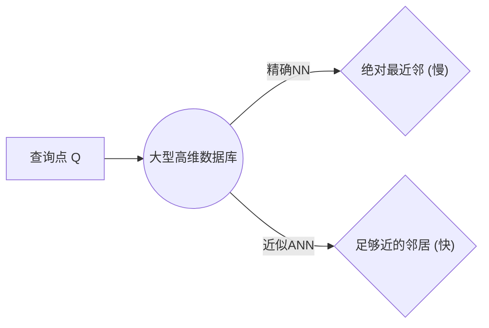

## AI论文解读 | 向量ANNs方法之 RaBitQ: Quantizing High-Dimensional Vectors with a Theoretical Error Bound for Approximate Nearest Neighbor Search
    
### 作者    
digoal    
    
### 日期    
2025-04-27    
    
### 标签    
PostgreSQL , PolarDB , DuckDB , AI , 论文解读    
    
----    
    
## 背景    
https://arxiv.org/pdf/2405.12497    
    
提示:    
```    
读懂《RaBitQ: Quantizing High-Dimensional Vectors with a Theoretical Error Bound for Approximate Nearest Neighbor Search》这篇论文需要提前掌握哪些基础知识, 请给我讲一下这些基础知识, 尽量通熟易懂, 可以使用markdown支持的图形增加解释性.    
    
通熟易懂的解读《RaBitQ: Quantizing High-Dimensional Vectors with a Theoretical Error Bound for Approximate Nearest Neighbor Search》这篇论文, 关键内容请深入讲解, 可以使用markdown支持的图形增加解释性.    
    
提取《RaBitQ: Quantizing High-Dimensional Vectors with a Theoretical Error Bound for Approximate Nearest Neighbor Search》论文中一些重要的术语并详细解释, 可以使用markdown支持的图形示增加解释性.    
```    
    
## 1 前置知识    
    
好的，为了帮助你理解《RaBitQ: Quantizing High-Dimensional Vectors with a Theoretical Error Bound for Approximate Nearest Neighbor Search》这篇论文，你需要了解以下一些基础知识。我会尽量用通俗易懂的方式解释，并结合论文内容。

### 核心概念：在高维空间中寻找最近邻

* **高维向量 (High-Dimensional Vectors)**：想象一下，描述一个事物需要很多很多特征。例如，描述一张图片，可能需要记录成千上万个像素点的颜色值；描述一个用户，可能需要记录他对几百部电影的评分。这种需要很多数字（维度）来描述的对象，就可以表示为高维向量。论文研究的就是如何处理这些维度非常高（比如几百维甚至更高）的向量  。
* **欧几里得空间 (Euclidean Space)**：这是我们最熟悉的几何空间。向量之间的距离可以用我们平时学习的直线距离（欧几里得距离）来衡量。论文主要研究的是高维欧几里得空间中的向量  。
* **最近邻搜索 (Nearest Neighbor Search, NN)**：给定一个查询向量（比如一张新图片），目标是从一个庞大的数据库（比如一个图片库）中找到与它最相似（距离最近）的那个向量  。
* **近似最近邻搜索 (Approximate Nearest Neighbor Search, ANN)**：在高维空间中，精确地找到绝对最近的那个向量非常耗时，尤其当数据量巨大时（这被称为“维度灾难”  ）。因此，实际应用中常常退而求其次，寻找一个足够近（但不一定是绝对最近）的邻居，只要速度够快、精度损失可接受就行。这就是ANN  。这篇论文提出的RaBitQ就是一种ANN方法  。

    ```mermaid
    graph TD
        A[查询向量 Q] --> B(数据库);
        B --> C{寻找最近邻};
        C --> D1["精确NN (慢)"];
        C --> D2["近似ANN (快)"];
    ```

### 关键技术：向量量化

* **向量量化 (Vector Quantization)**：这是一种数据压缩技术。核心思想是用一个有限的“码本”（Codebook）来表示原始的、可能无限多的向量。对于数据库中的每个向量，找到码本中与它最接近的那个“码字”（Codeword），然后用这个码字的编号（一个很短的编码）来代替原始向量存储。这样可以大大减少存储空间和计算量  。
* **乘积量化 (Product Quantization, PQ)**：PQ是一种非常流行的向量量化方法  。它把一个高维向量切成几段（子向量），然后分别对每一段进行量化，最后把各段的量化结果（码字编号）拼起来作为原始向量的编码  。RaBitQ就是为了解决PQ等方法缺乏理论误差界限的问题而提出的  。

    ```mermaid
    graph LR
        subgraph 原始向量 D维
            direction LR
            A1---A2---A3---A4[...]
        end
        subgraph 切分子向量
            direction LR
            B1(段1)---B2(段2)---B3[...] --- BM(段M)
        end
        subgraph 分别量化
           direction LR
            C1[子码本1] --- C2[子码本2] --- C3[...] --- CM[子码本M]
        end
       subgraph 生成编码 M个编号
            direction LR
             D1(ID1)---D2(ID2)---D3[...] --- DM(IDM)
       end
       A1 --> B1 --> C1 --> D1;
       A2 --> B2 --> C2 --> D2;
       A3 --> B3 --> C3 --> D3;
       A4 --> BM --> CM --> DM;
    ```
    *图示：PQ的基本流程*

* **码本构建 (Codebook Construction)**：如何生成一个好的码本至关重要。PQ通常使用K-Means聚类来为每个子向量段构建子码本  。RaBitQ则采用了一种基于随机旋转和双值向量的方法来构建码本，这种方法具有更好的理论性质  。
* **距离估计 (Distance Estimation)**：在查询时，不需要解压编码变回原始向量再计算距离。PQ等方法会预先计算查询向量与所有码字（或子码字）的距离，存成查找表（LUT）。对于数据库中的一个编码，通过查表累加就能快速估算出它与查询向量的距离  。RaBitQ也设计了自己的距离估计器，并且证明了它是无偏的，还有明确的误差界限  。

### 数学基础

* **线性代数 (Linear Algebra)**：
    * **向量与内积 (Vectors and Inner Product)**：理解向量的基本运算，特别是内积。内积可以衡量向量间的相似度（夹角）。论文中大量用到内积计算，例如，寻找最近邻等价于寻找内积最大的向量  ，距离的计算也与内积相关  。
    * **矩阵与正交变换 (Matrices and Orthogonal Transformation)**：理解矩阵乘法，特别是正交矩阵（表示旋转或反射，保持向量长度和向量间夹角不变）。RaBitQ的核心步骤之一就是用随机正交矩阵来旋转码本  。内积在正交变换下保持不变是关键性质  。
    * **向量归一化 (Vector Normalization)**：将向量处理成单位长度（长度为1）可以简化计算和分析。RaBitQ在量化前会对向量进行归一化，将问题转化为在单位超球面上的操作  。
* **概率论与数理统计 (Probability and Statistics)**：
    * **期望 (Expectation)**：衡量随机变量的平均取值。RaBitQ的距离估计器是无偏的，意味着估计值的期望等于真实值  。
    * **误差界限 (Error Bound)**：描述估计值偏离真实值的可能性和程度。RaBitQ提供了一个概率性的误差界限，能告诉你估计误差大于某个值的概率有多小  。这与PQ等方法缺乏理论界限形成对比  。
    * **浓度不等式 (Concentration Inequalities)**：比如Hoeffding不等式  ，用来证明随机变量（如许多微小误差的总和）不太可能偏离其期望值太远。这在分析误差界限时很有用  。
    * **随机投影与JLT (Random Projection & Johnson-Lindenstrauss Transformation)**：JLT是一个重要的理论结果，它表明高维空间中的点可以被随机投影到一个低得多的维度空间，同时大致保持点之间的距离关系  。RaBitQ的随机旋转码本就利用了JLT相关的思想和理论工具  。

### 算法与数据结构

* **K-Means聚类 (K-Means Clustering)**：一种将数据点划分成K个簇（Cluster）的常用算法。PQ用它来构建子码本  。IVF索引也使用K-Means  。
* **倒排文件索引 (Inverted File Index, IVF)**：一种加速搜索的常用索引结构。它先把数据库向量聚类（比如用K-Means），查询时只搜索与查询向量最近的几个簇（Bucket）中的向量，而不是搜索整个数据库，从而提高效率  。RaBitQ在实验中就是结合IVF来使用的  。
* **SIMD (Single Instruction, Multiple Data)**：一种并行计算技术，允许CPU用一条指令同时处理多个数据。PQ的快速实现（如PQ Fast Scan）就利用了SIMD指令集（如AVX2）来加速查找表操作  。RaBitQ也设计了能利用SIMD的实现方式  。

### 总结

要读懂RaBitQ这篇论文，你需要：

1.  理解**ANN搜索**的基本问题和挑战（维度灾难）。
2.  掌握**向量量化**的基本思想，特别是**PQ**的工作原理及其优缺点。
3.  具备扎实的**线性代数**基础（向量、内积、距离、矩阵、正交变换、归一化）。
4.  了解基本的**概率统计**概念（期望、方差、误差界限、浓度不等式）以及**随机投影/JLT**。
5.  知道一些常见的**算法和数据结构**（K-Means、IVF索引）和**并行计算**技术（SIMD）。

理解了这些基础知识后，再去看论文中RaBitQ如何巧妙地结合随机化、几何分析和概率工具来设计新的量化方法、距离估计器，并给出理论误差保证，就会容易很多。祝你阅读顺利！
    
## 2 解读论文    
    
好的，我们来一起深入解读一下这篇名为《RaBitQ: Quantizing High-Dimensional Vectors with a Theoretical Error Bound for Approximate Nearest Neighbor Search》的论文。

简单来说，这篇论文提出了一个叫做 **RaBitQ** 的新方法，用于解决在高维数据中快速找到近似最近邻（ANN）的问题。它的核心亮点在于，不像很多现有流行的方法（比如PQ），RaBitQ **既能在实践中表现良好，又提供了严格的数学理论来保证其估计误差**，而且这个误差界限还是相当理想的（sharp） 。

### 1. 问题背景与动机

* **目标**：在大规模高维向量数据库中，快速找到和查询向量最相似（距离最近）的那些向量  。例如，在数十亿图片中找到与给定图片最相似的几张。
* **挑战**：“维度灾难”使得精确查找在高维空间中变得异常缓慢  。因此，ANN（近似最近邻）搜索成为主流，牺牲一点精度换取巨大速度提升  。
* **现有方法的局限**：像PQ（Product Quantization）及其变种虽然在很多场景下通过向量量化和快速实现（如SIMD）取得了成功  ，但它们存在一个致命弱点：**缺乏理论上的误差保证**  。这意味着它们的表现可能不稳定，在某些数据集或查询下可能会给出非常离谱的距离估计，导致搜索结果很差  。论文提到，在MSong数据集上，PQ的距离估计误差超过50%，导致ANN召回率极低  。
* **RaBitQ的动机**：正是为了解决这种“经验成功但理论无保障”的问题，作者们希望设计一种新的量化方法，既要保证有严格的、可预测的误差界限，又要保持高效和准确的实际性能  。

### 2. RaBitQ的核心方法

RaBitQ通过精心设计**码本构建 (Codebook Construction)** 和 **距离估计 (Distance Estimation)** 这两个关键环节来实现其目标  。

#### 2.1 关键内容一：随机化码本构建 (Randomized Codebook Construction)

RaBitQ的码本构建非常有特色，包含以下步骤：

1.  **数据归一化 (Normalization)**：
    * 首先，计算所有数据向量的中心点（质心） $c$  。
    * 然后，将每个原始数据向量 $o_r$ 和查询向量 $q_r$ 都进行“中心化和归一化”处理，变成单位向量 $o = \frac{o_r - c}{||o_r - c||}$ 和 $q = \frac{q_r - c}{||q_r - c||}$  。
    * **为什么这么做？** 这相当于把所有向量都“拉”到以质心为原点的单位超球面上。这样做的好处是：
        * 简化问题：处理单位向量比处理任意向量更容易进行理论分析  。
        * 距离转换：原始距离 $||o_r - q_r||^2$ 可以通过归一化后的向量内积 $\langle o, q \rangle$ 以及各自到质心的距离（这些可以预计算或快速计算）来精确表示  。因此，核心问题转化为如何精确估计单位向量间的内积 $\langle o, q \rangle$  。
        * 去偏斜：如果数据本身分布不均，可以先聚类（如用IVF），然后在每个簇内进行归一化，使得簇内数据在各自的（局部）单位超球面上分布更均匀  。

2.  **基础码本构建 (Base Codebook C)**：
    * 构建一个包含 $2^D$ 个向量的确定性码本 $C$  。
    * 这个码本中的每个向量，其 $D$ 个维度上的值都只能是 $+\frac{1}{\sqrt{D}}$ 或 $-\frac{1}{\sqrt{D}}$  。
    * **几何意义**：这些向量正好对应一个 $D$ 维超立方体的顶点，并且它们都位于单位超球面上（因为 $D \times (\pm \frac{1}{\sqrt{D}})^2 = D \times \frac{1}{D} = 1$） 。

3.  **随机旋转 (Random Rotation)**：
    * 直接使用基础码本 $C$ 有个问题：它可能对某些方向的向量特别“友好”，而对另一些则误差很大（比如， $(1, 0, ..., 0)$ 向量的量化误差会比 $(\frac{1}{\sqrt{D}}, ..., \frac{1}{\sqrt{D}})$ 大很多） 。
    * **RaBitQ的关键一步**：引入随机性！生成一个随机的 $D \times D$ 正交矩阵 $P$ （可以理解为一个随机的旋转操作） 。
    * 用这个随机旋转 $P$ 作用于基础码本 $C$ 中的每一个向量 $x$，得到最终的随机化码本 $C_{rand} = \{Px | x \in C\}$  。
    * **为什么随机旋转？**
        * 消除偏好：随机旋转使得码本在超球面上“均匀散开”，不再偏好特定方向，对所有输入向量都更公平  。
        * 理论基础：这种随机旋转是一种**约翰逊-林登施特劳斯变换 (JLT)**  。JLT理论保证了随机投影（旋转是其中一种）能在很大程度上保持向量间的距离/内积关系，这为后续推导误差界限奠定了基础。
        * 存储高效：我们不需要存储庞大的 $C_{rand}$，只需要存储随机矩阵 $P$ 即可  。

4.  **生成量化编码 (Quantization Code Generation)**：
    * 对于一个归一化后的数据向量 $o$，找到 $C_{rand}$ 中与它最接近的那个向量 $Px$ 作为它的量化表示 $\overline{o}$  。
    * 找最近等价于找内积最大： $\arg \max_{x \in C} \langle o, Px \rangle$  。
    * **巧妙转换**：直接计算 $\langle o, Px \rangle$ 需要旋转整个码本，计算量大。利用内积在旋转下的不变性，等价于计算 $\langle P^{-1}o, x \rangle$  。我们只需要计算一次反向旋转 $P^{-1}o$。
    * **确定编码**：由于 $x$ 的每个维度 $x[i]$ 只能是 $\pm \frac{1}{\sqrt{D}}$，要最大化 $\langle P^{-1}o, x \rangle = \sum (P^{-1}o)[i] \cdot x[i]$，只需要让 $x[i]$ 的符号与 $(P^{-1}o)[i]$ 的符号一致即可  。
    * **最终编码**：因此，我们计算 $P^{-1}o$，记录下它每个维度的符号（正或负），并将这些符号编码为一个 $D$ 位的二进制串 $\overline{x}_b$ （比如，正号用1，负号用0）。这个 $D$ 位的 $\overline{x}_b$ 就是数据向量 $o$ 的RaBitQ量化编码  。这个编码可以唯一地确定对应的码字 $x$（进而确定量化向量 $\overline{o} = Px$） 。

    ```mermaid
    graph TD
        O(数据向量) --> P_inv_O(计算 P⁻¹o);
        P_inv_O --> Signs(提取各维度符号);
        Signs --> Xb(生成D位二进制编码 x_b);
        Xb --> X(确定基础码字 x);
        X --> Px(重构量化向量 o_bar = Px);

        subgraph 编码过程
            direction LR
            O --> P_inv_O --> Signs --> Xb
        end

        subgraph "解码/使用 (概念上)"
            direction LR
            Xb --> X --> Px
        end
    ```
    *图示：RaBitQ的编码流程*

#### 2.2 关键内容二：无偏距离估计与理论误差界限 (Unbiased Distance Estimator & Theoretical Error Bound)

这是RaBitQ与PQ等方法最本质的区别所在。

1.  **目标**：估计内积 $\langle o, q \rangle$。
2.  **PQ的做法（有偏）**：简单地用量化后的向量 $\overline{o}$ 来代替 $o$，计算 $\langle \overline{o}, q \rangle$ 作为估计值  。这种做法直观，但论文指出它是**有偏的**（即期望不等于真实值），且**没有理论误差界限**  。
3.  **RaBitQ的做法（无偏且有界）**：
    * **几何关系分析 (Lemma 3.1)**：首先，论文分析了 $o$, $q$, $\overline{o}$ 这三个单位向量之间的精确几何关系  。当 $o, q$ 不共线时，有：
        $$\langle \overline{o}, q \rangle = \langle \overline{o}, o \rangle \cdot \langle o, q \rangle + \langle \overline{o}, e_1 \rangle \cdot \sqrt{1 - \langle o, q \rangle^2}$$
        其中 $e_1$ 是一个与 $o$ 正交且在 $o, q$ 平面内的单位向量  。
    * **发现关键**： $\langle \overline{o}, o \rangle$ （量化向量与原向量的内积）可以在索引阶段预计算  。 $\langle \overline{o}, q \rangle$ （量化向量与查询向量的内积）可以在查询阶段快速计算  。麻烦的是 $\langle \overline{o}, e_1 \rangle$ 这一项，它既依赖 $o$ 又依赖 $q$，无法直接计算  。
    * **利用随机性**：虽然 $\langle \overline{o}, e_1 \rangle$ 的具体值难以得到，但由于 $\overline{o}$ 是通过随机旋转 $P$ 选出的， $\langle \overline{o}, e_1 \rangle$ 和 $\langle \overline{o}, o \rangle$ 都是随机变量。论文通过理论分析（基于JLT和高维概率论）发现：
        * $\langle \overline{o}, o \rangle$ 的期望值约等于 0.8，并且高度集中在这个值附近  。
        * $\langle \overline{o}, e_1 \rangle$ 的期望值**恰好为 0**，并且也高度集中在0附近  。
    * **构造估计器**：基于上述发现，自然地想到用 $\frac{\langle \overline{o}, q \rangle}{\langle \overline{o}, o \rangle}$ 来估计 $\langle o, q \rangle$  。将几何关系代入变形得到：
        $$\frac{\langle \overline{o}, q \rangle}{\langle \overline{o}, o \rangle} = \langle o, q \rangle + \frac{\langle \overline{o}, e_1 \rangle}{\langle \overline{o}, o \rangle} \cdot \sqrt{1 - \langle o, q \rangle^2}$$
        右边第二项就是估计误差项  。因为 $\langle \overline{o}, e_1 \rangle$ 的期望为0，所以这一项的期望也为0  。
    * **理论保证 (Theorem 3.2)**：这引出了RaBitQ最重要的理论结果：
        * **无偏性 (Unbiasedness)**： $E[\frac{\langle \overline{o}, q \rangle}{\langle \overline{o}, o \rangle}] = \langle o, q \rangle$  。这意味着平均而言，RaBitQ的估计是准确的。
        * **概率误差界限 (Probabilistic Error Bound)**：论文给出了一个精确的概率不等式，可以简化理解为  ：
            $$|\frac{\langle \overline{o}, q \rangle}{\langle \overline{o}, o \rangle} - \langle o, q \rangle| = O(\frac{1}{\sqrt{D}})$$
            这个结果以非常高的概率成立（失败的概率随置信度参数 $\epsilon_0$ 指数级下降  ）。
    * **界限的意义**：
        * **随维度改善**：误差随着维度 $D$ 的增加而减小。
        * **尖锐性 (Sharpness)**： $O(1/\sqrt{D})$ 这个界限是已知理论上的最优界限（对于 $D$ 比特编码），意味着RaBitQ达到了理论极限  。
        * **普适性**：这个误差界限不依赖于数据的具体分布，对任何数据集都成立  。
        * **指导实践**：这个界限可以用来指导ANN搜索中的重排（re-ranking）步骤，决定哪些候选向量需要用精确距离重新计算，而不需要像PQ那样凭经验猜测重排数量  。

#### 2.3 关键内容三：高效实现 (Efficient Implementation)

理论再好，跑不快也没用。RaBitQ也考虑了高效计算：

1.  **计算瓶颈**：估计器 $\frac{\langle \overline{o}, q \rangle}{\langle \overline{o}, o \rangle}$ 中的 $\langle \overline{o}, o \rangle$ 已预计算。关键在于快速计算 $\langle \overline{o}, q \rangle$  。这又等价于计算 $\langle x, q' \rangle$，其中 $x$ 是基础码字（由 $D$ 位编码 $\overline{x}_b$ 确定）， $q' = P^{-1}q$ 是反向旋转后的查询向量  。
2.  **查询向量量化**：直接用浮点数计算 $\langle x, q' \rangle$ 精度过高且可能较慢  。RaBitQ对 $q'$ 的每个维度也进行量化，但量化得比较“粗糙”，变成 $B_q$ 比特的无符号整数 $\tilde{q}_u$（通常 $B_q=4$） 。
    * **随机化量化**：为了避免引入偏差，这里采用了**随机化均匀标量量化**：一个值落在某个量化区间时，不是固定地舍入到最近的边界，而是按概率随机舍入到左边界或右边界，使得期望误差为0  。
    * **理论保证 (Theorem 3.3)**：论文证明，只需要 $B_q = \Theta(\log \log D)$ 比特（这是一个增长极其缓慢的量，对于常见维度基本是常数，如4比特），就能保证查询量化引入的误差远小于估计器本身 $O(1/\sqrt{D})$ 的误差，可以忽略不计  。

3.  **快速内积计算 $\langle \overline{x}_b, \tilde{q}_u \rangle$**：现在问题变成计算一个 $D$ 位0/1向量 $\overline{x}_b$ 和一个 $D$ 维 $B_q$ 比特整数向量 $\tilde{q}_u$ 的内积。
    * **单向量计算（位运算）**：可以将 $B_q$ 比特整数 $\tilde{q}_u[i]$ 看作 $B_q$ 个二进制位的加权和。于是，内积可以分解为 $B_q$ 次 $D$ 位二进制向量的内积计算  。二进制向量内积可以通过**位与 (bitwise AND)** 和**计算比特数 (popcount)** 高效实现  。这种方法比PQ原始的内存查表快得多（实验显示快3倍） 。
    ```mermaid
    graph LR
        subgraph "Qb (q_u 的 Bq 个比特平面)"
           Qb0(第0位) --> Qb1(第1位) 
           Qb1(第1位) --> Qbdots(...) 
           Qbdots(...) --> QbBq_1(第Bq-1位)
        end
        Xb(x_b) --> AND0(与 Qb0 位与);
        Xb --> AND1(与 Qb1 位与);
        Xb --> ANDdots(...);
        Xb --> ANDBq_1(与 QbBq_1 位与);

        AND0 --> Popcount0(计算结果比特数);
        AND1 --> Popcount1(计算结果比特数);
        ANDdots --> Popcountdots(...);
        ANDBq_1 --> PopcountBq_1(计算结果比特数);

        Popcount0 --> WeightedSum(加权求和);
        Popcount1 --> WeightedSum;
        Popcountdots --> WeightedSum;
        PopcountBq_1 --> WeightedSum;

        WeightedSum --> Result(最终内积近似值);
    ```
    *图示：RaBitQ单向量计算的位运算分解*

    * **批量计算（SIMD）**：RaBitQ也可以无缝对接PQ的快速SIMD实现思路 (PQx4fs)  。将 $D$ 位编码 $\overline{x}_b$ 拆成 $D/4$ 个4位块。对查询向量 $\tilde{q}_u$ 的相应分段预计算 $2^4=16$ 个值的查找表（LUT），每个表存入SIMD寄存器  。然后用SIMD指令（如shuffle）进行快速查表和累加，一次处理一批（如32个）向量的距离估计  。由于RaBitQ的默认编码长度 ($D$ 位) 大约是PQ默认值 ($2D$ 位) 的一半，所以在相似的SIMD框架下，RaBitQ效率更高或在同等效率下精度更高  。

### 3. RaBitQ在ANN搜索中的应用

* **结合IVF索引**：RaBitQ可以像PQ一样，与IVF（Inverted File）索引结合使用  。先用K-Means将数据聚类。查询时，先找到查询向量最近的几个簇，然后用RaBitQ快速估计这些簇内所有向量与查询向量的距离  。
* **基于误差界限的重排 (Error-Bound Based Re-ranking)**：这是RaBitQ相比PQ的一个重要优势。PQ需要凭经验设定一个重排数量（比如，估计距离最近的1000个向量拿去做精确距离计算） 。这个数量很难确定，设小了可能漏掉真邻居，设大了浪费计算  。RaBitQ利用其理论误差界限：对于一个候选向量，可以计算出它与查询向量真实距离的置信区间（比如，99.9%概率下真实距离在[下界, 上界]之间）。如果某个候选向量的距离下界已经大于当前找到的最佳距离，那么它不可能是最近邻，可以直接排除，无需进行精确计算  。这种方法更智能，不需要调参，且有理论保证能以很高概率找到探测过的簇中的真正最近邻  。

### 4. 实验结果

实验部分验证了RaBitQ的优势  ：

* **距离估计精度与效率**：在多种真实数据集上，RaBitQ在距离估计的精度-效率权衡上显著优于PQ、OPQ等方法  。即使RaBitQ使用长度只有PQ一半的编码，其精度通常也更高  。在需要单向量距离估计的场景，RaBitQ的位运算实现比PQ的内存查表快得多  。
* **稳定性**：在PQ及其变种表现糟糕的数据集（如MSong）上，RaBitQ依然表现稳定且良好  ，这与其理论保证一致。
* **ANN搜索性能**：结合IVF索引，RaBitQ在ANN搜索的QPS（每秒查询数）-Recall（召回率）曲线上全面优于OPQ，也优于经典的图方法HNSW  。基于误差界限的重排策略有效且无需调参  。
* **理论与实践一致性**：实验结果很好地印证了理论分析，例如误差确实随 $D$ 减小，参数 $B_q$ 的影响符合 $\Theta(\log \log D)$ 预测，估计器确实无偏等  。

### 5. 总结

RaBitQ是一项重要的技术创新，它针对现有向量量化方法（如PQ）缺乏理论误差保证的痛点，提出了一种新的随机化量化方案。通过巧妙的随机旋转码本构建和基于几何分析的无偏距离估计器，RaBitQ成功地**同时实现了尖锐的理论误差界限和优秀的、稳定的实际性能**  。其高效的实现方式（位运算或SIMD）以及无需调参的重排策略使其在ANN搜索领域具有很强的竞争力  。
    
## 3 术语    
    
好的，我们来从《RaBitQ》这篇论文中提取一些重要的术语，并进行详细、通俗的解释。

---

### 1. 近似最近邻搜索 (Approximate Nearest Neighbor Search, ANN)

* **解释**： 在一个大规模的数据集中（通常是高维向量），给定一个查询向量，目标是找到数据集中与查询向量最相似（距离最近）的向量。由于精确找到绝对最近的那个向量在高维空间中非常耗时（维度灾难） ，ANN退而求其次，旨在快速找到一个或多个足够近（但不一定绝对是最近）的邻居  。
* **重要性**： 这是论文要解决的核心问题。RaBitQ就是一种新的ANN搜索方法。
* **RaBitQ 相关**： RaBitQ通过一种新的向量量化技术来加速距离计算，从而实现高效的ANN搜索  。



### 2. 向量量化 (Vector Quantization, VQ)

* **解释**： 一种数据压缩技术，核心思想是用一个有限大小的“码本”（Codebook）来近似表示原始的、可能无限多的高维向量。数据库中的每个向量会被映射到码本中与其最接近的那个“码字”（Codeword），并用这个码字的索引（一个短编码）来存储和表示  。
* **重要性**： VQ是许多ANN方法的基础，因为它能显著减少存储需求和加速距离计算。
* **RaBitQ 相关**： RaBitQ是一种新颖的向量量化方法，它对向量进行量化，但其码本构建和距离估计方式与传统VQ（如PQ）不同  。

### 3. 乘积量化 (Product Quantization, PQ)

* **解释**： 一种非常流行的VQ方法。它首先将一个高维向量切分成多个低维的子向量段，然后为每一段分别学习一个子码本（通常用K-Means），最后将各段选中的子码字索引拼接起来，形成原始向量的量化编码  。查询时，通过查询向量与各子码本的距离查找表（LUT）来快速估计距离  。
* **重要性**： PQ及其变种是当前ANN领域非常成功和常用的技术，尤其是在内存搜索场景下，结合SIMD实现效率很高  。
* **RaBitQ 相关**： RaBitQ旨在解决PQ及其变种缺乏理论误差保证的问题  。论文通过大量实验将RaBitQ与PQ（特别是其快速SIMD实现PQx4fs  ）进行对比，展示其优越性。

### 4. 码本 (Codebook)

* **解释**： 在向量量化中，码本是一个预先计算好的、有限数量的代表性向量（称为码字）的集合。原始数据向量会被映射到这个集合中最近的码字上  。
* **重要性**： 码本的质量和构建方式直接影响量化的精度和效率。
* **RaBitQ 相关**： RaBitQ构建码本的方式很独特：它先定义一个由 $\pm 1/\sqrt{D}$ 构成的基础码本，然后通过一个随机的正交矩阵（随机旋转）来生成最终的随机化码本 $C_{rand}$  。这种方式具有良好的理论性质。

### 5. 量化编码 (Quantization Code)

* **解释**： 用于表示一个原始向量经过量化后结果的压缩信息。通常是其在码本中对应码字的索引或ID  。
* **重要性**： 量化编码通常比原始向量短得多，节省存储空间。距离估计可以直接基于编码进行，速度快。
* **RaBitQ 相关**： RaBitQ的量化编码是一个 $D$ 位的**比特串 (bit string)** $\overline{x}_b$  。每一位对应原始向量（经过反向旋转后）的一个维度的符号（正或负）。这与PQ通常使用的一系列短整数（如4位或8位）编码不同  。

### 6. 理论误差界限 (Theoretical Error Bound)

* **解释**： 一个数学上的保证，描述了算法输出结果（如估计距离）偏离真实值的最大可能程度或概率。这个保证通常不依赖于特定的数据集，具有普适性。
* **重要性**： 提供了算法可靠性的保证，使得算法的行为更可预测，尤其是在面对未知数据时。
* **RaBitQ 相关**： RaBitQ的核心优势之一就是提供了对其距离估计器的**尖锐 (sharp)** 概率误差界限  。具体来说，估计误差以高概率被控制在 $O(1/\sqrt{D})$ 范围内。相比之下，PQ等方法缺乏这样的理论保证  。

### 7. 随机化量化 (Randomized Quantization)

* **解释**： 指在量化过程中引入随机性的方法。
* **重要性**： 随机性有时可以带来更好的理论性质（如无偏性、误差界限）或消除对特定数据分布的偏好。
* **RaBitQ 相关**： RaBitQ是一种随机化量化方法  。它的随机性主要体现在使用随机正交矩阵 $P$ 来旋转码本  。此外，在量化查询向量时也使用了随机化标量量化  。

### 8. 正交变换/矩阵 (Orthogonal Transformation / Matrix)

* **解释**： 线性代数中的一种变换（通常由正交矩阵表示），它保持向量的长度（范数）和向量之间的角度（内积）不变。几何上对应于旋转或反射。正交矩阵的逆矩阵等于其转置矩阵 ($P^{-1} = P^T$)  。
* **重要性**： 在RaBitQ中用于随机旋转基础码本，同时保持码字向量的单位长度性质，并使得内积计算可以方便地转换 $\langle o, Px \rangle = \langle P^{-1}o, x \rangle$  。
* **RaBitQ 相关**： RaBitQ通过采样一个**随机正交矩阵 $P$** 来构建其随机化码本 $C_{rand} = \{Px | x \in C\}$  。

### 9. 约翰逊-林登施特劳斯变换 (Johnson-Lindenstrauss Transformation, JLT)

* **解释**： 一个重要的降维理论结果。它表明，高维空间中的一组点可以通过一个随机线性映射（如乘以一个随机矩阵，包括随机旋转）投影到一个低得多的维度 $k = O(\epsilon^{-2} \log N)$，同时以高概率保持所有点对之间的距离近似不变（误差在 $(1\pm\epsilon)$ 因子内） 。
* **重要性**： 为高维数据的降维和近似计算提供了理论基础。
* **RaBitQ 相关**： RaBitQ使用的随机正交变换 $P$ 就是一种JLT  。RaBitQ的理论分析（特别是误差界限的推导）大量借鉴和使用了JLT相关的概率工具和结论  。

### 10. 无偏估计器 (Unbiased Estimator)

* **解释**： 统计学概念。如果一个估计量（Estimator，用于估计某个未知参数的函数）的期望值等于被估计参数的真实值，则称这个估计量是无偏的  。
* **重要性**： 无偏性表示估计在平均意义上是准确的，没有系统性的偏差。
* **RaBitQ 相关**： RaBitQ设计的距离（内积）估计器 $\frac{\langle \overline{o}, q \rangle}{\langle \overline{o}, o \rangle}$ 被证明是**无偏的** (Theorem 3.2)，即 $E[\frac{\langle \overline{o}, q \rangle}{\langle \overline{o}, o \rangle}] = \langle o, q \rangle$  。这与PQ的有偏估计形成对比  。

### 11. 尖锐误差界限 (Sharp Error Bound)

* **解释**： 指一个理论误差界限达到了已知的理论下限，或者说在某种意义上不能再被改进了。
* **重要性**： 表明算法的理论保证达到了最优水平。
* **RaBitQ 相关**： RaBitQ提供的 $O(1/\sqrt{D})$ 误差界限被认为是**尖锐的**，因为它匹配了对于 $D$ 比特编码能够实现的最佳渐近误差率  。

### 12. (随机化)均匀标量量化 ((Randomized) Uniform Scalar Quantization)

* **解释**： 一种简单的量化方法，将一个标量值（实数）映射到有限个离散值中的一个。均匀量化是指将值的范围均匀地划分成若干区间，落入同一区间的值被映射到同一个代表值（通常是区间的边界或中点）。随机化版本则是在映射到边界时引入概率，以消除偏差  。
* **重要性**： 用于RaBitQ中对查询向量 $q'$ 进行压缩，以加速后续的内积计算。
* **RaBitQ 相关**： RaBitQ使用随机化均匀标量量化将 $q'$ 的每个维度量化为 $B_q$ 比特（如4比特）的整数 $\tilde{q}_u$  。理论证明只需 $B_q = \Theta(\log \log D)$ 就能使这部分量化误差忽略不计  。

### 13. SIMD (Single Instruction, Multiple Data)

* **解释**： 一种计算机处理器指令集，允许CPU用一条指令同时对多个数据执行相同的操作。例如，一条SIMD指令可以同时完成4对或8对数字的加法。
* **重要性**： 可以极大地加速计算密集型任务，特别是向量运算。
* **RaBitQ 相关**： PQ的快速实现（如PQx4fs  ）严重依赖SIMD来加速查找表操作。RaBitQ也设计了可以利用SIMD指令的批量距离估计实现  ，使其在批量处理时能达到与PQx4fs相当的效率  。

### 14. IVF (Inverted File Index)

* **解释**： 一种常用的ANN索引结构。它首先使用聚类算法（如K-Means）将数据库向量划分到不同的桶（bucket）或单元（cell）中。查询时，只需计算查询向量与少数几个最近的桶的中心点的距离，然后只在这些被选中的桶内进行搜索，从而避免扫描整个数据库  。
* **重要性**： 大大减少了需要检查的向量数量，是提高ANN搜索效率的关键组件。
* **RaBitQ 相关**： RaBitQ在实验中与IVF索引结合使用，以展示其在实际ANN搜索系统中的性能  。

### 15. 重排 (Re-ranking)

* **解释**： 在ANN搜索中，通常先用近似距离（基于量化编码等）快速筛选出少量候选向量，然后对这些候选向量取回其原始高维向量，计算它们与查询向量的精确距离，并根据精确距离重新排序，得到最终的最近邻结果  。
* **重要性**： 这是在保持大部分过程高效的同时，提高最终结果精度的常用手段。
* **RaBitQ 相关**： PQ等方法需要凭经验设定重排候选的数量  。RaBitQ利用其理论误差界限，可以自动判断哪些候选向量的近似距离置信区间与当前最优距离有重叠，只对这些“有希望”的向量进行重排，无需手动调参  。这是RaBitQ的一个显著优势。

---

希望这些解释能帮助你更好地理解RaBitQ论文中的关键概念！
    
## 参考    
https://arxiv.org/pdf/2405.12497    
  
RaBitQ加速向量相似搜索的应用, PostgreSQL 向量插件 VectorChord : https://github.com/tensorchord/VectorChord   
    
    
<b> 以上内容基于DeepSeek、QwQ及诸多AI生成, 轻微人工调整, 感谢杭州深度求索人工智能、阿里云等公司. </b>    
    
<b> AI 生成的内容请自行辨别正确性, 当然也多了些许踩坑的乐趣, 毕竟冒险是每个男人的天性.  </b>    
    
  
#### [期望 PostgreSQL|开源PolarDB 增加什么功能?](https://github.com/digoal/blog/issues/76 "269ac3d1c492e938c0191101c7238216")
  
  
#### [PolarDB 开源数据库](https://openpolardb.com/home "57258f76c37864c6e6d23383d05714ea")
  
  
#### [PolarDB 学习图谱](https://www.aliyun.com/database/openpolardb/activity "8642f60e04ed0c814bf9cb9677976bd4")
  
  
#### [PostgreSQL 解决方案集合](../201706/20170601_02.md "40cff096e9ed7122c512b35d8561d9c8")
  
  
#### [德哥 / digoal's Github - 公益是一辈子的事.](https://github.com/digoal/blog/blob/master/README.md "22709685feb7cab07d30f30387f0a9ae")
  
  
#### [About 德哥](https://github.com/digoal/blog/blob/master/me/readme.md "a37735981e7704886ffd590565582dd0")
  
  

  
