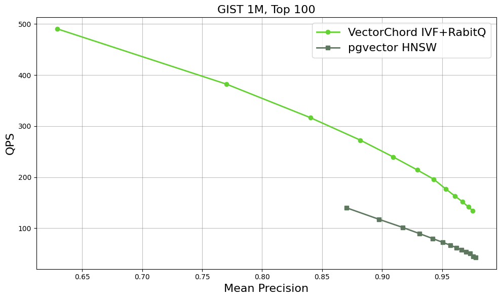
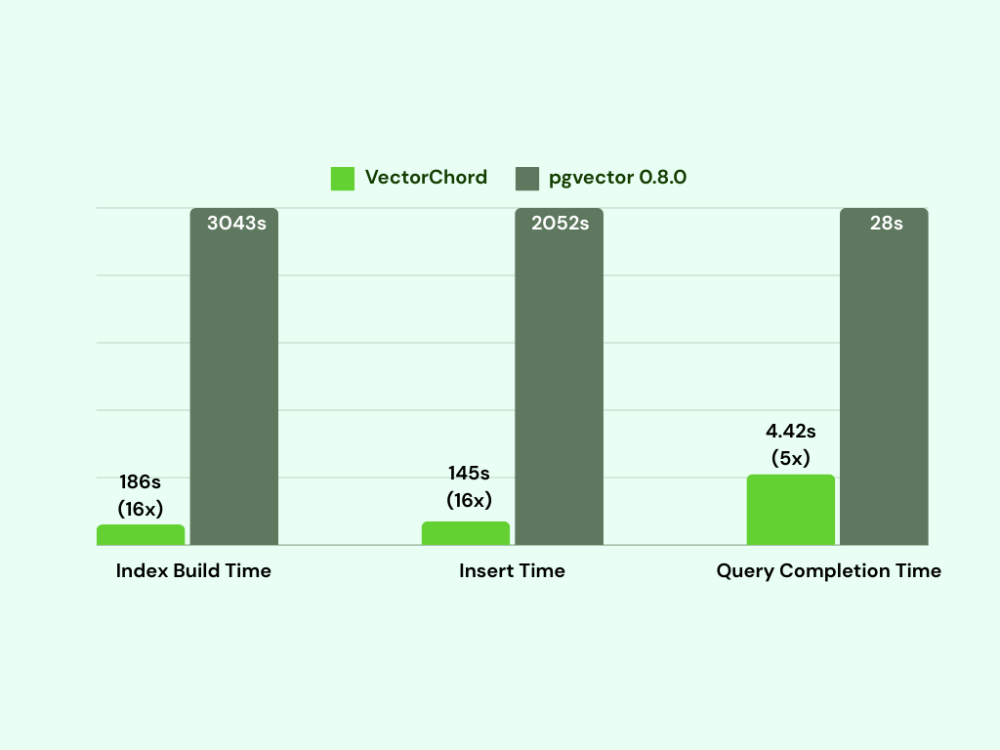
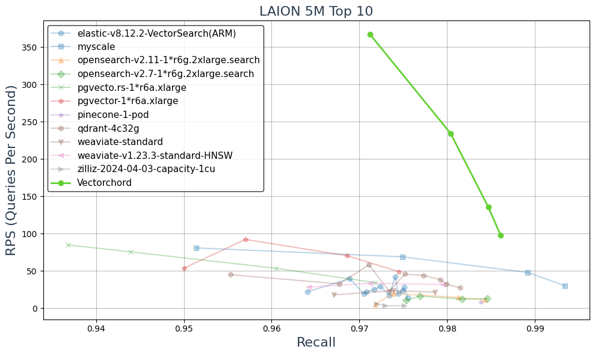
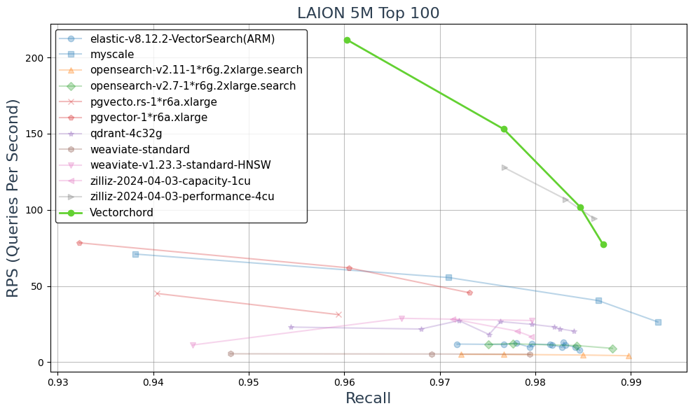

## 向量插件新贵 VectorChord(IVF+ RaBitQ量化), pgvector 和 milvus 都被秒杀了    
              
### 作者              
digoal              
              
### 日期              
2025-04-27              
              
### 标签              
PostgreSQL , PolarDB , DuckDB , VectorChord , IVF , RaBitQ , pgvector , milvus , 近似向量相似搜索 , ANNs   
              
----              
              
## 背景    
  
向量数据库的痛点. 高维稠密向量, 1百万条往上, 会遇到几重瓶颈  
- 建立索引慢  
- 查询速率变慢  
- 召回率变低  
- 消耗内存急剧增加  
  
  
VectorChord 使用如下技术很好的解决了以上问题, 达到的效果超过市面上的专业向量数据库  
- 采用RaBitQ量化, 减少计算量, 32bit -> 1bit , 提升搜索速度. 参考论文: [《AI论文解读 | 向量ANNs方法之 RaBitQ: Quantizing High-Dimensional Vectors with a Theoretical Error Bound for Approximate Nearest Neighbor Search》](../202504/20250427_01.md)   
- ranker阶段时按32bit精度计算, 提升搜索速度的同时不牺牲最终召回精度.    
- ivf 分区, 保证了build索引的速度.    
- 支持GPU, 支持外部build索引, 兼容PostgreSQL数据文件, 可直接导入.   
- 由于ivf的原理所致, 官方建议先生成ivf的中心点集群(如使用kmeans生成), 例如有几十万条数据之后再build index 效果更佳.  
    - For up to 1 million rows: rows / 1000  
    - For over 1 million rows: sqrt(rows)   
- 搜索多少个list center? 参考 https://deepwiki.com/pgvector/pgvector/4-indexing-methods
    - A good starting point for ivfflat.probes is sqrt(lists). Higher values provide better recall at the cost of speed, and it can be set to the number of lists for exact search.
  
VectorChord比对milvus, pgvector, es等产品的数据详见  
- https://blog.vectorchord.ai/vectorchord-store-400k-vectors-for-1-in-postgresql
  
更详细的VectorChord项目解读  
- https://deepwiki.com/tensorchord/VectorChord  
  
  
  
  
  
  
  
  
  
除了支持传统的向量检索, VectorChord还支持“向量数组类型”的检索   
```  
vec arr  @# vec query arr  
```  
  
该功能的场景假设:   
- 一段大文本按语义分片后成为多个小段/句子, 每个小段/句子一个向量?  
- 查询时, 将一个query分成若干个观点进行查询, 每个观点一个向量?  
  
参考: https://deepwiki.com/tensorchord/VectorChord/3.2-search-algorithm  
  
Maxsim (Maximum Similarity) Search  
  
The maxsim search operation (`@#)` computes the maximum similarity between sets of vectors. It's particularly useful for scenarios where you need to find the best matching between multiple vectors.  
  
The operation:  
- Takes two arrays of vectors as input  
- For each vector in the second array, finds the minimum distance to any vector in the first array  
- Sums these minimum distances to produce the maxsim score  
  
This is especially useful for applications like multi-vector similarity search and set similarity operations.  
  
下面使用PolarDB 15 开源版本, 测试一下VectorChord  
  
## PolarDB 15 + VectorChord  
  
测试环境使用:  
  
[《维基百科(wikipedia) RAG 优化 | PolarDB + AI》](../202504/20250417_01.md)    
  
  
部署rust    
```    
curl --proto '=https' --tlsv1.2 -sSf https://sh.rustup.rs | sh    
echo ". \"\$HOME/.cargo/env\"" >> ~/.bashrc    
. ~/.bashrc    
    
    
$ rustc --version    
rustc 1.86.0 (05f9846f8 2025-03-31)    
```    
    
配置国内镜像    
```    
echo "    
[source.crates-io]              
replace-with = 'ustc'              
              
[source.ustc]              
registry = \"sparse+https://mirrors.ustc.edu.cn/crates.io-index/\"      
" >> /home/postgres/.cargo/config.toml    
```    
    
下载VectorChord插件代码    
```    
cd /data    
git clone --depth 1 -b 0.3.0 https://github.com/tensorchord/VectorChord  
  
cd /data/VectorChord  
```    
    
编译安装VectorChord插件依赖环境    
```    
cd /data/VectorChord    
    
# pgrx 版本请参考不同版本的  Cargo.toml 文件     
cargo install --locked --version 0.13.1 cargo-pgrx        
cargo pgrx init       # create PGRX_HOME 后, 立即ctrl^c 退出            
cargo pgrx init --pg15=`which pg_config`       # 不用管报警       
    
   Validating /home/postgres/tmp_polardb_pg_15_base/bin/pg_config    
 Initializing data directory at /home/postgres/.pgrx/data-15    
```    
  
安装clang-16 + (依赖)  
```  
cd /data  
wget https://apt.llvm.org/llvm.sh  
sudo apt update  
sudo apt install lsb-release wget software-properties-common gnupg  
sudo chmod +x llvm.sh  
sudo ./llvm.sh  
```  
  
编译安装VectorChord插件    
```   
cd /data/VectorChord   
  
export CC=/usr/bin/clang-19  # Replace with the actual path  
export CXX=/usr/bin/clang++-19 # Replace with the actual path  
  
PGRX_IGNORE_RUST_VERSIONS=y cargo pgrx install --release --pg-config `which pg_config`     
```    
    
配置postgresql.conf    
```    
vi ~/primary/postgresql.conf    
    
shared_preload_libraries='vchord,pg_jieba,pg_bigm,pgml,$libdir/polar_vfs,$libdir/polar_worker'    
```    
    
重启PolarDB for postgresql    
```    
pg_ctl restart -m fast -D ~/primary    
```    
    
在数据库中安装插件    
```    
postgres=# create extension vchord;    
CREATE EXTENSION  
postgres=# \dx  
                                                       List of installed extensions  
        Name         | Version |   Schema   |                                         Description                                           
---------------------+---------+------------+---------------------------------------------------------------------------------------------  
 http                | 1.6     | public     | HTTP client for PostgreSQL, allows web page retrieval inside the database.  
 openai              | 1.0     | public     | OpenAI client.  
 pg_bigm             | 1.2     | public     | text similarity measurement and index searching based on bigrams  
 pg_bulkload         | 3.1.22  | public     | pg_bulkload is a high speed data loading utility for PostgreSQL  
 pg_jieba            | 1.1.0   | public     | a parser for full-text search of Chinese  
 pg_stat_statements  | 1.10    | public     | track planning and execution statistics of all SQL statements executed  
 pg_trgm             | 1.6     | public     | text similarity measurement and index searching based on trigrams  
 pgml                | 2.10.0  | pgml       | Machine Learning and AI functions from postgresml.org  
 pgstattuple         | 1.5     | public     | show tuple-level statistics  
 plpgsql             | 1.0     | pg_catalog | PL/pgSQL procedural language  
 plpython3u          | 1.0     | pg_catalog | PL/Python3U untrusted procedural language  
 polar_feature_utils | 1.0     | pg_catalog | PolarDB feature utilization  
 polar_vfs           | 1.0     | public     | polar virtual file system for different storage  
 sslinfo             | 1.2     | public     | information about SSL certificates  
 vchord              | 0.3.0   | public     | vchord: Vector database plugin for Postgres, written in Rust, specifically designed for LLM  
 vector              | 0.8.0   | public     | vector data type and ivfflat and hnsw access methods  
(16 rows)  
```  
  
使用举例:  
```  
CREATE TABLE items (id bigserial PRIMARY KEY, embedding vector(3));  
INSERT INTO items (embedding) SELECT ARRAY[random(), random(), random()]::real[] FROM generate_series(1, 1000);  
  
  
CREATE INDEX ON items USING vchordrq (embedding vector_l2_ops) WITH (options = $$  
residual_quantization = true  
[build.internal]  
lists = []  
$$);  
  
SET vchordrq.probes TO '';  
SELECT * FROM items ORDER BY embedding <-> '[3,1,2]' LIMIT 5;  
  
  
 id  |             embedding               
-----+-----------------------------------  
 228 | [0.9514653,0.82165444,0.98645663]  
 762 | [0.98221064,0.8921851,0.882103]  
 157 | [0.97980326,0.5610302,0.96323115]  
 963 | [0.98450637,0.5665642,0.9378539]  
  98 | [0.93809456,0.83065367,0.9353343]  
(5 rows)  
```  
  
vec数组  
```  
drop table items;  
CREATE TABLE items (embedding vector(3));  
INSERT INTO items (embedding) SELECT ARRAY[random(), random(), random()]::real[] FROM generate_series(1, 1000);  
  
CREATE INDEX ON items USING vchordrq (embedding vector_l2_ops) WITH (options = $$  
residual_quantization = true  
[build.internal]  
lists = [1000]  
spherical_centroids = false  
$$);  
  
SET vchordrq.probes = 10;  
SELECT * FROM items ORDER BY embedding <-> '[3,1,2]' LIMIT 5;  
  
             embedding                
------------------------------------  
 [0.9953359,0.916331,0.97390026]  
 [0.98834854,0.88819057,0.8903901]  
 [0.98210293,0.85718924,0.83997315]  
 [0.9161198,0.7464408,0.9253586]  
 [0.9961581,0.57789886,0.8373175]  
(5 rows)  
```  
  
更多用法参考:    
- https://docs.vectorchord.ai/reference/  
- https://docs.vectorchord.ai/vectorchord/usage/indexing.html  
  
## 参考  
- https://github.com/tensorchord/VectorChord/blob/main/sql/install/vchord--0.3.0.sql  
- https://docs.vectorchord.ai/  
- https://blog.vectorchord.ai/vectorchord-store-400k-vectors-for-1-in-postgresql  
- https://github.com/tensorchord/VectorChord  
- https://github.com/tensorchord/VectorChord-bm25  
- https://github.com/tensorchord/pg_tokenizer.rs  
  
VectorChord 的目标用户不局限于ANNs, 它还支持tokenize和rerank插件(下次分享), 云服务.    
  
  
  
  
#### [期望 PostgreSQL|开源PolarDB 增加什么功能?](https://github.com/digoal/blog/issues/76 "269ac3d1c492e938c0191101c7238216")
  
  
#### [PolarDB 开源数据库](https://openpolardb.com/home "57258f76c37864c6e6d23383d05714ea")
  
  
#### [PolarDB 学习图谱](https://www.aliyun.com/database/openpolardb/activity "8642f60e04ed0c814bf9cb9677976bd4")
  
  
#### [PostgreSQL 解决方案集合](../201706/20170601_02.md "40cff096e9ed7122c512b35d8561d9c8")
  
  
#### [德哥 / digoal's Github - 公益是一辈子的事.](https://github.com/digoal/blog/blob/master/README.md "22709685feb7cab07d30f30387f0a9ae")
  
  
#### [About 德哥](https://github.com/digoal/blog/blob/master/me/readme.md "a37735981e7704886ffd590565582dd0")
  
  

  
