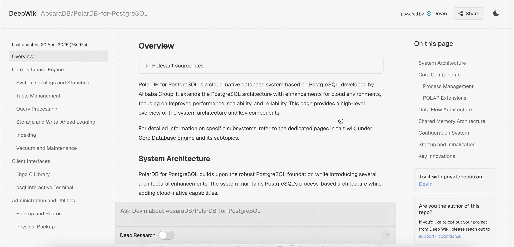
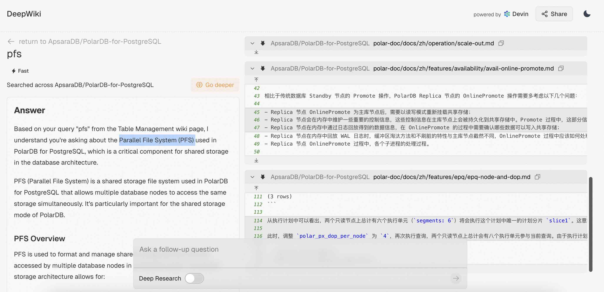
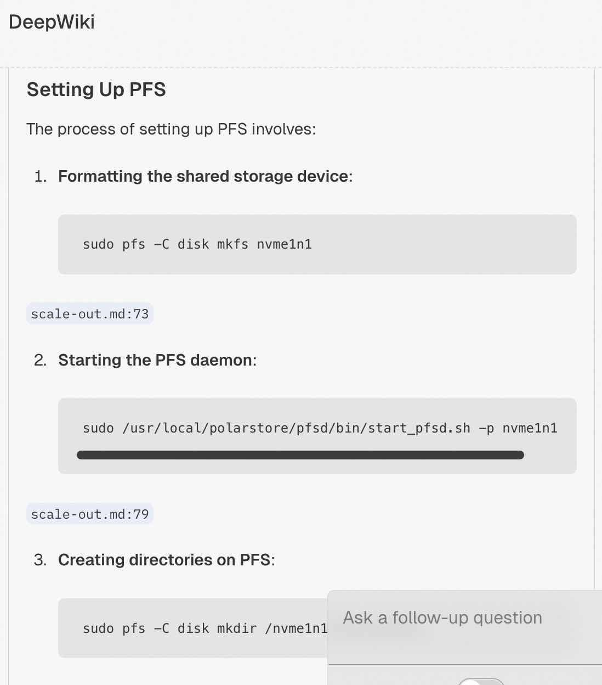
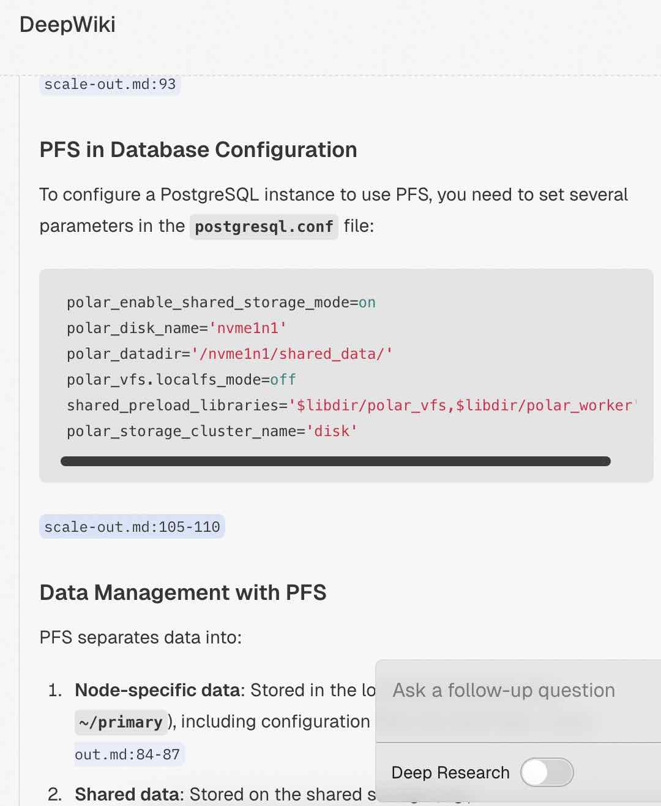
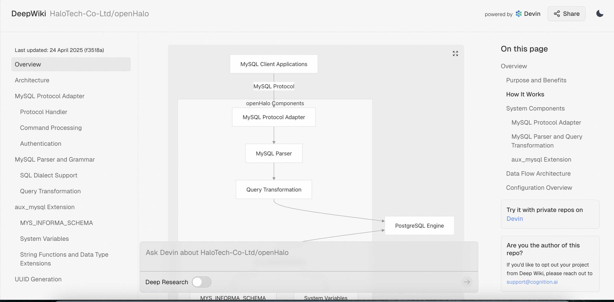
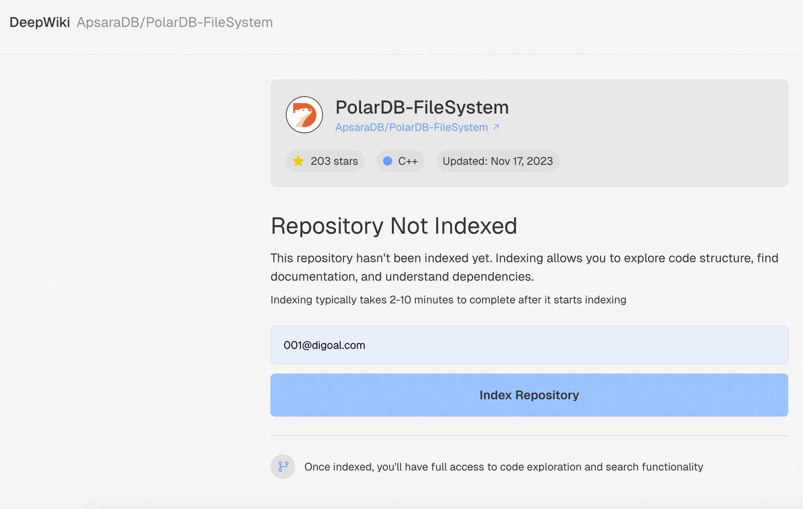

## 掀桌子了, 人人都是内核大佬: DeepWiKi 解读一切代码   
                        
### 作者                        
digoal                        
                        
### 日期                        
2025-04-27                       
                        
### 标签                        
PostgreSQL , PolarDB , DuckDB , 内核 , 解读 , AI , 生成 , 文档 , deepwiki , devin         
                        
----                        
                        
## 背景    
掀桌子了, 人人都是内核大佬: DeepWiKi 解读一切代码   
  
https://deepwiki.com   
  
  
deepwiki 简直好用爆了, 基于开源项目代码生成的文档非常详细, 核心观点都有指出对应的代码文件是哪个, 通过这些文件的哪些行所生成的.   
  
例如PolarDB的代码如下  
  
https://deepwiki.com/ApsaraDB/PolarDB-for-PostgreSQL  
  
  
  
也可以向deepwiki提问, 瞬间总结你想要的内容, 同样关键内容都会附上对应的代码文件是哪个, 通过这些文件的哪些行所生成的. 准确度极高.   
  
  
  
  
  
  
  
再看一个近期开源的openHalo项目, 也被收录了.   
  
https://deepwiki.com/HaloTech-Co-Ltd/openHalo   
  
  
  
如果你想要了解的开源项目还没有生成索引, 提交即可, 等待几分钟就有了. 例如PolarDB的关键组建PFS就没有收录, 需要提交生成.    
  
https://deepwiki.com/ApsaraDB/PolarDB-FileSystem  
  
  
  
  
有了deepwiki, 阅读代码的门槛又降低了, <b> 不过也可能会带来一个小问题, 抄袭变得容易了. 核心代码开放出来后, 估计很快就可能被友商拿去解读复刻. </b>   
   
一不小心我的github项目也被index了, 比我还了解我自己.  
- https://deepwiki.com/digoal/blog   
   
  
## 再爆个猛料 , AI 码农上线 : devin   
deepwiki 这么好用, 背后是 devin .   
  
https://docs.devin.ai/get-started/devin-intro  
  
https://devin.ai/  
  
https://cognition.ai/  
  
**Devin AI 简介：**  
  
*   **Devin 是什么？** Devin 被描述为一个 **AI 软件工程师**。它旨在帮助开发者自动化软件开发任务，例如：  
    *   **计划和执行复杂的工程任务：** Devin 可以理解复杂的指令，并将其分解为可执行的步骤。  
    *   **学习不熟悉的技术：** Devin 可以自主学习新的技术栈和框架。  
    *   **端到端构建和部署应用程序：** Devin 可以独立地完成从代码编写到部署的整个过程。  
    *   **修复错误和改进代码：** Devin 可以识别代码中的错误，并提出修复建议或自动修复。  
    *   **参与代码审查：** Devin 可以参与代码审查，并提供有价值的反馈。  
    *   **训练和微调 AI 模型：** Devin 可以帮助训练和微调 AI 模型。  
  
*   **Devin 的目标：** Devin 的目标是 **加速创新**，让开发者能够专注于更具创造性和战略性的任务，而将重复性和耗时的任务交给 Devin 处理。  
  
*   **Devin 的工作方式：** Devin 拥有自己的 **shell、代码编辑器和浏览器**，可以在一个受控的环境中工作。它能够自主地进行搜索、阅读文档、编写代码和测试代码。  
  
**如何开始使用 Devin：**  
  
*   **访问权限：** 目前，Devin 处于 **早期访问阶段**，需要申请才能使用。  
*   **申请流程：** 文档中提供了申请访问权限的链接。  
*   **文档内容：** 该文档还提供了其他有用的信息，例如：  
    *   Devin 的功能和特性  
    *   Devin 的使用案例  
    *   常见问题解答  
    *   API 文档（如果可用）  
  
## 解读内核这件事还有意义吗  
  
我的AI辅助 PolarDB内核学习系列已经发布了55期, 被 deepwiki 掀桌子了, 还有解读下去的必要吗?  
  
甚至还有读内核代码的必要吗?    
  
AI 码农都上线了耶.     
  
你的竞争对手变成AI了.     
  
不过我还是坚持, 如果你的工作与之相关, 退一万步, 基本的还是要掌握, 否则容易鸡同鸭讲, 你都不知道怎么用好AI来实现你的需求, 你也不知道AI是对是错, 是不是忽悠你.    
  
- [《AI辅助 PolarDB内核学习 - 55 执行器 (Executor) 核心代码 execProcnode.c 解读》](../202504/20250414_03.md)    
- [《AI辅助 PolarDB内核学习 - 54 执行器 (Executor) 入口点代码 execMain.c 解读》](../202504/20250414_02.md)    
- [《AI辅助 PolarDB内核学习 - 53 执行器 (Executor) 概览》](../202504/20250414_01.md)    
- [《AI辅助 PolarDB内核学习 - 52 优化器辅助功能模块(util) 核心代码 var.c》](../202504/20250410_04.md)    
- [《AI辅助 PolarDB内核学习 - 51 优化器辅助功能模块(util) 核心代码 tlist.c》](../202504/20250410_03.md)    
- [《AI辅助 PolarDB内核学习 - 50 优化器辅助功能模块(util) 核心代码 restrictinfo.c》](../202504/20250410_02.md)    
- [《AI辅助 PolarDB内核学习 - 49 优化器辅助功能模块(util) 核心代码 relnode.c》](../202504/20250410_01.md)    
- [《AI辅助 PolarDB内核学习 - 48 优化器辅助功能模块(util) 核心代码 predtest.c》](../202504/20250408_11.md)    
- [《AI辅助 PolarDB内核学习 - 47 优化器辅助功能模块(util) 核心代码 plancat.c》](../202504/20250408_07.md)    
- [《AI辅助 PolarDB内核学习 - 46 优化器辅助功能模块(util) 核心代码 placeholder.c》](../202504/20250408_06.md)    
- [《AI辅助 PolarDB内核学习 - 45 优化器辅助功能模块(util) 核心代码 pathnode.c》](../202504/20250408_05.md)    
- [《AI辅助 PolarDB内核学习 - 44 优化器辅助功能模块(util) 核心代码 paramassign.c》](../202504/20250408_04.md)    
- [《AI辅助 PolarDB内核学习 - 43 优化器辅助功能模块(util) 核心代码 orclauses.c》](../202504/20250408_03.md)    
- [《AI辅助 PolarDB内核学习 - 42 优化器辅助功能模块(util) 核心代码 joininfo.c》](../202504/20250407_10.md)    
- [《AI辅助 PolarDB内核学习 - 41 优化器辅助功能模块(util) 核心代码 inherit.c》](../202504/20250407_09.md)    
- [《AI辅助 PolarDB内核学习 - 40 优化器辅助功能模块(util) 核心代码 clauses.c》](../202504/20250407_08.md)    
- [《AI辅助 PolarDB内核学习 - 39 优化器辅助功能模块(util) 核心代码 appendinfo.c》](../202504/20250407_07.md)    
- [《AI辅助 PolarDB内核学习 - 38 优化器辅助功能模块(util) 概览》](../202504/20250407_06.md)    
- [《AI辅助 PolarDB内核学习 - 37 优化器解析树预处理模块(prep) 核心代码 prepunion.c》](../202504/20250407_05.md)    
- [《AI辅助 PolarDB内核学习 - 36 优化器解析树预处理模块(prep) 核心代码 preptlist.c》](../202504/20250407_04.md)    
- [《AI辅助 PolarDB内核学习 - 35 优化器解析树预处理模块(prep) 核心代码 prepqual.c》](../202504/20250407_03.md)    
- [《AI辅助 PolarDB内核学习 - 34 优化器解析树预处理模块(prep) 核心代码 prepjointree.c》](../202504/20250407_02.md)    
- [《AI辅助 PolarDB内核学习 - 33 优化器解析树预处理模块(prep) 核心代码 planagg.c》](../202504/20250407_01.md)    
- [《AI辅助 PolarDB内核学习 - 32 优化器解析树预处理模块(prep) 概览》](../202504/20250403_04.md)    
- [《AI辅助 PolarDB内核学习 - 31 优化器(plan模块) 核心模块 planagg.c》](../202504/20250402_10.md)    
- [《AI辅助 PolarDB内核学习 - 30 优化器(plan模块) 核心模块 subselect.c》](../202504/20250402_09.md)    
- [《AI辅助 PolarDB内核学习 - 29 优化器(plan模块) 核心模块 setrefs.c》](../202504/20250402_08.md)    
- [《AI辅助 PolarDB内核学习 - 28 优化器(plan模块) 核心模块 createplan.c》](../202504/20250402_07.md)    
- [《AI辅助 PolarDB内核学习 - 27 优化器(plan模块) 核心模块 analyzejoins.c》](../202504/20250402_06.md)    
- [《AI辅助 PolarDB内核学习 - 26 优化器(plan模块) 核心模块 initsplan.c》](../202504/20250402_05.md)    
- [《AI辅助 PolarDB内核学习 - 25 优化器(plan模块) 核心模块 planmain.c》](../202504/20250402_04.md)    
- [《AI辅助 PolarDB内核学习 - 24 优化器(plan模块) 入口代码 planner.c》](../202504/20250402_03.md)    
- [《AI辅助 PolarDB内核学习 - 23 优化器plan模块概览》](../202504/20250402_02.md)    
- [《AI辅助 PolarDB内核学习 - 22 多表JOIN优化 之 geqo(遗传算法)》](../202504/20250402_01.md)    
- [《AI辅助 PolarDB内核学习 - 21 path(路径生成) 之 路径排序信息(pathkeys.c)代码》](../202503/20250328_06.md)    
- [《AI辅助 PolarDB内核学习 - 20 path(路径生成) 之 TID扫描路径优化(tidpath.c)代码》](../202503/20250328_05.md)    
- [《AI辅助 PolarDB内核学习 - 19 path(路径生成) 之 连接对象(joinrels.c)代码》](../202503/20250328_04.md)    
- [《AI辅助 PolarDB内核学习 - 18 path(路径生成) 之 连接路径生成(joinpath.c)代码》](../202503/20250328_03.md)    
- [《AI辅助 PolarDB内核学习 - 17 path(路径生成) 之 索引路径生成(indxpath.c)代码》](../202503/20250328_02.md)    
- [《AI辅助 PolarDB内核学习 - 16 path(路径生成) 之 等价类(equivclass.c)代码》](../202503/20250327_06.md)    
- [《AI辅助 PolarDB内核学习 - 15 path(路径生成) 之 估算路径成本(costsize.c)代码》](../202503/20250321_03.md)    
- [《AI辅助 PolarDB内核学习 - 14 path(路径生成) 之 选择性(clausesel.c)代码》](../202503/20250314_05.md)    
- [《AI辅助 PolarDB内核学习 - 13 path (路径生成)代码概览》](../202503/20250314_04.md)    
- [《AI辅助 PolarDB内核学习 - 12 optimizer 概览 (优化器的工作原理)》](../202503/20250310_02.md)    
- [《AI辅助 PolarDB内核学习 - 11 rewrite (SQL规则重写器)》](../202503/20250307_01.md)    
- [《AI辅助 PolarDB内核学习 - 10 如何分析内核态和用户态性能瓶颈》](../202503/20250305_02.md)    
- [《AI辅助 PolarDB内核学习 - 9 parser SQL解析器》](../202503/20250304_05.md)    
- [《AI辅助 PolarDB内核学习 - 8 tcop (Traffic cop) 用户请求指挥官》](../202503/20250304_04.md)    
- [《AI辅助 PolarDB内核学习 - 7 libpq代码总览》](../202503/20250303_02.md)    
- [《AI辅助 PolarDB内核学习 - 6 解读PolarDB PostgreSQL 15 bootstrap.c》](../202502/20250227_02.md)    
- [《AI辅助 PolarDB内核学习 - 5 解读PolarDB PostgreSQL 15 postmaster的入口点`PostmasterMain`函数》](../202502/20250224_05.md)    
- [《AI辅助 PolarDB内核学习 - 4 解读入口点代码`main.c`》](../202502/20250224_04.md)    
- [《AI辅助 PolarDB内核学习 - 3 git + AI 解读patch》](../202502/20250220_05.md)    
- [《AI辅助 PolarDB内核学习 - 2 用doxygen生成PolarDB代码逻辑和结构图》](../202502/20250217_02.md)    
- [《AI辅助 PolarDB内核学习 - 1 如何快速对比 PolarDB 和 PostgreSQL 的代码差异》](../202502/20250217_01.md)    
  
## 参考  
  
https://deepwiki.com   
  
https://docs.devin.ai/get-started/devin-intro  
  
https://devin.ai/  
  
https://cognition.ai/  
  
  
#### [期望 PostgreSQL|开源PolarDB 增加什么功能?](https://github.com/digoal/blog/issues/76 "269ac3d1c492e938c0191101c7238216")
  
  
#### [PolarDB 开源数据库](https://openpolardb.com/home "57258f76c37864c6e6d23383d05714ea")
  
  
#### [PolarDB 学习图谱](https://www.aliyun.com/database/openpolardb/activity "8642f60e04ed0c814bf9cb9677976bd4")
  
  
#### [PostgreSQL 解决方案集合](../201706/20170601_02.md "40cff096e9ed7122c512b35d8561d9c8")
  
  
#### [德哥 / digoal's Github - 公益是一辈子的事.](https://github.com/digoal/blog/blob/master/README.md "22709685feb7cab07d30f30387f0a9ae")
  
  
#### [About 德哥](https://github.com/digoal/blog/blob/master/me/readme.md "a37735981e7704886ffd590565582dd0")
  
  

  
