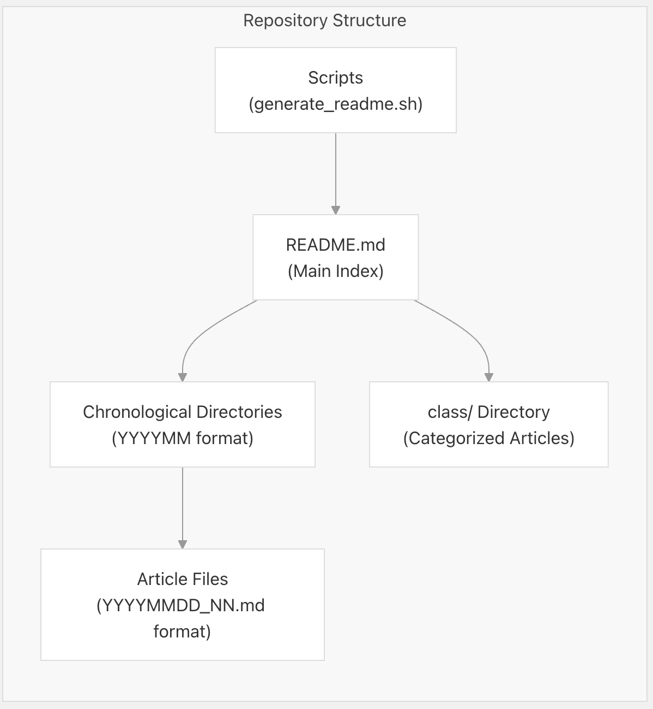
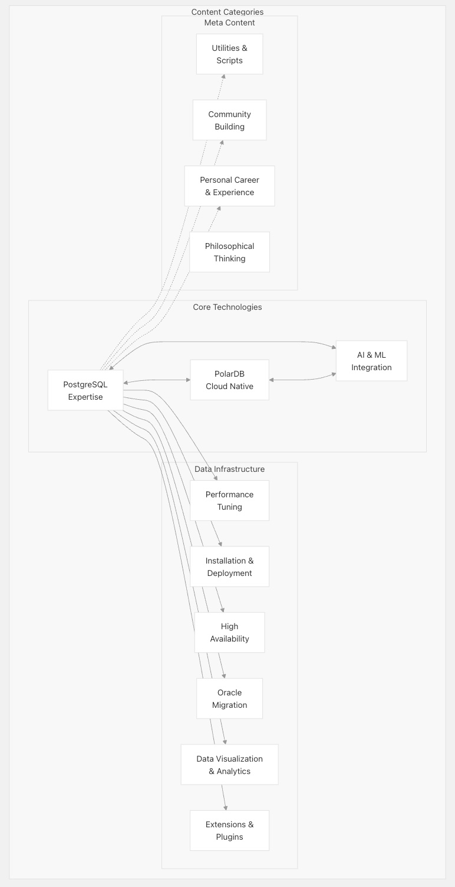
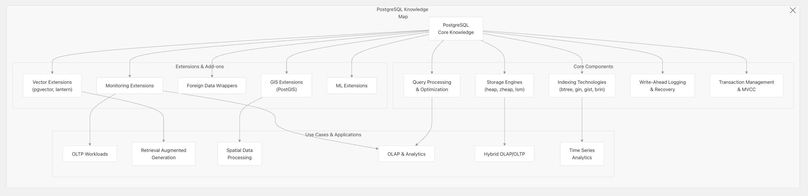
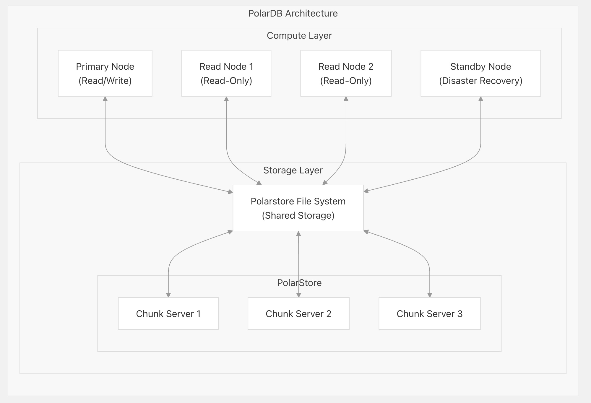
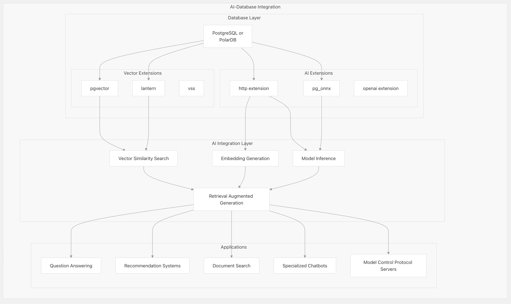
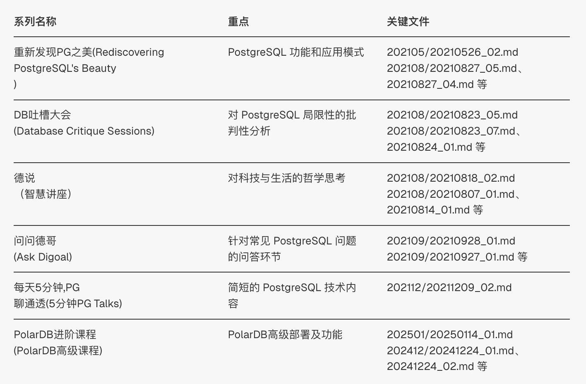
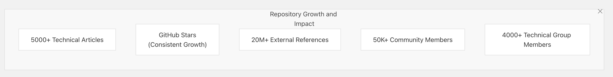

## 我的简历, 请惠存  
                          
### 作者                          
digoal                          
                          
### 日期                          
2025-04-27                         
                          
### 标签                          
PostgreSQL , PolarDB , DuckDB , AI , 开源项目解读 , 简历 , blog , digoal   
                          
----                          
                          
## 背景    
这是deepwiki AI根据我写了十多年的开源项目`https://github/digoal/blog`生成的项目介绍(`堪称个人简历`), 比自己写的更客观更靠谱! 请大佬惠存.   
  
详细内容: <b>https://deepwiki.com/digoal/blog</b>  
  
deepwiki是啥? 搞技术特别是搞开源的人可一定要了解一下! [《掀桌子了, 人人都是内核大佬: DeepWiKi 解读一切代码》](../202504/20250427_03.md)    
  
这才是我自己写的: https://github.com/digoal/blog/blob/master/me/readme.md  
  
   
# AI生成的简历正文开始  
  
本文档介绍了 digoal 的博客库，这是一个全面的文章、教程和技术资源库，主要关注 PostgreSQL、PolarDB 和相关数据库技术。该库包含 5,000 多篇文章，涵盖从核心数据库功能到高级 AI 集成和云原生实现等主题，内容涵盖 2015 年至今。    
    
本页介绍了存储库的组织结构、内容类别以及如何浏览丰富的知识库。有关 PostgreSQL 功能的具体信息，请参阅PostgreSQL 核心。有关 PolarDB 的详细信息，请参阅PolarDB。有关 AI 集成的主题，请参阅AI 集成。    
    
## 存储库结构和组织    
    
该存储库按时间顺序组织，文章文件存储在按年/月排序的文件夹中（格式：YYYYMM）。主 README.md 文件作为综合索引，提供指向关键学习资源、视频集和思考文章的链接。存储库还包含包含分类文章的类别目录，但大多数内容仍按时间顺序排列。    
    
  
    
## 内容类别    
    
该存储库内容涵盖三大领域：核心数据库技术、数据基础设施组件以及有关社区建设和个人发展的元内容。    
    
  
    
该存储库包含不同的内容系列，包括：    
- 技术深度探讨（“重新发现PG之美” - Rediscovering PostgreSQL's Beauty）    
- 批判性讨论（“DB吐槽大会” - Database Critique Sessions）    
- 哲学反思（“德说”-Wisdom Talks）    
- 问答环节（“问德哥” - Ask Digoal）    
    
随着时间的推移，技术内容发生了显著的变化，反映了数据库格局的变化：    
    
时期	| 主要关注领域    
---|---    
2016-2018	|PostgreSQL 核心功能、高可用性、性能调优、空间数据    
2019-2020	|分片与扩展、Oracle 迁移、HTAP 工作负载、扩展开发    
2021-2022	|PolarDB 架构、容器化、云原生特性、社区建设    
2023-2024	|人工智能集成、矢量搜索、RAG 系统、现代存储格式    
    
## PostgreSQL 专业知识    
    
PostgreSQL 构成了存储库技术内容的基础，涵盖了从核心内部到高级用例和优化的所有内容。    
    
   
    
涉及的关键 PostgreSQL 主题包括：    
    
1、性能优化和调优    
- 索引设计和使用策略    
- 查询优化技术    
- 配置参数调整    
- 基准测试方法    
    
2、高可用性和复制    
- 流复制设置    
- 逻辑复制    
- 故障转移机制    
- 使用 pgpool-II 的连接池    
    
3、数据库管理    
- 安装和配置    
- 备份和恢复    
- 监控和故障排除    
- 安全和访问控制    
    
4、迁移策略    
- Oracle 到 PostgreSQL 的迁移技术    
- MySQL 兼容性注意事项    
- 模式转换策略    
- 应用程序适配模式    
    
## PolarDB 与云原生数据库    
    
PolarDB 是阿里巴巴的云原生 PostgreSQL 兼容数据库，受到了广泛报道，尤其是其架构、部署模型和性能特征。    
    
  
    
PolarDB 的关键主题包括：    
    
1、架构和组件    
- 共享存储架构    
- 计算和存储分离    
- 读/写分离机制    
- 跨区域部署    
    
2、部署和管理    
- 基于容器的部署    
- 高可用性配置    
- 备份和恢复过程    
- 监控和性能优化    
    
3、实用教程    
- 《穷鬼玩PolarDB RAC一写多读集群》系列    
- 基于 Docker 的演示环境    
- 与扩展和插件集成    
- 从传统 PostgreSQL 迁移    
    
4、高级功能    
- PolarDB 特有的优化    
- 矢量数据库功能    
- 人工智能集成模式    
- 分布式查询处理    
    
## 人工智能与数据库集成    
    
最近的内容主要集中在 PostgreSQL 和 PolarDB 的 AI 集成上，涵盖矢量数据库、RAG 系统和 LLM 集成模式。    
    
  
    
关键的人工智能集成主题包括：    
    
1、矢量数据库扩展    
- pgvector 实现与优化    
- 灯笼和其他矢量搜索扩展    
- 索引类型和搜索算法    
- 嵌入存储模式    
    
2、检索增强生成（RAG）    
- 采用 PostgreSQL/PolarDB 的 RAG 架构    
- 维基百科 RAG 优化示例    
- 效率考虑和调整    
- RAG 系统的数据预处理    
    
3、模型控制协议（MCP）    
- MCP 服务器实现模式    
- 与 PolarDB 和 PostgreSQL 集成    
- Cursor AI 代理连接    
- OpenAI 和其他 LLM 服务的扩展    
    
4、微调和模型训练    
- 使用数据库数据进行微调    
- PostgreSQL 和 MLX 集成    
- 数据准备技术    
- 模型评估和服务    
    
## 社区建设和思想领导力    
    
“德说”系列和其他元内容反映了社区建设、产品开发、哲学概念和个人发展。    
    
主要主题包括：    
    
1、PostgreSQL 社区发展    
- 社区建设策略    
- 活动组织最佳实践    
- 开发人员参与模式    
- 生态系统增长方法    
    
2、开源哲学    
- 开源的商业模式    
- 贡献模式和激励措施    
- 开源开发原则    
- 商业与社区动态    
    
3、团队和个人发展    
- 领导原则    
- 技术专长发展    
- 数据库专业人员的职业指导    
- OKR和目标设定框架    
    
4、行业分析    
- 数据库市场趋势    
- 竞争分析    
- 技术采用模式    
- 未来方向预测    
    
    
## 教育资源    
    
该存储库包含大量教育资源，包括：    
    
1、视频讲座和课程    
- PostgreSQL 和 Greenplum 学习视频    
- 《重新发现PG之美》系列    
- “DB吐槽大会”（Database Critique Sessions）系列    
- 《每天5分钟，PG聊通透》（5分钟PG谈）系列    
    
2、教程系列    
- 快速入门 PostgreSQL 应用程序开发指南    
- PostgreSQL DBA培训材料    
- PolarDB部署与管理教程    
- Oracle 到 PostgreSQL 迁移指南    
    
3、Docker 学习环境    
- 预装插件的 PostgreSQL Docker 镜像    
- ARM64 和 AMD64 版本    
- PolarDB演示环境    
- 开发和测试配置    
    
4、最佳实践和参考资料    
- PostgreSQL 数据库安全指南    
- 开发标准和惯例    
- 性能优化技术    
- PostgreSQL 和 PolarDB DBA 常见 SQL 查询    
    
    
## 技术文档系列    
    
几个长期文档系列提供了结构化的学习路径：    
    
  
    
## 个人贡献和背景    
    
该仓库作者 digoal（德哥）对 PostgreSQL 社区做出了重大贡献：    
    
1、专业经验    
- 阿里云数据库团队（2015年至今）    
- 担任多种 PostgreSQL 相关产品的技术主管    
- PostgreSQL中国社区联合创始人    
- 40多项数据库专利的作者    
    
2、社区活动    
- 定期会议发言人和组织者    
- 企业及社区技术培训师    
- 跨多个平台的内容创作者    
- 倡导采用开源数据库    
    
3、技术内容制作    
- 5000多篇技术文章    
- 视频课程和教程    
- 书籍和培训材料    
- 在线社区参与    
    
## 存储库统计和增长    
    
该存储库一直在持续增长，反映了 PostgreSQL 在数据库生态系统中的持续相关性和发展。    
    
  
    
## 结论    
    
digoal/blog 仓库是一个涵盖 PostgreSQL、PolarDB 及相关数据库技术的综合知识库，目前正日益关注 AI 集成和云原生实现。虽然按时间顺序排列的文档在浏览特定主题时可能并非最直观，但它保留了数据库技术随时间推移的演变，并反映了作者在数据库工程和社区建设各个方面的经验。    
    
此存储库对于以下方面特别有价值：    
- 寻求实用 PostgreSQL 知识的数据库管理员    
- 开发人员实现基于 PostgreSQL 的应用程序    
- 考虑迁移到 PostgreSQL 或 PolarDB 的组织    
- 任何对数据库和人工智能交叉领域感兴趣的人    
- 社区建设者和开源倡导者    
    
技术内容、哲学思考和社区建设见解的结合使得这个存储库不仅仅是一个技术资源，它还反映了致力于开源数据库技术进步的职业生涯。    
    
  
#### [期望 PostgreSQL|开源PolarDB 增加什么功能?](https://github.com/digoal/blog/issues/76 "269ac3d1c492e938c0191101c7238216")
  
  
#### [PolarDB 开源数据库](https://openpolardb.com/home "57258f76c37864c6e6d23383d05714ea")
  
  
#### [PolarDB 学习图谱](https://www.aliyun.com/database/openpolardb/activity "8642f60e04ed0c814bf9cb9677976bd4")
  
  
#### [PostgreSQL 解决方案集合](../201706/20170601_02.md "40cff096e9ed7122c512b35d8561d9c8")
  
  
#### [德哥 / digoal's Github - 公益是一辈子的事.](https://github.com/digoal/blog/blob/master/README.md "22709685feb7cab07d30f30387f0a9ae")
  
  
#### [About 德哥](https://github.com/digoal/blog/blob/master/me/readme.md "a37735981e7704886ffd590565582dd0")
  
  

  
