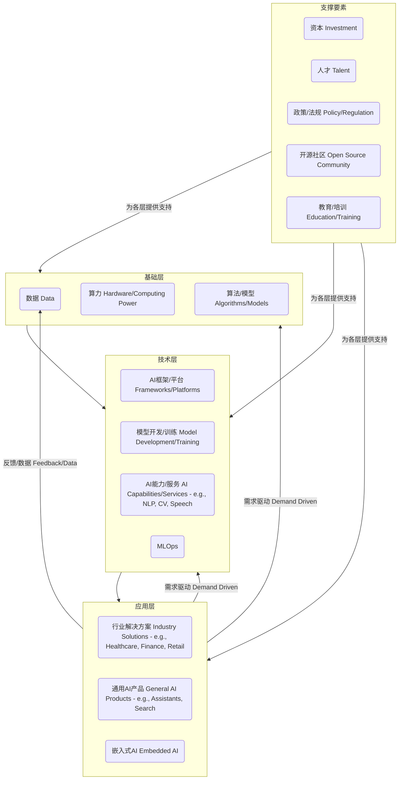
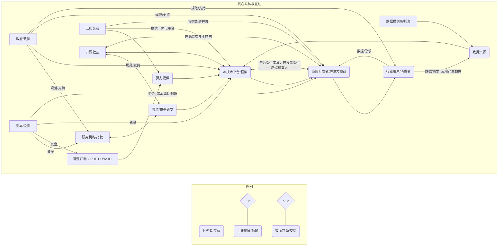

## 德说-第331期, tongyi的竞争对手是谁?     
                      
### 作者                      
digoal                      
                      
### 日期                      
2025-04-29                     
                      
### 标签                      
PostgreSQL , PolarDB , DuckDB , 竞争对手分析    
                      
----                      
                      
## 背景    
  
我在 [《德说-第327期, MySQL认证免费了, 它的“阴谋”是什么?》](../202504/20250425_04.md)   这篇文章中提到了一个观点:   
  
商业产品赚你的钱.     
- 这个不用多解释了, 钱被你赚了, 友商赚的就少了. 市场空间有限, 零和博弈.       
    
免费产品赚你的时间.     
- 比如开源的产品, 你是没付钱, 但是你得付出时间吧, 学习、维护等等. 用时间来衡量市场空间也是有限的, 时间被你赚了, 友商赚的就少了.     
    
  
在 [《德说-第319期, 这些问题回答不清, 开源很难持久!》](../202504/20250401_03.md)  这篇文章中则提出了开源的最终目的的讨论.    
  
综合上两篇文章的观点, 要回答“tongyi的竞争对手是谁”这个问题, 可以切成以下2个方面.    
- 从tongyi手中抢钱的主要对手   
- 从tongyi手中抢用户使用时间(且与aliyun无商业交集)的主要对手   
  
  
1、抢钱 的主要对手   
  
首先要看清tongyi的商业模式  
- api服务费  
- 云资源费 qwen的背后是aliyun, 所以云资源也是变现手段, 虽然链路更长一点, 这里包括:   
    - 客户部署在云端的私有llm服务, 可能包含私有化部署例如apple 这种现象级用户  
    - 客户使用的在云端的saas产品(tongyi llm inside), 例如灵码、万相、法睿等  
- 推理芯片(硬件)可单独售卖也可封装到云资源里  
  
有个有意思的地方是, tongyi是llm, 但是云资源和推理芯片并不独属于tongyi的llm, 例如云上的model scope里可以有第三方llm, 推理芯片也可以被第三方llm使用.     
  
主要对手    
- 其他模型API服务商, 主要来自商业模型: openai, google gemini    
- 会导致用户在其他云厂商/线下私有化部署大量llm应用的对手    
- 推理芯片厂商    
  
  
2、抢时间 (且与aliyun无商业交集) 的主要对手    
  
包含免费和付费使用.    
  
有希望成为流量入口级别的产品, 并且与aliyun无商业交集, 都选择自建并使用自己的模型.  例如     
- gpt, gemini  
- 流量软件入口: 例如微信/抖音这类流量现象级产品背后开的入口/带动的新应用  
- 行业应用软件入口: 例如程序员日常的Anthropic、Cohere; 以及其他行业应用软件  
- 端设备植入: 如手机、汽车  
   
如何布局流量入口?  
- API, 链接所有通过API接入的应用
- 开源, 链接所有自建LLM的应用
- 自有应用, 链接所有最终用户. 例如 [AI agent scope](https://github.com/modelscope/agentscope), [AI agent](https://github.com/QwenLM/Qwen-Agent), [chat](https://chat.qwen.ai/auth) , [灵码](https://lingma.aliyun.com/lingma), [万相](https://tongyi.aliyun.com/wanxiang/), [法睿](https://tongyi.aliyun.com/farui) 等 
  
3、你可能会问, deepseek是吗?    
  
请回答3个问题:    
  
deepseek抢tongyi钱了吗?   
  
deepseek抢tongyi时间了吗?   
  
deepseek抢tongyi时间的用户里, 有多少比例与aliyun无商业交集(不使用aliyun、不使用aliyun推理芯片、...)?    
   
4、Qwen开源的目的是什么?   
- 用户、用户还是用户. 背后指向的是规模/市场占有率.    
    
不过开源的时机非常重要. 如果是一个已经有其他开源产品充分占有市场的格局, 除非你开出来的是个代差10倍以上的原子弹级别的产品(而且不容易被模仿), 否则这个情况下开源就是打水漂, 不可能引起用户的广泛注意.   
    
Qwen开源时开源LLM的市场格局是大家基本上都在一个起跑线上. 并且想用开源的无非就是想自建LLM的用户, 但是当前能打的模型都是参数量巨大(600B+)的, 对硬件要求极高, 在GPU卡紧张的背景下, 硬件基本上百万起步, 而且这还没有考虑到并发的情况. 所以当前开源模型没有私有化部署的实用价值. qwen选择了以小参数量博高性能(对标顶级模型)的策略, 完美解决了当前私有化部署用户痛点.  这是qwen开源后风靡全球的重要原因, 就像电影《泰囧》里的油霸, 滴一滴后加1升油能跑1000公里, 卖油的会不会跟你拼命不知道, 但用户肯定是爽爆了.     
   
有了规模之后, 自然就会对商业版本/api带来正面的转化影响.  转化是顺水推舟的事情, 未来云上发布更高端的版本、甚至是专门针对硬件优化过的版本也不是不可能(云上谈的还是性价比、弹性等话题).  
     
## 附: AI相关产业结构
介绍一下AI相关的产业结构, 包括生态链、网状结构、依存关系, 使用markdown可表达的图来增加可读性   
   
好的，我们来介绍一下人工智能（AI）相关的产业结构。AI产业是一个复杂且快速发展的领域，其结构可以从多个维度来理解，包括生态链、网状结构和依存关系。

### AI产业结构概述

AI产业的核心是将数据、算法和算力结合起来，创造出能够模拟人类智能的技术和应用，并将其应用于各个行业和社会领域。其结构并非简单的线性链条，而是一个相互交织、相互依赖的复杂网络。

### 1. AI产业生态链（分层结构）

我们可以将AI产业大致分为几个核心层次，形成一个从基础到应用的生态链条：

**解释:**

1.  **基础层 (Foundation Layer):** 这是AI产业的基石。
    * **数据:** AI的“燃料”，包括数据的采集、标注、清洗、存储和管理。数据质量和数量直接影响AI模型的性能。
    * **算力:** 提供计算资源，主要是指高性能芯片（如GPU、TPU、NPU/ASIC）和云计算平台，用于训练和运行复杂的AI模型。
    * **算法/模型:** 基础的机器学习、深度学习算法和核心模型架构的研究与开发。

2.  **技术层 (Technology Layer):** 在基础层之上，构建具体的AI技术和平台。
    * **AI框架/平台:** 如TensorFlow, PyTorch, Keras等开发框架，以及提供模型训练、部署、管理服务的云平台（如AWS SageMaker, Google AI Platform, Azure Machine Learning）。
    * **模型开发/训练:** 利用框架和数据训练特定任务的模型。
    * **AI能力/服务:** 将成熟的AI技术封装成服务，如自然语言处理（NLP）、计算机视觉（CV）、语音识别/合成等API或SDK。
    * **MLOps (Machine Learning Operations):** 确保AI模型开发、部署和运维流程化、自动化的工具和实践。

3.  **应用层 (Application Layer):** 将AI技术应用于具体场景，创造商业价值和社会价值。
    * **行业解决方案:** 针对特定行业（金融、医疗、制造、零售、交通等）的痛点，提供定制化的AI解决方案（如智能风控、医疗影像分析、智能制造、智能客服、自动驾驶）。
    * **通用AI产品:** 面向广泛用户的AI产品（如智能助手、推荐系统、AI驱动的搜索引擎、翻译软件）。
    * **嵌入式AI:** 将AI能力集成到硬件设备中（如智能手机、智能家居设备、机器人）。

4.  **支撑要素 (Supporting Elements):** 这些要素贯穿整个产业链，为AI发展提供动力和保障。包括资本投入、专业人才、政府政策支持、活跃的开源社区、以及相关的教育和培训体系。

### 2. 网状结构 (Network Structure)

AI产业并非严格的上下游线性关系，更像一个**网状结构**。各个层级和参与者之间存在多向互动和复杂的连接：

* **技术驱动创新:** 基础层的突破（如新的算法、更强的芯片）会推动技术层和应用层的创新。
* **应用反哺基础:** 应用层产生的数据和场景需求，会反馈给基础层和技术层，促进算法优化、数据积累和算力提升。例如，自动驾驶产生的大量数据用于改进感知和决策模型。
* **跨界融合:** AI技术与其他技术（如物联网IoT、大数据、云计算、5G、区块链）深度融合，催生新的应用模式。
* **平台化趋势:** 大型科技公司倾向于构建平台，吸引开发者和企业在其上构建应用，形成生态。
* **开源协同:** 开源框架、模型和数据集极大地降低了AI开发的门槛，促进了技术的快速传播和协作创新，连接了研究机构、企业和个人开发者。
* **产学研结合:** 高校和研究机构是基础算法和理论创新的源头，与产业界紧密合作，推动技术转化。

**解释:**

这个简化的图试图展示不同实体（如研究机构、硬件厂商、平台提供商、应用开发者、用户、开源社区、政府、资本等）之间的相互连接和影响。箭头表示主要的依赖或影响方向，双向箭头表示互动和反馈。可以看出，它不是单向流动的，而是多点连接、相互影响的网络。

### 3. 依存关系 (Interdependencies)

AI产业的各个环节高度相互依赖：

* **应用依赖技术和基础:** 没有强大的算力、优质的数据和先进的算法模型，上层应用就无法实现或效果不佳。
* **技术依赖基础:** AI平台和框架的发展离不开底层硬件性能的提升和算法的创新。
* **算法依赖数据和算力:** 复杂模型的训练需要海量数据和强大的计算能力。
* **硬件发展受算法驱动:** 对更大、更复杂模型的需求推动了AI芯片的设计和发展。
* **数据质量决定模型上限:** 低质量、有偏见的数据会导致模型效果差甚至产生伦理问题。
* **人才贯穿始终:** 从基础研究到应用落地，每个环节都需要大量的专业人才。
* **资本是催化剂:** 资金投入加速了技术研发、市场拓展和人才引进。
* **政策法规设定边界:** 政策引导产业发展方向，法规（如数据隐私、算法透明度）规范技术应用，伦理考量也日益重要。
* **生态协同至关重要:** 单个企业难以覆盖所有环节，需要硬件、软件、平台、应用、服务等各方协作，共同构建繁荣的生态。

### 总结

AI产业结构是一个**分层**（基础层、技术层、应用层）、**网状**（多方参与、相互连接、反馈循环）且**高度依存**（各环节紧密关联、相互制约）的复杂系统。理解这个结构有助于把握AI技术的发展趋势、商业机会以及面临的挑战。随着技术进步和应用深化，这个结构本身也在持续演化中。
  
结语:  
  
明眼人都知道云是基础设施、AI也是基础设施, 而且背后需要消耗大量的芯片. 不用再多说了吧. 关于基础设施参考这一期 [《德说-第312期, 什么是基础设施? 什么时候用服务OR自建? 为什么DBA会消失? 我的建议是什么?》](../202503/20250314_02.md)   
  
<b> 综上分析, 长期看好aliyun的增长空间, 建议增持baba股票并长期持有.  </b>  
   
    
  
#### [期望 PostgreSQL|开源PolarDB 增加什么功能?](https://github.com/digoal/blog/issues/76 "269ac3d1c492e938c0191101c7238216")
  
  
#### [PolarDB 开源数据库](https://openpolardb.com/home "57258f76c37864c6e6d23383d05714ea")
  
  
#### [PolarDB 学习图谱](https://www.aliyun.com/database/openpolardb/activity "8642f60e04ed0c814bf9cb9677976bd4")
  
  
#### [PostgreSQL 解决方案集合](../201706/20170601_02.md "40cff096e9ed7122c512b35d8561d9c8")
  
  
#### [德哥 / digoal's Github - 公益是一辈子的事.](https://github.com/digoal/blog/blob/master/README.md "22709685feb7cab07d30f30387f0a9ae")
  
  
#### [About 德哥](https://github.com/digoal/blog/blob/master/me/readme.md "a37735981e7704886ffd590565582dd0")
  
  

  
