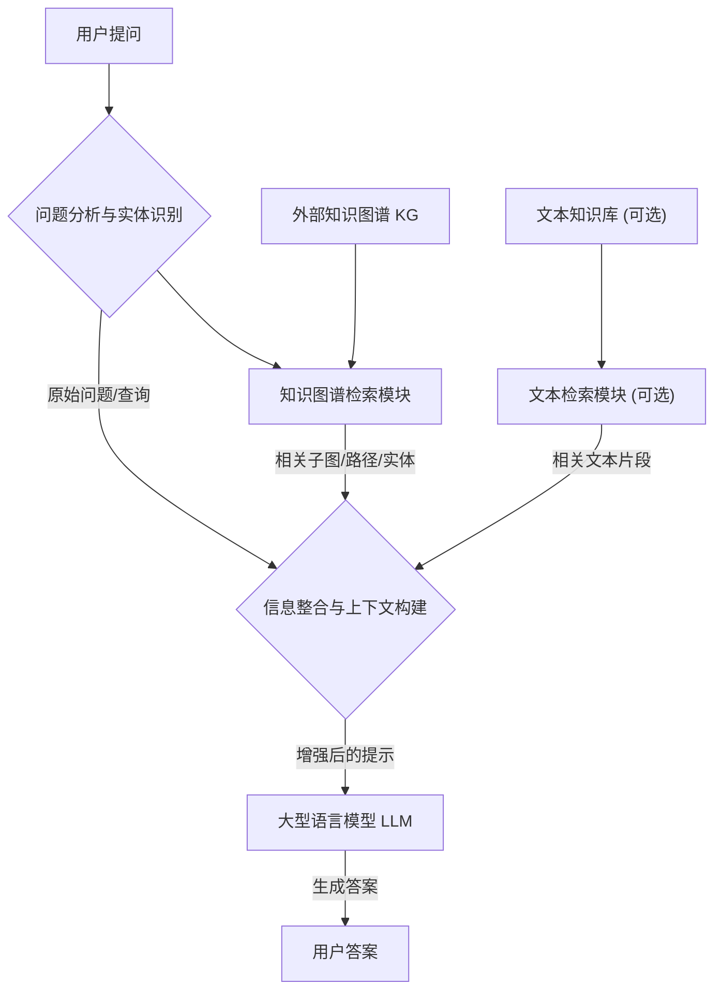

## AI论文解读 | Retrieval-Augmented Generation with Graphs (GraphRAG)
  
### 作者  
digoal  
  
### 日期  
2025-05-14  
  
### 标签  
PostgreSQL , PolarDB , DuckDB , AI , 论文解读  
  
----  
  
## 背景  
https://arxiv.org/pdf/2501.00309  
  
提示:  
```  
读懂《Retrieval-Augmented Generation with Graphs (GraphRAG)》这篇论文需要提前掌握哪些基础知识, 请给我讲一下这些基础知识, 尽量通熟易懂, 可以使用markdown支持的图形增加解释性.  
  
通熟易懂的解读《Retrieval-Augmented Generation with Graphs (GraphRAG)》这篇论文, 关键内容请深入讲解, 可以使用markdown支持的图形增加解释性.  
  
提取《Retrieval-Augmented Generation with Graphs (GraphRAG)》论文中一些重要的术语并详细解释, 可以使用markdown支持的图形示增加解释性.  
```  
  
## 1 前置知识  

## 理解GraphRAG论文所需的基础知识

要深入理解《Retrieval-Augmented Generation with Graphs (GraphRAG)》这篇论文，掌握一些关键的基础概念至关重要。这篇论文结合了检索增强生成（RAG）、知识图谱（Knowledge Graphs）和大型语言模型（LLMs）的优势。下面我将为您通俗易懂地介绍这些核心概念：

### 1\. 大型语言模型 (Large Language Models - LLMs)

  * **是什么？**
    您可以将大型语言模型想象成一个“超级大脑”，它通过阅读海量的文本数据（比如书籍、网站、文章等）来学习语言的模式和知识。它们能够理解、总结、翻译、预测并生成类似人类的文本。
  * **如何工作？**
    LLMs 的核心是复杂的算法（通常是神经网络，特别是 Transformer 架构），这些算法使其能够处理和理解单词之间的关系和上下文。当您给 LLM 一个提示（比如一个问题或一句话的开头），它会根据学到的知识预测接下来最可能出现的词语，从而生成连贯的回应。
  * **为什么重要？**
    LLMs 是许多现代人工智能应用（如聊天机器人、文本生成工具、翻译服务等）的基础。然而，它们有时会“编造”信息（称为“幻觉”）或提供过时的答案，因为它们的知识截止于其训练数据。

### 2\. 检索增强生成 (Retrieval-Augmented Generation - RAG)

  * **是什么？**
    RAG 是一种巧妙的框架，旨在让大型语言模型（LLMs）的回答更加准确、可靠和与时俱进。它通过在 LLM 生成答案之前，先从一个外部的、权威的知识库中检索相关信息，并将这些信息作为额外的上下文提供给 LLM。

  * **如何工作？**
    想象一下，您要参加一场开卷考试，而不是闭卷考试。

    1.  **检索 (Retrieval):** 当用户提出一个问题时，RAG 系统首先会使用这个问题作为查询，在一个特定的数据源（如文档集合、数据库或知识图谱）中搜索最相关的信息片段。
    2.  **增强 (Augmentation):** 找到的相关信息会与原始问题一起被“增强”或“注入”到给 LLM 的提示中。
    3.  **生成 (Generation):** LLM 现在会基于原始问题和提供的额外上下文信息来生成答案。这就像给 LLM 一本参考书，让它在回答前先查阅。

  * **为什么重要？**

      * **提高准确性：** 通过引用外部知识，减少 LLM“编造”事实的可能性。
      * **知识更新：** 可以轻松更新外部知识库，而无需重新训练整个庞大的 LLM，从而让答案保持最新。
      * **领域特定知识：** 能够让 LLM 利用特定领域或组织的内部知识，提供更专业的回答。
      * **可解释性：** 通常可以追溯到信息来源，增加了答案的透明度和可信度。

    您可以将 RAG 流程想象成这样：

    ```mermaid
    graph LR
        A[用户提问] --> B(检索模块);
        B -- 相关信息 --> C(增强模块);
        A -- 原始问题 --> C;
        C -- 增强后的提示 --> D(大型语言模型 LLM);
        D -- 生成答案 --> E[用户答案];
        F[外部知识库] --> B;
    ```

### 3\. 知识图谱 (Knowledge Graphs - KGs)

  * **是什么？**
    知识图谱是一种以图形结构组织和表示知识的方式。您可以把它想象成一个由许多“点”（称为**节点**或**实体**）和连接这些点的“线”（称为**边**或**关系**）组成的网络。

      * **节点 (Nodes/Entities):** 代表真实世界的对象、概念、事件或人物，例如“北京”、“人工智能”、“阿尔伯特·爱因斯坦”。
      * **边 (Edges/Relationships):** 描述节点之间的不同类型的联系，例如“北京” `(位于)` “中国”，“人工智能” `(是...的一个领域)` “计算机科学”，“阿尔伯特·爱因斯坦” `(出生于)` “德国”。

  * **如何工作？**
    知识图谱将来自不同来源的数据整合起来，捕捉实体及其属性和它们之间的复杂关系。它们不仅仅是存储数据，还能通过推理（基于定义的规则和关系）来发现新的、隐含的知识。

  * **为什么重要？**

      * **结构化知识：** 将非结构化或半结构化的信息转化为结构化的、机器可读的格式。
      * **上下文理解：** 提供丰富的上下文信息，帮助机器更好地理解概念和它们之间的联系。
      * **高级检索：** 能够进行更复杂、更语义化的查询，而不仅仅是关键词匹配。
      * **数据整合：** 有效地连接和整合来自不同数据源的信息。
      * **AI 应用：** 在搜索引擎、推荐系统、问答系统和数据分析等领域有广泛应用。它们可以帮助 AI 系统进行更深入的理解和推理。

    一个简单的知识图谱示例：

    ```mermaid
    graph LR
        subgraph "人物"
            P1("阿尔伯特·爱因斯坦")
            P2("玛丽·居里")
        end
        subgraph "概念"
            C1("物理学")
            C2("相对论")
        end
        subgraph "地点"
            L1("德国")
        end
        P1 -- "提出" --> C2;
        P1 -- "研究领域" --> C1;
        P2 -- "研究领域" --> C1;
        P1 -- "出生于" --> L1;
    ```

### GraphRAG 的核心思想（推测）

结合以上概念，我们可以推测《Retrieval-Augmented Generation with Graphs (GraphRAG)》这篇论文的核心思想可能在于：

  * **利用知识图谱作为 RAG 中的外部知识库。**
  * 这意味着在 LLM 生成答案之前，系统会从一个知识图谱中检索相关的实体和关系作为上下文。
  * **这样做的好处可能包括：**
      * 提供更结构化、更富含上下文的知识给 LLM。
      * 通过图谱的连接关系，可能检索到更深层次、更相关的间接信息。
      * 提高 RAG 系统在需要复杂推理或理解实体间关系的场景下的表现。

掌握了大型语言模型（LLMs）的基本原理、检索增强生成（RAG）的工作方式以及知识图谱（KGs）如何表示和关联信息，您就能更好地理解 GraphRAG 如何将这些技术融合起来，以期达到更优的文本生成效果。

希望这些解释能帮助您为阅读论文做好准备！

## 2 解读论文  

### 理解 “GraphRAG”：当 RAG 遇上知识图谱

“GraphRAG” 这个名字直接点明了它的核心：**利用图（Graphs），特别是知识图谱（Knowledge Graphs），来增强检索增强生成（Retrieval-Augmented Generation）的过程。**

我们可以将 GraphRAG 理解为一个更智能、更懂关系的 RAG 系统。传统的 RAG 系统通常从文本文档库中检索信息，而 GraphRAG 则更进一步，它从结构化的知识图谱中检索信息，或者结合文本和图谱信息。

#### GraphRAG 可能的关键工作流程

让我们设想一下 GraphRAG 系统是如何运作的：



1.  **问题分析与实体识别 (Query Analysis & Entity Recognition):**

      * 当用户提出问题时，系统首先会解析问题，识别出其中的关键**实体**（比如人名、地名、概念）和用户意图。
      * **深入讲解:** 这一步可能利用自然语言处理（NLP）技术，如命名实体识别（NER）和关系抽取（RE）。例如，对于问题“爱因斯坦和相对论有什么关系？”，系统会识别出“爱因斯坦”和“相对论”这两个实体。

2.  **知识图谱检索模块 (Knowledge Graph Retrieval Module):**

      * 这是 GraphRAG 的核心。系统会利用上一步识别出的实体，在知识图谱中进行检索。
      * **深入讲解:**
          * **节点查找:** 定位到与问题中实体对应的知识图谱节点。
          * **关系探索/路径发现:** 从这些节点出发，探索它们之间的关系路径。例如，在“爱因斯坦”和“相对论”之间，图谱中可能存在一条路径：“爱因斯坦” `--(提出)-->` “相对论”。
          * **子图提取:** 检索模块可能会提取一个包含这些实体及其紧密相关邻居和关系的“子图”（Subgraph）。这个子图就构成了与问题高度相关的结构化知识。
          * **复杂查询:** 知识图谱支持比简单关键词搜索更复杂的查询，例如，“哪些科学家在研究A领域的同时也对B领域有贡献？” 这需要图谱遍历和多关系查询。
      * **优势:** 相比于单纯的文本检索，知识图谱可以提供更精确、更结构化的信息，并且能够揭示实体之间复杂的关系。

3.  **文本检索模块 (Textual Retrieval Module - 可选):**

      * GraphRAG 系统也可能并行地从传统的文本知识库（如文档、文章）中检索相关信息。
      * **深入讲解:** 这样做可以弥补知识图谱可能未能覆盖的最新信息、详细解释或特定上下文。

4.  **信息整合与上下文构建 (Information Integration & Context Construction):**

      * 从知识图谱检索到的结构化信息（如实体、关系、子图）和可能从文本库中检索到的文本片段，会与原始问题一起被整合，构建成一个丰富、多维度的上下文。
      * **深入讲解:** 如何有效地将图谱的结构化信息转换并呈现给 LLM 是一个关键挑战。这可能包括：
          * **图文本化 (Graph-to-Text):** 将图谱中的子图或路径转换成自然语言描述。例如，将 `(爱因斯坦) -[提出]-> (相对论)` 转换为句子“爱因斯坦提出了相对论”。
          * **结构化输入:** 直接将图谱的某些结构化表示（如三元组列表）提供给有能力处理此类输入的 LLM。
          * **注意力机制的引导:** 利用图谱信息引导 LLM 的注意力，使其更关注与图谱知识一致的内容。

5.  **大型语言模型生成 (LLM Generation):**

      * 这个增强后的、包含图谱知识的上下文被送入大型语言模型（LLM）。
      * LLM 基于这些丰富的信息生成最终答案。

#### GraphRAG 的潜在优势和深入点

  * **更强的推理能力和上下文理解:**

      * 知识图谱中的显式关系可以帮助 LLM 理解实体之间是如何关联的，从而进行更深层次的推理。例如，如果图谱中有 `(A) -[影响]-> (B)` 和 `(B) -[导致]-> (C)`，LLM 可能更容易推断出 A 与 C 之间的间接关系。
      * **深入讲解:** 这对于回答需要多跳推理（multi-hop reasoning）的问题尤为重要，即答案需要通过图谱中的多个关系步骤才能找到。传统 RAG 可能难以有效地检索和串联这些分散在不同文本片段中的信息。

  * **减少幻觉，提高事实准确性:**

      * LLM 的回答可以被“锚定”在知识图谱中经过验证的结构化事实上，从而减少凭空捏造（幻觉）的可能性。
      * **深入讲解:** 知识图谱通常经过精心构建和校验，其信息的准确性相对较高。当 LLM 被引导使用这些信息时，其输出的真实性有望提升。

  * **处理复杂和隐含知识:**

      * 知识图谱能够表示现实世界中复杂的联系和属性，这些可能在非结构化文本中是隐含的或难以抽取的。
      * **深入讲解:** 例如，一个公司的组织架构、产品之间的依赖关系、历史事件的因果链等，在图谱中可以清晰表示，而文本描述可能零散且不完整。GraphRAG 可以利用这些结构化信息回答更复杂的问题。

  * **可解释性和溯源性:**

      * 由于答案部分来源于知识图谱，系统可能更容易追溯到信息的具体来源（图谱中的特定节点和关系）。
      * **深入讲解:** 这有助于用户理解答案是如何得出的，并验证其可靠性。例如，系统可以说“根据知识图谱，A 与 B 的关系是 X，因为存在以下路径...”

  * **个性化和领域适应性:**

      * 可以针对特定领域构建专门的知识图谱（如医学图谱、金融图谱），GraphRAG 系统可以利用这些图谱提供高度专业化和个性化的回答。
      * **深入讲解:** 想象一个医疗诊断辅助系统，它可以利用医学知识图谱中关于疾病、症状、药物及其相互作用的知识，为医生提供更精准的参考信息。

#### GraphRAG 可能面临的挑战

  * **知识图谱的构建与维护:** 高质量知识图谱的构建本身就是一个复杂且成本高昂的任务，需要持续更新。
  * **图谱与 LLM 的对齐:** 如何有效地将图谱的结构化信息“喂”给主要基于文本训练的 LLM，并让 LLM 充分理解和利用这些信息，是一个技术难题。
  * **检索效率与规模:** 在大规模知识图谱中高效地检索相关子图或路径可能面临性能挑战。
  * **知识的全面性与噪声:** 知识图谱可能存在不完整或错误的信息，这会影响最终答案的质量。

以下解读将结合通用 GraphRAG 概念和搜索到的关于 Microsoft GraphRAG 及其他相关研究的公开信息。它可能与您提供的特定论文的侧重点略有不同，但会涵盖其核心思想和关键技术。

### GraphRAG 深入解读：从文本到知识，再到智能答案

GraphRAG 的核心目标是**提升大型语言模型（LLM）理解和推理复杂信息的能力，特别是针对私有或领域特定数据集，使其能够回答更深入、更具洞察力的问题。** 它通过将非结构化的文本数据首先转换为结构化的知识图谱，然后利用这个图谱来增强 LLM 的检索和生成过程。

#### 关键内容与深入讲解

1.  **从非结构化文本到知识图谱的构建 (Knowledge Graph Construction from Text):**

      * 这是 GraphRAG 的 foundational step。与传统 RAG 直接检索文本片段不同，GraphRAG 首先致力于从原始文本（如公司文档、研究报告、新闻文章等）中提取有价值的结构化信息。
      * **深入讲解:**
          * **实体提取 (Entity Extraction):** LLM 被用来识别文本中的关键实体，例如人物、组织、地点、概念、项目等。
          * **关系提取 (Relationship Extraction):** 更进一步，LLM 会被用来识别这些实体之间存在的各种关系。例如，“公司A `收购了` 公司B”，“项目X `依赖于` 技术Y”。
          * **属性和描述生成:** LLM 可能还会为提取出的实体和关系生成简短的描述或概括。
          * **消歧与链接:** 解决实体指代不明的问题（例如，多个“苹果公司”），并将实体链接到已有的知识库（如果可能）。
          * **Microsoft GraphRAG 的特点:** 根据搜索结果，Microsoft Research 的 GraphRAG 项目明确使用 LLM 来自动构建知识图谱。这意味着 LLM 不仅仅是最终答案的生成者，也是前期知识构建的参与者。这是一个重要的特点，因为它使得知识图谱的构建过程更加自动化和规模化。


    ```mermaid
    graph LR
        subgraph "知识图谱构建阶段"
            T[原始文本文档] --> L1[LLM: 实体提取];
            L1 --> E[识别出的实体];
            T --> L2[LLM: 关系提取];
            L2 --> R[识别出的关系];
            E --> KG[知识图谱];
            R --> KG;
        end
    ```

2.  **知识图谱的组织与丰富化 (Graph Organization and Enrichment):**

      * 构建好的知识图谱不仅仅是实体和关系的简单集合，GraphRAG 通常还会对其进行进一步的处理和组织，以挖掘更深层次的结构和意义。
      * **深入讲解:**
          * **社区检测 (Community Detection):** 应用图分析算法（如图聚类）来识别知识图谱中紧密相连的实体集群或“社区”。这些社区往往代表了数据中潜在的主题或关联密切的概念群组。
          * **层级化总结 (Hierarchical Summarization):** Microsoft GraphRAG 的一个显著特点是它会对这些检测到的社区进行自下而上的层级化总结。LLM 会为每个社区（甚至社区的子社区）生成摘要。高层级的摘要会递归地包含低层级摘要的信息。
              * **例如：** 底层可能是关于具体项目细节的社区，中层是关于这些项目所属的产品线的社区，顶层则是关于整个公司战略方向的社区。
          * **全局洞察:** 这种层级化的社区总结使得系统能够对整个数据集形成从局部细节到全局概览的多层次理解。


    ```mermaid
    graph LR
        subgraph "图谱组织与总结"
            KG[原始知识图谱] --> CD[社区检测算法];
            CD --> C1[社区1];
            CD --> C2[社区2];
            CD --> CN[社区N];
            C1 --> S1[LLM: 社区1总结];
            C2 --> S2[LLM: 社区2总结];
            CN --> SN[LLM: 社区N总结];
            S1 --> HS[层级化摘要];
            S2 --> HS;
            SN --> HS;
        end
    ```

3.  **基于图谱的增强检索 (Graph-Powered Augmented Retrieval):**

      * 当用户提出查询时，GraphRAG 利用构建和组织好的知识图谱以及社区摘要来进行检索，为 LLM 提供更丰富、更结构化的上下文。
      * **深入讲解:**
          * **混合检索策略:**
              * **局部搜索 (Local Search):** 针对需要具体细节的问题，系统可能直接在知识图谱中定位到与查询相关的实体、关系或小范围子图。
              * **全局搜索 (Global Search):** 针对需要宏观理解或跨领域关联的问题，系统会利用之前生成的社区摘要。通过检索这些摘要，可以快速定位到与问题相关的大主题或数据集的整体洞察。
              * **Microsoft GraphRAG 的 DRIFT Search:** 一些资料提到 Microsoft GraphRAG 结合了全局和局部搜索方法，以提高检索质量和效率。
          * **超越向量相似性:** 传统 RAG 主要依赖查询和文本片段之间的语义相似性（通常通过向量嵌入计算）。GraphRAG 则更进一步，它可以：
              * **利用图结构:** 通过图的连接关系发现间接但重要的信息（多跳推理）。
              * **理解关系类型:** 不仅仅是找到相似的实体，还能理解它们之间具体是什么关系。
              * **提供结构化上下文:** 将检索到的子图或路径信息（可能经过文本化处理）提供给 LLM。
          * **情境感知:** 检索过程可以考虑用户和任务的上下文，以提高检索结果的相关性。

4.  **利用增强上下文生成答案 (Generation with Enriched Context):**

      * LLM 接收到包含来自知识图谱的结构化信息、社区摘要以及可能的原始文本片段的增强上下文。
      * **深入讲解:**
          * **更全面的答案:** 由于上下文包含了更广泛和更结构化的信息，LLM 有可能生成更全面、更深入、更少偏见的答案，因为它不仅仅依赖于少数几个最相似的文本片段。
          * **减少幻觉:** 将答案锚定在知识图谱的结构化事实上，可以有效减少 LLM 的“幻觉”现象。
          * **可解释性与溯源:** GraphRAG 强调答案的可溯源性。由于信息来源于图谱，系统可以更容易地指出答案是基于哪些实体、关系或社区摘要得出的，甚至链接回原始文本来源。这对于建立用户信任至关重要。
          * **处理复杂问题:** 特别擅长回答那些需要整合来自多份文档、理解实体间复杂关系或进行全局性分析的问题。例如，“我们公司过去五年在A领域的研发投入是如何影响我们在B市场上的竞争地位的？”这类问题往往难以通过简单的文本检索来回答。

#### GraphRAG 的核心优势总结

  * **深度理解私有数据:** 能够从大量私有文本数据中提取深层知识和主题。
  * **处理全局性/总结性问题:** 通过社区检测和层级化总结，能够回答关于数据集整体的问题。
  * **提高答案质量和多样性:** 通过整合来自图谱的结构化信息，减少对少数文本片段的依赖，从而生成更全面和多角度的答案。
  * **增强事实性和可信度:** 将答案锚定在图谱知识上，并提供溯源。
  * **可扩展性:** 旨在处理大规模文本语料库。

#### GraphRAG 的应用场景

  * **企业知识管理:** 分析内部文档、报告、邮件，形成企业知识图谱，辅助决策和员工查询。
  * **科研文献分析:** 从大量科研论文中提取发现、关联和趋势。
  * **市场情报分析:** 理解市场动态、竞争对手行为和客户反馈。
  * **法律文档审阅:** 快速理解案件材料中的关键实体和事件关联。
  * **医疗信息分析:** 从病历、研究论文中构建医学知识图谱，辅助诊断和研究。

#### 可能的挑战（通用）

  * **知识图谱构建的成本和质量:** 即使有 LLM 辅助，构建高质量、无噪声的知识图谱仍然是一个挑战。实体和关系的提取可能存在错误或遗漏。
  * **图谱的动态更新:** 如何有效地更新知识图谱以反映新信息是一个持续的问题。
  * **提示工程的复杂性:** 指导 LLM 从文本中准确提取实体、关系以及生成高质量摘要，需要复杂的提示工程和微调。
  * **计算资源:** 构建和查询大规模知识图谱，以及运行 LLM 进行提取、总结和生成，都需要大量的计算资源。

总而言之，GraphRAG 代表了 RAG 技术的一个重要演进方向。它通过引入知识图谱作为中间的结构化知识层，极大地增强了 LLM 理解和利用大规模非结构化文本数据的能力，尤其是在需要进行复杂推理、全局理解和事实溯源的场景下，展现出巨大的潜力。Microsoft Research 在这一领域的探索和开源，无疑会推动该技术的进一步发展和应用。

## 3 术语  

这些术语对于理解 GraphRAG 的核心机制、优势和实现方式至关重要。

### GraphRAG 核心术语详解

以下是一些在 GraphRAG 论文和讨论中频繁出现的关键术语：

1.  **知识图谱 (Knowledge Graph - KG)**

      * **解释:** GraphRAG 的核心数据结构之一。它是一种用节点（代表实体，如人、事、物、概念）和边（代表实体间的关系）来结构化地表示知识的网络。与纯文本相比，知识图谱能明确地表达实体间的复杂联系。
      * **在 GraphRAG 中的重要性:**
          * 作为检索的源头，提供结构化的、上下文丰富的知识。
          * 帮助 LLM 进行更深层次的推理，理解实体间的间接关系。
          * 提高答案的事实性和可溯源性。
      * **图示:**
        ```mermaid
        graph LR
            A[实体: 艾萨克·牛顿] -- 发表了 --> B(实体: 自然哲学的数学原理);
            A -- 提出了 --> C(概念: 万有引力定律);
            B -- 阐述了 --> C;
            D[实体: 剑桥大学] -- 曾就读于 --> A;
        ```

2.  **LLM 驱动的知识图谱构建 (LLM-driven Knowledge Graph Construction)**

      * **解释:** 指利用大型语言模型（LLM）从非结构化文本（如文档、网页）中自动或半自动地提取实体、关系和属性，并构建成知识图谱的过程。
      * **在 GraphRAG 中的重要性:** 这是许多 GraphRAG 系统（尤其是 Microsoft 的 GraphRAG）的初始步骤。它使得从大量私有或领域特定文本中创建可用的知识图谱成为可能，而无需完全依赖人工构建。
      * **流程示例:**
        ```mermaid
        sequenceDiagram
            participant Text as 原始文本数据
            participant LLM as 大型语言模型
            participant KG as 知识图谱

            Text->>LLM: 输入文本片段
            LLM->>LLM: 分析文本，识别实体 (如：公司A, 产品X)
            LLM->>LLM: 分析文本，识别关系 (如：公司A 研发 产品X)
            LLM->>KG: 添加实体节点 (公司A, 产品X)
            LLM->>KG: 添加关系边 (公司A)-[研发]->(产品X)
        ```

3.  **图检索器 (Graph Retriever)**

      * **解释:** 在 GraphRAG 框架中，负责根据用户查询从知识图谱中检索最相关信息（如节点、边、子图、路径）的模块。
      * **在 GraphRAG 中的重要性:** 这是区别于传统 RAG 的核心组件。图检索器利用图的结构特性进行检索，而不仅仅是文本的语义相似性。
      * **检索方式可能包括:**
          * **实体链接 (Entity Linking):** 将查询中的文本提及链接到图谱中的实体节点。
          * **路径查找 (Path Finding):** 寻找连接多个实体的关系路径。
          * **子图提取 (Subgraph Extraction):** 提取包含与查询最相关的一组实体和关系的局部图结构。
          * **社区感知检索 (Community-aware Retrieval):** 利用图谱中的社区结构（见下文）来定位相关信息集群。

4.  **社区检测 (Community Detection in Graphs)**

      * **解释:** 一种图分析技术，用于识别知识图谱中连接紧密的节点集群（即“社区”）。这些社区通常代表了数据中具有共同主题或高度相关的概念群组。
      * **在 GraphRAG 中的重要性:** 特别在 Microsoft 的 GraphRAG 方法中被强调。通过识别社区，可以将大规模图谱分解为更易于管理和理解的模块。这有助于进行更高级别的概括和总结。
      * **图示:**
        ```mermaid
        graph LR
            subgraph 大规模知识图谱
                subgraph 社区A 主题: 人工智能技术
                    N1(实体: 机器学习)
                    N2(实体: 深度学习)
                    N3(实体: Transformer模型)
                    N1 --- N2
                    N2 --- N3
                end
                subgraph 社区B 主题: 自然语言处理应用
                    N4(实体: 机器翻译)
                    N5(实体: 情感分析)
                    N3 --- N4  
                    N2 --- N5  
                end
                N6(实体: 计算机视觉) -- 不属于紧密社区 --> N7(实体: 图像识别)
            end
        ```

5.  **层级化社区摘要 (Hierarchical Community Summaries)**

      * **解释:** 基于检测到的图社区，利用 LLM 自下而上地为这些社区及其更高层级的聚类生成摘要。低层级社区的摘要信息会被整合进高层级社区的摘要中。
      * **在 GraphRAG 中的重要性:** 这使得系统能够提供从具体细节到宏观概览的多粒度信息。用户查询如果是全局性的，可以直接利用高层级的摘要；如果是局部性的，可以深入到具体的社区或实体。
      * **图示:**
        ```mermaid
        graph TD
            RootSummary[全局摘要: 公司整体战略] --> Level1SummaryA[一级社区摘要: 产品线A战略];
            RootSummary --> Level1SummaryB[一级社区摘要: 产品线B战略];
            Level1SummaryA --> Level2SummaryA1[二级社区摘要: 产品A1特性];
            Level1SummaryA --> Level2SummaryA2[二级社区摘要: 产品A2市场表现];
            Level1SummaryB --> Level2SummaryB1[二级社区摘要: 技术B1研发进展];
        ```

6.  **图到文本的线性化/转换 (Graph-to-Text Linearization/Conversion)**

      * **解释:** 将从知识图谱中检索到的结构化信息（如子图、路径、三元组）转换成自然语言文本的过程。
      * **在 GraphRAG 中的重要性:** LLM 主要是在文本上进行训练和操作的。因此，需要一种机制将图的结构化知识“翻译”成 LLM 能够理解和利用的文本格式，作为增强其提示（prompt）的上下文。
      * **示例:**
          * 图谱三元组: `(爱因斯坦, 职业, 物理学家)`
          * 线性化文本: “阿尔伯特·爱因斯坦是一名物理学家。”

7.  **多跳推理 (Multi-hop Reasoning)**

      * **解释:** 指通过知识图谱中的多个连续关系（“跳”）来回答一个复杂问题的能力。答案可能不是直接与查询中的实体相连，而是需要通过一系列中间实体和关系才能推断出来。
      * **在 GraphRAG 中的重要性:** 这是知识图谱相对于简单文本检索的一个关键优势。GraphRAG 可以利用图的连接性来发现这些间接但重要的关联，从而回答更复杂的问题。
      * **图示:**
        ```mermaid
        graph LR
            Query["查询: X公司使用了哪些云服务提供商的技术？"]
            subgraph KG as 知识图谱
                X_Company[X公司] -- 开发了 --> Product_A[产品A]
                Product_A -- 使用了 --> Tech_PaaS[PaaS平台Y]
                Tech_PaaS -- 由...提供 --> Cloud_Provider_Z[云服务商Z]
            end
            Query --> X_Company;
            Cloud_Provider_Z --> Answer["答案: X公司通过其产品A间接使用了云服务商Z的PaaS技术"];
            style Answer fill:#lightgreen,stroke:#333,stroke-width:2px
        ```
        *(这是一个简化的2跳推理：X公司 -\> 产品A -\> PaaS平台Y -\> 云服务商Z)*

8.  **全局与局部感知 (Global and Local Sensemaking/Search)**

      * **解释:** 指 GraphRAG 系统能够根据用户问题的性质，在整个数据集的宏观洞察（全局感知）和特定细节的深入挖掘（局部感知）之间进行切换和结合的能力。
      * **在 GraphRAG 中的重要性:** 使得系统能够灵活应对不同类型的查询。
          * **全局问题示例:** “我们数据集中关于气候变化的主要讨论趋势是什么？” (可能利用高层级社区摘要)
          * **局部问题示例:** “文件XYZ中关于碳排放的具体数据是多少？” (可能直接检索实体和其属性)

9.  **检索增强生成框架 (Retrieval-Augmented Generation - RAG) - 作为基础**

      * **解释:** 一种通用的 AI 框架，通过在大型语言模型生成回应前，先从外部知识源检索相关信息来增强模型的输出，使其更准确、与时俱进。
      * **在 GraphRAG 中的重要性:** GraphRAG 是 RAG 的一种高级形式，其核心区别在于其“检索”组件深度依赖于知识图谱。

10. **上下文窗口 (Context Window)**

      * **解释:** 指大型语言模型在一次处理中能够有效考虑的输入文本（提示）的最大长度。
      * **在 GraphRAG 中的重要性:** 如何有效地将从知识图谱中检索到的（可能很复杂的）信息压缩并表示在 LLM 有限的上下文窗口内，同时保持信息的丰富性和相关性，是一个关键挑战。社区摘要和图到文本的线性化等技术部分解决了这个问题。

这些术语共同构成了 GraphRAG 的技术图景。理解它们有助于深入把握 GraphRAG 如何利用图结构的力量来提升信息检索的质量和 LLM 生成答案的深度与准确性。希望这些解释和图示能帮助您更好地理解相关的论文和技术！

## 参考  
  
https://arxiv.org/pdf/2501.00309   

https://github.com/microsoft/graphrag

https://deepwiki.com/microsoft/graphrag
  
<b> 以上内容基于DeepSeek、QwQ及诸多AI生成, 轻微人工调整, 感谢杭州深度求索人工智能、阿里云等公司. </b>  
  
<b> AI 生成的内容请自行辨别正确性, 当然也多了些许踩坑的乐趣, 毕竟冒险是每个男人的天性.  </b>  
  
  
  
#### [期望 PostgreSQL|开源PolarDB 增加什么功能?](https://github.com/digoal/blog/issues/76 "269ac3d1c492e938c0191101c7238216")
  
  
#### [PolarDB 开源数据库](https://openpolardb.com/home "57258f76c37864c6e6d23383d05714ea")
  
  
#### [PolarDB 学习图谱](https://www.aliyun.com/database/openpolardb/activity "8642f60e04ed0c814bf9cb9677976bd4")
  
  
#### [PostgreSQL 解决方案集合](../201706/20170601_02.md "40cff096e9ed7122c512b35d8561d9c8")
  
  
#### [德哥 / digoal's Github - 公益是一辈子的事.](https://github.com/digoal/blog/blob/master/README.md "22709685feb7cab07d30f30387f0a9ae")
  
  
#### [About 德哥](https://github.com/digoal/blog/blob/master/me/readme.md "a37735981e7704886ffd590565582dd0")
  
  

  
