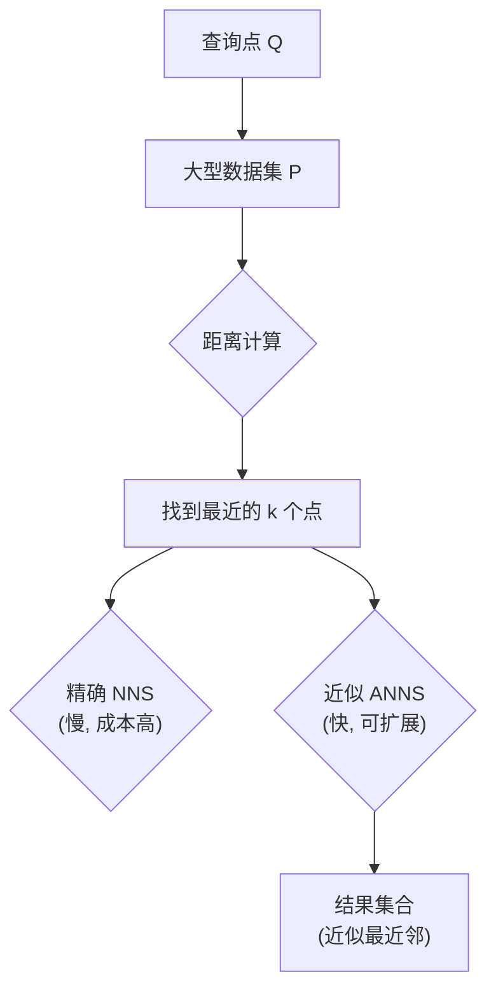
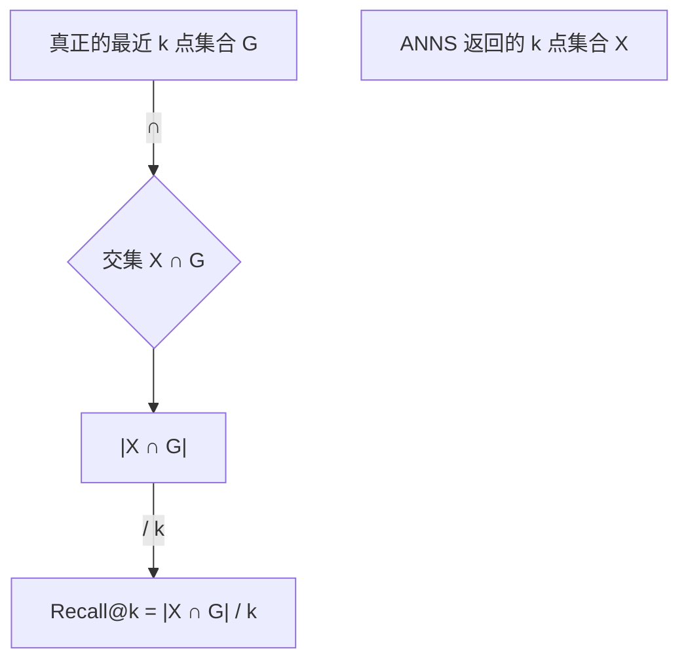
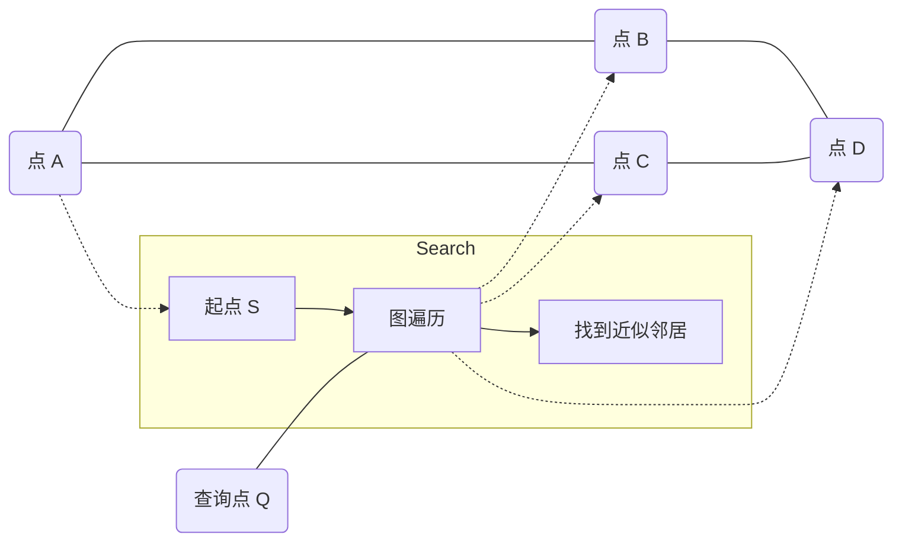
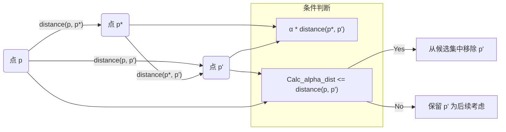
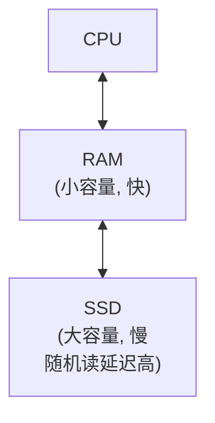
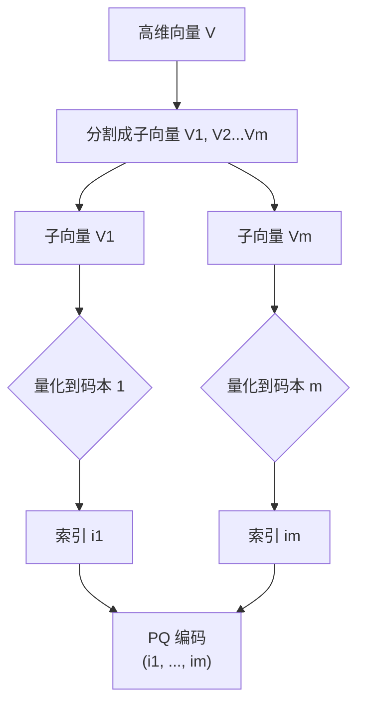
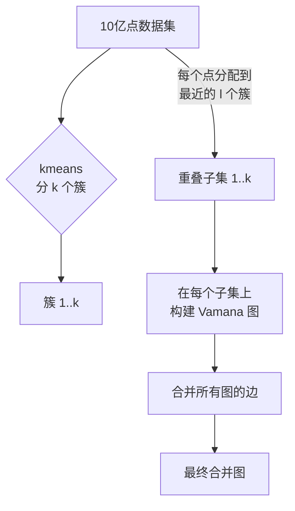
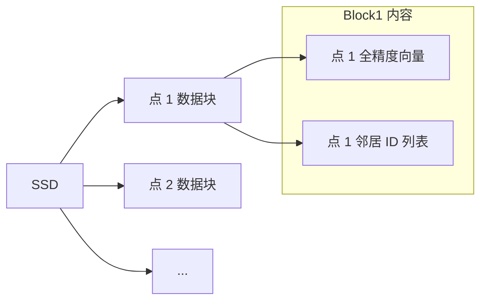
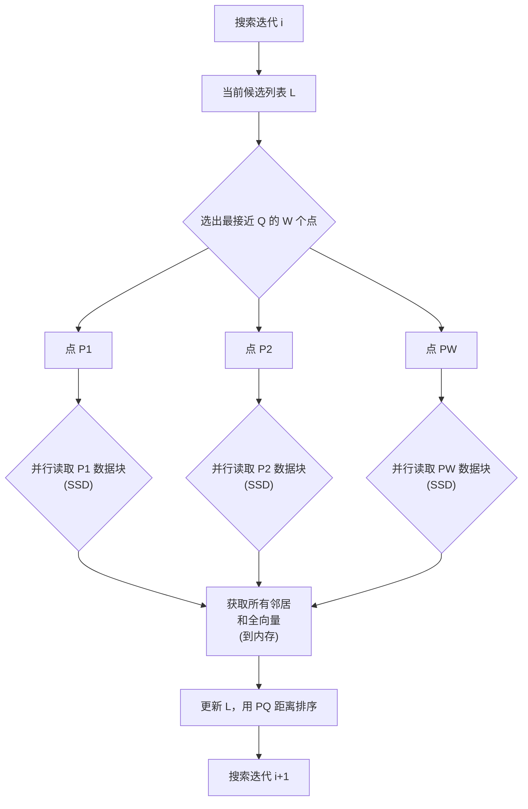
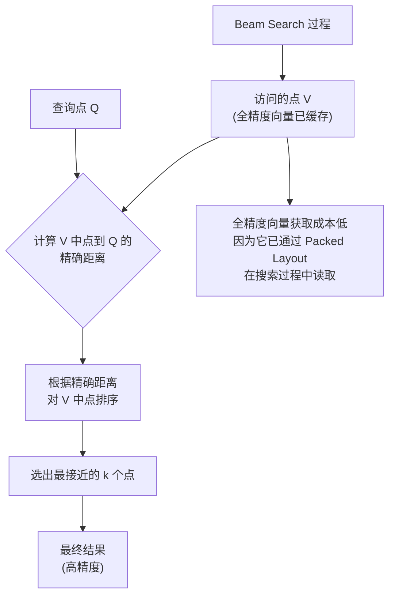

## AI论文解读 | DiskANN: Fast Accurate Billion-point Nearest Neighbor Search on a Single Node
  
### 作者  
digoal  
  
### 日期  
2025-05-14  
  
### 标签  
PostgreSQL , PolarDB , DuckDB , AI , 论文解读  
  
----  
  
## 背景  
https://suhasjs.github.io/files/diskann_neurips19.pdf  
  
提示:  
```  
读懂《DiskANN: Fast Accurate Billion-point Nearest Neighbor Search on a Single Node》这篇论文需要提前掌握哪些基础知识, 请给我讲一下这些基础知识, 尽量通熟易懂, 可以使用markdown支持的图形增加解释性.  
  
通熟易懂的解读《DiskANN: Fast Accurate Billion-point Nearest Neighbor Search on a Single Node》这篇论文, 关键内容请深入讲解, 可以使用markdown支持的图形增加解释性.  
  
提取《DiskANN: Fast Accurate Billion-point Nearest Neighbor Search on a Single Node》论文中一些重要的术语并详细解释, 可以使用markdown支持的图形示增加解释性.  
```  
  
## 1 前置知识  

要理解《DiskANN: Fast Accurate Billion-point Nearest Neighbor Search on a Single Node》这篇论文，你需要掌握一些关于近似最近邻搜索（ANNS）、数据结构、存储系统以及性能评估的基础知识。我将尽量用通俗易懂的方式来解释这些概念，并构思一些简单的图形辅助理解。

**核心问题：最近邻搜索 (Nearest Neighbor Search, NNS)**

*   **概念：** 想象你有一堆数据点（比如图片、文档或用户画像，它们被转化成了一串数字，也就是**向量**），然后给你一个新的查询点。最近邻搜索的目标就是在这堆数据中找到离查询点“最近”的那一个或那几个点。这里的“最近”通常是用距离来衡量的，比如**欧几里得距离**（空间中两点间的直线距离）。
*   **为什么重要？** 很多应用都需要这个能力，比如：
    *   **图片搜索：** 找到和这张图片最相似的其他图片。
    *   **推荐系统：** 找到和这个用户兴趣最相似的其他用户或商品。
    *   **去重：** 找到和某个数据点重复或非常相似的点。

**挑战：高维数据与“维度灾难”(Curse of Dimensionality)**

*   **概念：** 现实世界的数据点往往不是简单的二维或三维，而是几百甚至几千维的向量。在高维空间中，很多低维空间的直觉不再适用。
*   **问题：**
    *   **距离：** 在极高维空间里，所有点之间的距离差异会变得很小，或者说“相对距离”的概念变得模糊，使得区分远近变得困难。
    *   **索引失效：** 很多在低维下很好用的数据结构（比如 kd 树）在高维下效率会急剧下降，搜索时间接近于遍历所有点。
*   **图形构思：** 无法在高维空间画图，但可以想象一个简单的对比：
    *   **低维 (2D):** 点分布稀疏，很容易找到附近的点。
    *   **高维 (1000D):** 点分布在空间的各个角落，每个点离其他点好像都很“远”，或者说点之间的距离区分度变小。

**解决方法：近似最近邻搜索 (Approximate Nearest Neighbor Search, ANNS)**

*   **概念：** 既然精确搜索太慢，那就放宽要求，找一个“差不多”是最近邻的点就行。也就是说，找到的点可能不是真正的最近邻，但它也非常接近真正的最近邻。
*   **好处：** 通过牺牲一点精度，可以极大地提高搜索速度和效率。
*   **衡量：** 用 **Recall@k** 来衡量 ANNS 的精度。
    *   **Recall@k：** 如果真正的最近 k 个点组成的集合是 G，你的算法找到的 k 个点组成的集合是 X，那么 Recall@k = |X ∩ G| / k。也就是说，你在找到的 k 个点中有多少个是真正的最近邻。论文中特别关注 **1-recall@1**，即找到的第1个点是真正的最近邻的概率。
*   **图形构思：**
    *   **查询点 Q**
    *   **真正的最近点 N**
    *   **ANNS 找到的点 A** (A 很接近 N，可能就是 N，也可能不是 N 但非常近)
    *   表示： `Q` -> (搜索) -> `A` (希望 `A`  ≈ `N`)

**ANNS 的主要流派（论文中提到的）：**

1.  **基于索引 + 数据压缩 (Inverted Index + Data Compression):**
    *   **概念：** 比如 FAISS, IVF-OADC+G+P。先把数据点聚类分成很多份（像图书馆的分区）。搜索时，只在查询点最近的少数几个分区里找。同时，为了省内存，数据点向量会进行压缩（比如**乘积量化 Product Quantization, PQ**）。
    *   **PQ (乘积量化) 概念：** 把一个长向量分成几个短向量，每个短向量在对应的“码本”里找一个最接近的代表向量，只存这个代表向量的编号（一个短数字）。这样就把一个长向量变成了一串短数字（一个“编码”）。计算两个压缩向量的距离时，可以通过预计算的表格快速得到近似距离。
    *   **优点：** 内存占用小，可以用硬件加速（GPU）提高吞吐量。
    *   **缺点：** 数据压缩是**有损**的，会损失精度，特别是对于查找真正的最近邻 (Recall@1) 时精度不高。
    *   **图形构思：**
        *   `大型数据集 P` -> (聚类) -> `多个分区/桶 (Partition)`
        *   `查询点 Q` -> (查找最近的桶) -> `少数桶` -> (在桶内搜索压缩数据) -> `结果`

2.  **基于图 (Graph-based ANNS):**
    *   **概念：** 比如 HNSW, NSG，以及论文提出的 **Vamana**。核心思想是构建一个图，图的节点是数据点，图的边连接了互相“邻近”的点。搜索时，从一个入口点开始，沿着图的边一步步走向离查询点越来越近的点，直到找到满意的结果。
    *   **搜索过程 (贪婪搜索 Greedy Search / 最佳优先搜索 Best-First Search - 算法1):**
        *   从一个起始点 S 开始。
        *   维护一个当前最优点的集合（候选列表 L）。
        *   每次从 L 中选择一个离查询点最近且还没访问过的点 P。
        *   访问 P，将其邻居加入候选列表 L。
        *   重复直到满足条件（比如找到 k 个点，或不再能找到更近的点）。
    *   **图的构建：** 如何构建一个既稀疏（边少，省空间，搜索快）又“导航性”好（能快速通过贪婪搜索找到最近邻）的图是关键。这些算法通常通过一些“修剪”过程来选择每个点的邻居。
        *   **RobustPrune (算法2):** Vamana 使用的一个核心过程。对于一个点 p，从一个候选邻居集合 V 中，优先选择离 p 最近的点 p\* 作为邻居。然后，移除 V 中那些离 p\* 比离 p 更近的点（这些点更像是 p\* 的邻居而不是 p 的），重复直到选择了 R 个邻居或 V 为空。Vamana 的 RobustPrune 还有一个参数 **α**，它控制修剪的严格程度，α > 1 会倾向于选择那些不仅近，而且能让你更好地远离 p\* 的点，这有助于建立“长距离”的边，让搜索更快收敛。
    *   **Vamana 的特点 (与 HNSW/NSG 比较):**
        *   使用 **α** 参数进行更灵活的修剪，可以生成直径更小（搜索跳数更少）的图。
        *   在构建时进行两遍处理 (α=1 和 α>1)。
        *   起始图初始化为随机图。
        *   RobustPrune 的候选集 V 来自 GreedySearch 访问过的所有点，有助于建立长边。
    *   **优点：** 通常在高 Recall 下性能更好，尤其是在 Recall@1 这种需要高精度的场景。
    *   **缺点：** 通常需要将图结构和数据点向量存储在内存中，内存占用大，扩展到十亿级数据需要大量服务器。
    *   **图形构思：**
        *   `点 A`, `点 B`, `点 C`, `点 D`
        *   `边 A->B`, `边 A->C`, `边 B->D`
        *   `查询点 Q`
        *   `搜索路径示例：` S (起始点) -> A -> B -> D (离 Q 越来越近)

  

**DiskANN 的核心创新：将图搬到 SSD 上**

*   **问题：** 基于图的方法内存占用大，无法在单机上处理十亿级数据。SSD 容量大且便宜，但随机读写速度比 RAM 慢几个数量级。
*   **传统观点 (论文中引用的 FAISS 观点):** ANNS 必须在 RAM 中进行，即使是 SSD 也太慢。
*   **DiskANN 的目标：** 打破传统，证明在单机、有限内存（64GB RAM）和 SSD 上也能实现高效的十亿级 ANNS。
*   **面临的挑战：**
    *   **构建图：** 十亿点的数据太大，无法一次性加载到 64GB RAM 中构建图。
    *   **距离计算：** 搜索过程中的距离计算需要在内存中快速进行，但十亿点的全精度向量无法全部放入 64GB RAM。
    *   **SSD 访问：** 图搜索是基于节点访问和邻居查找的，这会产生大量随机读。每次随机读 SSD 需要几百微秒，如果每次访问一个节点就需要一次随机读，那么搜索几十个节点就会导致几十毫秒甚至更高的延迟， throughput（吞吐量，每秒处理的查询数）也会受限。
*   **DiskANN 的解决方案：**

    1.  **构建大型图：分片与合并 (Partitioning & Merging):**
        *   **方法：** 不直接在十亿点上构建一个大图。先用 k-means 将数据分成 k 个簇（比如 40 个）。关键在于，每个数据点不只属于一个簇，而是属于离它最近的 `l` 个簇（比如 `l=2`）。这样每个点都出现在多个“分片”中。
        *   **构建：** 在每个分片上（因为有重叠，点数比 N/k 多，但仍在可接受的内存范围内）独立构建一个 Vamana 图索引。
        *   **合并：** 将所有分片构建的图的边简单地合并起来，形成一个覆盖全量数据的图。
        *   **好处：** 将大型图的构建任务分解成多个可在有限内存中完成的小任务，最终得到一个覆盖全量数据且具有足够连通性的图。
        *   **图形构思：**
            *   `大型数据集 P`
            *   `(k-means)` -> `簇 C1, C2, ..., Ck`
            *   `点 p` -> (分配给最近的 l=2 个簇) -> `p 在 C1`, `p 在 C5`
            *   `基于 C1 构建图 G1`
            *   `基于 C5 构建图 G5`
            *   `(合并边)` -> `最终图 G_merged`

    2.  **内存 + SSD 协同：压缩向量与全精度向量 (Compressed Vectors & Full-Precision Vectors):**
        *   **内存 (RAM):** 存储所有数据点的**压缩向量**（使用 Product Quantization）。这些压缩向量用于在搜索过程中快速计算近似距离，指导图遍历的方向（选择下一个访问哪个点）。
        *   **SSD:** 存储**图结构**（每个点的邻居列表）以及所有数据点的**全精度向量**。
        *   **为什么存全精度？** PQ 距离是近似的。在搜索的**最后阶段**，对通过图遍历找到的少量候选点，需要用**全精度向量**重新计算它们到查询点的精确距离，进行最终排序，从而提高 Recall@1 的精度。
        *   **存储布局：** 在 SSD 上，每个点的数据打包存放：先是点的全精度向量，紧跟着是它的邻居 ID 列表。这样做是为了在读取邻居信息时，可以“顺便”把这个点的全精度向量也读上来，而无需额外的随机读。SSD 一次读取一个“扇区”或“页”（通常是几 KB），将向量和邻居放在一起可以利用这一特性。

    3.  **优化 SSD 访问：束搜索 (Beam Search) 与缓存 (Caching):**
        *   **问题：** 标准的 GreedySearch 每次只关注一个当前最优的点，并读取其邻居。这导致多次串行的 SSD 随机读。
        *   **Beam Search (束搜索):** 修改 GreedySearch (算法1的变种)。不是只选一个最优的点，而是选**W**个当前最优的点（一个“束”），并**同时**读取这 W 个点的邻居信息。
        *   **好处：** 将 W 次随机读合并为一次（或者 W 次并发但延迟较低的）SSD 访问操作。虽然总读取量可能略增，但显著减少了 SSD 往返次数 (round trips)，降低了总延迟。W 是一个可调参数。
        *   **Caching：** 将最频繁访问的节点（比如起始点，以及距离起始点几跳以内的节点）的数据（邻居和全精度向量）缓存到 RAM 中。对这些节点的访问就无需 SSD 读了。

    4.  **Implicit Re-Ranking (隐含重排序):**
        *   **概念：** 在 BeamSearch 过程中，当从 SSD 读取一个点的邻居时，因为数据打包存放，该点的全精度向量也被读取并可以缓存到 RAM 中。
        *   **好处：** 随着搜索的进行，越来越多的访问过的节点的**全精度向量**被加载到内存。在搜索结束时，最终的候选集可以直接使用这些缓存的全精度向量进行精确距离计算和重排序，提高了精度，而无需额外的、集中的大量随机 SSD 读取来获取最终候选集的全精度向量（这是 Zoom 等其他方法可能面临的问题）。

  

**性能指标 (论文中关注的):**

*   **Recall@k:** 前面解释过了，衡量精度。
*   **Latency (延迟):** 每次查询需要多长时间响应。关注平均延迟和尾部延迟（如 P95）。
*   **Throughput (吞吐量):** 系统每秒能处理多少个查询。
*   **Density (密度):** 每个节点（服务器）或每 GB RAM 能索引多少个数据点。DiskANN 在这方面有显著优势，因为它利用了 SSD 的大容量。

  

**总结需要掌握的基础知识：**

1.  **最近邻搜索 (NNS) 和近似最近邻搜索 (ANNS) 的基本概念。**
2.  **“维度灾难”是高维数据 NNS 的主要挑战。**
3.  **ANNS 的两种主要技术流派：基于索引/压缩 和 基于图。**
4.  **基于图 ANNS 的核心思想：构建可导航图，使用贪婪搜索遍历。**
5.  **Vamana 算法：一种新的图构建方法，特别是 RobustPrune 过程和 α 参数的作用。**
6.  **内存 (RAM) 和 SSD 的存储特性：容量、速度、随机读与顺序读的差异。**
7.  **数据压缩（特别是乘积量化 PQ）的基本思想：用少量比特表示高维向量，支持近似距离计算。**
8.  **大型数据集处理的常用技术：分片/聚类。**
9.  **DiskANN 如何结合以上概念，利用 SSD 的大容量，通过优化的图结构 (Vamana)、分片合并、内存/SSD 协同存储 (压缩/全精度向量) 和高效的搜索策略 (Beam Search, 缓存, 隐含重排序) 来实现单机十亿点 ANNS。**
10. **衡量搜索系统性能的指标：Recall, Latency, Throughput, Density。**

理解了这些基础知识，你就能更好地把握 DiskANN 论文的核心思想、它解决的问题、提出的方法以及为什么这些方法能够带来性能上的提升。论文将围绕这些概念展开，详细介绍 Vamana 的算法细节、DiskANN 系统的架构设计、数据布局以及实验结果，来证明其在高 Recall、低延迟和高密度方面的优势。

## 2 解读论文  
  
好的，我们来一起通俗易懂地解读《DiskANN: Fast Accurate Billion-point Nearest Neighbor Search on a Single Node》这篇论文。我会尽量用比喻和图示来解释关键概念。

**核心要解决的问题：**

想象你在一个巨大的博物馆里寻找一幅特定的画（查询点），博物馆里有十亿幅画（数据点）。你要找的是离你手里照片（查询向量）最相似（最近）的画。

*   **传统方法 1：** 聘请很多人，每个人负责博物馆的一部分，把画的特征记在脑子里（内存），你把照片发给他们，他们快速告诉你他们那部分有没有最像的（基于内存的图算法，如 HNSW）。
    *   **问题：** 十亿幅画的特征信息量太大，需要很多很多人（大量服务器/内存），成本很高。
*   **传统方法 2：** 把所有画的特征信息压缩后写在一堆小纸条上（压缩向量），你拿着纸条去比对。因为纸条信息不全，可能找不到最像的那幅，但能找到一堆挺像的，然后再仔细看那堆画（基于压缩的索引，如 FAISS）。
    *   **问题：** 速度快，内存省，但精度不高，特别是要找“最像”的那幅时容易出错。

**DiskANN 的目标：**

DiskANN 说：“我们可以用一个大仓库（SSD）来存放大部分信息，只用一个中等大小的办公室（64GB RAM）做一些辅助工作，就能又快又准地在十亿幅画里找到最像的那幅。”

简单来说，DiskANN 想把高精度（图算法优势）和低成本/大规模（压缩/SSD 优势）结合起来。

  

**DiskANN 的两大支柱：**

1.  **Vamana：一个为 SSD 量身定制的“导航地图”生成算法。** （Even for in-memory indices, Vamana is more versatile.）
2.  **DiskANN System：一套把 Vamana 地图和数据高效存储在 SSD 上并快速搜索的系统设计。**

  

**支柱一：Vamana - 打造“导航地图”的算法**

**背景：基于图的搜索 (Graph-based Search)**

想象数据点之间用线连起来，线表示它们是“邻居”。搜索时，从一个入口点开始，沿着线一步步走向离查询点越来越近的地方。

*   **搜索过程（算法 1 - GreedySearch 的核心思想）：**
    1.  从一个点开始（比如博物馆入口）。
    2.  看当前点和它所有邻居，找出哪个离目标画最近。
    3.  走到那个最近的邻居点。
    4.  重复，直到找到目标画或者走到一个点，它的所有邻居都比它离目标画远。

*   **挑战：** 如何构建一个好的“地图”（图）？
    *   边太少：地图断裂，找不到路。
    *   边太多：地图太复杂，存不下，搜索时要看太多邻居，效率低。
    *   地图“导航性”不好：一步只能走很短，需要很多步才能接近目标，就像一张没有高速公路的地图。

**Vamana 的创新点：用 RobustPrune (算法 2) 构建导航图**

Vamana 的核心是 `RobustPrune` 过程，用来决定每个点的邻居。

*   **核心思想：** 对于一个点 `p`，在它的潜在邻居候选中，优先选择离 `p` 最近的点 `p*` 作为邻居。然后，把那些离 `p*` 比离 `p` 更近的候选项从考虑范围中移除。这就像在选朋友时，如果 A 是我最好的朋友，那那些跟 A 关系比跟我还近的人，可能更适合做 A 的朋友，我就不把他们算成我的核心朋友了。
*   **参数 `α` 的作用：** 这是 Vamana 的一个关键创新。`RobustPrune` 中加入一个参数 `α` (通常 > 1)。移除候选项的条件变成：如果一个候选项 `p'` 满足 `α * distance(p*, p') <= distance(p, p')`，就移除 `p'`。
    *   `α = 1` 时，就是标准思路：移除离 `p*` 比离 `p` 近的点。
    *   `α > 1` 时：条件更严格了。即使一个点 `p'` 离 `p*` 比离 `p` 近，但如果它离 `p*` 的距离 `distance(p*, p')` 乘以 `α` 后仍然小于 `distance(p, p')`，它还是会被移除。这使得选出的邻居 `p*` 能够更有效地“排除”一大片区域内的点，相当于选择了一个更能帮助你“跳跃”更远距离的邻居。
*   **好处：** 使用 `α > 1` 构建的图，在搜索时可以更快地接近目标点，需要的“跳数”（读取节点信息）更少。这对于后续放在 SSD 上非常重要，因为每次“跳”都需要一次 SSD 读取。

**Vamana 图构建过程 (算法 3 简化)：**

1.  **初始化：** 随机给每个点连 R 个邻居（提供基础连通性）。
2.  **迭代优化：** 遍历所有数据点 `p`。
    *   **模拟搜索：** 在当前图上，从起点 `s` 开始模拟搜索点 `p`（就像用图找到自己）。记录搜索过程中访问过的所有点 `Vp`。
    *   **选择邻居：** 使用 `RobustPrune(p, Vp, α, R)` 为点 `p` 选择新的邻居。为什么是 `Vp`？因为搜索路径上的点更有可能成为好的导航点或 `p` 的真实邻居。
    *   **添加反向边：** 如果 `p'` 是 `p` 的新邻居，也尝试将 `p` 添加为 `p'` 的邻居（双向连接有助于搜索）。如果 `p'` 的邻居数超过 R，就对 `p'` 的邻居列表也进行 `RobustPrune`。
3.  **两遍处理：** Vamana 进行了两遍迭代，第一遍用 `α=1`，第二遍用用户定义的 `α` (>1)。实验发现这样效果更好。

**Vamana vs HNSW/NSG (为 SSD 优化):**

*   HNSW/NSG 隐式使用 `α=1`。
*   Vamana 的 `α>1` 可以构建出“直径”更小（搜索路径更短，跳数更少）的图，这一点对于减少 SSD 读取次数至关重要。

  

**支柱二：DiskANN System - 把地图和数据放在 SSD 上并高效搜索**

现在我们有了 Vamana 构建的地图，但地图和数据都在 SSD 上。怎么解决 SSD 慢的问题？

**1. 如何构建十亿点的图 (当内存不够时)？**

*   **问题：** 64GB RAM 装不下十亿点数据来运行 Vamana。
*   **DiskANN 的方法：重叠分片 + 合并 (Overlapping Partitioning + Merging)。**
    1.  用聚类 (k-means) 把十亿点分成几十份（比如 40 份）。
    2.  关键：每个点不只属于离它最近的那一份，而是属于离它最近的 **`l`** 份（比如 `l=2`）。这样数据就被分成了几十个**重叠**的子集。
    3.  在每个子集上运行 Vamana 构建一个图。因为是子集（比如十亿点的 2/40 = 5%），可以在 64GB RAM 里完成。
    4.  把所有子集构建的图的边简单地合并起来，就得到一个覆盖全部十亿点的图。
*   **为什么重叠重要？** 如果只是简单分片，查询点的最近邻可能在另一个片里，而图的边只在片内，就搜不过去了。重叠分片确保一个点和它附近的点很可能都在同一个或相邻的片里，合并后能保持足够的连通性。

    ```mermaid
    graph LR
        A[10亿点数据集] --> B{k-means 分成 k 簇};
        B --> C1(簇 1);
        B --> Ck(簇 k);
        A --> D{每个点分到 最近的 l 个簇};
        D --> E1["子集 1  (含重叠点)"];
        D --> Ei["子集 i  (含重叠点)"];
        E1 --> F1(在子集 1  构建 Vamana 图 G1);
        Ei --> Fi(在子集 i  构建 Vamana 图 Gi);
        F1 --> G(合并所有 Gi 的边);
        Fi --> G;
        G --> H["最终 DiskANN 图 (在 SSD 上)"];
    ```
*   **结果：** 可以在有限内存机器上构建覆盖十亿点的图。虽然论文实验表明，这种合并图的性能略逊于理论上一次性构建的图，但它解决了实际构建的难题。

**2. 如何在搜索时计算距离 (内存不够存全量数据)？**

*   **问题：** GreedySearch 需要计算当前点到查询点的距离来选择下一个点。十亿点的全精度向量 (e.g., 128D float) 需要几百 GB，放不进 64GB RAM。
*   **DiskANN 的方法：内存放压缩向量，SSD 放全精度向量。**
    *   **RAM (64GB):** 存储所有十亿点的**压缩向量**（使用 Product Quantization - PQ）。PQ 向量很短（比如 32 字节），十亿个也只占几十 GB。PQ 距离计算很快，但有误差。
    *   **SSD：** 存储 Vamana 图结构（邻居列表）和所有点的**全精度向量**。
*   **搜索过程中的距离计算：** GreedySearch 在遍历图时，使用 RAM 中的 **PQ 向量**计算近似距离，来决定下一步访问哪个点。

    ```mermaid
    graph LR
        A[查询点 Q] --> B{用 PQ 向量计算<br>近似距离};
        B --> C[根据近似距离<br>选择下一个点];
        C --> D{从 SSD 读取<br>选定点的邻居};
        D --> B;
    ```

**3. 如何减少 SSD 随机读延迟？**

*   **问题：** SSD 随机读很慢（几百微秒），图搜索是典型的随机读模式（访问一个点，根据邻居 ID 跳到另一个点读取）。一步读一次，几十步就是几十毫秒，太慢。
*   **DiskANN 的方法 A：优化 SSD 数据布局 (Packed Data Layout)。**
    *   在 SSD 上，每个点的数据不是分开存的。点 `i` 的数据是这样打包的：
        `[点 i 的全精度向量] [点 i 的邻居 ID 列表]`
    *   **好处：** SSD 一次读取是按块（扇区）来的（比如 4KB）。如果把一个点的全精度向量（比如 128D float = 512B）和它的邻居列表（比如 128 个邻居 ID，每个 4B = 512B）打包放在一起，总共 1KB 左右，完全可以放在一个或相邻的扇区里。这样，当你为了获取点 `i` 的邻居列表而读取 SSD 时，点 `i` 的**全精度向量**也**同时**被读到了内存（可能进入了 OS 缓存）。这没有额外花 SSD 读取时间！

    ```mermaid
    graph LR
        A[SSD 存储];
        A --> B["点 1 数据块 (全精度向量 | 邻居 IDs)"];
        A --> C["点 2 数据块 (全精度向量 | 邻居 IDs)"];
        A --> D[...];
    ```
*   **DiskANN 的方法 B：束搜索 (Beam Search)。**
    *   **问题：** 标准 GreedySearch 每次只读一个点的邻居。
    *   **Beam Search：** 修改 GreedySearch。在每一步迭代中，不只选择一个离查询点最近的点，而是选择当前候选列表中最接近查询点的 **W** 个点（称为“束宽”）。然后，**并行地**读取这 W 个点的邻居数据块（从 SSD）。
    *   **好处：** 显著减少了 SSD 往返次数 (Round Trips)。虽然总读取的数据量增加了（读了 W 个点的邻居），但 SSD 可以同时处理这些读取请求，总的等待时间大大减少。W 是一个关键参数，需要权衡（太大浪费 SSD 带宽和 CPU 计算，太小随机读太多）。

    ```mermaid
    graph LR
        A[搜索迭代 i];
        A --> B[当前候选列表 L];
        B --> C{选出最接近 Q 的 W 个点};
        C --> D1(点 P1);
        C --> DW(点 PW);
        D1 --> E1{"并行从 SSD 读取 P1 的数据块 (邻居+全向量)"};
        DW --> EW{"并行从 SSD 读取 PW 的数据块 (邻居+全向量)"};
        E1 --> F[获取所有邻居<br>和全向量];
        EW --> F;
        F --> G[更新候选列表 L<br>并用 PQ 距离排序];
        G --> H[搜索迭代 i+1];
    ```
*   **DiskANN 的方法 C：热点缓存 (Caching Frequently Visited Vertices)。**
    *   将搜索中经常访问的点（比如起点 `s` 和离 `s` 几跳以内的点）的数据（邻居和全精度向量）预加载或缓存到 RAM 中。对这些点的访问就直接在内存中进行，完全避免 SSD 读取。

**4. 如何保证高精度 (解决 PQ 精度不足的问题)？**

*   **问题：** GreedySearch 过程中用的是 PQ 近似距离，最后找到的 k 个候选点可能不是真正的最近邻。
*   **DiskANN 的方法：隐含重排序 (Implicit Re-Ranking)。**
    *   前面提到，由于 SSD 数据布局和 Beam Search，在搜索过程中访问过的节点的**全精度向量**会被自动读取并可能缓存到内存中。
    *   在搜索结束时，DiskANN 不会只依赖 PQ 距离的结果。它会利用所有**已经加载到内存**的、访问过的点的全精度向量，计算它们与查询点的精确距离。
    *   然后，从这些点中选出最接近查询点的 k 个点作为最终结果。
*   **好处：** 因为全精度向量是搜索过程中“顺带”加载的，这个重排序过程的成本非常低，却能显著提升最终结果的精度 (Recall@1)，弥补了 PQ 的不足。这与某些方法需要在搜索结束后，额外发起大量随机 SSD 读取来获取候选点的全精度向量进行重排序不同，后者会严重影响延迟和吞吐。

  

**实验结果总结：**

论文在十亿点 SIFT1B 和 DEEP1B 数据集上进行了测试。

*   **DiskANN vs 基于压缩的方法 (FAISS/IVFOADC+G+P):** 在相同的内存占用（~64GB PQ 向量 + OS 缓存）下，DiskANN 在高 Recall（特别是 1-recall@1 > 95%）时，延迟远低于或精度远高于这些方法。DiskANN 达到了 95%+ 的 Recall@1，而其他方法在相同配置下只能达到 50-60%。
*   **DiskANN vs 基于内存图的方法 (HNSW/NSG):** 在高 Recall 下，DiskANN 可以在单机有限内存下处理十亿点，而 HNSW/NSG 需要数百 GB 内存或多台机器。DiskANN 提供了更高的“密度”（每 GB RAM 索引的点数）。
*   **Vamana 自身优势：** Vamana 构建的图确实比 HNSW/NSG 需要的“跳数”少，更适合 SSD。
*   **合并图的性能：** 重叠分片合并构建的图性能略逊于理论上一次性构建的图（如果内存够的话），但它使得在普通工作站上构建十亿点索引成为可能，且性能仍远超其他方法。

  

**结论：**

DiskANN 成功地证明了，通过巧妙地结合新的图构建算法 (Vamana) 和针对 SSD 特性优化的系统设计（重叠分片合并构建、内存/SSD 协同存储、高效数据布局、束搜索、隐含重排序），完全可以在一台普通的、配备 SSD 的工作站上，实现快速、准确的十亿点级最近邻搜索。它克服了传统方法的内存限制或精度缺陷，为大规模 ANNS 提供了一个新的、实用的解决方案。

希望这个解释足够通俗易懂，并涵盖了论文的关键创新点和技术细节！

## 3 术语  
  
好的，我们来提取并详细解释《DiskANN》论文中的重要术语，尽量用通俗易懂的方式配合图示讲解。

  

**1. ANNS (Approximate Nearest Neighbor Search) 近似最近邻搜索**

*   **概念：** 在一个大型数据集中，给定一个查询点，寻找与查询点距离最近的 `k` 个数据点（邻居）。ANNS 并非寻找**精确**的最近邻，而是寻找一个**近似**的集合，这个集合中的点非常接近真正的最近邻。
*   **为什么重要（在论文中）？** 精确最近邻搜索（NNS）对于高维、大规模数据集而言计算成本过高（通常需要线性扫描，即逐一计算距离）。ANNS 牺牲一点精度来换取搜索速度和可扩展性，是实际应用中处理海量数据（如十亿点）的必要手段。DiskANN 的目标就是在保证高召回率（即近似结果非常接近精确结果）的前提下，实现快速搜索。
*   **与 NNS 的关系：** ANNS 是 NNS 的一个妥协版本，为了效率放弃了绝对的精确性。



  

**2. Recall@k 召回率@k**

*   **概念：** 衡量 ANNS 算法精度的指标。假设真正的最近 `k` 个点组成的集合是 `G`，ANNS 算法返回的 `k` 个点组成的集合是 `X`。那么 Recall@k = `|X ∩ G| / k`。简单说，就是你的近似结果集合中有多少比例的点是真正的最近邻。
*   **为什么重要（在论文中）？** 论文强调 DiskANN 在实现大规模、低延迟的同时，依然能保持**高召回率**，特别是 **1-recall@1**（即找到的第一个点就是真正的最近邻的概率）。这是 DiskANN 与许多仅依赖压缩的方法（召回率较低）的关键区别。
*   **图示：** 假设 k=3
    *   真正的最近 3 个点： {P1, P2, P3}
    *   ANNS 找到的 3 个点： {P1, P4, P5}
    *   交集：{P1}
    *   Recall@3 = |{P1}| / 3 = 1/3



  

**3. Graph-based ANNS 基于图的 ANNS**

*   **概念：** 这是一类 ANNS 算法的总称（包括 HNSW, NSG, Vamana）。它们的核心思想是将数据集中的点视为图的**节点**，点之间的“邻近”关系通过**边**连接起来。搜索时，通过在图上进行**图遍历**（通常是最佳优先或贪婪搜索），从一个起始点逐步走向查询点，直到找到近似最近邻。
*   **为什么重要（在论文中）？** DiskANN 的核心算法 **Vamana** 就是一种图算法。图算法的优势在于其优秀的**导航性**，在高召回率特别是 Recall@1 方面通常表现出色，因为搜索过程更接近“真实”的空间结构。
*   **图示：**



  

**4. Vamana**

*   **概念：** DiskANN 论文提出的一种新的**图构建算法**。它是 DiskANN 系统的基石，负责生成高质量的、适合快速搜索（特别是减少跳数）的图索引。Vamana 改进了现有的图构建技术（如 HNSW, NSG），特别引入了 **α** 参数。
*   **为什么重要（在论文中）？** Vamana 是论文的核心算法贡献之一。它生成的图不仅适用于 DiskANN 的 SSD 搜索，在纯内存场景下也表现优异。其关键在于能够构建直径更小（搜索跳数更少）的图，这对于减少 DiskANN 在 SSD 上的读取次数至关重要。

  

**5. RobustPrune (Algorithm 2) 鲁棒剪枝**

*   **概念：** 这是 Vamana 算法用来确定每个点的邻居集合的关键子程序。对于一个点 `p`，和一组候选邻居 `V`，`RobustPrune` 会从中选择最多 `R` 个点作为 `p` 的邻居。选择逻辑是：优先选择离 `p` 最近的 `p*`，然后**剪掉**那些满足特定条件的点 `p'`。这个条件涉及到距离比较和参数 **α**。
*   **为什么重要（在论文中）？** 这是 Vamana 区别于其他图算法的核心之一，尤其是引入了参数 α。它直接影响图的结构和导航性能。
*   **图示 (RobustPrune 的核心剪枝条件)：**
    *   点 `p` (中心点)
    *   点 `p*` (当前选定的离 `p` 最近的邻居)
    *   点 `p'` (候选邻居)
    *   剪枝条件：如果 `α * distance(p*, p') <= distance(p, p')`，则从候选集中移除 `p'`。



  

**6. α (alpha) 参数**

*   **概念：** Vamana 的 RobustPrune 过程中的一个关键参数，通常设置为大于 1 的值。它控制了剪枝的严格程度。
*   **为什么重要（在论文中）？** α > 1 是 Vamana 能够构建出搜索跳数更少（直径更小）的图的关键。它使得算法倾向于选择那些不仅离当前点近，而且能更有效地“淘汰”其他点的邻居，从而在图上建立更“长程”的连接，让搜索过程可以更快地跳跃到目标区域。这是 DiskANN 能够在 SSD 上表现良好的重要原因之一，因为减少跳数意味着减少 SSD 随机读次数。

  

**7. SSD (Solid-State Drive) 固态硬盘 & RAM (Random Access Memory) 内存**

*   **概念：**
    *   **RAM：** 计算机的主存，速度极快，但容量相对较小，断电易失。
    *   **SSD：** 存储设备，容量大，断电不失，读写速度比 HDD 快很多，但比 RAM 慢几个数量级，特别是**随机读写**延迟较高。
*   **为什么重要（在论文中）？** 这是 DiskANN 的核心技术背景和挑战来源。传统 ANNS 需要将索引和/或数据全部放入 RAM，成本高。DiskANN 利用 SSD 容量大且比 HDD 快得多的特性，将大部分数据和索引放在 SSD 上，用少量 RAM 做辅助（存压缩向量、做缓存）。论文的关键在于克服 SSD 随机读延迟高的挑战。



  

**8. Product Quantization (PQ) 乘积量化**

*   **概念：** 一种有损向量压缩技术。它将一个高维向量分割成几个子向量，然后对每个子向量独立进行量化（在预先训练好的码本中找到最近的代表向量），最后用代表向量的索引（一个短整数）组合起来表示原始向量。这极大地减小了向量的存储空间。同时，可以通过预计算的距离表快速计算两个 PQ 编码之间的近似距离。
*   **为什么重要（在论文中）？** DiskANN 利用 PQ 将十亿个高维向量压缩成很短的编码（比如 32 字节），这些编码可以全部放入 64GB 的 RAM 中。在 DiskANN 的搜索过程中，主要使用这些 RAM 中的 PQ 编码来快速计算**近似距离**，指导图遍历的方向，避免频繁访问 SSD 读取全精度向量。但要注意，PQ 是**有损**的，计算的距离有误差。



  

**9. Overlapping Partitions & Merging 重叠分片与合并**

*   **概念：** 解决在有限内存下构建十亿点规模图索引的方法。先用聚类将数据集分成多个簇（分片），然后每个点被分配到离它最近的 **`l`** 个簇中（产生**重叠**）。接着在每个（相对较小的）分片上独立构建 Vamana 图。最后将所有分片构建的图的边简单地**合并**起来，形成一个覆盖全量数据的图。
*   **为什么重要（在论文中）？** 这是 DiskANN 实现“单机十亿点索引构建”的关键工程技术。它将超大规模的构建任务分解成多个可在有限内存（如 64GB）中完成的小任务，使得构建过程在普通工作站上可行。重叠分配保证了合并后的图仍具有足够的连通性。



  

**10. Packed Data Layout 数据打包布局**

*   **概念：** DiskANN 在 SSD 上存储数据时，对每个点的数据进行了优化布局。一个点 `i` 的数据存储在一起：先是点 `i` 的**全精度向量**，紧接着是点 `i` 的**邻居 ID 列表**。
*   **为什么重要（在论文中）？** 这是为了配合 SSD 的读写特性和 Beam Search。SSD 读取是按块进行的。通过将全精度向量和邻居列表放在一起，当 Beam Search 需要读取一个点的邻居列表时，该点的全精度向量也会被“顺带”一起读入内存（利用 SSD 的扇区读取特性），而**无需额外**的随机读。这为后续的**隐含重排序**提供了数据基础，且没有增加 SSD 访问成本。



  

**11. Beam Search 束搜索**

*   **概念：** DiskANN 对传统 GreedySearch 的改进。在图搜索的每一步迭代中，不是只选择当前候选列表中离查询点最近的 **1** 个点进行扩展（读取邻居），而是选择最接近的 **W** 个点（`W` 是束宽参数），并**并行**地读取这 `W` 个点在 SSD 上的数据块（邻居和全精度向量）。
*   **为什么重要（在论文中）？** 这是 DiskANN 降低 SSD 随机读**延迟**的关键。虽然总读取数据量增加了，但将多次串行随机读合并成少数几次并行读，可以显著减少 SSD 的往返时间 (Round Trips)，从而降低整体搜索延迟并提高吞吐量。W 的选择需要在延迟、吞吐和计算量之间权衡。



  

**12. Implicit Re-Ranking 隐含重排序**

*   **概念：** DiskANN 在搜索结束时，不完全依赖 PQ 近似距离的结果来给出最终的 k 个最近邻。由于 Packed Data Layout 和 Beam Search，在搜索过程中访问过的许多节点的**全精度向量**已经被加载并可能缓存在内存中。DiskANN 利用这些已在内存中的全精度向量，计算它们与查询点的**精确距离**，然后从这些点中选出最接近的 k 个点作为最终结果。
*   **为什么重要（在论文中）？** 这是 DiskANN 实现高 Recall@1 的关键策略。它弥补了 PQ 距离的误差，利用了搜索过程中“免费”获得的全精度向量，以很低的额外成本提高了最终结果的精度。这避免了像某些其他方法那样，需要在搜索结束后进行一次额外的大规模随机 SSD 读取操作来获取最终候选集的全精度向量进行重排序，从而避免了额外的延迟。



  

这些术语是理解 DiskANN 论文如何工作的核心。它们共同构成了 DiskANN 的技术栈，使其能够在单机、有限内存和 SSD 上实现十亿点级的快速、准确搜索。  
  
## 参考  
  
https://suhasjs.github.io/files/diskann_neurips19.pdf   

https://github.com/timescale/pgvectorscale/ 

https://deepwiki.com/timescale/pgvectorscale/ 

[《pgvectorscale: pgvector diskann 向量索引扩展与优化》](../202406/20240613_01.md)  

[《TimescaleDB 发布基于DiskANN的增强向量索引》](../202309/20230928_01.md)  

[《一种新的向量检索索引 DiskANN: Fast Accurate Billion-point Nearest Neighbor Search on a Single Node》](../202107/20210729_03.md)  
  
<b> 以上内容基于DeepSeek、QwQ及诸多AI生成, 轻微人工调整, 感谢杭州深度求索人工智能、阿里云等公司. </b>  
  
<b> AI 生成的内容请自行辨别正确性, 当然也多了些许踩坑的乐趣, 毕竟冒险是每个男人的天性.  </b>  
  
  
  
#### [期望 PostgreSQL|开源PolarDB 增加什么功能?](https://github.com/digoal/blog/issues/76 "269ac3d1c492e938c0191101c7238216")
  
  
#### [PolarDB 开源数据库](https://openpolardb.com/home "57258f76c37864c6e6d23383d05714ea")
  
  
#### [PolarDB 学习图谱](https://www.aliyun.com/database/openpolardb/activity "8642f60e04ed0c814bf9cb9677976bd4")
  
  
#### [PostgreSQL 解决方案集合](../201706/20170601_02.md "40cff096e9ed7122c512b35d8561d9c8")
  
  
#### [德哥 / digoal's Github - 公益是一辈子的事.](https://github.com/digoal/blog/blob/master/README.md "22709685feb7cab07d30f30387f0a9ae")
  
  
#### [About 德哥](https://github.com/digoal/blog/blob/master/me/readme.md "a37735981e7704886ffd590565582dd0")
  
  

  
