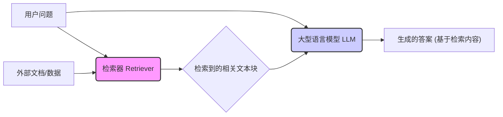
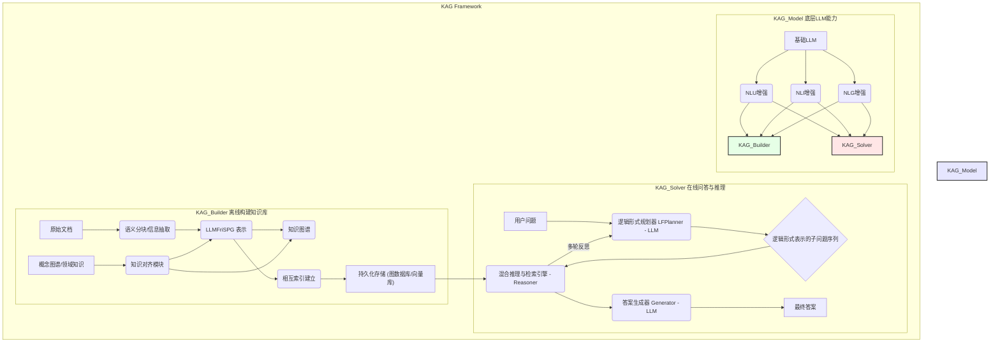

## AI论文解读 | KAG: Boosting LLMs in Professional Domains via Knowledge Augmented Generation
  
### 作者  
digoal  
  
### 日期  
2025-05-15  
  
### 标签  
PostgreSQL , PolarDB , DuckDB , AI , 论文解读  
  
----  
  
## 背景  
https://arxiv.org/pdf/2409.13731  
  
提示:  
```  
读懂《KAG: Boosting LLMs in Professional Domains via Knowledge Augmented Generation》这篇论文需要提前掌握哪些基础知识, 请给我讲一下这些基础知识, 尽量通熟易懂, 可以使用markdown支持的图形增加解释性.  
  
通熟易懂的解读《KAG: Boosting LLMs in Professional Domains via Knowledge Augmented Generation》这篇论文, 关键内容请深入讲解, 可以使用markdown支持的图形增加解释性.  
  
提取《KAG: Boosting LLMs in Professional Domains via Knowledge Augmented Generation》论文中一些重要的术语并详细解释, 可以使用markdown支持的图形示增加解释性.  
```  
  
## 1 前置知识  

理解《KAG: Boosting LLMs in Professional Domains via Knowledge Augmented Generation》这篇论文，你需要提前掌握一些核心的人工智能和自然语言处理概念。这篇论文主要探讨了一种名为KAG（Knowledge Augmented Generation）的框架，旨在通过结合知识图谱（KG）和向量检索的优势来增强大型语言模型（LLM）在专业领域的能力，以克服现有检索增强生成（RAG）技术的一些局限性。  

以下是你需要了解的基础知识：

### 1\. 大型语言模型 (Large Language Models, LLMs)

  * **是什么？**
    大型语言模型是深度学习模型，通常基于Transformer架构，经过海量文本数据训练而成。它们能够理解和生成类似人类的文本。
      * *简单比喻：* 想象一个超级聪明的“文字自动补全”工具，但它不仅能补全单词，还能写出完整的段落、回答问题、翻译语言等。
  * **核心机制：**
    它们的核心机制通常是“下一个词预测”。通过阅读大量文本，模型学会了在给定前面的词语序列后，预测最有可能出现的下一个词是什么。通过不断重复这个过程，就能生成连贯的文本。
  * **能力：**
      * 文本生成：写文章、故事、诗歌等。
      * 问答：回答用户提出的问题。
      * 翻译：在不同语言之间进行翻译。
      * 摘要：将长文本概括为短小的摘要。
      * 情感分析：判断文本表达的情感（如积极、消极）。
  * **局限性：**
      * 知识截止：LLM的知识通常仅限于其训练数据的时间范围，对于最新的信息可能不知晓。
      * 幻觉 (Hallucination)：有时会生成听起来合理但实际上是错误或无中生有的信息。
      * 领域专业性不足：在特定专业领域，可能缺乏深度和准确性。

### 2\. 检索增强生成 (Retrieval-Augmented Generation, RAG)

  * **是什么？**
    RAG是一种将信息检索系统与大型语言模型结合起来的技术。   它的目的是让LLM在生成答案之前，先从一个外部知识库（如文档集合、数据库）中检索相关的最新信息，并将这些信息作为上下文提供给LLM，从而生成更准确、更可靠的答案。  

  * **为什么需要RAG？**
    主要为了解决LLMs的知识截止和幻觉问题，通过提供外部知识来增强其回答的准确性和时效性。  

  * **工作流程示意图：**

    ```mermaid
    graph LR
        A[用户问题] --> B(检索器 Retriever);
        C[外部知识库/文档] --> B;
        B --> D{检索到的相关信息};
        A --> E(大型语言模型 LLM);
        D --> E;
        E --> F[生成的答案];
    ```

  * **局限性 (KAG论文中提到的)：**

      * 向量相似性与知识推理相关性的差距：仅仅基于向量相似度检索到的文本块，可能在逻辑上与问题所需推理的知识并不完全吻合。  
      * 对知识逻辑不敏感：RAG可能难以处理数值、时间关系、专家规则等需要精确逻辑推理的知识。  

### 3\. 知识图谱 (Knowledge Graphs, KGs)

  * **是什么？**
    知识图谱是一种用图结构来表示知识的方式。它由节点（表示实体，如人、地点、概念）和边（表示实体之间的关系）组成。  
      * *基本单元：* 通常是SPO三元组，即主体（Subject）、谓词（Predicate）、客体（Object），例如：（张三，职业，工程师）。  
  * **优势：**
      * 明确的语义：实体和关系都有明确的类型和含义。  
      * 结构化知识：知识以结构化的方式存储，便于机器理解和处理。
      * 推理能力：可以基于图谱中的连接进行推理，发现隐含的知识。  
      * 减少冗余：通过实体规范化（将不同表述但指代同一实体的内容统一起来）可以减少信息冗余。  
  * **查询：**
    可以使用如SPARQL或SQL等查询语言来精确检索知识图谱中的信息。  
  * **在KAG中的作用：**
    KAG框架旨在充分利用知识图谱的这些优势，特别是其结构化和推理能力，来弥补RAG在专业领域的不足。  

### 4\. 向量检索与嵌入 (Vector Retrieval & Embeddings)

  * **嵌入 (Embeddings)：**
    是将文本（单词、句子、文档）转换为数值向量的过程。这些向量能够捕捉文本的语义信息。语义上相似的文本，其对应的向量在向量空间中的距离也更近。
  * **向量检索：**
    当用户提出一个查询时，先将查询转换为一个查询向量，然后在向量数据库中搜索与这个查询向量最相似的文本向量（通常通过计算余弦相似度等指标）。  
  * **与RAG和KAG的关系：**
    向量检索是RAG中“检索”步骤的核心技术之一。   KAG也利用向量检索，但试图通过知识图谱来增强和引导这个过程，使其不仅仅依赖文本相似性。

### 5\. 核心自然语言处理 (NLP) 概念

论文中提到了KAG模型需要提升LLM在以下三个方面的能力  ：

  * **自然语言理解 (Natural Language Understanding, NLU)：**
    指机器理解人类语言的能力。KAG论文中提及的NLU任务包括文本分类、命名实体识别（识别文本中的人名、地名、组织名等）、关系抽取（识别实体间的关系）、事件抽取等。  
  * **自然语言推理 (Natural Language Inference, NLI)：**
    指判断两个文本片段之间是否存在某种逻辑关系（如蕴含、矛盾、中立）。在KAG中，NLI用于推断短语间的语义关系，如上下位关系（isA）、部分-整体关系（isPartOf）等，这对于知识对齐非常重要。  
  * **自然语言生成 (Natural Language Generation, NLG)：**
    指机器生成自然、流畅、有意义的人类语言文本的能力。  

### 6\. 机器学习基础概念

  * **微调 (Fine-tuning)：**
    指在一个已经在大型通用数据集上预训练好的模型（如LLM）的基础上，使用一个更小、更特定领域的数据集进行进一步训练，以使模型适应特定任务或领域。  
  * **评估指标 (Evaluation Metrics)：**
    用于衡量模型性能的指标。论文中提到了：
      * **F1分数 (F1 Score)：** 综合考虑了查准率（Precision）和查全率（Recall）的指标，常用于评估分类和信息提取任务。  
      * **精确匹配 (Exact Match, EM)：** 衡量模型生成的答案与标准答案完全一致的比例。  
      * **召回率 (Recall)：** 衡量模型找出所有相关信息的能力。  

掌握了以上这些基础知识后，你将能更好地理解KAG论文的研究动机、方法论以及它所要解决的问题和贡献。论文的核心在于如何更智能地结合LLM的生成能力、向量检索的高效性以及知识图谱的结构化推理能力，以提升在专业知识服务中的表现。

## 2 解读论文  
  
好的，我们来通俗易懂地解读一下这篇名为《KAG: Boosting LLMs in Professional Domains via Knowledge Augmented Generation》的论文。

**论文核心思想一句话概括：**

这篇论文提出了一个叫做 **KAG (Knowledge Augmented Generation，知识增强生成)** 的新框架，目的是让大型语言模型 (LLM) 在处理金融、医疗、法律等专业领域问题时，能够更准确、更懂逻辑、更专业。它通过巧妙地结合**知识图谱 (KG)** 的结构化知识和**向量检索**的快速查找能力，来克服现有 **RAG (Retrieval-Augmented Generation，检索增强生成)** 技术的一些不足。

**为什么需要 KAG？现有 RAG 有什么痛点？**

我们先来理解一下 RAG。想象一下，你让一个很博学的 LLM (比如 ChatGPT) 回答一个非常专业或最新的问题。它可能因为知识库里没有相关信息而“瞎编乱造”(这叫“幻觉”)，或者给出的答案不够深入。

RAG 就像给这个 LLM 配备了一个强大的搜索引擎：当 LLM 遇到问题时，它先去一个庞大的资料库里搜索相关的几段文字，然后把这些文字作为参考，再结合自己的理解来生成答案。这在一定程度上解决了幻觉和知识老旧的问题。



**RAG 的痛点 (KAG 要解决的)：**

1.  **“相似”不等于“相关”：** RAG 通常靠计算问题和文档片段的“文本相似度”(向量相似性)来找参考资料。但有时候，文本表面上相似，逻辑上却不一定是最能回答问题的。尤其在专业领域，可能需要更深层次的逻辑关联。
2.  **对“知识逻辑”不敏感：** RAG 检索到的可能是一堆文本片段，LLM 需要自己去理解其中的逻辑关系，比如数值比较、时间顺序、因果关系、专家规则等。这对于需要严谨逻辑的专业领域来说，LLM 可能会“力不从心”，导致答案不够精确或缺乏专业性。

**KAG 框架：五大核心支柱**

KAG 框架就像 RAG 的一个“专业升级版”，它引入了知识图谱来弥补上述不足。知识图谱是一种用点 (实体) 和线 (关系) 来表示知识的网络，它天生就擅长表达结构化信息和逻辑关系。

KAG 通过以下五个关键方面来增强 LLM 和知识图谱：

1.  **LLM 友好的知识表示 (LLM-friendly knowledge representation - LLMFriSPG)：**

      * **深入讲解：** KAG 提出了一种名为 `LLMFriSPG` 的知识表示框架。我们知道，知识图谱 (KG) 通常用一种叫做“属性图 (Property Graph, PG)”的方式存储，比如 SPG (Standard for Property Graphs)。但传统的属性图可能不太方便 LLM 直接理解和使用。`LLMFriSPG` 对 SPG 进行了升级，使其更“亲近”LLM。
          * **分层思想 (DIKW)：** 借鉴了数据 (Data) -\> 信息 (Information) -\> 知识 (Knowledge) -\> 智慧 (Wisdom) 的金字塔模型 (见论文图3)。它将知识图谱中的内容分为不同层次：
              * `RC (Raw Chunks)`: 原始的文本块、摘要、描述。这是最基础的，完整性高，但专业性可能较低。
              * `KGfr (Graph Information Layer)`: 通过信息抽取技术从文本中提取出的实体、关系等图结构数据。这层是信息层，可以半结构化或无结构化。
              * `KGcs (Knowledge Layer)`: 经过领域专家定义、符合严格模式约束、并经过整合评估的结构化知识。这层专业性、准确性和严谨性最高，但构建成本也高。
          * **动态与静态属性：** 允许实体类型同时拥有预先定义的“静态”属性 (来自专家知识，如 `KGcs`) 和临时添加的“动态”属性 (来自文本抽取，如 `KGfr`)。这样既能保证专业决策的严谨性，又能兼顾信息检索的灵活性。
          * **与文本上下文的深度感知：** 实体和关系都带有更丰富的文本描述信息 (如 `description`, `summary`)，帮助 LLM 更好地理解其含义。

      

    ```mermaid
    graph TD
        subgraph LLMFriSPG 知识层次  类似 DIKW
            C["KGcs - 知识层 (强模式约束, 高专业性)"] --> B;
            B["KGfr - 信息层 (图结构信息, 自动抽取)"] --> A;
            A["RC - 原始文本块层 (高完整性)"];
        end
        D{用户需求: 专业性 vs. 易用性};
        D -- 高专业性要求 --> C;
        D -- 高检索效率/容错性 --> B;
        D -- 高信息完整性 --> A;

        style C fill:#add,stroke:#333,stroke-width:2px
        style B fill:#dda,stroke:#333,stroke-width:2px
        style A fill:#dad,stroke:#333,stroke-width:2px
    ```

      * **意义：** 这种表示方法让 LLM 更容易理解和利用知识图谱中的结构化信息，并能将这些信息与原始文本联系起来。

2.  **知识图谱与原始文本块的相互索引 (Mutual-indexing)：**

      * **深入讲解：** 这一步的目标是在知识图谱的结构化信息 (实体、关系) 和它们来源的原始文本块 (chunks) 之间建立双向链接。想象一下，知识图谱中的一个实体“某公司”，它不仅有自己的属性和关系，还能直接链接到提到这个公司的所有原始文档段落。
          * **构建过程 (KAG-Builder的一部分，见论文图4)：**
            1.  **语义分块 (Semantic Chunking)：** 将原始文档按照语义和长度约束切分成有意义的文本块。
            2.  **信息抽取 (Information Extraction)：** 利用 LLM 从文本块中抽取实体、事件、关系等，构建初步的 `KGfr`。同时为抽取的实体生成描述、摘要等。
            3.  **知识对齐 (Knowledge Alignment)：** 利用概念图谱等对抽取出的实体进行标准化、消歧（比如“苹果公司”和“Apple Inc.”指向同一个实体），并补充实体间的语义关系。
            4.  **存储：** 将图结构存入图数据库，文本和向量存入向量数据库。
      * **意义：** 使得图谱中的每个节点或关系都有据可查，可以追溯到原始文本上下文。反过来，也可以通过文本块快速定位到相关的图谱结构。这为后续的混合推理提供了基础。

3.  **逻辑形式引导的混合推理引擎 (Logical-form-guided hybrid reasoning engine - Logical Form Solver)：**

      * **深入讲解：** 这是 KAG 的“大脑”，负责理解用户问题并找到答案。传统 RAG 中，LLM 与检索器的交互通常基于自然语言，这可能导致歧义。KAG 引入了“逻辑形式 (Logical Form)”——一种更精确、结构化的方式来表达问题和推理步骤。
          * **灵感来源：** 知识图谱问答 (KGQA) 技术，常将自然语言问题转换为逻辑查询语句。
          * **工作流程 (见论文图6和算法1)：**
            1.  **规划 (Planning)：** LLM (LFPlanner) 将用户的自然语言问题分解成一个或多个子问题，并为每个子问题生成一个“逻辑形式”的表示。这个逻辑形式可能包含检索操作、数学计算、逻辑推断等。
                  * 例如，问题：“2011年C罗效力的球队中，哪支成立最晚？”
                  * Step1: 找出C罗2011年效力的球队 (逻辑形式可能类似 `Retrieval(subject='C罗', predicate='效力于', object_type='球队', condition='年份=2011')`)。
                  * Step2: 找出这些球队的成立年份 (逻辑形式可能类似 `Retrieval(subject='[Step1结果]', predicate='成立年份', object_type='年份')`)。
                  * Step3: 比较年份，找出最晚的 (逻辑形式可能类似 `Sort(data='[Step2结果]', by='年份', order='desc', limit=1)`)。
            2.  **推理与检索 (Reasoning & Retrieval)：** `Reasoner` 模块根据逻辑形式执行操作。这可能是：
                  * **图谱检索 (GraphRetrieval)：** 直接在知识图谱 (`KGcs` 或 `KGfr`) 中进行结构化查询。
                  * **混合检索 (HybridRetrieval)：** 结合图谱信息和文本向量检索 (`RC`)，或者当图谱中没有直接答案时，进行更广泛的文本搜索。
                  * **数值计算、逻辑运算等。**
            3.  **生成 (Generation)：** `Generator` (通常是 LLM) 根据推理和检索的结果，生成最终答案。
            4.  **多轮反思 (Multi-turn Reflection)：** 如果一轮下来问题没解决或信息不足，系统会“反思”已有的结果，可能会重新规划问题 (生成补充问题)，进入下一轮迭代，直到找到满意答案或达到最大迭代次数。
      * **逻辑形式的函数 (论文表1)：** KAG 定义了一些逻辑函数，如 `Retrieval` (检索SPO), `Sort` (排序), `Math` (数学运算), `Deduce` (推断关系如蕴含、大于、等于), `Output` (输出结果)。
      * **意义：** 使得问题分解和推理过程更严谨、可解释，并且能够灵活地结合知识图谱的精确查询和传统 RAG 的文本检索。

4.  **基于语义推理的知识对齐 (Knowledge alignment with semantic reasoning)：**

      * **深入讲解：** 即使从文本中抽取了实体和关系，它们也可能存在语义模糊、粒度不一致、缺乏关联等问题。知识对齐就是要把这些“零散”的知识点通过语义关系“串联”起来，形成一个更规范、更互联的知识网络。
          * **核心工具：概念图谱 (Concept Graph) 和语义关系 (论文表2)。**
              * 概念图谱包含领域内的核心概念及其层级关系 (如：“轿车” isA “汽车”，“轮子” isPartOf “汽车”)。
              * 语义关系包括：同义词 (synonym), 上下位 (isA), 整体部分 (isPartOf/contains), 实例归属 (belongTo), 因果 (causes) 等。
          * **应用阶段：**
              * **离线索引增强 (Enhance Indexing - KAG-Builder阶段，见论文图5)：**
                1.  **实例消歧与融合：** 识别并合并指向同一真实世界实体的不同表述。
                2.  **实例与概念链接：** 将抽取到的实体链接到概念图谱中的概念节点上 (如：将实体“特斯拉Model 3”链接到概念“电动汽车”)。
                3.  **概念间关系补全：** 自动补全概念之间的层级关系等。
              * **在线检索增强 (Enhance Retrieval - KAG-Solver阶段)：** 当用户查询中的词语或类型在知识库中没有精确匹配时，可以通过语义关系进行扩展。
                  * 例如，用户问“白内障患者可以去哪些公共场所休闲？” 知识库里可能没有直接关于“白内障患者”的信息，但有关于“视力障碍人士”的信息。如果系统知道“白内障患者” isA “视力障碍人士”，就能找到相关的答案。
      * **意义：** 提高了知识的标准化程度和连通性，使得检索更精准，推理路径更符合逻辑。

5.  **KAG 的模型能力增强 (Model capability enhancement for KAG - KAG-Model)：**

      * **深入讲解：** KAG 框架的各个模块（如信息抽取、问题理解、逻辑形式生成、答案总结等）都依赖于强大的 LLM 能力。因此，KAG 也关注如何针对性地提升 LLM 在三个基础 NLP 能力上的表现 (见论文图7)：
          * **自然语言理解 (NLU)：** 例如，通过在多种 NLU 数据集上进行指令微调 (Instruction Fine-tuning)，使用标签分桶 (label bucketing)、灵活多样的输入输出格式、带任务指南的指令等策略，让 LLM 更准确地识别实体、关系、意图。
          * **自然语言推理 (NLI)：** 例如，收集高质量的概念知识库和本体，构建包含多种概念推理指令的训练集，增强 LLM 对语义关系 (如 isA, isPartOf) 的判断能力。
          * **自然语言生成 (NLG)：**
              * **K-LoRA：** 将“从文本中提取知识”的过程反过来，训练 LLM 从知识三元组生成符合领域风格的文本。
              * **基于知识图谱反馈的对齐 (Alignment with KG Feedback, AKGF)：** 类似于强化学习中的奖励机制，让知识图谱充当“裁判”，评估 LLM 生成答案的知识正确性，并据此优化模型。
          * **OneGen (One-pass Unified Generation and Retrieval)：** 论文还提到了一种更高效的模式，试图将检索和生成统一到一个模型的前向传播过程中，减少多模型串联的复杂性和损耗。
      * **意义：** 通过专门优化 LLM 在 NLU, NLI, NLG 上的能力，KAG 框架的整体性能得到保障和提升。

**KAG 整体框架图 (简化版，基于论文图1)：**



**实验与应用：**

  * 论文在多个复杂问答数据集 (如 HotpotQA, 2WikiMultiHopQA) 上进行了实验，结果显示 KAG 相比之前的 RAG 方法 (如 HippoRAG) 在 F1 值和精确匹配率 (EM) 上都有显著提升。
  * KAG 还在蚂蚁集团的两个实际专业问答场景中得到了应用并取得了良好效果：
      * **电子政务问答：** 回答用户关于办事流程、所需材料等问题。
      * **电子健康问答：** 回答关于疾病、症状、治疗方案等问题。
        这些应用证明了 KAG 在提升专业领域问答准确性和可信度方面的潜力。

**局限性：**

论文也坦诚地指出了 KAG 目前的一些局限性：

1.  **LLM 调用次数多：** 在构建和推理过程中可能需要多次调用 LLM，带来计算和经济开销。
2.  **复杂问题分解规划能力要求高：** 当前依赖 LLM 进行问题分解和规划，但对于特别复杂的问题，LLM 的规划能力仍有待提升。
3.  **知识对齐挑战：** 尽管知识对齐有所改进，但从开放信息抽取 (OpenIE) 中获得的知识的准确性和一致性仍是挑战。

**总结：**

KAG 框架通过深度融合知识图谱的结构化优势和 LLM 的强大理解生成能力，为提升大型语言模型在专业领域的表现提供了一个富有前景的解决方案。它不仅仅是简单地把知识图谱作为 RAG 的一个外部知识源，而是从知识表示、索引、推理到模型能力本身都进行了精心设计和优化，力求让 LLM 能够更“懂行”、更“讲逻辑”。

希望这个解读能帮助你更好地理解这篇论文！

## 3 术语  
  
  

**重要术语解释 (基于 KAG 论文)**

以下术语对于理解 KAG 框架及其贡献至关重要：

1.  **KAG (Knowledge Augmented Generation - 知识增强生成)**

      * **核心定义：** KAG 是论文提出的核心框架，旨在通过深度融合知识图谱 (KG) 和向量检索的优势，来增强大型语言模型 (LLM) 在专业领域（如金融、医疗、法律）的知识推理和生成能力。
      * **为何重要：** 它旨在解决传统检索增强生成 (RAG) 技术在处理复杂逻辑、数值、时序关系以及专业知识时的局限性，提升答案的准确性、专业性和逻辑严谨性。
      * **工作方式概述：** KAG 通过五个关键方面实现这一目标：LLM友好的知识表示、知识图谱与文本块的相互索引、逻辑形式引导的混合推理引擎、基于语义推理的知识对齐、以及针对KAG优化的LLM模型能力。

      

    ```mermaid
    graph LR
        subgraph KAG框架核心理念
            LLM((LLM))
            KG[(知识图谱 KG)]
            VecRet[(向量检索)]
            ProfDom[专业领域应用]

            LLM -- 增强 --> ProfDom
            KG -- 赋能 --> LLM
            VecRet -- 辅助 --> LLM
        end
        KAG_Framework[KAG 框架] --> KAG框架核心理念
    ```

2.  **RAG (Retrieval-Augmented Generation - 检索增强生成)**

      * **核心定义：** 一种主流技术，它首先从一个大型的外部知识库（如文档集合）中检索与用户查询相关的文本片段，然后将这些片段作为上下文信息提供给大型语言模型 (LLM)，辅助LLM生成更准确、更具事实性的答案。
      * **为何重要：** RAG 是 KAG 框架的基础和对比对象。理解 RAG 的工作原理和局限性，才能更好地理解 KAG 的创新点和价值。
      * **KAG 视角下的局限性：** 论文指出 RAG 的局限性包括：向量相似性与知识推理相关性之间存在差距；对知识逻辑（如数值、时序关系、专家规则）不敏感。

3.  **LLMFriSPG (LLM Friendly Standard for Property Graphs - LLM友好的属性图标准)**

      * **核心定义：** KAG 提出的一个对 LLM 更友好的知识表示框架，它是对属性图标准 (SPG) 的升级。它强调知识的层次化、动态与静态属性的结合，以及与文本上下文的深度感知。
      * **为何重要：** 为了让 LLM 能够更有效地理解和利用结构化的知识图谱数据，需要一种专门设计的表示方式。
      * **关键特征 (基于论文图2和图3)：**
          * **知识分层 (DIKW启发)：**
              * `RC (Rawtext Chunks)`: 原始文本块、摘要、描述层，提供最原始、最完整的上下文。
              * `KGfr (Graph Information Layer)`: 通过信息抽取从 RC 中得到的实体、关系等图结构信息，可以是无模式或半模式的。
              * `KGcs (Knowledge Layer)`: 符合领域模式约束、经过专家校验和整合的结构化知识，具有高准确性和严谨性。
          * **文本上下文感知：** 实体和关系都带有丰富的描述性文本 (如 `description`, `summary`)，帮助 LLM 理解其确切含义。
          * **动态与静态属性共存：** 允许一个实体类型同时拥有预定义的静态属性 (来自 `KGcs`) 和通过信息抽取实时添加的动态属性 (来自 `KGfr`)。

      

    ```mermaid
    graph TD
        subgraph LLMFriSPG层次结构
            direction TB
            Layer_KGcs["KGcs: 知识层 (专家定义, 强模式)"]
            Layer_KGfr["KGfr: 信息层 (自动抽取, 图结构)"]
            Layer_RC["RC: 原始文本层 (上下文来源)"]
            Layer_KGcs --> Layer_KGfr
            Layer_KGfr --> Layer_RC
        end
        LLMFriSPG --> LLMFriSPG层次结构
        LLMFriSPG --> Feature1[文本上下文感知]
        LLMFriSPG --> Feature2[动/静态属性共存]

        style Layer_KGcs fill:#c9ffc9,stroke:#333
        style Layer_KGfr fill:#ffffcc,stroke:#333
        style Layer_RC fill:#ffcccc,stroke:#333
    ```

4.  **Mutual Indexing (知识图谱与原始文本块的相互索引)**

      * **核心定义：** 在知识图谱的结构化信息（实体、关系）和它们所来源的原始文本块 (chunks) 之间建立双向的、可追溯的链接机制。
      * **为何重要：** 使得知识图谱中的每个元素都有据可查，可以回溯到原始上下文，同时也为LLM提供了更丰富的、与图结构关联的文本信息。
      * **工作方式概述：** 在构建知识库 (KAG-Builder) 时，从文档中提取信息构建图谱的同时，记录这些信息片段与原始文本块的对应关系。例如，一个实体节点会关联到所有包含该实体提及的文本块。

      

    ```mermaid
    graph LR
        KG_Node["知识图谱节点/关系 E.g., (公司A, CEO, 张三)"]
        Text_Chunk1["文本块1: ...公司A宣布张三为新任CEO..."]
        Text_Chunk2["文本块2: ...张三此前在公司B任职，后加入公司A..."]

        KG_Node -- 来源于/支持证据 --> Text_Chunk1
        KG_Node -- 来源于/支持证据 --> Text_Chunk2
        Text_Chunk1 -- 包含图谱信息 --> KG_Node
        Text_Chunk2 -- 包含图谱信息 --> KG_Node

        style KG_Node fill:#lightblue
        style Text_Chunk1 fill:#lightyellow
        style Text_Chunk2 fill:#lightyellow
    ```

5.  **Logical Form Solver (逻辑形式引导的混合推理引擎)**

      * **核心定义：** KAG 中负责执行复杂问答和推理的核心组件。它将用户的自然语言问题首先通过 `LFPlanner` (逻辑形式规划器，通常由LLM担任) 转化为一系列结构化的“逻辑形式”(Logical Forms) 表达式。
      * **为何重要：** 克服了传统RAG中仅依赖自然语言交互可能带来的模糊性和逻辑处理能力的不足，使得推理过程更精确、可解释和强大。
      * **工作流程 (基于论文图6和算法1)：**
        1.  **规划 (Planning)：** LLM 将问题分解为子问题，并为每个子问题生成对应的逻辑形式 (如 `Retrieval`, `Math`, `Sort`, `Deduce` 等操作)。
        2.  **推理与检索 (Reasoning & Retrieval)：** `Reasoner` 模块执行这些逻辑形式。它可以调用：
              * `GraphRetrieval`：在知识图谱中进行精确的结构化查询。
              * `HybridRetrieval`：结合图谱信息、文本向量检索原始文本块。
              * 其他操作如数值计算。
        3.  **生成 (Generation)：** `Generator` (LLM) 根据推理和检索的结果汇总并生成最终答案。
        4.  **多轮反思 (Multi-turn Reflection)：** 如果一轮未能解决问题，系统会评估当前结果，可能生成补充问题并启动新一轮规划和推理。

      

    ```mermaid
    graph TD
        A[用户问题] --> B(LFPlanner: LLM进行问题分解和逻辑形式生成);
        B --> C{逻辑形式序列};
        C --> D(Reasoner: 执行逻辑形式);
        D -- KG查询 --> E[(知识图谱 KG)];
        D -- 文本检索 --> F[(文本块 RC)];
        D -- 数值/逻辑运算 --> G[计算/判断];
        H{推理/检索结果} --> I(Generator: LLM生成答案);
        I --> J[最终答案];
        subgraph 多轮迭代
            direction LR
            D -- 信息不足/未解决 --> K(Reflection: 评估并生成补充问题);
            K --> B;
        end
        style B fill:#ccf
        style D fill:#cfc
        style I fill:#fcc
    ```

6.  **Knowledge Alignment (基于语义推理的知识对齐)**

      * **核心定义：** 利用语义推理（如判断同义、上下位、包含等关系）来标准化、连接和丰富通过信息抽取获得的知识，以及在检索时弥合用户查询与知识库之间的语义鸿沟。
      * **为何重要：** 原始抽取的信息可能存在噪声、粒度不一、语义模糊等问题。知识对齐能提高知识库的质量和连通性，使检索更精准，推理更可靠。
      * **关键手段 (基于论文2.4节和图5)：**
          * **概念图谱 (Concept Graph)：** 包含领域核心概念及其语义关系（如 `isA`, `isPartOf`），作为对齐的参照系。
          * **语义关系预测：** LLM 预测实体/概念间的语义关系 (如论文表2中的 `synonym`, `isA`, `contains`, `causes`, `belongTo` 等)。
          * **离线索引增强：** 在构建知识库时，进行实体消歧与融合、实例与概念的链接、概念间关系的补全。
          * **在线检索增强：** 当精确匹配失败时，利用语义关系扩展查询。例如，查询“笔记本电脑”，可以扩展到其下位概念“轻薄本”、“游戏本”，或其上位概念“计算机设备”。

7.  **KAG-Model (KAG 模型能力增强)**

      * **核心定义：** 指 KAG 框架为了支撑其复杂的构建和推理过程，对基础 LLM 在自然语言理解 (NLU)、自然语言推理 (NLI) 和自然语言生成 (NLG) 这三个核心能力上进行的针对性优化和增强。
      * **为何重要：** KAG 框架的各个组件的性能高度依赖于 LLM 的这些基础能力。提升这些能力可以直接转化为 KAG 整体性能的提升。
      * **增强方法举例：**
          * **NLU 增强：** 通过大规模指令重构、标签分桶、灵活输入输出格式、任务指南等方法微调模型，提升实体识别、关系抽取等准确性。
          * **NLI 增强：** 利用高质量概念知识库构建训练数据，提升模型对深层语义关系的推理能力。
          * **NLG 增强：**
              * `K-LoRA`: 通过“三元组到文本”的逆向任务微调，使模型学习领域特有表达风格。
              * `AKGF (Alignment with KG Feedback)`: 将知识图谱作为外部评估器，对LLM生成的答案进行事实性打分，并据此优化模型。
          * `OneGen`: 探索单遍统一生成与检索模型，以提高效率。

8.  **OpenIE (Open Information Extraction - 开放信息抽取)**

      * **核心定义：** 一种自动从自然语言文本中抽取结构化信息（通常是实体间的关系三元组，如 \<主体, 关系, 客体\>）的技术，它不需要预先定义固定的模式或关系类型。
      * **为何重要：** OpenIE 是构建大规模知识图谱（尤其是 `KGfr` 层）的一种常用手段，因为它门槛较低。但其抽取结果往往包含噪声、不一致和不完整的信息，因此 KAG 强调需要通过“知识对齐”等后续步骤来提升其质量。

-----

希望以上解释能帮助你更深入地理解 KAG 论文中的核心概念！这些术语共同构成了 KAG 框架的理论基础和技术路径。
  
## 参考  
  
https://arxiv.org/pdf/2409.13731   
  
https://github.com/OpenSPG/KAG  
  
  
<b> 以上内容基于DeepSeek、QwQ及诸多AI生成, 轻微人工调整, 感谢杭州深度求索人工智能、阿里云等公司. </b>  
  
<b> AI 生成的内容请自行辨别正确性, 当然也多了些许踩坑的乐趣, 毕竟冒险是每个男人的天性.  </b>  
  
  
  
#### [期望 PostgreSQL|开源PolarDB 增加什么功能?](https://github.com/digoal/blog/issues/76 "269ac3d1c492e938c0191101c7238216")
  
  
#### [PolarDB 开源数据库](https://openpolardb.com/home "57258f76c37864c6e6d23383d05714ea")
  
  
#### [PolarDB 学习图谱](https://www.aliyun.com/database/openpolardb/activity "8642f60e04ed0c814bf9cb9677976bd4")
  
  
#### [PostgreSQL 解决方案集合](../201706/20170601_02.md "40cff096e9ed7122c512b35d8561d9c8")
  
  
#### [德哥 / digoal's Github - 公益是一辈子的事.](https://github.com/digoal/blog/blob/master/README.md "22709685feb7cab07d30f30387f0a9ae")
  
  
#### [About 德哥](https://github.com/digoal/blog/blob/master/me/readme.md "a37735981e7704886ffd590565582dd0")
  
  

  
