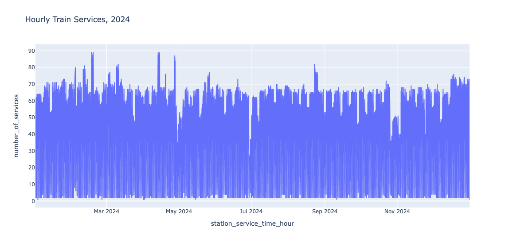
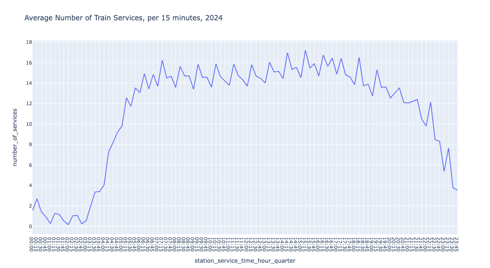
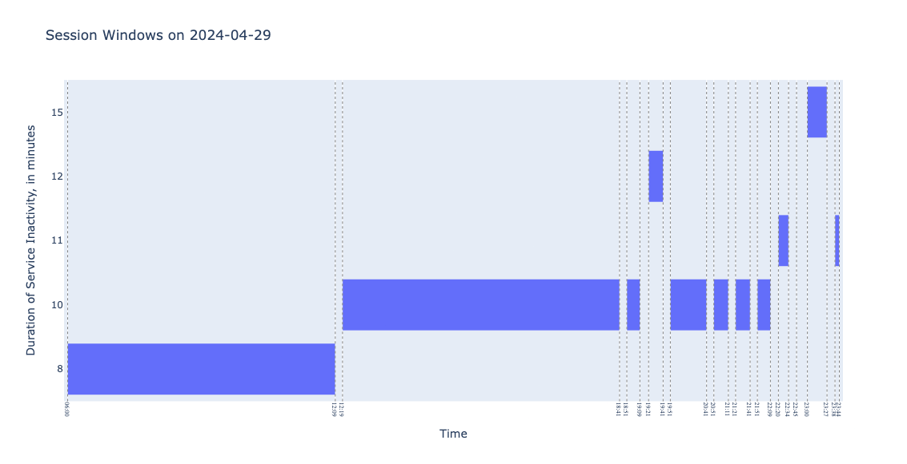

## DuckDB 流窗口函数应用实践  
        
### 作者        
digoal        
        
### 日期        
2025-05-22        
        
### 标签        
PostgreSQL , PolarDB , DuckDB , window , 窗口 , 滚动窗口 , 跳跃窗口, 滑动窗口 , 会话窗口   
        
----        
        
## 背景        
翻译自原文: https://duckdb.org/2025/05/02/stream-windowing-functions.html  
    
简而言之：DuckDB 可以使用具有不同语义的窗口（例如，滚动窗口、跳跃窗口和滑动窗口）执行基于时间的分析。在本文中，我们通过检测阿姆斯特丹中央火车站铁路服务的趋势和异常来演示这些功能。  
  
## 介绍  
在数据平台中，我们通常将数据分为维度数据和事实数据。维度包含实体信息（例如名称、地址、序列号等），而事实数据包含与这些实体相关的事件（例如点击次数、销售额、银行交易、物联网设备读数等）。通常，事实数据包含时间戳属性，表示事件发生（或被观察到）的时间。  
  
在流平台上处理带时间戳的数据时，通常会使用流窗口函数进行处理，以便将数据组织到时间窗口中。在本文中，我们将展示如何在 DuckDB 中将流窗口应用于静态带时间戳的事实数据，作为数据分析任务的一部分，以计算阿姆斯特丹中央火车站的列车服务摘要、趋势和中断情况。  
  
在以后的文章中，我们将介绍使用 DuckDB 的流设计模式。  
  
就目前的实现而言，我们将使用 dbt 项目中创建的 DuckDB 数据库，该数据库详见文章“使用 dbt 和 DuckDB 进行完全本地数据转换”。该数据库基于Rijden de Treinen （火车还在运行吗？）应用程序的开放数据。我们首先（在任何 DuckDB 会话中）从我们的存储位置连接数据库。  
```  
ATTACH 'http://blobs.duckdb.org/data/dutch_railway_network.duckdb';  
USE dutch_railway_network.main_main;  
```  
  
### 警告  
  
该数据库相当大（约 1.2 GB），因此请确保网络连接稳定。除了附加数据库之外，您还可以下载数据库文件并通过命令行连接到它：  
```  
duckdb dutch_railway_network.duckdb -cmd 'USE main_main'  
```  
  
## 滚动窗口  
滚动窗口是固定大小（左闭右开）的时间间隔，用于计算特定时间单位（年、日、小时等）的摘要。滚动窗口也用于将（不规则的）事实数据按固定的时间间隔聚合，从而将其转换为时间序列数据。  
  
类似划好格子, 把记录放进对应格子, 一条数据不能跨格子存在.    
  
实现滚动窗口的一种方法是使用date_trunc函数，它将时间戳截断到指定的精度。例如，在下面的代码中，我们检索了 `2024 年每天每小时` 的服务数量：  
```  
SELECT  
    date_trunc('hour', station_service_time) AS window_start,  
    window_start + INTERVAL 1 HOUR AS window_end,  
    count(*) AS number_of_services  
FROM ams_traffic_v  
WHERE year(station_service_time) = 2024  
GROUP BY ALL  
ORDER BY 1;  
  
┌─────────────────────┬─────────────────────┬────────────────────┐  
│    window_start     │     window_end      │ number_of_services │  
│      timestamp      │      timestamp      │       int64        │  
├─────────────────────┼─────────────────────┼────────────────────┤  
│ 2024-01-01 01:00:00 │ 2024-01-01 02:00:00 │                  2 │  
│ 2024-01-01 02:00:00 │ 2024-01-01 03:00:00 │                  3 │  
│ 2024-01-01 03:00:00 │ 2024-01-01 04:00:00 │                  4 │  
│          ·          │          ·          │                  · │  
│          ·          │          ·          │                  · │  
│          ·          │          ·          │                  · │  
│ 2024-12-31 20:00:00 │ 2024-12-31 21:00:00 │                  9 │  
│ 2024-12-31 21:00:00 │ 2024-12-31 22:00:00 │                  1 │  
│ 2024-12-31 23:00:00 │ 2025-01-01 00:00:00 │                  2 │  
├─────────────────────┴─────────────────────┴────────────────────┤  
│ 8781 rows (6 shown)                                  3 columns │  
└────────────────────────────────────────────────────────────────┘  
```  
  
    
  
另一种方法是使用time_bucket函数(该函数构造出bucket, 并根据字段值放入对应bucket内, 返回bucket的开始值.)，该函数将从指定的偏移量开始，将时间戳截断为指定的桶宽度。例如，我们计算每刻钟的服务数量，从以下位置开始：  
```  
SELECT  
    time_bucket(  
        INTERVAL 15 MINUTE, -- bucket width  
        station_service_time,  
        INTERVAL 0 MINUTE -- offset  
    ) AS window_start,  -- 该函数构造出bucket, 并根据字段值放入对应bucket内, 返回bucket的开始值.    
    window_start + INTERVAL 15 MINUTE as window_end,  
    count(*) AS number_of_services  
FROM ams_traffic_v  
WHERE year(station_service_time) = 2024  
GROUP BY ALL  
ORDER BY 1;  
  
┌─────────────────────┬─────────────────────┬────────────────────┐  
│    window_start     │     window_end      │ number_of_services │  
│      timestamp      │      timestamp      │       int64        │  
├─────────────────────┼─────────────────────┼────────────────────┤  
│ 2024-01-01 01:30:00 │ 2024-01-01 01:45:00 │                  1 │  
│ 2024-01-01 01:45:00 │ 2024-01-01 02:00:00 │                  1 │  
│ 2024-01-01 02:15:00 │ 2024-01-01 02:30:00 │                  2 │  
│          ·          │          ·          │                  · │  
│          ·          │          ·          │                  · │  
│          ·          │          ·          │                  · │  
│ 2024-12-31 20:45:00 │ 2024-12-31 21:00:00 │                  2 │  
│ 2024-12-31 21:00:00 │ 2024-12-31 21:15:00 │                  1 │  
│ 2024-12-31 23:45:00 │ 2025-01-01 00:00:00 │                  2 │  
├─────────────────────┴─────────────────────┴────────────────────┤  
│ 32932 rows (6 shown)                                 3 columns │  
└────────────────────────────────────────────────────────────────┘  
```  
  
时间桶函数会根据时间戳列本身生成桶，因此时间序列数据中可能存在间隙。如上结果所示，第一条记录为`2024-01-01 01:30:00`，因为该时间戳之前没有记录。  
  
由于滚动窗口是不重叠的区间，我们可以计算一些汇总信息，例如 15 分钟间隔内的平均列车服务数量。有趣的是，白天的列车服务数量相当稳定，但夜间却低得多——即使在阿姆斯特丹也是如此。  
  
    
  
## 跳跃窗口  
跳跃窗口是固定大小的时间间隔，但与滚动窗口相反，它是重叠的(窗口有交叉, 记录可能出现在多个窗口内.)。跳跃窗口的定义如下：  
- 窗口开始时间之间应经过多少时间，称为跳跃大小； 例如每5分钟开启一个新窗口.   
- 一个窗口应该包含多少时间，称为窗口大小。 例如每个窗口历经15分钟.   
  
跳跃窗口的一个用例是确定 2024 年内最繁忙的五个 15 分钟时段（窗口大小），每 5 分钟（跳跃大小）开始一次。我们首先为所有感兴趣的日期生成人工跳跃窗口：  
```  
WITH time_range AS (  
    SELECT  
        range AS window_start,  
        window_start + INTERVAL 15 MINUTE AS window_end  
    FROM range(  
        '2024-01-01 00:00:00'::TIMESTAMP,  
        '2025-01-01 00:00:00'::TIMESTAMP,  
        INTERVAL 5 MINUTE -- hopping size  
    )  
)  
  
┌─────────────────────┬─────────────────────┐  
│    window_start     │     window_end      │  
│      timestamp      │      timestamp      │  
├─────────────────────┼─────────────────────┤  
│ 2024-01-01 00:00:00 │ 2024-01-01 00:15:00 │  
│ 2024-01-01 00:05:00 │ 2024-01-01 00:20:00 │  
│ 2024-01-01 00:10:00 │ 2024-01-01 00:25:00 │  
│          ·          │          ·          │  
│          ·          │          ·          │  
│          ·          │          ·          │  
│ 2024-12-31 23:45:00 │ 2025-01-01 00:00:00 │  
│ 2024-12-31 23:50:00 │ 2025-01-01 00:05:00 │  
│ 2024-12-31 23:55:00 │ 2025-01-01 00:10:00 │  
├─────────────────────┴─────────────────────┤  
│ 105408 rows (6 shown)           2 columns │  
└───────────────────────────────────────────┘  
```  
  
然后，我们将上述间隔与火车服务数据结合起来，以计算每个`[左闭，右开]`间隔的服务数量：  
```  
SELECT  
    window_start,  
    window_end,  
    count(service_sk) AS number_of_services  
FROM ams_traffic_v  
INNER JOIN time_range AS ts  
    ON station_service_time >= ts.window_start  
        AND station_service_time < ts.window_end  
GROUP BY ALL  
ORDER BY 3 DESC, 1 ASC  
LIMIT 5;  
```  
  
返回：  
```  
┌─────────────────────┬─────────────────────┬────────────────────┐  
│    window_start     │     window_end      │ number_of_services │  
│      timestamp      │      timestamp      │       int64        │  
├─────────────────────┼─────────────────────┼────────────────────┤  
│ 2024-02-17 10:25:00 │ 2024-02-17 10:40:00 │                 28 │  
│ 2024-02-17 11:25:00 │ 2024-02-17 11:40:00 │                 28 │  
│ 2024-02-17 16:25:00 │ 2024-02-17 16:40:00 │                 28 │  
│ 2024-02-17 09:25:00 │ 2024-02-17 09:40:00 │                 27 │  
│ 2024-02-17 12:25:00 │ 2024-02-17 12:40:00 │                 27 │  
└─────────────────────┴─────────────────────┴────────────────────┘  
```  
  
您能想象，当 15 分钟内有 28 列火车到达或离开一个拥有 15 条轨道的车站时，控制室里会是什么样子吗？  
  
PS: 通过在上述查询中应用`RIGHT OUTER JOIN`，空白处将填充 0 个服务。  
  
## 滑动窗口  
滑动窗口是重叠的区间，但与跳跃窗口相比，滑动窗口是根据所分析的时间列动态生成的，因此会在插入新记录时发生变化。滑动窗口可以通过使用window语法中的`RANGE窗口框架`来实现：  
```  
SELECT  
    station_service_time - INTERVAL 15 MINUTE AS window_start, -- window size  
    station_service_time                      AS window_end,  
    count(service_sk) OVER (  
        ORDER BY station_service_time  
            RANGE  
                BETWEEN INTERVAL 15 MINUTE PRECEDING -- window size  
                AND CURRENT ROW  -- 当前行的时间提前15分钟, 作为当前行的滑动窗口. PG里叫帧   
    ) AS number_of_services  
FROM ams_traffic_v  
ORDER BY 3 DESC, 1  
LIMIT 5;  
  
┌─────────────────────┬─────────────────────┬────────────────────┐  
│    window_start     │     window_end      │ number_of_services │  
│      timestamp      │      timestamp      │       int64        │  
├─────────────────────┼─────────────────────┼────────────────────┤  
│ 2024-02-17 11:25:00 │ 2024-02-17 11:40:00 │                 29 │  
│ 2024-02-17 10:24:00 │ 2024-02-17 10:39:00 │                 28 │  
│ 2024-02-17 11:18:00 │ 2024-02-17 11:33:00 │                 28 │  
│ 2024-02-17 11:18:00 │ 2024-02-17 11:33:00 │                 28 │  
│ 2024-02-17 11:23:00 │ 2024-02-17 11:38:00 │                 28 │  
└─────────────────────┴─────────────────────┴────────────────────┘  
```  
  
因为当前行包含在计算中，所以滑动窗口是`[左闭合，右闭合]`。  
  
## 会话窗口  
会话窗口将时间上相近发生的事件分组，并以不活动间隙分隔。当两个事件之间的时间间隔超过定义的超时值时，将启动新的会话。会话窗口最常见的用例是检测带时间戳的数据中的间隙。  
  
之前写过一篇文章介绍pg里如何处理无会话ID的数据, 评估客服响应速度. DuckDB有了更友好的语法支持, 非常棒! [《PostgreSQL 无会话、有会话模式 - 客服平均响应速度（RT）实时计算实践(窗口查询\流计算)》](../201808/20180815_02.md)    
  
我们继续进行数据分析，找出阿姆斯特丹中央火车站`超过10分钟没有列车到达/出发 的时间段的日期`。在此上下文中，会话窗口是指列车服务运行且服务停顿间隔不超过10分钟的时间段。  
  
我们首先使用窗口函数`lag`计算每条记录的上一次服务时间。我们上面观察到，夜间几乎没有交通，因此我们只包括上午 6 点到晚上 11 点之间的服务：  
```  
SELECT  
    service_sk,  
    station_service_time,  
    lag(station_service_time) OVER (  
        PARTITION BY station_service_time::DATE  
        ORDER BY station_service_time  
    ) AS previous_service_time,  
    date_diff('minute', previous_service_time, station_service_time) AS gap_minutes  
FROM ams_traffic_v  
WHERE hour(station_service_time) BETWEEN 6 AND 23  
```  
  
在上面的查询中，我们还计算了当前服务与上一次服务之间的间隔（以分钟为单位），其中date_diff。如果没有上一次服务，则该列将为NULL，表示当天的第一次服务会话：  
```  
┌──────────────────────┬───────────────────────┬─────────────┐  
│ station_service_time │ previous_service_time │ gap_minutes │  
│      timestamp       │       timestamp       │    int64    │  
├──────────────────────┼───────────────────────┼─────────────┤  
│ 2024-01-09 06:00:00  │ NULL                  │        NULL │  
│ 2024-01-16 06:00:00  │ NULL                  │        NULL │  
│ 2024-01-22 06:00:00  │ NULL                  │        NULL │  
│          ·           │  ·                    │          ·  │  
│          ·           │  ·                    │          ·  │  
│          ·           │  ·                    │          ·  │  
│ 2024-11-28 06:01:00  │ NULL                  │        NULL │  
│ 2024-12-05 06:01:00  │ NULL                  │        NULL │  
│ 2024-12-23 06:00:00  │ NULL                  │        NULL │  
├──────────────────────┴───────────────────────┴─────────────┤  
│ 366 rows (6 shown)                               3 columns │  
└────────────────────────────────────────────────────────────┘  
```  
  
提示  
  
由于`gap_minutes`是基于窗口函数计算的，因此我们可以使用`QUALIFY`对其进行过滤，例如：`QUALIFY gap_minutes IS NULL`  
  
然后，我们通过将经过的分钟数与超时时间（在我们的例子中为 10 分钟）进行比较，标记当前记录是否与前一个记录位于同一会话中：  
```  
-- 这个非常重要, 用于发现是否产生新会话, 与上一条记录的gap时间超过10分钟, 使用新会话表示.  
  
IF(gap_minutes >= 10 OR gap_minutes IS NULL, 1, 0) AS new_session  
```  
  
通过对属性new_session应用日级移动求和，我们为会话分配一个标识符：  
```  
sum(new_session) OVER (  
    PARTITION BY station_service_date  
    ORDER BY station_service_time ROWS UNBOUNDED PRECEDING  
) AS session_id_in_day  
```  
  
综合起来，我们现在可以检索在 18 小时服务时间（上午 6 点到晚上 11 点之间的小时数）内至少有 10 分钟不活动间隙的日期：  
```  
WITH ams_daily_traffic AS (  
    SELECT  
        service_sk,  
        station_service_time,  
        lag(station_service_time) OVER (  
            PARTITION BY station_service_time::DATE  
            ORDER BY station_service_time  
        ) AS previous_service_time,  
        date_diff('minute', previous_service_time, station_service_time) AS gap_minutes  
    FROM ams_traffic_v  
    WHERE hour(station_service_time) BETWEEN 6 AND 23  
), window_calculation AS (  
        SELECT  
            service_sk,  
            station_service_time,  
            station_service_time::DATE AS station_service_date,  
            gap_minutes,  
            IF(gap_minutes >= 10 OR gap_minutes IS NULL, 1, 0) new_session,  
            sum(new_session) OVER (  
                PARTITION BY station_service_date  
                ORDER BY station_service_time ROWS UNBOUNDED PRECEDING  
            ) AS session_id_in_day  
       FROM ams_daily_traffic  
), session_window AS (  
    SELECT  
        station_service_date,  
        session_id_in_day,  
        max(gap_minutes)          AS gap_minutes,  
        min(station_service_time) AS window_start,  
        max(station_service_time) AS window_end,  
        count(service_sk)         AS number_of_services  
    FROM window_calculation  
    GROUP BY ALL  
)  
SELECT  
    station_service_date,  
    max(ceil(date_diff('minute', window_start, window_end) / 60)) AS number_of_hours_without_gap,  
    count(*) AS number_of_sessions,  
    sum(number_of_services) as number_of_services,  
FROM session_window  
GROUP BY ALL  
HAVING number_of_hours_without_gap < 18  
ORDER BY 2, 1;  
  
┌──────────────────────┬─────────────────────────────┬────────────────────┬────────────────────┐  
│ station_service_date │ number_of_hours_without_gap │ number_of_sessions │ number_of_services │  
│         date         │           double            │       int64        │       int128       │  
├──────────────────────┼─────────────────────────────┼────────────────────┼────────────────────┤  
│ 2024-04-29           │                         7.0 │                 12 │                521 │  
│ 2024-12-31           │                        14.0 │                  6 │                946 │  
│ 2024-01-01           │                        16.0 │                  6 │                847 │  
│ 2024-04-30           │                        16.0 │                  7 │                645 │  
│ 2024-04-14           │                        17.0 │                  3 │               1289 │  
│ 2024-05-01           │                        17.0 │                  5 │                788 │  
│ 2024-05-02           │                        17.0 │                  3 │                729 │  
│ 2024-05-03           │                        17.0 │                  5 │                699 │  
│ 2024-05-04           │                        17.0 │                  3 │                907 │  
│ 2024-05-19           │                        17.0 │                  3 │                837 │  
│ 2024-10-28           │                        17.0 │                  2 │                748 │  
│ 2024-10-29           │                        17.0 │                  2 │                785 │  
│ 2024-10-30           │                        17.0 │                  2 │                783 │  
│ 2024-11-02           │                        17.0 │                  2 │                654 │  
├──────────────────────┴─────────────────────────────┴────────────────────┴────────────────────┤  
│ 14 rows                                                                            4 columns │  
└──────────────────────────────────────────────────────────────────────────────────────────────┘  
```  
  
2024年4月29日肯定出事了！我们观察到，在18个小时的运营期间，出现了12个时段窗口，这意味着至少有10次，在10分钟内没有列车到达或出发。原因可能是当天没有常规列车服务。而且，阿姆斯特丹和乌得勒支之间确实开始了维护工作。  
  
    
  
提示  
  
时间窗口通过Plotly 时间线图（一种甘特图）进行可视化。 https://plotly.com/python/gantt/#gantt-charts-and-timelines-with-plotlyexpress    
  
## 结论  
在本文中，我们演示了如何在 DuckDB 中对带时间戳的历史数据实现流窗口函数，为时间（序列）数据分析提供了一个起点。我们还推荐您阅读“追赶窗口”(文末)这篇文章，这是一篇关于 DuckDB 窗口功能的文章，您可以在本文介绍的函数中运用这些功能。  
  
## 参考  
- [《PostgreSQL fetch with ties 代替 limit offset 解决分页性能优化gap问题》](../202311/20231111_02.md)    
- [《PostgreSQL 13 offset fetch first with ties - 返回ordered peer行S》](../202005/20200528_01.md)    
- https://www.postgresql.org/docs/current/sql-expressions.html#SYNTAX-WINDOW-FUNCTIONS  
- https://duckdb.org/2025/02/10/window-catchup.html  
- https://duckdb.org/2025/05/02/stream-windowing-functions.html  
- [《PolarDB 开源版通过 postgresql_hll 实现高效率 UV滑动分析、实时推荐已读列表过滤》](../202212/20221213_01.md)    
- [《重新发现PostgreSQL之美 - 24 滑动窗口分析 2000x》](../202106/20210614_01.md)    
- [《PostgreSQL、Greenplum 滑动窗口 分析SQL 实践》](../201711/20171129_01.md)    
- [《PostgreSQL 海量时序数据(任意滑动窗口实时统计分析) - 传感器、人群、物体等对象跟踪》](../201707/20170705_01.md)    
- [《PostgreSQL - 时序、IoT类场景 - time_bucket 分析函数 - 内置 date_bin》](../202104/20210429_03.md)    
- [《PostgreSQL 无会话、有会话模式 - 客服平均响应速度（RT）实时计算实践(窗口查询\流计算)》](../201808/20180815_02.md)    
     
  
#### [期望 PostgreSQL|开源PolarDB 增加什么功能?](https://github.com/digoal/blog/issues/76 "269ac3d1c492e938c0191101c7238216")
  
  
#### [PolarDB 开源数据库](https://openpolardb.com/home "57258f76c37864c6e6d23383d05714ea")
  
  
#### [PolarDB 学习图谱](https://www.aliyun.com/database/openpolardb/activity "8642f60e04ed0c814bf9cb9677976bd4")
  
  
#### [PostgreSQL 解决方案集合](../201706/20170601_02.md "40cff096e9ed7122c512b35d8561d9c8")
  
  
#### [德哥 / digoal's Github - 公益是一辈子的事.](https://github.com/digoal/blog/blob/master/README.md "22709685feb7cab07d30f30387f0a9ae")
  
  
#### [About 德哥](https://github.com/digoal/blog/blob/master/me/readme.md "a37735981e7704886ffd590565582dd0")
  
  

  
