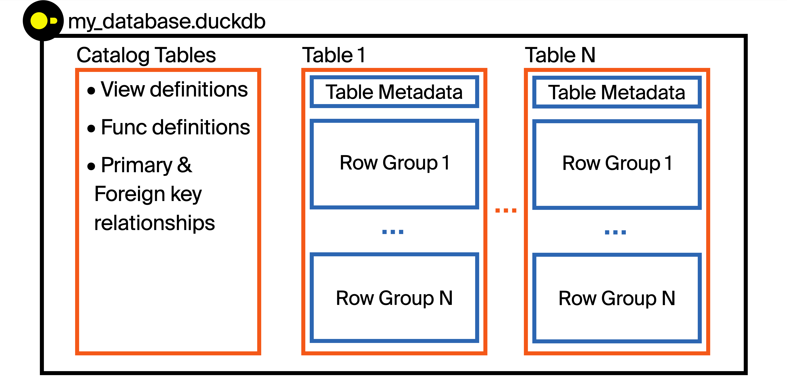
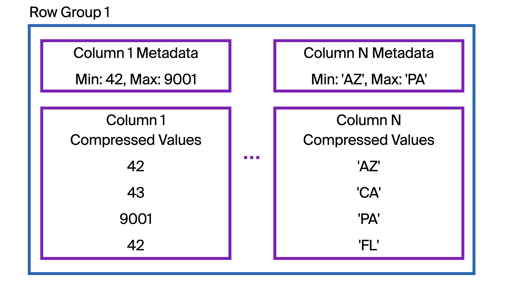

## DuckDB 读时优化: 排序 & 部分读取功能    
          
### 作者          
digoal          
          
### 日期          
2025-05-22          
          
### 标签          
PostgreSQL , PolarDB , DuckDB , 数据文件 , rowgroup , metadata , brin , 排序 , 读时优化 , parquet , 部分读取    
          
----          
          
## 背景       
DuckDB 内置数据文件与parquet格式类似, 采用列存储, 同时也支持rowgroup, 每个rowgroup头部都有对应元数据信息记录该组的min/max值等. 更多细节见DuckDB源代码.  
  
本文提到了DuckDB 的读时优化, 实际上就是写入数据文件时: 尽量批量排序写入, 以及如何选择排序字段? 如何设置rowgroup大小?  使得DuckDB读时根据过滤条件和metadata快速跳过不需要访问的rowgroup提高读时性能.  这有赖于DuckDB的“部分读取”功能.    
- 如果数据是零散写入的, 可以定期整理数据(排序后再插入, 有点类似PostgreSQL CLUSTER语法).  
- 如何选择排序键? 选择最常用在where条件里的, 可以快速过滤收敛到少量数据的字段. 如果有多个字段都是过滤条件呢? 可以按多字段排序, count distinct越少排在越前, 例如c1,c2,c3分别对应10,100000,10000000个唯一值, 则选择c1,c2,c3顺序sort.  为什么呢? 你想想index skip scan就明白为什么了(文末有参考文档).    
- 如果被选择的值非常密集(唯一值特别多), 或者是输入查询条件后返回结果通常较少的, 例如仅返回1条. 那么rowgroup越小越好, 可以过滤到少量记录内.  
  
翻译自原文:  https://duckdb.org/2025/05/14/sorting-for-fast-selective-queries.html  
      
简而言之：加载时对数据进行排序可以将选择性读取查询的速度提高一个数量级，这要归功于 DuckDB 的自动最小最大索引（也称为区域映射）。这种方法也适用于大多数列式文件格式和数据库。本文将以列式数据格式为例，解析 DuckDB 文件结构，并给出使用排序来提高查询速度的实用建议。  
  
读取数据最快的方法就是不读取数据。就这么简单！这篇文章主要讲解如何读取尽可能少的数据来响应选择性读取查询。  
  
## 用例  
这些技术最有用的情况是读取性能比写入性能更重要。在这种情况下，我们可以故意添加排序步骤，这会降低写入速度，但会大大加快读取速度。这种情况通常发生在数据在后台预处理，但读取查询是在仪表板或应用程序中面向客户的情况下。  
  
在以下任何情况下，使用排序都会有所帮助：  
- 您的数据集很大，无法完全装入内存  
- 您只想为每个查询读取数据集的一部分  
- 您通过 HTTP(S) 访问您的数据  
- 您的数据存储在云中的对象存储中，例如 AWS S3  
  
本概述介绍了 DuckDB 文件格式，但由于 DuckDB 的“部分读取”支持，这些技术几乎可以应用于任何列式文件格式或数据库。这是加快在远程端点（包括数据湖）上查询 Apache Parquet 文件的绝佳方法！  
  
## DuckDB 格式有何帮助？  
让我们直观地了解一下 DuckDB 文件格式的结构！DuckDB 将数据存储在一个文件中。每个文件被称为一个数据库（DuckDB 库就是数据库引擎）。  
  
  
  
是不是很像parquet?   
  
每个数据库文件都可以在同一个文件中存储多个表、视图、函数、索引以及主/外键关系。这在可移植性方面具有一些关键优势，不仅如此，它还能存储更多内容，而不仅仅是数据——元数据也可以存储。这些元数据允许 DuckDB 引擎根据请求选择性地读取 DuckDB 文件中的部分内容，这对于处理大于内存的数据集以及本文中的性能优化至关重要！  
  
DuckDB 采用列式存储数据（即同一列中的值存储在同一块中）。然而，列式存储并不意味着整列都连续存储！在存储数据之前，DuckDB 会将表拆分成称为行组的行块。默认情况下，每个行组包含 122,880 行。  
  
接下来，我们放大第一张图`Row Group 1`：`Table 1`  
  
  
  
在每个行组中，与单个列相关的数据以一个或多个块的形式连续存储在磁盘上。DuckDB 会压缩这些数据以减小文件大小。  
  
## 使用区域图跳过读取数据  
那么，将数据存储在列中如何有助于选择性读取查询呢？它本身并没有帮助！但是，在每个行组中存储的列数据的开头，DuckDB 还会存储有关所存储列数据的元数据。这包括该行组中该列的最小值和最大值。我们称之为`区域映射`或`最小-最大索引`。 是不是和PostgreSQL brin索引很类似?  
  
当 DuckDB 收到包含过滤器的 SQL 查询时，在从磁盘读取列段之前，它会先检查元数据。这个过滤器值是否可能落在该列段的最小/最大范围内？如果不可能，那么 DuckDB 可以跳过读取整个行组的数据。  
  
例如，`Column N`本例中存储的是美国各州的缩写。如果我们查询弗吉尼亚州的数据`VA`，这个行组能包含 `VA` 的数据吗？我们的查询可以是：  
```  
FROM "Table 1"  
WHERE "Column N" = 'VA';  
```  
  
DuckDB 首先检查区域图（`Column N Metadata` 如图所示）。它是否在VA（按字母顺序）AZ到 PA的范围内？不！我们可以跳过整个行组。  
  
如果我们过滤的是新墨西哥州的数据`NM`，区域图会显示该行组中可能`NM`存在数据。因此，DuckDB 会检索整列数据（可能来自远程位置），并检查每一行是否存在数据`NM`。根据图表，该行组中没有`NM`数据，因此检索数据并逐行检查匹配项是不必要的。所有 122,880 行数据都需要检查！要是区域图索引没有涵盖如此广泛的州缩写就好了 ……    
  
## 策略性地跳过数据  
我们的目标是对数据进行排序，以便区域图尽可能选择性地筛选出我们感兴趣的过滤列。如果此行组的`最小-最大索引`仅从 AZ到CA，则数据被跳过的可能性会大大增加。换句话说，我们想要检索的每个数据子集应该仅存储在几个行组中。我们不想提取每个行组并检查每一行！例如，最好将字母表中靠前的州/省/市/自治区都分组到同一个行组中。  
  
执行选择性查询时，您可能只想提取单个行组！但是，由于 DuckDB 的多线程模型基于行组，因此只要行组数量小于 DuckDB 使用的线程数（≈CPU 核心数），您仍然可以获得高性能。 -- 这句是不是错了? 如果一个rg可以有多个线程处理, 那多少个rg都不影响性能. 如果一个rg只能由1个线程来处理, 那rg数最好是线程的倍数. 或者大于线程数(如果是PolarDB的动态并行: [《一起学PolarDB - 第13期 - 为什么木桶有短板?》](../202201/20220110_03.md)  )  
  
## 排序最佳实践  
关于如何最佳利用最小-最大索引，有很多经验法则，因为它们的有效性高度依赖于数据和工作负载。这些法则在 DuckDB 以及其他列式存储格式（例如 Apache Parquet 或其他列式数据库）中都非常有用。以下是一些值得考虑的方法！  
  
在决定对哪些列进行排序时，检查所有读取工作负载的子句至关重要WHERE。通常，最重要的因素是哪些列最常用于过滤。一种基本方法是按所有用作过滤器的列进行排序，从最常用的列开始。  
  
如果工作负载涉及按多个不同列进行筛选，另一个选择是考虑先按基数最低的列（唯一值最少）排序。例如，先按 broad 排序，customer_type再按 unique排序可能会有所帮助customer_id。  
  
只读取最近的数据通常很有用，因此确保最近的数据不会分散在整个表中可以提高性能。但是，按时间戳排序时，请注意时间戳通常基数很高。因此，先按基数较低的列排序可能会有所帮助。您可能倾向于先按时间戳排序——抵制这种诱惑！（或者至少尝试其他替代方案）。先按四舍五入到最近的周、月或年的时间戳排序，然后再按其他列排序，可能会更有利。  
  
要从最小-最大索引中获益，WHERE子句必须直接针对特定列进行过滤，而不是基于计算表达式。如果使用表达式，则必须对每一行进行求值，因此不能跳过任何行组！  
  
## 附加技术  
还有更多方法可以充分利用 DuckDB 中的最小-最大索引！  
  
### 避免小事务写入  
  
如果工作负载以小批量或一次一行的方式插入数据，则无法在插入数据时对其进行有效排序。相反，数据将主要按插入时间排序，这只会对基于时间的筛选器进行有效修剪。如果可能，批量插入或批处理将使其他列的排序更高效。作为替代方案，可以执行定期重新排序作业，这类似于事务系统中的重建索引任务。  
  
### 按块排序  
  
对于大型表，排序可能是一项计算量很大的操作。减少排序所需内存（或磁盘溢出）的一种方法是，通过循环执行多个 SQL 语句，将表分块处理，每个 SQL 语句都过滤到特定的块。由于 SQL 没有循环结构，因此这可以由宿主语言（Python、Jinja 模板等）来处理。伪代码如下：  
```  
CREATE OR REPLACE TABLE sorted_table AS  
    FROM unsorted_table  
    WITH NO DATA;  
  
for chunk in chunks:  
    INSERT INTO sorted_table  
        FROM unsorted_table  
        WHERE chunking_column = chunk  
        ORDER BY other_columns...;  
```  
  
这将首先按分块列进行排序，然后再按排序other_columns。它也可能需要更长的运行时间（因为必须每个块扫描一次数据），但内存使用量可能会低得多。  
  
### 对字符串的前几个字符进行排序  
近似排序对于提升读取性能非常有效。在列的区域映射中VARCHAR，DuckDB 仅存储最小和最大字符串值的前 8 个字节。因此，无需对前 8 个字节（8 个 ASCII 字符）以外的内容进行排序！  
  
这还有一个额外的好处，那就是排序速度更快，因为DuckDB 基数排序算法的运行时间对字符串的长度很敏感（这是设计使然！）。该算法的时间复杂度为O(nk)，其中n是行数，k是排序键的宽度。仅按 a 的前几个字符排序VARCHAR可以更快、计算量更小，同时实现类似的读取性能。DuckDB 的VARCHAR数据类型还会在字符串长度小于 12 个字节时进行内联，因此处理短字符串的速度也会更快。例如：  
```  
CREATE OR REPLACE TABLE sorted_table AS  
    FROM unsorted_table  
    ORDER BY varchar_column_to_sort[:8];  
```  
  
DuckDB 的友好 SQL允许使用括号符号进行字符串切片！  
  
### 按更多列过滤  
WHERE如果要过滤的列具有某种近似顺序，则向子句添加过滤器会很有帮助。例如，customer_id如果表按 排序，则除了仅按 过滤之外customer_type，还应在查询中包含该值。通常，如果customer_id在查询时知道 ，那么也可以知道其他元数据。  
  
### 调整行组大小  
针对特定工作负载，可以调整的一个参数是行组 (row group) 中的行数ROW_GROUP_SIZE。如果要筛选的列中有很多唯一值，则减少每个行组的行数可以减少必须扫描的总行数。但是，当行组较小时，更频繁地检查元数据会产生开销，因此需要权衡利弊。  
  
如果表特别大，并且查询要求非常严格，那么较大的行组大小实际上可能更可取。例如，查询一个包含多年历史记录的大型事实表，但只筛选最近一周的数据。较大的行组大小可以减少获取最新数据所需的元数据检查次数。但是，每个行组都会变大，因此也需要权衡利弊。  
  
要调整行组大小，请在附加数据库时传入参数。请注意，行组大小应为 2 的幂。最小行组大小为 2048，即 DuckDB 的向量大小。  
```  
ATTACH './smaller_row_groups.duckdb' (ROW_GROUP_SIZE 8192);  
```  
  
## 结论  
插入时对数据进行排序可以显著加快包含筛选器的读取查询速度。当您的数据集变得庞大或将其存储在远程数据库中时，请考虑应用这些技术。此外，这些方法几乎可以用于任何列式文件格式或数据库！  
  
  
## 参考    
[《数据库筑基课 - 列存之 Parquet》](../202410/20241015_01.md)    
  
[《重新发现PostgreSQL之美 - 13 brin 时序索引》](../202106/20210605_02.md)    
  
[《从一维编排到多维编排，从平面存储到3D存储 - 数据存储优化之路》](../201706/20170614_01.md)    
  
https://duckdb.org/2025/05/14/sorting-for-fast-selective-queries.html  
      
[《PostgreSQL 18 preview - index skip scan 优化》](../202504/20250406_01.md)    
  
[《distinct xx和count(distinct xx)的变态递归优化方法 - 索引收敛(skip scan)扫描》](../201611/20161128_02.md)    
  
[《一起学PolarDB - 第13期 - 为什么木桶有短板?》](../202201/20220110_03.md)   
     
  
#### [期望 PostgreSQL|开源PolarDB 增加什么功能?](https://github.com/digoal/blog/issues/76 "269ac3d1c492e938c0191101c7238216")
  
  
#### [PolarDB 开源数据库](https://openpolardb.com/home "57258f76c37864c6e6d23383d05714ea")
  
  
#### [PolarDB 学习图谱](https://www.aliyun.com/database/openpolardb/activity "8642f60e04ed0c814bf9cb9677976bd4")
  
  
#### [PostgreSQL 解决方案集合](../201706/20170601_02.md "40cff096e9ed7122c512b35d8561d9c8")
  
  
#### [德哥 / digoal's Github - 公益是一辈子的事.](https://github.com/digoal/blog/blob/master/README.md "22709685feb7cab07d30f30387f0a9ae")
  
  
#### [About 德哥](https://github.com/digoal/blog/blob/master/me/readme.md "a37735981e7704886ffd590565582dd0")
  
  

  
