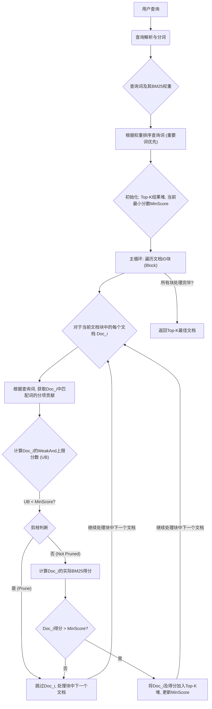

## VectorChord-bm25项目中BM25分数计算的Block-WeakAnd算法  
              
### 作者              
digoal              
              
### 日期              
2025-05-22              
              
### 标签              
PostgreSQL , PolarDB , DuckDB , VectorChord-bm25 , bm25 , Block-WeakAnd算法  
              
----              
              
## 背景   
我们来通俗易懂地聊聊计算BM25分数的Block-WeakAnd算法。如何快速找到与query最相关的top-k文档?    
  
涉及项目: https://deepwiki.com/tensorchord/VectorChord-bm25/2-core-components  
  
## BM25 得分算法
BM25（Best Matching 25）是一种用于信息检索（Information Retrieval）和搜索引擎的排名算法，用于评估查询（query）与文档（document）的相关性。它是基于概率检索框架的改进，结合了词频（TF）、逆文档频率（IDF）和文档长度归一化等因素，是BM系列算法的经典版本。
  

### **BM25的核心公式**
BM25对文档 $$D$$ 和查询 $$Q$$ 的相关性评分公式为：
$$\text{score}(D, Q) = \sum_{i=1}^{n} \text{IDF}(q_i) \cdot \frac{f(q_i, D) \cdot (k_1 + 1)}{f(q_i, D) + k_1 \cdot \left(1 - b + b \cdot \frac{|D|}{\text{avgdl}}\right)}$$
其中：
- $$q_i$$ ：查询中的第 $$i$$ 个词项。
- $$f(q_i, D)$$ ：词项 $$q_i$$ 在文档 $$D$$ 中的词频（TF）。
- $$|D|$$ ：文档 $$D$$ 的长度（词项总数）。
- $$\text{avgdl}$$ ：所有文档的平均长度。
- $$k_1$$ 和 $$b$$ ：可调参数（ 通常 $$k_1 \in [1.2, 2.0]$$ ， $$b = 0.75$$ ）。
- $$\text{IDF}(q_i)$$ ：词项 $$q_i$$ 的逆文档频率，通常计算为：
  $$\text{IDF}(q_i) = \log \left( \frac{N - n(q_i) + 0.5}{n(q_i) + 0.5} + 1 \right)$$
  - $$N$$ ：文档集合中的总文档数。
  - $$n(q_i)$$ ：包含词项 $$q_i$$ 的文档数。

  

### **BM25的特点**
1. **词频（TF）的非线性饱和**：
   - 通过参数 $$k_1$$ 控制词频的影响。高频词项的贡献会趋于饱和，避免单个词项主导评分。
2. **文档长度归一化**：
   - 参数 $$b$$（ $$b \in [0,1]$$ ）调节文档长度的影响：
     - $$b = 1$$ ：完全惩罚长文档。
     - $$b = 0$$ ：忽略文档长度。
   - 长文档倾向于包含更多词项，BM25通过 $$\frac{|D|}{\text{avgdl}}$$ 对其进行惩罚。
3. **逆文档频率（IDF）**：
   - 罕见词（高IDF）对相关性的贡献更大。

  

### **BM25 vs. TF-IDF**
- **TF-IDF**：简单加权，未考虑文档长度和词频饱和。
- **BM25**：更复杂的概率模型，对长文档和词频过高的场景更鲁棒。

  

### **应用场景**
1. 搜索引擎（如Elasticsearch、Lucene默认使用BM25）。
2. 问答系统、文档排序。
3. 推荐系统中的内容匹配。

  

### **参数调优建议**
- $$k_1$$ ：控制词频的缩放程度。增大 $$k_1$$ 会加强高频词的影响。
- $$b$$ ：控制文档长度归一化的强度。若长文档与查询相关性低，可增大 $$b$$ 。

  

### **示例代码（Python实现）**
```python
import math
from collections import defaultdict

def bm25(documents, query, k1=1.5, b=0.75):
    # 预处理：计算文档长度和平均长度
    doc_lengths = [len(doc) for doc in documents]
    avgdl = sum(doc_lengths) / len(documents)
    
    # 统计词项的文档频率（n(q_i)）
    df = defaultdict(int)
    for doc in documents:
        for word in set(doc):
            df[word] += 1
    
    N = len(documents)
    scores = []
    for doc in documents:
        score = 0
        for word in query:
            # 计算词频（TF）
            tf = doc.count(word)
            # 计算IDF
            idf = math.log((N - df[word] + 0.5) / (df[word] + 0.5) + 1)
            # BM25部分公式
            numerator = tf * (k1 + 1)
            denominator = tf + k1 * (1 - b + b * len(doc) / avgdl)
            score += idf * (numerator / denominator)
        scores.append(score)
    return scores

# 示例
documents = [
    ["apple", "banana", "fruit"],
    ["apple", "orange", "juice"],
    ["banana", "mango", "smoothie"]
]
query = ["apple", "banana"]
print(bm25(documents, query))  # 输出各文档的BM25得分
```

  

BM25因其高效性和灵活性成为信息检索的基准算法之一。实际应用中（如Elasticsearch），还需结合分词、停用词处理等优化。
    
## BM25分数计算的Block-WeakAnd算法  
  
在搜索引擎中，我们需要根据用户查询（Query）找出最相关的文档（Document），并给它们打分。BM25（Best Match 25）是一种非常流行的打分算法。  
  
**核心问题：** 语料库（所有文档）非常庞大，用户每次查询时，不可能把所有文档都完整计算一遍BM25分数。那样太慢了！我们需要一种高效的方法来快速找出Top-K（前K个）最相关的文档。  
  
**Block-WeakAnd（Block-Wand）** 就是为了解决这个效率问题而诞生的算法之一。  
  
### 1. 为什么需要它？  
  
想象一下，你在一个巨大的图书馆里找10本最符合你主题的书。  
*   **传统做法：** 把所有书都翻一遍，详细阅读内容，然后打分，最后选出前10本。—— 太慢了！  
*   **Block-WeakAnd做法：**  
    *   **WeakAnd（Wand）部分：** 你设定一个门槛。如果你看一本书的封面、目录甚至前几页，就发现它“即使内容完全符合要求，最高也只能得80分”，而你已经找到了几本90分的书，那你就不再看这本80分的书了，直接跳过。这叫**剪枝（Pruning）**。  
    *   **Block部分：** 你不是一本一本看，而是把图书馆的书分成很多区域（Blocks）。你在一个区域里，高效地处理这个区域的书。比如，你发现这个区域有几本书肯定能得高分，有些书一看就不行，就直接跳过。  
  
### 2. 算法核心思想  
  
Block-WeakAnd结合了两种优化策略：  
  
1.  **WeakAnd (WAND) 弱且（Weak-AND）:**  
    *   **目标：** 快速估计一个文档的**最高可能得分（Upper Bound）**。  
    *   **原理：** 对于每个查询词，我们知道它在一个文档中能贡献的**最大分数**（例如，如果它只出现一次，但这个词本身很重要）。  
    *   **剪枝：** 当我们遍历文档时，我们可以计算出该文档**目前为止**已经匹配到的词的分数总和，再加上它**所有未匹配但有可能匹配**的词的**最大可能贡献**。如果这个“最高可能得分”仍然低于我们当前已找到的Top-K文档中的**最低分**，那么这个文档就**不可能**进入Top-K，可以直接跳过，无需计算完整分数。  
  
2.  **Block（块）处理:**  
    *   **目标：** 更高效地遍历倒排索引。  
    *   **原理：** 倒排索引（Inverted Index）是搜索引擎的基础，它存储了每个词出现在哪些文档中。为了提高读取效率，这些倒排列表通常被分成固定大小的“块”（Block）。  
    *   **优势：** 当我们处理一个查询时，我们可以在一个块内进行更紧凑、更并行的操作。例如，CPU的缓存利用率更高，甚至可以利用SIMD指令（单指令多数据）来加速计算。
   
补充说明: 在每个block里存储了term对应的128 条docs信息, 关键是会存储该term在这些docs中的max(bm25)分值, 用于快速减枝(跳过该block)?   
- https://deepwiki.com/tensorchord/VectorChord-bm25/4.1-posting-lists   
  
### 3. Block-WeakAnd 工作流程 (简化版)  
  
1.  **查询分析：** 用户输入查询词，分词，并计算每个查询词的BM25权重（重要性）。  
2.  **词排序：** 根据查询词的权重（或它们在文档中贡献的最大分数），将查询词进行排序。通常重要的词优先处理。  
3.  **初始化Top-K：** 维护一个最小堆（Min-Heap），里面存放当前已找到的Top-K文档及其BM25分数。堆顶是当前Top-K中的最低分数（`MinScore`）。  
4.  **遍历文档块：**  
    *   算法会同时（或协调地）遍历所有查询词的倒排列表。  
    *   它会跳跃式地前进，一次处理一个**文档ID范围的块**。  
    *   **块内处理：** 对于当前块中的每个文档 `Doc_i`：  
        *   **WeakAnd上限计算：** 快速计算 `Doc_i` 的**WeakAnd上限分数（Upper Bound, UB）**。这个UB是 `Doc_i` 已经匹配到的词的分数，加上所有**未匹配但有可能匹配**的词的**最大可能贡献**。  
        *   **剪枝判断：** 如果 `UB` 小于当前的 `MinScore`，那么 `Doc_i` 无论如何都不可能进入Top-K。直接**跳过** `Doc_i`，处理块中的下一个文档。  
        *   **完整计算：** 如果 `UB` 大于或等于 `MinScore`，说明 `Doc_i` 有可能进入Top-K。此时，计算 `Doc_i` 的**完整BM25分数**。  
        *   **更新Top-K：** 如果 `Doc_i` 的完整分数大于 `MinScore`，则将其加入Top-K堆，并更新 `MinScore`。  
5.  **返回结果：** 当所有相关文档块都被处理完毕后，Top-K堆中的文档就是最终结果。  
  
### 4. Mermaid 图表解释  
  

  
### 5. 总结  
  
Block-WeakAnd算法通过**提前预估文档的最高可能得分（WeakAnd）**并**在文档块级别进行高效处理（Block）**，大大减少了需要进行完整BM25计算的文档数量。它就像一个精明的筛选器：先快速淘汰掉那些“不可能”的文档，再对“有可能”的文档进行精确打分，从而实现大规模搜索场景下的高性能BM25打分。  
  
  
#### [期望 PostgreSQL|开源PolarDB 增加什么功能?](https://github.com/digoal/blog/issues/76 "269ac3d1c492e938c0191101c7238216")
  
  
#### [PolarDB 开源数据库](https://openpolardb.com/home "57258f76c37864c6e6d23383d05714ea")
  
  
#### [PolarDB 学习图谱](https://www.aliyun.com/database/openpolardb/activity "8642f60e04ed0c814bf9cb9677976bd4")
  
  
#### [PostgreSQL 解决方案集合](../201706/20170601_02.md "40cff096e9ed7122c512b35d8561d9c8")
  
  
#### [德哥 / digoal's Github - 公益是一辈子的事.](https://github.com/digoal/blog/blob/master/README.md "22709685feb7cab07d30f30387f0a9ae")
  
  
#### [About 德哥](https://github.com/digoal/blog/blob/master/me/readme.md "a37735981e7704886ffd590565582dd0")
  
  

  
