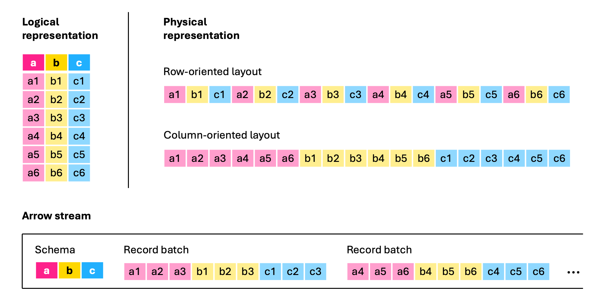

## DuckDB 重构 arrow 扩展插件增强 Arrow IPC 文件读写体验  
                
### 作者                
digoal                
                
### 日期                
2025-05-25              
                
### 标签                
PostgreSQL , PolarDB , DuckDB , Arrow IPC , parquet     
                
----                
                
## 背景     
由于nanoarrow这种小巧的 Arrow C++ 实现的流行，DuckDB 使用 nanoarrow 重新设计了旧的 Arrow 扩展，使其具有更小的依赖性、更清晰的代码库以及扫描 Arrow IPC 文件的能力。  
  
DuckDB 现在支持通过社区扩展插件 arrow 使用和生成 Arrow IPC 序列化格式, 结合 Http 协议插件支持远程读写 Arrow 格式数据文件, 与其他支持 Arrow 格式的数据库产品快速交换数据。  
  
Parquet和Arrow都是列存储格式, 并各有特点和适应的场景:   
- Arrow更易于实施：编写低级 Arrow IPC 消费者/生产者比编写 Parquet 更简单，特别是如果系统已经与 Arrow 格式集成。  
- 更快的编码和解码： Arrow 数据的编码和解码（序列化和反序列化）过程比 Parquet 更简单、更快速。这可以缩短处理时间，尤其是在传输无需后续存储在磁盘上的流数据时。  
Arrow 和 Parquet 是互补的格式。  
    - Parquet 复杂的编码和压缩选项系统通常可以生成更小的文件，因此 Parquet 是归档存储的更佳选择。  
    - Arrow 能够消除编码和解码开销，因此数据交换速度更快、更高效，因此 Arrow 是查询结果传输和临时缓存的更佳选择。  
  
更多参考数据库筑基文档:  
- [《数据库筑基课 - 列存之 Parquet》](../202410/20241015_01.md)    
- [《数据库筑基课 - 列存之 Arrow, 面向内存 & "进程0拷贝/跨机无需序列化"共享数据 设计的列存》](../202501/20250127_01.md)    
  
以下内容来自原文翻译: https://duckdb.org/2025/05/23/arrow-ipc-support-in-duckdb.html  
  
TL;DR：DuckDB 现在支持通过社区扩展使用和生成 Arrow IPC 序列化格式arrow。  
  
## DuckDB 和 Arrow  
近年来，Apache Arrow 项目在数据领域获得了极大的关注，这得益于其列式存储格式，该格式允许在不同系统之间轻松交换数据 —— 主要是通过零拷贝方法。Apache Arrow 还支持 DuckDB 与 Polars 之间的集成。实际上，当 DuckDB 生成或使用 Polars DataFrame 时，它实际上使用的是底层的Arrow 列式存储格式。  
  
拥有这种格式的重要性也是 DuckDB 成为与 Arrow 集成并实现Arrow 数据库连接 (ADBC) 接口的先驱之一的主要原因之一 —— 特别是因为 Arrow 借助其C 数据接口，无需任何额外依赖即可实现这一点。  
  
但是，Arrow 的 C 数据接口有一个限制，那就是它使用指针（内存地址）来交换数据。这限制了在不同进程或系统之间交换 Arrow 数据的可能性。为了克服这一限制，Arrow 项目还指定了Arrow IPC 格式，该格式允许用户高效地序列化 Arrow 列式数据，并在进程之间或通过网络传递。这些数据可以作为流使用，可以直接从内存缓冲区或文件中提取。  
  
我们非常高兴地宣布，DuckDB 现在可以通过新的arrow社区扩展( https://duckdb.org/community_extensions/extensions/arrow.html )来消费和生成这些 Arrow 流。在本文中，我们将更详细地介绍 Arrow IPC 序列化格式，演示如何安装arrowDuckDB 的新社区扩展，并提供一个演示来展示如何使用它。  
  
## Arrow 进程间通信（Arrow IPC）  
Arrow IPC 格式提供了一种序列化（并可选地压缩）Arrow 格式数据的方法，使您能够通过网络传输数据或将其存储在磁盘上，同时保持其 Arrow 格式，从而避免了将其转换为其他格式的开销。Arrow IPC 支持 LZ4 和 ZSTD 压缩，并且当存储为文件时，它还支持文件页脚，可通过允许跳过部分数据（类似于 Parquet 格式使用的方法, 快速过滤不需要访问的Row groups.）来加快检索和处理速度。与 Parquet 相比，Arrow IPC 格式有两个主要优势：  
- 易于实施：编写低级 Arrow IPC 消费者/生产者比编写 Parquet 更简单，特别是如果系统已经与 Arrow 格式集成。  
- 更快的编码和解码： Arrow 数据的编码和解码（序列化和反序列化）过程比 Parquet 更简单、更快速。这可以缩短处理时间，尤其是在传输无需后续存储在磁盘上的流数据时。  
Arrow 和 Parquet 是互补的格式。Parquet 复杂的编码和压缩选项系统通常可以生成更小的文件，因此 Parquet 是归档存储的更佳选择。Arrow 能够消除编码和解码开销，因此数据交换速度更快、更高效，因此 Arrow 是查询结果传输和临时缓存的更佳选择。  
  
为了让您了解 Arrow IPC 格式有多么简单，请看下图。在 Arrow IPC 格式中，表被序列化为一系列记录批次（以列式布局组织的记录集合），其前面是共享模式：  
  
  
  
图示为 Arrow IPC 流如何从包含三列的表传输数据。第一个记录批次包含前三行的值，第二个记录批次包含接下来三行的值，依此类推。实际的 Arrow 记录批次可能包含数千行甚至数百万行。  
  
图片来自Apache Arrow 博客：Apache Arrow 格式如何加速查询结果传输。 https://arrow.apache.org/blog/2025/01/10/arrow-result-transfer   
  
请注意，在现实场景中，记录批次要大得多，上图为了便于说明而进行了简化。  
  
## Arrow 社区扩展  
多年来，DuckDB 一直通过（现已弃用的）Arrow 核心扩展集成了 Arrow IPC 格式。然而，这种支持的主要目的是允许 DuckDB 与 JavaScript 互操作，因此它仅设计用于读取内存中的序列化缓冲区，而不是 Arrow IPC 文件。该扩展的代码复杂性和可维护性非常高，因为使用 Arrow IPC 需要依赖整个 Arrow C++ 库，而我们不想为 Arrow IPC 格式编写自己的序列化和反序列化代码。  
  
最近，一种更小巧的 Arrow C++ 实现开始流行起来，成为与 Arrow IPC 数据交互的一种方式：nanoarrow 库。使用 nanoarrow，我们完全重新设计了旧的 DuckDB Arrow 扩展，使其具有更小的依赖性、更清晰的代码库以及扫描 Arrow IPC 文件的能力。我们还借此机会将 Arrow DuckDB 扩展从核心扩展转变为社区扩展。进行此更改主要有两个原因。首先是让 Arrow 开发人员和用户社区更多地参与构建和支持扩展。其次是制定一个不受 DuckDB 发布时间表约束的发布时间表。实际上，这意味着核心 Arrow 开发人员社区的成员可以决定何时发布扩展的新版本。  
  
安装和加载新的 Arrow 扩展非常简单：  
```  
INSTALL arrow FROM community;  
LOAD arrow;  
```  
  
## 演示  
在本演示中，我们将使用新的 Arrow DuckDB 扩展，将lineitem比例因子为 10 的 TPC-H 表生成为 Arrow IPC 文件。虽然我们的演示主要关注存储在文件中的 Arrow IPC 数据，但该扩展本身也允许您直接使用和生成 Arrow IPC 格式的缓冲区。您可以在扩展的README中找到详细的使用示例和可接受的参数。 https://github.com/paleolimbot/duckdb-nanoarrow/blob/main/README.md    
  
我们首先加载arrow扩展并生成 TPC-H 表。  
```  
LOAD arrow;  
  
CALL dbgen(sf = 10);  
```  
  
要生成 Arrow IPC 文件，我们可以简单地使用`COPY ... TO ...`如下子句。由于此文件采用 Arrow IPC 流格式，因此我们使用推荐的文件扩展名。`.arrows`  
```  
COPY lineitem TO 'lineitem.arrows';  
```  
  
在此演示中，为了简单起见，我们将表写入单个文件。但是，`COPY ... TO ...` 子句允许我们设置每个 Arrow 文件的 `chunk_size` 和 `row_groups` 数量。这些选项使我们能够生成针对您的用例优化的数据，以实现最佳性能。例如，较小的`chunk_size`可能会降低整体性能，但有利于流式传输场景。  
  
我们现在可以使用以下 read_arrow 函数直接在我们的文件上运行 TPC-H 查询 6 ：  
```  
SELECT  
    sum(l_extendedprice * l_discount) AS revenue  
FROM  
    read_arrow('lineitem.arrows')  
WHERE  
    l_shipdate >= CAST('1994-01-01' AS date)  
    AND l_shipdate < CAST('1995-01-01' AS date)  
    AND l_discount BETWEEN 0.05  
    AND 0.07  
    AND l_quantity < 24;  
```  
  
打印结果如下：  
```  
┌─────────────────┐  
│     revenue     │  
│  decimal(38,4)  │  
├─────────────────┤  
│ 1230113636.0101 │  
│ (1.23 billion)  │  
└─────────────────┘  
```  
  
得益于替换扫描功能read_arrow，如果文件名以`.arrow`结尾，则可以省略该函数。例如：  
```  
SELECT count(*) FROM 'lineitem.arrows';  
```  
  
打印结果如下：  
```  
┌─────────────────┐  
│  count_star()   │  
│      int64      │  
├─────────────────┤  
│    59986052     │  
│ (59.99 million) │  
└─────────────────┘  
```  
  
为了简单起见，我们专注于读取单个文件的情况，但我们的阅读器支持多文件读取，其功能与 DuckDB Parquet 阅读器相当。  
  
如果您想将 Arrow IPC 流直接从服务器提取到 DuckDB 中，该怎么办？为了演示这一点，我们可以在保存 `lineitem.arrows` 的同一目录中启动一个 HTTP 文件服务器。我们使用 Node.js 的 serve 包来执行此操作（而不是 Python 的内置 http.server ），因为它支持HTTP 范围请求：  
```  
npx serve -l 8008  
```  
  
然后，您可以使用DuckDB 的httpfs扩展通过 HTTP(S) 协议查询 Arrow 数据：  
```  
INSTALL httpfs;  
LOAD httpfs;  
LOAD arrow;  
  
SELECT count(*) FROM read_arrow('http://localhost:8008/lineitem.arrows');  
```  
  
打印相同的结果：  
```  
┌─────────────────┐  
│  count_star()   │  
│      int64      │  
├─────────────────┤  
│    59986052     │  
│ (59.99 million) │  
└─────────────────┘  
```  
  
或者，您可以使用类似的工具curl从服务器获取 Arrow IPC 数据并将其传输到终端中的 DuckDB：  
```  
URL="http://localhost:8008/lineitem.arrows"  
SQL="LOAD arrow; FROM read_arrow('/dev/stdin') SELECT count(*);"  
  
curl -s "$URL" | duckdb -c "$SQL"  
```  
  
打印结果相同。有关该arrow扩展的其他演示，请参阅我们的arrow-ipc 演示代码库。  
  
## 奖励：Arrow IPC 的酷炫用例  
像上面的演示一样，对 Arrow IPC 格式的数据运行 DuckDB 查询是一个非常巧妙的技巧，而且它之所以如此有效，是因为 DuckDB 和 Arrow 是天生的搭档，因为它们都使用列式数据布局。然而，您可能想知道还能用 Arrow IPC 数据做什么。Arrow 的主要目标之一是互操作性，通过将数据保存为 Arrow IPC 格式，我们开辟了许多与其他工具连接的选项。  
  
例如，我们现在可以使用PyArrow处理我们的数据：  
```  
import pyarrow as pa  
  
with open('lineitem.arrows', 'rb') as source:  
   stream = pa.ipc.open_stream(source)  
   tbl = stream.read_all()  
```  
  
或Polars：  
```  
import polars as pl  
  
tbl = pl.read_ipc_stream("lineitem.arrows")  
```  
  
或ClickHouse：  
```  
CREATE TABLE  
    lineitem  
ENGINE MergeTree()  
ORDER BY tuple()  
AS  
    SELECT * FROM file('lineitem.arrows', 'ArrowStream');  
```  
  
或众多其他 Arrow 库（提供十几种不同的语言）或 Arrow 兼容系统。  
  
Arrow IPC 的优势不止于此：Arrow IPC 也非常适合`大于内存`的用例。使用PyArrow，我们可以对`lineitem.arrows`文件进行内存映射并进行操作，而无需将整个文件读入内存：  
```  
import pyarrow as pa  
  
with pa.memory_map('lineitem.arrows', 'rb') as source:  
    stream = pa.ipc.open_stream(source)  
    tbl = stream.read_all()  
  
tbl.num_rows  
# => 59986052  
```  
  
然后，我们可以检查 PyArrow 是否不必分配任何缓冲区来保存数据，因为所有数据都位于磁盘上：  
```  
pa.total_allocated_bytes()  
# => 0  
```  
  
现在我们可以执行与上面的演示中相同的查询，并显示我们得到相同的结果：  
```  
import datetime  
import pyarrow.compute as pc  
  
subset = tbl.filter(  
    (pc.field("l_shipdate") >= datetime.datetime(1994, 1, 1)) &  
    (pc.field("l_shipdate") < datetime.datetime(1995, 1, 1)) &  
    (pc.field("l_discount") >= 0.05) &  
    (pc.field("l_discount") <= 0.07) &  
    (pc.field("l_quantity") < 24.)  
)  
pc.sum(pc.multiply(subset.column("l_extendedprice"), subset.column("l_discount")))  
# => <pyarrow.Decimal128Scalar: Decimal('1230113636.0101')>  
```  
  
而且，尽管lineitem.arrows超过 10 GB，PyArrow 只需分配一小部分内存：  
```  
pa.total_allocated_bytes()  
# => 201594240 (192MB)  
```  
  
## 结论及下一步  
在这篇博文中，我们介绍了全新的 Arrow 社区扩展，它使 DuckDB 用户能够与 Arrow IPC 流缓冲区和文件进行交互。特别感谢Voltron Data与DuckDB Labs合作，成功实现了此扩展。以下列出了我们对此扩展的未来规划：  
- 写入 Arrow IPC 时支持ZSTD和LZ4压缩。DuckDB 目前仅支持写入未压缩的缓冲区。  
- 读取 Arrow 缓冲区时支持LZ4 和 ZSTD压缩。读取器目前仅支持未压缩的缓冲区。  
- 支持写入包含文件页脚的 Arrow IPC 文件格式，并使用页脚加快读取速度。(统计信息, 支持快速通过meta信息过滤不符合条件的row group)    
- 实现 C API DuckDB 函数来生成和使用 Arrow IPC 数据。  
  
如果您想尝试任何这些计划中的功能，或者建议其他功能，或者发现任何错误，请随时将其记录在我们的问题跟踪器中。祝您开发愉快！  
  
  
  
#### [期望 PostgreSQL|开源PolarDB 增加什么功能?](https://github.com/digoal/blog/issues/76 "269ac3d1c492e938c0191101c7238216")
  
  
#### [PolarDB 开源数据库](https://openpolardb.com/home "57258f76c37864c6e6d23383d05714ea")
  
  
#### [PolarDB 学习图谱](https://www.aliyun.com/database/openpolardb/activity "8642f60e04ed0c814bf9cb9677976bd4")
  
  
#### [PostgreSQL 解决方案集合](../201706/20170601_02.md "40cff096e9ed7122c512b35d8561d9c8")
  
  
#### [德哥 / digoal's Github - 公益是一辈子的事.](https://github.com/digoal/blog/blob/master/README.md "22709685feb7cab07d30f30387f0a9ae")
  
  
#### [About 德哥](https://github.com/digoal/blog/blob/master/me/readme.md "a37735981e7704886ffd590565582dd0")
  
  

  
