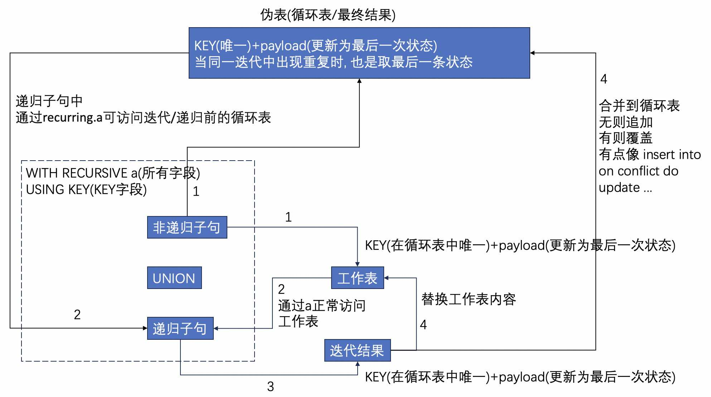
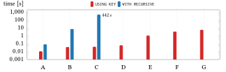
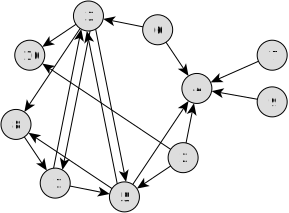

## DuckDB 1.3.0 CTE递归增强(支持USING KEY、循环表访问) - 大型图查询`结果集爆减、性能飙升、内存爆省`  
                
### 作者                
digoal                
                
### 日期                
2025-05-26                
                
### 标签                
PostgreSQL , PolarDB , DuckDB , cte , 中间表 , 循环表 , using key , 无则追加 , 有则覆盖 , 单次迭代多条重复KEY则采用最后一条覆盖    
                
----                
                
## 背景    
图数据库变天, DuckDB 图式搜索性能逆天!     
  
5.24号在上海IF Club沙龙中分享了一个议题, 文字稿如下, RAG效果不佳的关键问题是召回覆盖率、召回精度不行 :   
- [《为什么用了RAG, 我的AI还是笨得跟猪一样! RAG效果评测与优化》](../202504/20250414_04.md)    
- [《维基百科(wikipedia) RAG 优化 | PolarDB + AI》](../202504/20250417_01.md)    
  
图数据库可能是RAG的灵丹妙药! 为什么呢? 将知识拆解后, 按知识点关系用图的点和边存储到图数据库中. 结合bm25/向量搜索/模糊查询/分词检索/rerank得到top-K内容条目后, 再通过图搜索找出相关知识点. 有利于提升召回覆盖率和召回精度. 见论文:   
- [《AI论文解读 | KAG: Boosting LLMs in Professional Domains via Knowledge Augmented Generation》](../202505/20250515_01.md)    
- [《AI论文解读 | Retrieval-Augmented Generation with Graphs (GraphRAG)》](../202505/20250514_01.md)    
  
当然了RAG是个系统工程, 需要的数据库不是单纯的向量数据库、也不是单纯的搜索引擎、也不是单纯的图数据库. 它要的是全部.  这又利好PostgreSQL了, 因为它就是全部!    
  
那么DuckDB 到底发布了什么能让图数据库变天, 图式搜索性能逆天?    
  
DuckDB 1.3.0 CTE 递归语句 增强:    
- 引入了using key用法, 支持在UNION模式下使用, 每个key保留一条结果, 无则追加, 有则覆盖更新.   
- 递归子句中, 在工作表(每次迭代的结果集)的基础上, 又增加了循环表(返回给用户的完整结果集)的访问(通过 recurring 伪 schema 进行访问).     
  
这两点增强使得DuckDB在访问超大图数据时 `结果集骤减、性能飙升、内存省省省` ~~~     
  
下面的内容来自翻译: https://duckdb.org/2025/05/23/using-key.html  
  
TL;DR：SQL 中的 “递归 CTE” 允许执行强大的迭代查询，例如遍历图，但由于图结构的层级深入, 累积的行会越多，可能会占用大量内存且速度缓慢。DuckDB 的新 `USING KEY` 功能解决了这个问题，它将中间结果视为带键的字典，而不是不断增长的集合：现有条目可以更新。这可以显著提高性能和内存效率，尤其是在最短路径和距离向量路由等图算法中。它还通过提供对整个字典的直接访问来简化查询逻辑。  
  
## SQL 查询：CTE  
随着 SQL 查询变得越来越复杂，管理其可读性、模块化和可重用性变得越来越具有挑战性。通用表表达式 (CTE)应运而生，它允许开发人员在查询中定义临时的、命名的结果集，从而解决这些问题。与编程中的(包括递归)函数类似，CTE 允许将大型查询分解为逻辑块，使其更易于理解、维护和调试。  
  
CTE 对于构建多步骤转换尤其有用，否则这些转换可能需要深度嵌套的子查询或复杂的连接。通过提升 SQL 代码的清晰度和结构，CTE 已成为现代查询编写中必不可少的工具，即使是最复杂的逻辑，也能以清晰、声明式的方式表达。  
  
cte语法也可参考PG文档: https://www.postgresql.org/docs/current/queries-with.html   
  
## 迭代：递归 CTE  
为了增强 SQL 的表达能力， `SQL:1999` 标准中引入了递归 CTE。这些 CTE 允许查询引用同一表达式中先前迭代的结果，从而使 SQL 能够解决更复杂的问题，例如图遍历和其他迭代计算。  
  
此功能使 SQL 超越了基本的数据检索，允许直接在 SQL 中制定复杂的迭代逻辑。事实上，递归 CTE 使 SQL 具有`图灵完备性`，这意味着它在理论上可以表达任何计算（只要有足够的时间和内存）。  
  
递归 CTE 在 DuckDB 中是如何工作的呢？  
  
让我们看一个简单的例子来分解这个机制。假设我们要计算小于 100 的最大 2 的幂。我们可以使用递归 CTE 迭代power生成 2 的幂，直到达到该极限。对于power表中的任意一行`(a, b, c)`，我们将得到`a^b = c`：  
```  
WITH RECURSIVE power(a, b, c) AS (  --   
    SELECT 2, 0, 2^0       -- 2^0 = 1 , 启动子句(非递归), 结果放入临时空间(使用power获取)  
        UNION ALL    -- union all 后面可以获取 power 表(临时空间/工作表)里的数据, 并将新产生的SQL结果又放入 临时空间(替换临时空间之前的数据), 反复迭代.    
    SELECT a, b+1, a ^ (b+1)  -- a^(b+1) = a * a^b   
    FROM power           -- reads the working table (contains a single row)  
    WHERE a ^ (b+1) < 100     
)  
FROM power;         -- reads the union table (contains all intermediate results)  
```  
  
递归语法还可参考这个培训第四章, 有一张图来表达递归的逻辑    
- [《2019-PostgreSQL 2天体系化培训 - 适合DBA》](../201901/20190105_01.md)
  
  
使用using key之后的执行逻辑大概如下, 直到递归子句没有记录返回时退出循环:   
   
   
   
我们可以将递归 CTE 分为两部分，用UNION或UNION ALL关键字分隔。上面的部分UNION是非递归部分（`SELECT 2, 0, 1`在我们的例子中），下面的部分是递归部分。  
  
在递归部分，CTE引用power自身。这个自引用指向我们所说的工作表。工作表始终保存着上一次迭代中生成的行，并且只保存这些行。  
  
下面逐步介绍其工作原理：  
- 首先，执行非递归部分`(2,0,1)`，生成初始行 —— 在我们的示例中，仅为行。这些行存储在工作表中。  
- 然后，使用`工作表`中的行执行递归部分。递归部分产生的每个新行都存储在中间表中，该表保存当前迭代的结果。  
- 如果中间表为空，则迭代结束。 -- 迭代结束的条件是, union all 后面的迭代SQL返回结束为0行. 注意如果是聚合操作, 可能永远不返回0行, 永远无法结束迭代. 所以在PostgreSQL中干脆就禁止了在递归子句中使用聚合函数.   例如:   
  ```  
  D select count(*) from (select * from range(0,10) t(id) where id>1000) t;  -- 聚合有返回   
  ┌──────────────┐  
  │ count_star() │  
  │    int64     │  
  ├──────────────┤  
  │      0       │  
  └──────────────┘  
  D select * from range(0,10) t(id) where id>1000;  -- 无返回   
  ┌────────┐  
  │   id   │  
  │ int64  │  
  ├────────┤  
  │ 0 rows │  
  └────────┘  
  ```  
- 否则，我们清除工作表并用中间表的内容替换它 —— 为下一次迭代做准备。  
  
我们还将中间表的内容添加到联合表(返回给用户的结果)中，该表累积了迭代过程中的所有中间结果。  
  
当递归 CTE 完成时，联合表将保存整个结果集，包括每次迭代的所有中间行：  
```  
┌───────┬───────┬───────┐  
│   a   │   b   │   c   │ -- a^b = c  
│ int32 │ int32 │ int32 │  
├───────┼───────┼───────┤  
│     2 │     0 │     1 │  
│     2 │     1 │     2 │  
│     2 │     2 │     4 │  
│     2 │     3 │     8 │  
│     2 │     4 │    16 │  
│     2 │     5 │    32 │  
│     2 │     6 │    64 │  
└───────┴───────┴───────┘  
```  
  
并集表(返回给用户的结果表)提供了幂计算历史的完整记录。这可能会导致不必要的开销，尤其是在我们只需要最后一行（递归的最终结果）的情况下。存储每个中间值可能效率低下，尤其是在不需要中间结果或处理大型数据集（涉及多行或宽行，例如存在数组类型的列）时。  
  
## 递归 CTE 遭受 “遗忘”   
虽然联合表(返回给用户的结果表. 后面也叫循环表)会在计算完成后保存刚才提到的历史记录，但递归 CTE在迭代过程中会遭遇“健忘症” ：递归部分只能看到前一次迭代的中间结果。这可能会造成限制，我们很多人都见过查询编写者如何通过手动维护数组（或类似的容器结构）来保存先前迭代的信息来解决这一限制。这可能代价高昂。然而，如果允许递归部分访问联合表及其所有累积的（可能相当可观的）中间结果，则很容易在迭代过程中引发性能问题。这真是一个难题。  
  
## USING KEY 治愈 “遗忘”   
我们能否允许递归部分访问联合表？可以，但我们需要一种方法来控制其大小。因此，以仅追加模式操作联合表是行不通的。相反，我们应该允许递归部分选择性地使用当前迭代中计算出的新信息覆盖联合表中的现有行。这可以显著减小联合表(后面也叫循环表)的大小（参见下面的实验）。  
  
从 1.3 版开始，DuckDB 就采用了一种递归 CTE 的`USING KEY`变体，它融合了这一思想。  
  
如果您想了解更多关于其起源的信息，请查看`CIDR 2023`。有关实施的更多信息，请参阅`SIGMOD 2025`（即将发布）。  
  
与传统递归 CTE 相比，该变体有两个主要区别：  
- 它提供对工作表的访问（一如既往）以及对联合表的访问 - 我们现在称之为循环表。    
- 该表(循环表)现在的功能更像一个字典（类似于 `Python dict`），允许基于键的更新，而不是简单地将新行添加到循环表中。  
- 要使用此新功能，请将该`USING KEY (...)`子句添加到递归 CTE 中：  
  ```  
  WITH RECURSIVE power(a, b, c) USING KEY (a)  
      -- key: a,  payload: b, c  
  AS (  
      ...  
  )  
  ```  
  
使用`USING KEY`，递归 CTE 的模式被分为`关键列`和`payload 有效载荷列`。关键列使用子句指定，而其余列则被视为有效载荷。`USING KEY (column names)`  
  
这种划分会影响循环表的行为。它不会在每次迭代时固执地添加新行，而是更像一个字典：  
- 追加. 如果递归部分返回了之前未见过的行，则会像往常一样将其添加到循环表中。    
- 更新payload字段. 如果某行与循环表中的现有条目共享一个键，则payload字段会被更新 —— 替换循环表中该键的先前值。   
  
<b> 划重点0: </b>  
  
<b> 如果在同一次迭代中生成了具有相同键的多行，则只保留最后一行。因此，您可能希望在递归子句部分使用`ORDER BY`来控制保留哪一行。</b>    
  
这种方法允许递归查询更有效地维护和更新状态，特别是对于保持给定键的最新（或“最佳”）值至关重要的算法。  
  
## 覆盖旧的中间结果  
使用USING KEY后, 对于同一条KEY记录, 无则追加、有则覆盖更新payload列的值.   
  
让我们继续上面的递归示例查询。现在我们计算以 2 和 3 为底的幂，只要它们小于 100：  
```  
WITH RECURSIVE power(a,b,c) USING KEY (a) AS (  
    FROM (VALUES (2,0,1), (3,0,1))   -- 2^0 = 1, 3^0 = 1  
        UNION  -- 这里必须使用UNION 而不是UNION ALL. 因为USING KEY需要去重.  
    SELECT a, b+1, a^(b+1)             -- a^(b+1) = a * a^b  
    FROM power                       -- reads the working table (contains two rows)  , 因为a始终不变, 所以power每次迭代后循环表都只有union之前非迭代子句输出的2行数据    
    WHERE a^(b+1) < 100      
)  
FROM power;                          -- reads the recurring table (contains two rows)  
```  
  
我们从非递归部分的两行开始：一行的键（基数）为2，另一行的键为3。在递归部分，执行幂运算。这将生成两行，键也分别为2和3。  
  
<b> 划重点1: </b>  
  
与传统的递归 CTE 不同，我们不会将这两行新数据添加到循环表中。相反，我们会更新循环表中键为2和3的现有行，并覆盖它们的有效负载值(b,c) 。因此，在整个计算过程中，我们只保留两行数据，每行都保存其键（或基数）在 a 列中对应的当前b,c值。  
  
可以看出，循环表的大小保持不变。不相关的计算历史会被覆盖，从而减少内存使用量。最终的循环表内容如下：  
```  
┌───────┬───────┬───────┐  
│   a   │   b   │   c   │ -- a^b = c  
│ int32 │ int32 │ int32 │  
├───────┼───────┼───────┤  
│     2 │     6 │    64 │  
│     3 │     4 │    81 │  
└───────┴───────┴───────┘  
```  
  
这种行为在我们关注给定键的最新、最佳或最小值的算法中尤其有用。循环表中的最大行数现在受唯一键的数量限制。由于使用的不同键的数量由递归部分控制，因此在处理大型数据集时，这可能是一个强大的优势。  
  
### KEY 的运用  
现在，如果你碰巧对计算历史感兴趣，并且愿意投入内存空间，那么只需要更改`USING KEY`的内容即可。  
```  
WITH RECURSIVE power(a, b, c)  
    USING KEY (a,b)  
AS (  -- formerly: USING KEY (a)   
    ...  
)  
FROM power  
ORDER BY a, b;  
```  
  
列中的迭代计数器（或指数）b也被视为键的一部分。因此，循环表将跟踪唯一的(a,b) 组合（即底数、指数），我们能够追踪迭代过程中发生的情况：  
```  
┌───────┬───────┬───────┐  
│   a   │   b   │   c   │  
│ int32 │ int32 │ int32 │  
├───────┼───────┼───────┤  
│     2 │     0 │     1 │  
│     2 │     1 │     2 │  
│     2 │     2 │     4 │  
│     2 │     3 │     8 │  
│     2 │     4 │    16 │  
│     2 │     5 │    32 │  
│     2 │     6 │    64 │  
│     3 │     0 │     1 │  
│     3 │     1 │     3 │  
│     3 │     2 │     9 │  
│     3 │     3 │    27 │  
│     3 │     4 │    81 │  
└───────┴───────┴───────┘  
```  
  
## 访问相关历史记录(循环表)   
  
<b> 划重点2: </b>  
  
与原始递归 CTE 的另一个主要区别是：现在循环表(包含所有结果的表)的大小已得到控制，我们可以在 CTE 的递归部分直接引用它。这使我们能够访问任何尚未被覆盖的中间结果(每次迭代前循环表的最后状态) —— 无论这些结果是由哪次迭代计算出来的。再也不用担心失忆了！要访问循环表，只需在 CTE 名称前加上伪模式(schema) 名称 `recurring` 即可 ：  
```  
WITH RECURSIVE t(...) USING KEY (...) AS (  
    ...  
    FROM recurring.t  -- reads the recurring table while we iterate    
)  
...  
```  
    
  
## USING KEY 可以释放性能优势 , 大幅提升图式搜索性能    
  
为了进一步强调 `原始 CTE` 和 `基于键的 CTE` 之间的差异，让我们考虑一个使用图数据集的更复杂的例子 —— 社交网络图。  
  
这些图源自LDBC 社交网络基准 (SNB)，该基准提供了一个用于合成社交网络数据的生成器。为了使图表更易于管理，以便于`WITH RECURSIVE`查询使用，我们进一步按人名筛选图表，从而降低了其密度。  
  
在这个数据集中，节点代表人，边代表人之间的关系。我们使用的表是Person(id)，它包含网络中所有现有的 ID， `knows(person1id, person2id)` 每行包含一对互相认识的人。  
  
如果您想亲自尝试一下，请先将数据库附加到任何 DuckDB 会话。  
```  
ATTACH 'https://blobs.duckdb.org/data/using-key-graph.duckdb';  
USE 'using-key-graph';  
```  
  
太牛了, 直接挂载样本数据成功.  
```  
D ATTACH 'https://blobs.duckdb.org/data/using-key-graph.duckdb';   -- 绑定这个数据文件  
100% ▕████████████████████████████████████████████████████████████▏   
D USE 'using-key-graph';  -- 将默认数据库切换到这个 database  
D   
D show tables;  
┌─────────┐  
│  name   │  
│ varchar │  
├─────────┤  
│ Person  │  
│ knows   │  
└─────────┘  
  
  
D desc Person;  
┌───────────────────┬──────────────────────────┬─────────┬─────────┬─────────┬─────────┐  
│    column_name    │       column_type        │  null   │   key   │ default │  extra  │  
│      varchar      │         varchar          │ varchar │ varchar │ varchar │ varchar │  
├───────────────────┼──────────────────────────┼─────────┼─────────┼─────────┼─────────┤  
│ creationDate      │ TIMESTAMP WITH TIME ZONE │ YES     │ NULL    │ NULL    │ NULL    │  
│ deletionDate      │ TIMESTAMP WITH TIME ZONE │ YES     │ NULL    │ NULL    │ NULL    │  
│ explicitlyDeleted │ BOOLEAN                  │ YES     │ NULL    │ NULL    │ NULL    │  
│ id                │ BIGINT                   │ YES     │ NULL    │ NULL    │ NULL    │  
│ firstName         │ VARCHAR                  │ YES     │ NULL    │ NULL    │ NULL    │  
│ lastName          │ VARCHAR                  │ YES     │ NULL    │ NULL    │ NULL    │  
│ gender            │ VARCHAR                  │ YES     │ NULL    │ NULL    │ NULL    │  
│ birthday          │ DATE                     │ YES     │ NULL    │ NULL    │ NULL    │  
│ locationIP        │ VARCHAR                  │ YES     │ NULL    │ NULL    │ NULL    │  
│ browserUsed       │ VARCHAR                  │ YES     │ NULL    │ NULL    │ NULL    │  
│ LocationCityId    │ BIGINT                   │ YES     │ NULL    │ NULL    │ NULL    │  
│ language          │ VARCHAR                  │ YES     │ NULL    │ NULL    │ NULL    │  
│ email             │ VARCHAR                  │ YES     │ NULL    │ NULL    │ NULL    │  
├───────────────────┴──────────────────────────┴─────────┴─────────┴─────────┴─────────┤  
│ 13 rows                                                                    6 columns │  
└──────────────────────────────────────────────────────────────────────────────────────┘  
  
D desc knows;  
┌─────────────┬─────────────┬─────────┬─────────┬─────────┬─────────┐  
│ column_name │ column_type │  null   │   key   │ default │  extra  │  
│   varchar   │   varchar   │ varchar │ varchar │ varchar │ varchar │  
├─────────────┼─────────────┼─────────┼─────────┼─────────┼─────────┤  
│ Person1Id   │ BIGINT      │ YES     │ NULL    │ NULL    │ NULL    │  
│ Person2Id   │ BIGINT      │ YES     │ NULL    │ NULL    │ NULL    │  
└─────────────┴─────────────┴─────────┴─────────┴─────────┴─────────┘  
```  
  
  
我们的目标是计算社交网络中`所有人物对之间的最短路径`。由于这个问题本身就具有二次复杂度，我们需要密切关注运行时间和内存需求。对于每一对人物对，我们首先添加一行，其中一人作为起始节点，另一人作为目标节点。然后，我们迭代探索起始节点已知的所有个体，持续遍历直至到达目标人物。网络中的路径由via节点编码：要从起始节点到达目标节点，首先前往该via节点（起始节点的直接邻居）—— 到达目标节点后，使用该节点的via条目继续遍历。  
  
实现此方法的递归 CTE 如下所示：  
```  
WITH RECURSIVE paths(here, current, via, len, there, completed, found) AS (  
  SELECT n1.id AS here, n1.id AS current, NULL::INT64 AS via,  
         0 AS len, n2.id AS there, false AS completed, false AS found  
    FROM Person AS n1 JOIN Person AS n2 ON (n2.id <> n1.id)  -- 先使用笛卡尔自关联, 得到每个人和其他人的笛卡尔积  
    UNION ALL  
  SELECT paths.here,  -- 源用户  
         person2id AS current,  -- knows表得到a点(person2id), 即下一跳  
         coalesce(paths.via, knows.person2id) AS via,  -- knows表得到b点(person2id)   
         paths.len+1 AS len, -- 关系路径跳数+1  
         paths.there,  -- 目标用户  
         bool_or(knows.person2id = paths.there)  -- 判断下一跳是否已连接到最终目标    
                 OVER (PARTITION BY paths.here, paths.there  
                       ROWS BETWEEN UNBOUNDED PRECEDING  
                                AND UNBOUNDED FOLLOWING) AS completed,   
         knows.person2id = paths.there AS found  -- 判断是否已有最佳路径(最短路径)    
      FROM paths  
      JOIN knows ON (paths.current = knows.person1id AND NOT paths.completed)  -- 然后递归的JOIN knows表, 每个人和另一个人的边(也就是有关系的)  
 )  
 SELECT here, there, via, len  
 FROM paths WHERE found  
 ORDER BY len, here, there;  
```  
  
  
非常复杂, 因为每一条都使用一行来表示, 从here到there可能会包含很多行. 不如PG使用数组存储路径中涉及的点来得清爽, 而且可以使用完整路径判断死循环. 参考:     
- [《PostgreSQL 图式搜索(graph search)实践 - 百亿级图谱，毫秒响应》](../201801/20180102_04.md)    
  
  
递归CTE的工作表paths有七列：  
- here指的是遍历开始的人，  
- there指的是我们要接触的目标人群，  
- via表示当前路径起始节点的直接邻居，  
- len是当前路径的长度，遍历每一步增加一。  
  
其余三列控制遍历逻辑并优化计算。  
- current指的是遍历过程中当前正在探索的节点，  
- found表示当前路径是否已成功到达目标人员，  
- completed跟踪是否有任何路径包含相同的here与there且已到达目标。一旦找到最短路径，这可以防止对该路径进行进一步遍历，从而避免探索更长的路径。  
  
如果我们在包含多条边的大型图中进行搜索，原始递归 CTE 中的并集表可能会变得很大，甚至可能超出内存限制。这不仅会导致严重的性能问题，在极端情况下甚至会导致查询崩溃。  
  
<b> 划重点3: </b>  
  
新的基于using key的 CTE 可以通过改变搜索状态的维护方式来避免这个问题。这使得一系列新算法能够以 SQL 高效地表达，包括在大型图中查找最短路径的算法。  
  
其中一种算法是距离矢量路由 (DVR) https://en.wikipedia.org/wiki/Distance-vector_routing_protocol ，它是一种基于节点本地路由表计算网络中最短路径的方法，指示“下一步跳到哪里”。  
- 在DVR中，每个节点维护一个路由表，记录到达其他节点的路径长度。  
- 我们使用循环表来存储网络中所有节点的路由表：一行表示从节点 here 到节点there 的路径(here, there, via, len)的第一跳是via节点。总路径的长度为len。  
- 当找到到目标节点的更短路径时，相应的路由表条目就会更新。  
- 上次迭代中找到的路由更新通过工作表分发给相邻节点。  
  
为了检查新传入的路由更新是否能改善当前已知路径，我们会在“循环表”中执行查找。如果新路径的长度小于已知路径的长度，我们会更新条目并将更新传播给我们的近邻节点。  
  
这种机制即使在非常大的图中也能高效地查找路径 —— 参见下文，了解 DVR 如何基于原始递归 CTE 优于上述方法。  
  
如果使用数组存储完整路径(via)就更完美了, 可以打印出完整路径, 而不仅仅是连接there的hop, 使用完整路径还能可以判断死循环, 例如 `1-2-3-4-2-3-4-2` ....    
  
下面的DVR SQL也能防止死循环, 因为它始终只保持最短路径, 死循环更长显然会被抛弃.    
  
有个疑问, 已标出:   
```  
WITH RECURSIVE dvr(here, there, via, len) USING KEY (here, there) AS (  
  -- initialize routing tables for all nodes, only the routes to  
  -- immediate neighbors are known at this time  
  SELECT n.person1id AS here, n.person2id AS there, n.person2id AS via, 1::DOUBLE AS len  -- 直连算1跳
  FROM   knows AS n  -- 非递归从knows表开始  
    UNION  
  (SELECT
    n.person1id AS here, -- here动态变化, 表示dvr.there的上N+1跳是谁(N为递归次数)  
    dvr.there,  -- 目标there从一开始就不变, 始终采用中间表的值  
    dvr.here AS via,  -- 上一次递归产生的here, 也就是dvr.there的上N跳是谁(N为递归次数) . here和via是直接关系, 即 here 知道 via
      -- here,there,via的关系: “there ... 上N跳(通过via存到中间结果) via, 上N+1跳(通过here存到中间结果, 并在下一次迭代时替代掉via) here”  
    1 + dvr.len AS len   -- 跳数 = 当前迭代次数+1 , 因为knows表第一次就有一跳(直连就是1跳)  
    FROM dvr      -- working table - routing updates shared by neighbors  -- 工作表  
    JOIN knows AS n ON  -- knows表    
        (n.person2id =  dvr.here AND    -- send update only to immediate neighbors  往前追溯: 谁(person1id)连到(here/person2id)    
        n.person1id <> dvr.there)       -- no need to store a route to myself   因为there始终不变, 加上这个不等之后, 不管死循环出现在哪次递归中都能被避免.  例如 1..2..3..4..1 这样的情况从4..1(放入there)开始逆向追溯到3,然后2, 到2追溯出1时发现这个1与there 1相等, 不需要, 因此不会死循环了.      
    LEFT JOIN recurring.dvr AS rec ON   -- recurring table (current routing tables) -- 通过recurring.dvr访问循环表     
        (rec.here = n.person1id AND rec.there = dvr.there)      --  identify affected routing table entry  当前join knows得到的是最新链路 (即n.person1id,n.person2id,dvr.there)  
    WHERE 1 + dvr.len < coalesce(rec.len, 'Infinity'::DOUBLE)   --  does the routing update improve the entry in the routing table?  最新链路路径(即n.person1id,rec.there)的长度(1 + dvr.len)是否比已有的链路路径(即rec.here,rec.there)长度(即rec.len)更短   
    ORDER BY len    -- shortest path first  如果单次递内找到了多条重复key(即using key指定的here,there), 取最短的那条. 那是不是应该用desc 排序.
    -- 这里存在疑问. 是不是文章有bug? 如果重复时保留最后一条, 要取路径最短的化, 那么应该使用order by len desc吧?   
    -- 但是结果为什么正确呢? 默认采用广度优先搜索时, 确保了路径只会随着递归深度越来越长? 所以不可能出错? 
    -- 验证: 使用order by len desc测试结果和order by len一样 
    -- 那么深度优先算法呢?
    -- 文末验证了当KEY有重复记录时, 确实是保留最后一条payload, 所以如果需要order by那么这里应该使用DESC, 把最短路径放到末尾去.  
    -- https://github.com/duckdb/duckdb/discussions/17663  
  )  
)  
FROM dvr  
ORDER BY len, here, there;  
```
   
提示, 目标there从一开始就不变, 始终采用中间表的值. 那么下面2条SQL结果一定相同:   
```
D select count(distinct person2id) from knows;
┌───────────────────────────┐
│ count(DISTINCT person2id) │
│           int64           │
├───────────────────────────┤
│            214            │
└───────────────────────────┘
D WITH RECURSIVE dvr(here, there, via, len) USING KEY (here, there) AS (  
    -- initialize routing tables for all nodes, only the routes to  
    -- immediate neighbors are known at this time  
    SELECT n.person1id AS here, n.person2id AS there, n.person2id AS via, 1::DOUBLE AS len  -- 直连算1跳
    FROM   knows AS n  -- 非递归从knows表开始  
      UNION  
    (SELECT
      n.person1id AS here, -- here动态变化, 表示dvr.there的上N+1跳是谁(N为递归次数)  
      dvr.there,  -- 目标there从一开始就不变, 始终采用中间表的值  
      dvr.here AS via,  -- 上一次递归产生的here, 也就是dvr.there的上N跳是谁(N为递归次数) . here和via是直接关系, 即 here 知道 via
        -- here,there,via的关系: “there ... 上N跳(通过via存到中间结果) via, 上N+1跳(通过here存到中间结果, 并在下一次迭代时替代掉via) here”  
      1 + dvr.len AS len   -- 跳数 = 当前迭代次数+1 , 因为knows表第一次就有一跳(直连就是1跳)  
      FROM dvr      -- working table - routing updates shared by neighbors  -- 工作表  
      JOIN knows AS n ON  -- knows表    
          (n.person2id =  dvr.here AND    -- send update only to immediate neighbors  往前追溯: 谁(person1id)连到(here/person2id)    
          n.person1id <> dvr.there)       -- no need to store a route to myself   因为there始终不变, 加上这个不等之后, 不管死循环出现在哪次递归中都能被避免.  例如 1..2..3..4..1 这样的情况从4..1(放入there)开始逆向追溯到3,然后2, 到2追溯出1时发现这个1与there 1相等, 不需要, 因此不会死循环了.      
      LEFT JOIN recurring.dvr AS rec ON   -- recurring table (current routing tables) -- 通过recurring.dvr访问循环表     
          (rec.here = n.person1id AND rec.there = dvr.there)      --  identify affected routing table entry  当前join knows得到的是最新链路 (即n.person1id,n.person2id,dvr.there)  
      WHERE 1 + dvr.len < coalesce(rec.len, 'Infinity'::DOUBLE)   --  does the routing update improve the entry in the routing table?  最新链路路径(即n.person1id,rec.there)的长度(1 + dvr.len)是否比已有的链路路径(即rec.here,rec.there)长度(即rec.len)更短   
      ORDER BY len    -- shortest path first  如果单次递内找到了多条重复key(即using key指定的here,there), 取最短的那条. 那是不是应该用desc 排序.
      -- 这里存在疑问. 是不是文章有bug? 如果重复时保留最后一条, 要取路径最短的化, 那么应该使用order by len desc吧?   
      -- 但是结果为什么正确呢? 默认采用广度优先搜索时, 确保了路径只会随着递归深度越来越长? 所以不可能出错? 
      -- 验证: 使用order by len desc测试结果和order by len一样 
      -- 深度优先呢?
      -- 文末验证了当KEY有重复记录时, 确实是保留最后一条payload, 所以如果需要order by那么这里应该使用DESC, 把最短路径放到末尾去.  
      -- https://github.com/duckdb/duckdb/discussions/17663  
    )  
  )  
  select count(distinct there) from dvr;
┌───────────────────────┐
│ count(DISTINCT there) │
│         int64         │
├───────────────────────┤
│          214          │
└───────────────────────┘
```
   
那为什么with recursive结果会超过Knows的记录数呢? 因为递归语句多了“非直连到目标”的结果呀!   
```
D select count(*) from knows;
┌──────────────┐
│ count_star() │
│    int64     │
├──────────────┤
│     903      │
└──────────────┘
D WITH RECURSIVE dvr(here, there, via, len) USING KEY (here, there) AS (  
    -- initialize routing tables for all nodes, only the routes to  
    -- immediate neighbors are known at this time  
    SELECT n.person1id AS here, n.person2id AS there, n.person2id AS via, 1::DOUBLE AS len  -- 直连算1跳
    FROM   knows AS n  -- 非递归从knows表开始  
      UNION  
    (SELECT
      n.person1id AS here, -- here动态变化, 表示dvr.there的上N+1跳是谁(N为递归次数)  
      dvr.there,  -- 目标there从一开始就不变, 始终采用中间表的值  
      dvr.here AS via,  -- 上一次递归产生的here, 也就是dvr.there的上N跳是谁(N为递归次数) . here和via是直接关系, 即 here 知道 via
        -- here,there,via的关系: “there ... 上N跳(通过via存到中间结果) via, 上N+1跳(通过here存到中间结果, 并在下一次迭代时替代掉via) here”  
      1 + dvr.len AS len   -- 跳数 = 当前迭代次数+1 , 因为knows表第一次就有一跳(直连就是1跳)  
      FROM dvr      -- working table - routing updates shared by neighbors  -- 工作表  
      JOIN knows AS n ON  -- knows表    
          (n.person2id =  dvr.here AND    -- send update only to immediate neighbors  往前追溯: 谁(person1id)连到(here/person2id)    
          n.person1id <> dvr.there)       -- no need to store a route to myself   因为there始终不变, 加上这个不等之后, 不管死循环出现在哪次递归中都能被避免.  例如 1..2..3..4..1 这样的情况从4..1(放入there)开始逆向追溯到3,然后2, 到2追溯出1时发现这个1与there 1相等, 不需要, 因此不会死循环了.      
      LEFT JOIN recurring.dvr AS rec ON   -- recurring table (current routing tables) -- 通过recurring.dvr访问循环表     
          (rec.here = n.person1id AND rec.there = dvr.there)      --  identify affected routing table entry  当前join knows得到的是最新链路 (即n.person1id,n.person2id,dvr.there)  
      WHERE 1 + dvr.len < coalesce(rec.len, 'Infinity'::DOUBLE)   --  does the routing update improve the entry in the routing table?  最新链路路径(即n.person1id,rec.there)的长度(1 + dvr.len)是否比已有的链路路径(即rec.here,rec.there)长度(即rec.len)更短   
      ORDER BY len    -- shortest path first  如果单次递内找到了多条重复key(即using key指定的here,there), 取最短的那条. 那是不是应该用desc 排序.
      -- 这里存在疑问. 是不是文章有bug? 如果重复时保留最后一条, 要取路径最短的化, 那么应该使用order by len desc吧?   
      -- 但是结果为什么正确呢? 默认采用广度优先搜索时, 确保了路径只会随着递归深度越来越长? 所以不可能出错? 
      -- 验证: 使用order by len desc测试结果和order by len一样 
      -- 深度优先呢?
      -- 文末验证了当KEY有重复记录时, 确实是保留最后一条payload, 所以如果需要order by那么这里应该使用DESC, 把最短路径放到末尾去.  
      -- https://github.com/duckdb/duckdb/discussions/17663  
    )  
  )  
  select count(*) from dvr;
┌──────────────┐
│ count_star() │
│    int64     │
├──────────────┤
│     8232     │
└──────────────┘
```
  
改成不用using key的写法(也就是PG那种写法), 如果级数非常多, 会快速打爆内存.     
  
传统递归写法, 正向找到 `Person1Id = 2199023255767` 的所有关系.  
```  
with recursive tmp(lv, id1, id2, id3) as (   
    select 1 as lv, Person1Id id1, Person2Id id2, [Person1Id,Person2Id] as id3 from knows where Person1Id = 2199023255767   
    union all  
    select tmp.lv+1, tmp.id1, x.Person2Id, list_append(tmp.id3, x.Person2Id) from knows x join tmp on   
    (tmp.id2=x.Person1Id   
      and not list_contains(tmp.id3, x.Person2Id))   -- 用来防止死循环  
    where tmp.lv is not null  
  )  
  select count(*) from tmp;  
┌──────────────┐  
│ count_star() │  
│    int64     │  
├──────────────┤  
│     3882     │  
└──────────────┘  
Run Time (s): real 0.012 user 0.011788 sys 0.006404  
  
-- 广度优先扫描, 所以一定可以防止死循环. 返回的路径也一定是最短的.   
```  
  
  
社交网络图（A 到 G）越大，原始递归 CTE（REC）和新变体 USING KEY（KEY）之间的性能差距就越明显。下表报告了每次迭代处理的行数：  
  
graph	| nodes	| edges	| KEY	 | REC  
---|---|---|---|---  
A	| 184	| 233	| 744	| 352,906  
B	| 322	| 903	| 8,232	| 40,732,577  
C	| 424	| 1,446	| 19,213	| 605,859,791  
D	| 484	| 2,049	| 30,871	| ❌  
E	| 1,119	| 8,809	| 255,425	| ❌  
F	| 1,481	| 14,256	| 491,880	| ❌  
G	| 1,618	| 16,619	| 607,926	| ❌  
  
即使是最小的图 A，差异也十分显著：REC CTE 生成约 35 万行，而 KEY 方法仅生成 744 行。随着图规模的扩大，差距更加显著。图 C 包含 424 个节点和 1446 条边，REC 方法处理了近 10 亿行，而 KEY 方法仅处理了不到 2 万行。虽然这并非我们基准测试中最大的图，但 REC 方法已经接近内存溢出（OOM，❌）。  
  
内存使用量的巨大差异只是问题的一部分。REC 方法的性能也迅速下降。虽然两种 CTE 在小型图上的表现相似，但随着图的增长，REC 的速度会显著下降，最终崩溃，而 KEY 则能够继续平稳扩展：  
  
   
  
  
## REC与KEY性能对比  
  
这就是新 USING KEY CTE 的魅力所在。它通过基于键控制迭代间传递的中间结果的大小，从而更高效地表达复杂的迭代算法 —— 内存压力降低，运行时性能显著提升。如果您在 DuckDB 中使用递归 CTE，请务必充分利用这一强大的新增功能 —— 它可能会显著提升您的查询性能。  
  
## 扩展练习  
  
如何生成模拟图数据? 教你一招:  
  
用递归生成一些模拟数据, 每一次递归用上一次的结果生成下一度人脉ID, 递归100次, 也就是最多有100度人脉. user ID范围1万个. 每一次随机5000条关系.    
  
```
duckdb 1.db  
  
create table x (lv int, id1 int, id2 int);  
  
with recursive a (lv, id1, id2) as (  
  select 1 as lv, id1, id2 from (select (random()*10000)::int as id1, (random()*10000)::int as id2 from range(0,5000) t(id)) t where id1<>id2 group by id1,id2   
  union all  
  select a.lv+1 as lv, a.id2 as id1, (random()*10000)::int as id2 from a where a.id1 <> id2 and a.lv<=100  
)  
insert into x select lv,id1,id2 from a;  
  
D select count(*) from x;  
┌──────────────┐  
│ count_star() │  
│    int64     │  
├──────────────┤  
│    501914    │  
└──────────────┘  
  
  
D select * from x limit 10;  
┌───────┬───────┬───────┐  
│  lv   │  id1  │  id2  │  
│ int32 │ int32 │ int32 │  
├───────┼───────┼───────┤  
│     1 │  1097 │  9656 │  
│     1 │  2061 │  8571 │  
│     1 │  7502 │  5400 │  
│     1 │  9420 │  7665 │  
│     1 │  3984 │  5889 │  
│     1 │  8549 │  2747 │  
│     1 │  5513 │  5528 │  
│     1 │  2370 │   638 │  
│     1 │  2482 │   725 │  
│     1 │  6692 │  2170 │  
├───────┴───────┴───────┤  
│ 10 rows     3 columns │  
└───────────────────────┘  
D select * from x where lv=9 limit 10;  
┌───────┬───────┬───────┐  
│  lv   │  id1  │  id2  │  
│ int32 │ int32 │ int32 │  
├───────┼───────┼───────┤  
│     9 │  9435 │  7756 │  
│     9 │  7195 │  6190 │  
│     9 │   701 │  8291 │  
│     9 │  5149 │   493 │  
│     9 │  7226 │  6954 │  
│     9 │  9419 │  5552 │  
│     9 │  3799 │  1468 │  
│     9 │  3073 │  7888 │  
│     9 │  5281 │  4702 │  
│     9 │  6877 │  6581 │  
├───────┴───────┴───────┤  
│ 10 rows     3 columns │  
└───────────────────────┘  
D select count(*) from x where id1=1097;  
┌──────────────┐  
│ count_star() │  
│    int64     │  
├──────────────┤  
│      61      │  
└──────────────┘  
D select count(*) from x where id2=1097;  
┌──────────────┐  
│ count_star() │  
│    int64     │  
├──────────────┤  
│      61      │  
└──────────────┘  
D select count(*) from x where id2=2061;  
┌──────────────┐  
│ count_star() │  
│    int64     │  
├──────────────┤  
│      41      │  
└──────────────┘  
D select count(*) from x where id1=2061;  
┌──────────────┐  
│ count_star() │  
│    int64     │  
├──────────────┤  
│      43      │  
└──────────────┘  
```
  
  
  
新建一张有死循环关联的表: `2-3-4-5-2`    
```  
D create table knows (person1id int, person2id int);  
D insert into knows values (2,3);  
D insert into knows values (3,4);  
D insert into knows values (4,5);  
D insert into knows values (5,2);  
```
   
或者你也可以用`The LDBC Graphalytics Benchmark v1.0.5`这个数据集:
```
-- https://arxiv.org/pdf/2011.15028
-- The LDBC Graphalytics Benchmark v1.0.5
create table knows (person1id int, person2id int);  
INSERT INTO knows VALUES
    (1, 3), (1, 5), (2, 4), (2, 5), (2, 10), (3, 1),
    (3, 5), (3, 8), (3, 10), (5, 3), (5, 4), (5, 8),
    (6, 3), (6, 4), (7, 4), (8, 1), (9, 4);
```
  
  
  
前面DVR用的SQL是反向推导, 也就是p2被p1知道, p1被谁知道, 然后谁又被谁知道? 循环往复  
  
用前面的SQL样例改写如下, 得到的结果是所有点到所有点(除了自己到自己)度最短跳数(len), 但是无法反映路径(到底是怎么跳过去的).   
```  
D WITH RECURSIVE dvr(here, there, via, len) USING KEY (here, there) AS (  
    -- initialize routing tables for all nodes, only the routes to  
    -- immediate neighbors are known at this time  
    SELECT n.person1id AS here, n.person2id AS there, n.person2id AS via, 1::DOUBLE AS len  
    FROM   knows AS n  -- 非递归从knows表开始  
      UNION  
    (SELECT n.person1id AS here, dvr.there, dvr.here AS via, 1 + dvr.len AS len  
      FROM dvr     -- working table - routing updates shared by neighbors  -- 工作表  
      JOIN knows AS n ON  -- knows表    
          (n.person2id =  dvr.here AND    -- send update only to immediate neighbors  往前追溯: 谁(person1id)连到(here/person2id)    
          n.person1id <> dvr.there)       -- no need to store a route to myself   
      LEFT JOIN recurring.dvr AS rec ON   -- recurring table (current routing tables) -- 循环表    
          (rec.here = n.person1id AND rec.there = dvr.there)      -- identify affected routing table entry  
      WHERE 1 + dvr.len < coalesce(rec.len, 'Infinity'::DOUBLE)   --  does the routing update improve the entry in the routing table?  
      ORDER BY len     -- shortest path first
      -- 文末验证了当KEY有重复记录时, 确实是保留最后一条payload, 所以如果需要order by那么这里应该使用DESC, 把最短路径放到末尾去.  
      -- https://github.com/duckdb/duckdb/discussions/17663  
    )  
  )  
  FROM dvr  
  ORDER BY len, here, there;  
┌───────┬───────┬───────┬────────┐  
│ here  │ there │  via  │  len   │  
│ int32 │ int32 │ int32 │ double │  
├───────┼───────┼───────┼────────┤  
│     2 │     3 │     3 │    1.0 │  
│     3 │     4 │     4 │    1.0 │  
│     4 │     5 │     5 │    1.0 │  
│     5 │     2 │     2 │    1.0 │  
│     2 │     4 │     3 │    2.0 │  
│     3 │     5 │     4 │    2.0 │  
│     4 │     2 │     5 │    2.0 │  
│     5 │     3 │     2 │    2.0 │  
│     2 │     5 │     3 │    3.0 │  
│     3 │     2 │     4 │    3.0 │  
│     4 │     3 │     5 │    3.0 │  
│     5 │     4 │     2 │    3.0 │  
├───────┴───────┴───────┴────────┤  
│ 12 rows              4 columns │  
└────────────────────────────────┘  
```  
  
去掉一个`n.person1id <> dvr.there`条件, 将多出自己到自己的路径  
```  
WITH RECURSIVE dvr(here, there, via, len) USING KEY (here, there) AS (  
    -- initialize routing tables for all nodes, only the routes to  
    -- immediate neighbors are known at this time  
    SELECT n.person1id AS here, n.person2id AS there, n.person2id AS via, 1::DOUBLE AS len  
    FROM   knows AS n  -- 非递归从knows表开始  
      UNION  
    (SELECT n.person1id AS here, dvr.there, dvr.here AS via, 1 + dvr.len AS len  
      FROM dvr     -- working table - routing updates shared by neighbors  -- 工作表  
      JOIN knows AS n ON  -- knows表    
          (n.person2id =  dvr.here ) -- AND  -- send update only to immediate neighbors  往前追溯: 谁(person1id)连到(here/person2id)    
          -- 如果把这里and去掉, 也不会有死循环, 只是多了几条自己到自己的路径.  
          -- n.person1id <> dvr.there)       -- no need to store a route to myself   
      LEFT JOIN recurring.dvr AS rec ON   -- recurring table (current routing tables)  -- 循环表    
          (rec.here = n.person1id AND rec.there = dvr.there)      --  identify affected routing table entry  
      WHERE 1 + dvr.len < coalesce(rec.len, 'Infinity'::DOUBLE)   --  does the routing update improve the entry in the routing table?  因为死循环路径肯定更长, 这个where就过滤掉了.
      -- 如果同时去掉 前面的不等 和 这个where条件, 就会导致死循环无法终止.   
      ORDER BY len     -- shortest path first
      -- 文末验证了当KEY有重复记录时, 确实是保留最后一条payload, 所以如果需要order by那么这里应该使用DESC, 把最短路径放到末尾去.  
      -- https://github.com/duckdb/duckdb/discussions/17663  
    )  
  )  
  FROM dvr  
  ORDER BY len, here, there;  
  
┌───────┬───────┬───────┬────────┐  
│ here  │ there │  via  │  len   │  
│ int32 │ int32 │ int32 │ double │  
├───────┼───────┼───────┼────────┤  
│     2 │     3 │     3 │    1.0 │  
│     3 │     4 │     4 │    1.0 │  
│     4 │     5 │     5 │    1.0 │  
│     5 │     2 │     2 │    1.0 │  
│     2 │     4 │     3 │    2.0 │  
│     3 │     5 │     4 │    2.0 │  
│     4 │     2 │     5 │    2.0 │  
│     5 │     3 │     2 │    2.0 │  
│     2 │     5 │     3 │    3.0 │  
│     3 │     2 │     4 │    3.0 │  
│     4 │     3 │     5 │    3.0 │  
│     5 │     4 │     2 │    3.0 │  
│     2 │     2 │     3 │    4.0 │  
│     3 │     3 │     4 │    4.0 │  
│     4 │     4 │     5 │    4.0 │  
│     5 │     5 │     2 │    4.0 │  
├───────┴───────┴───────┴────────┤  
│ 16 rows              4 columns │  
└────────────────────────────────┘  
```  
  
<b> 下面使用array类型来存储路径, 最终我们可以知道任意节点到任意节点的最短完整路径.  </b>      
  
https://duckdb.org/docs/stable/sql/functions/list.html  
  
```  
WITH RECURSIVE dvr(here, there, via, len) USING KEY (here, there) AS (  
    -- initialize routing tables for all nodes, only the routes to  
    -- immediate neighbors are known at this time  
    SELECT n.person1id AS here, n.person2id AS there, [n.person1id] AS via, 1::DOUBLE AS len  
    FROM   knows AS n  -- 非递归从knows表开始  
      UNION  
    (SELECT n.person1id AS here, dvr.there, list_append(dvr.via, n.person1id) AS via, 1 + dvr.len AS len  
      FROM dvr     -- working table - routing updates shared by neighbors  -- 工作表  
      JOIN knows AS n ON  -- knows表    
          (n.person2id =  dvr.here AND    -- send update only to immediate neighbors  往前追溯: 谁(person1id)连到(here/person2id)    
          n.person1id <> dvr.there)       -- no need to store a route to myself      
      LEFT JOIN recurring.dvr AS rec ON   -- recurring table (current routing tables) -- 循环表    
          (rec.here = n.person1id AND rec.there = dvr.there)      -- identify affected routing table entry  
      WHERE 1 + dvr.len < coalesce(rec.len, 'Infinity'::DOUBLE)   --  does the routing update improve the entry in the routing table? 只保留最短路径 , 与上面那个不等一起结合防止死循环   
      ORDER BY len     -- shortest path first
      -- 文末验证了当KEY有重复记录时, 确实是保留最后一条payload, 所以如果需要order by那么这里应该使用DESC, 把最短路径放到末尾去.  
      -- https://github.com/duckdb/duckdb/discussions/17663  
    )  
  )  
  FROM dvr  
  ORDER BY len, here, there;  
```  
  
  
由于这个语句是倒推式搜索, 每次推导得到的实际上是上一跳是谁. 并且list不能往前插入, 只能用list_append往后加, 所以via得到的路径实际上是反过来的.   
```  
┌───────┬───────┬───────────┬────────┐  
│ here  │ there │    via    │  len   │  
│ int32 │ int32 │  int32[]  │ double │  
├───────┼───────┼───────────┼────────┤  
│     2 │     3 │ [2]       │    1.0 │  
│     3 │     4 │ [3]       │    1.0 │  
│     4 │     5 │ [4]       │    1.0 │  
│     5 │     2 │ [5]       │    1.0 │  
│     2 │     4 │ [3, 2]    │    2.0 │  
│     3 │     5 │ [4, 3]    │    2.0 │  
│     4 │     2 │ [5, 4]    │    2.0 │  
│     5 │     3 │ [2, 5]    │    2.0 │  
│     2 │     5 │ [4, 3, 2] │    3.0 │  
│     3 │     2 │ [5, 4, 3] │    3.0 │  
│     4 │     3 │ [2, 5, 4] │    3.0 │  
│     5 │     4 │ [3, 2, 5] │    3.0 │  -- 5到4路径就是反过来看: 5,2,3,4 . 4的上一跳是3,上一跳是2,上一跳是5    
├───────┴───────┴───────────┴────────┤  
│ 12 rows                  4 columns │  
└────────────────────────────────────┘  
```  
  
  
<b> 如果已知xx和yy, 要查xx到yy的最短路径怎么查? 由于这个语句是倒推式搜索, 所以需要把yy作为递归的启动条件, xx作为最后查询的过滤条件.  </b>    
  
例如`yy=4, xx=5`  
  
```  
WITH RECURSIVE dvr(here, there, via, len) USING KEY (here, there) AS (  
    -- initialize routing tables for all nodes, only the routes to  
    -- immediate neighbors are known at this time  
    SELECT n.person1id AS here, n.person2id AS there, [n.person1id] AS via, 1::DOUBLE AS len  
    FROM   knows AS n  where person2id = 4   -- 非递归从knows表开始  
      UNION  
    (SELECT n.person1id AS here, dvr.there, list_append(dvr.via, n.person1id) AS via, 1 + dvr.len AS len  
      FROM dvr     -- working table - routing updates shared by neighbors  -- 工作表  
      JOIN knows AS n ON  -- knows表    
          (n.person2id =  dvr.here AND    -- send update only to immediate neighbors  往前追溯: 谁(person1id)连到(here/person2id)    
          n.person1id <> dvr.there)       -- no need to store a route to myself      
      LEFT JOIN recurring.dvr AS rec ON   -- recurring table (current routing tables) -- 循环表    
          (rec.here = n.person1id AND rec.there = dvr.there)      -- identify affected routing table entry  
      WHERE 1 + dvr.len < coalesce(rec.len, 'Infinity'::DOUBLE)   --  does the routing update improve the entry in the routing table? 
      ORDER BY len     -- shortest path first
      -- 文末验证了当KEY有重复记录时, 确实是保留最后一条payload, 所以如果需要order by那么这里应该使用DESC, 把最短路径放到末尾去.  
      -- https://github.com/duckdb/duckdb/discussions/17663  
    )  
  )  
  FROM dvr  
  where here = 5   
  ORDER BY len, here, there;  
  
┌───────┬───────┬───────────┬────────┐  
│ here  │ there │    via    │  len   │  
│ int32 │ int32 │  int32[]  │ double │  
├───────┼───────┼───────────┼────────┤  
│   5   │   4   │ [3, 2, 5] │  3.0   │  
└───────┴───────┴───────────┴────────┘  
```
  
<b> 补充, 上面这条SQL在查找`5->4`的路径时要遍历整个图, 我们能不能让数据库在找到符合条件的最短路径后就不再遍历了呢? 可以, 在采用广度优先的搜索算法时, 加一个判断字段即可.  如下.  </b>    
    
加一个标记位`done`, 当达到截止条件时, 不再遍历后面的图.  
- `done` 初始值0
- `person1id` 没匹配则保持0  
- `person1id` 匹配后改成1 
- 匹配之后无论如何都变成100 
- 取 `done <=1` 即可在第一次匹配时截止

```
-- 用前面提到的 `The LDBC Graphalytics Benchmark v1.0.5` 数据集
-- 查询 2->1 的最短路径 

WITH RECURSIVE dvr(here, there, via, len, done) USING KEY (here, there) AS (  
    -- initialize routing tables for all nodes, only the routes to  
    -- immediate neighbors are known at this time  
    SELECT n.person1id AS here, n.person2id AS there, [n.person1id] AS via, 1::DOUBLE AS len, 
      0::int as done  -- done 初始值0
    FROM   knows AS n  where person2id = 1  -- 非递归从knows表开始  
      UNION  
    select * from 
    (SELECT n.person1id AS here, dvr.there, list_append(dvr.via, n.person1id) AS via, 1 + dvr.len AS len,
      -- 加这个窗口函数, 标记是否找到了截止条件, 使用case语法进行done值生成.     
      min( 
        case 
          when n.person1id = 2 and dvr.done = 0 then 1   -- person1id 匹配后改成1 
          when dvr.done = 1 or dvr.done = 100 then 100   -- 匹配之后无论如何都变成100 
          else 0  -- person1id 没匹配则保持0  
        end 
      ) over () as idone  -- 为了保证每个迭代内的每行done值都一样, 使用窗口函数. 每个迭代一个大分组, 对这个分组调用聚合查询, 确保返回结果都一致. 
      FROM dvr     -- working table - routing updates shared by neighbors  -- 工作表  
      JOIN knows AS n ON  -- knows表    
          (n.person2id =  dvr.here AND    -- send update only to immediate neighbors  往前追溯: 谁(person1id)连到(here/person2id)    
          n.person1id <> dvr.there)       -- no need to store a route to myself      
      LEFT JOIN recurring.dvr AS rec ON   -- recurring table (current routing tables) -- 循环表    
          (rec.here = n.person1id AND rec.there = dvr.there)      -- identify affected routing table entry  
      WHERE 1 + dvr.len < coalesce(rec.len, 'Infinity'::DOUBLE)   --  does the routing update improve the entry in the routing table?  
      ORDER BY len DESC    -- shortest path first    
    ) tt 
    where idone <= 1   -- 取 <=1 即可在第一次匹配时截止
  )  
  FROM dvr  
  where here = 2 and there = 1   -- 过滤中间的追溯记录, 仅得到包含here和there的记录.  
  ORDER BY len, here, there;  


┌───────┬───────┬───────────┬────────┬───────┐
│ here  │ there │    via    │  len   │ done  │
│ int32 │ int32 │  int32[]  │ double │ int32 │
├───────┼───────┼───────────┼────────┼───────┤
│   2   │   1   │ [3, 5, 2] │  3.0   │   1   │
└───────┴───────┴───────────┴────────┴───────┘
Run Time (s): real 0.002 user 0.003335 sys 0.000782
```
     
上面这条SQL可选路径包括 `2-5-3-1 ; 2-5-3-8-1 ; 2-5-8-1 ;` , 最后为什么只有 `2-5-3-1` 没有 `2-5-8-1` ?  
- 因为key是`here, there`  
- 如果要得到多条长度相等的最短路径, 应该把key改成 `here,there,via`  
```
WITH RECURSIVE dvr(here, there, via, len, done) USING KEY (here, there, via) AS (  
    -- initialize routing tables for all nodes, only the routes to  
    -- immediate neighbors are known at this time  
    SELECT n.person1id AS here, n.person2id AS there, [n.person1id] AS via, 1::DOUBLE AS len, 
      0::int as done  -- done 初始值0
    FROM   knows AS n  where person2id = 1  -- 非递归从knows表开始  
      UNION  
    select * from 
    (SELECT n.person1id AS here, dvr.there, list_append(dvr.via, n.person1id) AS via, 1 + dvr.len AS len,
      -- 加这个窗口函数, 标记是否找到了截止条件, 使用case语法进行done值生成.     
      min( 
        case 
          when n.person1id = 2 and dvr.done = 0 then 1   -- person1id 匹配后改成1 
          when dvr.done = 1 or dvr.done = 100 then 100   -- 匹配之后无论如何都变成100 
          else 0  -- person1id 没匹配则保持0  
        end 
      ) over () as idone  -- 为了保证每个迭代内的每行done值都一样, 使用窗口函数. 每个迭代一个大分组, 对这个分组调用聚合查询, 确保返回结果都一致. 
      FROM dvr     -- working table - routing updates shared by neighbors  -- 工作表  
      JOIN knows AS n ON  -- knows表    
          (n.person2id =  dvr.here AND    -- send update only to immediate neighbors  往前追溯: 谁(person1id)连到(here/person2id)    
          n.person1id <> dvr.there)       -- no need to store a route to myself      
      LEFT JOIN recurring.dvr AS rec ON   -- recurring table (current routing tables) -- 循环表    
          (rec.here = n.person1id AND rec.there = dvr.there)      -- identify affected routing table entry  
      WHERE 1 + dvr.len < coalesce(rec.len, 'Infinity'::DOUBLE)   --  does the routing update improve the entry in the routing table?  
      ORDER BY len DESC    -- shortest path first    
    ) tt 
    where idone <= 1   -- 取 <=1 即可在第一次匹配时截止
  )  
  FROM dvr  
  where here = 2 and there = 1   -- 过滤中间的追溯记录, 仅得到包含here和there的记录.  
  ORDER BY len, here, there;

┌───────┬───────┬───────────┬────────┬───────┐
│ here  │ there │    via    │  len   │ done  │
│ int32 │ int32 │  int32[]  │ double │ int32 │
├───────┼───────┼───────────┼────────┼───────┤
│     2 │     1 │ [8, 5, 2] │    3.0 │     1 │
│     2 │     1 │ [3, 5, 2] │    3.0 │     1 │
└───────┴───────┴───────────┴────────┴───────┘
```
  
  
<b> 如果要查xx的正向的3度关系呢? 也就是xx 知道mmm, mmm知道nnn, nnn知道yyy. 这里mmm,nnn,yyy都是未知. 只有xx是已知.  </b>  
  
用上面这个倒推就不灵了, 得使用正向递归:      
  
查询5的所有2度关系:  
```  
WITH RECURSIVE dvr(here, there, via, len) USING KEY (here, there) AS (  
    -- initialize routing tables for all nodes, only the routes to  
    -- immediate neighbors are known at this time  
    SELECT n.person1id AS here, n.person2id AS there, [n.person1id, n.person2id] AS via, 1::DOUBLE AS len  
    FROM   knows AS n where person1id = 5   -- 非递归从knows表开始  
      UNION   
    (SELECT dvr.here, n.person2id, list_append(dvr.via, n.person2id) AS via, 1 + dvr.len AS len  
      FROM dvr     -- working table - routing updates shared by neighbors  -- 工作表  
      JOIN knows AS n ON  -- knows表    
          (n.person1id =  dvr.there AND   -- send update only to immediate neighbors  往前追溯: 谁(person1id)连到(here/person2id)    
           not list_contains(dvr.via,n.person2id))        -- no need to store a route to myself   
      LEFT JOIN recurring.dvr AS rec ON   -- recurring table (current routing tables) -- 循环表    
          (rec.there = n.person2id AND rec.here = dvr.here)       -- identify affected routing table entry  
      WHERE 1 + dvr.len < coalesce(rec.len, 'Infinity'::DOUBLE)   --  does the routing update improve the entry in the routing table?  
      and dvr.len + 1 <= 2   -- 2度关系  
      ORDER BY len     -- shortest path first
      -- 文末验证了当KEY有重复记录时, 确实是保留最后一条payload, 所以如果需要order by那么这里应该使用DESC, 把最短路径放到末尾去.  
      -- https://github.com/duckdb/duckdb/discussions/17663  
    )  
  )  
  FROM dvr  
  ORDER BY len, here, there;   
  
┌───────┬───────┬───────────┬────────┐  
│ here  │ there │    via    │  len   │  
│ int32 │ int32 │  int32[]  │ double │  
├───────┼───────┼───────────┼────────┤  
│     5 │     2 │ [5, 2]    │    1.0 │ -- 这是正向关系, 5下一跳2,下一跳3  
│     5 │     3 │ [5, 2, 3] │    2.0 │  
└───────┴───────┴───────────┴────────┘  
```  
  
使用文章给出数据集(using-key-graph)例子, 查询4398046512621的所有3度关系.   
```  
WITH RECURSIVE dvr(here, there, via, len) USING KEY (here, there) AS (  
    -- initialize routing tables for all nodes, only the routes to  
    -- immediate neighbors are known at this time  
    SELECT n.person1id AS here, n.person2id AS there, [n.person1id, n.person2id] AS via, 1::DOUBLE AS len  
    FROM   knows AS n where person1id = 4398046512621   -- 非递归从knows表开始  
      UNION  
    (SELECT dvr.here, n.person2id, list_append(dvr.via, n.person2id) AS via, 1 + dvr.len AS len  
      FROM dvr     -- working table - routing updates shared by neighbors  -- 工作表  
      JOIN knows AS n ON  -- knows表    
          (n.person1id =  dvr.there AND   -- send update only to immediate neighbors  往前追溯: 谁(person1id)连到(here/person2id)    
           not list_contains(dvr.via,n.person2id))        -- no need to store a route to myself   
      LEFT JOIN recurring.dvr AS rec ON   -- recurring table (current routing tables) -- 循环表    
          (rec.there = n.person2id AND rec.here = dvr.here)       -- identify affected routing table entry  
      WHERE 1 + dvr.len < coalesce(rec.len, 'Infinity'::DOUBLE)   --  does the routing update improve the entry in the routing table? 
      AND dvr.len + 1 <= 3   -- 3度关系  
      ORDER BY len     -- shortest path first
      -- 文末验证了当KEY有重复记录时, 确实是保留最后一条payload, 所以如果需要order by那么这里应该使用DESC, 把最短路径放到末尾去.  
      -- https://github.com/duckdb/duckdb/discussions/17663  
    )  
  )  
  FROM dvr  
  ORDER BY len, here, there;  
  
┌───────────────┬────────────────┬────────────────────────────────────────────────────────────────┬────────┐  
│     here      │     there      │                              via                               │  len   │  
│     int64     │     int64      │                            int64[]                             │ double │  
├───────────────┼────────────────┼────────────────────────────────────────────────────────────────┼────────┤  
│ 4398046512621 │  6597069767446 │ [4398046512621, 6597069767446]                                 │    1.0 │  
│ 4398046512621 │  8796093023573 │ [4398046512621, 8796093023573]                                 │    1.0 │  
│ 4398046512621 │ 35184372090415 │ [4398046512621, 35184372090415]                                │    1.0 │  
│ 4398046512621 │ 19791209300502 │ [4398046512621, 6597069767446, 19791209300502]                 │    2.0 │  
│ 4398046512621 │ 19791209300782 │ [4398046512621, 6597069767446, 19791209300782]                 │    2.0 │  
│ 4398046512621 │ 19791209301104 │ [4398046512621, 8796093023573, 19791209301104]                 │    2.0 │  
│ 4398046512621 │ 21990232556205 │ [4398046512621, 6597069767446, 21990232556205]                 │    2.0 │  
│ 4398046512621 │ 24189255811210 │ [4398046512621, 8796093023573, 24189255811210]                 │    2.0 │  
│ 4398046512621 │ 26388279067332 │ [4398046512621, 6597069767446, 26388279067332]                 │    2.0 │  
│ 4398046512621 │ 26388279068275 │ [4398046512621, 8796093023573, 26388279068275]                 │    2.0 │  
│ 4398046512621 │ 30786325578931 │ [4398046512621, 8796093023573, 30786325578931]                 │    2.0 │  
│ 4398046512621 │ 35184372089449 │ [4398046512621, 6597069767446, 35184372089449]                 │    2.0 │  
│ 4398046512621 │ 24189255811917 │ [4398046512621, 6597069767446, 19791209300502, 24189255811917] │    3.0 │  
│ 4398046512621 │ 28587302322718 │ [4398046512621, 6597069767446, 26388279068275, 28587302322718] │    3.0 │  
│ 4398046512621 │ 28587302323188 │ [4398046512621, 8796093023573, 19791209301104, 28587302323188] │    3.0 │  
│ 4398046512621 │ 28587302323557 │ [4398046512621, 6597069767446, 19791209300502, 28587302323557] │    3.0 │  
│ 4398046512621 │ 30786325578671 │ [4398046512621, 6597069767446, 26388279067332, 30786325578671] │    3.0 │  
│ 4398046512621 │ 30786325578777 │ [4398046512621, 8796093023573, 19791209301104, 30786325578777] │    3.0 │  
│ 4398046512621 │ 30786325579070 │ [4398046512621, 6597069767446, 19791209300502, 30786325579070] │    3.0 │  
│ 4398046512621 │ 32985348833515 │ [4398046512621, 8796093023573, 30786325578931, 32985348833515] │    3.0 │  
│ 4398046512621 │ 32985348834350 │ [4398046512621, 8796093023573, 30786325578931, 32985348834350] │    3.0 │  
│ 4398046512621 │ 32985348834502 │ [4398046512621, 6597069767446, 26388279068275, 32985348834502] │    3.0 │  
│ 4398046512621 │ 32985348834886 │ [4398046512621, 8796093023573, 30786325578931, 32985348834886] │    3.0 │  
│ 4398046512621 │ 35184372089100 │ [4398046512621, 8796093023573, 30786325578931, 35184372089100] │    3.0 │  
│ 4398046512621 │ 35184372090502 │ [4398046512621, 6597069767446, 26388279068275, 35184372090502] │    3.0 │  
│ 4398046512621 │ 37383395344590 │ [4398046512621, 6597069767446, 26388279068275, 37383395344590] │    3.0 │  
│ 4398046512621 │ 37383395344980 │ [4398046512621, 6597069767446, 26388279068275, 37383395344980] │    3.0 │  
│ 4398046512621 │ 37383395345628 │ [4398046512621, 8796093023573, 24189255811210, 37383395345628] │    3.0 │  
├───────────────┴────────────────┴────────────────────────────────────────────────────────────────┴────────┤  
│ 28 rows                                                                                        4 columns │  
└──────────────────────────────────────────────────────────────────────────────────────────────────────────┘  
  
Run Time (s): real 0.006 user 0.004331 sys 0.001950  
```  
    
  
会用了吗?  
  
有点复杂? 那就看看这个培训第四章, 有一张图来表达递归的逻辑    
- [《2019-PostgreSQL 2天体系化培训 - 适合DBA》](../201901/20190105_01.md)
- https://duckdb.org/docs/stable/sql/query_syntax/with#graph-traversal  
     
<b> 遗留问题: `order by len`到底是不是应该换成`order by len desc` ?   </b>    
- 似乎去掉`order by len`结果也不受影响, 可能是广度优先搜索的原因, 每个迭代返回的len都是一样的, 在广度优先搜索中X到Y的最短路径已经保证了一会最先返回. 所以根本不需要order by len.
- 使用深度优先搜索的话, 下次再出现相同here值时, 通过条件`1 + dvr.len < coalesce(rec.len, 'Infinity'::DOUBLE)`透出更短路径覆盖payload字段.  此时可能需要order by len 
- https://github.com/duckdb/duckdb/discussions/17663  
   
<b> 补充, 卢涛老师给的验证证明了我的猜想. </b>    
   
使用下列SQL验证了单次递归内重复key的情况, 确实是取最后一条. 所以文中的SQL有问题.  确实要使用DESC.    
   
注意第一条也要一致的排序, 否则只有递归子句有序是不对的    
```
with recursive 
a(i,v) as (select 1,2 union select 1,10),  
t(i,v,lv) using key (i,lv) as 
(
  select * from (select *,1 from a order by v) xx  -- 如果首次查询逻辑上可能有重复key, 那么注意第一条也要排序, 否则只有递归子句有序是不对的 
  union 
  (select i,v+1,lv+1 from t 
    where lv < 2  -- 截止条件
    order by v  -- KEY(i,lv) 相同的两条记录, 取最后一条的话应该是 (1,1,10),(1,2,10+1) 而不是 (1,1,2),(1,2,2+1)
  )
)
select * from t;

┌───────┬───────┬───────┐
│   i   │   v   │  lv   │
│ int32 │ int32 │ int32 │
├───────┼───────┼───────┤
│     1 │    10 │     1 │
│     1 │    11 │     2 │
└───────┴───────┴───────┘

with recursive 
a(i,v) as (select 1,2 union select 1,10),  
t(i,v,lv) using key (i,lv) as 
(
  select * from (select *,1 from a order by v desc) xx  -- 如果首次查询逻辑上可能有重复key, 那么注意第一条也要排序, 否则只有递归子句有序是不对的 
  union 
  (select i,v+1,lv+1 from t 
    where lv < 2  -- 截止条件
    order by v desc -- KEY(i,lv) 相同的两条记录, 取最后一条的话应该是 (1,1,2),(1,2,2+1) 而不是 (1,1,10),(1,2,10+1) 
  )
)
select * from t; 

┌───────┬───────┬───────┐
│   i   │   v   │  lv   │
│ int32 │ int32 │ int32 │
├───────┼───────┼───────┤
│     1 │     2 │     1 │
│     1 │     3 │     2 │
└───────┴───────┴───────┘
```
  
#### [期望 PostgreSQL|开源PolarDB 增加什么功能?](https://github.com/digoal/blog/issues/76 "269ac3d1c492e938c0191101c7238216")
  
  
#### [PolarDB 开源数据库](https://openpolardb.com/home "57258f76c37864c6e6d23383d05714ea")
  
  
#### [PolarDB 学习图谱](https://www.aliyun.com/database/openpolardb/activity "8642f60e04ed0c814bf9cb9677976bd4")
  
  
#### [PostgreSQL 解决方案集合](../201706/20170601_02.md "40cff096e9ed7122c512b35d8561d9c8")
  
  
#### [德哥 / digoal's Github - 公益是一辈子的事.](https://github.com/digoal/blog/blob/master/README.md "22709685feb7cab07d30f30387f0a9ae")
  
  
#### [About 德哥](https://github.com/digoal/blog/blob/master/me/readme.md "a37735981e7704886ffd590565582dd0")
  
  

  
   
   
