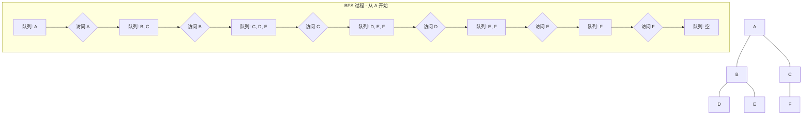
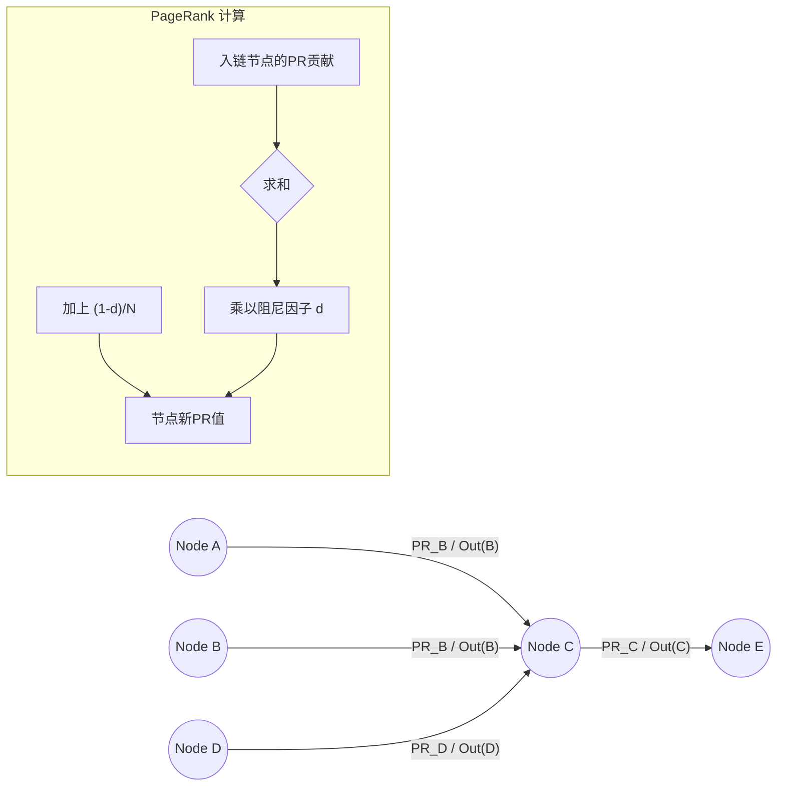
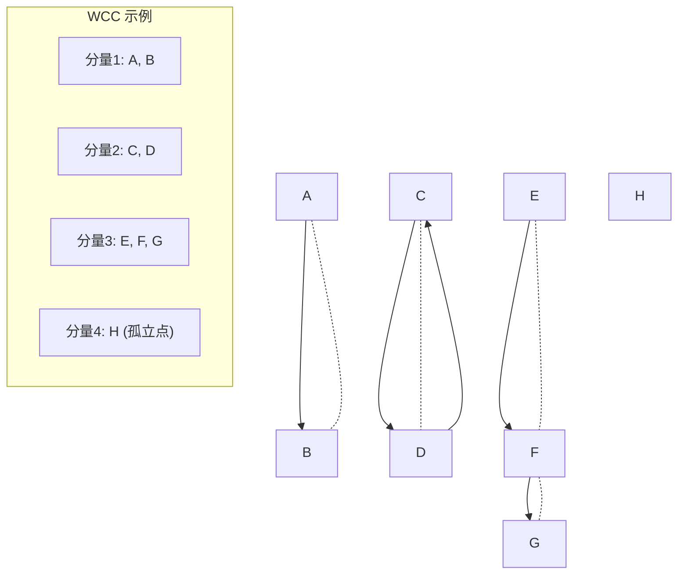
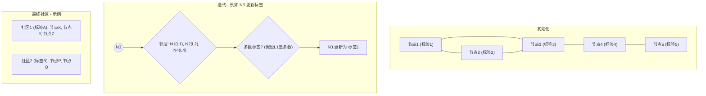
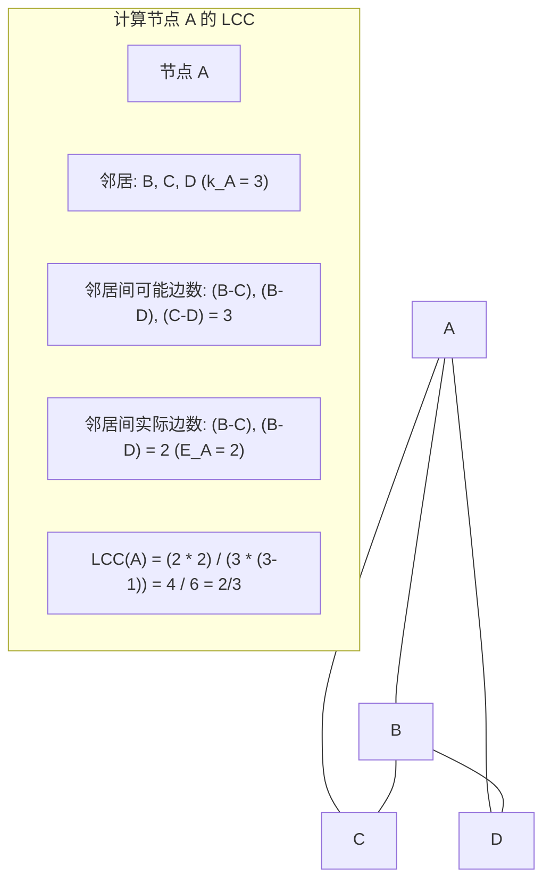
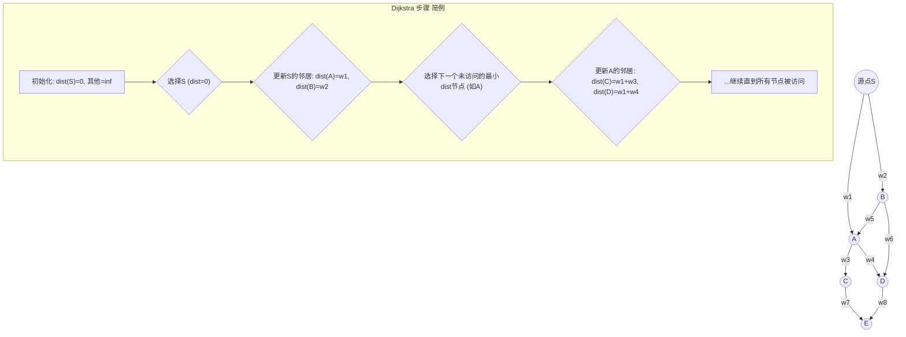

## AI论文解读 | The LDBC Graphalytics Benchmark  
    
### 作者    
digoal    
    
### 日期    
2025-05-27    
    
### 标签    
PostgreSQL , PolarDB , DuckDB , AI , 论文解读    
    
----    
    
## 背景    
https://arxiv.org/pdf/2011.15028    
    
提示:    
```    
读懂《The LDBC Graphalytics Benchmark v1.0.5》这篇论文需要提前掌握哪些基础知识, 请给我讲一下这些基础知识, 尽量通熟易懂, 可以使用markdown支持的图形增加解释性.    
    
通熟易懂的解读《The LDBC Graphalytics Benchmark v1.0.5》这篇论文, 关键内容请深入讲解, 可以使用markdown支持的图形增加解释性.    
    
提取《The LDBC Graphalytics Benchmark v1.0.5》论文中一些重要的术语并详细解释, 可以使用markdown支持的图形示增加解释性.    
```
   
```
使用中文详细介绍图数据库相关的搜索算法, 配合markdown支持的图形增加解释性. 至少包括如下算法, 如有其他算法也请补充. 
- 广度优先搜索 (Breadth-First Search, BFS)
- PageRank (PR)
- 弱连通分量 (Weakly Connected Components, WCC)
- 使用标签传播的社区检测 (Community Detection using Label Propagation, CDLP)
- 局部聚类系数 (Local Clustering Coefficient, LCC)
- 单源最短路径 (Single-Source Shortest Paths, SSSP)
```
   
    
## 1 前置知识    
  
好的，我们来分解理解 LDBC Graphalytics Benchmark 这篇论文所需的基础知识。你可以把这些看作是积木——在你完全理解这篇论文之前，你需要掌握一些关键概念。  
  
以下是你需要熟悉的主要领域：  
  
    
  
### 1. 图论基础 📊  
  
这篇论文的核心是分析“图”。  
  
* **什么是图 (Graph)？**  
    想象一个由相互连接的事物组成的网络。在图论中：  
    * 这些“事物”被称为**顶点 (vertices)**（或节点 (nodes)）。可以把它们想象成社交网络中的人、网页或地图上的城市。每个顶点通常有一个唯一的ID。    
    * 它们之间的“连接”被称为**边 (edges)**（或关系 (relationships)、链接 (links)）。可以把它们想象成友谊关系、网页之间的超链接或城市之间的道路。  
  
    ```mermaid  
    graph LR
        A[顶点 A] --- B[顶点 B]
        B --- C[顶点 C]
        C --- A
        D[顶点 D]
    ```  
    *在这个简单的图中，A、B、C 和 D 是顶点。A-B、B-C 和 C-A 之间的线是边。在这个例子中，顶点 D 没有连接到其他顶点。*  
  
* **图的类型：**  
    * **有向图 (Directed Graph) vs. 无向图 (Undirected Graph)：**    
        * **无向图：** 边就像双向街道。如果 A 连接到 B，那么 B 也连接到 A。可以想象成 Facebook 上的好友关系。    
        * **有向图：** 边就像单向街道。如果 A 指向 B，并不一定意味着 B 也指向 A。可以想象成 Twitter 上的关注关系（你可以关注某人，但他们不必关注你）。    
  
        ```mermaid  
        graph LR
            subgraph 有向图
                X[X] --> Y[Y]
                Y --> Z[Z]
            end
            subgraph 无向图
                U[U] --- V[V]
                V --- W[W]
            end
        ```  
    * **加权图 (Weighted Graph)：** 边可以有一个“权重 (weight)”或“成本 (cost)”。例如，在地图的图中，两个城市之间边的权重可以是距离、旅行时间或机票费用。论文中提到边的权重可以是浮点数。    
  
* **图的属性：**  
    * **邻居 (Neighbors)：** 与特定顶点相连的顶点是它的邻居。    
    * **路径 (Path)：** 由边连接起来的一系列顶点。  
    * **自环 (Self-loops) 和多重边 (Multi-edges)：** 论文中明确指出其图不允许自环（从一个顶点到其自身的边）或多重边（同一对顶点之间的多条边）。    
  
    
  
### 2. 图处理平台 ⚙️  
  
* **它们是什么？** 这些是设计用来存储、管理和分析大量图数据的软件系统。论文中提到的例子包括 Giraph、GraphLab，甚至像 Hadoop 和 Spark 这样的通用数据处理框架。    
* **为什么需要它们？** 分析图，尤其是大规模的图（想象一下拥有数十亿连接的社交网络），计算量非常大。这些平台提供了高效执行复杂计算的工具和框架。  
* **挑战：** 图分析通常涉及不规则的数据访问模式，这可能导致性能瓶颈。   这也是像 Graphalytics 这样的基准测试如此重要的一个关键原因——用来理解和比较不同平台如何应对这些挑战。  
  
    
  
### 3. 基准测试概念 ⏱️💰  
  
* **什么是基准测试 (Benchmarking)？**  
    这是一种标准化的方法，用于衡量和比较系统的性能。可以把它看作是针对计算机或软件的标准化测试。Graphalytics 的目标是实现对图分析平台的公平和客观比较。    
  
* **为什么要进行基准测试？**  
    * **对于用户：** 选择最适合其需求的平台。    
    * **对于开发者：** 识别性能瓶颈，调整系统，并指导未来的开发。    
  
* **Graphalytics 中的关键基准测试元素：**  
    * **工作负载 (Workload)：** 这包括：  
        * **算法 (Algorithms)：** 一组具有代表性的待运行任务（例如，查找最短路径、识别社区）。    
        * **数据集 (Datasets)：** 标准化的输入图（包括真实世界图和综合生成图），用于运行算法。    
    * **指标 (Metrics)：** 可量化的性能度量。常见的指标包括：  
        * **执行时间 (Execution Time)：** 完成一项任务所需的时间（例如，“加载时间 (Load time)”、“总运行时间 (Makespan)”、“处理时间 (Processing time)”）。    
        * **吞吐量 (Throughput)：** 单位时间内完成的工作量（例如，“每秒处理边数 (Edges Per Second, EPS)”或“每秒处理边和顶点数 (Edges and Vertices per Second, EVPS)”）。    
        * **可伸缩性 (Scalability)：** 当数据大小或工作负载增加时，系统的性能表现。Graphalytics 关注“弱 (weak)”和“强 (strong)”可伸缩性。    
        * **成本 (Cost)：** 三年总拥有成本 (Total Cost of Ownership, TCO) 和性价比 (Price-per-Performance, PPP)。    
    * **验证 (Validation)：** 通过将被测系统产生的结果与参考输出进行比较，确保其正确性。   使用了不同的匹配方法，如精确匹配、等价匹配和 epsilon 匹配。    
  
* **被测系统 (System Under Test, SUT)：** 这是指被基准测试的软件平台和硬件环境的组合。    
  
    
  
### 4. 常见的图算法（核心算法） 🧠  
  
该论文侧重于一组“核心”算法。   了解它们的基本用途会有所帮助：  
  
* **广度优先搜索 (Breadth-First Search, BFS)：** 从一个起始顶点开始，逐层探索图。用于查找边数最少的路径。    
    * *可以想象在社交网络中找到你所有的朋友，然后是你朋友的所有朋友，依此类推。*  
* **PageRank (PR)：** 根据顶点（最初是网页）的重要性对其进行排名，重要性由传入链接的数量和质量决定。    
    * *可以想象谷歌如何对搜索结果进行排名。*  
* **弱连通分量 (Weakly Connected Components, WCC)：** 查找顶点集合，其中集合中的任意两个顶点之间都存在路径（忽略边的方向）。    
    * *可以想象在网络中找到独立的集群或群组。*  
* **使用标签传播的社区检测 (Community Detection using Label Propagation, CDLP)：** 通过让顶点采用其邻居中最常见的“标签”（社区ID）来识别图中的社区或集群。    
    * *另一种寻找群组的方法，常用于社交网络分析。*  
* **局部聚类系数 (Local Clustering Coefficient, LCC)：** 衡量一个顶点的邻居之间的连接紧密程度（即，一个顶点的邻居中有多少也是彼此的邻居）。    
    * *可以想象衡量你的朋友之间互相认识的程度。*  
* **单源最短路径 (Single-Source Shortest Paths, SSSP)：** 在加权图中，查找从单个起始顶点到所有其他顶点的最短路径，路径长度是边权重的总和。    
    * *可以想象在城市中找到从你家到所有其他地点的最快路线，同时考虑到不同道路的通行时间。*  
  
    
  
### 5. 数据概念 💾  
  
* **数据集 (Datasets)：**  
    * **真实世界数据集 (Real-world Datasets)：** 源自实际应用的图，如社交网络（例如 Friendster、Twitter）或知识图谱（例如 Wikipedia）。    
    * **合成数据集 (Synthetic Datasets)：** 使用特定模型或生成器人工生成的图（例如 Graph500 生成器、LDBC Datagen）。   这允许在不同图大小和结构下进行受控实验。  
* **数据集规模 ("T-shirt sizes")：** 一种根据顶点和边的总数对图进行分类的方法（例如，S、M、L、XL）。   这有助于比较相似数量级数据集的性能。  
* **数据格式 (EVLP)：** 论文提到图以 "边/顶点列表及属性" (Edge/Vertex-List with Properties, EVLP) 格式表示，该格式包含两个文本文件：一个用于顶点，一个用于边，并可带有可选属性。    
  
    
  
通过掌握这些核心概念，你就能更好地深入研究 LDBC Graphalytics Benchmark 论文的具体内容，并理解其在图分析领域的贡献。祝你学习顺利！  
  
---

### 图数据库相关搜索算法详解 🔍

图数据库中的搜索算法帮助我们理解节点之间的关系、发现模式、评估节点重要性以及划分社群等。以下是一些核心的图搜索算法：
   
感兴趣也可参阅其他关于算法的一些文章:  
- https://www.hello-algo.com/
- https://algo.codefather.cn/algorithms/graph
- https://zhuanlan.zhihu.com/p/414460346
  
#### 1. 广度优先搜索 (Breadth-First Search, BFS) 🌐

**核心思想：** BFS 是一种用于遍历或搜索树或图数据结构的算法。它从一个起始节点开始，首先访问其所有直接相邻的节点，然后是这些邻居节点的未访问邻居，以此类推，逐层向外扩展。

**工作原理：**
1.  选择一个起始节点，将其标记为已访问并放入队列中。
2.  当队列不为空时，从队列头部取出一个节点。
3.  访问该节点的所有未访问邻居节点，将它们标记为已访问并放入队列尾部。
4.  重复步骤 2 和 3，直到队列为空。

**应用场景：**
* **最短路径（无权图）：** 查找两个节点之间边的数量最少的路径。
* **网络爬虫：** 发现网页之间的链接。
* **社交网络分析：** 查找一度、二度好友关系。
* **连通性检查：** 判断图或子图是否连通。

**图示解释 (Markdown 支持的简单表示):**



**说明：** 上图展示了从节点 A 开始进行 BFS 的过程。首先访问 A，然后是 A 的邻居 B 和 C，接着是 B 的邻居 D 和 E，最后是 C 的邻居 F。

  

#### 2. PageRank (PR) 👑

**核心思想：** PageRank 是一种由 Google 创始人拉里·佩奇和谢尔盖·布林提出的算法，最初用于衡量网页的重要性。其基本思想是，一个页面的重要性取决于指向它的其他页面的数量和质量。在图数据库中，它可以用来评估节点的中心性或影响力。

**工作原理：**
1.  **初始化：** 为图中所有节点分配一个初始的 PageRank 值 (通常是 $1/N$，其中 $N$ 是节点总数)。
2.  **迭代计算：** 在每次迭代中，每个节点将其当前的 PageRank 值平均分配给它指向的出度邻居节点。一个节点的新的 PageRank 值是所有指向它的入度邻居节点传递过来的 PageRank 值之和。
3.  **阻尼因子 (Damping Factor)：** 为了处理没有出度链接的“陷阱”节点和循环，引入了一个阻尼因子 $d$ (通常设为 0.85)。这意味着用户有 $d$ 的概率会继续点击链接，有 $1-d$ 的概率会随机跳转到一个新的页面。公式可以表示为：
    $PR(A) = (1-d)/N + d * \sum (PR(T_i) / C(T_i))$
    其中：
    * $PR(A)$ 是节点 A 的 PageRank 值。
    * $N$ 是图中节点的总数。
    * $T_i$ 是指向节点 A 的节点。
    * $C(T_i)$ 是节点 $T_i$ 的出度数量。
    * $d$ 是阻尼因子。
4.  **收敛：** 重复迭代计算，直到各个节点的 PageRank 值趋于稳定（变化小于某个阈值）。

**应用场景：**
* **网页排名：** 搜索引擎的核心算法之一。
* **社交网络影响分析：** 识别最具影响力的用户。
* **推荐系统：** 推荐重要的项目或用户。
* **生物信息学：** 分析蛋白质相互作用网络中的关键蛋白质。

**图示解释 (概念图):**



**说明：** 节点 C 的 PageRank 值部分来自于指向它的节点 A, B, D 的贡献，这些贡献是基于这些节点的 PageRank 值及其出度数量。

  

#### 3. 弱连通分量 (Weakly Connected Components, WCC) 🔗

**核心思想：** 在有向图中，如果将所有有向边替换为无向边后，任意两个节点之间都存在路径，则这些节点构成一个弱连通分量。换句话说，WCC 是图中节点的子集，其中任意两个节点之间都存在一条路径（忽略边的方向）。

**工作原理：**
1.  **忽略方向：** 将图中的所有有向边视为无向边。
2.  **遍历：** 从任意一个未访问的节点开始，使用 BFS 或 DFS 遍历所有可以到达的节点。这些被遍历到的节点构成一个弱连通分量。
3.  **重复：** 如果图中还有未访问的节点，则重复步骤 2，直到所有节点都被访问并分配到某个弱连通分量中。

**应用场景：**
* **图结构分析：** 理解图的整体连通性和分离性。
* **数据清洗：** 识别和处理孤立的子图。
* **社区发现的预处理：** 有时作为更复杂社区检测算法的初始步骤。

**图示解释:**


**说明：** 在上图中，即使 A 指向 B，C 和 D 互相指向，E->F->G，H 是孤立的。如果忽略边的方向，(A,B) 是一组，(C,D) 是一组，(E,F,G) 是一组，H 自己是一组。它们各自构成一个弱连通分量。

  

#### 4. 使用标签传播的社区检测 (Community Detection using Label Propagation, CDLP) 🏷️🏘️

**核心思想：** CDLP 是一种简单且高效的社区检测算法。它通过模拟标签在网络中传播的过程来识别社区。每个节点最初被赋予一个唯一的标签，然后在迭代过程中，每个节点将其标签更新为其邻居节点中最常出现的标签。

**工作原理：**
1.  **初始化：** 为图中的每个节点分配一个唯一的标签。
2.  **迭代更新：**
    * 以随机顺序遍历所有节点。
    * 对于当前节点，查看其所有邻居节点的标签。
    * 将当前节点的标签更新为其邻居节点中出现频率最高的标签。如果存在多个频率最高的标签，则随机选择一个或根据特定规则选择。
3.  **收敛：** 重复步骤 2，直到没有节点的标签发生变化，或者达到预设的迭代次数。最终，具有相同标签的节点被视为属于同一个社区。

**应用场景：**
* **社交网络分析：** 发现用户群体或兴趣小组。
* **生物网络：** 识别功能相关的蛋白质或基因模块。
* **推荐系统：** 基于用户所属社区进行推荐。

**图示解释 (概念):**


**说明：** 初始时每个节点有自己的标签。在迭代中，节点会采纳其邻居中最流行的标签。最终，相同标签的节点形成社区。

  

#### 5. 局部聚类系数 (Local Clustering Coefficient, LCC) 🔗📐

**核心思想：** LCC 用于衡量一个节点的邻居节点之间相互连接的紧密程度。一个节点的局部聚类系数高，意味着它的邻居们倾向于形成一个紧密的团伙。

**工作原理：**
对于一个节点 $v$，其局部聚类系数 $LCC(v)$ 定义为：
$LCC(v) = \frac{2 \times E_v}{k_v \times (k_v - 1)}$
其中：
* $E_v$ 是节点 $v$ 的邻居节点之间实际存在的边数。
* $k_v$ 是节点 $v$ 的度（邻居节点的数量）。
* $k_v \times (k_v - 1) / 2$ 是节点 $v$ 的邻居节点之间可能存在的最大边数（如果它们形成一个完全图）。

如果 $k_v < 2$ (即节点度为 0 或 1)，则其局部聚类系数通常定义为 0。

**应用场景：**
* **社交网络分析：** 衡量个体社交圈的紧密性，例如“你的朋友们互相认识的程度”。
* **网络鲁棒性分析：** 聚类系数高的区域可能更具弹性。
* **生物网络：** 分析蛋白质相互作用网络中的功能模块。

**图示解释:**


**说明：** 节点 A 有三个邻居 B, C, D。这些邻居之间最多可以有 3 条边 (B-C, B-D, C-D)。实际上，B-C 和 B-D 之间存在边，共 2 条。因此，A 的 LCC 是 (2 * 2) / (3 * 2) = 2/3。

  

#### 6. 单源最短路径 (Single-Source Shortest Paths, SSSP) 🗺️➡️

**核心思想：** SSSP 算法用于查找从图中的一个指定源节点到所有其他节点的最短路径。路径的长度可以是边的数量（对于无权图），也可以是边的权重之和（对于有权图）。

**工作原理 (以 Dijkstra 算法为例，适用于非负权重边):**
1.  **初始化：**
    * 创建一个距离集合，将源节点的距离设为 0，其他所有节点的距离设为无穷大。
    * 创建一个已访问节点集合，初始为空。
    * 创建一个优先队列，用于存储待访问的节点及其当前计算出的最短距离。将源节点放入优先队列。
2.  **迭代：**
    * 当优先队列不为空时，从中取出距离最小的未访问节点 $u$。
    * 将节点 $u$ 标记为已访问。
    * 对于节点 $u$ 的每一个邻居节点 $v$：
        * 如果通过 $u$ 到达 $v$ 的路径比当前记录的到 $v$ 的最短路径更短 (即 `dist[u] + weight(u,v) < dist[v]`)，则更新 $dist[v]$，并将 $v$（或更新其在队列中的优先级）加入优先队列。
3.  **完成：** 当优先队列为空，或者所有可达节点都已被访问后，算法结束。距离集合中存储了从源节点到各节点的最短路径长度。

**其他 SSSP 算法：**
* **Bellman-Ford 算法：** 可以处理带有负权重边的图（但不能有负权重环路）。
* **BFS (用于无权图)：** 如前所述，BFS 可以找到无权图中的最短路径。

**应用场景：**
* **路由协议：** 如 OSPF 协议，计算网络中的最短路径。
* **地图导航：** 查找从一个地点到另一个地点的最快或最短路线。
* **物流配送：** 优化配送路径。
* **社交网络：** 查找两个人之间的最短关系链。

**图示解释 (Dijkstra 概念):**


**说明：** 从源点 S 开始，Dijkstra 算法逐步扩展，总是选择当前已知路径最短的未访问节点进行探索和更新其邻居的距离。

  

#### 其他补充算法 ➕

除了上述核心算法，图数据库中还有其他一些重要的搜索和分析算法：

* **深度优先搜索 (Depth-First Search, DFS):** 沿着一条路径尽可能深地搜索，直到到达末端，然后回溯。常用于拓扑排序、寻找环路、连通性检查等。
    ```mermaid
    graph TD
        A --- B
        A --- C
        B --- D
        B --- E
        C --- F

        subgraph DFS 过程 - 从 A 开始  假设先访问B
            direction LR
            P1{访问 A} --> P2{访问 B}
            P2 --> P3{"访问 D (B的第一个邻居)"}
            P3 --> BacktrackToB{D无子嗣,回溯到B}
            BacktrackToB --> P4{"访问 E (B的下一个邻居)"}
            P4 --> BacktrackToA{E无子嗣,回溯到A}
            BacktrackToA --> P5{"访问 C (A的下一个邻居)"}
            P5 --> P6{"访问 F (C的第一个邻居)"}
        end
    ```

* **K跳邻居 (K-Hop Neighbors):** 查找距离给定节点 K 跳范围内的所有节点。常用于社交网络中查找 N 度好友，或在推荐系统中基于邻近用户/物品进行推荐。

* **三角形计数 (Triangle Counting):** 计算图中三角形的数量。三角形是图中最简单的簇结构，其数量可以反映网络的聚集程度。与局部聚类系数相关。

* **强连通分量 (Strongly Connected Components, SCC):** 在有向图中，如果一个子图中的任意两个节点 $u$ 和 $v$ 都存在从 $u$ 到 $v$ 的路径以及从 $v$ 到 $u$ 的路径，则这个子图是一个强连通分量。常用于分析有向网络的结构，如网页链接、调用图等。

    ```mermaid
    graph TD
        A --> B
        B --> C
        C --> A
        C --> D
        D --> E
        E --> D

    subgraph SCC 示例
        direction LR
        SCC1[分量1: A, B, C]
        SCC2[分量2: D, E]
    end
    ```

* **Louvain 社区检测 (Louvain Modularity):** 另一种流行的社区检测算法，它通过优化模块度 (Modularity) 这个指标来发现社区。模块度衡量了一个网络划分成社区的质量，模块度越高，社区内部连接越紧密，社区之间连接越稀疏。

这些算法为我们提供了强大的工具来探索和理解图数据中蕴含的丰富信息。在实际应用中，通常会根据具体的业务需求和数据特点选择合适的算法或组合使用它们。

  
  
## 2 解读论文    
  
好的，这篇《LDBC Graphalytics Benchmark v1.0.5》论文  ，简单来说，就是为各种**图分析平台**（专门处理和分析复杂网络数据的软件系统）提供了一个**公平、标准化的“跑分”测试**。它的目标是让大家能够客观地比较这些平台的性能  。  
  
想象一下，市面上有各种各样的跑车，每家都说自己的车最快、性能最好。为了知道到底谁更强，我们需要一个标准的赛道、统一的比赛规则和明确的衡量标准。Graphalytics 就是图分析领域的这个“赛道和规则”。  
  
    
### 核心目标与意义  
  
* **公平比较**：确保不同的图分析平台能在同一起跑线上进行性能比较  。  
* **发现瓶颈**：帮助开发者和用户理解平台的性能瓶颈在哪里，以便进行优化  。  
* **指导选择与设计**：为用户选择合适的平台提供依据，并为平台的设计和改进提供数据支持  。  
  
    
### 基准测试的关键组成部分  
  
这篇论文详细定义了构成 Graphalytics 基准测试的各个要素  。  
  
#### 1. 数据集 (Datasets) 💾  
  
基准测试需要有标准的输入数据。Graphalytics 使用了：  
  
* **真实世界图谱**：来自不同领域的真实网络数据，例如社交网络（如 com-friendster）、知识图谱（如 wiki-talk）和游戏网络（如 dota-league） 。这保证了测试的实际相关性。  
* **合成图谱**：使用图生成器（如 Graph500 generator 和 LDBC Datagen）创建的图  。这允许测试更大规模、特定结构的图，并能更好地控制变量。  
* **数据格式 (EVLP)**：图数据以一种名为“带属性的边/顶点列表”（Edge/Vertex-List with Properties）的文本格式存储  。它包含两个文件：一个顶点文件（每行列出一个顶点ID，可带属性）和一个边文件（每行列出一条边的两个顶点ID，可带属性） 。  
    * 顶点ID是唯一的64位无符号整数  。  
    * 边可以是**有向的**（像单行道）或**无向的**（像双行道） 。  
    * 不允许自环（顶点到自身的边）和多重边（一对顶点间有多条边） 。  
  
    ```mermaid  
    graph LR
        A[顶点A] --> B["顶点B (权重1.5)"]
        C[顶点C] --- D["顶点D (权重2.0)"]
    ```  
    *示例：顶点A到B的有向边，C和D之间的无向边，边上可以有权重等属性。*  
  
* **规模分类 ("T-shirt sizes")**：为了方便比较，图的规模根据顶点数 ($n$) 和边数 ($m$) 的总和 ($n+m$) 来定义，并映射到类似“S、M、L、XL”这样的“T恤尺码”上  。计算公式为：`Scale(n, m) = floor(log10(n + m)) / 10`  。基准点是 L 级，定义为 BFS 算法在一台主流单机上对该规模的任何图都能在一小时内完成  。  
  
#### 2. 算法 (Algorithms / Kernels) 🧠  
  
基准测试包含了一组精心挑选的、具有代表性的图分析算法，也称为**核心算法 (kernels)**  。这些算法覆盖了图分析中常见的计算模式和瓶颈  。  
  
包含以下六种核心算法  ：  
  
1.  **广度优先搜索 (Breadth-First Search, BFS)**  ：从一个指定的源顶点开始，逐层向外扩展，计算每个顶点到源顶点的最短路径长度（以边数为单位） 。未到达的顶点距离为无穷大  。  
2.  **PageRank (PR)**  ：一种迭代算法，根据链接结构为每个顶点赋予一个排名值，最初用于网页排名  。计算公式考虑了阻尼因子和“悬挂节点”（没有出链的顶点）的处理  。需要进行固定次数的迭代  。所有浮点数计算使用64位双精度  。  
3.  **弱连通分量 (Weakly Connected Components, WCC)**  ：找出图中的弱连通分量，并为每个顶点分配一个标签，表明它属于哪个分量  。在有向图中，边的方向被忽略，即图被当作无向图处理  。  
4.  **使用标签传播的社区检测 (Community Detection using Label Propagation, CDLP)**  ：一种迭代算法，通过让每个顶点采纳其邻居中最常见的标签（社区ID）来将顶点划分到不同的社区  。为了保证确定性和可验证性，当有多个标签频率最高时，选择数值最小的标签  。  
5.  **局部聚类系数 (Local Clustering Coefficient, LCC)**  ：衡量一个顶点的邻居之间相互连接的紧密程度  。即，一个顶点的邻居之间实际存在的边数与可能存在的最大边数的比率  。如果邻居少于2个，则系数为0  。  
6.  **单源最短路径 (Single-Source Shortest Paths, SSSP)**  ：计算从一个指定的源顶点到图中所有其他顶点的最短路径长度，路径长度是路径上各边权重之和  。边权重是非负的64位双精度浮点数  。  
  
#### 3. 输出验证 (Output Validation) ✅  
  
为了确保结果的正确性，每次算法执行的输出都必须与**参考输出 (reference output)**进行比较和验证  。参考输出通常由一个经过交叉验证的特定平台生成  。  
  
有三种验证方法  ：  
  
* **精确匹配 (Exact match)**：系统输出的顶点值必须与参考输出完全相同  。适用于 BFS、CDLP  。  
* **等价匹配 (Equivalence match)**：系统输出的顶点值在某种等价关系下与参考输出相同  。例如，在 WCC 中，只要属于同一组件的顶点在两个输出中具有相同的（可能不同的）标签即可  。  
* **Epsilon 匹配 (Epsilon match)**：由于浮点数计算的舍入误差，允许一定的误差范围  。如果系统输出值 `s` 和参考值 `r` 满足 `|r - s| <= ε|r|`（其中 `ε = 0.0001`），则认为匹配  。适用于 PR、LCC、SSSP  。  
  
#### 4. 指标 (Metrics) ⏱️💰  
  
Graphalytics 定义了一系列指标来量化平台的性能  。  
  
* **性能指标 (Performance metrics)**  ：  
    * **加载时间 (Load time, Tl)**：将图加载到被测系统中并进行预处理所需的时间 (秒)  。每个图只执行一次  。  
    * **总运行时间 (Makespan, Tm)**：从驱动程序发出执行命令到算法输出可用的总时间 (秒)  。模拟“冷启动”情况  。  
    * **处理时间 (Processing time, Tp)**：实际执行算法所需的时间 (秒)，不包括加载、资源分配等开销  。模拟“热启动”或生产环境中的情况  。  
    * 执行时间有**超时限制**，超时则记录为超时时长  。  
* **吞吐量指标 (Throughput metrics)**  ：  
    * **每秒处理边数 (Edges Per Second, EPS)**：处理的边数除以处理时间 (Tp)  。  
    * **每秒处理边和顶点数 (Edges and Vertices per Second, EVPS)**：处理的 (边数 + 顶点数) 除以处理时间 (Tp)  。这与 Graphalytics 定义的图规模密切相关  。  
* **成本指标 (Cost metrics)**  ：  
    * **三年总拥有成本 (Three-year Total Cost of Ownership, TCO)**：以美元计，遵循 LDBC 的规则  。  
    * **单位性能价格 (Price-per-performance, PPP)**：TCO 与 EVPS 的比率  。  
  
    
### 基准测试流程 (Benchmark Process) ⚙️  
  
论文描述了如何执行基准测试  。  
  
* **基准测试的构成**：一个基准测试由多个**基准测试实验 (benchmark experiments)** 组成，每个实验包含多个**基准测试作业 (benchmark jobs)**，每个作业又通过多次**基准测试运行 (benchmark runs)** 来重复执行以获得可靠结果  。  
    * **实验**：针对特定的性能特征，如某个算法的性能或系统的弱可伸缩性  。  
    * **作业**：定义了在特定图数据集上运行特定图算法的具体任务  。  
    * **运行**：作业的一次实际执行  。  
  
* **执行流程**：  
    1.  **验证设置 (Verify-setup)**  。  
    2.  **格式化图 (Format-graph)**：根据算法需求，从输入数据中剥离无用的属性，最小化数据  。  
    3.  **加载图 (Load-graph)**：平台将格式化后的数据转换为特定格式并加载到存储中  。  
    4.  **执行运行 (Execute-run)**：平台执行一个基准测试运行  。  
    5.  **删除图 (Delete-graph)**：清理加载的图数据  。  
  
* **单次运行流程 (Run Flow)**：  
    1.  **准备 (Prepare)**：平台请求资源  。  
    2.  **启动 (Startup)**：配置运行环境  。  
    3.  **运行 (Run)**：执行图处理作业，必须在超时前完成  。  
    4.  **验证 (Validate)**：基准测试套件验证平台输出的正确性  。  
    5.  **完成 (Finalize)**：平台报告信息，为下次运行做准备  。  
    6.  **终止 (Terminate)**：如果超时，则强行停止作业并清理  。  
    7.  **归档 (Archive)**：基准测试套件收集结果和失败信息  。  
  
* **失败指示 (Failure Indication)**：对测试过程中可能出现的各种失败类型进行了分类，如数据失败(DAT)、初始化失败(INI)、执行失败(EXE)、超时失败(TIM)、完成失败(COM)、验证失败(VAL)、指标失败(MET)  。  
  
    
### 更新过程 (Renewal Process) 🔄  
  
为了确保基准测试的长期有效性，Graphalytics 包含了一个**更新过程**  。这意味着会定期更新：  
  
* **算法和数据集**：通过一个两阶段的选择过程来引入新的、更能代表实际应用和挑战的算法和数据集  。  
* **规模定义**：随着硬件和软件的进步，对图的“大小”的定义（如 L 号）也会相应调整  。  
  
    
### 竞赛 (Competitions) 🏆  
  
Graphalytics 还定义了基于其基准的竞赛规则，例如全球 LDBC 竞赛和全球 Graphalytics 竞赛  。这些竞赛使用不同的方法（如单一综合评分法或锦标赛制）来对参赛平台进行排名  。  
  
    
  
总而言之，LDBC Graphalytics Benchmark v1.0.5 提供了一套全面、严谨且可扩展的框架，用于评估和比较图分析平台的性能，推动该领域的技术发展和创新。它不仅定义了“考什么”（数据集和算法），还定义了“怎么考”（执行流程和指标）以及“如何保证公平和与时俱进”（验证和更新机制）。  
  
## 3 术语    
  
好的，这篇论文中包含许多重要的图计算和基准测试领域的术语。以下是一些关键术语及其详细解释：  
  
    
### 核心图论与数据术语  
  
#### 1. **图 (Graph)** 📊  
* **定义**：一个图由**顶点 (Vertices/Nodes)** 和连接这些顶点的**边 (Edges/Relationships)** 组成  。  
* **顶点 (Vertex)**：图中的基本单元，代表实体，如社交网络中的人或网页。每个顶点有一个唯一的64位无符号整数ID  。  
* **边 (Edge)**：连接两个顶点，表示它们之间的关系。边可以是**有向的**（方向性连接，如A关注B）或**无向的**（双向连接，如A和B是朋友） 。  
* **权重 (Weight)**：可以赋予边的数值，表示关系的强度、成本或距离等  。Graphalytics 支持浮点数权重，并要求内部以64位双精度IEEE 754格式存储和处理  。  
  
    ```mermaid  
    graph LR
        A["顶点A (ID:1)"] -- 权重:2.5 --- B["顶点B (ID:2)"]
        C["顶点C (ID:3)"] -- 有向边 --> D["顶点D (ID:4)"]
    ```  
    *示例：顶点A和B通过一条权重为2.5的无向边连接；顶点C有一条指向顶点D的有向边。*  
  
#### 2. **EVLP (Edge/Vertex-List with Properties) 格式** 📄  
* **定义**：Graphalytics 用于表示图输入和输出的文件格式  。它由两个文本文件组成：一个顶点文件和一个边文件，两者都可以包含属性  。  
    * **顶点文件**：每行包含一个顶点ID，按升序排序  。  
    * **边文件**：每行包含两个由空格分隔的顶点ID，表示一条边。边按顶点ID的字典序排序；对于无向图，较小的ID在前，且每条边只列出一次  。  
* **属性**：顶点或边的额外信息（如权重）跟在ID后面，用空格分隔  。  
  
#### 3. **图的规模 (Scale) 与 T恤尺码 (T-shirt sizes)** 👕  
* **规模定义**：根据顶点数 ($n$) 和边数 ($m$) 计算，公式为：Scale(n, m) =  $\lfloor \text{log}_{10}(n + m) \rfloor / 10$  。这提供了一个对图大小的直观感受  。  
* **T恤尺码**：规模值被分组成不同的类别（如 S, M, L, XL, 2XL），每个类别跨越0.5个规模单位，方便比较  。例如，L 级被定义为 BFS 算法在任何该规模的图上，使用先进的图分析平台和单个商用机器，能在一小时内完成的最大类别  。  
  
    
### 核心算法术语 🧠  
  
论文中提到的六种核心算法本身就是重要术语：  
  
#### 4. **广度优先搜索 (Breadth-First Search, BFS)**  
* **解释**：一种图遍历算法，从一个给定的源顶点（根）开始，逐层探索图，标记每个顶点到源顶点的最短路径长度（以边数为单位） 。根的深度为0，其直接邻居深度为1，依此类推  。  
  
#### 5. **PageRank (PR)**  
* **解释**：一种迭代算法，为图中的每个顶点分配一个排名值，表示其重要性  。最初由谷歌搜索用于对网页进行排名  。其计算涉及到阻尼因子、顶点出度以及对“汇点顶点”（没有出边的顶点）的处理  。  
  
#### 6. **弱连通分量 (Weakly Connected Components, WCC)**  
* **解释**：该算法查找图的弱连通分量，并为每个顶点分配一个唯一的标签，指示其所属的分量  。如果两个顶点之间存在路径（在有向图中允许逆向遍历边），则它们属于同一分量  。  
  
#### 7. **使用标签传播的社区检测 (Community Detection using Label Propagation, CDLP)**  
* **解释**：一种迭代算法，通过标签传播来识别图中的社区结构  。每个顶点根据其邻居标签的频率更新自己的标签，选择最常见的标签；如果频率相同，则选择数值最小的标签以保证确定性  。  
  
#### 8. **局部聚类系数 (Local Clustering Coefficient, LCC)**  
* **解释**：衡量一个顶点的邻居之间相互连接的紧密程度的指标  。计算公式为顶点邻居间实际存在的边数除以可能的最大边数  。  
  
#### 9. **单源最短路径 (Single-Source Shortest Paths, SSSP)**  
* **解释**：计算从给定的源顶点到图中所有其他顶点的最短路径长度，路径长度是路径上各边权重之和  。边权重为非负浮点数  。  
  
    
### 基准测试与性能指标术语 ⏱️⚙️  
  
#### 10. **基准测试作业 (Benchmark Job)**  
* **解释**：指在某个图数据集上执行某个图算法的过程  。其描述包括系统信息、算法、数据集和基准配置  。  
  
#### 11. **加载时间 (Load time, Tl)**  
* **解释**：将被测系统加载特定图所需的时间，包括将输入图转换为系统适用格式的任何预处理时间  。  
  
#### 12. **总运行时间 (Makespan, Tm)**  
* **解释**：从 Graphalytics 驱动程序发出在（先前上传的）图上执行算法的命令，到算法的输出对驱动程序可用的时间间隔  。这模拟了一个“冷启动”的图处理系统  。  
  
#### 13. **处理时间 (Processing time, Tp)**  
* **解释**：执行实际算法所需的时间，不包括平台特定的开销，如分配资源、从文件系统加载图或图分区  。这对应于一个已预热的、生产环境中的图处理系统操作  。  
  
#### 14. **每秒处理边和顶点数 (Edges and Vertices per Second, EVPS)**  
* **解释**：系统处理的边数和顶点数之和（即图的规模）与处理时间 (Tp) 的比率  。这是 Graphalytics 的一个关键吞吐量指标。  
  
#### 15. **输出验证 (Output Validation)**  
* **解释**：由于 Graphalytics 中的所有算法都是确定性的，因此可以通过将其输出与参考输出进行比较来验证其正确性  。  
    * **精确匹配 (Exact match)**：输出与参考完全相同（用于BFS, CDLP） 。  
    * **等价匹配 (Equivalence match)**：输出在某种等价关系下与参考相同（用于WCC） 。  
    * **Epsilon 匹配 (Epsilon match)**：允许因浮点舍入误差产生的小范围误差（用于PR, LCC, SSSP） 。  
  
        ```mermaid  
        graph TD
            A[算法执行] --> B{输出结果};
            B --> C{与参考输出比较};
            C -- 精确匹配 --> D[结果一致?];
            C -- 等价匹配 --> E[逻辑等价?];
            C -- Epsilon匹配 --> F[在误差范围内?];
        ```  
        *输出验证流程示意图*  
  
#### 16. **被测系统 (System Under Test, SUT)**  
* **解释**：指能够对图数据集执行图处理算法的软件平台和硬件环境的组合  。  
  
#### 17. **更新过程 (Renewal Process)**  
* **解释**：为确保基准测试的持续相关性，Graphalytics 包含一个更新过程，用于更新基准测试的工作负载（算法和数据集）以适应不断发展的系统和图分析社区的需求  。  
  
这些术语构成了理解《LDBC Graphalytics Benchmark v1.0.5》论文的基础。希望这些解释能帮助你更好地理解其内容。  
  
## 参考    
    
https://arxiv.org/pdf/2011.15028     
    
    
<b> 以上内容基于DeepSeek、QwQ及诸多AI生成, 轻微人工调整, 感谢杭州深度求索人工智能、阿里云等公司. </b>    
    
<b> AI 生成的内容请自行辨别正确性, 当然也多了些许踩坑的乐趣, 毕竟冒险是每个男人的天性.  </b>    
    
    
  
#### [期望 PostgreSQL|开源PolarDB 增加什么功能?](https://github.com/digoal/blog/issues/76 "269ac3d1c492e938c0191101c7238216")
  
  
#### [PolarDB 开源数据库](https://openpolardb.com/home "57258f76c37864c6e6d23383d05714ea")
  
  
#### [PolarDB 学习图谱](https://www.aliyun.com/database/openpolardb/activity "8642f60e04ed0c814bf9cb9677976bd4")
  
  
#### [PostgreSQL 解决方案集合](../201706/20170601_02.md "40cff096e9ed7122c512b35d8561d9c8")
  
  
#### [德哥 / digoal's Github - 公益是一辈子的事.](https://github.com/digoal/blog/blob/master/README.md "22709685feb7cab07d30f30387f0a9ae")
  
  
#### [About 德哥](https://github.com/digoal/blog/blob/master/me/readme.md "a37735981e7704886ffd590565582dd0")
  
  

  
