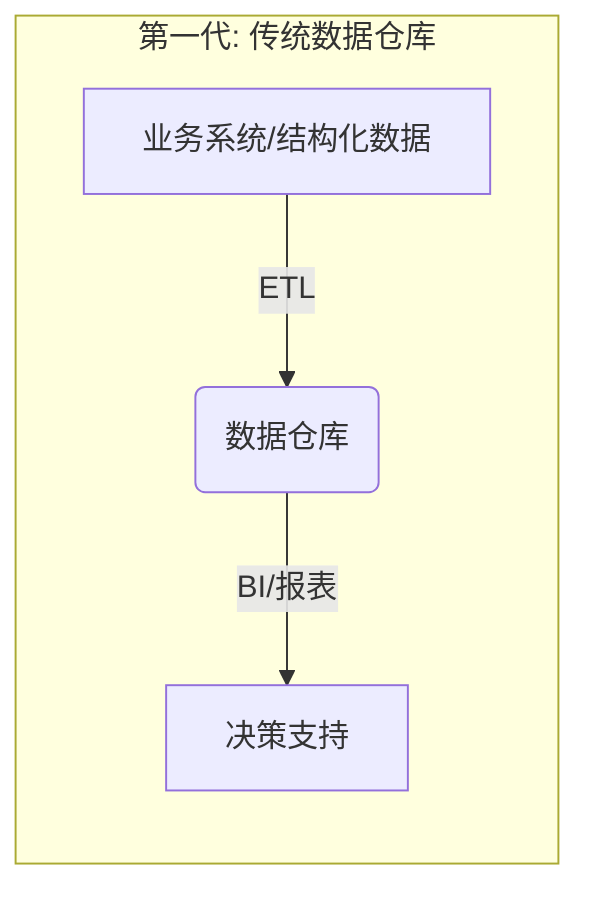
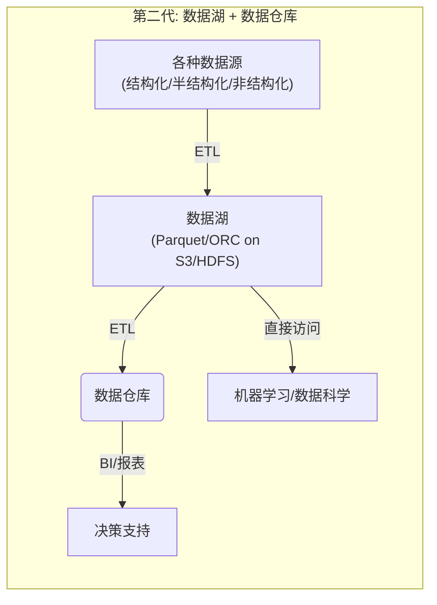
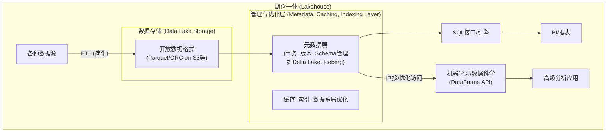

## AI论文解读 | Lakehouse: A New Generation of Open Platforms that Unify Data Warehousing and Advanced Analytics  
    
### 作者    
digoal    
    
### 日期    
2025-05-28    
    
### 标签    
PostgreSQL , PolarDB , DuckDB , AI , 论文解读    
    
----    
    
## 背景   
  
https://www.cidrdb.org/cidr2021/papers/cidr2021_paper17.pdf    
    
提示:    
```    
读懂《Lakehouse: A New Generation of Open Platforms that Unify Data Warehousing and Advanced Analytics》这篇论文需要提前掌握哪些基础知识, 请使用中文给我讲一下这些基础知识, 尽量通熟易懂, 可以使用markdown支持的图形增加解释性.    
    
使用中文通熟易懂的解读《Lakehouse: A New Generation of Open Platforms that Unify Data Warehousing and Advanced Analytics》这篇论文, 关键内容请深入讲解, 可以使用markdown支持的图形增加解释性.    
    
使用中文提取《Lakehouse: A New Generation of Open Platforms that Unify Data Warehousing and Advanced Analytics》论文中一些重要的术语并详细解释, 可以使用markdown支持的图形示增加解释性.    
```    
    
## 1 前置知识   

要理解这篇关于“湖仓一体”（Lakehouse）的论文，你需要先了解一些大数据和数据管理领域的基础概念。把这些概念想象成搭建乐高积木的模块，理解了它们，你就能更好地拼凑出“湖仓一体”这座新建筑的全貌了。

---
## 核心概念一览 🧱

简单来说，这篇论文探讨的是如何将“数据仓库”和“数据湖”的优点结合起来，创造一种更高效、更灵活的数据管理架构。所以，我们首先要明白这两个核心概念是什么，以及它们各自的演变和遇到的问题。

---
## ⏳ 数据分析平台的演进

### 1. 第一代：传统数据仓库 (Data Warehouses) 🏛️

想象一下，一个城市里所有的重要档案都集中存放在一个管理有序的中央档案馆。这就是**数据仓库**。

* **目标**：帮助企业领导者分析业务数据，做出决策，支持商业智能 (BI)  。
* **运作方式**：
    * 从各个业务系统 (如销售系统、库存系统) 中抽取 (Extract) 数据。
    * 对数据进行转换 (Transform)，比如清洗、整理、汇总，使其符合统一的格式和标准。
    * 将处理好的数据加载 (Load) 到数据仓库中。这个过程简称 **ETL**。
    * 数据进来时就必须定义好结构 (Schema-on-write)，就像文件入馆前必须编好目录一样，确保数据模型优化以便后续的 BI 分析  。
    * **图示**：
        ```mermaid
        graph LR
            A[业务系统1] --> C{ETL}
            B[业务系统2] --> C
            C --> D[数据仓库]
            D --> E[BI报表/决策支持]
        ```
* **遇到的问题**：
    * **成本高**：通常将计算和存储捆绑在本地设备上，企业需要为峰值负载和数据量付费，非常昂贵  。
    * **无法处理非结构化数据**：对于视频、音频、文本文档这类飞速增长的非结构化数据束手无策  。

---
### 2. 第二代：数据湖 (Data Lakes) + 数据仓库 🏞️ + 🏛️

为了解决传统数据仓库的问题，人们引入了**数据湖**。想象一个天然湖泊，它可以容纳各种形态的水源 (数据)，无论是处理过的还是未处理过的。

* **数据湖的特点**：
    * **低成本存储**：使用如 Hadoop 文件系统 (HDFS) 或云存储 (如 AWS S3, Azure ADLS, Google GCS) 存放所有原始数据，成本较低  。
    * **支持多种数据类型**：可以存储结构化、半结构化、非结构化数据  。
    * **开放格式**：数据通常以开放文件格式存储，如 Apache Parquet 和 ORC，方便各种分析引擎直接访问  。
    * **读取时定义结构 (Schema-on-read)**：数据存入时不需要预先定义严格的结构，读取数据时再根据需求解析，更加灵活  。
* **两层架构**：
    * 原始数据先存入数据湖。
    * 然后，数据湖中一小部分重要数据会经过 ETL 过程，加载到下游的数据仓库中，用于关键的决策支持和 BI 应用  。
    * **图示**：
        ```mermaid
        graph LR
            A["各种原始数据源 <br> (结构化/半结构化/非结构化)"] --> B{ETL/ELT}
            B --> C["数据湖 (如S3, HDFS) <br> (开放格式: Parquet, ORC)"]
            C --> D{ETL}
            D --> E["数据仓库 (如Redshift, Snowflake)"]
            E --> F[BI报表]
            C --> G[机器学习/数据科学]
        ```
* **这种架构的挑战 (也是论文要解决的问题)**：
    * **可靠性 (Reliability)**：保持数据湖和数据仓库之间数据的一致性很困难且成本高昂，ETL 步骤多，容易出错或引入 bug  。
    * **数据陈旧 (Data staleness)**：数据仓库中的数据相对于数据湖是滞后的，新数据加载往往需要数天  。这比第一代系统直接查询最新数据反而退步了  。
    * **高级分析支持有限 (Limited support for advanced analytics)**：机器学习 (ML) 系统 (如 TensorFlow, PyTorch) 难以高效地直接在数据仓库上运行。它们需要处理大量数据并使用复杂的非 SQL 代码  。从数据仓库通过 ODBC/JDBC 读取数据效率低下，也无法直接访问仓库内部的专有格式  。通常需要将数据从仓库导出到文件，这又增加了复杂性和数据陈旧性  。虽然可以直接在数据湖上运行 ML，但会丢失数据仓库提供的事务、版本控制等管理功能  。
    * **总拥有成本 (Total cost of ownership)**：除了持续的 ETL 成本，数据复制到仓库会产生双倍的存储费用，而且商业仓库的专有格式会增加数据迁移或工作负载迁移到其他系统的成本  。
    * **复杂性**：数据先 ETL 到数据湖，再 ETL 到数据仓库，流程复杂，延迟增加，还可能出现新的故障点  。

---
## 🔑 理解论文的关键技术和术语

* **开放数据格式 (Open Data Formats)**：
    * **Apache Parquet / ORC**: 这些是列式存储格式，非常适合分析查询。想象一下，你查字典时是按偏旁部首 (列) 查快，还是一页一页翻 (行) 快？对于分析来说，通常只关心某些列，列式存储可以大大减少读取的数据量。论文中提到湖仓一体基于这类开放格式  。
* **ACID 事务 (ACID Transactions)**：这是数据库管理系统 (DBMS) 的核心特性，保证数据操作的可靠性。
    * **A (Atomicity - 原子性)**：事务要么全部完成，要么全部不完成。
    * **C (Consistency - 一致性)**：事务使数据从一个有效状态转变到另一个有效状态。
    * **I (Isolation - 隔离性)**：并发执行的事务互不干扰。
    * **D (Durability - 持久性)**：一旦事务提交，其结果就是永久性的。
    * 传统数据湖缺乏这些特性，而数据仓库具备。湖仓一体的目标之一就是在数据湖上实现类似 ACID 的事务管理  。像 **Delta Lake** 和 **Apache Iceberg** 这样的系统就是为了在数据湖上提供事务能力而设计的  。
* **机器学习 (Machine Learning - ML) 和数据科学 (Data Science)**：这些高级分析工作负载通常需要直接访问大量原始数据，并使用非 SQL 的编程语言 (如 Python)  。数据仓库对它们的支持不佳  。湖仓一体致力于为 ML 和数据科学提供一流的支持  。
* **SQL (Structured Query Language)**：数据仓库和许多数据处理系统的标准查询语言。湖仓一体也需要提供高性能的 SQL 查询能力  。
* **元数据 (Metadata)**：描述数据的数据，比如表的结构、文件的位置、版本信息等。在湖仓一体架构中，元数据层 (如 Delta Lake, Iceberg) 非常关键，它在底层对象存储之上实现事务、版本控制等功能  。
* **数据帧 (DataFrames)**：一种表格型的数据抽象，广泛应用于 R 和 Pandas 等数据分析工具中，也被 Spark SQL 等系统采用  。声明式的 DataFrame API 使得对 ML 工作负载中的数据访问进行查询优化成为可能  。
* **缓存 (Caching)、索引 (Indexing)、数据布局优化 (Data Layout)**：这些是提升查询性能的常用技术。即使数据存储在开放格式中，湖仓一体也可以通过这些手段（如在SSD上缓存热数据、维护辅助统计信息和索引、优化数据在文件内的排列方式）来提升性能，使其与传统数据仓库媲美  。

---
## 🎯 论文的核心主张：湖仓一体 (Lakehouse)

论文认为，未来的数据架构将是**湖仓一体 (Lakehouse)**  。它试图将数据湖的灵活性、低成本和对多种数据类型的支持，与数据仓库的强大管理功能 (如 ACID 事务、数据版本控制、高质量数据保证) 和高性能结合起来  。

* **核心特征**  ：
    1.  基于开放的、可直接访问的数据格式 (如 Parquet)。
    2.  为机器学习和数据科学提供一流支持。
    3.  提供顶尖的性能。
* **实现思路** (以论文中 Databricks 的实践为例)  ：
    * 数据存储在低成本对象存储 (如 S3) 上的开放格式文件 (如 Parquet) 中。
    * 在对象存储之上构建一个**事务性元数据层** (如 Delta Lake  )，用于定义表的版本、实现 ACID 事务、数据版本控制、零拷贝克隆等管理功能  。
    * 通过**缓存、辅助数据结构 (如索引、统计信息) 和数据布局优化**等技术提升 SQL 查询性能，即使基础数据文件格式不变  。
    * 通过**声明式的 DataFrame API**，让 ML/数据科学工作负载也能受益于湖仓一体的优化特性，并能高效访问数据  。
    * **图示 (简化版湖仓一体)**：
        ```mermaid
        graph TD
            A[各种原始数据源] --> B{ETL}
            B --> C["数据湖 (开放格式, 如Parquet on S3)"]
            C -- 提供事务、版本、索引等 --> D["元数据、缓存和索引层 <br> (如Delta Lake)"]
            D --> E[SQL查询引擎]
            D --> F["机器学习/数据科学 <br> (通过DataFrame API)"]
            E --> G[BI报表]
            F --> H[ML模型训练/高级分析]
        ```

---

掌握了这些基础知识后，你就能更容易理解论文中关于湖仓一体架构如何解决现有问题、其具体实现技术细节（如 Delta Lake 如何工作）、性能比较以及未来的研究方向等内容了。祝阅读顺利！
  
## 2 解读论文    

好的，我们来一起解读这篇重量级的论文《Lakehouse: A New Generation of Open Platforms that Unify Data Warehousing and Advanced Analytics》。简单来说，这篇论文的核心观点是：**传统的数据仓库架构快要过时了，未来将被一种叫做“湖仓一体”（Lakehouse）的新架构所取代**  。这种新架构试图将数据湖的灵活性和低成本与数据仓库的强大管理功能和高性能结合起来。

---
## 📜 背景：数据分析平台的演进与痛点

为了理解为什么需要湖仓一体，我们先来看看数据平台是怎么一步步发展过来的，以及遇到了哪些问题。

### 第一代：传统数据仓库 🏛️

最早，企业为了做商业决策，需要把分散在各个业务系统（比如销售、库存）的数据收集起来，进行分析，这就是**数据仓库**的由来  。

* **特点**：
    * 数据会经过 **ETL**（抽取 Extract、转换 Transform、加载 Load）过程进入仓库，确保数据结构统一、质量较高，适合BI（商业智能）分析  。这叫做 **Schema-on-Write**（写入时定义模式）。
    * 通常是计算和存储紧密耦合的本地设备  。
* **痛点**：
    * **贵**：企业得为峰值需求买单，随着数据量暴增，成本hold不住  。
    * **处理不了新类型数据**：对于视频、音频、文本等非结构化数据，传统数仓无能为力  。



### 第二代：数据湖 + 数据仓库（两层架构）🏞️ + 🏛️

为了解决上述痛点，**数据湖**应运而生。数据湖就像一个巨大的蓄水池，可以存储各种各样原始形态的数据  。

* **数据湖特点**：
    * 使用HDFS或云存储（如S3、ADLS、GCS），成本低廉  。
    * 能存任何数据：结构化、半结构化、非结构化通吃  。
    * 数据格式开放：常用 Parquet、ORC 等开放格式  。
    * **Schema-on-Read**（读取时定义模式）：数据先进来，用的时候再定义怎么解析，非常灵活  。
* **两层架构的运作**：
    * 所有原始数据先一股脑儿扔进数据湖  。
    * 然后，再从数据湖里ETL一部分“精选”数据到下游的数据仓库，供BI使用  。
    * 机器学习（ML）和数据科学（DS）可以直接访问数据湖中的开放数据  。

这种“数据湖 + 数据仓库”的两层架构目前在业界非常普遍  。



* **两层架构的痛点 (论文着重解决的问题)** :
    1.  **可靠性差 (Reliability)**：要让数据湖和数据仓库保持一致非常麻烦，ETL过程漫长且容易出错，两个系统引擎的细微差别也可能导致数据质量问题  。
    2.  **数据陈旧 (Data Staleness)**：数据仓库里的数据通常比数据湖里的旧，新数据加载往往要等好几天  。一份调研显示，86%的分析师用的是过期数据  。这比第一代直接查最新数据还退步了。
    3.  **高级分析支持不给力 (Limited Support for Advanced Analytics)**：
        * 主流ML框架（TensorFlow, PyTorch, XGBoost）在数据仓库上跑不顺畅  。它们要处理海量数据，用复杂的非SQL代码，通过ODBC/JDBC接口从仓库读数据效率太低，也访问不了仓库内部的专有格式  。
        * 数仓厂商通常建议把数据导出成文件给ML用，这又多了一道ETL，加剧了复杂性和陈旧性  。
        * 虽然ML可以直接跑在数据湖的开放数据上，但这样就享受不到数仓提供的ACID事务、数据版本管理、索引等高级功能了  。
    4.  **总拥有成本高 (Total Cost of Ownership)**：除了ETL维护成本，数据拷到仓库要付双倍存储费，而且商业仓库的专有格式还会“锁定”数据，想换个系统或者迁移数据都代价不菲  。
    5.  **复杂性 (Complexity)**：数据先ETL到湖，再ETL到仓，流程复杂，延迟高，还容易出故障  。

---
## ✨ 解决方案：湖仓一体 (Lakehouse) 架构

面对这些挑战，论文正式提出了**湖仓一体 (Lakehouse)** 架构。

**定义**：湖仓一体是一种构建在低成本、可直接访问的存储（通常是数据湖中的开放格式文件）之上的数据管理系统，同时它还能提供传统分析型数据库管理系统（DBMS）的管理和性能特性，例如ACID事务、数据版本控制、审计、索引、缓存和查询优化  。

**核心优势**：结合了数据湖和数据仓库两者的优点：
* **数据湖的优点**：低成本的开放格式存储，易于被各种系统访问  。
* **数据仓库的优点**：强大的数据管理和优化功能  。

论文认为，将数据湖（如基于Parquet、ORC的系统）转变为能够提供数据仓库级管理功能和性能，同时支持高级分析负载快速直接I/O的系统是可行的，并且业界已经出现了成功的迹象  。


*图1：简化的湖仓一体架构示意图。对比第二代架构，ETL流程简化，数据湖自身具备了强大的管理和查询优化能力，各类应用可以直接在湖上高效工作。*  

### 湖仓一体为什么现在可行了？三大关键技术进展  

1.  **数据湖上的可靠数据管理**：
    * 传统数据湖视数据为“一堆文件”，难以实现事务、回滚、零拷贝克隆等数仓级管理功能  。
    * 但**Delta Lake**、**Apache Iceberg**这类新兴系统通过在数据湖上构建事务性视图（通常是元数据层），成功地为数据湖加上了这些管理特性  。
    * 虽然ETL工作仍在，但步骤减少了，分析师也可以方便地查询原始数据  。
2.  **对机器学习和数据科学的良好支持**：
    * ML系统已经能很好地直接读取数据湖的开放格式  。
    * 许多ML系统采用**DataFrame**作为数据操作的抽象，而像Spark SQL这样的系统设计了**声明式的DataFrame API**，这使得查询优化可以应用于ML的数据准备阶段  。ML工作负载因此能直接从湖仓一体的优化中受益  。
3.  **出色的SQL性能**：
    * 湖仓一体需要在海量的Parquet/ORC数据集上提供顶级的SQL性能  。
    * 传统数仓可以自由优化其内部专有存储格式，而湖仓一体需要基于开放格式  。
    * 论文表明，通过一系列技术（后详述）可以在现有开放格式之上维护辅助数据并优化布局，从而达到有竞争力的性能  。论文中提到Databricks的Delta Engine在一个基于Parquet的湖仓系统上，TPC-DS测试结果优于主流云数据仓库  。

---
## 🛠️ 构建湖仓一体的关键技术组件

论文深入探讨了构建一个湖仓一体系统的三个核心技术思想（以Databricks的Delta Lake、Delta Engine和ML Runtime为例  ）：

### 1. 元数据层实现数据管理 (Metadata Layers for Data Management)  

这是湖仓一体的基石。

* **挑战**：像S3或HDFS这样的对象存储只提供基本的文件接口，连跨多文件更新一个表这样的操作都不是原子的  。
* **解决方案**：在对象存储之上构建一个**事务性元数据层**  。这个层负责定义哪些对象（文件）属于哪个表（的哪个版本）。
    * **Delta Lake**  ：将描述表状态的事务日志（元数据）也以Parquet格式存储在数据湖中，可以扩展到管理单个表数十亿个对象。
    * **Apache Iceberg**  ：类似设计，支持Parquet和ORC。
    * **Apache Hudi**  ：侧重简化流式数据入湖，但并发写入支持较弱。
* **带来的好处**：
    * **ACID事务**：确保数据操作的原子性、一致性、隔离性和持久性。
    * **数据版本控制（时间旅行）**：可以查询表的历史版本，方便回滚或审计  。
    * **零拷贝克隆 (Zero-copy cloning)**：快速创建表的副本而无需实际复制数据，元数据层面操作即可  。
    * **Schema Enforcement & Constraints**：确保写入数据符合预定义模式，还能设定数据约束（如国家字段只能是列表中的一个）  。
    * **治理 (Governance)**：方便实现访问控制和审计日志  。
* **易于采用**：例如，Delta Lake可以将一个现有的Parquet文件目录原地转换为Delta表，只需添加一个事务日志即可，无需拷贝数据  。

### 2. 在湖仓中实现卓越SQL性能 (SQL Performance in a Lakehouse)  

如何在开放格式上达到甚至超越专用格式数仓的性能，是湖仓一体最大的技术挑战。论文提出了几个不依赖于改变底层文件格式的优化手段  ：

* **缓存 (Caching)**  ：
    * 利用事务性元数据层（如Delta Lake），湖仓系统可以安全地将云对象存储中的文件缓存到计算节点更快的存储介质上（如SSD、RAM）  。
    * 缓存可以采用更利于查询引擎处理的**转码格式**（transcoded format），比如部分解压缩Parquet数据，以匹配传统“闭源”数仓的优化  。
* **辅助数据 (Auxiliary Data)**  ：
    * 虽然基础表数据格式是开放的，但湖仓可以维护系统完全控制的辅助文件来优化查询  。
    * 例如，Delta Lake在事务日志中存储每个数据文件各列的**最小/最大值统计信息**，当数据按特定列聚簇时，可以实现**数据跳过（Data Skipping）**优化  。
    * 论文还提到正在实现基于**布隆过滤器 (Bloom filter)** 的索引  。
* **数据布局优化 (Data Layout)**  ：
    * 即使固定为Parquet等格式，文件内记录的**排序 (Ordering)** 依然可以优化  。哪些记录聚集在一起，对读取性能影响巨大。
    * Delta Lake支持按单维度或**空间填充曲线（如Z-order、Hilbert曲线）**对记录进行排序，以提供多维度的局部性  。
    * 还可以优化列在文件内的排列顺序、不同记录组的压缩策略等  。

**这些优化如何协同工作？**  
* 对于**热数据**：通过缓存，使用与闭源数仓类似的优化数据结构，提供有竞争力的性能  。
* 对于**冷数据**（在云对象存储上）：性能主要取决于每次查询读取的数据量。数据布局优化（聚簇相关数据）和辅助数据结构（如统计信息帮助快速定位要读的文件范围）可以最大限度地减少I/O，就像闭源数仓一样，尽管它运行在标准的开放文件格式之上  。

**性能结果**：Databricks将这些优化与C++实现的查询引擎（Delta Engine）结合，在TPC-DS 30TB规模的测试中，其性能与主流云数据仓库相当或更好，且成本更低  。即使是从冷缓存启动，Delta Engine也仅慢18%  。

### 3. 为高级分析提供高效访问 (Efficient Access for Advanced Analytics)  

高级分析库通常使用命令式代码（非SQL），且需要访问大量数据  。

* **声明式的DataFrame API**：这是一个成功的途径  。
    * 像Spark DataFrames和Koalas（Pandas API on Spark）这样的系统，可以将用户代码中的数据准备操作（选择、投影等）映射为Spark SQL查询计划  。
    * 这些查询计划可以下推到数据源（如Delta Lake的插件），从而利用上一节提到的缓存、数据跳过、布局优化等来加速ML/DS工作负载的数据读取  。
    * **图示**：
        ```mermaid
        graph TD
            A["用户程序 (Python/Scala)"] --> B{"DataFrame API 操作<br>users = spark.table(users)<br>buyers = users[users.kind == buyer]<br>train_set = buyers[date, zip, price]"}
            B -- 延迟计算生成 --> C[逻辑查询计划<br>SELECT date, zip, price <br>FROM users <br>WHERE kind = buyer]
            C -- 传递给 --> D[Delta Lake 客户端库]
            D -- 利用元数据、缓存、索引等优化 --> E["优化后的执行<br>(读取特定Parquet文件/分区)"]
            E --> F["ML模型训练 (model.fit(train_set))"]
        ```
        *图2：声明式DataFrame API如何通过Delta Lake优化数据访问*  

* **与ML生态的整合**：
    * 将Delta Lake与MLflow（一个ML生命周期管理平台）集成，数据科学家可以轻松追踪实验中使用的数据表版本，并能复现  。
    * **特征存储 (Feature Stores)** 作为ML应用中管理特征的专用数据层，也可以从湖仓一体提供的DBMS功能（如事务、版本）中受益  。

---
## 📈 性能与可行性

论文展示了基于Delta Lake和Delta Engine的湖仓一体系统在TPC-DS基准测试（30TB规模，960个vCPU）中与四家流行的云数据仓库的对比结果  。结果显示，Delta Engine在运行所有99个查询的总时间和总成本方面，都表现出与这些顶尖云数据仓库相当甚至更优的竞争力  。这有力地证明了湖仓一体架构在性能上的可行性。

*图3：TPC-DS 30TB 测试中，Delta Engine与流行云数据仓库的查询总时长和成本对比。Delta Engine（无论是按需实例还是Spot实例）在性能和成本上都具有优势。*  

---
## 🤔 研究问题与未来方向

论文也指出了湖仓一体领域尚待探索的多个研究方向：

1.  **还有其他实现湖仓一体目标的方法吗？**   比如为数据仓库构建大规模并行服务层。但论文认为这可能成本更高、管理更难、性能更差，而且用户更倾向于开放格式带来的数据自主权  。
2.  **什么是正确的存储格式和访问API？**   是否需要比Parquet/ORC更适合湖仓场景的新一代开放格式？如何平衡存储格式、元数据层和访问API的功能分配？ 
3.  **缓存策略、辅助数据结构、数据布局策略的进一步探索**  。
4.  **Serverless计算引擎如何与湖仓的元数据层集成并优化延迟**  。
5.  **如何更好地支持多表事务**  。
6.  **湖仓一体对其他数据管理研究领域的影响**：
    * **Polystores**：很多跨异构存储的查询或许可以直接在云对象存储上的开放数据上运行  。
    * **数据集成和清洗**：可以直接在湖仓上对全量数据进行大规模并行处理  。
    * **HTAP (混合事务/分析处理)**：或许可以将HTAP系统构建为湖仓的“附加层”  。
    * **ML的数据管理**：利用湖仓内置的DBMS功能简化特征存储等的实现  。
    * **数据工程和组织（如Data Mesh）**：湖仓的开放性和直接可访问性天然适合分布式协作  。

---
## 🎯 结论

论文最后总结道，一个统一的数据平台架构，如果在开放的数据湖文件格式之上实现数据仓库的功能，可以提供与当今数据仓库系统相媲美的性能，并帮助解决数据仓库用户面临的许多挑战  。尽管将数据仓库的存储层限制在开放、可直接访问的标准格式文件上，起初看起来是一个显著的限制，但针对热数据的缓存和针对冷数据的数据布局优化等技术，可以使湖仓一体系统实现有竞争力的性能  。鉴于数据湖中已存有海量数据，以及简化企业数据架构的巨大机遇，业界很可能会向湖仓一体的设计融合  。

这篇论文描绘了一个激动人心的数据架构未来，它不仅解决了现有架构的诸多痛点，也为数据驱动的创新提供了更坚实、更灵活、更高效的基础。
  
## 3 术语    

好的，这篇论文《Lakehouse: A New Generation of Open Platforms that Unify Data Warehousing and Advanced Analytics》中确实包含许多关键术语。理解这些术语对于掌握“湖仓一体”的核心理念至关重要。以下是一些重要术语的详细解释：

---

### 1. 数据仓库 (Data Warehouse)

* **解释**：数据仓库是一个集中式的存储库，通常用于存储来自一个或多个不同来源的、经过清洗、转换和整合后的结构化数据  。它的主要目的是支持商业智能（BI）活动、报表和决策分析  。数据写入前需要预先定义好模式（Schema-on-Write） 。
* **在论文中的重要性**：这是第一代数据分析平台的核心  。论文指出传统数仓在处理现代数据挑战（如非结构化数据、成本、与先进分析的集成）时面临局限性  。湖仓一体的目标之一就是提供数仓的管理和性能特性。
* **图示**：
    ```mermaid
    graph TD
        A[业务系统1] -- ETL --> C{数据仓库}
        B[业务系统2] -- ETL --> C
        C -- 查询/报表 --> D[BI与决策支持]
    ```

---

### 2. 数据湖 (Data Lake)

* **解释**：数据湖是一个可以存储海量各种类型原始数据的系统，包括结构化、半结构化和非结构化数据  。它通常建立在低成本的存储（如HDFS或云对象存储S3、ADLS、GCS）之上  。数据湖采用“读取时模式”（Schema-on-Read），意味着数据存入时无需预先定义严格的结构  。
* **在论文中的重要性**：数据湖解决了传统数仓无法存储非结构化数据和成本高的问题  。它使得原始数据可以直接被各种分析引擎（尤其是机器学习系统）访问  。然而，纯粹的数据湖缺乏ACID事务、数据质量保证和治理等关键功能  。湖仓一体正是构建在数据湖的基础之上，并增强其能力。
* **图示**：
    ```mermaid
    graph TD
        A["各种数据源<br>(结构化, 非结构化, 半结构化)"] --> B(数据湖<br>原始数据<br>Schema-on-Read)
        B --> C[机器学习]
        B --> D[数据探索]
        B -- ETL (部分数据) --> E[下游数仓/应用]
    ```

---

### 3. 两层架构 (Two-Tier Architecture: Data Lake + Data Warehouse)

* **解释**：这是目前许多企业采用的主流数据架构  。数据首先被加载到数据湖中，作为原始数据的存储库；然后，一部分经过处理的数据会被ETL（抽取、转换、加载）到下游的数据仓库中，以支持关键的BI和决策支持应用  。
* **在论文中的重要性**：论文详细阐述了这种两层架构的诸多弊端，包括数据冗余、数据陈旧、ETL过程复杂且易出错、高级分析支持有限、总拥有成本高等  。这些痛点是提出湖仓一体架构的主要驱动力。

    ```mermaid
    graph LR
        subgraph "数据湖 (原始数据, 多样格式)"
            DL[Data Lake]
        end
        subgraph "数据仓库 (结构化, BI优化)"
            DW[Data Warehouse]
        end
        RawData[各种原始数据] --> DL
        DL -- ETL --> DW
        DL --> ML[机器学习/数据科学]
        DW --> BI[BI报表/决策支持]
    ```
    *图示：两层架构中数据在数据湖和数据仓库之间的流动，以及由此产生的复杂性和数据同步问题。*

---

### 4. 湖仓一体 (Lakehouse)

* **解释**：湖仓一体是一种新型的数据管理架构，它旨在将数据湖的低成本、灵活性和开放性与数据仓库的强大数据管理功能（如ACID事务、数据版本控制、索引、缓存和查询优化）和高性能结合起来  。它直接在数据湖存储（通常是开放格式文件，如Parquet）之上构建这些功能  。
* **在论文中的重要性**：这是论文的核心概念和提出的解决方案  。它希望通过统一的平台支持BI、数据科学和机器学习，同时克服两层架构的缺点  。
* **图示**：
    ```mermaid
    graph TD
        A[各种数据源] --> B{"数据湖 (开放格式, 如Parquet on S3)"}
        subgraph "Lakehouse核心层"
            direction TB
            B -- 提供管理功能 --> C("元数据层<br>ACID事务, 版本控制, Schema管理<br>如Delta Lake, Iceberg")
            C --> D{优化引擎<br>缓存, 索引, 数据布局优化}
        end
        D --> E["SQL查询 (BI/报表)"]
        D --> F["机器学习/数据科学 (直接访问优化数据)"]
    ```

---

### 5. 开放数据格式 (Open Data Formats)

* **解释**：指那些规范公开、不受单一供应商控制的数据存储格式，例如Apache Parquet和Apache ORC  。这些格式通常是列式存储，非常适合分析查询，能提供良好的压缩率和查询性能。
* **在论文中的重要性**：湖仓一体架构强调基于开放的、可直接访问的数据格式构建  。这使得数据可以被多种不同的引擎和工具（包括机器学习框架）直接高效访问，避免了数据孤岛和供应商锁定  。

---

### 6. ACID 事务 (ACID Transactions)

* **解释**：ACID是数据库事务正确执行的四个基本要素的缩写：
    * **A (Atomicity - 原子性)**：事务中的所有操作要么全部完成，要么全部不完成，不会停留在中间状态。
    * **C (Consistency - 一致性)**：事务将数据库从一个有效状态转变到另一个有效状态。
    * **I (Isolation - 隔离性)**：并发执行的事务之间互不干扰，一个事务的中间状态对其他事务不可见。
    * **D (Durability - 持久性)**：一旦事务提交，其结果就是永久性的，即使系统崩溃也不会丢失。
* **在论文中的重要性**：传统数据湖缺乏ACID保证，这导致了数据质量和可靠性问题  。湖仓一体通过引入元数据层（如Delta Lake、Iceberg）在数据湖之上实现ACID事务，这是其能够提供类似数据仓库可靠性的关键  。

---

### 7. 元数据层 (Metadata Layer)

* **解释**：在湖仓一体架构中，元数据层是构建在底层数据湖存储（如S3上的Parquet文件）之上的一个关键组件  。它通过维护一个事务日志来跟踪哪些数据文件属于表的哪个版本，从而实现ACID事务、数据版本控制（时间旅行）、Schema（模式）强制和演变等高级数据管理功能  。
* **在论文中的重要性**：这是实现湖仓一体“在数据湖上提供数仓级管理能力”的核心技术  。Delta Lake、Apache Iceberg和Apache Hudi是论文中提到的此类系统的例子  。

    ```mermaid
    graph TD
        subgraph "底层对象存储 (如S3)"
            F1[Parquet文件1]
            F2[Parquet文件2]
            F3[Parquet文件3]
        end
        subgraph "元数据层 (如Delta Lake)"
            TL["事务日志<br>- 表T1版本1: F1, F2<br>- 表T1版本2: F1, F3 (F2被删除)<br>- Schema信息<br>- 统计信息"]
        end
        TL -- 定义表的版本与内容 --> App[应用程序/查询引擎]
        App -- 读取 --> F1
        App -- 读取 --> F3
    ```
    *图示：元数据层如何通过事务日志管理底层数据文件，向上层应用提供一致性的表视图。*

---

### 8. 数据帧 (DataFrames)

* **解释**：数据帧是一种二维的、大小可变的、具有潜在异构类型列的表格型数据结构，类似于关系数据库中的表或电子表格  。它由R语言和Python中的Pandas库推广开来，并被Apache Spark等大数据处理系统广泛采用作为核心数据抽象  。
* **在论文中的重要性**：许多机器学习系统使用数据帧作为输入输出接口  。湖仓一体通过支持声明式的DataFrame API，可以将对数据帧的操作（如过滤、选择列）下推到底层存储进行优化（例如利用元数据层的索引和统计信息），从而加速机器学习和数据科学工作负载的数据访问  。

---

### 9. 缓存 (Caching)、辅助数据 (Auxiliary Data)、数据布局优化 (Data Layout Optimization)

* **解释**：这些是湖仓一体系统为了在开放数据格式（如Parquet）上实现高性能SQL查询而采用的关键技术手段  。
    * **缓存 (Caching)**：将经常访问的数据从较慢的对象存储（如S3）复制到计算节点更快的本地存储（如SSD或内存）中，以加速后续访问  。缓存的数据甚至可以转换成对查询引擎更友好的格式 (transcoded format)  。
    * **辅助数据 (Auxiliary Data)**：指在基础数据文件之外维护的一些额外信息，用于加速查询。例如，为每个数据文件收集列的最小/最大值统计信息（用于数据跳过），或者构建布隆过滤器、索引等  。这些辅助数据由湖仓系统管理，对用户透明。
    * **数据布局优化 (Data Layout Optimization)**：指优化数据在存储文件内部的物理排列方式，即使文件格式固定（如Parquet）  。例如，通过特定的排序列（聚簇）将经常一起查询的数据存储在一起，或者使用Z-order等空间填充曲线来优化多维数据的查询局部性  。还包括小文件合并（compaction）等操作。
* **在论文中的重要性**：论文强调，尽管湖仓一体使用开放格式，放弃了传统数仓对内部存储格式的完全控制，但通过这些优化技术，依然可以在SQL性能上与顶尖数仓竞争，甚至超越  。

---

### 10. Delta Lake (Delta 湖)

* **解释**：Delta Lake是Databricks公司开发并开源的一个存储层，它为数据湖（如存储在AWS S3、Azure Data Lake Storage、Google Cloud Storage或HDFS上的Parquet文件）带来ACID事务、可扩展的元数据处理以及统一的流批数据处理能力  。它通过在数据湖中以Parquet文件形式维护一个事务日志来实现这些功能  。
* **在论文中的重要性**：Delta Lake是论文中实现湖仓一体架构的一个核心技术范例  。论文中描述的湖仓一体的许多功能和性能结果都是基于Delta Lake和相关的Delta Engine实现的  。它展示了如何在现有的数据湖基础上增加可靠的数据管理功能。

---

理解这些术语及其相互关系，将有助于你更深入地把握湖仓一体架构的设计理念、技术挑战以及它所带来的价值。
  
## 参考    
    
https://www.cidrdb.org/cidr2021/papers/cidr2021_paper17.pdf  
  
https://ducklake.select/manifesto/  
  
https://duckdb.org/2025/05/27/ducklake.html  
    
    
<b> 以上内容基于DeepSeek、QwQ及诸多AI生成, 轻微人工调整, 感谢杭州深度求索人工智能、阿里云等公司. </b>    
    
<b> AI 生成的内容请自行辨别正确性, 当然也多了些许踩坑的乐趣, 毕竟冒险是每个男人的天性.  </b>    
    
    
  
#### [期望 PostgreSQL|开源PolarDB 增加什么功能?](https://github.com/digoal/blog/issues/76 "269ac3d1c492e938c0191101c7238216")
  
  
#### [PolarDB 开源数据库](https://openpolardb.com/home "57258f76c37864c6e6d23383d05714ea")
  
  
#### [PolarDB 学习图谱](https://www.aliyun.com/database/openpolardb/activity "8642f60e04ed0c814bf9cb9677976bd4")
  
  
#### [PostgreSQL 解决方案集合](../201706/20170601_02.md "40cff096e9ed7122c512b35d8561d9c8")
  
  
#### [德哥 / digoal's Github - 公益是一辈子的事.](https://github.com/digoal/blog/blob/master/README.md "22709685feb7cab07d30f30387f0a9ae")
  
  
#### [About 德哥](https://github.com/digoal/blog/blob/master/me/readme.md "a37735981e7704886ffd590565582dd0")
  
  

  
