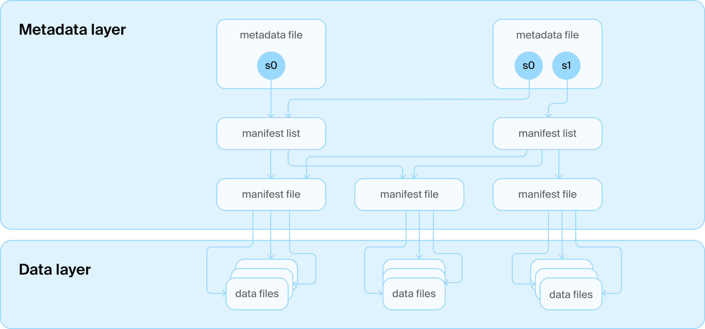
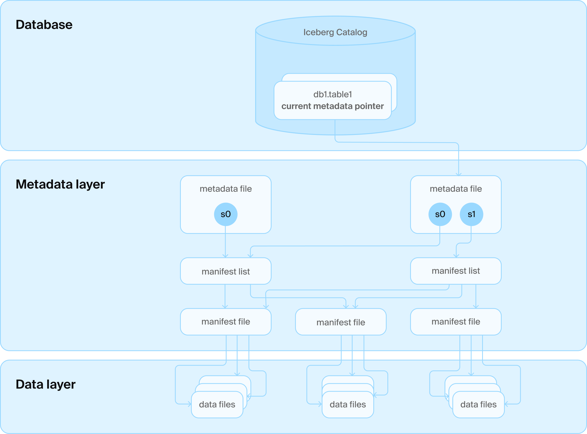
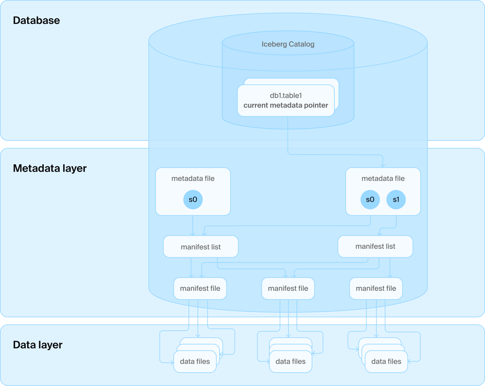
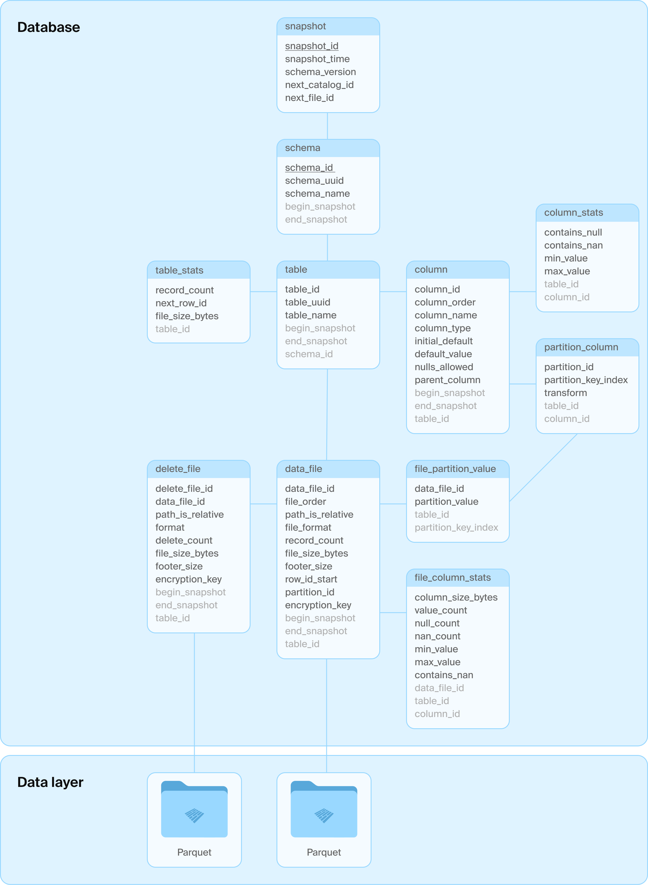

## 再见分布式湖仓一体, 你好DuckLake  
                  
### 作者                  
digoal                  
                  
### 日期                  
2025-05-28                
                  
### 标签                  
PostgreSQL , PolarDB , DuckDB , lakehouse , 湖仓一体 , 存算分离 , DuckLake , 时间旅行 , 对象存储 , 增删改查 , 元数据   
                  
----                  
                  
## 背景      
说到湖仓大家第一时间会想到什么? 存算分离? OLAP数据库(在线热存)+对象存储(离线冷存)架构? 湖仓一体架构? 曾经确实很棒很不错(有运算效率、也有大肚量).   
    
湖仓一体本质上解决的是大量数据存储、计算和用什么语言的问题.   
- 湖, 解决了大量文件存储. 但是没有计算能力、也没有语言能力(例如SQL接口)
- 仓, 解决了计算引擎和语言, 但是对于大量实时非结构化数据的写入抵挡不住、存储也不灵活.
- 湖仓一体, 其实是抛弃了仓. 在湖的基础上重新构建了一套schema管理、计算引擎、sql接口的能力.
- 更多详见该论文解读: [《Lakehouse: A New Generation of Open Platforms that Unify Data Warehousing and Advanced Analytics》](../202505/20250528_01.md)   
   
但是, 也许是时候对以上架构说再见了, 因为这些架构对于大多数企业来说太贵、太笨拙.   
   
DuckDB凭借优异的性能跻身数据计算能力第一梯队, DeepSeek都对之垂涎(在其基础之上发布smallpod用于模型训练), 关键是DuckDB这么牛也就算了, 它还小巧灵活, 2012年的mac book居然可以跑SF=1000的tpc-H [《DuckDB穿越到2012, 见证“大数据”失去的十年》](../202505/20250522_04.md)  , 还能全跑通, 打得大数据满地找牙.  
  
其实DuckDB一直以来就支持湖仓一体的用法, 只是之前需要自己维护metadata(文件放哪, 对应什么表等等.)  
- [《DuckDB Iceberg插件增强: 支持访问 Amazon S3 table & SageMaker Lakehouse》](../202503/20250319_09.md)    
- [《DuckDB DataLake 场景使用举例 - aliyun OSS对象存储parquet》](../202210/20221026_01.md)    
- [《DuckDB parquet 分区表 / Delta Lake(数据湖) 应用》](../202209/20220905_01.md)    
  
DuckDB发布DuckLake, 元数据管理正式纳入版图, 因为元数据管理其实也并不简单(只要你想修改湖里的数据), 使用体验将大幅度提升, DuckDB进军湖仓一体, 传统湖仓一体产品瑟瑟发抖吧!     

DuckDB一小步,单机数据库的一大步! 毕竟不管是PG还是MySQL都在死命蹭DuckDB的算力, 加上DuckDB的算力就是OLTP+OLAP兼具了, 在经济下行的时候谁不想降本增效.
- [《穷鬼玩PolarDB RAC一写多读集群系列 | 接入pg_duckdb & pgmooncake支持数据湖功能,且OLAP性能数量级提升》](../202412/20241231_02.md)
- [《PostgreSQL白嫖DuckDB实现湖仓一体功能》](../202407/20240715_01.md)
- [《MySQL救命稻草: DuckDB》](../202411/20241108_03.md)  
  
下面详细看看DuckDB推文：    
  
https://duckdb.org/2025/05/27/ducklake.html  
  
产品官网  
  
https://ducklake.select/  
  
开源项目(MIT开源协议)地址:  
  
https://github.com/duckdb/ducklake  
  
## DuckLake：SQL Lakehouse   
简而言之：DuckLake 简化了 Lakehouse，它使用标准 SQL 数据库存储所有元数据，而不是复杂的基于文件的系统，同时仍然以 Parquet 等开放格式存储数据。这使得它更可靠、更快速、更易于管理。  
  
### 背景  
像 BigQuery 和 Snowflake 这样的创新数据系统已经证明，在存储虚拟化的时代，断开存储和计算连接是一个好主意。这样，存储和计算都可以独立扩展，我们不必为了存储永远不会读取的表而购买昂贵的数据库服务器。  
  
与此同时，市场力量迫使人们坚持要求数据系统使用像 Parquet 这样的开放格式，以避免数据被单一供应商劫持的现象屡见不鲜。在这个新世界里，许多数据系统欣然地围绕着基于 Parquet 和 S3 构建的原始“数据湖”嬉戏，一切安好。毕竟，谁还需要那些老式数据库呢！  
  
但很快，令人震惊的是，人们竟然想修改他们的数据集。简单的追加操作效果还不错，只需将更多文件拖放到文件夹中即可，但除此之外，任何操作都需要复杂且容易出错的自定义脚本，而且没有任何正确性概念，或者 小心——事务。  
  
  
  
## Iceberg and Delta  
为了解决在湖中更改数据的基本任务，出现了各种新的开放标准，其中最突出的是 Apache Iceberg 和 Linux 基金会 Delta Lake。这两种格式的设计都旨在在不放弃基本前提的情况下，恢复对表进行更改的某些理性，即在 Blob 存储上使用开放格式。例如，Iceberg 使用大量的 JSON 和 Avro 文件来定义模式、快照以及在某个时间点哪些 Parquet 文件属于表的一部分。最终成果被命名为“Lakehouse”，实际上是为数据湖添加了数据库功能，从而为数据管理带来了许多激动人心的新用例，例如跨引擎数据共享。  
  
  
  
但这两种格式都遇到了一个问题：在 Blob 存储中，由于其一致性保证机制的反复无常，查找表的最新版本非常棘手。原子地（ACID 中的“A”）交换指针以确保每个人都能看到最新版本也很棘手。Iceberg 和 Delta Lake 实际上也只知道一张表，但人们——同样令人震惊的是 —— 想要管理多张表。  
  
## catalogs 目录服务(元数据)  
解决方案是另一层技术：我们在各种文件之上添加了一个目录服务。该目录服务反过来与管理所有表文件夹名称的数据库进行通信。它还管理着有史以来最令人沮丧的表，即每个表都只包含一行带有当前版本号的数据。现在我们可以借用数据库的事务保证来更新该版本号，这样每个人都会感到满意。  
  
  
  
## 目录服务是数据库吗？  
但问题是：Iceberg 和 Delta Lake 的设计初衷是不需要数据库。它们的设计者竭尽全力将高效读取和更新表所需的所有信息编码到 Blob 存储中的文件中。为了实现这一点，他们做出了许多妥协。例如，Iceberg 中的每个根文件都包含所有现有快照、完整的架构信息等。对于每个更改，都会写入一个包含完整历史记录的新文件。许多其他元数据必须批量处理，例如在两层清单文件中，以避免写入或读取过多的小文件，这在 Blob 存储上效率不高。对数据进行细微更改也是一个很大程度上尚未解决的问题，需要复杂的清理程序，而这些程序至今仍未被开源实现所充分理解和支持。许多公司已经存在并仍在努力解决管理快速变化数据的问题。这几乎就像一个专门的数据管理系统是一个好主意。  
  
但正如上文所指出的，Iceberg 和 Delta Lake 的设计已经不得不做出妥协，将数据库作为目录的一部分来保持一致性。然而，他们从未重新审视其余的设计约束和技术栈，以适应这一根本性的设计变更。  
  
## DuckLake 鸭湖  
在 DuckDB，我们真的热爱数据库。它们是安全高效地管理海量数据集的绝佳工具。一旦数据库进入 Lakehouse 技术栈，用它来管理其余的表元数据就显得意义非凡了！我们仍然可以利用 Blob 存储的“无限”容量和“无限”可扩展性，以 Parquet 等开放格式存储实际的表数据，但我们可以更高效、更有效地管理支持数据库更改所需的元数据！巧合的是，Google BigQuery（使用 Spanner）和 Snowflake（使用 FoundationDB）也选择了这种方式，只是底层不再使用开放格式。  
  
  
  
DuckLake 的架构 DuckLake 的架构：只有一个数据库和一些 Parquet 文件  
  
为了解决现有 Lakehouse 架构的根本问题，我们创建了一种名为 DuckLake 的全新开放表格式。DuckLake 通过理解两个简单的事实，重新构想了“Lakehouse”格式的形态：  
- 将数据文件以开放格式存储在 Blob 存储上对于可扩展性和防止锁定来说是一个很好的想法。  
- 管理元数据是一项复杂且相互关联的数据管理任务，最好交给数据库管理系统。  
  
DuckLake 的基本设计是将所有元数据结构（包括目录数据和表数据）迁移到 SQL 数据库中。该格式定义为一组关系表及其上的纯 SQL 事务，这些事务描述了诸如模式创建、修改以及数据的添加、删除和更新等数据操作。DuckLake 格式可以管理任意数量的表并支持跨表事务。它还支持“高级”数据库概念，例如视图、嵌套类型、事务模式更改等；请参阅下文了解列表。此设计的一大优势是通过利用引用一致性（ACID 中的“C”），该模式可以确保不存在重复的快照 ID。  
  
  
  
DuckLake 模式    
  
具体使用哪种 SQL 数据库取决于用户，唯一的要求是系统支持 ACID 操作和主键以及标准 SQL 支持。DuckLake 内部表模式刻意保持简单，以最大限度地兼容不同的 SQL 数据库。以下是通过示例展示的核心模式。  
  
让我们跟踪在新的空表上运行以下查询时 DuckLake 中发生的查询序列：  
```  
INSERT INTO demo VALUES (42), (43);  
  
BEGIN TRANSACTION;  
  -- some metadata reads skipped here  
  INSERT INTO ducklake_data_file VALUES (0, 1, 2, NULL, NULL, 'data_files/ducklake-8196...13a.parquet', 'parquet', 2, 279, 164, 0, NULL, NULL);  
  INSERT INTO ducklake_table_stats VALUES (1, 2, 2, 279);  
  INSERT INTO ducklake_table_column_stats VALUES (1, 1, false, NULL, '42', '43');  
  INSERT INTO ducklake_file_column_statistics VALUES (0, 1, 1, NULL, 2, 0, 56, '42', '43', NULL)  
  INSERT INTO ducklake_snapshot VALUES (2, now(), 1, 2, 1);  
  INSERT INTO ducklake_snapshot_changes VALUES (2, 'inserted_into_table:1');  
COMMIT;  
```  
  
我们看到一个连贯的 SQL 事务：  
- 插入新的 Parquet文件路径  
- 更新全局表统计信息（现在有更多行）  
- 更新全局列统计信息（现在具有不同的最小值和最大值）  
- 更新文件列统计信息（还记录最小值/最大值等）  
- 创建一个新的模式快照(`#2`)  
- 记录快照中发生的更改  
  
请注意，实际写入 Parquet 的操作不包含在该序列中，而是预先执行的。但无论添加多少值，该序列都具有相同的（低）成本。  
  
我们来讨论一下 DuckLake 的三个原则：简单性、可扩展性和速度。  
  
## 非常简单的设计原则  
DuckLake 遵循 DuckDB 的设计原则，即保持简单和增量。为了在笔记本电脑上运行 DuckLake，只需安装带有ducklake扩展名 ( https://duckdb.org/docs/stable/core_extensions/ducklake.html ) 的DuckDB 即可。这对于测试、开发和原型设计非常有用。在这种情况下，目录存储只是一个本地 DuckDB 文件。  
  
下一步是利用外部存储系统。DuckLake 数据文件是不可变的，它无需就地修改文件或重复使用文件名。这使得它几乎可以与任何存储系统兼容。DuckLake 支持与任何存储系统集成，例如本地磁盘、本地 NAS、S3、Azure Blob Store、GCS 等。数据文件的存储前缀（例如`s3://mybucket/mylake/`）在创建元数据表时指定。  
  
最后，托管目录服务器的 SQL 数据库可以是任何支持 ACID 和主键约束的半功能型 SQL 数据库。大多数组织已经拥有丰富的此类系统运维经验。这极大地简化了部署，因为除了 SQL 数据库之外，无需任何额外的软件堆栈。此外，近年来 SQL 数据库已经高度商品化，有无数托管的 PostgreSQL 服务，甚至托管的 DuckDB 都可以用作目录存储！同样，这里的锁定非常有限，因为转换不需要任何表数据移动，而且模式简单且标准化。  
  
无需 Avro 或 JSON 文件。无需额外的目录服务器或 API 集成。一切都只用 SQL。我们都熟悉 SQL。  
  
## 可扩展性  
DuckLake 实际上将数据架构中的关注点进一步分离为三个部分：存储、计算和元数据管理。存储仍然保留在专用文件存储（例如 Blob 存储）上，DuckLake 可以无限扩展存储。  
  
任意数量的计算节点可以查询和更新目录数据库，并独立地从存储中读取和写入数据。DuckLake 的计算能力可以无限扩展。  
  
最后，目录数据库需要能够仅运行计算节点请求的元数据事务。这些事务的规模比实际数据更改要小几个数量级。但 DuckLake 并不局限于单一的目录数据库，因此随着需求的增长，例如从 PostgreSQL 迁移到其他数据库，是可行的。最终，DuckLake 使用简单的表和基本的可移植 SQL。不过不用担心，基于 PostgreSQL 的 DuckLake 已经能够扩展到数百 TB 的数据和数千个计算节点(我个人猜测这里指的不是上千个计算节点的并行计算集群, 而是所有计算节点的数量, 因为duckdb开源版本是单机的. 数百TB指的也是这么多的数据对应的元数据实际上都在一个PG数据库里放着.)。  
  
再次强调，这正是 BigQuery 和 Snowflake 所采用的设计，它们已经成功管理了海量数据集。而且，如果需要，你也可以使用 Spanner 作为 DuckLake 目录数据库。  
  
## 速度惊人  
与 DuckDB 本身一样，DuckLake 也非常注重速度。Iceberg 和 Delta Lake 最大的痛点之一是运行最小查询所需的文件 IO 序列。跟踪目录和文件元数据路径需要许多单独的顺序 HTTP 请求。因此，读取或事务的运行速度存在下限。事务提交的关键路径上会花费大量时间，导致频繁发生冲突，并带来高昂的冲突解决成本。虽然可以使用缓存来缓解其中一些问题，但这会增加额外的复杂性，并且仅对“热”数据有效。  
  
SQL 数据库中统一的元数据还支持低延迟查询规划。为了从 DuckLake 表中读取数据，只需向目录数据库发送一个查询，该数据库会执行基于模式、分区和统计信息的修剪，本质上是从 Blob 存储中检索要读取的文件列表。无需多次往返存储来检索和重建元数据状态。出错的可能性也更小，没有 S3 限流、没有失败的请求、没有重试、没有导致文件不可见的存储视图不一致等等。  
  
DuckLake 还能够改善数据湖的两个最大性能问题：小更改和大量并发更改。  
  
对于细微的变更，DuckLake 将大幅减少写入存储的小文件数量。与上一个相比，无需生成包含细微变更的新快照文件，也无需生成新的清单文件或清单列表。DuckLake 甚至支持将表的细微变更直接透明地内联到元数据存储中的实际表中！事实证明，数据库系统也可以用来管理数据。这可以实现亚毫秒级的写入，并通过减少需要读取的文件数量来提升整体查询性能。通过写入更少的文件，DuckLake 还大大简化了清理和压缩操作。  
  
在 DuckLake 中，表更改包括两个步骤：将数据文件（如果有）暂存到存储，然后在目录数据库中运行单个 SQL 事务。这大大减少了在事务提交的关键路径上花费的时间，因为只需运行一个事务。SQL 数据库非常擅长消除事务冲突。这意味着计算节点在可能发生冲突的关键路径上花费的时间要少得多。这允许更快地解决冲突并允许更多的并发事务。本质上，DuckLake 支持目录数据库可以提交的尽可能多的表更改。即使是古老的 Postgres每秒也可以运行数千个事务。可以运行一千个计算节点，以一秒的间隔运行向表的追加操作，它也可以正常工作。  
  
此外，DuckLake 快照只需在元数据存储中添加几行数据，即可同时存储多个快照。无需主动修剪快照。快照还可以引用Parquet 文件的部分内容，从而允许存储比磁盘上文件数量更多的快照。综合起来，DuckLake 可以管理数百万个快照！  
  
## DuckLake(鸭湖) 特性一览  
DuckLake 拥有您喜爱的所有 Lakehouse 功能：  
- 任意 SQL： DuckLake 支持与 DuckDB 相同的所有 SQL 功能。  
- 数据变更： DuckLake 支持高效的数据追加、更新和删除。  
- 多模式、多表： DuckLake 可以管理任意数量的模式，每个模式在相同的元数据表结构中包含任意数量的表。  
- 多表事务： DuckLake 支持所有托管模式、表及其内容的完全符合 ACID 的事务。  
- 复杂类型： DuckLake 支持所有您喜欢的复杂类型，如列表、任意嵌套。  
- 完整的模式演变：可以任意更改表模式，例如，可以添加、删除列或更改其数据类型。  
- 模式级时间旅行和回滚： DuckLake 支持完整的快照隔离和时间旅行，允许查询特定时间点的表。  
- 增量扫描： DuckLake 支持仅检索指定快照之间发生的更改。  
- SQL 视图： DuckLake 支持延迟评估的 SQL 级视图的定义。  
- 隐藏分区和修剪： DuckLake 了解数据分区和表和文件级统计数据，允许提前修剪扫描以实现最高效率。  
- 事务性 DDL：模式、表和视图的创建、演变和删除完全是事务性的。  
- 避免数据压缩： DuckLake 所需的压缩操作远少于同类格式。DuckLake 支持高效的快照压缩。  
- 内联：当对数据进行小的更改时，DuckLake 可以选择使用目录数据库直接存储这些小的更改，以避免写入许多小文件。  
- 加密： DuckLake 可以选择加密写入数据存储的所有数据文件，从而实现零信任数据托管。密钥由目录数据库管理。  
- 兼容性： DuckLake 写入存储的数据和（位置）删除文件与 Apache Iceberg 完全兼容，允许仅元数据迁移。  
  
## DuckDB ducklake 扩展  
凭空指定数据格式很容易，但真正实现起来却很难。正因如此，我们今天还发布了 DuckLake 的计算节点实现，即ducklake DuckDB 扩展。该扩展实现了上述 DuckLake 格式，并支持所有描述的功能。该扩展是遵循 MIT 许可证的免费开源软件，所有知识产权均归非营利性 DuckDB 基金会所有。  
  
从概念上讲，该ducklake扩展极大地提升了 DuckDB 的性能，使其从最初的单节点架构提升到无需额外支持基础设施即可支持集中式客户端-服务器数据仓库用例的水平。借助 DuckLake，组织可以设置集中式目录数据库和文件存储（例如 AWS RDS 和 S3 或自托管），然后ducklake在大量参与设备（例如员工工作站、手机、应用服务器或无服务器计算代码）上运行带有该扩展的 DuckDB 实例。  
  
<b> 由于元数据管理相对大数据来说更小更简单, 所以管理元数据即可以使用DuckDB自身的数据文件, 也可以使用第三方数据库例如PostgreSQL. </b>    
  
该扩展程序能够使用本地 DuckDB 文件作为其目录数据库，独立运行 DuckLake。它还可以使用 DuckDB 可以通信的任何第三方数据库。目前，这包括 PostgreSQL、SQLite、MySQL 和 MotherDuck 作为外部集中式目录数据库。该扩展程序可以使用 DuckDB 支持的任何文件系统，例如本地文件、S3、Azure Blob Store、GCS 等。  
  
当然，DuckLake 扩展的推出只是增强了 DuckDB 对Iceberg、Delta及其相关目录的现有和持续支持，而非取代。DuckLake 也非常适合用作这些格式的本地缓存或加速功能。  
  
DuckLake 从DuckDB 版本 v1.3.0（代号“Ossivalis”）开始可用。  
  
## 安装 DuckLake  
- 步骤1：安装 DuckDB ( `curl https://install.duckdb.org | sh` )   
- 步骤2：启动 DuckDB  
- 步骤3：输入 `INSTALL ducklake;`  
  
  
## 用法  
可以通过DuckDB 中的`ATTACH`命令来初始化一个 DuckLake。例如：  
```  
ATTACH 'ducklake:metadata.ducklake' AS my_ducklake;

-- 注意这里也可以加参数指定本地目录或S3路径: (DATA_PATH 'file_path/')  (DATA_PATH 's3://demo-ducklake-minio-bucket')
```  
  
这将在 DuckDB 中创建一个名为 `my_ducklake` 的新附加数据库。在完全本地的情况下，元数据表存储在`metadata.ducklake`文件中，包含数据的 Parquet 文件存储在当前工作目录下的 `data_files`文件夹中。当然，绝对路径也可以。  
  
接下来我们创建一个表并插入一些数据：  
```  
CREATE TABLE my_ducklake.demo (i INTEGER);  
INSERT INTO my_ducklake.demo VALUES (42), (43);  
```  
  
您可以使用`USE`命令切换默认数据库，例如`USE my_ducklake`。  
  
我们再次查询该表：  
```  
FROM my_ducklake.demo;  
  
┌───────┐  
│   i   │  
│ int32 │  
├───────┤  
│    42 │  
│    43 │  
└───────┘  
```  
  
到目前为止，一切都很好。  
```  
FROM glob('metadata.ducklake.files/*');  
  
┌───────────────────────────────────────────────────────────────────────────────┐  
│                                     file                                      │  
│                                    varchar                                    │  
├───────────────────────────────────────────────────────────────────────────────┤  
│ metadata.ducklake.files/ducklake-019711dd-6f55-7f41-ab99-6ac7d9de6ef3.parquet │  
└───────────────────────────────────────────────────────────────────────────────┘  
```  
  
我们可以看到，一个包含两行数据的 Parquet 文件已经创建完毕。现在，我们再次删除一行数据：  
```  
DELETE FROM my_ducklake.demo WHERE i = 43;  
FROM my_ducklake.demo;  
  
┌───────┐  
│   i   │  
│ int32 │  
├───────┤  
│  42   │  
└───────┘  
```  
  
我们可以看到该行消失了。如果我们再次检查该文件夹，我们会看到一个新文件出现  
```  
FROM glob('metadata.ducklake.files/*');  
  
┌──────────────────────────────────────────────────────────────────────────────────────┐  
│                                         file                                         │  
│                                       varchar                                        │  
├──────────────────────────────────────────────────────────────────────────────────────┤  
│ metadata.ducklake.files/ducklake-019711dd-6f55-7f41-ab99-6ac7d9de6ef3.parquet        │  
│ metadata.ducklake.files/ducklake-019711e0-16f7-7261-9d08-563a48529955-delete.parquet │  
└──────────────────────────────────────────────────────────────────────────────────────┘  
```  
  
出现了名称中带有的`-delete`第二个文件，这也是一个包含已删除行的标识符的 Parquet 文件。  
  
当然，DuckLake支持时间旅行(牛逼, 还想删库跑路?)，我们可以使用`ducklake_snapshots()`查询可用的快照。  
```  
FROM ducklake_snapshots('my_ducklake');  
  
┌─────────────┬────────────────────────────┬────────────────┬──────────────────────────────┐  
│ snapshot_id │       snapshot_time        │ schema_version │           changes            │  
│    int64    │  timestamp with time zone  │     int64      │   map(varchar, varchar[])    │  
├─────────────┼────────────────────────────┼────────────────┼──────────────────────────────┤  
│           0 │ 2025-05-27 15:10:04.953+02 │              0 │ {schemas_created=[main]}     │  
│           1 │ 2025-05-27 15:10:14.079+02 │              1 │ {tables_created=[main.demo]} │  
│           2 │ 2025-05-27 15:10:14.092+02 │              1 │ {tables_inserted_into=[1]}   │  
│           3 │ 2025-05-27 15:13:08.08+02  │              1 │ {tables_deleted_from=[1]}    │  
└─────────────┴────────────────────────────┴────────────────┴──────────────────────────────┘  
```  
  
假设我们想要读取第 43 行被删除之前的表，我们可以使用DuckDB 中的新AT语法：  
```  
FROM my_ducklake.demo AT (VERSION => 2);  
  
┌───────┐  
│   i   │  
│ int32 │  
├───────┤  
│    42 │  
│    43 │  
└───────┘  
```  
  
版本 2 仍然有此行，所以就是这样。这也适用于快照时间戳而不是版本号：只需使用`TIMESTAMP`而不是`VERSION`。  
  
我们还可以使用`ducklake_table_changes()`函数查看版本之间发生了什么变化，例如  
```  
FROM ducklake_table_changes('my_ducklake', 'main', 'demo', 2, 3);  
  
┌─────────────┬───────┬─────────────┬───────┐  
│ snapshot_id │ rowid │ change_type │   i   │  
│    int64    │ int64 │   varchar   │ int32 │  
├─────────────┼───────┼─────────────┼───────┤  
│           2 │     0 │ insert      │    42 │  
│           2 │     1 │ insert      │    43 │  
│           3 │     1 │ delete      │    43 │  
└─────────────┴───────┴─────────────┴───────┘  
```  
  
我们可以看到，在第二个版本中，我们在快照 2 中添加了两个值 42 和 43，然后在快照 3 中再次删除了 43。  
  
DuckLake 中的更改当然是事务性的，之前我们运行在“自动提交”模式下，每个命令都是一个独立的事务。但我们可以使用`BEGIN TRANSACTION` and `COMMIT` 或 `ROLLBACK` 来更改这一点。  
```  
BEGIN TRANSACTION;  
DELETE FROM my_ducklake.demo;  
FROM my_ducklake.demo;  
  
┌────────┐  
│   i    │  
│ int32  │  
├────────┤  
│ 0 rows │  
└────────┘  
  
ROLLBACK;  
FROM my_ducklake.demo;  
  
┌───────┐  
│   i   │  
│ int32 │  
├───────┤  
│  42   │  
└───────┘  
```  
  
这里，我们启动一个事务，然后从my_table中删除所有行，结果确实显示为空。但是，由于我们随后执行了`ROLLBACK`，未提交的删除操作被还原了。  
  
总结：本文介绍了基于纯 SQL 构建的全新 Lakehouse 格式的原理和设计。如果您想以简单、可扩展且快速的 Lakehouse 格式使用数据，不妨一试！我们期待看到您的使用案例！  
  
该ducklake扩展目前处于实验阶段。如果您遇到任何错误，请在扩展代码库ducklake中提交问题。  
   
## 扩展思考
有些问题, ducklake未来可能要考虑优化:  
- 大量小事务写入 或 大量修改操作后, 应该会产生大量的小文件, 影响压缩率和查询性能. 会不会有自动合并的能力, 不过没那么简单这又与时间旅行功能冲突.
- 对于大量时间追加的场景, 是不是会在本地DuckDB内使用本地缓冲, 延迟写入到远程对象存储BLOB中?  
   
## 参考  
[《DuckDB Iceberg插件增强: 支持访问 Amazon S3 table & SageMaker Lakehouse》](../202503/20250319_09.md)    
  
[《DuckDB DataLake 场景使用举例 - aliyun OSS对象存储parquet》](../202210/20221026_01.md)    
  
[《DuckDB parquet 分区表 / Delta Lake(数据湖) 应用》](../202209/20220905_01.md)    
  
https://ducklake.select/manifesto/    
    
https://duckdb.org/2025/05/27/ducklake.html    
   
https://github.com/duckdb/ducklake   
    
更多用法例子: https://github.com/duckdb/ducklake/tree/main/examples/minio-demo-server   
```
--- Setup relevant DuckDB temporary secret to gain access to the local MinIO S3 bucket
create secret (type s3, key_id 'minioadmin', secret 'minioadmin', endpoint '10.1.0.202:9000', use_ssl false, url_style 'path');

--- Attach a local DuckDB file (minio-ducklake-demo.ducklake) and a local (but using S3 protocol) bucket
ATTACH 'ducklake:minio-ducklake-demo.ducklake' as db (DATA_PATH 's3://demo-ducklake-minio-bucket');

--- Use the just attached DuckLake as default Database
USE db;

--- Create a table with some data (in the ducklake)
CREATE TABLE numbers AS (SELECT random() FROM range(100000));

--- Check which files are in the bucket
FROM glob('s3://demo-ducklake-minio-bucket/**');

--- This will show both minio-ducklake-demo.ducklake (and it's WAL file) and the minio relevant files, just to check it's actually local data
FROM glob('**');

--- Remove some data
DELETE FROM numbers WHERE #1 < 0.1;

--- Check which files are in the bucket, now there should also be a delete file
FROM glob('s3://demo-ducklake-minio-bucket/**');


--- Now you have a fully local DuckLake, backed by a local DuckDB Database and a local S3-bucket (via Minio)
```
  
```
ATTACH 'ducklake:metadata.ducklake' AS my_ducklake (DATA_PATH 'file_path/');
USE my_ducklake;
CREATE TABLE my_ducklake.my_table(id INTEGER, val VARCHAR);
INSERT INTO my_ducklake.my_table VALUES (1, 'Hello'), (2, 'World');
FROM my_ducklake.my_table;
┌───────┬─────────┐
│  id   │   val   │
│ int32 │ varchar │
├───────┼─────────┤
│     1 │ Hello   │
│     2 │ World   │
└───────┴─────────┘
``` 
   
配置catalog存储数据库参考文档:   
- https://ducklake.select/docs/stable/duckdb/usage/choosing_a_catalog_database  
  
更多时间旅行查询用法参考:
- https://docs.snowflake.com/en/user-guide/data-time-travel  
- https://duckdb.org/docs/stable/sql/query_syntax/from#time-travel-using-at  

     
  
#### [期望 PostgreSQL|开源PolarDB 增加什么功能?](https://github.com/digoal/blog/issues/76 "269ac3d1c492e938c0191101c7238216")
  
  
#### [PolarDB 开源数据库](https://openpolardb.com/home "57258f76c37864c6e6d23383d05714ea")
  
  
#### [PolarDB 学习图谱](https://www.aliyun.com/database/openpolardb/activity "8642f60e04ed0c814bf9cb9677976bd4")
  
  
#### [PostgreSQL 解决方案集合](../201706/20170601_02.md "40cff096e9ed7122c512b35d8561d9c8")
  
  
#### [德哥 / digoal's Github - 公益是一辈子的事.](https://github.com/digoal/blog/blob/master/README.md "22709685feb7cab07d30f30387f0a9ae")
  
  
#### [About 德哥](https://github.com/digoal/blog/blob/master/me/readme.md "a37735981e7704886ffd590565582dd0")
  
  

  
