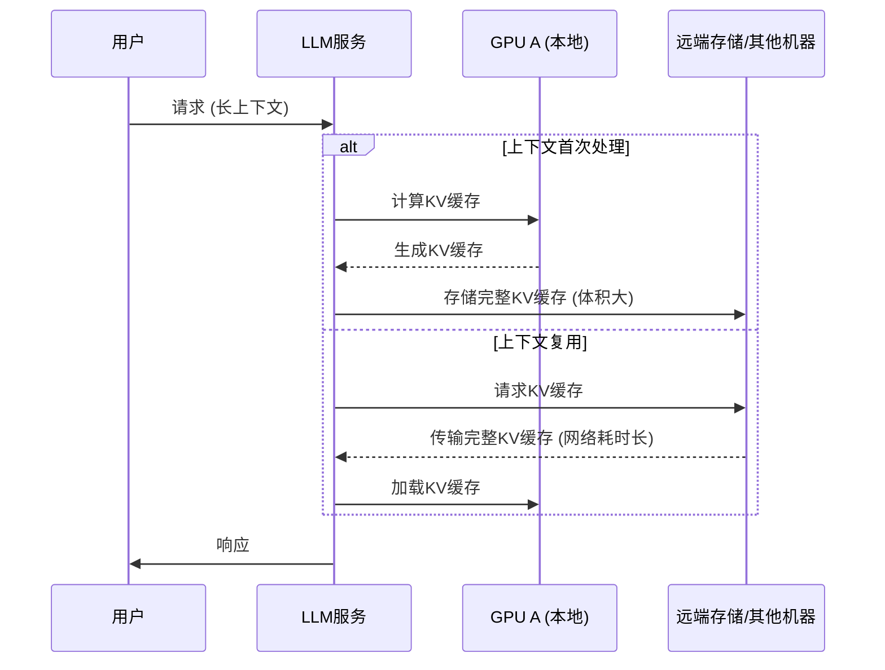
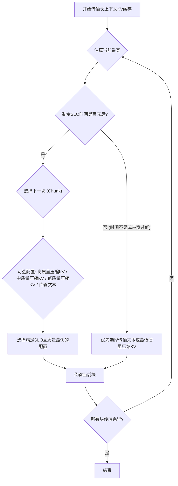

## AI论文解读 | CacheGen: KV Cache Compression and Streaming for Fast Large Language Model Serving 
    
### 作者    
digoal    
    
### 日期    
2025-05-30    
    
### 标签    
PostgreSQL , PolarDB , DuckDB , AI , 论文解读    
    
----    
    
## 背景   
  
https://arxiv.org/abs/2310.07240   
    
提示:    
```    
读懂《CacheGen: KV Cache Compression and Streaming for Fast Large Language Model Serving》这篇论文需要提前掌握哪些基础知识, 请使用中文给我讲一下这些基础知识, 尽量通熟易懂, 可以使用markdown支持的图形增加解释性.    
    
使用中文通熟易懂的解读《CacheGen: KV Cache Compression and Streaming for Fast Large Language Model Serving》这篇论文, 关键内容请深入讲解, 可以使用markdown支持的图形增加解释性.    
    
使用中文提取《CacheGen: KV Cache Compression and Streaming for Fast Large Language Model Serving》论文中一些重要的术语并详细解释, 可以使用markdown支持的图形示增加解释性.    
```    
    
## 1 前置知识   

好的，要理解《CacheGen》这篇论文，你需要一些关于大语言模型（LLM）、计算机网络和数据压缩的基础知识。下面我用通俗易懂的方式为你解释：

---

### 理解《CacheGen》论文所需的基础知识 🧠

想象一下，你要和一位超级聪明的AI助手（比如ChatGPT）进行一次非常复杂的对话，或者让它帮你阅读并总结一篇超长的文档。这篇论文研究的就是如何让这个过程更快、更高效。

为了理解这篇论文，你需要了解以下几个核心概念：

#### 1. 大语言模型 (Large Language Models, LLMs)

* **是什么？** LLMs就像是经过海量文本数据训练过的“超级大脑”，能够理解和生成人类语言。例如GPT系列、Llama等。
* **如何工作（简化版）？**
    * **Token（词元）**: LLM不是直接处理文字，而是先把文本切分成一个个小单元，称为Token。一个Token可以是一个词、一个字，甚至是一个标点符号。
    * **输入 (Input/Prompt)**: 你给LLM的指令或问题，比如“帮我写一首关于春天的诗”。
    * **上下文 (Context)**: 为了让LLM更好地完成任务，我们有时会给它很多背景信息，比如一篇长长的文章、之前的对话记录等。这个背景信息就是“上下文”。论文中特别关注“长上下文”带来的挑战。
    * **生成 (Generation)**: LLM根据你的输入和上下文，一个Token一个Token地生成回复。

#### 2. Transformer架构与自注意力机制 (Self-Attention)

这是当前LLMs（如GPT、Llama）主流的底层模型架构。你不需要了解所有数学细节，但要明白几个关键点：

* **并行处理**: Transformer不像早期模型那样需要逐字处理，它可以同时关注输入序列中的所有Token。
* **自注意力机制 (Self-Attention)**: 这是Transformer的核心。简单说，模型在处理每个Token时，会计算这个Token与输入序列中其他所有Token的“相关性”或“重要性”。这样，它就能理解句子中不同部分之间的依赖关系。
* **K, V, Q (Key, Value, Query)**: 在自注意力机制中，每个Token会派生出三个向量：Query（查询）、Key（键）、Value（值）。
    * 你可以把Query想象成“我要找什么信息”。
    * Key想象成“我这里有什么信息可以被查”。
    * Value想象成“如果Key匹配上了，我具体能提供什么内容”。
    * 通过Query和所有Key的匹配计算（比如点积），得到注意力权重，然后用这些权重去加权平均所有的Value，得到当前Token的输出表示。

    ```mermaid
    graph TD
        Input["输入序列 (Tokens)"] --> Layer["Transformer层"]
        Layer -- 对每个Token --> Q["生成Query (Q)"]
        Layer -- 对每个Token --> K["生成Key (K)"]
        Layer -- 对每个Token --> V["生成Value (V)"]
        Q -- 与所有K计算相关性 --> AttentionScores["注意力分数"]
        AttentionScores -- 加权所有V --> OutputToken["Token的输出表示"]
        K --> KVCache["KV Cache (存储K, V)"]
        V --> KVCache
    ```

#### 3. KV Cache (键值缓存) 💡💾

* **是什么？** 在LLM处理输入（尤其是长上下文）并生成回复的过程中，Transformer的每一层都会为已经处理过的Token计算出Key和Value张量（高维数组）。这些计算好的Key和Value会被存储起来，形成KV Cache。
* **为什么重要？** 当LLM生成下一个Token时，它需要回顾之前所有Token的信息。如果有了KV Cache，之前Token的Key和Value就**不需要重新计算了**，可以直接从Cache中读取使用。这大大加快了后续Token的生成速度。
* **论文中的痛点**:
    * **体积大**: 对于长上下文，KV Cache会非常非常大（论文中提到可能达到几十GB）。
    * **传输慢**: 如果这个KV Cache不在当前的GPU显存里（比如需要从其他机器的内存、硬盘甚至网络存储中加载），把这么大的数据传输过来会非常耗时。这就是论文要解决的“网络瓶颈”。

#### 4. 上下文处理 (Context Processing / Prefill Phase)

* **是什么？** 在LLM开始生成第一个回复Token之前，它必须完整地处理（“阅读并理解”）你提供的所有上下文信息。这个过程叫做Prefill（预填充）阶段。
* **耗时**: 处理长上下文的Prefill阶段非常耗时，因为它涉及到大量的计算（为上下文中的每个Token计算K和V并构建KV Cache）。
* **TTFT (Time-To-First-Token)**: 指从用户发送请求到LLM生成出第一个Token所需的时间。Prefill阶段的耗时是TTFT的主要组成部分。论文的目标之一就是通过快速加载（压缩后的）KV Cache来减少TTFT。

#### 5. 张量 (Tensor) 与数据压缩 (Data Compression) 📦

* **张量 (Tensor)**: 在机器学习中，数据通常以张量的形式存在。你可以把它理解为一个多维数组。比如，一个标量是0维张量，一个向量是1维张量，一个矩阵是2维张量。KV Cache就是由很多张量组成的。这些张量通常是浮点数（比如32位浮点数）。
* **数据压缩**:
    * **为什么需要？** 因为KV Cache太大了，传输慢。如果能把它变小，就能传得更快。
    * **CacheGen用的方法（概念）**:
        * **量化 (Quantization)**: 降低数据的精度。比如，把32位浮点数变成8位整数。这会损失一些信息，但能大大减小体积。论文中提到会根据KV Cache不同层对量化损失的敏感度不同，采用不同的量化级别。
        * **编码 (Encoding)**: 比如算术编码 (Arithmetic Coding)。这是一种无损压缩技术，它会给出现频率高的数据用更短的编码，频率低的数据用稍长的编码，从而达到压缩效果。
        * **增量编码/差分编码 (Delta Encoding)**: 论文中提到“token-wise locality”，即相邻Token的K/V值可能很相似。这时，不直接存每个值，而是存第一个值，然后存后续值与前一个值（或锚点值）的差异（delta）。因为差异通常比原始值小，更容易压缩。

#### 6. 网络传输与流式处理 (Network & Streaming) 🌐

* **带宽 (Bandwidth)**: 指网络连接在单位时间内可以传输的数据量，通常用Gbps（千兆比特每秒）表示。带宽低，传大文件就慢。
* **延迟 (Latency)**: 数据从一端传到另一端所需的时间。
* **SLO (Service-Level Objective)**: 服务水平目标。比如，系统承诺TTFT必须在X秒以内。
* **流式处理 (Streaming)**: 类似在线看视频。数据不是一次性全部下载完再播放，而是一边下载一边播放（解码）。CacheGen也用了类似的思想：
    * **分块 (Chunking)**: 把大的KV Cache切分成小块。
    * **自适应压缩 (Adaptive Compression)**: 根据当前的网络状况（比如带宽）动态调整每一块KV Cache的压缩级别。网络好就用压缩率低但质量高的，网络差就用压缩率高但质量稍差的，甚至退回到传输文本让LLM重新计算KV。

#### 7. 评估指标 (Evaluation Metrics) 📊

* **LLM质量指标**:
    * **Accuracy (准确率)**: 对于特定任务（如问答），回答正确的比例。
    * **F1 Score**: 综合了精确率(Precision)和召回率(Recall)的指标，常用于评估信息检索和分类任务。
    * **Perplexity (困惑度)**:衡量语言模型好坏的指标。困惑度越低，模型对样本的概率分布估计越好，也就是说模型预测下一个词的能力越强。
* **系统性能指标**:
    * **KV Cache Size**: 压缩后KV Cache的大小。
    * **TTFT**: 前面解释过了，首个Token生成时间。

---

如果你对这些基础概念有了一定的了解，再去看《CacheGen》的摘要、引言和方法部分，就会清晰很多。论文的核心思想就是：**既然原始KV Cache太大导致网络传输慢，那我们就用针对KV Cache特性的方法高效压缩它，并通过智能的流式传输策略来进一步优化加载速度，从而在保证LLM生成质量的前提下，显著降低TTFT。**

## 2 解读论文    

这篇论文《CacheGen: KV Cache Compression and Streaming for Fast Large Language Model Serving》主要解决的是大型语言模型（LLM）在处理长上下文时，因 **KV缓存** 过大导致加载缓慢，进而影响响应速度（特别是首个词元生成时间TTFT）的问题  。CacheGen提出了一套包含**定制化张量编码器**和**自适应流式传输**的方案，旨在显著减小KV缓存的体积并加速其网络传输，同时尽量不影响模型生成质量  。

---
### 核心问题：长上下文与KV缓存的网络瓶颈

LLM在处理输入时，会将先前计算的键（Key）和值（Value）张量存储在所谓的 **KV缓存** 中，以避免重复计算，加速后续词元的生成  。然而，当输入上下文非常长时，这个KV缓存会变得异常庞大，甚至达到数十GB  。

很多情况下，这个巨大的KV缓存并不在当前GPU的显存中，可能需要从其他机器或存储服务中通过网络获取  。这就带来了新的问题：**网络传输延迟**。传输如此大的数据会非常耗时，严重拖慢LLM的响应速度，尤其是交互式应用的体验  。

如下图所示，传统的KV缓存共享方式在网络传输上存在瓶颈：


CacheGen的目标就是优化上图中“传输完整KV缓存”这一步。

---
### CacheGen的两大核心技术

为了解决上述问题，CacheGen引入了两个关键技术：

#### 1. KV缓存编码与解码 (KV Cache Encoding and Decoding)

CacheGen没有保留KV缓存原始的张量形态，而是将其编码成更紧凑的**比特流 (bitstream)** 表示，从而大幅减少传输所需带宽  。其编码器主要利用了KV缓存的以下几个分布特性：

* **词元间局部性 (Token-wise locality)**: 研究发现，在同一层和通道内，相邻词元的K/V张量值比相距较远的词元更相似  。因此，CacheGen编码的是**差值张量 (delta tensors)**，即当前词元与某个“锚点词元” (anchor token) 的K/V值之差，而不是原始值  。这些差值通常更小，更集中于零附近，因此更容易压缩  。
    * 具体做法是将上下文分成多个词元组 (groups of tokens)，每组的第一个词元作为锚点，组内其他词元都计算与该锚点的差值  。

* **层级损失敏感性 (Layer-wise sensitivity to loss)**: 论文观察到，LLM的输出质量对KV缓存**浅层**的数值损失比对**深层**的数值损失更敏感  。也就是说，浅层信息如果被破坏，对最终结果影响更大  。基于此，CacheGen对不同层的差值张量应用不同程度的**量化 (quantization)**  。浅层采用更保守的量化（用更多比特，损失小），深层则采用更激进的量化（用更少比特，损失大） 。锚点词元的KV缓存则采用相对高精度的8位量化，因为它们影响整个词元组的差值计算  。

* **沿层、通道、词元的分布特性**: 研究表明，按**通道 (channel)** 和 **层 (layer)** 对KV值进行分组，其信息增益远高于按词元位置分组  。这意味着同一通道或同一层内的KV值相似性更高。因此，CacheGen的**算术编码器 (arithmetic coder)** 会为每个通道-层组合离线分析并维护一个独立的概率分布，用于将量化后的差值张量和锚点张量无损压缩成比特流  。

解码（解压缩）过程则在GPU上加速执行，并且与网络传输流水线化，以最小化其对整体延迟的影响  。

#### 2. KV缓存流式传输与自适应调整 (KV Cache Streaming Adaptation)

网络带宽在KV缓存传输过程中可能会波动  。为了应对这种情况并满足服务等级目标（SLO），CacheGen采用了自适应流式传输策略  。

* **分块与多版本编码**: 在用户请求到达前，CacheGen会将长上下文分割成多个**上下文块 (context chunks)**，并对每个块的KV缓存以多种不同的编码（量化）级别进行离线编码，生成多个独立的比特流版本  。每个块的编码是独立的，只要块长度大于一个词元组，就不会影响压缩效率  。

* **动态配置选择**: 当实际传输KV缓存时，CacheGen会逐块发送  。对于每个块，系统会根据先前块的传输吞吐量估算当前可用带宽，并结合剩余的SLO时间，来动态选择该块的传输配置  。配置选项包括：
    * 使用某个预编码的比特流版本（不同压缩级别对应不同大小和质量损失）。
    * 如果带宽极低，甚至可以选择传输该块的**文本原文 (text format)**，让接收端的LLM重新计算这部分的KV缓存  。
    * 目标是在满足SLO的前提下，最大化生成质量（即选择压缩损失最小的配置） 。

* **并发请求处理**: 当有多个并发请求时，CacheGen会将它们分批处理，并根据包含特定块的请求数量来调整该块的预期传输延迟计算  。

下图展示了CacheGen自适应流式传输的逻辑：



---
### 实验结果与贡献

CacheGen在多个流行的LLM（如Mistral-7B, Llama-34B, Llama-70B）和长上下文数据集上进行了测试  。

* **显著降低TTFT和带宽占用**: 与基线方法（如仅进行8位量化或直接传输文本）相比，CacheGen能将KV缓存大小减少**3.5-4.3倍**，并将获取和处理上下文的总延迟（TTFT）降低**3.2-3.7倍**，而对LLM响应质量的影响微乎其微  。
* **兼容性**: CacheGen的技术可以与其他上下文压缩方法（如H2O, LLMLingua，这些方法主要通过丢弃Token来减少上下文）结合使用，在其基础上进一步压缩KV缓存，再减少**3.3-4.2倍**的带宽占用  。这表明CacheGen的压缩机制利用了与Token丢弃方法不同的统计特性  。
* **自适应性有效**: 其流式自适应调整逻辑能够有效应对带宽变化，显著降低SLO违规率  。例如，在1秒的SLO下，SLO违规率从81%降至8%  。
* **开销可控**: 解码开销由于GPU加速和流水线化而变得很小  。离线编码多个版本的存储开销也与基线量化方法相当  。

总而言之，CacheGen通过新颖的KV缓存压缩编码和智能的流式传输机制，有效地解决了LLM服务中长上下文带来的网络传输瓶颈，为实现快速、高质量的LLM响应提供了有力的技术支持。

## 3 术语   

好的，这篇论文《CacheGen: KV Cache Compression and Streaming for Fast Large Language Model Serving》中包含了一些重要的专业术语。我会提取其中一些关键术语并用中文进行详细解释，并适时使用Markdown图形辅助说明。

---

### 核心术语详解

1.  **KV Cache (键值缓存)**
    * **解释**: 在Transformer架构（大型语言模型的基础）中，当模型处理输入序列（比如一段文本）时，每一层的自注意力机制会为每个词元（token）计算出“键（Key）”和“值（Value）”张量  。这些K和V张量包含了该词元传递给后续计算的重要信息  。为了避免在生成每个新词元时重复计算前面所有词元的K和V值，系统会将这些已经计算好的K和V张量存储起来，形成KV Cache  。在生成（或解码）阶段，模型可以直接从这个缓存中读取并使用这些值  。
    * **重要性**: KV Cache显著提高了LLM生成文本的效率，尤其是在处理长序列时  。但它也带来了问题：对于长上下文，KV Cache会非常大，占用大量GPU内存  ，并且在需要跨设备或跨网络传输时（例如从CPU内存或远端存储加载到GPU），会产生显著的延迟  。
    * **图示理解**:
        ```mermaid
        graph LR
            A[输入词元序列] --> B(Transformer模型);
            B -- 为每个词元计算 --> K[Key张量];
            B -- 为每个词元计算 --> V[Value张量];
            K --> C((KV Cache));
            V --> C;
            C -- 用于后续词元生成 --> D[输出词元序列];
        ```

2.  **Long Context (长上下文)**
    * **解释**: 指LLM处理的输入文本非常长，可能包含数千甚至数万个词元  。例如，在进行文档问答、长篇对话、或利用大量背景知识进行推理时，就需要提供长上下文  。
    * **挑战**: 虽然长上下文能提供更丰富的信息，有助于提高LLM的响应质量和连贯性  ，但它也使得KV Cache变得非常庞大  ，处理时间（预填充阶段）显著增长  ，从而导致TTFT（Time-to-First-Token）过长。

3.  **TTFT (Time-to-First-Token，首词元生成时间)**
    * **解释**: 指从用户提交请求到LLM生成并返回第一个词元所花费的时间  。这是衡量LLM服务响应速度的一个关键指标，尤其对交互式应用非常重要  。
    * **影响因素**: TTFT主要受两部分影响：
        1.  **预填充阶段 (Prefill Phase)**: LLM处理整个输入上下文并计算其KV Cache的时间  。上下文越长，这部分时间越长  。
        2.  **KV Cache加载时间**: 如果KV Cache需要从外部存储（如CPU内存、另一台机器或网络存储）加载到GPU，这个加载时间也会计入TTFT  。CacheGen主要关注减少这部分时间。

4.  **Tensor Encoding (张量编码)**
    * **解释**: CacheGen的核心技术之一，指将KV Cache中的浮点数张量通过特定的压缩算法转换成更紧凑的比特流表示形式，目的是减小其体积，从而减少网络传输带宽和时间  。这与传统的量化（如8位量化）不同，编码可以不保留张量的原始形状，而是专注于极致的压缩  。
    * **CacheGen的编码策略**:
        * **利用KV缓存的分布特性 (Distributional Properties)**  。
        * **差值编码 (Delta Encoding)**: 基于“词元间局部性”（相邻词元的KV值相似），编码当前词元与某个“锚点词元”的KV值之差  。
        * **分层量化 (Layer-wise Quantization)**: 基于“层级损失敏感性”（浅层对损失更敏感），对不同Transformer层的KV Cache应用不同的量化精度  。
        * **算术编码 (Arithmetic Coding)**: 一种无损熵编码方法，用于进一步压缩量化后的符号  。CacheGen会为每个通道-层组合学习独立的概率分布来进行算术编码  。

5.  **Streaming (流式传输)**
    * **解释**: CacheGen的另一核心技术，指将编码后的KV Cache（比特流）分成小的数据块 (chunks)，然后一块一块地通过网络发送到LLM服务器  。
    * **自适应流式传输 (Adaptive Streaming)**: CacheGen能够根据实时的网络带宽变化，动态调整每个数据块的压缩级别（即选择不同大小的预编码版本） 。如果带宽允许，就发送压缩程度较低、质量损失较小的版本；如果带宽不足，就发送压缩程度较高、体积更小的版本，甚至可以回退到发送文本格式让LLM重新计算该块的KV Cache  。
    * **目标**: 在满足服务等级目标（SLO，如TTFT限制）的前提下，尽可能保证LLM的生成质量  。
    * **图示理解**:
        ```mermaid
        sequenceDiagram
            participant Client as 请求端
            participant CacheGen_Streamer as CacheGen流处理器
            participant Network as 网络
            participant LLM_Server as LLM服务器

            Client->>CacheGen_Streamer: 请求加载长上下文KV Cache
            loop 逐块处理
                CacheGen_Streamer->>CacheGen_Streamer: 估算当前带宽, 检查SLO
                CacheGen_Streamer->>CacheGen_Streamer: 选择合适的压缩级别/版本
                CacheGen_Streamer->>Network: 发送压缩后的数据块
                Network->>LLM_Server: 接收数据块
                LLM_Server->>LLM_Server: 解码数据块
            end
            LLM_Server-->>Client: 开始生成并返回结果
        ```

6.  **SLO (Service-Level Objective，服务等级目标)**
    * **解释**: 指服务提供商对其服务质量的承诺，例如，承诺TTFT必须在某个特定时间（如1秒）之内  。CacheGen的自适应流式传输机制会努力在SLO的约束下完成KV Cache的加载  。

7.  **Quantization (量化)**
    * **解释**: 一种模型压缩技术，通过减少表示模型权重或激活值（在这里是KV Cache值）所需的比特数来降低模型的存储和计算需求  。例如，将32位浮点数转换为8位整数。这通常是一种有损压缩  。
    * **CacheGen中的应用**: CacheGen使用量化作为其编码过程的一个步骤，特别是采用了基于层级敏感性的不同量化级别策略  。它还与算术编码等其他技术结合，以实现比单独量化更高的压缩率。

---

希望这些解释和图示能帮助你更好地理解《CacheGen》论文中的关键术语及其含义。

## 参考    
    
https://arxiv.org/abs/2310.07240
    
    
<b> 以上内容基于DeepSeek、QwQ及诸多AI生成, 轻微人工调整, 感谢杭州深度求索人工智能、阿里云等公司. </b>    
    
<b> AI 生成的内容请自行辨别正确性, 当然也多了些许踩坑的乐趣, 毕竟冒险是每个男人的天性.  </b>    
    
  
#### [期望 PostgreSQL|开源PolarDB 增加什么功能?](https://github.com/digoal/blog/issues/76 "269ac3d1c492e938c0191101c7238216")
  
  
#### [PolarDB 开源数据库](https://openpolardb.com/home "57258f76c37864c6e6d23383d05714ea")
  
  
#### [PolarDB 学习图谱](https://www.aliyun.com/database/openpolardb/activity "8642f60e04ed0c814bf9cb9677976bd4")
  
  
#### [PostgreSQL 解决方案集合](../201706/20170601_02.md "40cff096e9ed7122c512b35d8561d9c8")
  
  
#### [德哥 / digoal's Github - 公益是一辈子的事.](https://github.com/digoal/blog/blob/master/README.md "22709685feb7cab07d30f30387f0a9ae")
  
  
#### [About 德哥](https://github.com/digoal/blog/blob/master/me/readme.md "a37735981e7704886ffd590565582dd0")
  
  

  
