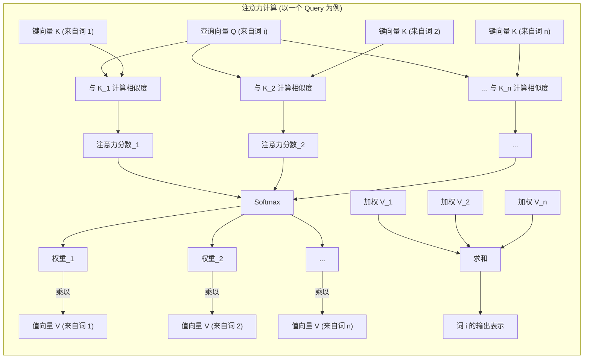

## AI论文解读 | Keep the Cost Down: A Review on Methods to Optimize LLM’s KV Cache Consumption
    
### 作者    
digoal    
    
### 日期    
2025-05-30    
    
### 标签    
PostgreSQL , PolarDB , DuckDB , AI , 论文解读    
    
----    
    
## 背景   
  
https://arxiv.org/pdf/2407.18003   
    
提示:    
```    
读懂《Keep the Cost Down: A Review on Methods to Optimize LLM’s KV Cache Consumption》这篇论文需要提前掌握哪些基础知识, 请使用中文给我讲一下这些基础知识, 尽量通熟易懂, 可以使用markdown支持的图形增加解释性.    
    
使用中文通熟易懂的解读《Keep the Cost Down: A Review on Methods to Optimize LLM’s KV Cache Consumption》这篇论文, 关键内容请深入讲解, 可以使用markdown支持的图形增加解释性.    
    
使用中文提取《Keep the Cost Down: A Review on Methods to Optimize LLM’s KV Cache Consumption》论文中一些重要的术语并详细解释, 可以使用markdown支持的图形示增加解释性.    
```    
    
## 1 前置知识   

好的，要读懂这篇关于优化大语言模型 (LLM) KV Cache 消耗的论文，你需要一些基础知识。我会尽量用通俗易懂的方式解释，并用 Markdown 图形辅助理解。

---

## 1. 什么是大语言模型 (LLM)？🤔

想象一下你正在和一个非常聪明的聊天机器人（比如 ChatGPT）对话。这个机器人能够理解你的话，并给出有逻辑、有条理的回复，甚至能写文章、写代码。这种机器人背后的技术核心就是**大语言模型 (Large Language Model, LLM)**。

* **大 (Large):** 指的是模型的参数量非常大，通常有数十亿甚至上万亿个参数。参数越多，模型通常“知道”的知识就越多，能力也越强。
* **语言模型 (Language Model):** 指的是这种模型专门用来处理和理解人类语言。它的基本任务是预测一段文本中下一个词应该是什么。通过大量文本数据（比如整个互联网的网页）的训练，它学会了词语之间的关系、语法结构、甚至一些常识和推理能力。


简单来说，LLM 就是一个被海量文本数据训练出来的、能够理解和生成人类语言的复杂数学模型。

---

## 2. Transformer 模型 (LLM 的核心架构) 🏗️

目前绝大多数成功的 LLM (如 GPT 系列) 都基于一种叫做 **Transformer** 的神经网络架构。这篇论文中也明确提到了 "Transformer architecture's struggle with handling long texts"  。

* **为什么是 Transformer?**
    * **并行计算能力强：** 与早期依赖顺序处理的 RNN (循环神经网络) 不同，Transformer 可以同时处理输入序列中的所有词，大大提高了训练和推理效率。
    * **捕捉长距离依赖：** 它通过一种叫做“自注意力机制”的东西，能够很好地理解句子中相隔较远的词之间的关系。比如，“我把苹果放进了冰箱，……，后来我从里面拿出了它”，“它”指的就是“苹果”，Transformer 能够很好地捕捉这种关系。

Transformer 模型主要由很多层堆叠而成，每一层主要包含两个部分：
1.  **自注意力机制 (Self-Attention Mechanism)**
2.  **前馈神经网络 (Feed-Forward Network)**


---

## 3. 注意力机制 (Attention) 与 Q, K, V ✨

注意力机制是 Transformer 模型的核心，也是理解 KV Cache 的关键。论文中提到 "storing the keys and values tensor in attention module"  。

* **直观理解：** 当我们阅读一句话时，我们的大脑会不自觉地关注其中更重要的部分。注意力机制就是模拟这种行为。
* **Q, K, V 的概念：**
    * 在自注意力机制中，输入序列中的每个词（或称为 token）都会生成三个向量：
        * **Query (Q, 查询向量):** 代表当前词想要去“查询”或“关注”什么信息。
        * **Key (K, 键向量):** 代表当前词包含什么样的“关键”信息，可以被其他词查询。
        * **Value (V, 值向量):** 代表当前词实际的“内容”或信息。

* **工作流程：**
    1.  对于序列中的某个词，它的 Q 向量会和序列中所有词的 K 向量进行匹配计算（通常是点积），得到一个**注意力分数 (attention score)**。这个分数代表了当前词应该对其他词投入多少注意力。
    2.  这些注意力分数经过 Softmax 函数归一化，变成一组权重。
    3.  这些权重再与对应词的 V 向量相乘并加权求和，得到当前词的最终输出表示。


这篇论文中提到的 **Multi-Head Attention (MHA)**   就是指同时并行地进行多次这样的 Q, K, V 计算（每一组称为一个“头”），然后将所有头的结果拼接起来，这样可以让模型从不同角度学习信息。

---

## 4. 什么是 KV Cache？为什么需要它？💾➡️🚀

这是理解这篇论文最核心的概念。

* **自回归生成 (Auto-regressive Decoding):** LLM 生成文本时，通常是一个词一个词地生成的。比如，模型生成了“今天天气”，下一个词可能是“真好”。在预测“真好”时，模型需要回头看已经生成的“今天天气”。这个过程叫自回归。论文中提到 "auto-regressive decoding mechanism amplifies this issue"  。

* **没有 KV Cache 的问题：**
    * 假设我们要生成第 N 个词。模型需要计算当前词的 Q，然后和前面所有 (N-1) 个词的 K 和 V 进行注意力计算。
    * 如果我们要生成第 N+1 个词，模型又需要计算当前词的 Q，然后和前面所有 N 个词的 K 和 V 进行注意力计算。
    * **关键在于：** 在生成第 N+1 个词时，前面 N-1 个词的 K 和 V 向量，其实在生成第 N 个词时已经计算过了！如果没有优化，这些 K 和 V 会被重复计算，非常浪费算力。对于长文本，这种重复计算会导致时间复杂度很高（论文中提到从二次方降到线性  ）。

* **KV Cache 的作用：**
    * **Cache 就是缓存。** KV Cache 就是把模型在生成过程中计算出来的**每一个先前词的 Key (K) 向量和 Value (V) 向量存储（缓存）起来**。  
    * 当生成下一个新词时，对于已经处理过的词，我们不再重新计算它们的 K 和 V，而是直接从 KV Cache 中读取。模型只需要为当前新生成的词计算其 Q, K, V，然后将新的 K, V 添加到 Cache 中。
    * **好处：** 大大减少了重复计算，提高了长文本生成时的推理速度。论文指出它将 "time complexity of token generation from quadratic to linear"  。


* **KV Cache 的代价：** 虽然 KV Cache 加快了速度，但也带来了新的问题——**显存占用**。因为需要为序列中的每一个词都存储 K 和 V 向量 (而且是每一层 Transformer 都有自己的 KV Cache)，所以当文本序列非常长，或者同时处理多个用户的请求时，KV Cache 会占用巨大的 GPU 显存。论文中明确提到 "increased GPU memory overhead proportional to conversation length"   和 "memory required will become larger and larger"  。这就是这篇论文要解决的核心问题：如何在保持 LLM 性能的同时，减少 KV Cache 的消耗。

---

## 5. LLM 的不同阶段与优化切入点 ⚙️

论文中提到了优化方法可以发生在不同阶段  ：

* **预训练阶段 (Pre-training):** 这是从零开始训练一个大模型的阶段。在这个阶段，可以直接修改模型架构来减少 KV Cache 的产生，比如论文提到的 **Multi-Query Attention (MQA)**   和 **Grouped-Query Attention (GQA)**  ，它们通过让多个查询头共享同一份或几份 K 和 V 来减少 K 和 V 的数量。
* **部署/推理阶段 (Deployment/Inference):** 模型已经训练好了，现在要用它来提供服务。这个阶段的优化主要关注如何更有效地管理和存储现有的 KV Cache，比如论文提到的 **PagedAttention**   (像操作系统管理内存分页一样管理 KV Cache)，或者跨服务器部署 KV Cache  。
* **后训练阶段 (Post-training):** 对已经训练好的模型进行进一步处理，通常不改变模型权重或只做少量微调。论文中主要关注这个阶段的 KV Cache 优化方法，包括：
    * **Eviction (驱逐/丢弃):**   识别并丢弃掉一些不那么重要的 KV 对，比如最旧的或者注意力得分低的 KV 对。
    * **Merging (合并):**   将多个 KV 对通过某种方式合并成更少的 KV 对。
    * **Quantization (量化):**   降低 KV Cache 中数值的精度，比如从 32 位浮点数压缩到 8 位整数甚至更低，从而减少存储体积。

---

## 6. 其他相关概念

* **Token (词符):** 在 LLM 中，输入的文本会被切分成一个个小的单元，称为 token。Token 可以是一个词，也可以是一个子词，甚至是单个字符。LLM 的所有计算都是基于 token 的。论文中多处使用 "token"。
* **Embedding (词嵌入):** 将 token 转换成固定长度的稠密向量表示，这样计算机才能处理。论文中提到 "Embedding layer"  。
* **Perplexity (PPL, 困惑度):**   一种衡量语言模型性能的指标。PPL 越低，表示模型对文本序列的预测能力越好，语言模型的效果也越好。论文中提到用 PPL 评估优化方法对模型性能的影响。
* **Throughput (吞吐量) & Latency (延迟):**   衡量模型推理效率的指标。吞吐量指单位时间内模型能处理的 token 数量 (tokens/sec)；延迟指模型生成一个 token 所需的时间。

---

掌握了这些基础知识后，你应该就能更好地理解《Keep the Cost Down: A Review on Methods to Optimize LLM’s KV Cache Consumption》这篇论文的主要内容和它所讨论的各种优化技术了。祝你阅读顺利！

## 2 解读论文    

好的，我们来通俗易懂地深入解读这篇论文《Keep the Cost Down: A Review on Methods to Optimize LLM’s KV Cache Consumption》。

---

## 论文解读：让大语言模型（LLM）更“省钱”的秘诀 —— KV Cache优化

想象一下你正在和一个超级聪明的朋友聊天，他能记住你们从头到尾的所有对话内容，然后根据这些内容来回答你的问题。这个朋友就是**大语言模型（LLM）**。

这个“记住所有对话内容”的能力，在LLM内部，就是通过一个叫做 **“KV Cache”** 的机制来实现的。这篇论文，就像一本“省钱秘籍”，系统地介绍了各种如何让这个“记忆库”变得更小、更高效，从而让LLM的运行成本降低、性能提升的方法。

### 1. 为什么KV Cache是LLM的“内存大户”？

在深入各种优化方法之前，我们先来搞清楚 **KV Cache 到底是什么**，以及它为什么会成为LLM运行时的主要“内存大户”。

#### 1.1 Transformer与Attention机制的简要回顾

LLM的核心是 **Transformer** 架构，而 Transformer 的核心是 **Attention（注意力）机制**。简单来说，注意力机制让模型在处理一个词时，能够“关注”到输入序列中其他相关词语。

在 Attention 计算中，有三个关键的向量：
*   **Q (Query)**：查询，代表当前要处理的词。
*   **K (Key)**：键，代表历史序列中的词。
*   **V (Value)**：值，代表历史序列中词的实际内容。

计算注意力时，Q 会和所有的 K 进行匹配（点积），得到一个“注意力分数”，然后用这个分数去加权求和对应的 V，从而得到当前词的输出。

#### 1.2 KV Cache 的作用：避免重复计算

LLM在生成文本时，是**自回归**的，也就是一个词一个词地往外吐。例如，生成完“我爱”后，再根据“我爱”来生成“北京”，再根据“我爱北京”来生成“天安门”。

每生成一个新词，模型都需要回顾之前所有已经生成的词。如果没有KV Cache，每次生成新词时，模型都需要重新计算一遍前面所有词的 K 和 V。这就像你每次聊天都要从头到尾把所有内容回想一遍。

为了避免这种巨大的重复计算，**KV Cache 应运而生**。它做的事情很简单：
*   **把每一层 Attention 机制中，所有历史词的 K 和 V 向量都存起来。**
*   **当生成新词时，直接从缓存中取出 K 和 V，只需计算当前词的 Q，然后与缓存中的 K、V 进行Attention计算。**

这极大地加速了LLM的推理过程，但同时也带来了巨大的内存开销。

#### 1.3 KV Cache 的内存占用：一个简单的计算

KV Cache 的总大小由以下几个因素决定：

*   **序列长度 (L)**：你输入的上下文有多长，或者你生成了多少个词。L越大，KV Cache越大。
*   **模型层数 (N)**：LLM通常有几十甚至上百层 Transformer 结构。每一层都有自己的 K 和 V。
*   **注意力头数 (H)**：每个 Transformer 层通常有多个注意力头（Multi-Head Attention），每个头都有独立的 K、V 向量。
*   **每个头的维度 (D)**：K 和 V 向量本身的长度。
*   **数据类型 (dtype)**：通常是 `float16`（半精度浮点数），每个数占2字节。

**KV Cache 总内存 ≈ L × N × H × D × 2 (K和V) × sizeof(dtype)**

**举个例子：**
*   一个中等大小的LLM（如 Llama-7B）可能：
    *   层数 (N) = 32
    *   注意力头数 (H) = 32
    *   每个头的维度 (D) = 128 (通常`隐藏层维度 / 头数` = 4096 / 32)
    *   数据类型 = float16 (2字节)
*   如果序列长度 (L) = 4096 (一个常见的上下文窗口)

那么，KV Cache 大小 = `4096 * 32 * 32 * 128 * 2 * 2 字节 ≈ 2147 MB ≈ 2.1 GB`。

这只是一个序列！如果你要进行批处理（batch inference），同时处理多个序列，内存会进一步飙升。这还不包括模型本身的参数！

所以，KV Cache 消耗大量GPU显存，直接限制了：
1.  **最大上下文长度**：你不能让LLM记住太长的对话。
2.  **批处理量（Batch Size）**：你不能同时处理太多用户的请求。
3.  **模型大小**：限制了你能部署的模型规模。

### 2. 论文核心：优化KV Cache的“八仙过海”之术

这篇论文将各种优化KV Cache的方法归纳为几大类。我们可以将它们理解为让你的“记忆库”变得更高效的几种策略：

#### 策略一：量化 (Quantization) - “节食减肥”

**核心思想：** 让存储 K 和 V 的数据变得更“瘦”。

我们通常用 `float16`（16位浮点数）来存储 K 和 V。量化就是把这些数据从 `float16` 变成 `int8`（8位整数）、`int4`（4位整数）甚至更低的精度。

*   **原理：** 用更少的比特来表示一个数字。例如，原来需要16个比特来表示一个浮点数，现在只需要8个或4个比特来表示一个整数。
*   **优点：**
    *   **最直接的内存节省：** `int8` 直接减少一半，`int4` 减少四分之三。
    *   **提高计算效率：** 低精度计算更快，通常结合特殊的硬件（如Tensor Core）加速。
*   **挑战：**
    *   **精度损失：** 用更少的比特表示会导致信息损失，可能影响模型的推理质量。需要设计精巧的量化算法（如动态量化、K-V感知量化）来最小化精度损失。
    *   **实现复杂性：** 需要在硬件和软件层面支持低精度计算和数据类型转换。

**图示：数据类型对KV Cache大小的影响**


**深入讲解：**
量化不仅仅是简单地把浮点数转换成整数。为了减少精度损失，研究者提出了多种方法，比如：
*   **非对称量化/对称量化：** 如何将浮点数的范围映射到整数范围。
*   **逐通道量化/逐层量化：** 对不同维度或不同层的数据进行不同的量化策略。
*   **动态量化：** 在推理时根据数据的实际范围动态调整量化参数。
*   **KV感知量化 (KV-Cache-Aware Quantization)：** 专门针对KV Cache的特性进行优化，比如考虑到KV Cache中的值通常是Attention Score的输出，分布可能比较集中。

#### 策略二：稀疏化与选择性缓存 (Sparsity & Selective Caching) - “只记重点”

**核心思想：** 我没必要记住所有历史，只记住重要的，或者只记住最近的。

*   **原理：** 识别哪些 K、V 向量是模型后续生成中最不重要、最不常用的，然后将它们丢弃或压缩。
*   **优点：** 显著减少了存储的 K、V 向量数量，直接降低内存。
*   **挑战：**
    *   **如何判断“重要性”：** 丢弃不重要的 K、V 需要复杂的策略，如果判断失误，可能严重影响模型性能。
    *   **需要修改Attention机制：** 许多方法需要模型能够处理不完整的历史信息。

**子方法：**

1.  **滑动窗口注意力 (Sliding Window Attention / Stream Inference)**
    *   **原理：** 只保留最近 N 个词的 K、V 缓存，丢弃更早的。
    *   **优点：** 内存占用与序列长度无关，只取决于窗口大小。非常适合长文本流式推理。
    *   **挑战：** 如果重要的信息在窗口之外，模型将无法访问，导致“遗忘”问题。
    *   **应用：** LongFormer、Mistral等模型都使用了类似的概念。

    **图示：滑动窗口 KV Cache**

    ```mermaid
    graph TD
        subgraph "输入序列"
            T1(Token 1) --> T2(Token 2) --> T3(Token 3) --> T4(Token 4) --> T5(Token 5) --> T6(Token 6) --> T7(Token 7) --> T8(Token 8)
        end
        subgraph "KV Cache (窗口大小=4)"
            direction LR
            C5[KV for T5] --- C6[KV for T6] --- C7[KV for T7] --- C8[KV for T8]
        end
        T8 -- 计算 Attention --> C5
        T8 -- 计算 Attention --> C6
        T8 -- 计算 Attention --> C7
        T8 -- 计算 Attention --> C8
        
        style T1 fill:#ccc,stroke:#333
        style T2 fill:#ccc,stroke:#333
        style T3 fill:#ccc,stroke:#333
        style T4 fill:#ccc,stroke:#333
        style C5 fill:#afa,stroke:#333
        style C6 fill:#afa,stroke:#333
        style C7 fill:#afa,stroke:#333
        style C8 fill:#afa,stroke:#333
    ```
    *当 Token 9 生成时，Token 5 的 KV Cache 将被丢弃，Token 6-9 保留。*

2.  **淘汰策略 (Eviction Policies)**
    *   **原理：** 借鉴操作系统内存管理，当KV Cache空间不足时，根据某种策略（如LRU-最近最少使用，LFU-最不常用等）淘汰部分 K、V。
    *   **优点：** 比固定窗口更灵活，理论上能保留更重要的信息。
    *   **挑战：** 需要运行时监控 K、V 的使用频率或访问时间，引入额外开销。如何定义“重要性”依然是个难题。

3.  **稀疏 Attention 模式**
    *   **原理：** 某些Attention机制（如LongFormer、BigBird）本身就是稀疏的，它们设计的Attention模式就不是让每个词都关注所有历史词，而是只关注一部分。
    *   **优点：** 从根本上减少了需要存储的 K、V 数量。
    *   **挑战：** 需要模型预训练时就采用这种Attention模式，对模型架构有侵入性。

#### 策略三：注意力机制改进 (Attention Mechanism Improvements) - “优化生产线”

**核心思想：** 从 Attention 机制的源头进行改造，让它产生的 K、V 向量本身就更少。

最典型的就是 **MQA (Multi-Query Attention) 和 GQA (Grouped-Query Attention)**。

*   **传统的多头注意力 (Multi-Head Attention - MHA)：**
    每个注意力头都有自己独立的 Q、K、V 投影矩阵，因此会生成独立的 K 和 V 向量。如果有 H 个头，就会有 H 对 K、V 向量。

    ```mermaid
    graph TD
        Input[输入序列] --> Q_proj_1[Q投影1];
        Input --> K_proj_1[K投影1];
        Input --> V_proj_1[V投影1];
        
        Q_proj_1 --> Head1_Q;
        K_proj_1 --> Head1_K;
        V_proj_1 --> Head1_V;

        Input --> Q_proj_H[Q投影H];
        Input --> K_proj_H[K投影H];
        Input --> V_proj_H[V投影H];
        
        Q_proj_H --> HeadH_Q;
        K_proj_H --> HeadH_K;
        V_proj_H --> HeadH_V;

        subgraph "KV Cache (传统MHA)"
            direction LR
            K1[Head1_K] --- V1[Head1_V]
            K2[...] --- V2[...]
            KH[HeadH_K] --- VH[HeadH_V]
        end
        Head1_K --> K1;
        Head1_V --> V1;
        HeadH_K --> KH;
        HeadH_V --> VH;
    ```

1.  **多查询注意力 (Multi-Query Attention - MQA)**
    *   **原理：** 所有的注意力头共享 **同一套** K 和 V 投影矩阵。也就是说，无论有多少个 Q 头，都只生成 **一份 K 和 V 向量**。
    *   **优点：**
        *   **KV Cache 大小骤降：** 理论上只存储传统 MHA 的 `1/H`。
        *   **推理速度显著提升：** K/V 投影计算量大大减少，内存带宽占用也减少。
    *   **挑战：** 共享 K、V 可能会导致模型表达能力下降，影响质量（因为 K、V 是共享的，它们必须是所有 Q 头的“通用记忆”）。

    **图示：MQA 的 KV Cache**

    ```mermaid
    graph TD
        Input[输入序列] --> Q_proj_1[Q投影1];
        Input --> Q_proj_H[Q投影H];
        
        Input --> K_proj[共享K投影];
        Input --> V_proj[共享V投影];

        K_proj --> Shared_K;
        V_proj --> Shared_V;

        subgraph "KV Cache (MQA)"
            direction LR
            SK[共享K] --- SV[共享V]
        end
        Shared_K --> SK;
        Shared_V --> SV;
    ```

2.  **分组查询注意力 (Grouped-Query Attention - GQA)**
    *   **原理：** MQA 和 MHA 的折衷方案。Q 头被分成若干组，**每组 Q 头共享一套 K 和 V 投影矩阵**。
    *   **优点：**
        *   KV Cache 大小是传统 MHA 的 `1/G`（G是分组数）。
        *   在内存节省和推理速度提升的同时，比 MQA 更好地保留了模型质量，因为 K、V 投影不是完全共享的。
    *   **挑战：** 依然可能比 MHA 有轻微的质量损失。

    **图示：GQA 的 KV Cache**

    ```mermaid
    graph TD
        Input[输入序列] --> Q_proj_Group1_1[Q投影 G1_1];
        Input --> Q_proj_Group1_N[Q投影 G1_N];
        Input --> K_proj_Group1[K投影 G1];
        Input --> V_proj_Group1[V投影 G1];

        Input --> Q_proj_GroupX_1[Q投影 GX_1];
        Input --> Q_proj_GroupX_N[Q投影 GX_N];
        Input --> K_proj_GroupX[K投影 GX];
        Input --> V_proj_GroupX[V投影 GX];
        
        K_proj_Group1 --> Shared_K1;
        V_proj_Group1 --> Shared_V1;

        K_proj_GroupX --> Shared_KX;
        V_proj_GroupX --> Shared_VX;

        subgraph "KV Cache (GQA)"
            direction LR
            SK1[共享K1] --- SV1[共享V1]
            SKX[共享KX] --- SVX[共享VX]
        end
        Shared_K1 --> SK1;
        Shared_V1 --> SV1;
        Shared_KX --> SKX;
        Shared_VX --> SVX;
    ```
    *目前主流的 Llama 2/3、Mistral 等大型模型都广泛采用了 GQA 技术，是 KV Cache 优化中最有效且最被广泛应用的方法之一。*

#### 策略四：内存管理优化 (Memory Management Optimization) - “精打细算”

**核心思想：** 如何更高效地管理和分配那块用于 KV Cache 的显存。

最具有颠覆性的技术是 **Paged Attention (分页注意力)**。

*   **传统 KV Cache 内存分配：**
    *   KV Cache 通常是为每个序列分配一块连续的内存空间。
    *   **问题1：内存碎片。** 随着序列的动态增长和缩小（尤其是在批处理中，不同序列长度不同），显存中会出现大量小块的“碎片”，导致即使总内存够，也找不到足够大的连续内存来分配给新的大序列。就像你的硬盘文件碎片化。
    *   **问题2：提前分配/填充浪费。** 为了避免上述问题，或者为了最大化吞吐，通常会提前分配最大可能的序列长度，导致内存浪费。
    *   **问题3：批处理效率低。** 传统批处理方式，批内所有序列必须填充到最长序列的长度，造成大量填充（padding）和计算浪费。

*   **Paged Attention (分页注意力)：**
    *   **原理：** 借鉴了操作系统虚拟内存的“分页”思想。KV Cache 不再分配一整块连续的内存，而是由许多小的、固定大小的“块”（Block 或 Page）组成。这些块可以分散在显存的任意位置。
    *   当一个序列需要存储 KV Cache 时，它不再要求连续的大内存，而是向系统申请一些离散的块，这些块在逻辑上是连续的，但在物理上是离散的。
    *   一个序列的KV Cache不再是连续的，而是通过一个**映射表**来记录它由哪些物理块组成。

    **图示：传统与 Paged Attention 内存分配对比**

    ```mermaid
    graph TD
        subgraph "传统 KV Cache 内存管理"
            M1["Batch 1: Seq1 (长)"] --> M2["Batch 1: Seq2 (中)"] --> M3["Batch 1: Seq3 (短)"];
            M4[可用内存片段1] --> M5[可用内存片段2] --> M6[可用内存片段3];
            style M1 fill:#f9f,stroke:#333,stroke-width:2px
            style M2 fill:#afa,stroke:#333,stroke-width:2px
            style M3 fill:#aaf,stroke:#333,stroke-width:2px
            style M4 fill:#ccc,stroke:#333,stroke-width:1px
            style M5 fill:#ccc,stroke:#333,stroke-width:1px
            style M6 fill:#ccc,stroke:#333,stroke-width:1px
            direction LR
            M_Frag[大量内存碎片];
            M_Frag -- 导致 --> M_OOM(内存不足 OOM);
        end

        subgraph "Paged Attention 内存管理"
            direction LR
            block1[Block 1] --- block2[Block 2] --- block3[Block 3] --- block4[Block 4] --- block5[Block 5];
            block6[Block 6] --- block7[Block 7] --- block8[Block 8] --- block9[Block 9] --- block10[Block 10];
            
            S1["Seq1 (长)"] -- 映射表 --> B1(Block 1) & B2(Block 3) & B3(Block 6) & B4(Block 10);
            S2["Seq2 (中)"] -- 映射表 --> B5(Block 2) & B6(Block 4) & B7(Block 7);
            S3["Seq3 (短)"] -- 映射表 --> B8(Block 5) & B9(Block 9);

            style block1 fill:#afa,stroke:#333,stroke-width:1px
            style block2 fill:#aaf,stroke:#333,stroke-width:1px
            style block3 fill:#afa,stroke:#333,stroke-width:1px
            style block4 fill:#aaf,stroke:#333,stroke-width:1px
            style block5 fill:#f9f,stroke:#333,stroke-width:1px
            style block6 fill:#afa,stroke:#333,stroke-width:1px
            style block7 fill:#aaf,stroke:#333,stroke-width:1px
            style block8 fill:#f9f,stroke:#333,stroke-width:1px
            style block9 fill:#f9f,stroke:#333,stroke-width:1px
            style block10 fill:#afa,stroke:#333,stroke-width:1px

            S1 -- 分配块 --> A(根据需求动态分配);
            S2 -- 分配块 --> A;
            S3 -- 分配块 --> A;
        end
    ```

*   **Paged Attention 的巨大优势：**
    *   **消除内存碎片：** 极大地提高了显存利用率，几乎没有浪费。
    *   **动态扩展：** 序列长度可以动态增长，按需分配新的块，避免了提前分配大量内存。
    *   **支持更大批处理量：** 可以在一个批次中高效处理不同长度的序列，无需填充，从而提高吞吐量。
    *   **Copy-on-Write (写时复制)：** 如果有多个序列共享相同的前缀（例如，聊天机器人中的指令部分），这些前缀的 KV Cache 块可以被多个序列共享，只有当某个序列开始生成自己的独特内容时，才会复制并分配新的块。这进一步节省了内存。
*   **挑战：**
    *   **实现复杂：** 需要深入的GPU编程知识，因为它直接操作显存分配和 Attention 计算过程。
    *   **需要定制的Attention实现：** 传统Attention计算假定 KV Cache 是连续的，Paged Attention 需要特殊的 CUDA Kernel 来处理不连续的内存访问。
    *   **vLLM 框架：** Paged Attention 是 vLLM 框架的核心技术，使得 vLLM 在 LLM 推理吞吐量上表现出色。

#### 其他值得一提的方法

*   **KV Cache 压缩 (KV Cache Compression)：**
    *   **原理：** 对存储的 K、V 向量进行更复杂的压缩算法，如奇异值分解（SVD）、哈希等，来减少其维度或表示。
    *   **优点：** 在不改变 Attention 机制和数据类型的前提下，减少 KV Cache 尺寸。
    *   **挑战：** 压缩和解压缩需要计算开销；复杂的算法可能导致更大的精度损失。

*   **KV Cache 去重 (Deduplication)：**
    *   **原理：** 在某些场景下（如问答系统），用户的输入可能包含大量重复的子序列。如果能识别并共享这些重复子序列的 KV Cache，也能节省内存。
    *   **优点：** 针对特定应用场景能显著节省内存。
    *   **挑战：** 识别重复序列并管理共享需要额外的逻辑。

### 3. 总结与展望

这篇论文综述了 KV Cache 优化的多种策略，它们各有侧重：

*   **量化：** 直接“瘦身”，内存立竿见影，但要权衡精度。
*   **稀疏化/选择性缓存：** “挑重点记”，放弃不重要的，可能影响信息完整性。
*   **MQA/GQA：** “优化生产线”，从 Attention 机制本身减少 K、V 数量，效果显著且普遍采纳。
*   **Paged Attention：** “精细管理内存”，彻底解决内存碎片和利用率低的问题，是目前LLM推理后端最先进的内存管理技术。

**未来趋势：**
*   **多方法协同：** 实践中往往是多种方法结合使用，例如一个模型可能同时采用 GQA、量化和 Paged Attention。
*   **软硬件协同设计：** 针对KV Cache优化的算法需要得到硬件（如GPU）的有效支持，才能发挥最大效益。
*   **更智能的KV Cache管理：** 如何更智能地判断哪些KV是“重要”的，哪些可以安全丢弃，仍是研究热点。

通过这些精妙的优化技术，研究者们正在不断地降低LLM的运行成本，使得它们能够支持更长的上下文，服务更多的用户，最终让这些强大的AI能力变得更加“经济适用”，触手可及。

## 3 术语   

好的，我们来详细解释这篇论文中提到的一些关键术语。这些术语是理解LLM内部工作原理和KV Cache优化机制的基础。

---

## 论文关键术语深度解析

### 1. KV Cache (K-值缓存)

*   **定义：** KV Cache 是大语言模型 (LLM) 在进行**自回归解码**时，用来存储 Attention 机制中 **Key (K)** 和 **Value (V)** 向量的内存区域。
*   **作用：** 在LLM生成文本时，每生成一个新词，都需要回顾并计算与所有历史词语的注意力。如果没有 KV Cache，模型将不得不重复计算所有历史词的 K 和 V 向量，这会带来巨大的计算开销和时间延迟。KV Cache 的作用就是把这些 K 和 V 向量缓存起来，供后续词语的注意力计算直接使用，从而**显著加速推理过程**。
*   **重要性：** 它是 LLM 能高效进行自回归推理的关键组件，但也是 **LLM 推理过程中最大的内存消耗来源之一**。KV Cache 的大小直接限制了 LLM 的**最大上下文长度**和**批处理量（Batch Size）**。
*   **图示：KV Cache 工作原理**
    ```mermaid
    graph TD
        subgraph "LLM 自回归解码"
            Input[输入: 我爱] --> Gen1[生成: 北京];
            Gen1 --> Gen2[生成: 天安门];
            Gen2 --> Gen3[生成: 广场];
        end

        subgraph "KV Cache"
            direction LR
            K_tokens["所有历史词的 Key 向量"] --- V_tokens["所有历史词的 Value 向量"]
        end

        Input -- 生成 北京 (当前词) --> Q1["Query(北京)"]
        Q1 --> Attention_Calc1[Attention 计算];
        K_tokens -- 提供历史K --> Attention_Calc1;
        V_tokens -- 提供历史V --> Attention_Calc1;
        Attention_Calc1 -- 更新KV Cache --> K_tokens;
        Attention_Calc1 -- 更新KV Cache --> V_tokens;

        Gen1 -- 生成 天安门 (当前词) --> Q2["Query(天安门)"]
        Q2 --> Attention_Calc2[Attention 计算];
        K_tokens -- 提供历史K (包含 北京) --> Attention_Calc2;
        V_tokens -- 提供历史V (包含 北京) --> Attention_Calc2;
        Attention_Calc2 -- 更新KV Cache --> K_tokens;
        Attention_Calc2 -- 更新KV Cache --> V_tokens;
    ```
    *解释：每次生成新词，模型会用当前词的 Query 去匹配缓存中的所有 Key，然后用注意力分数加权求和缓存中的 Value，从而得到输出。同时，当前词的 Key 和 Value 也会被添加到 KV Cache 中。*

### 2. 注意力机制 (Attention Mechanism) / QKV 向量

*   **定义：** 注意力机制是 Transformer 架构的核心，它允许模型在处理序列中的一个词时，能够动态地“关注”到序列中其他相关词语。它通过计算三个向量之间的关系来实现：**Query (Q)**, **Key (K)**, 和 **Value (V)**。
*   **Q (Query - 查询):** 代表当前正在处理的词语或信息的“查询”向量。就像你在图书馆里拿着一个书名去查询（Query）。
*   **K (Key - 键):** 代表序列中所有其他词语或信息的“键”向量。图书馆里每本书的索引卡片就是它的“键”（Key）。
*   **V (Value - 值):** 代表序列中所有其他词语或信息的“值”向量，包含了词语的实际内容或语义信息。图书馆里书的实际内容就是它的“值”（Value）。
*   **计算过程：**
    1.  **相似度计算：** Q 向量与所有 K 向量进行点积（或其他相似度函数），得到一个“注意力分数”。分数越高，表示 Q 和 K 越相关。
    2.  **归一化：** 对注意力分数进行 Softmax 归一化，得到权重。
    3.  **加权求和：** 用这些权重去加权求和对应的 V 向量，最终得到当前词语的输出表示。
*   **重要性：** 理解 QKV 是理解 Transformer 和 KV Cache 的基础。KV Cache 存储的就是 K 和 V 向量。
*   **图示：Attention 计算流程**
    ```mermaid
    graph TD
        Input_Token[输入词] --> Linear_Q[线性变换得到 Q];
        History_Tokens[历史词] --> Linear_K[线性变换得到 K];
        History_Tokens --> Linear_V[线性变换得到 V];

        Linear_Q --> Q_vec[Q 向量];
        Linear_K --> K_vecs[K 向量组];
        Linear_V --> V_vecs[V 向量组];

        Q_vec -- 点积 --> Score_QK[Q·K 相似度分数];
        K_vecs -- KV Cache 存储 --> KV_Cache;
        V_vecs -- KV Cache 存储 --> KV_Cache;
        
        Score_QK -- 归一化 --> Weights[注意力权重];
        Weights -- 加权求和 --> Output[输出];
        V_vecs --> Output;
    ```

### 3. 自回归解码 (Auto-regressive Decoding)

*   **定义：** 是一种序列生成方式，尤其在 LLM 中广泛使用。模型每次只生成一个词语，并将这个新生成的词语以及之前所有已生成的词语（即上下文）作为输入，来预测并生成下一个词语。
*   **特点：** 这是一个逐词生成、逐步积累上下文的过程。
*   **与 KV Cache 的关联：** 正是这种自回归的特性，导致了每一步都需要访问并更新所有历史 K 和 V 向量，从而使得 KV Cache 成为必要，同时也带来了巨大的内存开销。
*   **重要性：** 它是理解 LLM 如何工作以及为何需要 KV Cache 的根本。
*   **图示：自回归解码过程**
    ```mermaid
    graph LR
        start[起始输入: 我爱] --> step1[生成词1: 北京];
        step1 --> context1["新上下文: 我爱北京"];
        context1 --> step2[生成词2: 天安门];
        step2 --> context2["新上下文: 我爱北京天安门"];
        context2 --> step3[生成词3: 广场];
        step3 --> finish[最终序列: 我爱北京天安门广场];
    ```

### 4. 量化 (Quantization)

*   **定义：** 量化是一种技术，将神经网络模型中的数值（如权重、激活值，包括 KV Cache 中的 K、V 向量）从高精度表示（例如 `float16` 或 `BF16`，即16位浮点数）转换为低精度表示（例如 `int8`，即8位整数，或 `int4`，即4位整数）。
*   **目的：**
    *   **减少内存占用：** 降低数据精度直接减少了存储空间。例如，从 `float16` 到 `int8` 可以将内存占用减少一半。
    *   **加速计算：** 低精度计算通常更快，并且可以利用特定的硬件加速单元（如 NVIDIA Tensor Core）。
*   **挑战：** 降低精度必然会带来信息损失，可能影响模型的推理性能或准确性。因此，需要设计精巧的量化算法来最小化这种损失。
*   **KV Cache 量化：** 专门针对 KV Cache 中的 K、V 向量进行量化，是降低 KV Cache 内存开销最直接有效的方法之一。
*   **图示：量化如何节省内存**
    ```mermaid
    graph TD
        High_Precision["KV Cache 数据 (e.g., float16)"] -- 每个数值占 2 字节 --> Large_Memory[占用 2X 内存];
        High_Precision -- 量化 --> Low_Precision["KV Cache 数据 (e.g., int8)"];
        Low_Precision -- 每个数值占 1 字节 --> Small_Memory["占用 1X 内存 (节省 50%)"];
        High_Precision -- 量化 --> Lower_Precision["KV Cache 数据 (e.g., int4)"];
        Lower_Precision -- 每个数值占 0.5 字节 --> Smaller_Memory["占用 0.5X 内存 (节省 75%)"];
    ```

### 5. 多查询注意力 (Multi-Query Attention - MQA) / 分组查询注意力 (Grouped-Query Attention - GQA)

这是两种改进 Attention 机制的变体，旨在减少 KV Cache 的内存占用并提升推理速度。

#### 5.1 传统多头注意力 (Multi-Head Attention - MHA)

*   **特点：** 在 MHA 中，每个注意力头 (Head) 都有自己独立的 Query (Q)、Key (K) 和 Value (V) 投影矩阵。这意味着如果模型有 `H` 个注意力头，它会生成 `H` 对独立的 K 和 V 向量，这些都会被缓存起来。KV Cache 的大小正比于 `H`。

    ```mermaid
    graph TD
        Input[输入序列] --> Q_proj_1["Q投影 (头1)"];
        Input --> K_proj_1["K投影 (头1)"];
        Input --> V_proj_1["V投影 (头1)"];
        
        Input --> Q_proj_H["Q投影 (头H)"];
        Input --> K_proj_H["K投影 (头H)"];
        Input --> V_proj_H["V投影 (头H)"];

        K_proj_1 --> K_head1[K for Head 1];
        V_proj_1 --> V_head1[V for Head 1];
        K_proj_H --> K_headH[K for Head H];
        V_proj_H --> V_headH[V for Head H];

        subgraph "KV Cache (MHA)"
            direction LR
            K1[K_H1] --- V1[V_H1];
            K2[...] --- V2[...];
            KH[K_HH] --- VH[V_HH];
        end
        K_head1 --> K1; V_head1 --> V1;
        K_headH --> KH; V_headH --> VH;
    ```

#### 5.2 多查询注意力 (Multi-Query Attention - MQA)

*   **特点：** 所有的注意力头共享 **同一套** K 和 V 投影矩阵。无论有多少个 Q 头，模型都只生成 **一份 K 和 V 向量**。
*   **优点：**
    *   **KV Cache 大小骤降：** 理论上只存储传统 MHA 的 `1/H`，显著减少内存。
    *   **推理速度显著提升：** K/V 投影的计算量和内存带宽占用大大减少。
*   **挑战：** 共享 K、V 可能会导致模型表达能力下降，影响质量，因为所有的 Q 头都必须依赖同一份“共享记忆”。
*   **图示：MQA 的 KV Cache**
    ```mermaid
    graph TD
        Input[输入序列] --> Q_proj_Group1["Q投影 (头1)"];
        Input --> Q_proj_GroupH["Q投影 (头H)"];
        
        Input --> K_proj_Shared[共享K投影];
        Input --> V_proj_Shared[共享V投影];

        K_proj_Shared --> Shared_K[共享K];
        V_proj_Shared --> Shared_V[共享V];

        subgraph "KV Cache (MQA)"
            direction LR
            SK[共享K] --- SV[共享V];
        end
        Shared_K --> SK;
        Shared_V --> SV;
    ```

#### 5.3 分组查询注意力 (Grouped-Query Attention - GQA)

*   **特点：** MQA 和 MHA 的折衷方案。Q 头被分成若干组 (`G` 组)，**每组 Q 头共享一套 K 和 V 投影矩阵**。
*   **优点：**
    *   KV Cache 大小是传统 MHA 的 `1/G`，内存节省程度介于 MHA 和 MQA 之间。
    *   在内存节省和推理速度提升的同时，比 MQA 更好地保留了模型质量，因为 K、V 投影不是完全共享的。
*   **挑战：** 依然可能比 MHA 有轻微的质量损失。
*   **重要性：** GQA 是目前许多主流大型模型（如 Llama 2/3, Mistral）广泛采用的 Attention 机制，它在性能和效率之间找到了很好的平衡点。
*   **图示：GQA 的 KV Cache**
    ```mermaid
    graph TD
        Input[输入序列] --> Q_proj_G1_1["Q投影 (组1, 头1)"];
        Input --> Q_proj_G1_N["Q投影 (组1, 头N)"];
        Input --> K_proj_G1["K投影 (组1共享)"];
        Input --> V_proj_G1["V投影 (组1共享)"];

        Input --> Q_proj_GX_1["Q投影 (组X, 头1)"];
        Input --> Q_proj_GX_N["Q投影 (组X, 头N)"];
        Input --> K_proj_GX["K投影 (组X共享)"];
        Input --> V_proj_GX["V投影 (组X共享)"];
        
        K_proj_G1 --> Shared_K1[共享K1];
        V_proj_G1 --> Shared_V1[共享V1];

        K_proj_GX --> Shared_KX[共享KX];
        V_proj_GX --> Shared_VX[共享VX];

        subgraph "KV Cache (GQA)"
            direction LR
            SK1[共享K1] --- SV1[共享V1];
            SKX[共享KX] --- SVX[共享VX];
        end
        Shared_K1 --> SK1; Shared_V1 --> SV1;
        Shared_KX --> SKX; Shared_VX --> SVX;
    ```

### 6. 分页注意力 (Paged Attention)

*   **定义：** 一种革命性的 KV Cache 内存管理技术，借鉴了操作系统中虚拟内存的“分页”概念。它将 KV Cache 存储在许多小的、固定大小的“块”（Blocks 或 Pages）中，这些块可以分散在显存的任意位置，而无需连续存储。
*   **解决的问题：**
    1.  **内存碎片 (Memory Fragmentation)：** 传统方法为每个序列分配连续内存，不同序列长度和动态增长导致显存碎片化，即使总内存足够也可能无法分配大块内存。
    2.  **内存浪费：** 传统批处理需要将所有序列填充到最长序列的长度，或提前分配最大可能长度的内存，造成大量填充和浪费。
*   **工作原理：**
    *   KV Cache 不再是连续的内存块，而是由许多离散的“页”组成。
    *   每个序列的 KV Cache 通过一个“逻辑-物理”映射表来管理其对应的物理内存块。
    *   **动态分配：** 当序列增长时，只需按需分配新的块，而不是重新分配整个大块。
    *   **共享与写时复制 (Copy-on-Write)：** 多个序列可以共享相同的 KV Cache 块（例如，在批处理中，若用户输入有相同的前缀），只有当某个序列修改了共享的 KV Cache 时（即生成了独有的新词），才会触发“写时复制”，为其分配独立的块。
*   **重要性：**
    *   **极大地提高显存利用率：** 几乎消除了内存碎片和填充浪费。
    *   **支持更大批处理量：** 能够在同一批次中高效处理不同长度的序列。
    *   **显著提升吞吐量：** 在生产环境中，能够支持更多并发用户和请求。
    *   **vLLM 框架的核心：** Paged Attention 是 vLLM 框架之所以能实现高吞吐量的关键技术。
*   **图示：传统与 Paged Attention 内存管理对比**
    ```mermaid
    graph TD
        subgraph "传统 KV Cache 内存分配"
            M1["Seq A (长)"] --- M2["Seq B (中)"] --- M3["Seq C (短)"];
            F1[碎片1] --- F2[碎片2] --- F3[碎片3];
            style M1 fill:#f9f,stroke:#333
            style M2 fill:#afa,stroke:#333
            style M3 fill:#aaf,stroke:#333
            style F1 fill:#ccc,stroke:#333,stroke-dasharray: 5 5
            style F2 fill:#ccc,stroke:#333,stroke-dasharray: 5 5
            style F3 fill:#ccc,stroke:#333,stroke-dasharray: 5 5
            M1 -- 大量 --> 内存碎片;
            内存碎片 --> 限制批处理和上下文长度;
        end

        subgraph "Paged Attention 内存分配"
            direction LR
            Block1[Block 1] --- Block2[Block 2] --- Block3[Block 3] --- Block4[Block 4];
            Block5[Block 5] --- Block6[Block 6] --- Block7[Block 7] --- Block8[Block 8];
            
            SeqA["序列A (长)"] --> MapA{逻辑到物理映射};
            MapA --> B1(Block 1) & B3(Block 3) & B5(Block 5) & B7(Block 7);

            SeqB["序列B (中)"] --> MapB{逻辑到物理映射};
            MapB --> B2(Block 2) & B4(Block 4) & B6(Block 6);

            style Block1 fill:#f9f,stroke:#333,stroke-width:1px
            style Block2 fill:#afa,stroke:#333,stroke-width:1px
            style Block3 fill:#f9f,stroke:#333,stroke-width:1px
            style Block4 fill:#afa,stroke:#333,stroke-width:1px
            style Block5 fill:#f9f,stroke:#333,stroke-width:1px
            style Block6 fill:#afa,stroke:#333,stroke-width:1px
            style Block7 fill:#f9f,stroke:#333,stroke-width:1px
            style Block8 fill:#ccc,stroke:#333,stroke-dasharray: 5 5

            MapA -- 动态分配 --> D1[高效利用显存];
            MapB -- 动态分配 --> D1;
            D1 --> 支持更大批处理量;
            D1 --> 支持更长上下文;
        end
    ```

### 7. 上下文窗口 (Context Window) / 序列长度 (Sequence Length)

*   **定义：**
    *   **序列长度 (Sequence Length):** 指输入给模型或模型已生成文本的总词语（token）数量。
    *   **上下文窗口 (Context Window):** 指模型在生成下一个词时，能够“看到”和“记住”的最大历史词语数量。它决定了模型能够处理和理解多长的文本信息。
*   **与 KV Cache 的关联：** KV Cache 的大小直接与上下文窗口（或序列长度）成正比。上下文窗口越长，需要缓存的 K 和 V 向量就越多，KV Cache 占用的显存就越大。
*   **重要性：** 上下文窗口是 LLM 能力的关键指标之一，决定了模型能否处理长文本、长对话、长文档。KV Cache 优化技术的目标之一就是如何在有限的硬件资源下支持更长的上下文窗口。

### 8. 内存碎片 (Memory Fragmentation)

*   **定义：** 指计算机内存（这里特指 GPU 显存）在经过多次分配和释放操作后，出现大量分散的小块可用空间，但这些小块空间无法组合成一个足够大的连续空间来满足新的、更大的内存分配请求。
*   **问题：** 即使总的可用内存量很大，如果都是碎片化的，也可能导致程序无法分配所需的大块内存，从而触发“内存不足”（Out Of Memory - OOM）错误。在 LLM 推理中，尤其在动态批处理和处理不同长度序列时，传统的连续内存分配方式很容易导致 KV Cache 区域出现内存碎片。
*   **解决方案：** **分页注意力 (Paged Attention)** 正是为了解决 KV Cache 的内存碎片问题而设计的。它将内存划分为固定大小的页，允许 KV Cache 数据非连续地存储在这些页中，从而高效利用显存，避免碎片化。
*   **图示：内存碎片化**
    ```mermaid
    graph TD
        subgraph "显存区域"
            direction LR
            Used1[已用空间] --- Free1[可用小块] --- Used2[已用空间] --- Free2[可用小块] --- Used3[已用空间] --- Free3[可用小块];
            style Used1 fill:#f9f,stroke:#333
            style Used2 fill:#f9f,stroke:#333
            style Used3 fill:#f9f,stroke:#333
            style Free1 fill:#afa,stroke:#333,stroke-dasharray: 5 5
            style Free2 fill:#afa,stroke:#333,stroke-dasharray: 5 5
            style Free3 fill:#afa,stroke:#333,stroke-dasharray: 5 5
        end
        Free1 & Free2 & Free3 -- 总和可能很大 --> 总可用内存;
        TotalMemory(总可用内存) -- 但无法分配 --> LargeRequest(一个大请求);
        LargeRequest -- 因为 --> 内存碎片化;
    ```

这些术语是理解《Keep the Cost Down》这篇论文中各种优化方法的基础，也是当前 LLM 推理优化领域最核心和最活跃的研究方向。

## 参考    
    
https://arxiv.org/pdf/2407.18003
    
    
<b> 以上内容基于DeepSeek、QwQ及诸多AI生成, 轻微人工调整, 感谢杭州深度求索人工智能、阿里云等公司. </b>    
    
<b> AI 生成的内容请自行辨别正确性, 当然也多了些许踩坑的乐趣, 毕竟冒险是每个男人的天性.  </b>    
    
  
  
#### [期望 PostgreSQL|开源PolarDB 增加什么功能?](https://github.com/digoal/blog/issues/76 "269ac3d1c492e938c0191101c7238216")
  
  
#### [PolarDB 开源数据库](https://openpolardb.com/home "57258f76c37864c6e6d23383d05714ea")
  
  
#### [PolarDB 学习图谱](https://www.aliyun.com/database/openpolardb/activity "8642f60e04ed0c814bf9cb9677976bd4")
  
  
#### [PostgreSQL 解决方案集合](../201706/20170601_02.md "40cff096e9ed7122c512b35d8561d9c8")
  
  
#### [德哥 / digoal's Github - 公益是一辈子的事.](https://github.com/digoal/blog/blob/master/README.md "22709685feb7cab07d30f30387f0a9ae")
  
  
#### [About 德哥](https://github.com/digoal/blog/blob/master/me/readme.md "a37735981e7704886ffd590565582dd0")
  
  

  
