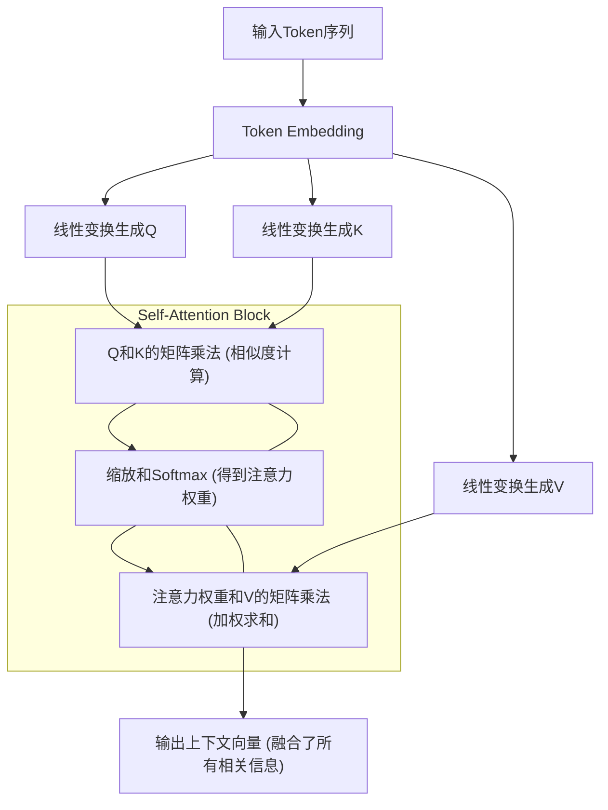
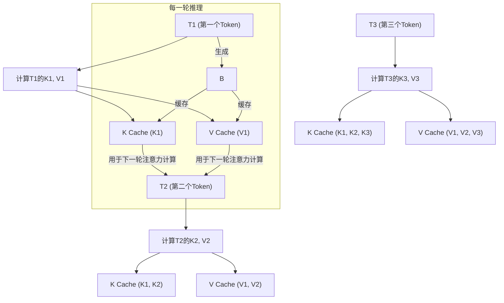
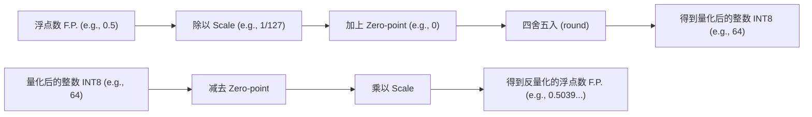
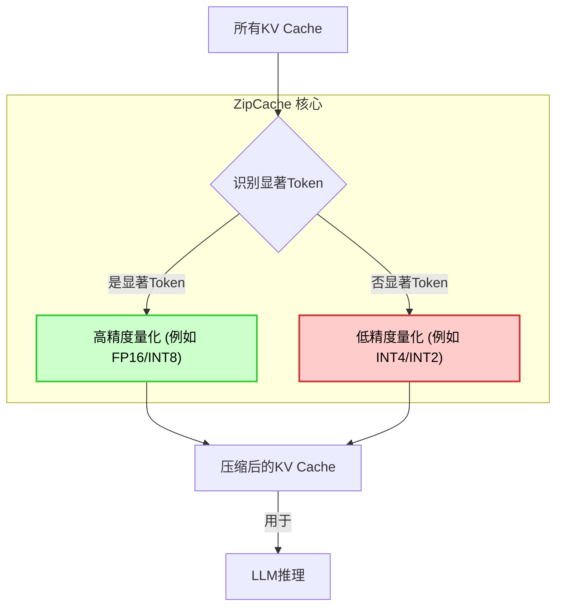
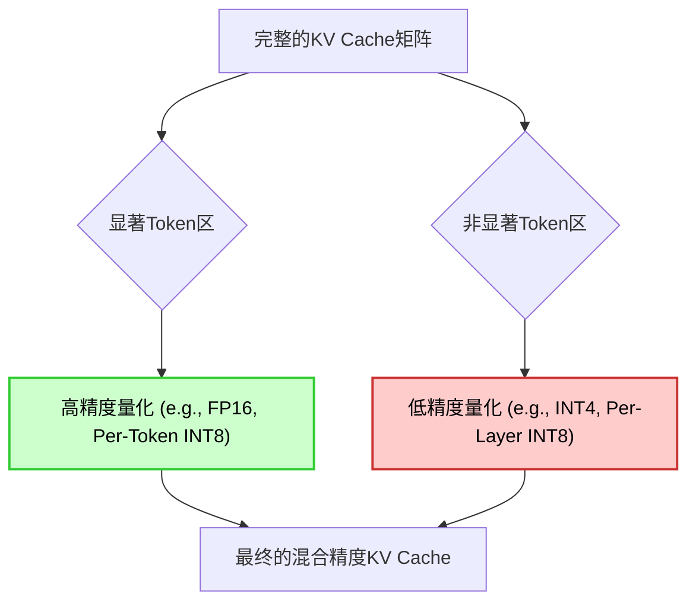

## AI论文解读 | ZipCache: Accurate and Efficient KV Cache Quantization with Salient Token Identification
    
### 作者    
digoal    
    
### 日期    
2025-05-30    
    
### 标签    
PostgreSQL , PolarDB , DuckDB , AI , 论文解读    
    
----    
    
## 背景   
  
https://arxiv.org/pdf/2405.14256    
    
提示:    
```    
读懂《ZipCache: Accurate and Efficient KV Cache Quantization with Salient Token Identification》这篇论文需要提前掌握哪些基础知识, 请使用中文给我讲一下这些基础知识, 尽量通熟易懂, 可以使用markdown支持的图形增加解释性.    
    
使用中文通熟易懂的解读《ZipCache: Accurate and Efficient KV Cache Quantization with Salient Token Identification》这篇论文, 关键内容请深入讲解, 可以使用markdown支持的图形增加解释性.    
    
使用中文提取《ZipCache: Accurate and Efficient KV Cache Quantization with Salient Token Identification》论文中一些重要的术语并详细解释, 可以使用markdown支持的图形示增加解释性.    
```    
    
## 1 前置知识   

要读懂《ZipCache: Accurate and Efficient KV Cache Quantization with Salient Token Identification》这篇论文，你需要提前掌握以下几个核心基础知识。这篇论文结合了**大语言模型推理优化**和**模型量化**两个热门领域，因此理解这两方面的基础是关键。

我会尽量用通俗易懂的方式讲解，并辅以概念性的图形帮助理解。

---

### 1. Transformer 架构与自注意力机制 (Self-Attention)

这是所有现代大语言模型（LLMs）的基石。理解它的工作原理是理解KV Cache的前提。

**核心概念：**

*   **Token (词元/标记):** 大语言模型处理文本的基本单位。一句话会被切分成若干个Token。例如，"Hello world!" 可能被分成 "Hello", " world", "!" 三个Token。
*   **Embedding (词嵌入):** Token 在模型中会被转换成一个向量（一串数字），这个向量就代表了这个Token的含义。语义相近的Token，其向量也会比较接近。
*   **自注意力机制 (Self-Attention):** 这是Transformer最核心的部分。它允许模型在处理一个Token时，能够“关注”到输入序列中的所有其他Token，并根据它们的重要性来加权。
    *   **Q (Query, 查询), K (Key, 键), V (Value, 值):** 这是自注意力机制中的三个核心概念。
        *   可以类比成：
            *   **Q (查询):** 你想知道什么？（比如你在图书馆找书，你的查询就是你想要的书名）
            *   **K (键):** 书架上的书有什么？（每本书都有一个“键”来描述它，比如书名、作者、ISBN号）
            *   **V (值):** 书架上的书本身。（书的内容，你真正想要的东西）
        *   在计算时，每个Token都会生成一个Q向量、一个K向量和一个V向量。
        *   **计算过程:**
            1.  用当前Token的Q向量，去和序列中所有Token的K向量进行匹配（通过点积运算）。点积的结果代表了当前Token对其他Token的“关注度”或“相似度”。
            2.  对这些关注度进行归一化（通常是Softmax），得到注意力权重。
            3.  用这些注意力权重去加权求和所有Token的V向量，得到当前Token的最终输出表示。这意味着模型在表示当前Token时，融合了它对其他Token的“关注”和“价值”。

**图示：Transformer 中的注意力机制简要流程**



### 2. KV Cache (键值缓存) 机制

理解了自注意力机制后，KV Cache就水到渠成了。它是为了加速大语言模型推理而引入的一种优化。

**核心概念：**

*   **大语言模型推理 (Inference):** 当你给LLM一个问题，它会逐个Token地生成答案。例如，你问"What is the capital of France?"，它可能先生成"The"，然后" capital"，再然后" of"，直到"Paris."。
*   **问题所在:** 每次生成一个新的Token时，模型都需要计算当前Token对**整个前面已经生成的序列**的注意力。这意味着，前面已经计算过的K和V向量，在生成下一个Token时，又需要重新计算一遍，这非常耗时且浪费资源。
*   **KV Cache 的解决方案:** 既然前面Token的K和V向量是固定且重复计算的，那就把它们**缓存**起来！
    *   每次生成新Token时，只需计算当前新Token的K和V向量，然后将它们**追加**到之前缓存的K和V矩阵中。
    *   这样，在计算注意力时，就可以直接使用缓存中的K和V，避免了重复计算，从而大大加速了推理过程。

**图示：KV Cache 的作用**



**ZipCache 关注的问题:** 随着上下文长度（Token数量）的增加，KV Cache会变得非常庞大，占用大量显存（GPU Memory）。这限制了LLM处理长文本的能力。ZipCache就是为了解决KV Cache过大，进行压缩。

### 3. 模型量化 (Model Quantization)

这是ZipCache用于压缩KV Cache的核心技术手段。简单来说，就是降低模型中数字的精度。

**核心概念：**

*   **精度 (Precision):** 计算机存储数字的精确程度。
    *   `FP32` (Float32, 单精度浮点数): 32位，最常用，范围和精度都高。
    *   `FP16` (Float16, 半精度浮点数): 16位，比FP32省一半空间，但精度略低。
    *   `INT8` (8位整数): 8位，只占FP32的1/4空间，计算速度更快，但精度损失最大。
*   **量化的目的:**
    1.  **减少内存占用:** 将原本需要32位或16位存储的数字，变成8位存储，大大节省显存。
    2.  **加速计算:** 低精度整数运算通常比浮点运算更快，更省电。
*   **量化的原理 (核心思想):**
    *   把一个浮点数范围映射到一个整数范围。
    *   通常会有一个`缩放因子 (Scale)` 和 `零点 (Zero-point)`。
        *   `量化值 = round(浮点值 / Scale + Zero-point)`
        *   `浮点值 = (量化值 - Zero-point) * Scale`
    *   **Scale (缩放因子):** 决定了浮点数范围被压缩的程度。
    *   **Zero-point (零点):** 浮点数中的0对应量化后的哪个整数。
*   **挑战:** 量化会导致信息丢失，可能影响模型性能（精度下降）。ZipCache的目标就是实现"Accurate"（准确的）量化。

**图示：简单的量化过程**

假设我们要将 `[-1.0, 1.0]` 范围的浮点数量化到 `[-128, 127]` 范围的 `INT8` 整数。



**ZipCache 量化的是 KV Cache 的值。** 这需要特别注意，因为KV Cache中的值在推理过程中非常活跃，它们的值分布可能非常动态。

### 4. 显著性 (Salience) / 重要性 (Importance) 概念

ZipCache 论文标题中的 "Salient Token Identification" 指的是识别出那些对模型输出**更重要、更有影响**的Token。

**核心概念：**

*   **为什么需要识别显著性？** 在量化时，如果所有Token的KV Cache都一视同仁地量化，那么精度损失是不可避免的。但如果能识别出哪些Token（或它们对应的K/V值）更重要，就可以对这些重要的部分进行更精细的量化（比如保留更高的精度），而对不重要的部分进行更粗糙的量化，从而在保证整体精度的前提下，实现更大的压缩比。
*   **如何识别显著性？**
    *   **注意力分数 (Attention Scores):** 这是最直接的。在自注意力机制中，Softmax后的注意力权重直接体现了当前Token对其他Token的关注程度。权重越高的Token，通常被认为是越“显著”的。
    *   **激活值或梯度的大小:** 在一些量化方法中，数值的**大小**（绝对值）常常被认为是其重要性的体现。数值越大，通常在计算中的影响也越大。
    *   ZipCache可能会结合注意力机制的特性来识别这些重要的Token。

### 5. 大语言模型 (LLMs) 的基本工作方式

虽然上面已经涉及了一些，但对LLM有一个整体的认识也很重要。

**核心概念：**

*   **自回归 (Autoregressive):** LLM通常以自回归的方式生成文本，即一次生成一个Token，然后将新生成的Token加入到输入序列中，作为生成下一个Token的依据。
*   **上下文窗口 (Context Window):** LLM在生成下一个Token时，会考虑前面一段固定长度的Token序列。这个长度就是上下文窗口。上下文窗口越大，模型能“记住”的信息越多，但KV Cache也会越大。
*   **推理 (Inference):** 模型根据输入（Prompt）生成输出的过程。

---

### 总结

《ZipCache: Accurate and Efficient KV Cache Quantization with Salient Token Identification》这篇论文，正是围绕以下核心问题展开的：

1.  **问题：** 大语言模型在生成长文本时，其**KV Cache**会占用巨大的GPU显存，限制了上下文长度和推理效率。
2.  **解决方案：** 对KV Cache进行**量化**，将其从高精度（如FP16）压缩到低精度（如INT8）。
3.  **挑战：** 简单的量化会大幅度降低模型性能（准确性）。
4.  **ZipCache的创新点：** 通过**识别出KV Cache中“显著”或“重要”的Token**，对这些重要部分采用更精细的量化策略，而对不重要的部分采用更激进的量化策略，从而在保证模型准确性的前提下，实现高效的KV Cache压缩。

希望这些基础知识的讲解能帮助你更好地理解ZipCache论文！祝你阅读顺利！

## 2 解读论文    

好的，我们来深入解读《ZipCache: Accurate and Efficient KV Cache Quantization with Salient Token Identification》这篇论文。在掌握了Transformer、KV Cache、模型量化和显著性概念之后，理解这篇论文就会变得水到渠成。

---

### 《ZipCache: Accurate and Efficient KV Cache Quantization with Salient Token Identification》论文解读

#### 1. 引言：KV Cache 的显存瓶颈与 ZipCache 的使命

当前大语言模型（LLMs）的强大能力令人惊叹，但其在推理（Inference）阶段的**显存（GPU Memory）消耗**是一个巨大的瓶颈。其中，**KV Cache** 是主要的显存“大户”。

*   **问题：** 随着用户输入（Prompt）和模型生成内容（Response）的增长，Transformer模型中用于自注意力计算的Key (K) 和 Value (V) 向量被不断地缓存起来。这些KV Cache的尺寸与上下文长度（Tokens数量）成正比，上下文越长，KV Cache越大。当上下文长度达到数万甚至数十万Token时，KV Cache可以轻松占据几十GB甚至上百GB的显存，这使得在消费级GPU上运行长上下文LLM变得非常困难，即使是数据中心级的GPU也面临巨大压力。
*   **解决方案：** 最直接的想法就是对KV Cache进行**量化（Quantization）**，也就是降低其数值的存储精度（比如从FP16降到INT8或INT4），以减少显存占用。
*   **挑战：** 简单的、粗暴的量化会导致模型性能（如生成文本的质量、准确性）急剧下降。因为KV Cache中的数值对于注意力计算至关重要，哪怕是微小的量化误差也可能被层层放大，最终影响模型输出。
*   **ZipCache的使命：** 解决上述挑战，实现 **“既要...又要...”** ：既要大幅度压缩KV Cache，又要保持模型的准确性和性能。它提出的核心思想是：**并非所有的KV Cache数值都同样重要！**

#### 2. 核心思想：显著性与混合精度量化

ZipCache的核心洞察是：在Transformer模型的自注意力机制中，某些Token（以及它们对应的K/V值）对模型生成下一个Token的**影响更大、更关键**，我们称之为 **“显著Token”**。而另一些Token则相对不那么重要。

既然如此，我们就可以采取**差异化的量化策略**：

*   **对“显著Token”的KV Cache：** 采用**高精度**（如FP16或更精细的INT8量化），以保留关键信息，避免精度损失。
*   **对“非显著Token”的KV Cache：** 采用**低精度**（如粗糙的INT8、INT4甚至INT2量化），以最大化压缩比。

这种根据重要性动态调整量化精度的策略，就是 **“显著感知（Salient-Aware）的混合精度量化”**。

**图示：ZipCache的核心思想**



#### 3. 关键技术深入讲解

ZipCache的创新之处在于如何有效地识别“显著Token”以及如何动态地应用混合精度量化。

##### 3.1 显著Token识别 (Salient Token Identification, STI)

论文提出了两种主要方法来识别显著Token，这两种方法是从不同角度来衡量Token的重要性。

*   **方法一：基于注意力分数的显著性 (Attention Score-based Salience)**
    *   **原理：** 在Transformer的自注意力机制中，注意力权重（Attention Scores）直接反映了当前查询Token对过去所有键Token的关注程度。如果一个Token（作为Key）在生成后续Token时，经常被赋予较高的注意力权重，那么它对模型预测下一个Token是至关重要的。
    *   **实现细节：**
        1.  **逐头统计：** Transformer有多个注意力头（Multi-Head Attention），每个头可能关注不同的信息。ZipCache对每个注意力头单独统计Token的注意力贡献。
        2.  **累积/平均注意力权重：** 在生成每个新Token时，模型会计算其对前面所有Token的注意力权重。ZipCache会跟踪并累积或平均这些权重。
        3.  **动态阈值/排序：** 不可能缓存所有Token都用高精度。因此，需要设置一个动态的阈值或者选择注意力权重排名前K%的Token作为显著Token。这个阈值/K值可以根据显存预算进行调整。
        4.  **动态更新：** 随着上下文的增长，之前重要的Token可能变得不那么重要，新的Token可能变得重要。因此，显著Token的集合是动态变化的，需要每隔一定步长或在每个生成步进行重新评估。
    *   **优势：** 直接反映了模型在语义层面对Token的依赖关系，符合Transformer的工作原理。
    *   **局限性：** 统计注意力分数本身会带来一些计算开销。

    **图示：基于注意力分数的显著性识别**

    ```mermaid
    graph TD
        A[生成Token t] --> B["计算Attention Weights (t对t-1, t-2...)"]
        B --> C{哪些Attention Weight高?}
        C -- 高权重Token --> D[标记为显著Token]
        C -- 低权重Token --> E[标记为非显著Token]
        D & E --> F[KV Cache分区]
        style D fill:#aaddaa,stroke:#008800,stroke-width:2px,color:#000
        style E fill:#ddaaaa,stroke:#880000,stroke-width:2px,color:#000
    ```

*   **方法二：基于值范围的显著性 (Value Range-based Salience)**
    *   **原理：** 量化操作本质上是将一个浮点数范围映射到一个整数范围。如果浮点数（K/V值）的分布范围很广（即最大值和最小值之差很大），或者存在很多离群值（outliers），那么将其压缩到低精度整数时，精度损失会非常大。那些值分布范围广或有离群值的Token，其对应的K/V值更“难”被有效量化，因此被认为是“显著”的，需要更高精度。
    *   **实现细节：**
        1.  **统计K/V值的分布：** 对于每个Token生成的K/V向量，分析其内部数值的分布情况，如最大值、最小值、均值、标准差等。
        2.  **离群值检测：** 通常通过设置百分位数阈值（如99.5%或99.9%）来识别那些数值非常大或非常小的K/V元素。如果一个Token的K/V向量中包含很多这样的离群值，则该Token被认为是显著的。
        3.  **动态评估：** 同样，这也需要动态评估，因为不同Token的K/V值分布可能随时间变化。
    *   **优势：** 这种方法从数值稳定性角度考虑量化，可以有效避免量化误差对模型性能的破坏性影响。
    *   **局限性：** 不直接反映语义重要性，可能将一些语义上不那么重要的Token也标记为显著。

    **图示：基于值范围的显著性识别**

    ```mermaid
    graph TD
        A[Token的K/V向量] --> B["分析K/V值的分布 (Min/Max/Outliers)"]
        B --> C{值范围是否宽广或有离群值?}
        C -- 是 --> D["标记为显著Token (难量化)"]
        C -- 否 --> E["标记为非显著Token (易量化)"]
        D & E --> F[KV Cache分区]
        style D fill:#aaddaa,stroke:#008800,stroke-width:2px,color:#000
        style E fill:#ddaaaa,stroke:#880000,stroke-width:2px,color:#000
    ```

*   **ZipCache 通常会结合两种或更多的方法来更全面地识别显著Token。**

##### 3.2 混合精度量化 (Mixed-Precision Quantization)

在识别出显著Token和非显著Token后，ZipCache会根据这些标记，对KV Cache应用不同的量化策略。

*   **高精度区域：** 对应显著Token的K/V值。
    *   通常保留为`FP16`，或者采用**每通道/每Token**的`INT8`量化。
    *   **每通道/每Token量化：** 这意味着每个K或V向量（或甚至每个Token的每个注意力头输出的K/V向量）都拥有独立的`Scale`（缩放因子）和`Zero-point`（零点）。这样可以更精确地捕捉每个向量内部的数值分布，最大程度地减少量化误差。虽然是INT8，但精度很高。
*   **低精度区域：** 对应非显著Token的K/V值。
    *   可以采用更激进的量化，如`INT4`甚至`INT2`。
    *   通常采用**每层/每组**的量化策略。这意味着同一层所有K/V值共享一套`Scale`和`Zero-point`，或者一大批Token共享一套。这种粗粒度量化虽然压缩比高，但精度损失大。

**图示：混合精度KV Cache**



##### 3.3 动态量化策略 (Dynamic Quantization Strategy)

这不仅仅是识别显著Token，更重要的是如何**动态管理**这个过程。

*   **挑战：** 随着对话的进行，用户输入和模型生成的内容不断增加，上下文窗口中的Token在重要性上会不断变化。一个Token可能在生成当前Token时很重要，但在生成下一个Token时可能就不那么重要了。
*   **ZipCache的动态性：**
    1.  **实时评估：** 在LLM推理过程中，ZipCache会在每个（或每N个）生成步骤后，重新评估当前上下文中的Token显著性。
    2.  **缓存更新：** 重新评估后，KV Cache中相应Token的量化精度会动态地调整。例如，一个之前被标记为“非显著”的Token，如果其注意力贡献突然变大，它可能被提升为“显著”，并重新以高精度存储。反之亦然。
    3.  **内存管理：** 这种动态性也意味着更复杂的内存管理，需要灵活地分配和回收不同精度的存储空间。

这种动态调整是ZipCache“Accurate”的关键，因为它确保了关键信息始终以足够的精度存储，即使在不断变化的上下文中也是如此。

#### 4. 实验结果与贡献

ZipCache在各种主流LLM（如Llama, Vicuna等）和数据集上进行了验证，其实验结果通常展示了：

*   **显著的显存节省：** 例如，在保持模型性能不变的前提下，可以实现2-4倍的KV Cache压缩。这意味着可以支持更长的上下文长度，或者在更小的GPU上运行模型。
*   **保持模型性能（准确性）：** 相较于其他粗暴的KV Cache量化方法，ZipCache能够保持LLM的困惑度（Perplexity）、生成质量、对话流畅性等关键指标几乎不受影响。
*   **推理速度提升：** 尽管显著性识别和混合精度管理会引入一些开销，但由于KV Cache显存访问量的减少（I/O减少）和低精度计算的加速，整体推理速度通常也能得到提升。

**论文的主要贡献可以概括为：**

1.  **首次提出并验证了KV Cache中Token显著性的概念**，并证明了其对量化准确性的重要性。
2.  **设计并实现了两种有效的显著Token识别方法**（基于注意力分数和基于值范围），可以灵活结合。
3.  **开发了基于显著性的动态混合精度KV Cache量化框架**，在压缩比和准确性之间取得了优异的平衡。
4.  **为LLM的长上下文推理提供了切实可行的显存优化方案**，推动了LLM在资源受限环境下的应用。

#### 5. 潜在影响与未来展望

ZipCache这类研究对于LLM的实际应用具有深远影响：

*   **更长的上下文窗口：** 用户可以与LLM进行更长时间的对话，输入更长的文档进行处理，而不用担心显存溢出。
*   **更低的部署成本：** 能够使用更便宜、显存更小的GPU来部署大型LLM，降低了AI服务的门槛和运营成本。
*   **更快的推理速度：** 节省显存意味着更少的数据传输，通常也能带来推理速度的提升。
*   **边缘设备部署潜力：** 为未来在移动设备、嵌入式系统等边缘设备上部署更大型的LLM提供了可能。

ZipCache的成功，为未来的KV Cache优化指明了方向，即不再是简单的统一量化，而是更加智能、动态、感知信息重要性的量化策略。

---

希望这个深入的解读能帮助你透彻理解《ZipCache》这篇论文！

## 3 术语   

好的，我们来提取并详细解释《ZipCache: Accurate and Efficient KV Cache Quantization with Salient Token Identification》论文中的一些关键术语。这些术语是理解ZipCache创新之处的核心。

---

### 《ZipCache: Accurate and Efficient KV Cache Quantization with Salient Token Identification》重要术语解释

#### 1. KV Cache 显存瓶颈 (KV Cache Memory Bottleneck)

*   **解释：** 这是ZipCache论文旨在解决的**核心问题**。在大语言模型（LLM）的推理过程中，为了避免重复计算已经处理过的Token的自注意力（Self-Attention）中的Key (K) 和 Value (V) 向量，这些K和V向量会被缓存起来。随着上下文长度（即对话或文本的Token数量）的增加，这个KV Cache会变得非常庞大，从而占用大量的GPU显存（GPU Memory）。这限制了LLM能够处理的最长上下文，也是部署大型LLM的主要障碍之一。

*   **重要性：** ZipCache 正是为了缓解甚至消除这个瓶颈而诞生的。它的所有技术都是围绕如何有效地压缩KV Cache展开的。

*   **图示：显存瓶颈**
    ```mermaid
    graph TD
        A[LLM 输入/输出 Token 数量增加] --> B[KV Cache 尺寸线性增长]
        B --> C[占用大量 GPU 显存]
        C --> D{限制 LLM 支持的上下文长度}
        C --> E{限制 LLM 部署的 GPU 规模}
        D & E --> F[性能瓶颈]
    ```

#### 2. 显著Token (Salient Token)

*   **解释：** 这是ZipCache论文中提出的一个**核心概念**。它指的是在KV Cache中，那些对LLM生成下一个Token**影响更大、更关键、更不容有失精度**的Token（以及它们对应的K/V值）。相对应地，那些影响较小、不那么关键的Token被称为“非显著Token”。

*   **重要性：** ZipCache的核心思想是，并非所有KV Cache中的信息都同样重要。通过识别这些显著Token，ZipCache可以对它们采用更高的量化精度（以保留信息），而对非显著Token采用更低的量化精度（以实现高压缩比），从而在保持模型性能的同时，大幅压缩KV Cache。

*   **图示：显著Token与非显著Token**
    ```mermaid
    graph TD
        A[KV Cache 中的所有 Token]
        A --> B{Token的重要性如何?}
        B -- 高重要性 --> C["显著 Token (Salient Token)"]
        B -- 低重要性 --> D["非显著 Token (Non-Salient Token)"]
        style C fill:#ccffcc,stroke:#33cc33,stroke-width:2px,color:#000
        style D fill:#ffcccc,stroke:#cc3333,stroke-width:2px,color:#000
    ```

#### 3. 显著Token识别 (Salient Token Identification, STI)

*   **解释：** 这是ZipCache**最核心的技术创新之一**。它是指论文中提出的，用于在推理过程中动态识别出KV Cache中“显著Token”的方法和过程。论文提出了两种主要的STI方法：
    *   **基于注意力分数的显著性 (Attention Score-based Salience):** 通过追踪和累积每个Token在自注意力计算中获得的注意力权重来判断其重要性。如果一个Token经常被其他Token高度关注，那它就是显著的。
    *   **基于值范围的显著性 (Value Range-based Salience):** 通过分析KV Cache中K/V数值的分布范围，特别是识别是否存在大量“离群值”（Outliers）。如果一个Token的K/V值分布非常宽广或含有大量离群值，表明它在量化时更容易丢失信息，因此被认为是显著的。

*   **重要性：** STI是实现“准确（Accurate）”量化的关键。它决定了哪些K/V值应该被高精度保存，哪些可以被激进压缩。没有有效的STI，混合精度量化就无从谈起，或者效果会大打折扣。

*   **图示：显著Token识别过程**
    ```mermaid
    graph TD
        A[KV Cache 中的 Token t] --> B1[方法1: 分析 Attention Score]
        A --> B2[方法2: 分析 K/V Value Range]
        B1 --> C1{注意力权重高?}
        B2 --> C2{值分布范围宽/有离群值?}
        C1 -- 是 --> D[标记 Token t 为 显著Token]
        C2 -- 是 --> D
        C1 -- 否 --> E[标记 Token t 为 非显著Token]
        C2 -- 否 --> E

    %% 样式定义
    style D fill:#ccffcc,stroke:#009900
    style E fill:#ffcccc,stroke:#cc0000
    style B1,B2 fill:#e6f3ff,stroke:#0066cc    
    ```

#### 4. 混合精度量化 (Mixed-Precision Quantization)

*   **解释：** 这是一种量化策略，它根据数据的重要性或敏感性，对不同部分的数据采用**不同精度**的量化方式。在ZipCache中，它特指对KV Cache中不同Token（根据其显著性）采取不同精度的量化：
    *   **显著Token的KV Cache：** 采用**高精度量化**，如保留FP16格式，或进行更精细的INT8量化（例如，**每Token/每通道量化**）。
    *   **非显著Token的KV Cache：** 采用**低精度量化**，如INT4或INT2，通常采用更粗粒度的量化方式（例如，**每层/每组量化**）。

*   **重要性：** 这是实现“高效（Efficient）”压缩同时保持“准确（Accurate）”性能的核心手段。通过避免对所有数据进行统一的低精度量化可能导致的灾难性性能下降，同时又最大化了整体压缩比。

*   **图示：混合精度量化**
    ```mermaid
    graph TD
        A[已识别的显著 Token KV Cache] --> B["高精度量化 (FP16 或 精细 INT8)"]
        C[已识别的非显著 Token KV Cache] --> D["低精度量化 (INT4 或 INT2)"]
        B & D --> E[混合精度 KV Cache]
        style B fill:#ccffcc,stroke:#33cc33,stroke-width:2px,color:#000
        style D fill:#ffcccc,stroke:#cc3333,stroke-width:2px,color:#000
    ```

#### 5. 动态量化策略 / 自适应量化 (Dynamic/Adaptive Quantization Strategy)

*   **解释：** 指的是量化参数或量化精度不是预先固定不变的，而是在模型推理过程中**实时地、根据上下文的变化而动态调整**。对于ZipCache而言，这意味着：
    1.  显著Token的识别是持续进行的，随着新Token的生成和上下文的推移，Token的重要性可能会发生变化。
    2.  KV Cache中Token的量化精度也会根据其最新的显著性评估结果进行动态更新。一个之前非显著的Token可能因为变得重要而被提升为高精度存储，反之亦然。

*   **重要性：** LLM的推理过程是自回归的，上下文是不断变化的。动态调整量化策略能够确保模型在不断变化的输入中始终保持对关键信息的足够精度，是保证长上下文推理性能不下降的关键。

*   **图示：动态量化策略**
    ```mermaid
    graph TD
        A[时间 t: 上下文 C_t] --> B["识别显著 Token (C_t)"]
        B --> C["应用混合精度量化 (C_t)"]
        C --> D[生成新 Token t+1]

        D --> E["时间 t+1: 上下文 C_{t+1} (包含新 Token t+1)"]
        E --> F["重新识别显著 Token (C_{t+1})"]
        F --> G["重新应用混合精度量化 (C_{t+1})"]
        G --> H[生成新 Token t+2]

        A --> D
        E --> H

        subgraph 动态循环
            A
            D
            E
            H
        end
    ```

#### 6. 每Token/每通道量化 (Per-Token/Per-Channel Quantization)

*   **解释：** 这是一种**细粒度（Fine-grained）**的量化方法。当进行量化时，不再是整个矩阵或整个层共享一个量化参数（缩放因子和零点），而是为KV Cache中的**每一个Token**（或更细致地，每个Token的K/V向量中的**每个通道/维度**）都单独计算和应用一套缩放因子(Scale)和零点(Zero-point)。

*   **重要性：** 这种细粒度量化能够更精确地捕捉到每个Token或每个维度内部数值的真实分布，从而最大程度地减少量化误差。在ZipCache中，它主要用于对**显著Token**的KV Cache进行高精度量化，尽管它们最终可能被存储为INT8，但其反量化后的精度接近原始FP16。

*   **图示：每Token量化**
    ```mermaid
    graph TD
        A["KV Cache Token 1 (K1, V1)"] --> B1[为 K1 计算 Scale1, ZeroPoint1]
        A --> B2[为 V1 计算 Scale2, ZeroPoint2]
        B1 & B2 --> C1[量化 K1, V1]

        D["KV Cache Token 2 (K2, V2)"] --> E1[为 K2 计算 Scale3, ZeroPoint3]
        D --> E2[为 V2 计算 Scale4, ZeroPoint4]
        E1 & E2 --> C2[量化 K2, V2]

        C1 & C2 --> F[高精度 KV Cache]
        style C1 fill:#ccffcc,stroke:#33cc33,stroke-width:2px,color:#000
        style C2 fill:#ccffcc,stroke:#33cc33,stroke-width:2px,color:#000
    ```
    （注：此处 K1, V1, K2, V2 各自代表一个Token的Key/Value向量，每个向量内部通常会有多个通道/维度，量化可以细到通道级别。）

---

理解这些术语，你就把握住了ZipCache论文的核心思想、实现机制以及它所解决的问题。
   
## 参考    
    
https://arxiv.org/pdf/2405.14256    
    
    
<b> 以上内容基于DeepSeek、QwQ及诸多AI生成, 轻微人工调整, 感谢杭州深度求索人工智能、阿里云等公司. </b>    
    
<b> AI 生成的内容请自行辨别正确性, 当然也多了些许踩坑的乐趣, 毕竟冒险是每个男人的天性.  </b>    
    
  
#### [期望 PostgreSQL|开源PolarDB 增加什么功能?](https://github.com/digoal/blog/issues/76 "269ac3d1c492e938c0191101c7238216")
  
  
#### [PolarDB 开源数据库](https://openpolardb.com/home "57258f76c37864c6e6d23383d05714ea")
  
  
#### [PolarDB 学习图谱](https://www.aliyun.com/database/openpolardb/activity "8642f60e04ed0c814bf9cb9677976bd4")
  
  
#### [PostgreSQL 解决方案集合](../201706/20170601_02.md "40cff096e9ed7122c512b35d8561d9c8")
  
  
#### [德哥 / digoal's Github - 公益是一辈子的事.](https://github.com/digoal/blog/blob/master/README.md "22709685feb7cab07d30f30387f0a9ae")
  
  
#### [About 德哥](https://github.com/digoal/blog/blob/master/me/readme.md "a37735981e7704886ffd590565582dd0")
  
  

  
