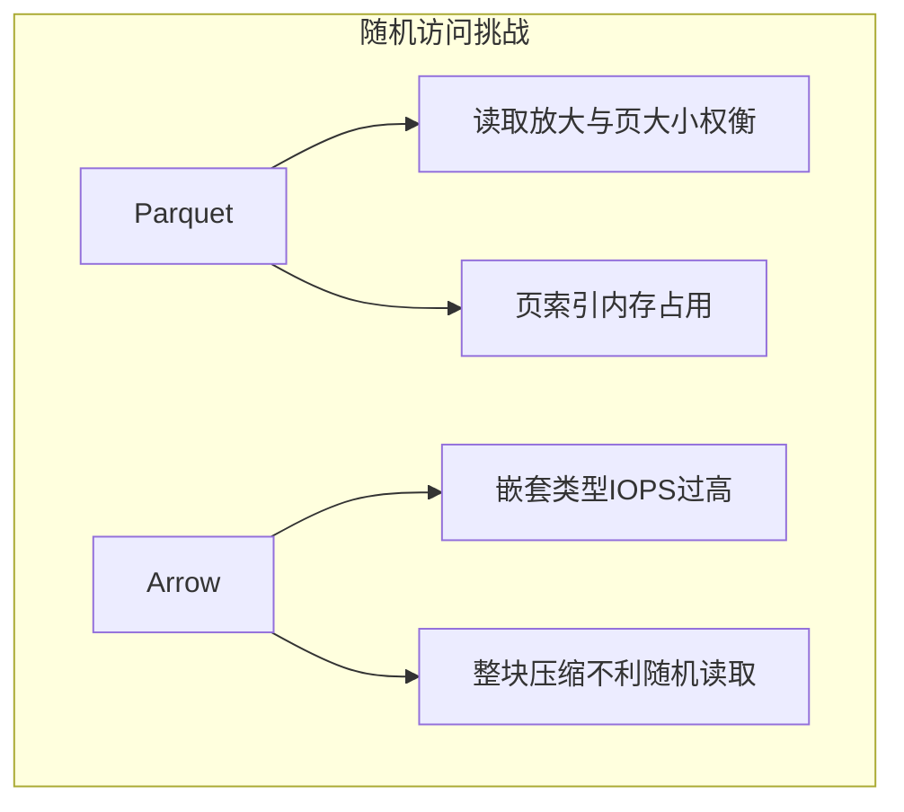
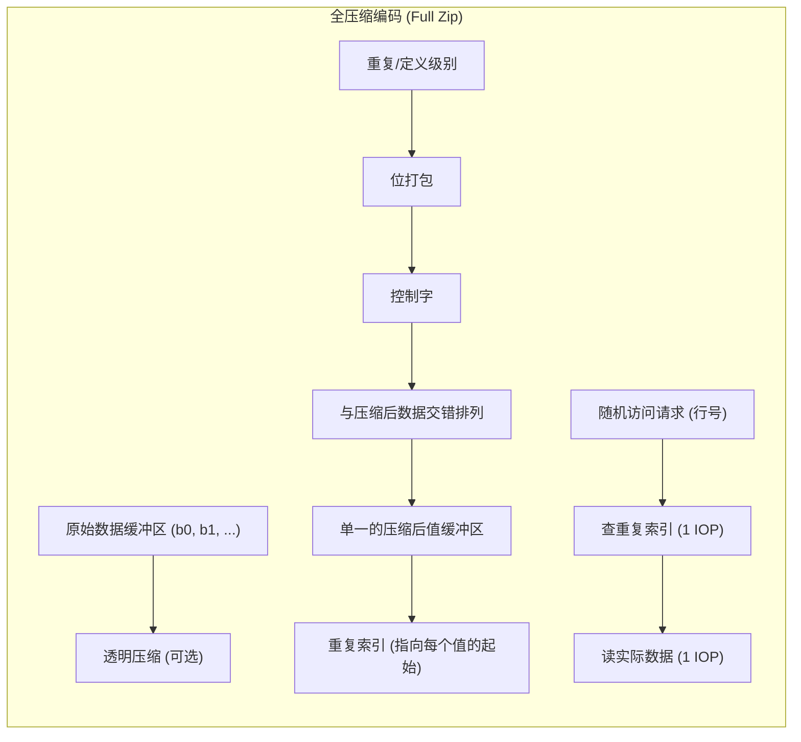
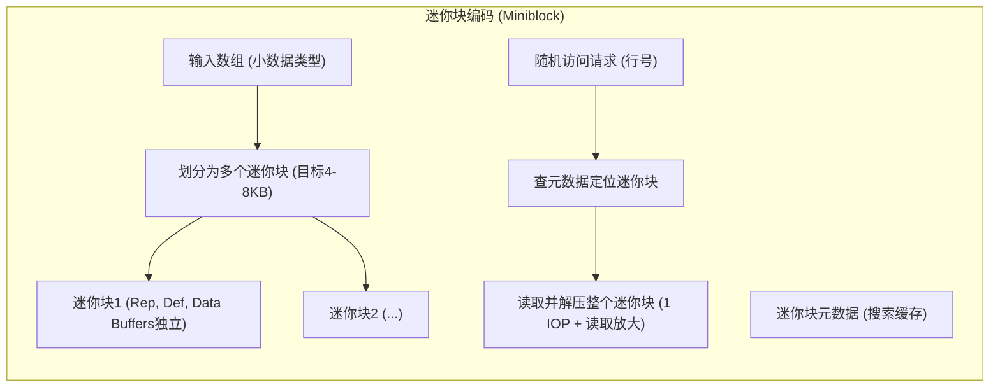
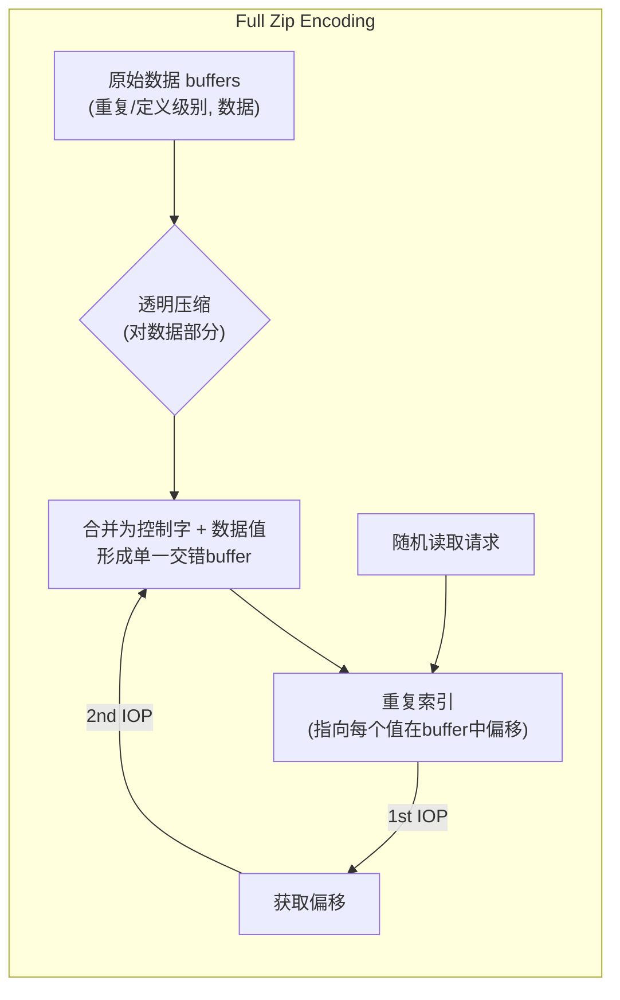
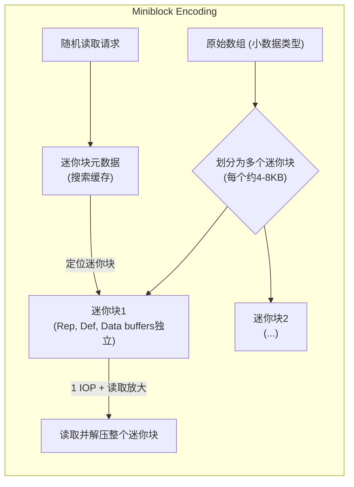

## AI论文解读 | Lance: Efficient Random Access in Columnar Storage through Adaptive Structural Encodings  
      
### 作者      
digoal      
      
### 日期      
2025-05-31      
      
### 标签      
PostgreSQL , PolarDB , DuckDB , AI , 论文解读      
      
----      
      
## 背景     
    
https://arxiv.org/pdf/2504.15247v1      
      
提示:      
```      
读懂《Lance: Efficient Random Access in Columnar Storage through Adaptive Structural Encodings》这篇论文需要提前掌握哪些基础知识, 请使用中文给我讲一下这些基础知识, 尽量通熟易懂, 可以使用markdown支持的图形增加解释性.      
      
使用中文通熟易懂的解读《Lance: Efficient Random Access in Columnar Storage through Adaptive Structural Encodings》这篇论文, 关键内容请深入讲解, 可以使用markdown支持的图形增加解释性.      
      
使用中文提取《Lance: Efficient Random Access in Columnar Storage through Adaptive Structural Encodings》论文中一些重要的术语并详细解释, 可以使用markdown支持的图形示增加解释性.      
```      
      
## 1 前置知识   

好的，这篇论文《Lance: Efficient Random Access in Columnar Storage through Adaptive Structural Encodings》主要探讨了如何在列式存储中通过自适应结构编码实现高效的随机访问。要更好地理解这篇论文，你需要了解以下一些基础知识：

## 核心数据存储概念

1.  **行式存储 (Row-based Storage) vs. 列式存储 (Columnar Storage)**
    * **行式存储**：数据是按行存储的，一行中的所有字段都连续存放在一起。这就像我们平时用的Excel表格，一行一行地记录。
        * *优点*：当需要访问整行数据时（比如查询某个用户的所有信息），效率很高。
        * *缺点*：当只需要访问少数几列数据时（比如统计所有用户的年龄），需要读取很多不必要的数据。
    * **列式存储**：数据是按列存储的，一列中的所有数据都连续存放在一起。
        * *优点*：当只需要分析少数几列数据时，效率极高，因为只需要读取相关的列。   同时，同一列的数据类型相同，更容易压缩。
        * *缺点*：当需要访问整行数据时，可能需要从多个地方读取数据，效率较低。
    * *论文关注点*：论文主要讨论的是**列式存储**，以及如何优化它在随机访问场景下的性能。  

    ```mermaid
    graph LR
        subgraph "行式存储 (Row-Oriented)"
            R1C1 --> R1C2 --> R1C3
            R2C1 --> R2C2 --> R2C3
            R3C1 --> R3C2 --> R3C3
        end
        subgraph "列式存储 (Column-Oriented)"
            R1c1 --> R2c1 --> R3c1
            R1c2 --> R2c2 --> R3c2
            R1c3 --> R2c3 --> R3c3
        end
    ```

2.  **随机访问 (Random Access) vs. 顺序访问/全扫描 (Sequential Access/Full Scan)**
    * **顺序访问/全扫描**：从头到尾读取数据，比如计算某一列的总和。列式存储天然适合这种场景。  
    * **随机访问**：直接跳到数据的特定位置进行读写，比如查询第1000行某个字段的值，或者根据索引查找不连续的多行数据。   这是列式存储 historically (历史上) 的弱项。  
    * *论文关注点*：如何提升列式存储在**随机访问**上的性能，同时不显著牺牲全扫描性能。  

3.  **存储介质特性**
    * **NVMe (Non-Volatile Memory Express) SSD**：一种高速固态硬盘接口。它的特点是高IOPS（每秒输入输出操作次数）和低延迟，尤其擅长处理小块数据的随机读写。   论文中很多实验是基于NVMe的。
    * **云存储 (Cloud Storage, 如 AWS S3)**：通常具有高带宽（适合大文件顺序读写），但IOPS相对较低，随机访问小文件延迟较高。  
    * **内存 (RAM)**：速度最快，但成本也最高。  
    * *论文关注点*：充分利用**NVMe**的随机读写能力，并探讨云存储背景下的缓存方案。  

4.  **IOPS (Input/Output Operations Per Second) 和 带宽 (Bandwidth)**
    * **IOPS**：衡量存储设备每秒可以处理多少次独立的读或写请求。对于随机访问小数据块，IOPS是关键性能指标。  
    * **带宽**：衡量存储设备每秒可以传输多少数据量 (例如 GiB/s)。对于顺序读取大数据块，带宽是关键。  
    * *论文关注点*：随机访问受限于IOPS，而NVMe提供了高IOPS的潜力。  

## 文件格式与数据组织

5.  **Apache Parquet 和 Apache Arrow**
    * **Apache Parquet**：一种流行的列式存储文件格式，广泛应用于大数据生态系统 (如Hadoop, Spark)。它支持高效的压缩和编码方案。   论文中多次将其作为对比基准。
    * **Apache Arrow**：一个跨语言的开发平台，用于内存中的列式数据处理。它定义了一种标准的内存列式数据表示，也包含一种IPC (Inter-process Communication) 文件格式。  
    * *论文关注点*：分析这些现有格式在随机访问上的优缺点，并引出Lance格式的设计。  

6.  **文件内部结构 (以Parquet为例)**
    * **Row Group (行组)**：文件内数据的一个水平分区，包含一部分行的数据。  
    * **Column Chunk (列块)**：在一个行组内，属于某一列的数据。  
    * **Page (页)**：列块内部进一步划分的单元，通常是压缩和编码的基本单位。   Parquet的Page Offset Index (页偏移索引) 对随机访问很重要。  
    * *论文关注点*：这些结构如何影响随机访问时的I/O次数和读取放大。例如，页面大小会直接影响随机读取一个值时需要加载的数据量。  

7.  **嵌套数据类型 (Nested Data Types)**
    * 例如 `List<String>` (字符串列表) 或 `Struct<name: String, age: Int>` (结构体)。在列式存储中，这些复杂类型需要被“打平”(flattened) 或“切碎”(shredded) 成更简单的原始列进行存储。  
    * **Repetition Levels (重复级别) 和 Definition Levels (定义级别)**：这是Dremel论文中提出的技术 (Parquet也使用)，用于在打平嵌套结构后，能够恢复出原始的嵌套关系和null值信息。  
    * *论文关注点*：嵌套结构的处理方式是影响随机访问性能的关键因素之一，因为它可能导致需要读取多个分离的缓冲区才能重建一个嵌套值。  

## 数据处理与优化技术

8.  **压缩 (Compression)**
    * **目的**：减少存储空间，降低I/O开销（传输更少的数据）。
    * **类型**：
        * **透明编码 (Transparent encodings)**：压缩后的值之间没有依赖，可以独立解压单个值（如果知道其位置和长度）。例如位打包 (bit packing)、FSST。  
        * **不透明编码 (Opaque encodings)**：值之间有依赖，解压单个值可能需要解压周围的一块数据。例如Snappy、LZ4 (当应用于整个块时)、delta编码。  
        * **稀疏压缩 (Sparse compression)**：移除null值进行存储。  
        * **密集压缩 (Dense compression)**：用占位符填充null值。  
    * *论文关注点*：压缩方式与随机访问性能的权衡。不透明压缩或需要大块解压的压缩不利于随机访问。Lance试图在保持压缩率的同时，优化随机访问。

9.  **编码 (Encoding)**
    * **结构编码 (Structural Encoding)**：论文提出的核心概念之一。指将一个（可能嵌套的）数组转换为一个或多个叶节点（包含原始数组/缓冲区）的过程，有时也叫“shredding”。   这是列式编码的第一步。
    * **压缩编码 (Compressive Encoding)**：对结构编码产生的叶数组/缓冲区进行压缩。  
    * *论文关注点*：**结构编码**是解锁磁盘随机访问性能的关键。   不同的结构编码方式会产生不同数量的磁盘缓冲区，并影响读取放大。

10. **读取放大 (Read Amplification)**
    * 指为了获取少量目标数据而不得不从磁盘读取更多数据的现象。例如，只需要一个8字节的值，但由于页面大小是8KB，所以必须读取整个8KB的页面。  
    * *论文关注点*：设计编码方案以最小化读取放大，从而提高随机访问效率。

11. **缓存 (Caching)**
    * 将频繁访问的数据或元数据存储在更快的存储层（如内存或NVMe）。  
    * **Search Cache (搜索缓存)**：论文中特指在文件打开或首次搜索时读入内存并缓存的一小部分辅助数据（如页索引）。   其I/O成本可以被多次搜索分摊。  
    * *论文关注点*：评估不同格式和编码方案对搜索缓存大小的需求。

12. **元数据 (Metadata)**
    * 描述数据的数据。在文件格式中，元数据包括schema信息、列的统计信息（最大/最小值）、各个数据块在文件中的偏移量和长度、压缩类型等。这些对高效解析和查询数据至关重要。

## 评估标准

13. **性能评估指标**
    * 对于随机访问：主要关注**IOPS数量**和**读取放大**。  
    * 对于全扫描：主要关注**压缩率**和**总读取数据量** (吞吐率)。  
    * CPU开销：解压缩、解码数据所需的计算资源。  

理解了这些基本概念后，你就能更容易地跟上论文中关于不同列式格式（Parquet, Arrow, Lance 及其不同版本）的结构编码策略、它们如何影响IOPS、读取放大、CPU使用率，以及最终如何在NVMe这类现代硬件上实现高效随机访问的讨论了。论文的核心贡献在于提出了一种新的、自适应的结构编码方案（Lance），以期在各种场景下都能取得较好的平衡。
  
## 2 解读论文      

好的，我们来深入解读一下《Lance：通过自适应结构编码实现列式存储中的高效随机访问》这篇论文。

这篇论文主要解决的核心问题是：**如何在列式存储格式中实现高效的随机数据访问，同时又不显著牺牲全盘扫描的性能，尤其是在现代NVMe固态硬盘上。**  

传统上，列式存储非常擅长数据分析类的全盘扫描任务（比如计算某一列的总和），但在需要随机读取少量、不连续数据的场景（比如根据ID检索几条记录的特定字段）时性能不佳  。随着人工智能和机器学习应用的兴起，对这两种访问模式的需求都在增长  。而NVMe硬盘凭借其高IOPS（每秒输入输出操作次数）和低延迟的特性，为提升随机访问性能提供了硬件基础  。然而，现有的列式存储库（如Apache Parquet、Apache Arrow）在充分利用NVMe能力方面，尤其是在随机访问上，仍有不足  。

论文作者认为，解决这个问题的关键在于**列结构的有效编码，特别是重复和有效性信息的编码**  。

---
## 现有列式格式的挑战与机遇

论文首先分析了流行的列式格式（主要是Parquet和Arrow）在NVMe存储上的表现。

### Apache Parquet

* **优点**：
    * 通过将数据划分为**行组（Row Group）**、**列块（Column Chunk）** 和 **页（Page）** 进行组织  。
    * Page内部可以包含数据、重复级别（repetition levels）和定义级别（definition levels）  。这些级别信息对于高效表示嵌套数据和空值至关重要  。
    * 当配置得当，特别是利用 **页偏移索引（page offset index）** 时，Parquet的随机访问性能可以得到极大提升（论文提到比默认设置好60倍以上）  。页偏移索引可以快速定位到包含目标行的页。

* **挑战**：
    * **读取放大（Read Amplification）**：随机访问时，即使只需要页内的一小部分数据，也需要读取整个页  。虽然可以通过减小页大小来缓解，但这又可能影响压缩效率和扫描性能  。
    * **搜索缓存大小**：对于包含很多小页的大型数据集，页偏移索引本身可能会占用大量内存  。例如，对于每行一个页的大数据类型（如向量），每十亿行可能需要20GB的搜索缓存  。
    * **CPU开销**：Parquet的压缩和解码（尤其是一些不透明压缩算法）可能会带来较高的CPU开销，难以充分利用磁盘IO队列  。

### Apache Arrow (IPC Format)

* **优点**：
    * 设计目标是最小化内存中数据到文件格式的拷贝和修改  。
    * 如果数据未压缩，随机访问没有读取放大，CPU解码成本低，也不需要页偏移索引这类搜索缓存  。
    * 其结构编码将嵌套数据分解为一系列扁平化的叶列，但这些叶列是**稠密**的（null值由占位符表示）  。

* **挑战**：
    * **IOPS过高**：对于复杂或嵌套类型（如 `List<String>`），Arrow的结构编码会导致数据分散在多个缓冲区中（如列表有效性、列表偏移、字符串有效性、字符串偏移、字符串数据） 。访问一个值可能需要多次独立的I/O操作，即使在NVMe上也难以接受  。
        * 例如，访问一个 `List<String>` 中的元素，可能需要依次读取：列表有效性 -> 列表偏移 -> 字符串有效性 -> 字符串偏移 -> 字符串数据，这可能导致多达5次IOPS  。
    * **压缩限制**：Arrow IPC格式的压缩通常作用于整个列块，这使得整个列块变得不透明，不利于随机访问  。虽然理论上可以使用透明压缩，但现有实现支持有限。



---
## Lance的核心思想：自适应结构编码 🎯

针对上述挑战，论文提出了**Lance格式及其自适应结构编码方案**。其核心目标是：
* 固定宽度列的随机访问**最多1次IOP**  。
* 可变宽度列的随机访问**最多2次IOP**  。
* 性能不受嵌套层级、数据类型大小或压缩方式的影响  。
* 全扫描性能与Parquet相当  。
* 保持较小的搜索缓存  。

Lance通过两种主要的结构编码策略来实现这一目标，并根据数据类型的平均大小（阈值为每值128字节）自动选择  ：

1.  **全压缩编码 (Full Zip Encoding)**：适用于大数据类型（如向量嵌入、图像、长文本）  。
2.  **迷你块编码 (Miniblock Encoding)**：适用于小数据类型（如标量、短字符串）  。

这两种编码都利用了**重复级别（repetition levels）和定义级别（definition levels）**，类似于Parquet  。

### 1. 全压缩编码 (Full Zip Encoding) 🧩

* **原理**：将构成一个叶列的所有缓冲区（重复级别、定义级别、数据缓冲区）“压缩”或“转置”成一个单一的、按值（row-major like）排列的缓冲区  。
    * **控制字 (Control Word)**：首先将重复和定义级别位打包（bit-packed）并合并成一个1-4字节的控制字，放在每个值的前面  。这个控制字的宽度在整个列块中是固定的  。
    * **数据缓冲区**：对于变长数据，偏移量会转换成长度，并置于实际数据之前  。数据本身会先进行**透明压缩**（如FSST用于字符串，或LZ4用于单个大值），然后再进行“压缩”组合  。
    * **固定宽度**：如果原始数据类型是固定宽度的，那么“压缩”后的缓冲区也是固定宽度的  。这意味着即使是空值，也需要填充数据（或用控制字标记为空后跟填充数据）以保持对齐，从而通过索引直接映射到字节范围  。
* **重复索引 (Repetition Index)**：对于变长数据，为了实现随机访问，全压缩编码引入了一个**重复索引**  。这是一个指向每个顶层项（在“压缩”后的缓冲区中）起始位置（即其控制字）的偏移量数组  。
    * 访问流程：读取重复索引中对应项的偏移量（1次IOP），然后根据偏移量读取实际数据（1次IOP），总共2次IOPS  。
    * 这个重复索引在全扫描时不需要读取  ，并且它不属于内存中的“搜索缓存”（因为它可能很大）  。
* **优点**：
    * 对于大数据类型，避免了Parquet页偏移索引过大的问题，因为它没有传统意义上的“页”或“搜索缓存”  。
    * 无论嵌套多深，随机访问通常都能控制在1-2次IOP内。



### 2. 迷你块编码 (Miniblock Encoding) 🧱

* **原理**：这种方式更接近Parquet，将一个数组划分为一系列小的**迷你块（miniblocks）**  。目标是每个压缩后的迷你块大小在1-2个磁盘扇区（4KB-8KB）左右  。
    * 每个迷你块内部包含重复级别缓冲区、定义级别缓冲区和数据缓冲区，这些缓冲区是分开存储的（不像Full Zip那样交错）  。
    * 由于缓冲区不转置，编码和解码过程可以向量化，更高效  。
    * 可以稀疏存储null值（null不占数据空间），可以使用不透明压缩，并且压缩是分块的  。
* **随机访问**：需要解码整个迷你块来获取单个值，这会引入一定的读取放大和计算放大  。
* **搜索缓存**：需要迷你块的元数据（记录每个块的大小和包含的值的数量等，论文中提到每个块2字节元数据上盘，加载到内存中可能为24字节）以及可能的重复索引（如果涉及嵌套列表查找）  。
    * 即使这样，由于它仅用于小数据类型，并且每个迷你块至少包含32个值，所以搜索缓存的大小远小于Parquet在大数据类型和小页面情况下所需的缓存  。
* **重复索引 (Miniblock版)**：当数组包含一个或多个可变大小的列表数组时，并且需要支持按列表索引（如`array[x][y]`）进行随机访问时，迷你块编码也需要一个重复索引  。这个索引存储在每个块的基础上，记录了块内各层级列表的完成数量以及扁平化项目的数量，用于确定哪些块需要读取  。
* **优点**：
    * 对于小数据类型，解码整个小块的开销可以接受，同时保留了向量化处理和高效压缩的优势  。
    * 搜索缓存相对较小  。



### 自适应选择

Lance根据列中值的平均大小是否超过128字节来自动选择使用Full Zip还是Miniblock编码  。这个阈值是实验得出的  。

---
## 结构打包 (Struct Packing) 🎁

Lance还引入了**结构打包**的技术  。
* **原理**：将一个结构体（struct）的多个字段作为一个整体列来存储，而不是将结构体的每个叶子字段拆分成独立的列  。
* **优点**：当需要同时访问结构体中多个字段时，可以减少IOPS，提高随机访问吞吐  。
* **缺点**：失去了单独投射（project）结构体中某个字段的能力，必须读取整个打包后的结构体，即使只对其中一个字段感兴趣  。
* **实现细节**：打包前，每个子列会先独立压缩  。如果打包后的结构体要成为固定宽度，则其所有字段必须是固定宽度的  。如果用于迷你块编码，还需要确保所有子列以相同的速率分块  。
* **极端情况**：可以将整个记录（一行所有数据）打包，这使得Lance可以表现为行式存储格式  。

---
## 实验结果与分析 📊

论文通过一系列实验验证了其观点：

* **随机访问性能**：
    * **Parquet**：对于小数据类型，配置8KB页大小时表现强劲  。但随着数据类型变大，性能会下降，且受页大小影响显著  。字典编码对随机数据有严重负面影响  。
    * **Arrow (Lance 2.0模拟)**：在简单类型上优于Parquet，但在字符串和字符串列表这类需要多次IOPS的类型上表现较差  。嵌套层级越深，IOPS惩罚越大，尤其是在S3这类高IOPS成本的环境  。
    * **Lance 2.1**：在字符串数据上弥补了Arrow的不足，通常持平或优于Parquet  。对嵌套层级的鲁棒性更好  。Full Zip编码在各种数据大小下都比Miniblock编码更轻量级，随机访问性能更好，尤其是在数据已在内存中时  。
    * 对于非常小的数据类型，Parquet和Lance的随机访问性能仍未达到NVMe的极限，原因可能是页未对齐磁盘扇区以及系统调用开销  。

* **压缩与全扫描性能**：
    * Lance的结构编码（Full Zip和Miniblock）依然能实现与Parquet相当甚至更好的压缩效果和全扫描性能。
    * Parquet在全扫描时可能因I/O调度效率不高而无法充分利用磁盘带宽  。令人惊讶的是，对于Parquet，8KB的页大小在大多数情况下不仅适合随机访问，也适合全扫描  。
    * Lance的Miniblock编码在非I/O瓶颈的全扫描场景下，由于其向量化处理和较少的每值CPU工作量，比Full Zip编码有显著优势。

* **结构打包效果**：实验验证了打包结构体确实能在访问所有字段时提升随机访问速度，但代价是访问单个字段时的全扫描速度下降。

---
## 结论与未来工作 🚀

* **结论**：
    * 论文成功引入了**结构编码**的概念，并用其分析了现有列式格式的优缺点  。
    * **Lance的自适应结构编码方案**（Full Zip + Miniblock）在随机访问和全扫描性能之间取得了很好的平衡，特别是在NVMe存储上  。
    * 相比Parquet，Lance能用更小的搜索缓存，避免了配置行组大小的麻烦，并支持结构打包等额外功能  。
    * Arrow风格的编码因IOPS过多而不适用于复杂嵌套数据类型在磁盘上的随机访问  。
* **未来工作**：
    * 探索更多不同的结构编码方案，以适应不同的存储场景（内存、NVMe阵列、S3）和新的数据类型或编码  。
    * 例如，将Lance通过顶层结构打包用作行式存储是一个未被充分探索的方向  。
    * 希望未来的文件格式标准能将结构编码作为一种可配置的策略，而不是固定某一种方案  。

总的来说，这篇论文对列式存储的底层编码机制进行了深入剖析，并提出了一种创新且实用的解决方案，以应对现代数据应用中日益增长的对高效随机访问的需求。它不仅设计了新的格式Lance，更重要的是提供了关于如何在列式存储中思考和优化随机访问性能的宝贵见解。
  
## 3 术语    

这篇论文介绍了一些重要的术语，理解它们有助于把握其核心内容。

---
## 重要术语详解 📚

以下是论文中一些关键术语的解释：

### 1. 结构编码 (Structural Encoding)
* **解释**：这是论文的核心概念之一，指的是将一个可能嵌套的列式数组转换（或“切碎” shredding）为一个或多个叶节点的过程，每个叶节点包含一个或多个原始数组或缓冲区  。这与后续的“压缩编码”（compressive encoding，即对这些缓冲区应用压缩算法）是两个不同的阶段  。论文认为，结构编码对随机访问性能至关重要  。
* **重要性**：不同的结构编码方式会决定数据如何在磁盘上组织成缓冲区，从而直接影响随机访问时需要读取的I/O次数和数据量  。

### 2. 重复级别 (Repetition Levels) 和 定义级别 (Definition Levels)
* **解释**：这两种级别信息源自Dremel论文  ，用于在扁平化的列式数据中准确地重建嵌套结构（如列表、结构体）和表示空值（NULLs）  。
    * **定义级别**：指示一个值在嵌套结构中是否存在，或者它是否为NULL。
    * **重复级别**：指示一个值在列表中的哪个层级开始一个新的列表项。
* **重要性**：它们是Parquet和Lance等格式处理嵌套数据和稀疏性的关键机制  。Lance的两种主要结构编码（Full Zip 和 Miniblock）都使用了这些级别  。

### 3. 读取放大 (Read Amplification)
* **解释**：指在随机访问时，为了获取少量目标数据而不得不从存储介质（如磁盘）读取比所需数据量更多的数据的现象  。例如，如果数据按页存储，即使只需要页中的几个字节，也必须读取整个页  。
* **重要性**：读取放大是影响随机访问性能的一个主要负面因素  。论文致力于通过优化的结构编码（如Lance的小迷你块或Full Zip的精确寻址）来减少读取放大  。

### 4. 搜索缓存 (Search Cache)
* **解释**：指在文件打开或首次搜索时加载到内存中并缓存起来的一小部分辅助元数据  。这些元数据用于帮助快速定位后续查询所需的数据  。其I/O成本可以被多次搜索分摊，因此在评估“热”搜索性能时其加载成本可以忽略不计  。
* **重要性**：搜索缓存的大小和效率对随机访问性能有直接影响。Parquet的页偏移索引就是一个例子  。Lance的设计目标之一是保持较小的搜索缓存  。例如，Lance的Full Zip编码没有搜索缓存  ，而Miniblock编码的搜索缓存也经过优化以保持较小  。

### 5. 全压缩编码 (Full Zip Encoding)
* **解释**：Lance格式中用于较大类型数据（如向量嵌入，阈值为每值128字节）的一种结构编码策略  。它将构成一个叶列的所有缓冲区（包括重复/定义级别和数据）“压缩”或转置成一个单一的、按值排列的缓冲区  。每个值前会有一个包含其重复和定义信息的“控制字”  。
* **随机访问**：对于变长数据，它依赖一个“重复索引”（Repetition Index）来实现2次IOP的随机访问  。
* **优点**：避免了Parquet在大数据类型时页偏移索引过大的问题  ，且性能不受嵌套层级影响  。



### 6. 迷你块编码 (Miniblock Encoding)
* **解释**：Lance格式中用于较小类型数据的一种结构编码策略  。它将一个数组划分为一系列小的“迷你块”，目标是每个压缩后的迷你块大小约为1-2个磁盘扇区（4KB-8KB）  。迷你块内部的重复级别、定义级别和数据缓冲区是分开存储的，类似于Parquet的页结构  。
* **随机访问**：需要读取并解码整个迷你块来获取单个值，这会引入一定的读取放大和计算放大  。
* **搜索缓存**：需要迷你块的元数据（记录块大小、值的数量等）  。
* **优点**：对于小数据类型，解码开销可接受，并能利用向量化处理和高效压缩  。



### 7. 透明编码 (Transparent Encodings) vs. 不透明编码 (Opaque Encodings)
* **透明编码**：压缩值时不引入数据值之间的依赖关系  。如果知道某个压缩值的确切位置和长度，就可以独立解压它  。例如位打包（bit packing）、FSST、字典编码  。
* **不透明编码**：压缩时会引入数据值之间的依赖关系  。解压单个值通常需要解压其周围的多个值  。例如Snappy、LZ4（当应用于数据块时）、Parquet的delta长度字节数组编码  。
* **重要性**：透明编码对随机访问更友好，因为它们允许独立访问和解压小块数据  。Lance的Full Zip编码要求使用透明压缩，以便知道每个值在压缩后的字节范围  。Miniblock编码则允许在块内部使用不透明压缩  。

### 8. 结构打包 (Struct Packing)
* **解释**：一种将结构体（struct）的多个字段作为一个整体列来存储的技术，而不是将结构体的每个叶子字段拆分成独立的列进行存储  。
* **优点**：当需要同时访问结构体中多个字段时，可以减少IOPS，提高随机访问吞吐  。
* **缺点**：失去了单独投射（project）结构体中某个字段的能力，必须读取整个打包后的结构体  。
* **实现**：打包前，每个子列会先独立压缩  。

这些术语共同构成了理解论文如何在列式存储中通过新颖的编码方式优化随机访问性能的基础。
  
## 参考      
      
https://arxiv.org/pdf/2504.15247v1      
      
      
<b> 以上内容基于DeepSeek、QwQ及诸多AI生成, 轻微人工调整, 感谢杭州深度求索人工智能、阿里云等公司. </b>      
      
<b> AI 生成的内容请自行辨别正确性, 当然也多了些许踩坑的乐趣, 毕竟冒险是每个男人的天性.  </b>      
      
  
  
#### [期望 PostgreSQL|开源PolarDB 增加什么功能?](https://github.com/digoal/blog/issues/76 "269ac3d1c492e938c0191101c7238216")
  
  
#### [PolarDB 开源数据库](https://openpolardb.com/home "57258f76c37864c6e6d23383d05714ea")
  
  
#### [PolarDB 学习图谱](https://www.aliyun.com/database/openpolardb/activity "8642f60e04ed0c814bf9cb9677976bd4")
  
  
#### [PostgreSQL 解决方案集合](../201706/20170601_02.md "40cff096e9ed7122c512b35d8561d9c8")
  
  
#### [德哥 / digoal's Github - 公益是一辈子的事.](https://github.com/digoal/blog/blob/master/README.md "22709685feb7cab07d30f30387f0a9ae")
  
  
#### [About 德哥](https://github.com/digoal/blog/blob/master/me/readme.md "a37735981e7704886ffd590565582dd0")
  
  

  
