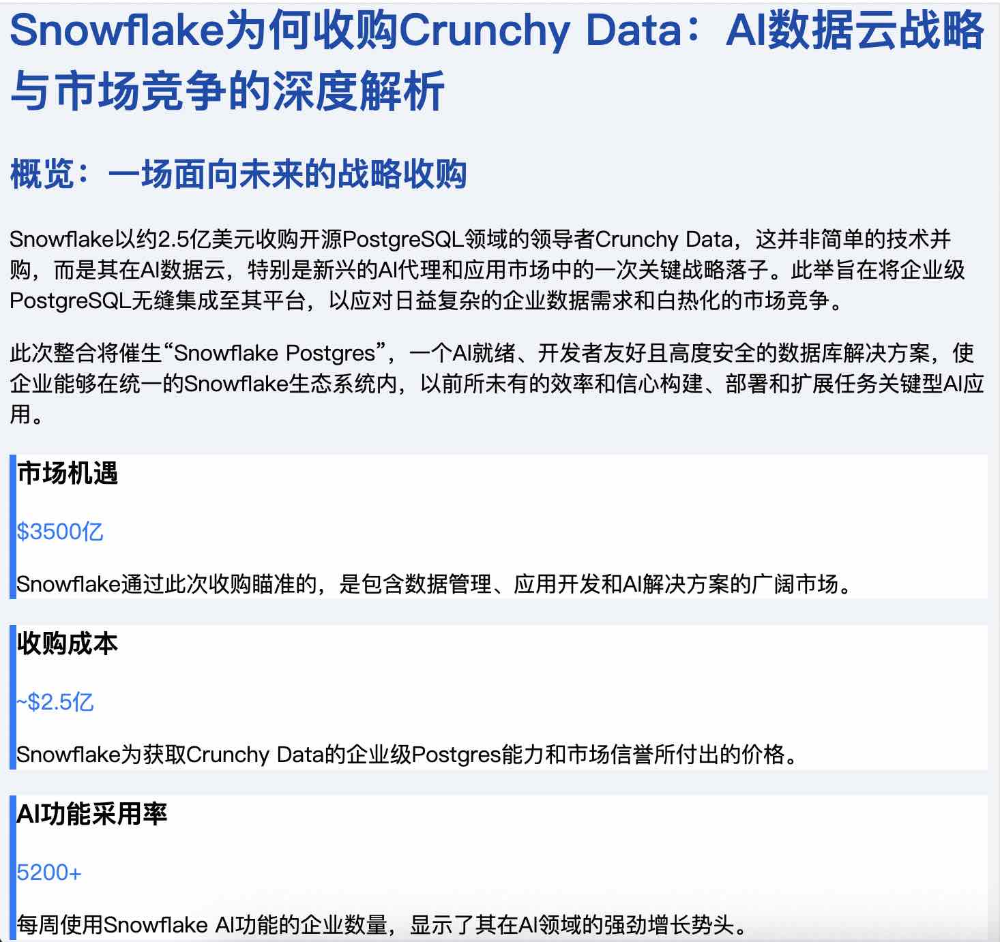

## 德说-第341期, Google Gemini 正偷偷抢占智能体入口     
                                          
### 作者                                          
digoal                                          
                                          
### 日期                                          
2025-06-03                                        
                                          
### 标签                                          
PostgreSQL , Snowflake , AI Agent , AI 智能体 , 入口 , google gemini , 推理 , agent , AI , 向量 , 图 , 搜索 , 关系 , all in one   
                                          
----                                          
                                          
## 背景    
国内的大模型公司可能还沉浸在打榜的喜悦中无法自拔, 今天这个赶超全球一线大模型, 明天那个又屠榜. 而Google已开始率先抢占智能体入口, 且听我慢慢逼逼  ......   
   
要成为智能体入口, 我觉得需要具备几个条件   
- 推理能力出众
- 使用的人多
- 使用的时间长
- 可以连接各类应用
- 应用生态中的开发者多
    
没错, google全部具备了   
- gemini 推理能力毫无疑问排在前列
- google chrome用户不要太多
- 只要是pc端, 相信使用chrome的时间都会很长
- chrome 市场的应用/插件非常多. google自己开发的应用也非常多.  
- chrome 市场都是三方开发者提供的, 开发者众多.
- 这些开发者都可以转型开发AI Agent, 并在google chrome市场进行发布, 给其他人使用. 通过各类应用又能粘住更多用户
  
google只是在移动端的入口比较欠缺.   
   
按以上标准, 还有哪些公司有希望成为智能体入口呢   
- 微软github的开发者众多, 日常应用的用户偏少, 企业用户更多一些.   
- 腾讯小程序开发者和用户都众多.  元器似乎也在尝试这条路.    
- 苹果appstore开发者和用户都众多.   
- 阿里钉钉也有类似的小程序市场, 企业开发者和用户众多.   
- 可能还会有一些做垂类场景的企业, 例如电商(面向卖家的智能体)、短视频(面向创作者的智能体). 个人见识浅薄了解甚少, 欢迎大家交流.  
   
个人认为以上产品都有机会在各自基础之上, 补齐相应能力构建智能体入口.   
   
回到google, 大家有没有试过 Google Gemini 2.5 Flash 的 Deep Research 功能, 这个功能太强了, 相当于一个智能体的入口, 从一个问题开始展开, 看似和其他AI聊天工具没啥区别, 实则有大大的区别, 参与后续工序的可能涉及推理模型和无数智能体, 甚至与物理世界对接(例如智能制造工厂、电商、智能家电、汽车、手机、银行、金融机构等等).   
  
简单流程如下:    
- 1 用户 给出问题  
- 2 Gemini 规划解题方案  
- 3 用户 可以在此处修改解题方案  
- 4 Gemini 基于方案进行分步解题, 每个步骤都可能涉及相关资料的收集和分析  
- 5 Gemini 基于解题素材进行推理, 最终生成问题答案  
- 6 用户 在此时可以复制结果、或导出结果到谷歌文档(这又结合了谷歌文档的能力、可以协作等). 
    
这些都属于常规操作, 没什么好说的.   
    
可是, 万一它对接对接智能体市场呢? 往下看.    
   
- 6 用户 在此处还可以基于问题答案转交给内置智能体交付其他相应结果, 例如生成网页、生成报告、生成PPT、创建音频等,
    - 或者也可以使用你在Google平台创建的智能体来完成其他任务. 例如金融交易、智能制造、智能汽车互动、智能家具互动、 ... ...  <b> 想象空间非常大 </b> .     
  
<b> Google 这波设计思路太强了, 说很多岗位面临变革都是小的, 感觉现有工作结构、协作体系、商业模式都会被重新塑造.   </b>    
   
真正的万物互联正在到来.   
  
---   
  
## 下面用最近一起收购事件试试Google Gemini Deep Research 功能   
提前吃瓜:   
   
  
   
收购事件: Snowflake为什么要收购Crunchy Data数据库公司    
  
这不是和databrick的收购前后脚么.     
  
[《德说-第333期, Databricks花10亿美元买开源Neon数据库, 值得吗?》](../202505/20250506_01.md)    
  
还有小道消息称<b>OpenAI正计划收购Supabase</b>, 可不是吗, PG已经是事实的AI数据库底座, 再不出手的话, PostgreSQL一些好点的公司都被收了, 到时候连汤都木得.    
  
说得太激动, 继续体验Deep Research.   https://gemini.google.com/     
  
记录完整的步骤如下.   
   
   
  
  
1、用户提出问题: snowflake为什么要收购Crunchy Data数据库公司  
  
2、Gemini 规划解题方案: Snowflake收购Crunchy Data原因分析  
  
2\.1、研究网站  
- (1) 确认Snowflake是否收购了Crunchy Data。如果属实，查找两家公司发布的官方公告或新闻稿。  
- (2) 分析官方声明，找出Snowflake和Crunchy Data各自提及的收购主要原因。  
- (3) 研究Crunchy Data的核心产品、服务和市场定位，特别是其在PostgreSQL和开源数据库解决方案方面的专长。  
- (4) 调查Snowflake在收购时的战略目标和产品路线图，特别是其在传统数据仓库之外扩展数据云能力的努力。  
- (5) 搜索金融新闻机构、科技行业出版物和市场分析师对Snowflake收购Crunchy Data背后战略理由的分析。  
- (6) 识别Crunchy Data的技术、客户群或开源数据库专业知识如何补充或增强Snowflake的现有产品和长期愿景。  
- (7) 探讨Snowflake的数据云平台与Crunchy Data的PostgreSQL专长之间潜在的协同效应，考虑此次收购如何实现新的用例或吸引不同类型的客户。  
- (8) 评估竞争格局，以及此次收购如何定位Snowflake与其他云数据库提供商或数据平台公司之间的关系。  
  
分析结果  
  
生成报告  
  
只需要几分钟就可以准备好  
  
3、你是否要 修改`2.1`提到的方案? 或 开始研究?  
  
用户选择开始研究.  
  
4、Gemini 基于方案进行分步解题, 每个步骤都可能涉及相关资料的收集和分析  
  
下面是整个解题过程  
  
4\.1、研究方向  
  
我正在深入研究 Snowflake 收购 Crunchy Data 数据库公司的原因。我的目标是全面分析此次收购，涵盖官方声明、市场分析以及战略影响等多个方面。  
  
4\.2、研究计划  
  
我将首先确认此次收购是否属实，并查找双方的官方公告。随后，我将分析官方声明中提及的收购原因，并研究 Crunchy Data 的核心产品和 Snowflake 的战略目标。我还会查阅第三方分析报告，以理解此次收购的互补性、潜在协同效应以及对竞争格局的影响。  
  
4\.3、下一步行动  
  
我将从确认收购信息并查找官方公告开始我的研究。  
  
Researching websites  
  
siliconangle.com  
- Snowflake buys Crunchy Data to add more bite to its AI agents - SiliconANGLE  
  
financialpost.com  
- Snowflake Acquires Crunchy Data to Bring Enterprise Ready Postgres Offering to the AI Data Cloud | Financial Post  
  
pymnts.com  
- Snowflake to Acquire Crunchy Data to Strengthen AI Agent Business | PYMNTS.com  
  
crn.com  
- Snowflake Acquisition Expands Postgres Capabilities Of Its AI Data Cloud - CRN  
  
4\.4、收购确认与主要原因  
  
我已确认 Snowflake 正在收购 Crunchy Data，此次收购于2025年6月2日公布，目前尚待监管部门批准。Snowflake 此次收购的主要目的是为了强化其 AI 智能体业务，并提升企业构建和部署 AI 智能体及应用的能力。通过此次收购，Snowflake 计划在其 AI 数据云中引入“Snowflake Postgres”，这是一个专为 AI 准备、企业级且对开发者友好的 PostgreSQL 数据库。此举旨在抓住一个高达3500亿美元的巨大市场机遇，满足客户将 Postgres 引入 Snowflake AI 数据云的实际需求，并进一步推动 Snowflake 在事务性数据支持方面的进展。  
  
4\.5、Crunchy Data 的价值与互补性  
  
Crunchy Data 作为 PostgreSQL 数据库产品、技术和服务的领先提供商，其开源 Postgres 技术和产品将成为 Snowflake 新 Postgres 产品的基石。Crunchy Data 在安全性和合规性方面的深厚积累，尤其是在受监管行业和 FedRAMP 合规环境中的成功经验，对 Snowflake 而言是重要的补充。Crunchy Data 的核心产品包括 Crunchy Postgres、Crunchy Postgres for Kubernetes 和 Crunchy Hardened Postgres，这些都将增强 Snowflake 的产品能力。此次整合将使开发者能够更简单、高效地构建、部署和扩展生产就绪的 AI 智能体和应用程序，并支持客户在 Snowflake 平台上运行关键任务型受监管工作负载，同时提升信心和安全性。  
  
4\.6、战略意义与竞争格局  
  
此次收购是 Snowflake 实现其“提供全球最值得信赖和最全面的数据与 AI 平台”愿景的关键一步。它将扩展 Snowflake 的 AI 数据云功能，并与 Databricks 收购 Neon（另一家 Postgres 初创公司）的举动形成直接竞争，表明 Snowflake 和 Databricks 都在积极争夺那些希望利用自身数据构建 AI 智能体和应用程序的企业。此次交易价值2.5亿美元，进一步巩固了 Snowflake 在企业数据领域的地位，并使其能够更直接地在事务性数据库领域展开竞争。  
  
4\.7、下一步行动  
  
我将深入浏览已识别出的相关文章，以提取更具体的细节，并确保没有遗漏任何重要信息。我将重点关注官方公告和权威的技术/金融新闻网站，并进一步探究 Crunchy Data 的具体产品和服务，以及 Snowflake 更广泛的战略目标。  
  
Researching websites  
  
snowflake.com  
- Snowflake Summit 2025  
  
grazitti.com  
- Snowflake's Innovations in Governance, Security, AI for 2025 - Grazitti Interactive  
  
crunchydata.com  
- Hardened, secure, access controlled, & commercially supported PostgreSQL - Crunchy Data  
  
crn.com  
- Snowflake Acquisition Expands Postgres Capabilities Of Its AI Data ...  
  
pymnts.com  
- Snowflake to Acquire Crunchy Data for AI Agent Business  
  
financialpost.com  
- Snowflake Acquires Crunchy Data to Bring Enterprise Ready ...  
  
siliconangle.com  
- Snowflake buys Crunchy Data to add more bite to its AI agents ...  
  
crunchydata.com  
- Crunchy Data Warehouse  
  
crunchydata.com  
- Postgres Tutorials | Crunchy Data  
  
snowflake.com  
- Snowflake Unistore | Unite Transactional and Analytical Data  
  
chaosgenius.io  
- Snowflake Hybrid Tables 101—A Technical Deep Dive (2025) - Chaos Genius  
  
techzine.eu  
- Snowflake enters enterprise PostgreSQL market with acquisition of Crunchy Data  
  
leaddev.com  
- PostgreSQL: The database that quietly ate the world - LeadDev  
  
snowflake.com  
- Delivering the Most Enterprise-Ready Postgres, Built for the Snowflake AI Data Cloud  
  
portable.io  
- How to Load Data from Postgres to Snowflake (April 2025) - Portable.io  
  
mlq.ai  
- Snowflake to Acquire Crunchy Data for $250 Million: WSJ - MLQ.ai  
  
ng.investing.com  
- Snowflake to acquire Crunchy Data for enhanced Postgres in AI Data Cloud  
  
crunchydata.com  
- Crunchy Data: Postgres for Cloud, Kubernetes, or Enterprise  
  
4\.8、研究进展与信息饱和  
  
我已经全面完成了对 Snowflake 收购 Crunchy Data 数据库公司原因的研究。我查阅了官方公告、科技新闻和金融出版物等多个可靠来源，并认为已获取了足够的信息，进一步的搜索不太可能带来新的发现。  
  
4\.9、核心收购动因  
  
此次收购的核心驱动力在于 Snowflake 旨在加强其 AI 智能体业务，并为企业提供更强大的能力来构建和部署 AI 智能体及应用。通过整合 Crunchy Data 的开源 PostgreSQL 技术，Snowflake 将在其 AI 数据云中推出“Snowflake Postgres”，以满足客户将 Postgres 引入其平台的需求，并抓住一个巨大的市场机遇。  
  
4\.10、Crunchy Data 的战略价值  
  
Crunchy Data 在 PostgreSQL 数据库产品、技术和服务方面的专长，以及其在安全性、合规性（尤其是在受监管行业和 FedRAMP 合规环境中的经验）方面的优势，对 Snowflake 具有重要的战略价值。此次整合将使开发者能够更高效地在 Snowflake 平台上构建、部署和运行关键任务型 AI 应用程序。  
  
4\.11、竞争格局与未来展望  
  
此次收购也反映了 Snowflake 在企业数据领域的竞争策略，尤其是在与 Databricks 等主要竞争对手的较量中。通过此次交易，Snowflake 进一步巩固了其在事务性数据支持方面的地位，并致力于成为所有企业数据和 AI 需求的终极平台。  
  
4\.12、下一步行动  
  
我已经完成了所有必要的研究，现在将着手整理这些信息并生成最终报告。  
  
<b> 果然只需要几分钟, 报告就生成好了  
  
以前干产品经理时老板要求写各种MRD、BRD, 一干就是个把礼拜, 还没AI几分钟来得好.   
  
完了 产品经理 的末日.  
  
下面看AI生产的纯报告如何? 你们都错了~Snowflake 2.5亿收购Crunchy Data的真实目的其实是...    
  
我保证一个字都没有修改. </b>    
  
---    
  
# **Snowflake为何收购Crunchy Data数据库公司：AI数据云战略与市场竞争的深度解析**  
  
### **执行摘要**  
  
* **概览：** Snowflake以约2.5亿美元收购Crunchy Data，标志着其在AI数据云能力，特别是新兴的AI智能体和应用市场方面，迈出了关键的战略性一步。此次收购不仅仅是为了扩展数据库产品，更是对不断变化的企业数据需求和日益激烈的市场竞争的深思熟虑的回应。    
* **核心动因：** 主要驱动因素包括将企业级PostgreSQL直接集成到Snowflake平台中，利用PostgreSQL广泛的开发者采纳度，解决AI工作负载对安全合规事务数据管理的关键需求，以及在AI智能体领域与Databricks等竞争对手直接抗衡。    
* **战略成果：** 此次整合将催生“Snowflake Postgres”，一个AI就绪、开发者友好且高度安全的数据库解决方案，使企业能够在统一的Snowflake生态系统内，以前所未有的效率和信心构建、部署和扩展任务关键型AI应用。  
  
### **1\. 引言：Snowflake演进的战略背景**  
  
Snowflake已确立其作为领先的云数据仓库提供商的地位，使企业能够在包括亚马逊网络服务、微软Azure和谷歌云在内的主要云提供商之间存储、组织和分析数据 1。其2025年及以后的战略愿景是成为“世界上最值得信赖和最全面的数据和AI平台” 2，超越传统数据仓库，涵盖所有数据和AI需求。这包括对隐私、行业特定治理和尖端AI工具的持续关注 3。  
  
Snowflake的发展历程一直致力于将分散的数据工作负载整合到一个可扩展的平台中。此次收购标志着这一整合战略的自然而重要的扩展，将一个广泛使用的事务型数据库纳入其中，直接弥补了其原生产品在操作应用方面的关键空白，并巩固了其更广泛的“AI数据云”愿景。  
  
Crunchy Data是开源PostgreSQL技术、产品和支持服务的杰出提供商 2。该公司专注于企业级PostgreSQL解决方案，并高度重视安全性和合规性，包括符合FedRAMP标准，使其成为联邦机构、财富500强金融机构和高规模SaaS公司等受监管行业的值得信赖的合作伙伴 2。其产品组合包括Crunchy Bridge（完全托管的Postgres）、Crunchy Postgres（自托管）、Crunchy Postgres for Kubernetes、Crunchy Hardened Postgres（增强安全功能，如透明数据加密和行级安全）以及Crunchy Data Warehouse（Postgres原生的OLTP/OLAP）2。  
  
Crunchy Data的价值不仅在于提供PostgreSQL，更在于将其为企业用途进行强化，尤其是在高度敏感和受监管的环境中。这种在任务关键型工作负载中操作开源技术的深厚专业知识，加上其在要求严苛的行业中建立的客户群，是Snowflake此次收购的关键资产。  
  
市场正在迅速转向AI智能体，这些智能体有望成为“生成式AI之后的下一个大事件”，旨在以最少的人工监督自动化复杂工作 1。这些AI智能体需要对事务数据进行强大、低延迟的访问，以有效执行其功能 1。Snowflake一直在大力推动AI领域，每周有超过5,200家企业使用其AI功能，包括其Cortex大型语言模型，这些模型可以作为AI智能体的基础 1。  
  
AI智能体的兴起促使人们重新评估数据架构。传统的分析型数据仓库虽然在洞察方面功能强大，但通常并未针对AI智能体所需的实时、高并发事务操作进行优化。这为Snowflake等平台带来了战略上的必要性，即无缝连接分析和事务世界，以支持这些新的工作负载。  
  
此次收购以及现有的Unistore计划 4 表明，Snowflake正在加速其从纯分析型数据仓库向混合工作负载的战略转变。这不仅仅是增加一个功能，而是从根本上扩展Snowflake的潜在市场和核心能力。对“AI智能体” 1 作为这种事务能力的驱动因素的强调，突显出这不仅仅是关于传统的在线事务处理（OLTP），而是关于赋能新一代模糊操作和分析数据界限的数据密集型应用。这意味着Snowflake正在将自身定位为端到端的数据平台，而不仅仅是一个数据仓库。这将使它们直接与更广泛的数据库供应商和提供托管事务服务的云提供商竞争，预示着其竞争领域的显著扩张。  
  
PostgreSQL是开源的 1。Snowflake，传统上以其专有云数据仓库而闻名，正在对“Postgres社区做出坚定的承诺” 2。这表明，对于AI开发，特别是智能体工作流而言，开源数据库的灵活性、可扩展性和社区驱动的创新正变得对开发者来说不可或缺 13。企业希望获得开源的好处，同时避免操作负担，而Crunchy Data提供了这种经过强化和支持的层面。这表明Snowflake认识到，要赢得AI开发者的青睐并加速创新，它必须拥抱并整合领先的开源技术，而不仅仅依赖于专有解决方案。这可能预示着Snowflake产品理念向更开放的生态系统转变，这是由AI开发的实际需求所驱动的。  
  
### **2\. 驱动力：Snowflake的AI数据云和智能体战略**  
  
Snowflake明确表示，此次收购旨在“增强其帮助企业构建和部署人工智能（AI）智能体和应用的能力” 6。此次计划中的合并将把Crunchy Data的开源Postgres技术和产品添加到Snowflake的AI数据云中，创建“Snowflake Postgres” 2。PostgreSQL被强调为一种开源关系型数据库，可以作为“客户使用存储在Snowflake等公司平台中的数据创建AI智能体的底层数据库” 6。Snowflake Postgres将使那些使用PostgreSQL的用户“更快地交付并更高效地运行” 6。  
  
AI智能体需要持久的、低延迟的存储来保存其状态、上下文和操作数据。虽然Snowflake的核心优势在于分析，但它缺乏一个原生的、企业级的事务型数据库，该数据库针对这些实时、操作性AI工作负载进行了优化。Crunchy Data直接弥补了这一空白，为动态AI应用提供了必要的事务型骨干。  
  
Snowflake Postgres被描述为“AI就绪、企业级和开发者友好”的PostgreSQL数据库 2。它将为开发者提供PostgreSQL的全部功能，并结合Snowflake的治理、安全和操作标准，这些标准对于构建和运行任务关键型AI应用至关重要 2。它有助于开发者“加速新AI智能体的开发并简化他们访问数据的方式” 1。  
  
“AI就绪”一词不仅意味着数据存储，还意味着一个能够处理AI应用特定需求的数据库，可能包括用于语义搜索的向量嵌入、实时推理数据和智能体对话历史。与Snowflake现有治理和安全框架的无缝集成对于企业采用AI至关重要，可确保数据完整性和合规性。  
  
Snowflake工程高级副总裁Vivek Raghunathan表示：“我们正在抓住一个巨大的3500亿美元的市场机遇，以及客户将Postgres引入Snowflake AI数据云的真实需求” 2。  
  
这3500亿美元的市场可能不仅包括数据库软件，还包括依赖于强大事务数据基础设施的数据管理、应用开发和AI解决方案的更广泛生态系统。通过将Postgres直接引入其AI数据云，Snowflake旨在占据这一不断扩大的市场的重要份额，超越其传统的数据仓库收入来源。  
  
Snowflake反复强调“AI数据云” 2 和“AI智能体” 1 表明其核心价值主张的战略性品牌重塑和重新聚焦。这不再仅仅是数据仓库；它是作为AI开发的基础平台。收购Crunchy Data是实现这一愿景的具体步骤，为需要实时数据交互的动态、有状态的AI应用提供了必要的事务骨干。这重新定义了Snowflake的竞争格局。它们现在直接争夺AI应用开发工作负载，这些工作负载本质上需要强大的操作数据库，从而将其业务范围扩展到以前由传统OLTP供应商或专业AI数据库解决方案主导的领域。  
  
反复提及“开发者友好” 2 以及简化开发者“构建、部署和扩展智能体和应用”的方式 1，表明Snowflake明白赢得AI竞赛需要赢得开发者。PostgreSQL的普及度（49%的开发者使用它 4）使其成为吸引和留住已经熟练掌握它的开发者的自然选择。通过将其无缝集成到Snowflake平台中，Snowflake减少了摩擦，最大限度地减少了上下文切换，并加速了AI创新的上市时间。此次收购不仅是为了获得一项流行的技术，也是为了赢得开发者的青睐，并降低在Snowflake上构建AI应用的学习曲线。这在人才稀缺的AI开发市场中是一项关键策略，易用性和熟悉度可能是平台采用的决定性因素。  
  
### **3\. Crunchy Data的价值主张：企业级PostgreSQL**  
  
PostgreSQL，或称Postgres，是一种开源关系型数据库，被“49%的开发者使用” 4。在2023年的StackOverflow调查中，它首次超越MySQL成为首选数据库 13。其受欢迎程度源于其简单且宽松的许可、强大的社区支持、多功能性、开放性、可扩展性、高成熟度以及低拥有成本 13。它被广泛应用于各种行业和用例，从企业银行和医疗保健到初创公司、加密货币和AI游戏 13。  
  
PostgreSQL在开发者中的普遍性意味着存在庞大的现有开发人才库以及丰富的工具和扩展生态系统。通过整合它，Snowflake立即利用了这一已建立的开发者基础，降低了采用障碍，并加速了基于熟悉且受信任技术构建的AI应用的上市时间。这也使已经投入Postgres的企业能够在Snowflake环境中利用其现有技能。  
  
Crunchy Data“对严格安全性和全面合规性的坚定承诺使其成为受监管行业中组织的值得信赖的Postgres合作伙伴”，包括联邦机构、财富500强金融机构和高规模SaaS公司 4。他们的技术符合FedRAMP标准，这对于美国的政府合同至关重要 2。他们的“Crunchy Hardened Postgres”提供增强的安全功能，如带有超级用户锁定的基于角色的访问控制（RBAC）、透明数据加密（TDE）和行级安全（RLS） 8。他们与美国国防信息系统局（DISA）和互联网安全中心（CIS）合作发布了PostgreSQL的安全指南 8。  
  
对于企业AI，尤其是在高度受监管的行业中，数据治理、安全和合规性至关重要。Crunchy Data在强化开源PostgreSQL以满足这些严格标准方面的专业知识是一个关键的差异化因素，它减轻了与敏感环境中开源部署相关的风险，并为Snowflake在这些要求苛刻的领域提供了即时信誉。  
  
此次收购的产品和能力包括：  
  
**表1：Crunchy Data的关键产品及其对Snowflake的战略价值**  
  
| Crunchy Data 产品/服务 | 描述 | 对Snowflake的战略价值 |  
| :---- | :---- | :---- |  
| **Crunchy Bridge** | 完全托管的Postgres，可在AWS、Azure和GCP上使用，提供持续保护、备份、时间点恢复和卓越的开发者体验 2。 | 在Snowflake AI数据云中实现完全托管的Postgres 4。 |  
| **Crunchy Postgres** | 生产就绪的自托管PostgreSQL，具有备份、灾难恢复、高可用性和监控等功能 2。 | 为企业客户提供灵活的部署选项，满足特定操作需求 7。 |  
| **Crunchy Postgres for Kubernetes** | 由Crunchy Data的Operator管理的云原生Postgres，实现简单配置、高可用性和无缝升级 2。 | 支持基于Kubernetes的现代应用开发，与云原生生态系统集成 7。 |  
| **Crunchy Hardened Postgres** | 专注于高级安全要求，提供增强的RBAC、超级用户锁定、透明数据加密（TDE）和行级安全（RLS） 2。 | 为受监管工作负载提供企业级安全和FedRAMP合规性 2。 |  
| **Crunchy Data Warehouse** | Postgres原生数据仓库解决方案，支持OLTP和OLAP工作负载、高性能分析和完整的Iceberg支持，在单个Postgres环境中弥合事务处理和分析处理之间的鸿沟 2。 | 通过Postgres原生的OLAP扩展Unistore功能，统一事务和分析数据 4。 |  
| **企业支持与合规专业知识** | 专家支持和合规认证，在政府机构和金融机构等高度受监管行业拥有良好记录 4。 | 增强Snowflake在处理敏感和任务关键型数据方面的可信度，吸引更多企业客户 4。 |  
| **运营卓越** | Snowflake引用Crunchy Data的“基本性能指标、强大的扩展能力和‘强大’的用户界面作为开发者的竞争优势” 2。 | 吸引开发者使用熟悉且强大的Postgres解决方案，加速AI应用开发 4。 |  
  
Crunchy Data的全面产品套件展示了其满足多样化企业部署模型（托管、自托管、Kubernetes）和安全需求的能力，确保Snowflake能够提供真正多功能且强大的PostgreSQL解决方案，该解决方案可以在各种环境中部署和管理，同时保持企业级标准。  
  
虽然PostgreSQL很受欢迎，但企业往往因其感知到的操作复杂性、安全担忧以及任务关键型工作负载缺乏商业支持而犹豫不决。Crunchy Data的核心价值主张围绕着提供“企业级” 2 和“强化” 8 的PostgreSQL，专门解决了这些担忧。Snowflake此次收购的不仅是技术，更是使开源Postgres可供大型受监管组织使用和信任的专业知识和方法，从而有效地降低了与开源采用相关的风险。这使得Snowflake能够有效地将其开源PostgreSQL“产品化”以服务其企业客户群，消除了采用的重大障碍，并将其业务范围扩展到需要高水平安全和合规性的市场领域，这对于敏感的AI工作负载至关重要。  
  
Snowflake计划整合Crunchy Data以“管理企业PostgreSQL工作负载的构建、部署和操作的整个生命周期” 2 这一点至关重要。这超越了简单地提供一个数据库。它表明了一种全面的平台方法，其中数据库管理的复杂性（备份、灾难恢复、高可用性、扩展、监控 7）在Snowflake生态系统内被抽象化或显著简化。这与Snowflake的云原生、托管服务理念完美契合，旨在减轻客户的操作负担。这种数据库管理的整体方法，结合Snowflake现有的数据云能力，旨在降低客户的操作开销，使他们能够更多地专注于应用开发和AI创新，而不是基础设施管理的复杂性，从而加速其数字化转型之旅。  
  
### **4\. 协同效应与融入Snowflake生态系统**  
  
此次收购将催生“Snowflake Postgres”，一个“AI就绪、企业级和开发者友好”的PostgreSQL数据库，存在于Snowflake的AI数据云中 2。它旨在“简化开发者构建、部署和扩展智能体和应用的方式” 1。开发者将获得“原始开源Postgres数据库的全部功能和灵活性，以及Snowflake云数据仓库卓越的操作标准、治理、安全性和灵活性” 1。直接在Snowflake中访问PostgreSQL数据库被视为对团队和客户“极具影响力”，允许安全部署Snowflake原生应用（如LandingLens）直接到客户账户中 1。  
  
核心益处是统一和简化。开发者可以在熟悉、安全和可扩展的Snowflake环境中利用其现有的PostgreSQL技能和生态系统，无需独立的数据库管理系统和复杂、易错的数据移动。这简化了AI应用的开发工作流程。  
  
Snowflake Postgres代表了“Snowflake支持事务数据的旅程的进一步发展，这一旅程始于Unistore” 4。Unistore在Snowflake的单个数据库中统一了事务和分析数据，其混合表支持低延迟、高并发的事务操作（插入、更新、删除） 11。Snowflake Postgres“通过为需要PostgreSQL兼容性的事务应用提供企业级解决方案来补充Unistore” 4。虽然Unistore为事务和分析工作负载提供了统一平台，但Snowflake Postgres专门解决了在该更广泛的AI数据云生态系统内对强大、合规且开发者友好的PostgreSQL数据库的需求 4。  
  
Unistore为Snowflake内部的混合事务/分析工作负载奠定了基础，展示了Snowflake对支持操作数据的承诺。Crunchy Data的收购专门解决了对PostgreSQL兼容事务层的需求，鉴于Postgres广泛的开发者普及度和现有企业采用率，这一点至关重要。这是为了在更广泛的Unistore愿景中提供一种特定且需求量很大的事务能力，使平台更具通用性。  
  
Snowflake Postgres将把Crunchy Data“在符合FedRAMP标准的环境中经过验证的企业就绪能力直接引入Snowflake的AI数据云” 4。它确保了“构建和运行任务关键型”应用所必需的“不妥协的治理、安全和操作标准” 4。这包括利用Crunchy Data的企业级强化安全功能和对关键合规标准的内置支持，以确保敏感AI工作负载和任务关键型应用的数据完整性和法规遵从性 14。  
  
对于企业，特别是在金融和政府等高度受监管的行业，满足严格的法规和安全要求是不可谈判的。Crunchy Data在此领域的既有声誉和专业“强化Postgres”能力为Snowflake提供了即时的可信度和能力，为新的敏感工作负载打开了大门。  
  
Snowflake长期以来的承诺是提供一个统一的数据平台。Unistore计划 12 开始弥合分析和事务数据之间的鸿沟。Crunchy Data的收购，特别是针对PostgreSQL的收购，通过将一个广泛使用的操作数据库纳入其中，扩展了这一愿景。这使客户能够可能在同一个底层平台 11 上运行其事务应用和分析工作负载，减少数据移动、复杂的提取、转换、加载（ETL）过程，并确保实时AI应用的数据新鲜度。这使得Snowflake成为一个更全面的数据操作系统，旨在消除数据孤岛，不仅在不同的分析存储之间，而且在操作数据库和数据仓库之间。这增强了数据一致性，简化了复杂AI应用的架构足迹，并降低了企业的总拥有成本。  
  
提及LandingAI能够“安全地将我们的Snowflake原生应用LandingLens部署到客户账户中” 1 并访问PostgreSQL，这一点意义重大。Snowflake正在构建一个生态系统，其中应用可以直接在其平台上运行，利用底层数据。通过提供一个原生、企业级的PostgreSQL，Snowflake使其平台对开发者更具吸引力，以构建事务应用，这些应用随后可以在Snowflake市场中部署和变现，类似于应用商店模式。这促进了Snowflake周围更强大的开发者社区和市场，推动了平台粘性，并扩大了核心数据仓库之外的收入机会。它将Snowflake从主要的数据后端转变为数据密集型应用的全栈应用部署平台，创造了强大的网络效应。  
  
### **5\. 竞争格局与市场影响**  
  
此次收购有助于Snowflake“跟上其在企业数据领域最大的竞争对手Databricks公司”的步伐 1。这笔交易发生“就在Databricks公司以约10亿美元收购了另一家类似的Postgres数据库初创公司Neon公司几周之后” 1。Databricks收购Neon的既定目标是为开发者提供一个无服务器的Postgres，能够“跟上智能体速度、按需付费经济和Postgres社区的开放性” 1。两家公司都在“争相吸引那些希望构建AI智能体和利用自身数据的其他应用的企业” 1。  
  
这是一次明显的“效仿”收购，以回应Databricks的举动，突显了这两家云数据巨头之间的激烈竞争。双方都认识到，强大、开发者友好的PostgreSQL产品对于赢得AI智能体工作负载并在不断发展的“AI数据云”市场中确立主导地位至关重要。  
  
行业分析师认为这笔交易是“加强Snowflake在云数据市场地位的战略性一步”，并预计它将“影响企业数据管理领域” 5。分析师表示，此举“可能会促使数据仓库和云平台领域进一步整合，因为竞争对手也寻求强化自己的产品” 5。“2.5亿美元的收购价格反映了开源数据库平台在现代数据生态系统中的日益重要性” 5。  
  
**表2：竞争格局：AI智能体数据库领域的关键收购**  
  
| 收购方 | 被收购方 | 被收购技术焦点 | 既定战略目标 | 收购成本（若有） | 相关片段ID |  
| :---- | :---- | :---- | :---- | :---- | :---- |  
| **Snowflake** | Crunchy Data | 开源PostgreSQL | 加强AI智能体业务；将企业级Postgres引入AI数据云；简化AI应用开发 1 | \~$250M 1 | 1 |  
| **Databricks** | Neon Inc. | 无服务器Postgres | 提供能跟上智能体速度、按需付费经济和Postgres社区开放性的无服务器Postgres 1 | \~$1B 1 | 1 |  
  
“AI数据云”的竞争正在推动大量的并购活动。公司正在收购专业能力，以提供更全面、更集成的平台，而不是依赖客户将不同的服务拼凑起来。这一趋势旨在简化企业数据格局，并降低客户的操作复杂性。  
  
Snowflake已表示，在收购完成后，将“对Postgres社区做出坚定承诺”，并继续支持现有的Crunchy Data客户 2。这一承诺对于维护开源社区的信任至关重要，该社区重视独立性、透明度和持续开发。它还向现有Crunchy Data客户保证，他们的投资将受到保护和增强，确保其任务关键型应用的顺利过渡和持续支持。  
  
两大领先数据云提供商（Databricks和Snowflake）几乎同时收购Postgres初创公司（Databricks收购Neon，Snowflake收购Crunchy Data） 1，清楚地表明了对AI智能体所需基础架构的“军备竞赛”。这不仅仅是数据存储；它关乎为下一代AI应用提供操作骨干，这些应用需要实时事务能力和分析能力。来自Databricks的竞争压力无疑加速了Snowflake的行动，使其成为一项战略要务，而非长期选项。这种激烈的竞争可能会导致数据云平台中集成事务和分析能力的快速创新，从而使寻求统一解决方案以支持其AI计划的企业受益。这也表明市场认为AI智能体将驱动大量新的数据库工作负载，使底层数据基础设施成为关键的战场。  
  
Snowflake，传统上以其专有技术而闻名，现在通过一项重大收购来拥抱开源PostgreSQL。这既是一种防御性举措（为了对抗Databricks的类似收购并吸引那些天生偏爱开源灵活性和开放性的开发者），也是一种进攻性举措（为了扩大其市场范围并提供一个满足多样化企业需求的更全面的平台）。PostgreSQL的高市场份额和日益增长的普及率 4 使其成为平台完整性不可忽视的力量。这预示着一个更广泛的行业趋势，即即使是专有云供应商也必须战略性地整合流行的开源技术，以保持竞争力并吸引更广泛的开发者基础，尤其是在AI等快速发展的领域。它验证了开源数据库作为企业云平台基础组件的长期可行性和战略重要性。  
  
### **6\. 对客户、开发者和Snowflake的益处**  
  
Snowflake Postgres将“显著简化开发者构建、部署和扩展生产就绪的AI智能体和应用的方式” 4。它利用了Crunchy Data的技术，“不仅为快速实验而设计，也为构建、部署和操作最重要的企业工作负载的整个生命周期而设计” 4。LandingAI和Blue Yonder等客户和合作伙伴预计，此次集成将“加速和简化”其开发团队的“益处”并“加快开发流程” 4，使他们能够在转向AI智能体的过程中获得竞争优势 4。  
  
通过在Snowflake内部直接提供完全托管的企业级PostgreSQL，此次收购消除了开发者的操作负担和集成复杂性，使他们能够专注于更快地构建创新的AI解决方案。这直接转化为新AI驱动产品和功能的上市时间缩短。  
  
Crunchy Data在安全和合规方面的专业知识，包括FedRAMP合规性，将直接集成到Snowflake的AI数据云中 2。这使客户能够“在Snowflake平台上以更高的信心和安全性运行任务关键型受监管工作负载” 4。Snowflake Postgres将“满足严格的企业要求”，并“确保敏感AI工作负载和任务关键型应用的数据完整性和法规遵从性” 14。  
  
对于企业，特别是在金融和政府等高度受监管的行业，满足严格的法规和安全要求是不可谈判的。Crunchy Data在此领域的既有声誉和专业“强化Postgres”能力为Snowflake提供了即时的可信度和能力，为新的敏感工作负载打开了大门。  
  
此次收购使Snowflake能够“在快速发展的企业数据管理格局中保持竞争力” 5。它使Snowflake的产品多样化，并有助于保持“与其他领先云数据供应商的竞争均势” 5。分析师预计“该领域将进一步关注开源解决方案，并预计Snowflake将加速分析、AI和混合数据库支持的开发” 5。  
  
此次举措是Snowflake为巩固其在更广泛数据和AI市场中的领导地位而采取的积极步骤，确保其能够满足企业数据需求的全部范围，从传统分析到尖端AI应用，并占据已识别的3500亿美元市场机遇的更大份额。  
  
此次收购是对下一波AI采用——AI智能体所需基础设施的直接投资。通过提供底层事务数据库，Snowflake正在将自己定位为捕捉这些智能体所产生的价值的很大一部分。3500亿美元的市场机遇 2 不仅仅关乎数据库销售，而是关乎运行在此集成数据层之上的应用和服务的更广泛生态系统。这意味着未来Snowflake的收入流将越来越多地与AI应用的操作工作负载相关联，而不仅仅是其分析对应物。这一举措是Snowflake对企业AI未来的战略押注，旨在使Snowflake成为构建和操作需要分析和事务能力的智能应用的默认平台，从而扩大其核心数据仓库业务之外的收入潜力。  
  
通过提供原生、企业级的PostgreSQL，Snowflake显著增加了其平台的粘性。以前必须管理单独的PostgreSQL实例并将其与Snowflake集成的客户，现在可以将他们的数据和应用整合到单个平台上。这简化了他们的架构，减少了供应商蔓延，并增加了离开Snowflake的难度。部署利用此集成Postgres的“Snowflake原生应用” 1 的能力进一步增强了平台的生态系统，鼓励开发者直接在Snowflake上进行构建。此次收购不仅仅关乎技术，更关乎创建一个更具吸引力和粘性的平台，能够满足更广泛的客户需求，促进更深层次的参与，并可能随着客户将其更多数据和应用工作负载整合到Snowflake AI数据云上而增加Snowflake服务的消费。  
  
### **7\. 结论：战略要务与未来展望**  
  
此次收购的战略重要性体现在以下几个关键方面：  
  
* **AI优先的必然性：** 此次收购凸显了Snowflake向“AI数据云”战略的积极转变，认识到AI智能体和应用需要传统数据仓库无法单独提供的强大、集成的事务能力。    
* **以开发者为中心的增长：** 通过拥抱PostgreSQL（一个被近半数开发者使用的数据库 4），Snowflake迎合了庞大的开发者社区，简化了AI驱动应用的开发，并直接在其平台上促进创新。    
* **企业信任：** Crunchy Data在安全和合规方面的深厚专业知识，特别是其FedRAMP能力 2，降低了高度受监管企业采用开源的风险，巩固了Snowflake作为任务关键型工作负载值得信赖的合作伙伴的地位。    
* **竞争性回应：** 此次举措是对竞争压力的直接和必要回应，特别是来自Databricks类似收购的压力 1，在提供全面数据和AI平台的日益激烈的竞争中。    
* **工作负载统一：** 它显著推进了Snowflake的Unistore愿景，使其更接近于一个真正的单一平台，用于分析和事务数据，从而降低了客户的架构复杂性、数据重复和操作开销。  
  
对Snowflake增长和市场领导地位的预期影响包括：  
  
* **扩大潜在市场：** Snowflake现在可以针对需要事务数据库的更广泛的企业工作负载，显著增加其总潜在市场 2（3500亿美元的机会）。    
* **加速AI采用：** 通过简化AI智能体和应用的开发和部署，Snowflake有望成为企业构建下一代智能应用的优选平台，从而推动其AI数据云服务的消费。    
* **强化竞争护城河：** 集成产品增强了Snowflake与传统数据库供应商和其他云数据平台在竞争中的差异化，特别是在快速增长的AI领域，集成能力正变得至关重要。    
* **增加平台粘性：** 更全面、统一的平台将导致客户更大的依赖和更高的Snowflake服务消费，促进更深层次的关系并推动长期收入增长。    
* **积极的市场认知：** 分析师的反应 5 表明对这一战略举措的强烈信心，反映了对Snowflake执行其以AI为中心的愿景并占据未来市场份额的积极展望。  
  
此次收购，结合Unistore计划 11，标志着数据平台设计方式的根本性转变。在线事务处理（OLTP）和在线分析处理（OLAP）之间的传统分离正在瓦解。现代应用，特别是AI智能体，要求在同一数据上同时具备实时事务能力和强大的分析洞察力，而无需复杂的ETL流程。Snowflake正在积极构建一个原生支持这种融合工作负载的平台，认识到数据的未来是混合的。这一趋势将迫使其他数据平台提供商调整其架构，可能导致行业内出现更多集成、多模态的数据库产品。它预示着未来数据移动将最小化，数据将在原地处理以应对多样化的工作负载，从而实现更敏捷和响应更快的应用。  
  
Snowflake从数据仓库到“AI数据云” 2 的演变，通过收购Crunchy Data和Unistore等举措，重新定义了“数据云”的真正含义。它不再仅仅是存储和分析数据，而是提供一个用于构建、部署和操作数据密集型应用（包括AI）的全面环境。这不仅涉及数据存储和计算，还涉及事务能力、强大的治理、严格的安全性以及广泛的开发者工具，所有这些都无缝集成。这为企业对其云数据平台的期望设定了新标准，推动了集成和功能的边界。它表明未来的市场领导地位将属于那些能够无缝支持整个数据和应用生命周期的平台，从事务输入到AI驱动的洞察和自动化操作。  
  
#### **引用的著作**  
  
1. Snowflake buys Crunchy Data to add more bite to its AI agents ..., 访问时间为 六月 3, 2025， [https://siliconangle.com/2025/06/02/snowflake-buys-crunchy-data-add-bite-ai-agents/](https://siliconangle.com/2025/06/02/snowflake-buys-crunchy-data-add-bite-ai-agents/)    
  
2. Snowflake Acquisition Expands Postgres Capabilities Of Its AI Data ..., 访问时间为 六月 3, 2025， [https://www.crn.com/news/ai/2025/snowflake-expands-the-postgres-capabilities-of-its-ai-data-cloud-with-acquisition](https://www.crn.com/news/ai/2025/snowflake-expands-the-postgres-capabilities-of-its-ai-data-cloud-with-acquisition)    
  
3. Snowflake's Innovations in Governance, Security, AI for 2025 \- Grazitti Interactive, 访问时间为 六月 3, 2025， [https://www.grazitti.com/blog/how-snowflake-is-pioneering-governance-security-and-generative-ai-innovations-for-2025/](https://www.grazitti.com/blog/how-snowflake-is-pioneering-governance-security-and-generative-ai-innovations-for-2025/)    
  
4. Snowflake Acquires Crunchy Data to Bring Enterprise Ready ..., 访问时间为 六月 3, 2025， [https://financialpost.com/pmn/business-wire-news-releases-pmn/snowflake-acquires-crunchy-data-to-bring-enterprise-ready-postgres-offering-to-the-ai-data-cloud](https://financialpost.com/pmn/business-wire-news-releases-pmn/snowflake-acquires-crunchy-data-to-bring-enterprise-ready-postgres-offering-to-the-ai-data-cloud)    
  
5. Snowflake to Acquire Crunchy Data for $250 Million: WSJ \- MLQ.ai, 访问时间为 六月 3, 2025， [https://mlq.ai/news/snowflake-to-acquire-crunchy-data-for-250-million-wsj/](https://mlq.ai/news/snowflake-to-acquire-crunchy-data-for-250-million-wsj/)    
  
6. Snowflake to Acquire Crunchy Data for AI Agent Business, 访问时间为 六月 3, 2025， [https://www.pymnts.com/acquisitions/2025/snowflake-to-acquire-crunchy-data-to-strengthen-ai-agent-business/](https://www.pymnts.com/acquisitions/2025/snowflake-to-acquire-crunchy-data-to-strengthen-ai-agent-business/)    
  
7. Crunchy Data: Postgres for Cloud, Kubernetes, or Enterprise, 访问时间为 六月 3, 2025， [https://www.crunchydata.com/](https://www.crunchydata.com/)    
  
8. Hardened, secure, access controlled, & commercially supported PostgreSQL \- Crunchy Data, 访问时间为 六月 3, 2025， [https://www.crunchydata.com/products/hardened-postgres](https://www.crunchydata.com/products/hardened-postgres)    
  
9. Crunchy Data Warehouse, 访问时间为 六月 3, 2025， [https://www.crunchydata.com/products/warehouse](https://www.crunchydata.com/products/warehouse)    
  
10. Snowflake enters enterprise PostgreSQL market with acquisition of Crunchy Data, 访问时间为 六月 3, 2025， [https://www.techzine.eu/news/analytics/131937/snowflake-enters-enterprise-postgresql-market-with-acquisition-of-crunchy-data/](https://www.techzine.eu/news/analytics/131937/snowflake-enters-enterprise-postgresql-market-with-acquisition-of-crunchy-data/)    
  
11. Snowflake Hybrid Tables 101—A Technical Deep Dive (2025) \- Chaos Genius, 访问时间为 六月 3, 2025， [https://www.chaosgenius.io/blog/snowflake-hybrid-tables/](https://www.chaosgenius.io/blog/snowflake-hybrid-tables/)    
  
12. Snowflake Unistore | Unite Transactional and Analytical Data, 访问时间为 六月 3, 2025， [https://www.snowflake.com/en/product/platform/unistore/](https://www.snowflake.com/en/product/platform/unistore/)    
  
13. PostgreSQL: The database that quietly ate the world \- LeadDev, 访问时间为 六月 3, 2025， [https://leaddev.com/technical-direction/postgresql-database-quietly-ate-world](https://leaddev.com/technical-direction/postgresql-database-quietly-ate-world)    
  
14. Delivering the Most Enterprise-Ready Postgres, Built for the Snowflake AI Data Cloud, 访问时间为 六月 3, 2025， [https://www.snowflake.com/en/blog/snowflake-postgres-enterprise-ai-database/](https://www.snowflake.com/en/blog/snowflake-postgres-enterprise-ai-database/)    
  
15. Snowflake to acquire Crunchy Data for enhanced Postgres in AI Data Cloud, 访问时间为 六月 3, 2025， [https://ng.investing.com/news/company-news/snowflake-to-acquire-crunchy-data-for-enhanced-postgres-in-ai-data-cloud-93CH-1949394](https://ng.investing.com/news/company-news/snowflake-to-acquire-crunchy-data-for-enhanced-postgres-in-ai-data-cloud-93CH-1949394)  
  
  
#### [期望 PostgreSQL|开源PolarDB 增加什么功能?](https://github.com/digoal/blog/issues/76 "269ac3d1c492e938c0191101c7238216")
  
  
#### [PolarDB 开源数据库](https://openpolardb.com/home "57258f76c37864c6e6d23383d05714ea")
  
  
#### [PolarDB 学习图谱](https://www.aliyun.com/database/openpolardb/activity "8642f60e04ed0c814bf9cb9677976bd4")
  
  
#### [PostgreSQL 解决方案集合](../201706/20170601_02.md "40cff096e9ed7122c512b35d8561d9c8")
  
  
#### [德哥 / digoal's Github - 公益是一辈子的事.](https://github.com/digoal/blog/blob/master/README.md "22709685feb7cab07d30f30387f0a9ae")
  
  
#### [About 德哥](https://github.com/digoal/blog/blob/master/me/readme.md "a37735981e7704886ffd590565582dd0")
  
  

  
