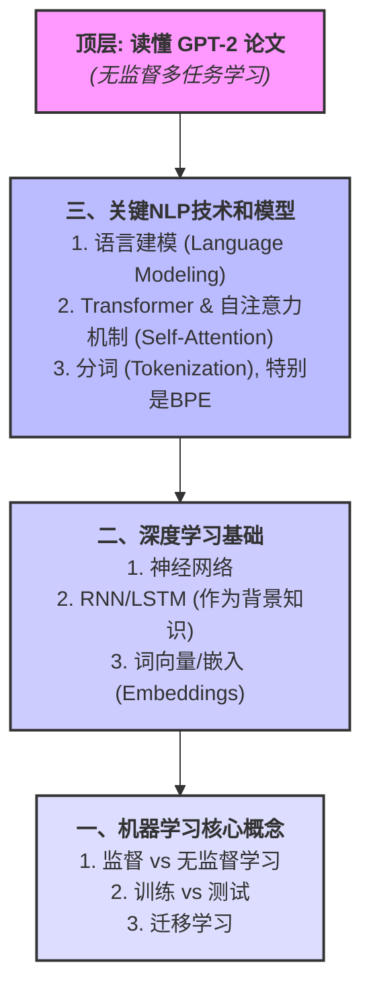
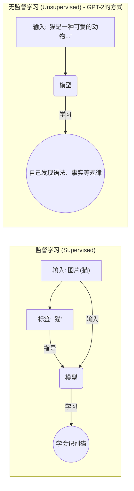
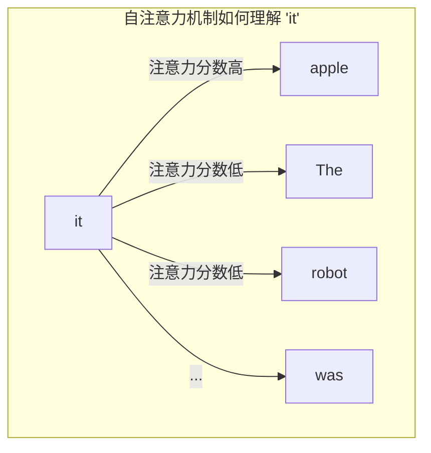
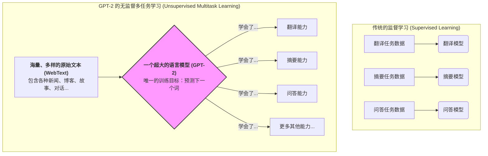
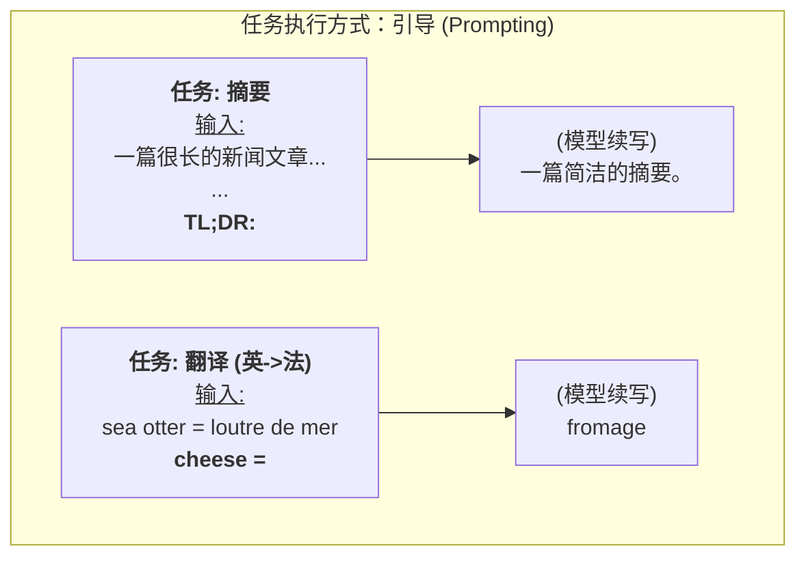
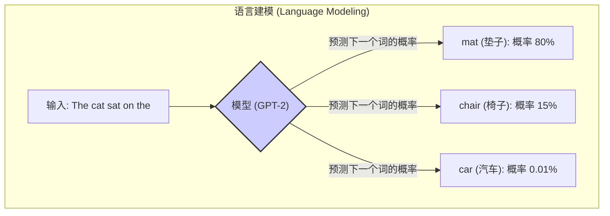
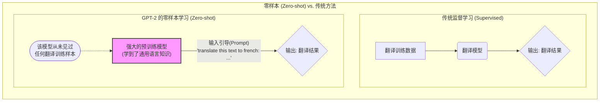

## AI论文解读 | Language Models are Unsupervised Multitask Learners  
        
### 作者        
digoal        
        
### 日期        
2025-06-08        
        
### 标签        
PostgreSQL , PolarDB , DuckDB , AI , 论文解读        
        
----        
        
## 背景       
      
https://cdn.openai.com/better-language-models/language_models_are_unsupervised_multitask_learners.pdf        
        
提示:        
```        
读懂《Language Models are Unsupervised Multitask Learners》这篇论文需要提前掌握哪些基础知识, 请使用中文给我讲一下这些基础知识, 尽量通熟易懂, 可以使用markdown支持的图形增加解释性.        
        
使用中文通熟易懂的解读《Language Models are Unsupervised Multitask Learners》这篇论文, 关键内容请深入讲解, 可以使用markdown支持的图形增加解释性.        
        
使用中文提取《Language Models are Unsupervised Multitask Learners》论文中一些重要的术语并详细解释, 可以使用markdown支持的图形示增加解释性.        
```        
        
## 1 前置知识    

好的，完全没问题！

为了能透彻地读懂《Language Models are Unsupervised Multitask Learners》（也就是大名鼎鼎的 **GPT-2** 论文），你需要一些前置的基础知识。我会用尽量通俗易懂的方式，结合图示来为你讲解。

可以说，读懂这篇论文的知识体系就像一个金字塔，你需要从底层稳步向上构建。



下面我们从塔底开始，逐层讲解。

---

### 一、机器学习 (Machine Learning) 核心概念

这是最基础的垫脚石，帮助你理解论文的宏观背景。

#### 1. 监督学习 vs. 无监督学习 (Supervised vs. Unsupervised Learning)

这是理解 GPT-2 论文**标题**的关键。

* **监督学习 (Supervised Learning)**：就像带着答案做练习题。你给机器一堆数据，并且每条数据都有一个明确的“正确答案”（标签）。比如，给它一千张图片，并告诉它“这张是猫”，“那张是狗”。模型的目标就是学会根据图片判断是猫还是狗。
    * **特点**：需要大量带标签的数据，成本高。

* **无监督学习 (Unsupervised Learning)**：就像只给你一堆文章，让你自己去学习语言的规律，不给任何标准答案。模型需要自己从数据中发现结构和模式。
    * **特点**：数据易于获取（比如整个互联网的文本），但学习目标不明确。

**GPT-2 的核心思想**就是证明了，通过**无监督**的方式在一个巨大的文本数据集（WebText  ）上训练，模型也能学会解决各种需要**监督学习**才能解决的任务（如问答、摘要等）  。



#### 2. 训练 vs. 测试 (Training vs. Testing)

* **训练 (Training)**：用已有的数据（教材）来调整模型内部的参数（学习知识）的过程。
* **测试 (Testing)**：用模型没见过的新数据（考试）来评估模型的性能，看它是否真的“学”会了，而不是“背”会了。这能检验模型的**泛化能力**。

#### 3. 迁移学习 (Transfer Learning)

这是理解“预训练-微调”（Pre-training & Fine-tuning）范式的关键。

* **核心思想**：在一个非常大的通用数据集上学到的知识，可以被“迁移”到其他具体的任务上。
* **比喻**：你为了身体健康，先进行了大量的综合体育锻炼（跑步、游泳、力量训练），这叫做**预训练 (Pre-training)**。你的身体素质变得非常好。然后，你想去参加一个篮球比赛，只需要再进行一些针对性的篮球技巧训练（投篮、运球），这叫做**微调 (Fine-tuning)**，你就能很快上手。

GPT-2 主要在证明，强大的预训练甚至可以让你**不需要微调**，直接在很多任务上表现得不错（这被称为 **Zero-Shot Learning**）  。

---

### 二、深度学习 (Deep Learning) 基础

这部分帮助你理解模型的内部构造。

#### 1. 神经网络 (Neural Networks)

把它们想象成一个复杂的信息处理网络，由很多层“神经元”组成。输入数据从第一层进去，每一层都会对信息进行加工和传递，最后在输出层得到结果。训练的过程就是调整神经元之间的连接“权重”。

#### 2. RNN / LSTM (作为背景知识)

在 Transformer 出现之前，RNN（循环神经网络）和它的变种 LSTM 是处理文本等序列数据的标准模型。你需要知道：

* **它们为什么适合处理文本**：因为它们有“记忆”，能按顺序处理单词，并将前面的信息传递到后面。
* **它们的缺点**：对于长句子，它们容易“遗忘”掉很久以前的信息（长距离依赖问题），而且必须一个词一个词地顺序处理，无法并行计算，速度慢。

了解这些，你才能明白下一节的 Transformer 为什么是革命性的。

#### 3. 词向量/嵌入 (Word Embeddings)

计算机不认识汉字或字母，只认识数字。词向量就是一种把单词转换成一串数字（向量）的技术。

* **核心思想**：意思相近的词，它们的向量在空间中的距离也相近。
* **经典例子**：`vector('国王') - vector('男') + vector('女') ≈ vector('女王')`。

这是所有 NLP 模型处理文本的第一步。

---

### 三、理解本文的关键 NLP 技术和模型

这是直接理解论文方法论的核心部分。

#### 1. 语言建模 (Language Modeling)

这是 GPT-2 **最核心的训练任务**  。说白了，就是：

> **预测下一个词是什么。**

比如，给你一句话 "The cat sat on the ___"，模型需要预测空白处最可能出现的词是 "mat"、"chair" 还是 "roof"。通过在海量文本上进行这个简单的预测任务，模型被迫学习到了语法、常识、风格甚至是某些事实知识。

#### 2. Transformer 和自注意力机制 (Self-Attention)

这是 GPT-2 的**架构基础**，是它取代 RNN 的关键。

* **解决了什么问题**：解决了 RNN 的长距离依赖和无法并行的问题。
* **核心武器：自注意力机制 (Self-Attention)**  
    * **作用**：在处理一个词的时候，让模型能够同时“关注”到句子中所有其他的词，并计算出每个词对于当前词的“重要性”（注意力分数）。
    * **例子**：在句子 "The robot ate the apple because **it** was delicious" 中，自注意力机制可以帮助模型理解 "it" 指代的是 "apple" 而不是 "robot"。它通过计算，发现 "apple" 对 "it" 的注意力分数最高。



* **Transformer** 就是一个由很多层自注意力机制和全连接神经网络堆叠起来的强大架构。

#### 3. 分词 (Tokenization) - 特别是 BPE

* **是什么**：将一长串文本切分成一个个小单元（token）的过程。
* **为什么重要**：模型的词典大小是有限的，不可能包含世界上所有的单词（比如各种人名、新词、错别字）。
* **BPE (Byte Pair Encoding)**  ：GPT-2 使用的一种巧妙的分词方法。它不是简单地按词或按字母切分，而是通过统计学习到一种中间方案。
    * **原理**：它会把高频出现的字母组合并成一个新的“子词”(subword)。例如，"unsupervised" 可能会被切分成 "un", "supervise", "d"。这样既能有效处理未知词，又能将词典大小控制在合理范围内。

---

### 论文核心贡献：需要重点关注的点

当你具备了以上知识后，在阅读论文时，你应该重点关注以下几个概念，因为它们是 GPT-2 的核心贡献：

1.  **WebText 数据集**  ：一个规模巨大且相对高质量的文本数据集，是模型强大能力的基础。
2.  **Zero-Shot Task Transfer (零样本任务迁移)**  ：这是最惊艳的部分。论文展示了模型在没有经过任何针对性训练的情况下，仅通过给出合适的“提示”(prompt)，就能完成阅读理解  、摘要  、翻译   等多种任务。
3.  **模型规模的重要性 (Scaling Law)**  ：论文通过对比不同大小（117M 到 1.5B 参数）的模型  ，证明了模型参数越多、能力越强，性能会随着模型规模的增大而稳步提升  。

掌握了这些基础知识，你再去阅读 GPT-2 的论文，就会感觉思路清晰很多，能够抓住重点，理解其创新之处和深远影响。祝你阅读顺利！
  
## 2 解读论文  

好的，这篇由 OpenAI 在 2019 年发布的论文 **《Language Models are Unsupervised Multitask Learners》** 是大模型发展史上的一座里程碑，它正式向我们介绍了大名鼎鼎的 **GPT-2** 模型。

这篇论文的核心思想可以用一句话概括：**当一个语言模型足够大，并在一个足够庞大且多样化的数据集上进行训练后，它能够在没有任何明确监督和任务微调（Fine-tuning）的情况下，学会执行多种不同的任务  。**

下面，我将为你深入解读这篇论文的关键内容。

---

### 核心思想：从“预测下个词”到“无所不能”

传统的自然语言处理（NLP）任务，如机器翻译、文章摘要等，通常依赖**监督学习**：为每个特定任务收集大量带标签的数据进行训练  。这种方法费时费力，且训练出的模型通常是“偏科生”，只能做好一个任务  。

OpenAI 的研究者们大胆猜测：语言学习的终极形态可能是一种**无监督的多任务学习**。如果一个模型的目标是在海量文本中**预测下一个词**，为了做好这个看似简单的任务，模型会不会被迫学习到语法、常识、逻辑推理，甚至学会模仿文本中暗含的各种任务范式？ 

这篇论文就是为了验证这个猜想。



---

### 研究方法：三大支柱

为了实现这一目标，OpenAI 搭建了三个关键支柱：一个高质量的大规模数据集、一个强大的大模型架构，以及一种巧妙的任务执行方式。

#### 1. 数据集：WebText

过去的工作通常在单一领域的数据（如新闻或维基百科）上训练模型  。为了让模型见多识广，能学会各种任务，研究者们构建了一个新的数据集 **WebText**  。

* **来源**：他们从社交新闻网站 Reddit 出发，爬取了所有至少有 3 个“业报”（karma，可以理解为“赞”）的 outbound links（外链）  。这么做的目的是为了进行初步的质量筛选，即“被人类用户认为有趣或有价值的内容”  。
* **规模**：经过清洗和去重后，最终的数据集包含超过 800 万份文档，总计 **40 GB** 的文本  。
* **多样性**：这个数据集极其多样化，包含了互联网上自然存在的各种任务范例，比如在问答网站的对话、在翻译文章下的原文和译文对照、在长文后的总结等  。

#### 2. 模型：GPT-2 (A Scaled-up Transformer)

GPT-2 的架构本身并不是全新的，它沿用了 OpenAI 之前提出的 GPT 模型和 Google 提出的 Transformer 架构  。其核心是**自注意力机制（Self-Attention）**。

真正的关键在于**规模（Scale）**。他们训练了 4 种不同规模的模型，参数量从 1.17 亿到 **15.42 亿（1.5B）**  。论文的一个核心发现是：**模型的容量（capacity）对于零样本任务迁移的成功至关重要，并且性能随着模型规模的增长呈现出近似线性的提升  。**

| 参数量 | 层数 | $d_{model}$ (模型维度) |
| :--- | :--- | :--- |
| 117M | 12 | 768 |
| 345M | 24 | 1024 |
| 762M | 36 | 1280 |
| 1.5B (1542M) | 48 | 1600 |
*表格根据论文 Table 2 整理  *

#### 3. 任务执行方式：零样本设置 (Zero-Shot Setting)

这是 GPT-2 最令人惊艳的地方。它执行任务时，**不需要修改任何模型参数，也不需要看任何一个任务的训练样本**  。它完全通过 **引导（Prompting）** 来完成。

研究者发现，可以将任何任务都表述成一个“语言模型续写”问题  。

* **阅读理解**：输入 `(文章, 问题, "A:")`，模型就会续写出答案  。
* **文章摘要**：在文章末尾加上 `TL;DR:` (Too Long; Didn't Read 的缩写，意为“太长不看，一句话总结”)，模型就会自动生成摘要  。
* **机器翻译**：输入 `english sentence = french sentence` 这样的例子作为上下文，然后给出 `english sentence = `，模型就会续写出法语句子  。


这种能力之所以能够实现，是因为模型在巨大的 WebText 数据集中已经“见过”了类似 `TL;DR:` 这样的模式，并学会了模仿它  。

---

### 关键实验结果

论文通过在多个标准 NLP 数据集上进行零样本测试，有力地证明了 GPT-2 的强大能力。

* **语言建模**：在 8 个被广泛使用的语言建模数据集中，GPT-2 在**其中 7 个上取得了当时最先进的（SOTA）成果**  。这证明了其强大的语言基础能力。

* **阅读理解 (CoQA 数据集)**：在完全不使用 12.7 万个带标签的训练样本的情况下，GPT-2 取得了 55 F1 的分数，这个成绩**媲美甚至超过了当时 4 个基线系统中的 3 个**（这些基线系统都是在该数据集上专门训练过的） 。

* **文章摘要 (CNN & Daily Mail)**：通过 `TL;DR:` 引导，模型生成的摘要在质量上已经像模像样，但从 ROUGE 指标来看，其表现仅略好于“随机选择文中三句话作为摘要”的基线方法，远不如有监督模型  。这说明摘要这类抽象任务对模型来说更具挑战性。

* **机器翻译 (WMT-14 法语-英语)**：尽管研究者在构建 WebText 时**特意移除了所有非英语页面**，但 GPT-2 仍然学到了一定的翻译能力  。在法语到英语的翻译任务上，它取得了 11.5 BLEU 的分数，超过了当时一些无监督翻译的基线模型  。这可能是因为 WebText 中仍有少量法语句子（如引言或代码） 。

* **问答 (Natural Questions)**：GPT-2 能够正确回答 4.1% 的问题，是简单基线的 5.3 倍，这表明模型容量的提升是其性能的关键因素  。

---

### 结论与深远影响

#### 结论
这篇论文有力地证明：**无监督学习是通往通用人工智能的一条极具潜力的道路**  。当语言模型在一个足够大且多样的文本语料上训练以最大化其似然性时，它会开始学习如何在无需明确监督的情况下执行数量惊人的任务  。

#### 影响
* **开启了大模型“军备竞赛”**：GPT-2 及其后续的 GPT-3 雄辩地证明了“规模就是一切”（Scaling Law）的有效性，直接推动了全球科技公司投入到更大规模模型的研发中。
* **普及了零样本/少样本学习**：它让人们意识到，强大的基础模型可以通过巧妙的引导（Prompting）来适应各种任务，催生了 Prompt Engineering 这一新的研究领域。
* **引发了对 AI 安全的广泛讨论**：由于 1.5B 版本的 GPT-2 生成的文本过于逼真，OpenAI 最初选择不放出最大模型，担心其被用于制造假新闻、垃圾邮件等恶意用途，这在 AI 领域引发了关于“开源与安全”的激烈辩论。
  
## 3 术语   

好的，这篇论文《Language Models are Unsupervised Multitask Learners》提出了许多重要且影响深远的概念。以下是一些关键术语的提取和通俗易懂的中文解释，并配以图示帮助理解。

---

### 1. 语言建模 (Language Modeling - LM)

这是理解整篇论文的基石，是 GPT-2 模型最核心、也是唯一的训练任务。

* **解释**：语言建模的本质任务就是**预测序列中的下一个词**  。模型通过阅读海量的文本，学习在一个给定的上文后面，哪个词出现的概率最高。例如，当看到 "一只猫坐在垫子上" 时，语言模型会学习到接下来出现 "打盹" 的概率比出现 "开车" 的概率要高得多。通过这个看似简单的任务，模型被迫去理解语法、常识、事实甚至上下文逻辑  。

* **数学表示**：给定一个由符号（词或字符）组成的序列 $(s_1, s_2, ..., s_n)$，语言模型的目标是计算整个序列的联合概率 $p(x)$。这通常被分解为条件概率的乘积  ：
    $$p(x) = \prod_{i=1}^{n} p(s_i | s_1, ..., s_{i-1})$$
    这个公式的含义是，整个句子的概率等于第一个词的概率乘以“在第一个词出现时第二个词出现的概率”，再乘以“在前两个词都出现时第三个词出现的概率”，以此类推。



### 2. 零样本任务迁移 (Zero-shot Task Transfer)

这是论文中最惊艳的发现，也是其核心贡献之一。

* **解释**：“Zero-shot” 意味着模型在执行某个特定任务（如翻译、摘要）时，**没有经过任何针对该任务的专门训练或微调**  。模型完全依赖于其在预训练阶段学到的广泛知识，通过理解给定的“引导”（Prompt）来直接完成任务。这就像一个博览群书的学者，虽然没专门学过“如何写电影摘要”，但当你给他一篇文章并要求他“一句话总结”时，他能凭借自己强大的语言理解能力直接完成。

* **论文中的例子**：
    * **摘要**：在文章末尾加上 `TL;DR:`，模型就能自动生成摘要  。
    * **阅读理解**：将文章和问题一起输入，模型就能生成答案  。



### 3. 无监督多任务学习 (Unsupervised Multitask Learning)

这个术语直接出现在论文标题中，是作者提出的一个核心理念。

* **解释**：指的是模型在没有使用任何带标签数据的**无监督**环境下，通过执行单一的语言建模任务，实际上学会了执行**多种不同任务**的能力  。论文推测，如果一个模型要足够好地预测各种文本的下一个词，它就必须去学习这些文本中隐含的各种任务模式（如问答、摘要等），从而在事实上变成了一个多任务学习器  。

### 4. WebText

这是 OpenAI 为了训练 GPT-2 而专门构建的高质量、大规模数据集。

* **解释**：过去的研究大多使用新闻、维基百科等单一领域的数据集  。为了让模型见多识广，OpenAI 创建了 WebText。他们从社交网站 Reddit 爬取了所有外链，并只保留那些被认为有价值（至少获得 3 个 karma）的链接对应的内容  。这么做的目的是为了获得一个规模庞大、领域多样且经过人类初步筛选的文本语料库  。最终的数据集包含 40GB 的文本  。

### 5. 字节对编码 (Byte Pair Encoding - BPE)

这是 GPT-2 使用的一种先进的分词（Tokenization）技术。

* **解释**：BPE 是一种在字符级和单词级之间进行权衡的分词方法  。传统的 BPE 在 Unicode 字符上操作，但这会导致非常大的基础词汇表（超过13万）  。GPT-2 使用的是在**字节（byte）层面**的 BPE。这种方法的基础词汇表只有 256 个（对应所有可能的字节），非常通用  。它通过贪心算法，迭代地将最常出现的字节对合并成一个新的符号（token）。
* **优点**：
    * **通用性**：能够对任何文本字符串进行编码，不存在“未知词”（out-of-vocabulary）的问题  。
    * **效率高**：在常见词上，它的行为类似单词分词；在罕见词上，则退化为字符或字节分词，非常灵活  。

### 6. 涌现能力 (Emergent Abilities)

虽然这个术语在后续的论文中被正式提出和强调，但这篇 GPT-2 的论文是其最早的力证之一。

* **解释**：指的是当模型规模（参数量）和数据量跨越某个阈值后，会突然表现出在小模型上完全不存在或表现很差的能力。GPT-2 的研究结果清晰地表明，模型的性能（尤其是在零样本任务上的表现）随着参数量的增加而显著提升  。例如，最大的 1.5B 模型在各项任务上的表现远超小模型，展现出了更强的推理和泛化能力。这种“量变引起质变”的现象就是涌现能力。
  
## 参考        
        
https://cdn.openai.com/better-language-models/language_models_are_unsupervised_multitask_learners.pdf        
        
        
<b> 以上内容基于DeepSeek、Qwen、Gemini及诸多AI生成, 轻微人工调整, 感谢杭州深度求索人工智能、阿里云、Google等公司. </b>        
        
<b> AI 生成的内容请自行辨别正确性, 当然也多了些许踩坑的乐趣, 毕竟冒险是每个男人的天性.  </b>        
  
  
#### [期望 PostgreSQL|开源PolarDB 增加什么功能?](https://github.com/digoal/blog/issues/76 "269ac3d1c492e938c0191101c7238216")
  
  
#### [PolarDB 开源数据库](https://openpolardb.com/home "57258f76c37864c6e6d23383d05714ea")
  
  
#### [PolarDB 学习图谱](https://www.aliyun.com/database/openpolardb/activity "8642f60e04ed0c814bf9cb9677976bd4")
  
  
#### [PostgreSQL 解决方案集合](../201706/20170601_02.md "40cff096e9ed7122c512b35d8561d9c8")
  
  
#### [德哥 / digoal's Github - 公益是一辈子的事.](https://github.com/digoal/blog/blob/master/README.md "22709685feb7cab07d30f30387f0a9ae")
  
  
#### [About 德哥](https://github.com/digoal/blog/blob/master/me/readme.md "a37735981e7704886ffd590565582dd0")
  
  

  
