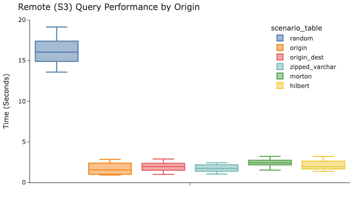
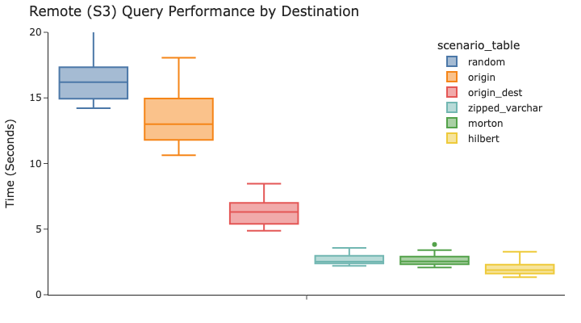
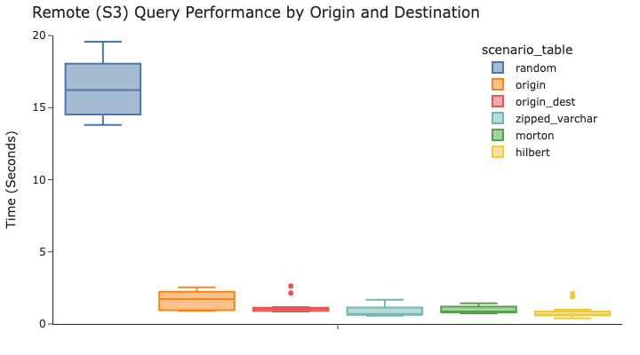
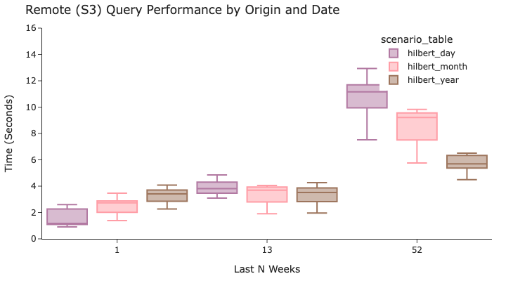
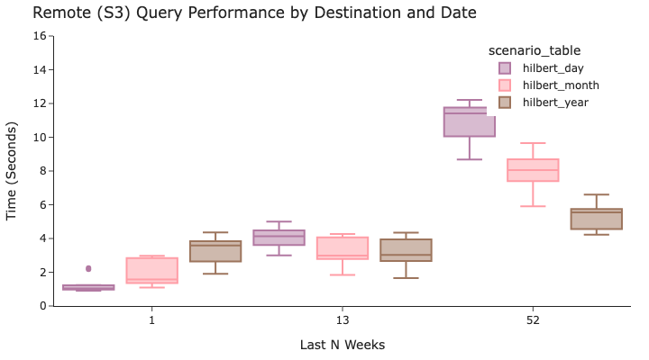
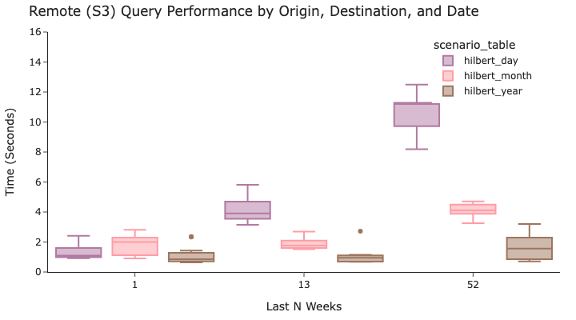
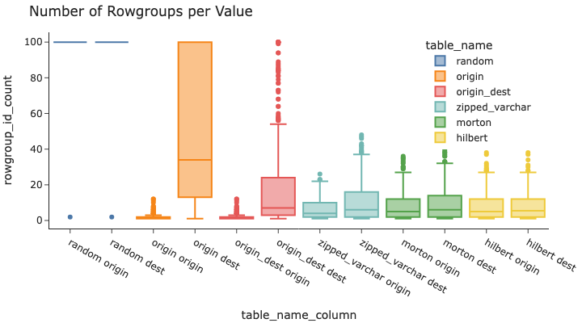

## DuckDB 存储编排优化 之 任意字段组合过滤  
          
### 作者          
digoal          
          
### 日期          
2025-06-09          
          
### 标签          
PostgreSQL , PolarDB , DuckDB , 存储编排 , 任意字段组合过滤 , 相邻数据聚集存储 , 一维编排 cluster , hilbert , 希尔伯特 , z-order , zipped 混合多字段编排         
          
----          
          
## 背景         
任意字段组合过滤, 你会想到什么?   
- 多字段组合GIN索引. 任意字段等值过滤.  
- bloom filter? 任意字段组合等值过滤. 不存在一定不存在, 存在不一定存在.  
- 或者从存储编排角度, 让相邻数据尽可能编排在聚集的数据块内. 例如 : 线性化降维(Hilbert & Z-Order)   
    - 演变自一维数据编排: cluster .    
  
我针对任意字段组合过滤, 写过一些相关的文章如下, 欢迎参考阅读 ( https://github.com/digoal/blog ) :   
- [《从一维编排到多维编排，从平面存储到3D存储 - 数据存储优化之路》](../201706/20170614_01.md)    
- [《他山之石可以攻玉 | 向量召回IO性能问题解决之道 - 线性化降维(Hilbert & Z-Order)》](../202412/20241213_03.md)    
- [《PostgreSQL z-order , morton 排序插件 - GIS常用》](../202003/20200324_11.md)    
- [《PostgreSQL PostGIS 3 - 从min(x) 到 z-order 到 Hilbert Geometry Sorting - PostGIS空间排序算法优化》](../201908/20190803_03.md)    
- [《沉浸式学习PostgreSQL|PolarDB 15: 企业ERP软件、网站、分析型业务场景、营销场景人群圈选, 任意字段组合条件数据筛选》](../202309/20230908_02.md)    
- [《使用 PolarDB 开源版 bloom filter index 实现任意字段组合条件过滤》](../202212/20221222_05.md)    
- [《PostgreSQL 应用开发解决方案最佳实践系列课程 - 7. 标签搜索和圈选、相似搜索和圈选、任意字段组合搜索和圈选系统》](../202105/20210510_01.md)    
- [《PostgreSQL 任意字段组合搜索 - rum 或 多字段 bitmapscan 对比》](../202005/20200520_02.md)    
- [《PostgreSQL+MySQL 联合解决方案 - 第10课视频 - 任意字段、维度组合搜索（含GIS、数组、全文检索等属性）》](../202001/20200114_01.md)    
- [《PostgreSQL 任意字段组合查询 - 含128字段，1亿记录，任意组合查询，性能》](../201903/20190320_02.md)    
- [《PostgreSQL 任意字段数组合 AND\OR 条件，指定返回结果条数，构造测试数据算法举例》](../201809/20180905_03.md)    
- [《PostgreSQL 设计优化case - 大宽表任意字段组合查询索引如何选择(btree, gin, rum) - (含单个索引列数超过32列的方法)》](../201808/20180803_01.md)    
- [《PostgreSQL ADHoc(任意字段组合)查询(rums索引加速) - 非字典化，普通、数组等组合字段生成新数组》](../201805/20180518_02.md)    
- [《PostgreSQL 实践 - 实时广告位推荐 2 (任意字段组合、任意维度组合搜索、输出TOP-K)》](../201804/20180424_04.md)    
- [《PostgreSQL 实践 - 实时广告位推荐 1 (任意字段组合、任意维度组合搜索、输出TOP-K)》](../201804/20180420_03.md)    
- [《PostgreSQL ADHoc(任意字段组合)查询 与 字典化 (rum索引加速) - 实践与方案1 - 菜鸟 某仿真系统》](../201802/20180228_01.md)    
- [《PostgreSQL 如何高效解决 按任意字段分词检索的问题 - case 1》](../201607/20160725_05.md)    
- [《时间、空间、对象多维属性 海量数据任意多维 高效检索 - 阿里云RDS PostgreSQL最佳实践》](../201707/20170722_01.md)    
- [《PostgreSQL 多维空间几何对象 相交、包含 高效率检索实践 - cube》](../201810/20181015_01.md)    
  
本文是DuckDB官方blog, 与以上文章有一个共同点. 也提到了任意字段组合过滤, 文中除了z-order和希尔伯特排序, 又增加了一种zipped(混合字段编排)的介绍, 有点意思.   
  
当然了这不是DuckDB独有的, 所有采用堆存储的数据库都通用, 例如PostgreSQL.    
  
总之在进行“让相邻数据尽可能编排在聚集的数据块内”这样的优化后, 在进行任意字段组合条件过滤时, 极大的降低了需要扫描的数据块(通过类似Parquet min-max的Row Group统计信息, 提前过滤), 得到了非常可观的性能提升效果.   
  
原文: https://duckdb.org/2025/06/06/advanced-sorting-for-fast-selective-queries.html  
  
---   
  
# 原文翻译  
  
TL;DR：对于任何列式数据格式，在加载数据时使用高级多列排序可以提升各种选择性读取查询的性能。空间填充曲线编码（例如 Morton（Z 顺序）和 Hilbert）可以近似地将多列同时排序。按四舍五入的时间戳(实际上就是时间戳截断, 例如按日、周、月、年等截断)排序在筛选近期数据时会带来额外的好处。  
  
  
  
仪表板上只有一个图表的情况很少见。只以一种方式查询数据的情况更是少之又少。完全不使用任何筛选器进行查询的情况更是少之又少！  
  
当查询读取总行数的子集时，在加载时对数据进行排序会带来显著的好处。请参阅[本系列的上一篇文章](https://duckdb.org/2025/05/14/sorting-for-fast-selective-queries.html)，了解此方法的工作原理以及实用技巧！  
  
为了在更广泛的现实世界案例中看到这些好处，我们必须更具创造力。以下这些先进技术在以下情况中非常有用：  
- 查询根据不同的列进行过滤  
- 查询样式并非完全可预测  
- 查询按时间和至少一个其他列进行过滤  
  
在这篇文章中，我们描述了几种先进的排序策略，并将它们与一些实验（微基准）进行了比较，然后计算了一个指标来衡量它们的有效性。  
  
## 策略  
我们不想按一列或少数几列进行精确排序，而是希望按大量列进行近似排序。这样，不同WHERE子句的查询都能从 DuckDB 的最小-最大索引（区域图, 类似Parquet row group 的统计信息）中受益。本文将介绍两种高级方法，并分别提供几个示例：按空间填充曲线排序和按截断时间戳排序。  
  
## 空间填充曲线  
Morton 和 Hilbert 都是空间填充曲线算法，旨在将多个列合并成一个顺序，同时保留两列的近似顺序。空间填充曲线的一个应用是地理空间分析，这是一个很有帮助的例子。  
  
如果一个数据集包含地球上每家咖啡馆的经纬度坐标（每家咖啡馆占一行），但我们希望按物理位置相邻的咖啡馆在列表中彼此靠近的方式进行排序，则可以使用空间填充曲线。经纬度都比较接近的咖啡馆将获得类似的 Morton 或 Hilbert 编码值。这将使我们能够快速执行诸如“在地图上查找此矩形区域内的所有咖啡馆”之类的查询。（在地理空间领域，这样的矩形区域被称为边界框！）本文顶部的 GIF展示了 Hilbert 编码的不同粒度级别——想象一下，如果 x 轴是经度，y 轴是纬度。Hilbert 算法中的“之字形”线是按近似排序的咖啡馆列表。  
  
Morton 和 Hilbert 都对整数或浮点数进行操作，但本文概述了一种使用 VARCHAR 对列进行排序的方法。作为预处理步骤，我们使用 SQL 宏将VARCHAR列的前几个字符转换为整数。   
  
## 截断时间戳  
越新的数据往往越有用，因此查询通常会根据时间列进行筛选。然而，查询通常也会根据时间和其他列进行筛选。  
  
不要只根据时间戳列进行排序！ 这样会错失性能优势。这是因为时间戳通常粒度非常细，实际上数据只能按时间戳排序。你的数据在 2025-01-01 01:02:03.456789 处插入了多少行？可能只有一行！  
  
要对多个列以及时间列进行排序，首先按截断时间戳（截断到一天、一周、一年等的开始）进行排序，然后对其他列进行排序。  
  
## “准点航班” 数据集  
有没有想过，当你准备乘飞机时，航班延误的可能性有多大？如果你在美国旅行，可以使用政府数据集来查看每条航线的准点率！你可以在其官方网站上获取更多关于该数据集的详细信息，但我从 Kaggle 获取了 Parquet 版本的数据。( https://www.transtats.bts.gov/DatabaseInfo.asp?QO_VQ=EFD%20&Yv0x=D )  ( https://www.kaggle.com/datasets/robikscube/flight-delay-dataset-20182022 ) 它包含了近 5 年的美国航班数据。Parquet 文件加起来大约有 1.1 GB。在本地访问时，这个大小相当小，但在速度慢的远程连接上访问起来可能更具挑战性。在本文的其余部分，我们将运行不同的基准测试，以演示如何通过剪枝来减少回答某些查询所需的网络流量。  
  
我们的第一个实验是一个假设的用例，用于提供一个仪表板，用户可以在其中探索单个origin(出发地)、单个dest（目的地）或origin-dest对。origin和dest列是三个字母的机场代码（例如LAX或JFK）。我们假设，一旦您选择了其中一个过滤器，您就会想要所有匹配的行和一些任意列。  
  
我们的第二个实验将添加一个时间组件，我们的假设用户可以额外过滤数据集中最新的 1、13 或 52 周的数据。    
  
## 实验设计  
我们将展示一些对数据进行粗略排序的方法，以加快检索速度。  
  
对照组为：  
- random：按哈希排序——最糟糕的情况！  
- origin：origin 单列排序  
- origin-dest：按 origin 排序，然后按 destination  
  
我们的替代排序方法是：  
- zipped_varchar：每次按一个字母排序，在origin和destination之间交替。—— 例如，一个origin of ABC和 一个 destination of XYZ 将变成 AXBYCZ，然后对其进行排序。  
- morton：将origin和destination转换为整数，然后按Morton 编码（Z 顺序）排序  
- hilbert：将origin和destination转换为整数，然后按Hilbert 希尔伯特编码排序  
  
该zipped_varchar算法使用 SQL 宏实现，因此无需扩展。它还可以处理任意长度的字符串。  
  
Morton 和 Hilbert 编码函数来自lindel DuckDB 社区扩展( https://duckdb.org/community_extensions/extensions/lindel.html )，由Rusty Conover贡献。感谢 Rust 以及lindel构建DuckDB 扩展所基于的Rust crate 的各位！该spatial扩展还包含一个类似的ST_Hilbert函数。感谢Max Gabrielsson和 GDAL 社区！  
  
这些图表显示了从托管在 S3 上的 DuckDB 文件中提取数据时的查询运行时间。这些技术也可以成功应用于DuckLake ！DuckLake 是云数据湖的现代演进—— 如果您还没有看过发布文章，请花点时间查看！ [《再见分布式湖仓一体, 你好DuckLake》](../202505/20250528_02.md)   DuckLake 新增了分区的概念，可以跳过整个文件。要充分利用 DuckLake，首先要对数据进行分区（按时间或其他方式），然后在加载数据时应用本文中的技术。  
  
所有实验均在搭载 DuckDB v1.2.2 的 M1 MacBook Pro 上运行。测试使用 DuckDB Python 客户端进行，结果以 Apache Arrow 表的形式返回。在每次查询之间，DuckDB 连接都会关闭并重新创建（此时间不计入结果）。这是为了更好地模拟我们假设用例中单个用户访问仪表板的体验。  
  
基本排序查询:  
  
为了便于复现，以下是最初从 Parquet 加载数据时使用的标准查询：随机排序、按 origin 排序、按 origin 排序 然后按 destination 排序。Parquet 文件是从 Kaggle下载的。  
```  
CREATE TABLE IF NOT EXISTS flights AS  
    FROM './Combined_Flights*.parquet';  
  
-- The hash function is used instead of random  
-- for consistency across re-runs  
CREATE TABLE IF NOT EXISTS flights_random AS  
    FROM flights  
    ORDER BY hash(rowid + 42);  
  
CREATE TABLE IF NOT EXISTS flights_origin AS  
    FROM flights  
    ORDER BY origin;  
  
CREATE TABLE IF NOT EXISTS flights_origin_dest AS  
    FROM flights  
    ORDER BY origin, dest;  
```  
  
zipped VARCHAR 排序查询:   
  
作为一个无需扩展的方法示例，此 SQL 宏大致近似于空间填充曲线方法，但使用字母数字字符代替整数。结果是一个数据集，既按一列排序，又按另一列排序。  
```  
CREATE OR REPLACE FUNCTION main.zip_varchar(i, j, num_chars := 6) AS (  
    -- By default using 6 characters from each string so that  
    -- if data is ASCII, we can fit it all in 12 bytes so that it is stored inline  
    -- rather than requiring a pointer  
    [  
        list_value(z[1], z[2])  
        FOR z  
        IN list_zip(  
            substr(i, 1, num_chars).rpad(num_chars, ' ').string_split(''),  
            substr(j, 1, num_chars).rpad(num_chars, ' ').string_split('')  
        )  
    ].flatten().array_to_string('')  
);  
  
CREATE TABLE IF NOT EXISTS flights_zipped_varchar AS  
    FROM flights  
    ORDER BY  
        main.zip_varchar(origin, dest, num_chars := 3);  
```  
  
以下是该函数产生的输出示例zip_varchar：  
```  
SELECT  
    'ABC' AS origin,  
    'XYZ' AS dest,  
    main.zip_varchar(origin, dest, num_chars := 3) AS zipped_varchar;  
```  
  
origin	| dest	| zipped_varchar  
---|---|---  
ABC	| XYZ	| AXBYCZ  
  
  
Morton 和 Hilbert 排序查询:   
  
空间填充曲线的目标是将多个维度（在我们的例子中是两个：origin和destination）映射到单个维度，但保留数据点之间高维空间的局部性。Morton 和 Hilbert 编码旨在接受整数或浮点数。然而，在我们的示例中，我们希望将这些技术应用于VARCHAR列。  
  
字符串实际上会按每个长度编码大量的数据。这是因为数字每位只能有 10 个值（在我们的十进制计数系统中），而字符串可以有更多值（所有小写字母、大写字母或符号）。因此，我们无法将非常长的字符串编码为整数 —— 只能编码前几个字符。但这仍然适用于我们的近似排序用例！  
  
此 SQL 函数可以将包含 ASCII 字符（最多 8 个字符）的VARCHAR转换为 UBIGINT。它将 VARCHAR 拆分成单个字符，计算该字符的 ASCII 码，将其转换为位，将这些位连接在一起，然后转换为 UBIGINT。  
```  
CREATE OR REPLACE FUNCTION main.varchar_to_ubigint(i, num_chars := 8) AS (  
    -- The maximum number of characters that will fit in a UBIGINT is 8  
    -- and a UBIGINT is the largest type that the lindel community extension accepts for Hilbert or Morton encoding  
    list_reduce(  
        [  
            ascii(my_letter)::UTINYINT::BIT::VARCHAR  
            FOR my_letter  
            IN (i[:num_chars]).rpad(num_chars, ' ').string_split('')  
        ],  
        (x, y) -> x || y  
    )::BIT::UBIGINT  
);  
```  
  
然后可以在子句中使用 DuckDB lindel extension 中的morton_encode和hilbert_encode函数按 Morton 或 Hilbert 编码进行排序。ORDER BY  
```  
INSTALL lindel FROM community;  
LOAD lindel;  
  
CREATE TABLE IF NOT EXISTS flights_morton AS  
    FROM flights  
    ORDER BY  
        morton_encode([  
            varchar_to_ubigint(origin, num_chars := 3),  
            varchar_to_ubigint(dest, num_chars := 3)  
        ]::UBIGINT[2]);  
  
CREATE TABLE IF NOT EXISTS flights_hilbert AS  
    FROM flights  
    ORDER BY  
        hilbert_encode([  
            varchar_to_ubigint(origin, num_chars := 3),  
            varchar_to_ubigint(dest, num_chars := 3)  
        ]::UBIGINT[2]);  
```  
  
或者，该spatial扩展可用于执行希尔伯特编码。它需要提供一个边界框，因为这有助于确定地理空间用例的编码粒度。它的表现与实验结果中包含的希尔伯特方法类似。  
```  
SET VARIABLE bounding_box = (  
    WITH flights_converted_to_ubigint AS (  
        FROM flights  
            SELECT  
            *,  
            varchar_to_ubigint(origin, num_chars := 3) AS origin_ubigint,  
            varchar_to_ubigint(dest, num_chars := 3) AS dest_ubigint  
        )  
    FROM flights_converted_to_ubigint  
    SELECT {  
        min_x: min(origin_ubigint),  
        min_y: min(dest_ubigint),  
        max_x: max(origin_ubigint),  
        max_y: max(dest_ubigint)  
    }::BOX_2D  
);  
CREATE OR REPLACE TABLE flights_hilbert_spatial AS  
    FROM flights  
    ORDER BY  
        ST_Hilbert(  
            varchar_to_ubigint(origin, num_chars := 3),  
            varchar_to_ubigint(dest, num_chars := 3),  
            getvariable('bounding_box')  
        );  
```  
  
用于衡量性能的选择性读取查询:   
  
综上所述，本次微基准测试：  
- 按 6 种不同方法排序的表  
- 使用三种查询模式进行过滤：origin、destination 以及 origin / destination 上的过滤器  
- 使用 4 个不同的 origin/dest 数据对进行过滤：  
    - SFO – LAX  
    - LAX – SFO  
    - ORD – LGA  
    - LGA – ORD  
  
这 72 个唯一查询每个都重复 3 次，总共 216 个查询。所有查询都包含在结果图中。  
```  
FROM sorted_table  
SELECT flightdate, airline, origin, dest, deptime, arrtime  
WHERE origin = origin;  
  
FROM sorted_table  
SELECT flightdate, airline, origin, dest, deptime, arrtime  
WHERE dest = dest;  
  
FROM sorted_table  
SELECT flightdate, airline, origin, dest, deptime, arrtime  
WHERE origin = origin AND dest = dest;  
```  
  
## 实验结果  
  
  
我们可以看到，当按 origin 进行筛选时，origin 单列排序比随机分布的数据快一个数量级，只需要 1.6 秒而不是 16 秒。我们的先进技术(指 row group min/max 统计信息)几乎与 origin 上的专用排序一样快。  
  
  
  
然而，如果你看一下destination图表，我们就能看出更平衡的技术的价值。origin_dest仅仅将destination数据添加到已排序列列表中的方法错失了许多好处。  
  
  
  
当查询特定的origin和destination对时，所有方法都比随机方法快得多。然而，如果将目光聚焦于非随机技术，更高级的排序方法的速度与按origin 或 先按 origin 排序再按 destination 的速度一样快或略快。由于需要读取的数据更少（因为过滤器的选择性更强），性能也比其他实验更快。  
  
<b> 希尔伯特编码方法在三种查询模式中提供了最一致的性能。它是支持所有三种工作负载的最佳选择。</b>   
  
## 截断时间排序  
按“近似时间”排序涉及将时间截断为特定时间粒度的最近值。在本实验中，我们使用 3 种不同的排序方法加载数据。首先，我们按flightdate列截断进行排序，截断为日、月或年。然后，我们使用最有效的多列方法，按 的希尔伯特编码排序，先按origin然后按 dest排序。  
  
在衡量性能时，我们会测试之前测试过的每个查询模式（基于origin、destination和origin/ 的过滤器destination），但另外还会基于三个不同的时间范围进行过滤：最近 1 周、13 周和 52 周。  
  
排序查询的大致时间:  
  
```  
CREATE TABLE IF NOT EXISTS flights_hilbert_day AS  
    FROM flights  
    ORDER BY  
        date_trunc('day', flightdate),  
        hilbert_encode([  
            varchar_to_ubigint(origin, num_chars := 3),  
            varchar_to_ubigint(dest, num_chars := 3)  
        ]::UBIGINT[2]);  
  
CREATE TABLE IF NOT EXISTS flights_hilbert_month AS  
    FROM flights  
    ORDER BY  
        date_trunc('month', flightdate),  
        hilbert_encode([  
            varchar_to_ubigint(origin, num_chars := 3),  
            varchar_to_ubigint(dest, num_chars := 3)  
        ]::UBIGINT[2]);  
  
CREATE TABLE IF NOT EXISTS flights_hilbert_year AS  
    FROM flights  
    ORDER BY  
        date_trunc('year', flightdate),  
        hilbert_encode([  
            varchar_to_ubigint(origin, num_chars := 3),  
            varchar_to_ubigint(dest, num_chars := 3)  
        ]::UBIGINT[2]);  
```  
  
用于衡量性能的选择性读取查询:   
  
综上所述，本次微基准测试：  
  
查询表flightdate按三个粒度级别进行截断排序：日、月、年，然后进行希尔伯特编码。  
- 按三个时间范围进行过滤：最近 1 周、13 周和 52 周  
- 根据origin、destination和 origin/destination 进行过滤  
- 使用 4 个不同的origin/dest对进行过滤：  
    - SFO – LAX  
    - LAX – SFO  
    - ORD – LGA  
    - LGA – ORD  
  
这 108 个唯一查询均重复 3 次，总共 324 个查询。  
  
```  
FROM sorted_table  
SELECT flightdate, airline, origin, dest, deptime, arrtime  
WHERE  
    origin = origin  
    AND flightdate >= ('2022-07-31'::TIMESTAMP – INTERVAL time_range WEEKS);  
  
FROM sorted_table  
SELECT flightdate, airline, origin, dest, deptime, arrtime  
WHERE  
    dest = dest  
    AND flightdate >= ('2022-07-31'::TIMESTAMP – INTERVAL time_range WEEKS);  
  
FROM sorted_table  
SELECT flightdate, airline, origin, dest, deptime, arrtime  
WHERE  
    origin = origin  
    AND dest = dest  
    AND flightdate >= ('2022-07-31'::TIMESTAMP – INTERVAL time_range WEEKS);  
```  
  
  
  
查询origin在特定某一周的数据时，按日排序效果最佳。然而，在分析最近 13 周或 52 周的数据时，按更近似的时间（月或年）排序效果更佳。这是因为更近似的时间段允许希尔伯特编码更有效地将origin分成不同的行组。  
  
  
  
按时间和目的地查询遵循非常相似的模式，理想的排序顺序高度依赖于分析的时间长度。  
  
  
  
使用origin和destination进行筛选的结果截然不同，其中年度粒度的筛选结果全面优于其他筛选！这是因为当时间戳排序非常近似时，origin和destination筛选器在跳过行组方面更加有效。  
  
因此，在这三种工作负载之间，最佳的折衷方案很可能是采用非常接近年度的粒度。瞧！别只按时间戳排序！  
  
## 表创建耗时  
要获得这些好处，前期投入是插入数据时需要花时间进行排序。通常来说，这仍然是一个很好的权衡——数据插入通常在后台进行，但没有人愿意盯着仪表盘的加载旋转器！  
  
从 Parquet 文件创建未排序的 DuckDB 表耗时略超过 21 秒。其他方法都是从未排序的 DuckDB 表中复制数据并创建新表。各种排序方法所需的时间相似（在 48 到 61 秒之间），因此我们可以自由选择最有效的方法，而无需考虑相对的插入性能。然而，值得注意的是，任何排序都会使整体插入性能降低近 3 倍。  
  
Table name	| Creation time (s)  
---|---  
from_parquet	|21.4  
random	|60.2  
origin	|51.9  
origin_dest	|48.7  
zipped_varchar	|58.2  
morton	|54.6  
hilbert	|58.5  
hilbert_day	|58.7  
hilbert_month	|53.8  
hilbert_year	|60.2  
  
## 测量排序性 (数据分布聚集性)  
选择排序顺序最有效的方法是模拟生产工作负载，就像上面的实验一样。然而，这并不总是可行或容易做到的。相反，我们可以测量数据集在目标列上的排序效果。我们将使用的指标是“每个值的行组数量” (也就是这个字段的每个值可能落在多少个 row group内, rg越少代表这个字段的这个值在存储中越聚集, 过滤性越好!) 。解释一下，为了使选择性查询有效，每个被过滤的值应该只出现在少数行组中。行组数量越少越好！然而，当这个指标低于 DuckDB 使用的线程数时，收益可能会递减。  
  
其他数据库系统测量类似的指标，称为“聚类深度”。  
  
  
  
从这张图中可以解读出什么？随机排序几乎将每个值分散到 100 个或更多的行组中（为了便于阅读，可视化结果截断为 100 个行组）。这凸显了随机排序对于选择性查询来说会非常慢！按排序可以大大减少每个值分散的origin行组数量，但origin仍然分布广泛。按origin 和 destination排序可以保持 origin 的紧密分布，并略微改善 destination 的指标。  
  
三种高级方法（zipped_varchar、morton和hilbert）更加均衡，origins 和destinations 都仅出现在中等数量的行组中。虽然它们在该origin指标上的得分比直接按 origin排序时要低一点点，但大多数origins 分布在比现代笔记本电脑处理器核心数更少的行组中，因此保留了高性能。<b> 希尔伯特编码是最均衡的，因此按照这个指标，它也应该被宣布为胜利者！</b>  
  
也就是说, 在采用 多字段混合编排 排序后, 每个字段的值在row group中的分布都更加紧凑了. ( 很难理解的话, 想象一下PostgreSQL BRIN索引的原理即可 )  
  
为了计算这个指标，我们使用动态 SQL 和query表函数定义了几个 SQL 宏。  
  
用于计算“每个值的行组数量”的宏  
```  
-- These are helper functions for writing dynamic SQL  
-- sq = single quotes  
-- dq = double quotes  
-- nq = no quotes  
CREATE OR REPLACE FUNCTION sq(my_varchar) AS (  
    '''' || replace(my_varchar,'''', '''''') || ''''  
);  
CREATE OR REPLACE FUNCTION dq(my_varchar) AS (  
    '"' || replace(my_varchar,'"', '""') || '"'  
);  
CREATE OR REPLACE FUNCTION nq(my_varchar) AS (  
    replace(my_varchar, ';', 'No semicolons are permitted here')  
);  
  
  
CREATE OR REPLACE FUNCTION dq_list(my_list) AS (  
    list_transform(my_list, (i) -> dq(i))  
);  
CREATE OR REPLACE FUNCTION nq_list(my_list) AS (  
    list_transform(my_list, (i) -> nq(i))  
);  
  
CREATE OR REPLACE FUNCTION dq_concat(my_list, separator) AS (  
    list_reduce(dq_list(my_list), (x, y) -> x || separator || y)  
);  
CREATE OR REPLACE FUNCTION nq_concat(my_list, separator) AS (  
    list_reduce(nq_list(my_list), (x, y) -> x || separator || y)  
);  
  
-- This function produces the "Number of row groups per Value" boxplot  
CREATE OR REPLACE FUNCTION rowgroup_counts(table_name, column_list) AS TABLE (  
    FROM query('  
    WITH by_rowgroup_id AS (  
        FROM ' || dq(table_name) || '  
        SELECT  
        ceiling((count(*) OVER ()) / 122_880) AS total_row_groups,  
        floor(rowid / 122_880) AS rowgroup_id,  
        ' || dq_concat(column_list, ',') || '  
    ), rowgroup_id_counts AS (  
    FROM by_rowgroup_id  
    SELECT  
        case ' ||  
        nq_concat(list_transform(column_list, (i) -> ' when grouping(' || dq(i) || ') = 0 then alias(' || dq(i) || ') '),' ')  
            || ' end AS column_name,  
        coalesce(*columns(* exclude (rowgroup_id, total_row_groups))) AS column_value,  
        first(total_row_groups) AS total_row_groups,  
        count(distinct rowgroup_id) AS rowgroup_id_count  
    GROUP BY  
        GROUPING SETS ( ' || nq_concat(list_transform(dq_list(column_list), (j) -> '(' || j || ')'), ', ') ||' )  
    )  
    FROM rowgroup_id_counts  
    SELECT  
        ' || sq(table_name) || ' AS table_name,  
        *  
    ORDER BY  
        column_name  
    ')  
);  
  
-- This is an optional function that can summarize the data  
-- as an alternative to boxplot charts  
CREATE OR REPLACE FUNCTION summarize_rowgroup_counts(table_name, column_list) AS TABLE (  
    FROM rowgroup_counts(table_name, column_list)  
    SELECT  
        table_name,  
        column_name,  
        total_row_groups,  
        min(rowgroup_id_count) AS min_cluster_depth,  
        avg(rowgroup_id_count) AS avg_cluster_depth,  
        max(rowgroup_id_count) AS max_cluster_depth,  
        map([0.1, 0.25, 0.5, 0.75, 0.9], quantile_cont(rowgroup_id_count, [0.1, 0.25, 0.5, 0.75, 0.9]))::JSON AS quantiles,  
        histogram(rowgroup_id_count, [1, 2, 3, 4, 5, 6, 7, 8, 9, 10, 11, 12, 13, 14, 15, 16, 32, 64, 128, 256])::JSON AS histograms,  
    GROUP BY ALL  
    ORDER BY ALL  
);  
```  
  
然后我们可以rowgroup_counts在任何表和任何列上调用该函数！  
```  
FROM rowgroup_counts('flights_hilbert', ['origin', 'dest']);  
```  
  
table_name	| column_name	| column_value	| total_row_groups	| rowgroup_id_count  
---|---|---|---|---  
flights_hilbert	| dest	| PSG	| 238| 	2  
flights_hilbert	| dest	| ESC	| 238| 	2  
flights_hilbert	| origin	| YUM	| 238	| 2  
…	| …| 	…| 	…	| …  
  
该rowgroup_id_count列用于测量特定列值存在于多少个不同的行组中，因此它可以指示 DuckDB 需要做多少工作来提取与该值相关的所有数据。  
  
此计算使用伪列rowid，并且要求数据以单批次方式插入才能完全准确。当数据以批次方式插入时，它只是一个近似指标。  
  
## 结论  
当将数据存储在列式文件格式（例如 DuckDB 数据库或 Parquet 文件）中时，按多列进行近似排序可以实现跨各种查询模式的快速读取查询。使用希尔伯特编码排序在多种工作负载下均能提供高性能，而先按年份排序，再按希尔伯特编码排序，在按时间筛选时也表现出色。  
  
得益于“每个值的行组数量”计算，我们可以按任意列测量任意表的排序情况，并且它能够预测我们观察到的实验性能。这样，我们可以尝试不同的排序方法并快速预测其有效性，而无需每次都对读取工作负载进行基准测试。  
  
当用户行为难以预测时（我们总是如此！），使用这些方法可以显著加快仪表板的交互速度。它们还可以与上一篇文章中概述的其他技术结合使用，以获得更多优势。数据总是千差万别，所以我们需要发挥创造力！  
  
祝大家使用DuckDB分析愉快！  
  
  
#### [期望 PostgreSQL|开源PolarDB 增加什么功能?](https://github.com/digoal/blog/issues/76 "269ac3d1c492e938c0191101c7238216")
  
  
#### [PolarDB 开源数据库](https://openpolardb.com/home "57258f76c37864c6e6d23383d05714ea")
  
  
#### [PolarDB 学习图谱](https://www.aliyun.com/database/openpolardb/activity "8642f60e04ed0c814bf9cb9677976bd4")
  
  
#### [PostgreSQL 解决方案集合](../201706/20170601_02.md "40cff096e9ed7122c512b35d8561d9c8")
  
  
#### [德哥 / digoal's Github - 公益是一辈子的事.](https://github.com/digoal/blog/blob/master/README.md "22709685feb7cab07d30f30387f0a9ae")
  
  
#### [About 德哥](https://github.com/digoal/blog/blob/master/me/readme.md "a37735981e7704886ffd590565582dd0")
  
  

  
