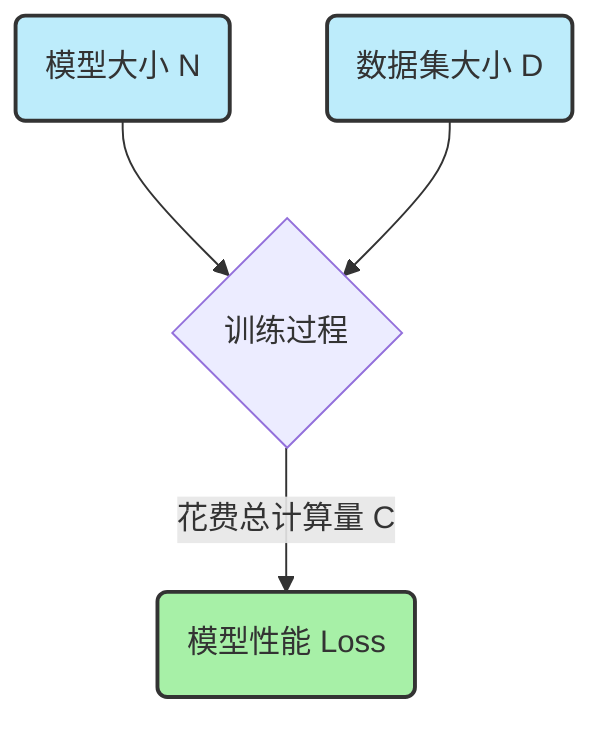
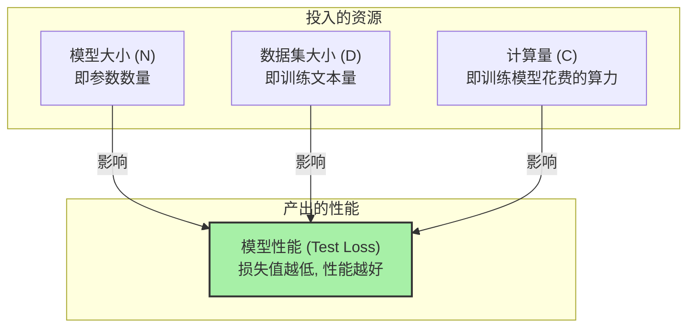
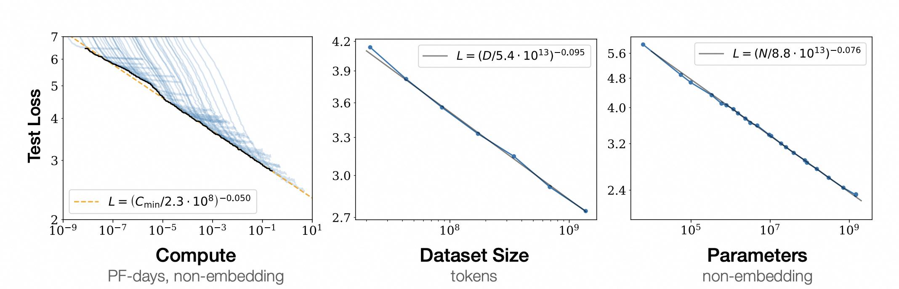

## AI论文解读 | Scaling Laws for Neural Language Models  
        
### 作者        
digoal        
        
### 日期        
2025-06-09        
        
### 标签        
PostgreSQL , PolarDB , DuckDB , AI , 论文解读        
        
----        
        
## 背景       
      
https://arxiv.org/pdf/2001.08361        
        
提示:        
```        
读懂《Scaling Laws for Neural Language Models》这篇论文需要提前掌握哪些基础知识, 请使用中文给我讲一下这些基础知识, 尽量通熟易懂, 可以使用markdown支持的图形增加解释性.        
        
使用中文通熟易懂的解读《Scaling Laws for Neural Language Models》这篇论文, 关键内容请深入讲解, 可以使用markdown支持的图形增加解释性.        
        
使用中文提取《Scaling Laws for Neural Language Models》论文中一些重要的术语并详细解释, 可以使用markdown支持的图形示增加解释性.        
```        
        
## 1 前置知识  
  
好的，没问题！读懂《Scaling Laws for Neural Language Models》这篇开创性的论文，确实需要一些前置知识。我会用尽量通俗易懂的语言，为你梳理这些核心概念。

这篇论文的核心思想可以一句话概括：**研究人员发现，只要我们持续地、按比例地增加三个关键要素——模型的大小、数据量和用于训练的计算资源——语言模型的性能就会以一种非常稳定、可预测的方式（即“幂律”关系）持续提升。**

为了理解他们是如何得出这个结论的，你需要掌握以下几个方面的基础知识：

---

###  🧠 第一部分：核心AI与机器学习概念

这些是理解几乎所有现代AI论文的基础。

1.  **神经网络 (Neural Network)**
    * **是什么**：把它想象成一个模仿人脑结构搭建的“黑箱”。它由许多层“神经元”组成，每一层都对输入信息进行一些计算和转换，然后传递给下一层。
    * **为什么重要**：神经网络特别擅长从数据中学习复杂的、难以用规则描述的模式。语言就是这样一种复杂的东西。

2.  **参数 (Parameters)**
    * **是什么**：就是神经网络这个“黑箱”里可以调节的“旋钮”。模型的参数越多，通常意味着模型结构越复杂，学习能力越强。论文中用 **N** 来表示（特指非嵌入参数）。
    * **为什么重要**：论文的一个核心发现就是，模型参数量 N 的大小，是决定模型最终性能的关键因素之一。

3.  **损失函数 (Loss Function)**
    * **是什么**：一个“评分函数”，用来衡量模型预测的答案和真实答案之间的差距。**损失值 (Loss) 越高，说明模型预测得越差**；反之，损失值越低，模型表现越好。
    * **为什么重要**：整个模型的“学习”或“训练”过程，目标就是通过不断调整参数（拧旋钮），来让这个**损失值变得尽可能低**。这篇论文主要使用的损失是 **交叉熵损失 (Cross-Entropy Loss)**，在语言模型里，它衡量的是模型对于预测下一个正确单词的“惊讶程度”，越不惊讶，损失越低。

4.  **训练 (Training) 与优化器 (Optimizer)**
    * **是什么**：训练就是“学习”的过程。我们把海量数据“喂”给模型，模型进行预测，计算损失值，然后一个叫做**优化器**（比如论文中提到的 **Adam**）的工具会根据损失值，告诉模型应该如何微调它的所有参数（旋钮），以便下次做得更好。这个过程会重复进行千百万次。
    * **为什么重要**：这是将一个随机的、什么都不会的神经网络变成一个强大语言模型的唯一途径。

5.  **过拟合 (Overfitting)**
    * **是什么**：一个非常重要的概念！想象一个学生，他把模拟题背得滚瓜烂熟（在训练集上损失很低），但一到正式考试（测试集）就考砸了，因为他只会死记硬背，没有学到真正的知识。这就是过拟合。
    * **为什么重要**：当模型太大而数据太少时，就容易发生过拟合。论文探讨了如何通过平衡模型大小 **N** 和数据集大小 **D** 来避免这种情况，实现最佳性能。

---

###  🗣️ 第二部分：语言模型与Transformer

这部分是论文研究的具体对象。

1.  **语言模型 (Language Model, LM)**
    * **是什么**：其核心任务非常单纯——**预测下一个词是什么**。比如，给它一句话 "The cat sat on the ___"，它会计算出 "mat"、"chair"、"floor" 等词出现的概率。
    * **为什么重要**：虽然任务简单，但当一个模型能极好地完成这个任务时，就意味着它对人类语言的语法、事实、逻辑甚至常识都有了深刻的“理解”。这是所有现代大模型（如GPT系列）的基础。

2.  **Transformer 架构**
    * **是什么**：目前最成功的神经网络架构，也是这篇论文研究的模型类型。它最大的法宝是**注意力机制 (Attention Mechanism)**。
    * **注意力机制**：允许模型在处理一个词时，能够“关注”到输入句子中所有其他相关的词，无论它们相隔多远。这使得Transformer能非常有效地理解长距离的依赖关系（比如一篇文章开头和结尾的呼应）。
    * **为什么重要**：Transformer的强大能力和并行计算效率，使得训练前所未有的大模型成为可能，这是“Scaling Law”（规模法则）能够被发现和验证的技术前提。

---

###  📈 第三部分：数学与实验基础

这是理解论文中“Law”（法则）的关键。

1.  **幂律 (Power Law)**
    * **是什么**：这是本文的灵魂！它是一种数学关系，形式为 $Y = kX^a$。它的一个神奇特性是，**当你在对数坐标系 (log-log plot) 中画出它时，它会呈现为一条直线**。
    * **为什么重要**：论文发现，模型的损失 (Loss) 与模型大小 (N)、数据集大小 (D)、计算量 (C) 之间就存在这种幂律关系。这意味着性能的提升是平滑、可预测的。只要你有更多的资源，你就能准确预测出模型性能会提高多少，这为投入巨资训练大模型提供了理论依据和信心。

    下图展示了普通坐标和对数坐标下的幂律关系：
    * 左边是普通坐标，曲线变化剧烈。
    * 右边是 **Log-Log 坐标**，关系变成了一条清晰的直线。这正是论文中大量图表所展示的形式。

    ```mermaid
    graph TD
        subgraph 普通坐标
            direction LR
            A[Y] -->|Y = kX^a| B(X);
            C((曲线))
        end
        subgraph Log-Log 坐标
            direction LR
            D["log(Y)"] -->|"log(Y) = a*log(X)+log(k)"| E("log(X)");
            F((直线))
        end
    ```

2.  **计算量 (Compute)**
    * **是什么**：指训练模型所花费的总计算资源。论文中用 **PF-days** (Petaflop-days) 作为单位。1 PF-day 等于一台每秒能进行 $10^{15}$ 次浮点运算的计算机运行一整天的计算量。
    * **为什么重要**：计算量是训练大模型的“预算”。论文的一个核心贡献就是给出了在**固定计算预算**下，如何最优地分配资源给模型大小 (N) 和数据量 (D)，以达到最低的损失。

### 总结与关系图

总而言之，你需要带着以下问题去阅读论文：模型性能（用 **Loss** 衡量）是如何随着模型参数量（**N**）、数据集大小（**D**）和总计算量（**C**）的变化而变化的？

它们之间的关系可以用下图来简单理解：



这篇论文通过大量的实验，为这三者与最终性能之间的关系找到了简洁优美的数学公式（幂律），揭示了通往更强AI模型的一条清晰路径：**大力出奇迹，而且这个奇迹是可以被精确预测的。**

掌握了这些知识，你就能更好地理解论文中的图表、公式以及作者得出的每一个结论了。祝你阅读顺利！
  
## 2 解读论文  
  
好的，我们来一起深入解读这篇里程碑式的论文——《Scaling Laws for Neural Language Models》。这篇论文之所以重要，是因为它将训练超大型语言模型这件充满不确定性的“炼丹”艺术，变成了一门可以预测和量化的“工程科学”。

### 论文核心思想一览

 简单来说，这篇论文通过大量实验发现并验证了一个惊人的结论：**语言模型的性能，与其三个核心要素——模型大小 (N)、数据集大小 (D) 和所用的计算量 (C)——之间存在着极其稳定的幂律关系 (Power-Law Relationship)**  。

这意味着，只要我们有足够的资源，就可以在开始一项耗资巨大的训练任务之前，就相对准确地预测出模型最终能达到的性能水平。

我们可以用一个简单的关系图来理解这几个要素如何共同影响最终的模型性能：



接下来，我们将深入探讨论文中的关键发现。

-----

### 关键发现一：平滑且可预测的“幂律”

 论文最重要的发现是，当其他两个因素不受限制时，模型性能（以测试集上的交叉熵损失 Loss 来衡量）会随着模型大小（N）、数据集大小（D）或计算量（C）的增加，严格按照幂律公式下降  。

 这种关系在对数-对数坐标图（log-log plot）上会呈现为一条完美的直线，横跨了超过7个数量级  。

1.  **模型大小 (N) 的影响**:

      *  在有足够多的数据和计算资源的前提下，模型的性能会随着其参数数量（非嵌入参数 N）的增加而稳定提升  。
      *  其关系大致为： $L(N) \\approx (\\frac{8.8 \\times 10^{13}}{N})^{0.076}$  。
      *  **通俗解读**：模型越大，性能越好。每当模型参数量 N 翻倍，模型的损失（可以理解为犯错率）就会以一个固定的比例下降  。

2.  **数据集大小 (D) 的影响**:

      *  对于一个足够大的模型，如果训练数据越多，模型的性能也越好  。
      *  其关系大致为： $L(D) \\approx (\\frac{5.4 \\times 10^{13}}{D})^{0.095}$  。
      * **通俗解读**：“喂”给模型的数据越多，它学到的知识就越扎实，最终表现也越出色。

3.  **计算量 (C) 的影响**:

      *  在采用最优模型和足够数据的情况下，投入的计算量越多，能达到的性能也越好  。
      *  其关系大致为： $L(C\_{min}) \\approx (\\frac{3.1 \\times 10^{8}}{C\_{min}})^{0.050}$  。
      * **通俗解读**：花越多的钱（算力），就能训练出越强的模型。

下图直观地展示了这种幂律关系，注意坐标轴都是对数尺度的，而数据点几乎完美地拟合在直线上。
  
图源：论文原文 Figure 1  
  
  
  
  
-----

### 关键发现二：模型越大，学习效率越高 (Sample Efficiency)

 这是一个非常重要的、甚至有些反直觉的发现：**更大的模型学习效率更高**  。

  *  **深入讲解**：要达到相同的性能水平（即相同的 Loss 值），大模型需要的训练数据量和训练步数，其实比小模型要**少**   。如下图所示，不同颜色的曲线代表不同大小的模型，纵轴是性能（Loss），横轴是处理过的 Tokens（数据量）。可以看到，更大（参数更多）的模型（如图中紫色、蓝色曲线）能够更快地达到较低的Loss值  。
  * **意义**：这颠覆了“大模型需要更多数据”的传统认知。虽然大模型最终能从更多数据中受益，但它的“学习天赋”更高，学得更快。

图源：论文原文 Figure 2  
  
  
  
-----

### 关键发现三：如何最优地使用计算资源？

既然资源是有限的，那么在固定的计算预算（Compute Budget）下，我们应该如何分配资源，是把模型做大，还是让它在更多数据上训练更久？

 论文给出了明确的答案：**应该训练一个非常大的模型，并且在它还远未完全收敛时就停止训练**  。

  *  **深入讲解**：当计算预算增加时，最明智的做法是把大部分新增的预算用于**增加模型的参数量 N**，而不是显著增加训练步数或数据量  。如下图所示，随着总计算量（横轴）10亿倍的增长：
      *  **最优模型大小** (Optimal model size) 增长得非常快 ( \>1,000,000x )  。
      *  而 **数据需求** (Data requirements) 增长得相对缓慢  。
      *  **串行训练步数** (Serial Steps) 几乎不增长   。大部分数据量的增加可以通过增大批次大小 (Batch Size) 来并行处理  。
  * **意义**：这为“大力出奇迹”提供了战略指导。与其把一个小模型翻来覆去地训练到极致，不如把资源投入到构建一个尽可能大的模型上，哪怕训练得不那么“充分”，效果反而更好。

-----

### 关键发现四：“体型”比“身材”重要 (Scale vs. Shape)

 论文还发现，模型的**总参数量（体型）是决定性能的关键，而这些参数具体如何分布，即模型的形状（身材）**，例如是更深（层数多）还是更宽（每层神经元多），影响则小得多  。

  *  **深入讲解**：在一系列总参数量固定但形状（如深度、宽度、注意力头的数量）不同的 Transformer 模型上进行实验，它们的最终性能都非常接近  。只要模型参数总量对了，具体的架构设计在很大范围内影响不大。
  * **意义**：这极大地简化了模型设计的过程。研究者不必再煞费苦心地去寻找某种“黄金架构比例”，而可以把精力集中在如何扩大模型规模上。

-----

### 论文的启示与“远方的矛盾”

**启示**：
 这篇论文的 Scaling Laws 如同物理学中的定律，为整个大模型领域提供了“导航图”。它揭示了通过扩大规模来提升AI能力的清晰、可预测的路径   。一个引人思考的推论是：“**大模型可能比大数据更重要**”  。

**一个有趣的矛盾与猜想**：
 论文在结尾处提出了一个深刻的矛盾。根据计算效率最优的原则，数据量的增长需求其实相当缓慢 ($D \\propto C^{0.27}$)   。但为了避免大模型过拟合，根据另一个公式推导，数据量又需要增长得快得多 ($D \\propto N^{0.74}$，而 $N \\propto C^{0.73}$ ，所以 $D \\propto C^{0.54}$)  。

 这两条增长曲线最终会相交   。作者推测，这个交叉点（大约在 $10^{12}$，即一万亿参数规模）可能意味着几件事  ：

1.  Scaling Laws 在此之后会失效。
2.   这可能是 Transformer 架构从现有语言数据中学习的性能极限点  。
3.  要突破这个点，可能需要质变的算法革新或全新的数据来源。

这个猜想为后续的研究指明了方向，也预示着AI的发展可能并非永无止境的暴力美学，或许在遥远的未来也会遇到瓶颈。

### 总结

《Scaling Laws for Neural Language Models》这篇论文的贡献是革命性的。它用严谨的实验和简洁的数学规律，证明了扩大模型规模是提升性能的有效且可预测的途径。它不仅为 GPT-3 等后续一系列超大模型的诞生奠定了理论基础，也深刻地塑造了整个AI领域的研究范式。
  
## 3 术语   
  
好的，这篇论文《Scaling Laws for Neural Language Models》中包含了许多核心术语，理解它们是掌握这篇论文精髓的关键。以下是一些重要术语的提取和详细解释。

---

### 交叉熵损失 (Cross-Entropy Loss, L)

*  **定义**: 这是论文中用来衡量语言模型性能的主要指标   。它通常以“nats”（自然单位）来度量  。

*  **深入讲解**: 你可以把交叉熵损失通俗地理解为模型的 **“错误分数”** 或 **“困惑度”** 。当模型需要预测一句话中的下一个词时，它会输出一个概率分布。如果正确答案在模型给出的概率中非常低（即模型对正确答案感到很“惊讶”），那么损失值就高；反之，如果模型认为正确答案理所当然（概率很高），损失值就低  。因此，**损失值 L 越低，代表模型性能越好**。整个训练过程的目标就是不断调整模型，以最小化这个损失值。

---

### 模型大小 (Model Size, N)

*  **定义**: 指的是模型中**不包括**词汇表嵌入（vocabulary embedding）和位置嵌入（positional embedding）的参数数量  。

*  **深入讲解**: 这一点是论文的一个关键洞察。作者们发现，如果把所有参数都算上，模型性能和参数量的关系会比较混乱。但只要把负责“查单词表”的嵌入层参数去掉，只关注模型真正的、负责计算和推理的核心参数 N，性能和模型大小的关系就呈现出异常清晰和稳定的规律  。N 代表了模型的核心“智力”水平。

---

### 计算量 (Compute, C)

*  **定义**: 指训练模型所消耗的总计算资源。论文中主要使用 **PF-days** (Petaflop-days) 作为单位，它约等于 $8.64 \times 10^{19}$ 次浮点运算  。

*  **深入讲解**: 计算量 C 是一个统一的成本度量标准。论文给出了一个估算公式： $C \approx 6 \times N \times B \times S$  。这个公式将几个关键的训练要素整合在了一起：
    * **N**: 模型大小
    * **B**: 批次大小 (Batch Size)
    * **S**: 训练步数 (Training Steps)

    因此，“计算量”不仅是训练了多久，而是综合了“多大的模型”用“多大的数据批次”训练了“多少步”的总和。

---

### 幂律 (Power Law)

*  **定义**: 一种两个变量之间的特殊数学关系，即一个变量是另一个变量的幂次方。论文发现，模型损失 L 与模型大小 N、数据集大小 D 和计算量 C 之间都严格遵循幂律关系  。

*  **深入讲解**: 这是整篇论文的灵魂。幂律关系意味着模型的性能提升是**平滑且可预测的**。在作者的实验范围内，性能提升没有出现“瓶颈”或“天花板”  。这种关系最直观的体现是，当我们在对数-对数坐标图（log-log plot）上绘制数据点时，它们会形成一条近乎完美的**直线**。这使得我们可以用简单的数学公式来预测，如果我把模型扩大10倍，性能大概会提升多少。

    ```mermaid
    graph TD
        subgraph "幂律关系 (Y = kX⁻ᵃ)"
            A["投入的资源 (X) <br> e.g., 模型大小 N"] --> B["产出的性能 (Y) <br> 即损失 L"];
        end
        subgraph 在Log-Log坐标图上的体现
            C["log(X)"] -->|呈现为一条直线| D["log(Y)"];
        end
        A -- 映射为 --> C;
        B -- 映射为 --> D;

        style B fill:#A7F0A7,stroke:#333,stroke-width:2px
        style D fill:#A7F0A7,stroke:#333,stroke-width:2px
    ```

---

### 样本效率 (Sample Efficiency)

*  **定义**: 指模型达到某一特定性能水平（即特定的损失值 L）所需的训练样本（数据）数量  。

*  **深入讲解**: 论文中一个非常重要的结论是：**更大的模型样本效率更高**  。通俗地说，就是“聪明的学生学得快”。要达到同样好的成绩（比如损失值降到3.0），一个10亿参数的模型需要的“刷题量”（训练数据），要比一个1亿参数的模型少得多。

---

### 计算效率最优的训练 (Compute-Efficient Training)

*  **定义**: 在拥有固定的计算预算（Compute Budget）时，能够达到最佳模型性能（最低损失）的训练策略  。

*  **深入讲解**: 论文给出的最优策略是：**训练一个参数规模尽可能大的模型，并且在它还远未完全收敛时就停止训练**  。这意味着，最划算的资源分配方式是把绝大部分预算用来增加模型的**规模 N**，而不是增加**训练时长 S**。与其用有限的算力把一个小模型训练到“毕业”，不如用同样的算力去训练一个大得多的模型，哪怕它只“读到一半”，其最终表现也会更好。

---

### 临界批次大小 (Critical Batch Size, $B_{crit}$)

*  **定义**: 在训练时，能够最有效地平衡“计算效率”（硬件利用率）和“时间效率”（收敛速度）的批次大小（Batch Size） 。

* **深入讲解**: $B_{crit}$ 是一个动态变化的阈值。
    *  当训练批次大小小于 $B_{crit}$ 时，增大批次可以显著提升硬件的并行计算效率，而几乎不牺牲收敛速度  。
    *  当批次大小超过 $B_{crit}$ 时，再增大批次对硬件效率的提升就微乎其微了，反而可能因为梯度更新不那么频繁而减慢收敛  。
    *  一个关键发现是， $B_{crit}$ 的值主要只跟模型当前的**损失 L** 有关，而和模型大小 N 本身基本无关  。这意味着，随着模型越来越强（L 越来越低），最优的批次大小也会动态变化。
    
## 参考        
        
https://arxiv.org/pdf/2001.08361        
        
        
<b> 以上内容基于DeepSeek、Qwen、Gemini及诸多AI生成, 轻微人工调整, 感谢杭州深度求索人工智能、阿里云、Google等公司. </b>        
        
<b> AI 生成的内容请自行辨别正确性, 当然也多了些许踩坑的乐趣, 毕竟冒险是每个男人的天性.  </b>        
  
  
#### [期望 PostgreSQL|开源PolarDB 增加什么功能?](https://github.com/digoal/blog/issues/76 "269ac3d1c492e938c0191101c7238216")
  
  
#### [PolarDB 开源数据库](https://openpolardb.com/home "57258f76c37864c6e6d23383d05714ea")
  
  
#### [PolarDB 学习图谱](https://www.aliyun.com/database/openpolardb/activity "8642f60e04ed0c814bf9cb9677976bd4")
  
  
#### [PostgreSQL 解决方案集合](../201706/20170601_02.md "40cff096e9ed7122c512b35d8561d9c8")
  
  
#### [德哥 / digoal's Github - 公益是一辈子的事.](https://github.com/digoal/blog/blob/master/README.md "22709685feb7cab07d30f30387f0a9ae")
  
  
#### [About 德哥](https://github.com/digoal/blog/blob/master/me/readme.md "a37735981e7704886ffd590565582dd0")
  
  

  
