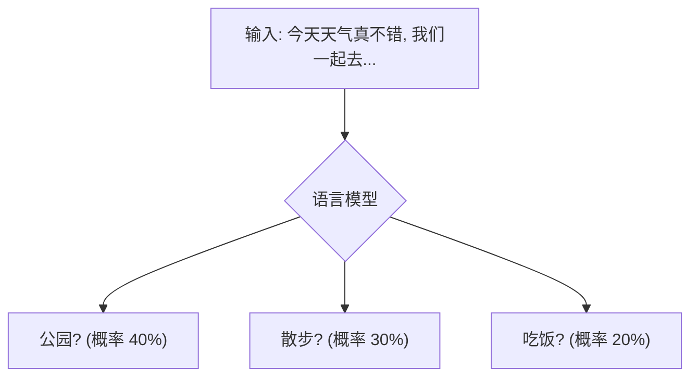
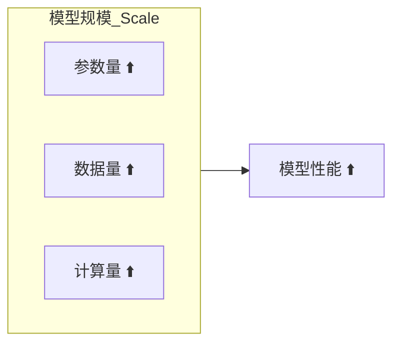
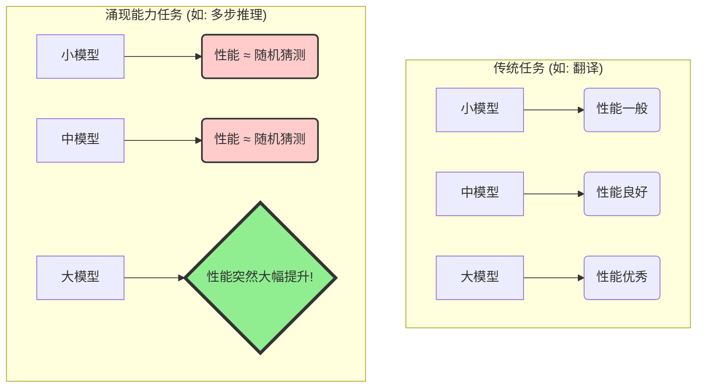
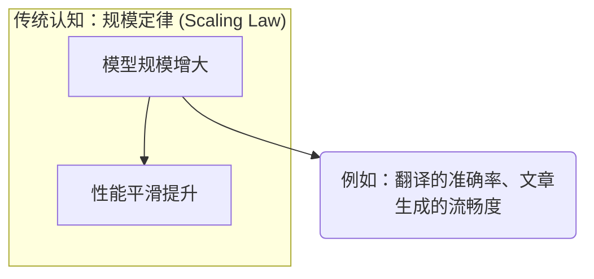
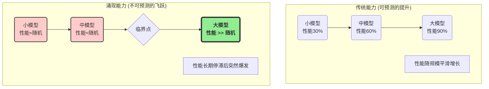
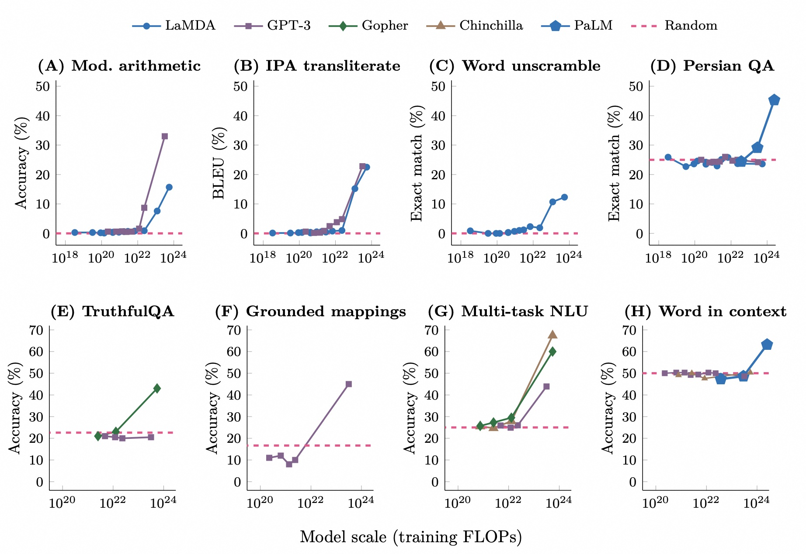
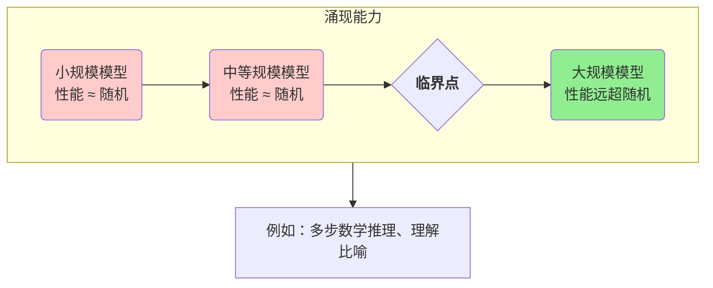
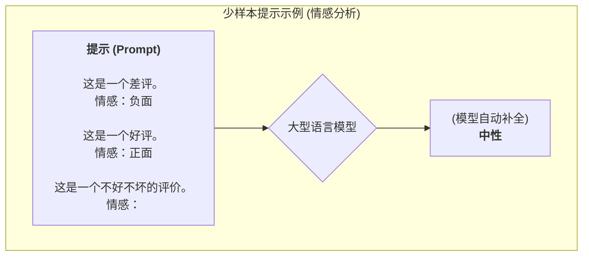
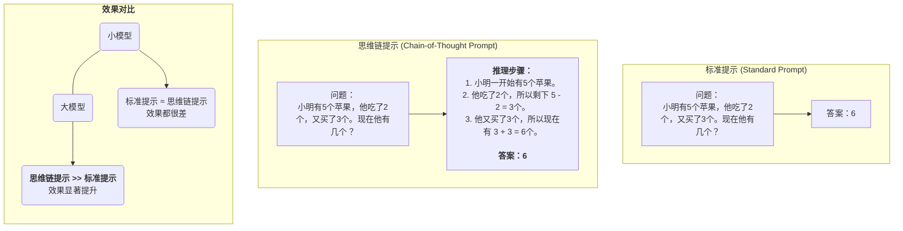

## AI论文解读 | Emergent Abilities of Large Language Models  
        
### 作者        
digoal        
        
### 日期        
2025-06-10        
        
### 标签        
PostgreSQL , PolarDB , DuckDB , AI , 论文解读        
        
----        
        
## 背景       
      
https://arxiv.org/pdf/2206.07682        
        
提示:        
```        
读懂《Emergent Abilities of Large Language Models》这篇论文需要提前掌握哪些基础知识, 请使用中文给我讲一下这些基础知识, 尽量通熟易懂, 可以使用markdown支持的图形增加解释性.        
        
使用中文通熟易懂的解读《Emergent Abilities of Large Language Models》这篇论文, 关键内容请深入讲解, 可以使用markdown支持的图形增加解释性.        
        
使用中文提取《Emergent Abilities of Large Language Models》论文中一些重要的术语并详细解释, 可以使用markdown支持的图形示增加解释性.        
```        
        
## 1 前置知识  
  
好的，为了让你能轻松读懂《大型语言模型的涌现能力》（Emergent Abilities of Large Language Models）这篇重要的AI论文，我为你梳理了几个必须提前了解的核心概念。我会用通俗易懂的语言，配合图示来解释。

### 核心概念概览

要理解这篇论文，你主要需要掌握以下几个知识点：

1.  **语言模型 (Language Models)**：它们是什么？
2.  **模型规模 (Model Scale)**：什么叫“大”型语言模型？
3.  **少样本提示 (Few-Shot Prompting)**：我们如何与这些模型互动？
4.  **涌现 (Emergence)**：这是论文的核心，是什么意思？

---

### 1. 语言模型 (Language Models)：聪明的“文字接龙”大师

想象一个非常擅长“文字接龙”的人。你给他说一句话的前半部分，他总能猜出最有可能的后半部分。语言模型（LM）做的就是类似的事情，但它是在海量的文字数据（比如整个互联网的文本）上训练出来的。

它的核心任务是 **预测下一个词**。

例如，你输入：“今天天气真不错，我们一起去...”，模型可能会预测出“公园”、“散步”或“吃饭”。



通过这种看似简单的“接龙”能力，语言模型可以完成各种复杂的任务，比如写文章、回答问题、翻译、写代码等。这篇论文中提到的模型（如GPT-3、LaMDA）都属于这类。

---

### 2. 模型规模 (Model Scale)：越大越“聪明”？

论文反复强调“**规模 (Scale)**”的重要性。模型的规模主要通过以下几个方面来衡量：

* **参数量 (Number of Parameters)**：可以把它想象成模型大脑中“神经元”的数量。参数越多，模型能记忆和处理的信息就越复杂。这篇论文中，模型的参数量从几亿（百万级）增长到几千亿（十亿级）。
* **训练数据量 (Training Data Size)**：模型“阅读”过的文本数量。读的书越多，知识就越渊博。
* **计算量 (Compute)**：训练模型所消耗的计算资源，通常用FLOPs（浮点运算次数）来衡量。

 论文的一个基本背景是，研究人员发现，随着模型规模的持续增大，其性能也会相应地、**可预测地**提升。   这就像一个学生的学习时间越长，考试分数通常也越高。



---

### 3. 少样本提示 (Few-Shot Prompting)：给个例子，它就会了

传统的AI模型通常需要大量的标注数据进行“微调”（Fine-tuning）才能学会一个新任务。但大型语言模型有一种更高效的学习方式，叫做“**提示 (Prompting)**”。

 特别是“**少样本提示 (Few-Shot Prompting)**”，你不需要训练模型，只需要在输入时给它几个例子（shots），它就能立刻理解你的意图并完成任务。  

**举个例子，假设你想让模型做情感分析：**

```
输入 (Prompt):
下面是一些电影评论和它们的情感分类：

评论: 这部电影太糟糕了。
情感: 负面

评论: 我很喜欢这部电影。
情感: 正面

评论: 这部电影很一般。
情感:
```

 模型在看到前两个例子后，就会明白你的要求，并自动为你补全第三个例子的情感为“**中性**”。这就是少样本提示的魔力，它让与AI的互动变得像和人对话一样简单。  

---

### 4. 涌现 (Emergence)：量变引起质变的神奇现象 核心概念

这是理解这篇论文**最关键**的概念。

通常我们认为，模型规模越大，性能越好，这种提升是平滑、可预测的。但研究者发现，对于某些特定任务，情况并非如此。

 **涌现 (Emergence)** 指的是一种能力：**在小规模模型上完全不存在，但当模型规模增长到某个临界点后，这种能力会突然出现，并且表现远超随机水平**。  

 这种能力的出现是**不可预测的**，无法通过小模型的性能表现简单推断出来。  

**一个直观的图示：**



论文中给出了很多“涌现能力”的例子，比如：

*  **多步算术运算**：小模型连简单的三位数加法都做不好，但当规模超过某个阈值后，模型突然就能正确解答。  
* **理解暗喻或笑话**：这需要复杂的推理能力，同样只在非常大的模型上才会“涌现”。

 这篇论文的核心贡献就是系统地定义、发现并列举了大型语言模型的多种“涌现能力”，并探讨了其背后的意义：简单地扩大规模，可能会带来我们意想不到的、全新的能力。  

### 总结

掌握了以上四个概念，你就可以轻松理解这篇论文的脉络了：

> 论文作者们发现，当他们不断**扩大语言模型 (1)** 的**规模 (2)** 时，观察到了一些非常神奇的**涌现能力 (4)**。这些能力在小模型上完全看不到，只有在模型大到一定程度后才会突然出现，尤其是在使用**少样本提示 (3)** 进行测试时。这说明，通往更强人工智能的道路，可能不仅仅是线性的优化，更充满了“量变引起质变”的惊喜。
  
## 2 解读论文  
  
好的，我们来一起深入解读这篇在人工智能领域具有里程碑意义的论文——**《大型语言模型的涌现能力》（Emergent Abilities of Large Language Models）**。

这篇论文的核心思想可以用一句中国的老话来概括：**量变引起质变**。它系统性地揭示了当AI模型变得足够“大”时，会突然获得一些出乎意料的、全新的能力，而这些能力在小模型上是完全看不到的。

### 论文核心一览：从“可预测”到“不可预测”的飞跃

 在解读之前，我们先要了解一个背景：在这篇论文发表之前，AI社区普遍认为模型性能的提升是**平滑且可预测的**。这个理念被称为“**规模定律 (Scaling Laws)**”  。

 **规模定律** 指出，随着模型参数、训练数据和计算量的增加，模型在各项任务上的性能会平滑地、可预测地变好  。



 然而，这篇论文投下了一颗“重磅炸弹”，它指出：对于某些任务，这种平滑的性能提升规律并不成立。相反，性能会像跨过一个门槛一样，发生“涌现”  。

---

### 深入讲解：到底什么是“涌现能力”？

这是理解整篇论文的**关键**。

 论文给出的定义是：**如果一种能力在小规模模型上不存在，但在大规模模型上存在，那么它就是“涌现能力”**  。

这句话有两层核心含义：

1.   **从无到有**：小模型的表现和随机猜测差不多  。你无论如何优化，它就是学不会。
2.   **突然爆发**：一旦模型规模跨过某个**临界点**，其性能会突然、急剧地提升，远超随机水平  。

 最重要的一点是，这种能力的出现是**不可预测的**。你无法通过观察小模型的性能曲线，来推断出“只要再扩大10倍，它就能学会”  。

我们可以用一个更直观的图来对比：



---

### 论文中的关键涌现案例

 论文通过大量实验，在多个任务上验证了“涌现”现象。这些任务大多是通过“**少样本提示 (Few-Shot Prompting)**”的方式进行测试的，即给模型几个例子，看它能否举一反三  。

#### 案例一：多步算术运算 (Multi-step Arithmetic)

*  **任务描述**：执行三位数加减法或两位数乘法  。
*  **涌现现象**：论文中的图表（Figure 2A）显示，对于GPT-3和LaMDA等模型，当训练计算量（FLOPs）低于 $10^{22}$ 级别时，模型的准确率几乎为零   。但当规模跨过这个门槛后，准确率突然飙升至40%以上  。小模型完全无法处理这类需要多个步骤才能解决的问题。

   

#### 案例二：大规模多任务语言理解 (MMLU)

*  **任务描述**：这是一个包含57个不同学科（如历史、法律、数学、计算机科学等）的综合性基准测试集  。
*  **涌现现象**：对于GPT-3、Gopher等模型，当参数量小于约100亿时，其平均表现与随机猜测无异   。然而，当规模扩大到700亿至2800亿参数时，性能便能大幅超越随机水平  。这表明，进行跨领域的知识整合与推理能力，本身就是一种涌现现象。

#### 案例三：“思维链 (Chain-of-Thought)”提示策略的有效性

这是一个更深刻的例子，它表明**连一种“思考方式”本身都可能是涌现的**。

*  **思维链 (CoT)**：这是一种特殊的提示技巧，即引导模型在给出最终答案前，先输出一步步的推理过程  。
*  **涌现现象**：研究发现，对于小模型（如小于100亿参数），使用思维链提示**不仅没有帮助，甚至会损害性能**   。但当模型规模超过某个临界点（如~1000亿参数）后，思维链能极大地提升模型在复杂推理任务（如数学应用题）上的表现  。

> 这就好像教小学生九九乘法表时，你让他先列出详细的推导过程，他反而会更糊涂；但对于大学生，这种要求则能帮助他解决更复杂的微积分问题。这种“学习策略的有效性”本身，也是随规模“涌现”的。

---

### “涌现”为何会发生？论文给出的几种可能解释

 论文坦言，目前还没有一个完美的解释  。但作者们提出了一些有价值的猜想：

1.   **任务的内在复杂性**：一些需要多步推理的任务，可能天然就需要一个具有足够“深度”或复杂度的模型才能处理。就像你需要足够大的脑容量，才能进行复杂的逻辑推演  。
2.   **评估指标的局限性**：很多任务的评估指标是“非黑即白”的，比如“答案完全正确”才得分。这可能会掩盖模型在规模扩大过程中的渐进式改进   。也许小模型已经从“完全不懂”进步到了“懂了一部分”，但因为最终答案错误，得分依然是0。只有当所有必要的子技能都足够好时，最终得分才会突然从0跃升  。
3.  **能力的组合涌现**：复杂的任务可能需要多个基础能力的组合。随着模型规模增大，每个基础能力（如记忆、语法理解、简单推理）都在平滑提升。只有当所有相关基础能力都跨过“可用”的门槛后，它们组合起来才能完成的那个复杂任务的能力，才会突然“涌现”出来。

---

### “涌现”现象的深远影响

“涌现”的发现，对整个人工智能领域的发展方向都有着巨大的指导意义。

#### 机遇 (Opportunities)

*  **“大力出奇迹”是有效的**：它证明了仅仅是扩大模型规模，就有可能解锁全新的、我们甚至无法预知的能力  。
*  **指明了未来方向**：今天AI无法完成的任务（论文中称为“前沿任务”，Frontier Tasks），可能并非是方法论错误，而仅仅是规模还不够大  。这鼓励研究者继续探索更大规模的模型。

#### 风险 (Risks)

*  **不可预测性是双刃剑**：既然有益的能力可以“涌现”，那么**有害的能力**（如更强的欺骗性、更隐蔽的偏见、更难发现的生成有害内容的能力）同样也可能在未来的超大规模模型中突然出现  。
*  **“涌现风险”**：论文警告，我们需要警惕并研究这些“涌现风险”   。例如，模型在规模变大后，可能会更倾向于模仿人类的错误观念   ，或者更容易被用于生成虚假信息  。

### 结论

《大型语言模型的涌现能力》这篇论文的核心贡献在于，它系统地将“涌现”这一现象从零散的观察提升到了一个关键的科学概念，并用翔实的实验证据进行了证明。

**它的核心要点可以总结为：**

* **范式转变**：将我们对AI性能提升的认知，从“平滑、可预测的”转变为“可能发生突变和飞跃的”。
* **规模的核心作用**：强调了模型规模（参数、数据、计算量）是解锁新能力的关键驱动力。
* **潜能与风险并存**：揭示了在通往更强人工智能的道路上，充满了未知的惊喜，但也伴随着不可预测的风险，需要我们保持敬畏和警惕。
  
## 3 术语  
  
好的，我们来从《Emergent Abilities of Large Language Models》这篇论文中提取并详细解释一些至关重要的术语。

### 1. 涌现能力 (Emergent Abilities)

这是整篇论文的**核心术语**。

*  **定义**：如果一种能力在小规模模型中不存在，但在大规模模型中存在，那么它就是“涌现能力”   。 这种能力的出现无法通过简单地推断小规模模型的性能来预测  。
*  **通俗解释**：想象一下堆积沙子，一开始沙子只是一个松散的堆。但当沙堆达到某个临界的高度和角度时，就会突然发生“沙崩”。这个“沙崩”的特性，在只有几粒沙子的时候是完全观察不到的。同样，“涌现能力”就是指AI模型在规模（如参数量、计算量）增长到某个临界点后，突然表现出的全新能力，而在此之前，它对此类任务的表现约等于随机猜测  。



### 2. 模型规模 (Model Scale)

论文反复强调“规模”是解锁涌现能力的关键。这里的“规模”是多维度的。

* **定义**：主要指代用于训练和构建语言模型的几个关键因素，包括：
    *  **计算量 (Computation)**：通常用训练过程中执行的浮点运算次数（FLOPs）来衡量  。
    *  **参数量 (Number of model parameters)**：可以理解为模型大脑中神经连接的数量，决定了模型的容量和复杂度  。
    *  **训练数据集大小 (Training dataset size)**：模型“阅读”过的文本总量  。
* **通俗解释**：“规模”就像是衡量一个学生学习投入的综合指标。“参数量”好比他的大脑容量，“数据集大小”是他读过的书的数量，“计算量”则是他总共付出的学习时间。这篇论文系统地研究了当这些指标增长时，模型能力如何变化。

### 3. 少样本提示 (Few-Shot Prompting)

这是论文中用于测试模型能力的一种核心互动方式。

*  **定义**：在不进行额外训练或参数更新的情况下，向预训练语言模型提供一个包含少数几个任务示例（输入-输出对）的提示（Prompt），然后要求模型为新的测试示例生成答案  。
* **通俗解释**：这就像教一个很聪明的孩子新游戏。你不需要让他去上课（训练），只需要当场给他做几个示范，他就能立刻明白规则并举一反三。



### 4. 增强提示策略 (Augmented Prompting Strategies)

这是在“少样本提示”基础上发展出的一系列更高级的技巧，这些技巧本身也可能表现出涌现特性。

*  **定义**：指除了标准的输入输出示例外，还通过其他方式（如增加中间步骤、指令微调等）来增强模型能力的提示或微调技术  。
* **通俗解释**：如果你发现简单的示范（少样本提示）不足以让孩子解决难题，你可能会尝试给他展示详细的解题步骤。这些“高级教学技巧”就是增强提示策略。

#### 论文中的一个关键例子：思维链 (Chain-of-Thought)

*  **定义**：一种增强提示策略，通过引导模型在给出最终答案前，先生成一系列中间推理步骤  。
*  **涌现特性**：这种“教模型思考过程”的方法，对于小模型是无效甚至有害的，但当模型规模增长到约1000亿参数后，它能极大地提升模型在复杂推理任务上的表现  。这本身就是一种涌现能力——“学习复杂思考方式”的能力。



理解了以上这些术语，您就能更好地把握这篇论文的精髓和它所带来的深刻启示。
  
## 参考        
        
https://arxiv.org/pdf/2206.07682        
        
        
<b> 以上内容基于DeepSeek、Qwen、Gemini及诸多AI生成, 轻微人工调整, 感谢杭州深度求索人工智能、阿里云、Google等公司. </b>        
        
<b> AI 生成的内容请自行辨别正确性, 当然也多了些许踩坑的乐趣, 毕竟冒险是每个男人的天性.  </b>        
  
  
#### [期望 PostgreSQL|开源PolarDB 增加什么功能?](https://github.com/digoal/blog/issues/76 "269ac3d1c492e938c0191101c7238216")
  
  
#### [PolarDB 开源数据库](https://openpolardb.com/home "57258f76c37864c6e6d23383d05714ea")
  
  
#### [PolarDB 学习图谱](https://www.aliyun.com/database/openpolardb/activity "8642f60e04ed0c814bf9cb9677976bd4")
  
  
#### [PostgreSQL 解决方案集合](../201706/20170601_02.md "40cff096e9ed7122c512b35d8561d9c8")
  
  
#### [德哥 / digoal's Github - 公益是一辈子的事.](https://github.com/digoal/blog/blob/master/README.md "22709685feb7cab07d30f30387f0a9ae")
  
  
#### [About 德哥](https://github.com/digoal/blog/blob/master/me/readme.md "a37735981e7704886ffd590565582dd0")
  
  

  
