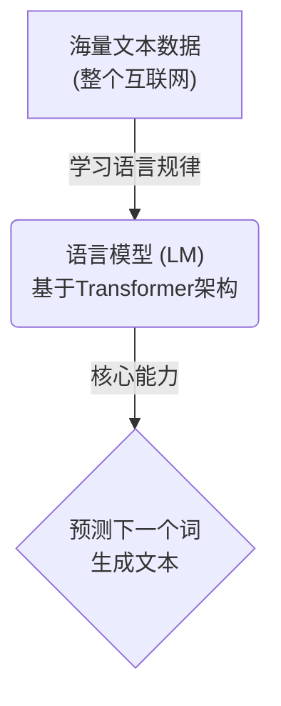
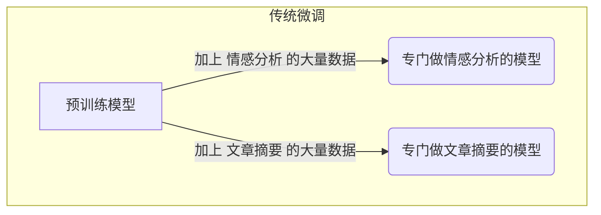
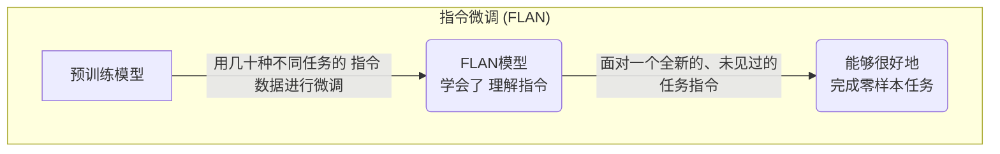
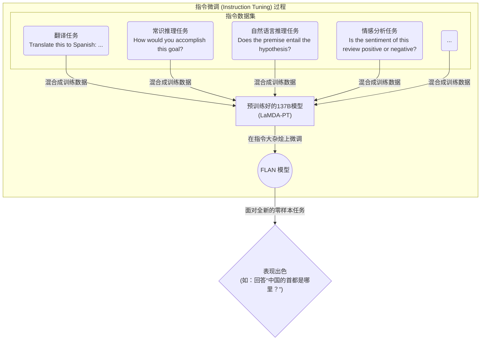
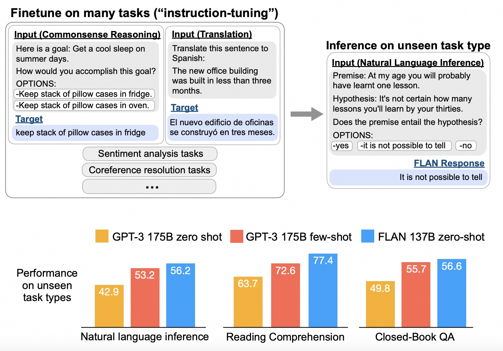
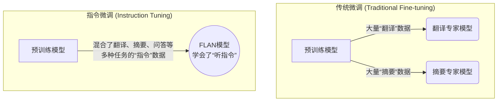

## AI论文解读 | FINETUNED LANGUAGE MODELS ARE ZERO-SHOT LEARNERS 
        
### 作者        
digoal        
        
### 日期        
2025-06-11        
        
### 标签        
PostgreSQL , PolarDB , DuckDB , AI , 论文解读        
        
----        
        
## 背景       
      
https://arxiv.org/pdf/2109.01652        
        
提示:        
```        
读懂《FINETUNED LANGUAGE MODELS ARE ZERO-SHOT LEARNERS》这篇论文需要提前掌握哪些基础知识, 请使用中文给我讲一下这些基础知识, 尽量通熟易懂, 可以使用markdown支持的图形增加解释性.        
        
使用中文通熟易懂的解读《FINETUNED LANGUAGE MODELS ARE ZERO-SHOT LEARNERS》这篇论文, 关键内容请深入讲解, 可以使用markdown支持的图形增加解释性.        
        
使用中文提取《FINETUNED LANGUAGE MODELS ARE ZERO-SHOT LEARNERS》论文中一些重要的术语并详细解释, 可以使用markdown支持的图形示增加解释性.        
```        
        
## 1 前置知识  
    
好的，没问题。为了读懂《Finetuned Language Models Are Zero-Shot Learners》（FLAN）这篇重要的论文，你需要了解一些核心的AI和NLP（自然语言处理）基础概念。我会用通俗易懂的方式，配合Markdown图示来为你讲解。

-----

### 核心思想速览：FLAN做了什么？

在深入细节之前，我们先用一个比喻来理解这篇论文的中心思想：

想象一个超级聪明的学生，他读完了整个互联网的资料（**预训练**），知识渊博但有点“死脑筋”。你直接给他一道他没见过的应用题（**零样本任务**），他可能不知道如何下手，因为题目的问法和他平时读书的方式不一样。

**FLAN要做的事情**，就是不让这个学生只专攻某一门学科（传统的**微调**），而是给他看成千上万种不同学科、不同问法的问题和答案（比如数学题、历史问答、翻译练习等），并告诉他这些都是“指令”。通过这种“题海战术”式的**指令微调 (Instruction Tuning)**，这个学生学会了“如何根据指令来回答问题”这个通用技能。

最终，当你再给他一道全新的、从未见过的应用题时，他能出色地完成，因为他已经领悟了“听指令办事”的精髓。

-----

下面，我们来逐一拆解理解这篇文章所需要的具体基础知识。

#### 基础知识 1: 语言模型 (Language Models, LMs)

这是所有讨论的起点。

  * **是什么？**
    简单来说，语言模型就是一个“文字接龙”或“句子补全”的程序。它通过学习海量的文本数据（比如维基百科、新闻、小说等），掌握了语言的规律、事实知识和一定的推理能力。

  * **核心能力：**
    给定一段文字，它能预测下一个最可能出现的词或句子。现代的大型语言模型（如GPT系列）已经能做到生成非常流畅、连贯且有逻辑的段落。

  * **背后技术：**
    这篇论文中提到的模型（如LaMDA-PT）和GPT-3，都基于一种叫做 **Transformer** 的神经网络架构。你不需要深入了解其数学细节，只需要知道：Transformer架构非常擅长处理长序列的文本，并且能够捕捉词与词之间的复杂关系，这是现代语言模型如此强大的关键。

  



#### 基础知识 2: 模型的“学习”与“应用”范式

预训练好的语言模型很强大，但如何让它为我们所用呢？主要有以下几种方式，理解它们的区别是读懂FLAN论文的关键。

##### a. 预训练 (Pre-training)

这是语言模型的“通识教育”阶段。在这个阶段，模型不针对任何具体任务，唯一的目标就是通过阅读海量无标签的文本，学习语言本身。就像我们上文说的“读完整个互联网”。

##### b. 微调 (Fine-tuning)

这是“专业教育”阶段。如果我们想让模型专门做一个任务（比如情感分析），我们会找一个包含大量该任务“问题-答案”对的数据集，然后在预训练好的模型基础上进行“再训练”。

  * **优点**：在特定任务上表现通常非常好。
  * **缺点**：
    1.  需要为**每个任务**准备大量的标注数据。
    2.  会产生**多个**专门化的模型，管理和部署成本高。

  



##### c. 零样本学习 (Zero-shot Learning)

这是对模型“泛化能力”的终极考验。不给模型任何任务相关的训练样本，直接用自然语言描述任务，看它能否直接给出答案。

  * **例子**：直接向一个预训练模型输入：“把‘我爱北京’翻译成英文。”，然后期望它输出 “I love Beijing.”
  * **问题**：在FLAN出现之前，大型语言模型在零样本场景下表现并不稳定，因为它们在预训练时见到的都是陈述句，对于“指令”式的文本感到陌生。

##### d. 少样本学习 (Few-shot Learning)

介于微调和零样本之间。在提出任务时，给模型提供几个示例（examples/shots），让它“照猫画虎”。

  * **例子**：

    > **输入给模型的文本(Prompt):**

    > 把“苹果”翻译成英文是“Apple”。
    > 把“书”翻译成英文是“Book”。
    > 把“我爱北京”翻译成英文是

    模型看到这个格式后，就会接着输出 "I love Beijing."。

  * **优点**：比零样本学习效果好，因为它为模型提供了任务模式的线索。

  * **缺点**：需要设计示例，并且这些示例会占用宝贵的输入长度（上下文窗口）。

#### 核心概念 3: 指令微调 (Instruction Tuning) - 本文的精髓

**这是FLAN论文的核心贡献。** 作者们认为，传统零样本学习效果不佳，根源在于模型的预训练目标（预测下一个词）和下游任务（遵循指令）之间存在**格式上的鸿沟**。

  * **做法**：

    1.  收集了**超过60个**公开的NLP数据集，涵盖了各种各样的任务（翻译、摘要、问答、推理等）。
    2.  将这些数据集的每个样本都改写成 **“指令”格式** 。例如，一个情感分析的样本 `(文本：“这电影真棒！”, 标签：“正面”)` 会被改写成 `指令：“判断这条评论的情感是正面的还是负面的。评论：这电影真棒！” 答案：“正面”`。
    3.  将所有这些经过“指令化”改造的数据混合在一起，对一个预训练好的大型语言模型进行**微调**。

  * **效果 (The "Aha\!" Moment)**：
    经过这种“指令大杂烩”训练后，模型并没有成为任何一个单一任务的专家。相反，它学会了一个更上位的、更通用的能力——**理解并遵循指令**。因此，当它面对一个**从未见过**的任务类型（比如，训练时没有“成语解释”任务），只要你用指令的形式给出任务，它也能很好地完成。这就是“Finetuned Language Models Are **Zero-Shot Learners**”这个标题的含义。

  



#### 基础知识 4: NLP任务与评估指标

论文中会提到很多NLP任务的缩写和评估方式，了解它们有助于你理解实验部分。

  * **常见任务类型**：

      * **NLI (Natural Language Inference)**: 自然语言推理。判断“前提”和“假设”两句话之间的关系（蕴含、矛盾、中立）。
      * **Reading Comprehension**: 阅读理解。根据一篇文章回答相关问题。
      * **Closed-book QA**: 闭卷问答。不提供任何上下文，直接回答常识性问题（如“法国的首都是哪里？”）。
      * **Summarization**: 文本摘要。

  * **评估指标 (Metrics)**：

      * **Accuracy (准确率)**: 对于分类问题，答对的比例。
      * **BLEU / ROUGE**: 分别用于评估机器翻译和文本摘要质量的指标。它们通过比较模型生成的文本和人类参考答案之间的词语重叠度来打分。分数越高，通常意味着生成质量越好。

-----

### 总结

要读懂FLAN这篇论文，你需要带着以下知识地图：

1.  **语言模型 (LM)** 是基础，它们是基于 **Transformer** 架构的强大文本生成器，通过 **预训练** 获得通用知识。
2.  应用这些模型有不同范式：**微调** (专才)、**零样本** (通才，但以前不灵)、**少样本** (给范例)。
3.  FLAN的核心创新是 **指令微调**，通过在大量多样化的“指令-答案”数据上进行微调，教会了模型“如何遵循指令”的元能力。
4.  这使得模型在面对**未见过的任务**时，其 **零样本学习** 能力得到了**巨大提升**，这是本文最重要的结论。

掌握了这些概念，你就能轻松地理解论文的动机、方法、实验设计和结论了。祝你阅读顺利！
  
## 2 解读论文 
  
好的，我们来深入解读一下这篇开创性的论文——《Finetuned Language Models Are Zero-Shot Learners》（中文可译为：经过微调的语言模型也是零样本学习者），通常我们简称它为 **FLAN**。

简单来说，这篇论文的核心贡献是提出了一种名为 **“指令微调” (Instruction Tuning)** 的方法，该方法能**显著提升**大型语言模型（LLM）在**从未见过**的任务上（即“零样本”场景）的表现能力。它证明了，只要用正确的方式“教导”，一个大型通用模型就能更好地理解并遵循人类的指令去完成各种新任务。

-----

### 问题背景：大型语言模型的“知道”与“做到”

在FLAN之前，大型语言模型（如GPT-3）通过在海量互联网文本上进行“预训练”，学到了丰富的世界知识和语言规律。但它们存在一个矛盾：

  *  **知识渊博但“不听话”**：模型虽然“知道”很多事，但如果你用直接的指令去问一个它没见过的任务，它往往表现不佳   。例如，一个模型在预训练时见过无数陈述句，但很少见到像“请将这句话从A翻译到B”这样的指令。因此，这种指令格式对它来说是陌生的，导致它无法很好地执行任务  。
  * **依赖“少样本”提示 (Few-shot Prompting)**：为了让模型能工作，研究者们通常需要在提问时附上几个例子，也就是“少样本学习”。这种方法虽然有效，但需要为每个任务精心设计示例，而且很麻烦。

FLAN的目标就是解决这个矛盾：我们能否通过一种方法，让模型直接听懂指令，从而在不提供任何示例（零样本）的情况下也能出色地完成任务？

-----

### 核心方法：指令微调 (Instruction Tuning)

**指令微调**是FLAN提出的解决方案，也是整篇论文的精髓。其过程可以分解为以下几个步骤：

1.   **汇集多样化的任务**：研究者们收集了**超过60个**公开的自然语言处理（NLP）数据集   。这些数据集涵盖了各种任务类型，如阅读理解、翻译、常识推理、情感分析等  。

2.   **任务的“指令化”改造**：他们没有直接使用这些数据集，而是将每个数据样本都转换成了**自然语言指令**的格式   。为了增加多样性，每个任务都手动编写了大约10个不同的指令模板  。

      *  **常识推理示例** :

          * **原始数据**: (目标: 夏天睡个凉爽的觉, 方式: 把枕套放冰箱)
          * **指令化后**: `这里有一个目标：夏天睡个凉爽的觉。你会如何实现这个目标？选项：- 把枕套放冰箱。- 把枕套放烤箱。`

      *  **自然语言推理示例** :

          * **原始数据**: (前提: 在我这个年纪，你可能已经学到了一课。, 假设: 到三十多岁时你能学到多少课还不确定。)
          * **指令化后**: `前提：在我这个年纪，你可能已经学到了一课。假设：到三十多岁时你能学到多少课还不确定。这个前提是否蕴含这个假设？选项：- 是的 - 不可能判断 - 不是`

3.   **在“指令大杂烩”上微调**：最后，他们将所有这些“指令化”的数据混合在一起，对一个拥有**1370亿参数**的预训练语言模型（LaMDA-PT）进行微调  。

这个过程的巧妙之处在于，模型学习的不再是如何解决某一个特定任务，而是**如何根据不同的指令来生成符合要求的答案**。



-----

### 关键发现与成果

通过一系列严谨的实验，论文得出了几个非常重要的结论：

#### 1\. 显著提升零样本性能 🚀

 这是最核心的成果。与原始的、未经指令微调的模型相比，**FLAN在未见过的任务上的零样本性能得到了巨大提升**   。在论文评估的25个数据集中，FLAN的表现有20个都超过了当时更强大的零样本模型GPT-3（175B）   。在某些任务上，零样本的FLAN甚至超过了少样本的GPT-3  。
  
 *图1：FLAN（蓝色）在三个未见过的任务类型上，其零样本性能显著优于GPT-3的零样本（灰色）和少样本（橙色）性能  。*  
  
  
   

#### 2\. “指令”本身是关键 🔑

 为了证明成功并非源于“多任务学习”，而是源于“指令”，研究者们做了一项消融实验：他们尝试了不使用自然语言指令，而是用“任务名称”或完全不用模板的方式来微调模型。结果发现，**使用自然语言指令进行微调的效果远超其他方式**  。这证明了，让模型学会理解人类的自然指令是其泛化能力提升的关键。

#### 3\. 规模效应 (Scale is Key) 📈

 一个非常有趣的发现是，**指令微调的好处仅在模型足够大时才会显现**  。

  *  对于较小的模型（如80亿参数以下），指令微调反而会**损害**其在未见任务上的性能   。研究者推测，这是因为小模型的容量有限，学习这些微调任务已经占满了它的“内存”，导致没有多余的能力去泛化到新任务  。
  *  而对于大型模型（如680亿、1370亿参数），指令微调则能带来**显著的性能飞跃**   。这说明，大模型有足够的容量在学习具体指令任务的同时，还能“举一反三”，学习到“如何遵循指令”这一更高级的元能力  。

#### 4\. 任务多样性至关重要 🌐

 实验表明，用于指令微调的任务**种类越多，模型在未见任务上的性能就越好**   。并且，性能提升的趋势似乎没有饱和，这意味着如果加入更多种类的任务集群进行微调，FLAN的性能可能还会进一步提高  。

-----

### 结论与意义

《FINETUNED LANGUAGE MODELS ARE ZERO-SHOT LEARNERS》这篇论文是一个里程碑。它清晰地证明了：

  *  **简单的指令微调方法是解锁大型语言模型零样本能力的高效途径**  。
  *  它为我们指明了一条通往**更通用、更实用**的人工智能的道路：不再需要为每个任务都准备专门的数据集和模型，而是可以创造一个能理解人类指令、完成多样化任务的通用模型  。

这项工作深刻地影响了后续的大型语言模型研发，如今我们熟知的ChatGPT、Claude等模型，其背后都离不开类似“指令微调”和在此基础上发展而来的人类反馈强化学习（RLHF）等技术。FLAN为这一切奠定了坚实的基础。
  
## 3 术语  
  
好的，这篇论文《FINETUNED LANGUAGE MODELS ARE ZERO-SHOT LEARNERS》引入并阐释了几个非常关键的术语。理解这些术语是掌握其核心思想的基础。

以下是对论文中一些重要术语的提取和详细解释。

### 指令微调 (Instruction Tuning)

这是整篇论文最核心的原创概念。

 **解释**：指令微调是一种改进大型语言模型的方法   。它的核心思想是，将大量不同的NLP任务（如翻译、问答、推理等）统一转换成**自然语言指令**的格式，然后用这些“指令化”的数据来微调一个已经预训练好的语言模型  。

 这个过程的目的不是让模型成为解决某个特定任务的“专家”，而是教会它**理解并遵循指令**这一更通用的能力   。通过接触成百上千种不同的指令，模型学会了如何泛化，从而在面对它从未见过的全新任务指令时，也能出色地完成任务  。

**图示**：



---

### 零样本学习 (Zero-shot Learning)

 **解释**：零样本学习指的是让模型在**没有任何相关任务示例**的情况下，直接去执行一个新任务   。在大型语言模型的领域里，这通常意味着直接通过自然语言描述（即指令或提示）来让模型完成任务，而不是给它看任何“问题-答案”的范例  。

 在FLAN这篇论文之前，大型语言模型在零样本学习上的表现普遍不如少样本学习，因为指令的格式与它们在预训练阶段接触到的数据格式差异很大   。FLAN的主要目标就是提升模型的零样本学习能力  。

---

### 少样本学习 (Few-shot Learning)

 **解释**：与零样本学习相对，少样本学习是在向模型提出任务请求时，在上下文中（即Prompt里）提供**一或多个任务范例**   。这些范例向模型展示了任务的模式和期望的输出格式，帮助它更好地理解并完成任务  。例如，在做翻译任务时，可以先给出几个“中文-英文”的翻译对，然后再给出需要翻译的新中文句子。

 虽然少样本学习通常比零样本学习效果好，但它需要为任务设计范例，并且会占用有限的输入上下文空间  。

---

### 语言模型 (Language Model, LM)

 **解释**：语言模型是一种通过在海量文本数据上进行训练，从而学会理解和生成人类语言的AI模型   。这篇论文中使用的基础模型是 **LaMDA-PT**，一个拥有 **1370亿（137B）** 参数的密集解码器（decoder-only）语言模型   。这个模型经过了“预训练”，但没有针对对话进行微调  。

---

### 任务集群 (Task Clusters)

 **解释**：为了科学地评估模型在“未见任务”上的表现，研究者们将所有的数据集按照其**任务类型**分成了不同的组，这些组就被称为“任务集群”   。例如，所有关于自然语言推理（NLI）的数据集（如ANLI, RTE, CB等）都属于“NLI任务集群”  。

 在评估时，他们会采取“留一法”：例如，在评估NLI任务时，他们会把整个NLI任务集群的数据都拿掉，用所有其他集群的任务来对模型进行指令微调。这样就能确保模型在评估NLI性能时，从未在训练阶段见过任何NLI类型的任务，从而保证了评估的公平性  。

---

### 指令模板 (Templates)

 **解释**：指令模板是研究者为每个数据集**手动编写**的、用来将原始数据转换成自然语言指令的格式化字符串   。为了增加多样性，避免模型过拟合到某一种特定的指令措辞，他们为每个数据集都设计了大约10个不同的模板  。

例如，对于一个自然语言推理任务，他们可能设计出以下不同的模板：
*  模板1：`基于以上段落，我们能否断定“<假设>”？`  
*  模板2：`我们能否推断出以下内容？<假设>`  
*  模板3：`阅读以下内容，并判断假设是否可以从前提中推断出来：前提：<前提> 假设：<假设>`  
  
## 参考        
        
https://arxiv.org/pdf/2109.01652        
        
        
<b> 以上内容基于DeepSeek、Qwen、Gemini及诸多AI生成, 轻微人工调整, 感谢杭州深度求索人工智能、阿里云、Google等公司. </b>        
        
<b> AI 生成的内容请自行辨别正确性, 当然也多了些许踩坑的乐趣, 毕竟冒险是每个男人的天性.  </b>        
  
  
  
#### [期望 PostgreSQL|开源PolarDB 增加什么功能?](https://github.com/digoal/blog/issues/76 "269ac3d1c492e938c0191101c7238216")
  
  
#### [PolarDB 开源数据库](https://openpolardb.com/home "57258f76c37864c6e6d23383d05714ea")
  
  
#### [PolarDB 学习图谱](https://www.aliyun.com/database/openpolardb/activity "8642f60e04ed0c814bf9cb9677976bd4")
  
  
#### [PostgreSQL 解决方案集合](../201706/20170601_02.md "40cff096e9ed7122c512b35d8561d9c8")
  
  
#### [德哥 / digoal's Github - 公益是一辈子的事.](https://github.com/digoal/blog/blob/master/README.md "22709685feb7cab07d30f30387f0a9ae")
  
  
#### [About 德哥](https://github.com/digoal/blog/blob/master/me/readme.md "a37735981e7704886ffd590565582dd0")
  
  

  
