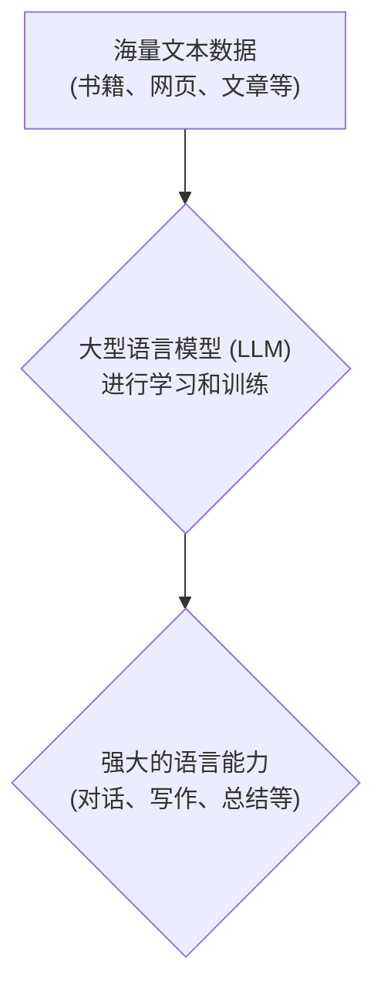
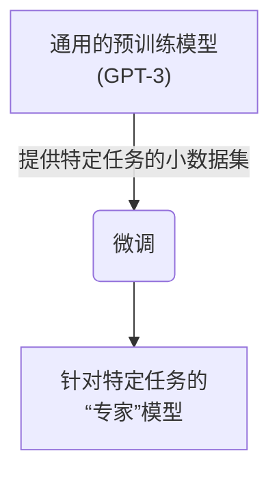
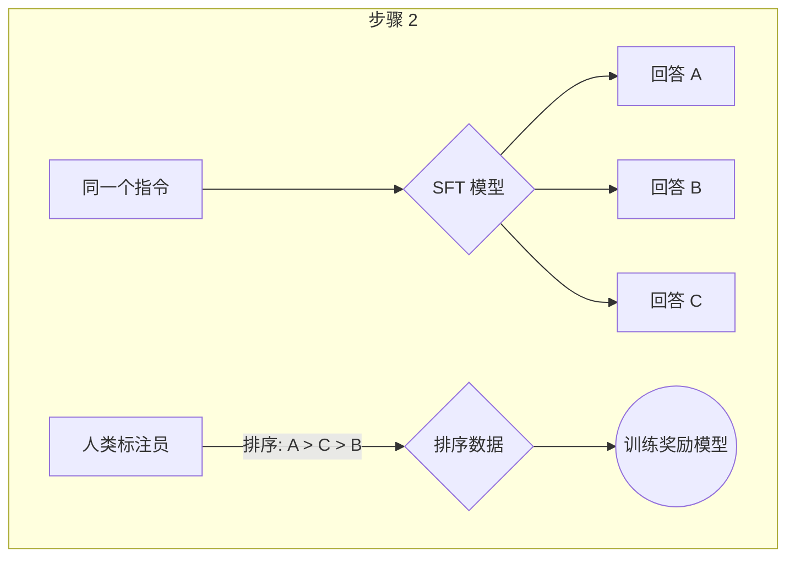
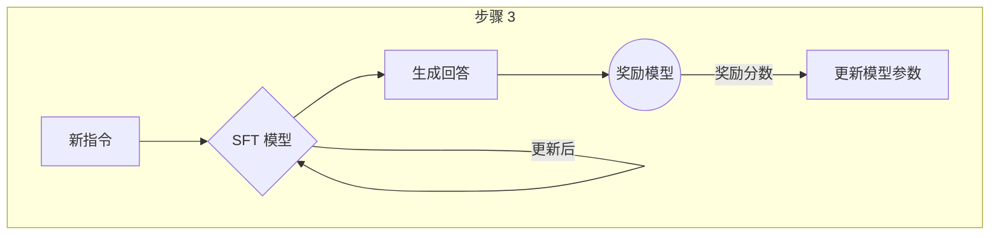
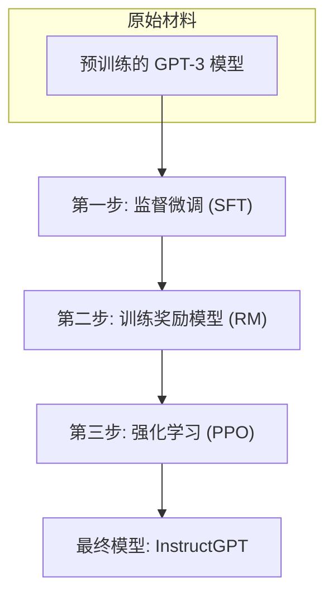
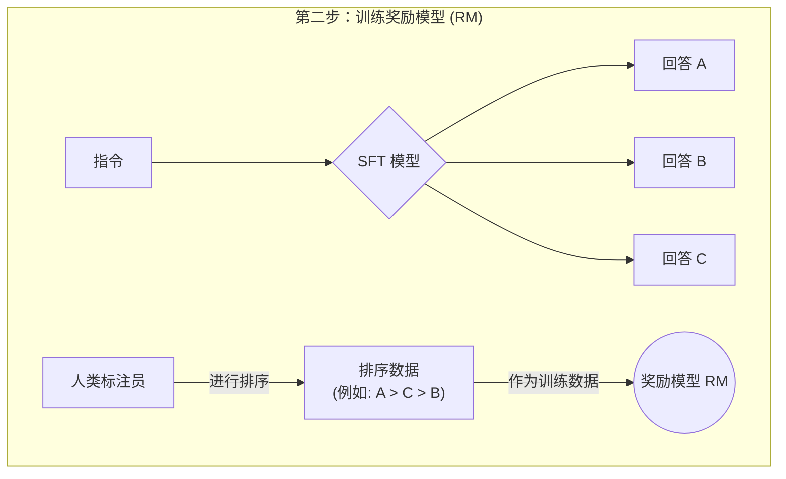
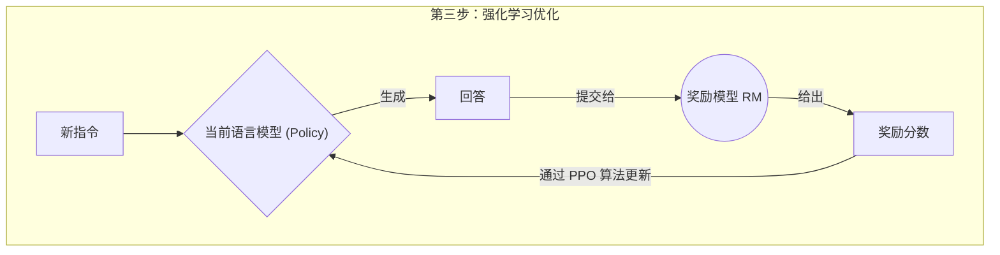
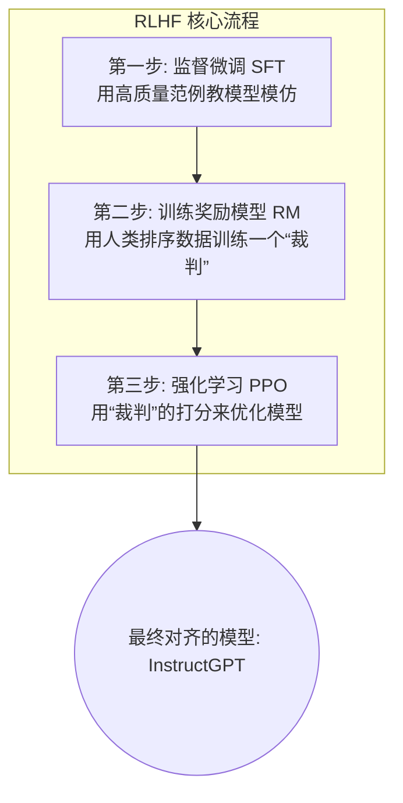
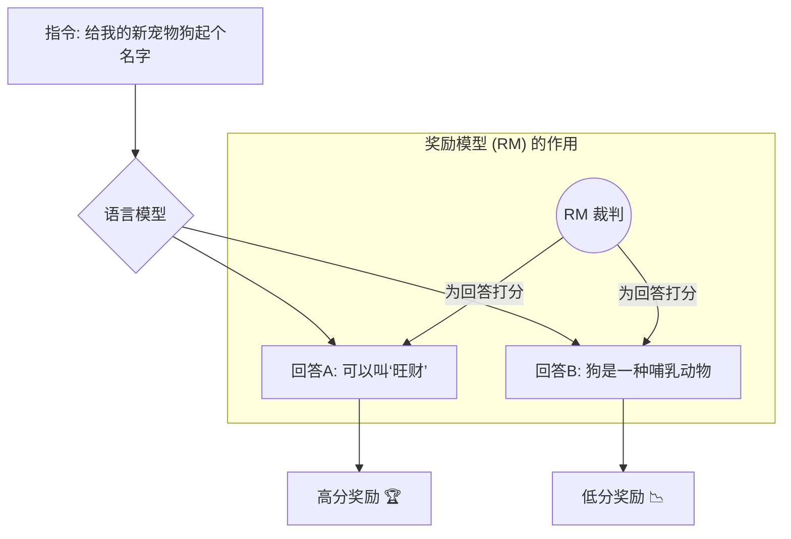

## AI论文解读 | Training language models to follow instructions with human feedback
        
### 作者        
digoal        
        
### 日期        
2025-06-12        
        
### 标签        
PostgreSQL , PolarDB , DuckDB , AI , 论文解读        
        
----        
        
## 背景       
      
https://arxiv.org/pdf/2203.02155        
        
提示:        
```        
读懂《Training language models to follow instructions with human feedback》这篇论文需要提前掌握哪些基础知识, 请使用中文给我讲一下这些基础知识, 尽量通熟易懂, 可以使用markdown支持的图形增加解释性.        
        
使用中文通熟易懂的解读《Training language models to follow instructions with human feedback》这篇论文, 关键内容请深入讲解, 可以使用markdown支持的图形增加解释性.        
        
使用中文提取《Training language models to follow instructions with human feedback》论文中一些重要的术语并详细解释, 可以使用markdown支持的图形示增加解释性.        
```        
        
## 1 前置知识  
  
好的，为了读懂《Training language models to follow instructions with human feedback》这篇论文，你需要了解以下几个核心的基础知识。我会用尽量通俗易懂的语言，并配合图表来帮助你理解。

 这篇论文的核心思想是，他们提出了一种方法，通过使用人类的反馈来“训练”语言模型，让模型能更好地理解并遵循人类的指令。 他们将这个训练出来的模型系列称为 **InstructGPT**  。

为了理解这篇论文，你需要掌握以下三大块知识：

1.  **大型语言模型 (Large Language Models, LLMs) 与 GPT-3**
2.  **微调 (Fine-tuning)**
3.  **从人类反馈中进行强化学习 (Reinforcement Learning from Human Feedback, RLHF)**

---

### 1. 大型语言模型 (LLMs) 与 GPT-3

#### 什么是大型语言模型 (LLM)?

 你可以把大型语言模型想象成一个超级聪明的大脑，它通过阅读海量的书籍、文章和网页等文本数据进行学习  。学习的目标非常纯粹：**预测下一个最可能出现的词是什么**。

 经过海量数据的训练后，这个“大脑”就具备了惊人的语言能力，能够像人一样进行对话、写作、总结、翻译，甚至编写代码  。



#### 什么是 GPT-3?

 **GPT-3** (Generative Pre-trained Transformer 3) 就是一个非常著名且强大的大型语言模型   。这篇论文就是以 GPT-3 为基础，通过新的方法让它变得更“听话”。虽然 GPT-3 本身很强大，但它有时会生成一些无用的、不真实的，甚至是有害的内容，因为它最初的目标只是预测下一个词，而不是真正“理解”人类的意图  。

---

### 2. 微调 (Fine-tuning)

#### 什么是微调?

微调就像是为一个已经上知天文、下知地理的通才专家，再进行特定领域的“岗前培训”。

 我们已经有了一个预训练好的大型语言模型（比如 GPT-3），它什么都懂一点。但如果我们想让它在某个特定任务上做得更好（比如，专门写唐诗或者专门做客服），我们就可以用一小部分更具体、更专业的“小数据”来对它进行额外训练。这个过程就叫做 **微调**  。



 在这篇论文中，第一步就是利用人工标注的数据对 GPT-3 进行微调，让它初步学会如何遵循指令  。

---

### 3. 从人类反馈中进行强化学习 (RLHF)

 这是理解这篇论文最核心、也是最关键的部分。**RLHF** 的目标是让模型的回答更符合人类的偏好和价值观  。

 这个过程分为三个主要步骤  ：

#### **步骤 1: 监督微调 (Supervised Fine-Tuning, SFT)**

*  首先，他们雇佣了一批标注员，针对各种用户提出的指令（Prompt），写出高质量的回答范例  。
*  然后，用这些“指令-回答”对，对预训练的 GPT-3 模型进行微调  。
* 经过这一步，模型就已经初步具备了遵循指令的能力。

#### **步骤 2: 训练一个奖励模型 (Reward Model, RM)**

*  这一步的目标是训练一个“裁判”模型，它能判断什么样的回答更好  。
*  他们让 SFT 模型对同一个指令生成多个不同的回答  。
*  然后，让人类标注员对这些回答进行排序，指出哪个最好，哪个次之，哪个最差  。
*  接着，用这些排序数据来训练一个新模型，这个模型被称为 **奖励模型 (Reward Model)**。它的工作就是给任何一个“指令+回答”的组合打分，分数越高，代表这个回答越符合人类的偏好  。



#### **步骤 3: 使用强化学习 (PPO) 优化模型**

* 现在我们有了一个可以打分的“裁判”（奖励模型），就可以用它来进一步优化我们的语言模型了。
*  这个过程使用的是一种叫做 **强化学习 (Reinforcement Learning)** 的技术，具体来说是 **PPO (Proximal Policy Optimization)** 算法  。
* 你可以这样理解：
    1.  从数据集中拿出一个新的指令。
    2.  让 SFT 模型（在步骤1训练的模型）生成一个回答。
    3.  让奖励模型（在步骤2训练的“裁判”）为这个回答打分。
    4.   这个分数被用作一个“奖励信号”，来更新 SFT 模型的参数，目标是让它生成的回答能够获得更高的“奖励”  。



通过不断重复这个过程，语言模型会逐渐学会如何生成更符合人类偏好、质量更高的回答。

### 总结

所以，要完全读懂这篇论文，你需要理解：

* **大型语言模型 (LLM)** 是基础，论文的工作是基于 GPT-3 展开的。
* **微调 (Fine-tuning)** 是第一步，让模型初步具备遵循指令的能力。
*  **强化学习 (RL)**，特别是**从人类反馈中学习 (RLHF)**，是这篇论文的核心创新点。它通过一个“奖励模型”作为桥梁，将人类的偏好和价值观传递给语言模型，从而让模型变得更“有用、诚实和无害”  。

希望这些解释能帮助你更好地理解这篇开创性的论文！
  
## 2 解读论文  
  
好的，我们来一起深入解读这篇在人工智能领域具有里程碑意义的论文——《Training language models to follow instructions with human feedback》。

这篇论文由 OpenAI 在 2022 年发表，它系统性地介绍了一种革命性的方法，用于训练大型语言模型（LLM）以更好地遵循人类的指令和意图。这个方法就是后来大名鼎鼎的 **RLHF (Reinforcement Learning from Human Feedback)**，而通过这个方法训练出的模型系列，他们称之为 **InstructGPT**。我们今天所熟知的 ChatGPT 正是基于 InstructGPT 的研究成果发展而来的。

---

### **为什么会有这篇论文？（问题背景）**

在 InstructGPT 出现之前，大型语言模型（如 GPT-3）虽然已经非常强大，但存在一个核心问题：**“对齐”（Alignment）问题**。

 简单来说，模型的“目标”和人类用户的“目标”并不完全一致  。GPT-3 的训练目标是在海量文本数据上“预测下一个词”，这使得它擅长生成连贯的文本，但并不意味着它能很好地理解并执行用户的具体指令。这导致了以下几个典型问题：

*  **编造事实**：模型可能会“一本正经地胡说八道”  。
*  **输出有毒或带偏见的内容**：因为它学习的原始数据中就包含这些内容  。
*  **不遵循指令**：有时会忽略用户的明确要求  。
*  **生成无用信息**：给出与用户意图无关的回答  。

 这篇论文的目标就是解决这个“对齐”问题，他们提出：**仅靠扩大模型规模并不能让模型变得更听话、更有用，我们需要一种方法，让模型直接从人类的反馈中学习，使其行为与用户意图对齐**  。

---

### **核心方法：三步炼丹法 (深入讲解)**

这篇论文的核心贡献就是提出并验证了一套完整、有效且可扩展的 RLHF 流程。我们可以把它形象地比喻为“三步炼丹法”，每一步都至关重要。



#### **第一步：监督微调 (Supervised Fine-Tuning, SFT)**

* **目标**：让模型初步学会“如何遵循指令”这种对话风格。
* **做法**：
    1.   **收集数据**：OpenAI 雇佣了约 40 名人类标注员   。他们从用户的 API 请求或由标注员自己编写的各种指令（Prompt）开始  。
    2.   **人工演示**：标注员针对这些指令，写出高质量、符合要求的回答范例（Demonstration）  。
    3.   **进行微调**：用这些“指令-高质量回答”对，对原始的 GPT-3 模型进行监督学习式的微调  。

* **通俗理解**：这一步就像是给一个知识渊博但不懂如何教学的教授（GPT-3），提供了一批“优秀教案”（人工演示），让他模仿学习如何给学生（用户）上课。经过这一步，模型就有了一个基础的“指令遵循”能力，我们称之为 SFT 模型。

#### **第二步：训练奖励模型 (Reward Model, RM)**

* **目标**：训练一个“AI 裁判”，这个裁判懂得人类喜欢什么样的回答，并能给回答打分。
* **做法**：
    1.   **生成多样性回答**：针对一个指令，让第一步训练出的 SFT 模型生成多个不同的回答（例如，4到9个）  。
    2.   **人类排序**：让标注员对这些回答进行排序，从最好到最差  。比如，对于同一个问题，回答A > 回答B > 回答D > 回答C。
    3.   **训练 RM**：这些排序数据被用来训练一个全新的模型——**奖励模型 (RM)**   。这个模型的输入是“一个指令 + 一个回答”，输出是一个标量分数（Reward）  。分数越高，代表这个回答越符合人类的偏好。

* **通俗理解**：这一步是在培养一个品味很好的“裁判”。通过让他观摩大量“比稿”现场（人类排序），裁判学会了什么样的作品（回答）是更受青睐的。这个裁判本身不会写文章，但它的鉴赏能力一流。



#### **第三步：使用强化学习进行优化 (Reinforcement Learning via PPO)**

* **目标**：利用“AI 裁判”的打分，来持续优化我们的语言模型，让它学会生成能得高分的回答。
* **做法**：
    1.  **环境与策略**：将第一步得到的 SFT 模型作为初始策略（Policy）。
    2.   **生成与打分**：从指令数据集中随机抽取一个新指令，让当前的语言模型（Policy）生成一个回答  。
    3.   **获取奖励**：将这个“指令+回答”喂给第二步训练好的奖励模型（RM），RM 会给出一个分数（Reward）  。
    4.   **策略更新**：这个分数作为强化学习中的“奖励信号”，通过 **近端策略优化（PPO）** 算法来更新语言模型的参数  。目标是让语言模型在下次生成回答时，能获得更高的奖励分数。

* **通俗理解**：这是最关键的“修炼”环节。语言模型（SFT 模型）就像一个不断练习的学生，他每写完一篇文章（生成回答），就拿给品味很好的裁判（RM）打分。如果得分高，就相当于得到了“正向激励”，学生会学习并巩固这次的写作方法；如果得分低，就是“负向激励”，学生会调整自己的方法。通过数万次的循环练习，学生最终会掌握写出高分作文的秘诀。



经过这三步，最终得到的模型就是 **InstructGPT**。

---

### **主要发现：InstructGPT 效果如何？**

论文通过大量的实验和评估，得出了几个关键结论：

1.   **人类显著偏爱 InstructGPT**：这是最核心的结论。即便是一个只有 13 亿参数的 InstructGPT 模型，其生成结果的受欢迎程度也远超 1750 亿参数的原始 GPT-3 模型   。在直接对比中，175B 的 InstructGPT 的输出有 85% 的时间比 175B 的 GPT-3 更受青睐  。

2.   **更真实、更少“幻觉”**：InstructGPT 在需要基于给定信息回答问题的“封闭领域”任务中，其编造事实（即“幻觉”）的概率比 GPT-3 低了约一半（21% vs 41%）   。在 TruthfulQA 基准测试中，它生成真实、信息丰富的答案的频率是 GPT-3 的两倍  。

3.   **更少的有害内容**：当被明确指示要生成安全、尊重的回答时，InstructGPT 生成的有害、有毒内容的比例显著低于 GPT-3  。

4.   **具备良好的泛化能力**：InstructGPT 不仅能在它训练过的任务上表现出色，还能将“遵循指令”的能力泛化到全新的、甚至在训练数据中非常罕见的任务上，比如代码生成和非英语语言的指令  。

5.   **仍然会犯错**：论文同样坦诚地指出了 InstructGPT 的局限性。它有时仍然会犯一些简单的错误，比如在面对一个包含错误前提的问题时，它可能会默认这个前提是真的，而不是去纠正它  。

---

### **论文的深远影响与意义**

这篇论文的发表，不仅仅是技术上的突破，更在行业内产生了范式级的深远影响：

* **确立了 RLHF 的行业标准**：它开创并验证了通过 RLHF 来“对齐”大型语言模型的有效路径。此后，几乎所有头部的语言模型（包括 ChatGPT、Claude 等）都采用了类似的技术路线。
*  **挑战了“唯大小论”**：它证明了模型的“质量”和“对齐度”比单纯的“规模”更重要。一个经过精心对齐的小模型，其用户体验可以超越比它大 100 倍的原始模型  。
*  **将“AI 对齐”从哲学思辨带入工程实践**：长期以来，“AI 对齐”更多是一个理论和安全领域的议题。这篇论文提供了一个可行的、可扩展的工程解决方案，极大地推动了该领域的发展  。

总而言之，这篇论文是理解现代对话式 AI 如何工作的“基石”。它精妙地将人类的价值观和偏好通过数据和算法注入到强大的语言模型中，从而让 AI 变得更像一个有用、可靠、负责任的助手。
  
## 3 术语  
  
好的，这篇论文《Training language models to follow instructions with human feedback》引入了许多后来在 AI 领域变得至关重要的术语。以下是其中一些核心术语的详细中文解释，并配有图示以帮助理解。

---

### **1. 对齐 (Alignment)**

*  **定义**：**对齐** 指的是让语言模型的行为和目标与人类用户的意图、偏好及价值观保持一致的过程   。一个“对齐的”模型应该做到 **有用 (helpful)**、**诚实 (honest)** 和 **无害 (harmless)**  。

* **详细解释**：在论文发表时，像 GPT-3 这样的大型语言模型虽然知识渊博，但它们的首要目标是“预测下一个词”，而不是真正“理解并帮助用户”。这就会导致模型可能会说谎、输出有害内容或答非所问。**对齐** 的核心就是修正模型的行为，让它从一个单纯的“文本续写机器”转变为一个真正能为人类服务的、负责任的“助手”。这篇论文提出的方法，就是实现这种对齐的有效途径。

---

### **2. 从人类反馈中进行强化学习 (Reinforcement Learning from Human Feedback, RLHF)**

*  **定义**：RLHF 是一种训练范式，它使用人类对模型输出的偏好（例如，哪个回答更好）作为奖励信号，来微调和优化语言模型  。

* **详细解释**：RLHF 是这篇论文提出的核心方法论，是实现“对齐”的关键技术。它巧妙地将人类的主观判断转化为了可计算的奖励信号，然后利用强化学习算法来“训练”模型，使其倾向于生成更受人类欢迎的输出。整个过程分为三个步骤，如下图所示：



---

### **3. 监督微调 (Supervised Fine-Tuning, SFT)**

*  **定义**：SFT 是 RLHF 流程的第一步，通过在一个由人工标注的高质量“指令-回答”示范数据集上进行微调，来训练基础的语言模型  。

* **详细解释**：这是让模型学会“如何回答问题”的初始模仿阶段。研究人员雇佣标注员，针对各种指令，撰写出他们认为理想的回答。然后，将这些“问题+标准答案”的数据对用来对 GPT-3 进行微调。这一步的主要目的是让模型适应遵循指令的格式和风格，为后续的优化打下基础。

---

### **4. 奖励模型 (Reward Model, RM)**

*  **定义**：奖励模型（RM）是一个独立的模型，它的任务是接收一个“指令”和模型生成的“回答”，然后输出一个分数，这个分数代表了该回答符合人类偏好的程度  。

* **详细解释**：RM 是 RLHF 中连接“人类智慧”和“模型训练”的桥梁，扮演着“AI 裁判”的角色。它的训练数据来源于人类标注员对多个模型回答的排序。通过学习这些排序，RM 学会了分辨“好”与“坏”的回答。在强化学习阶段，正是这个 RM 提供的奖励分数，指导着语言模型该朝哪个方向优化。



---

### **5. 近端策略优化 (Proximal Policy Optimization, PPO)**

*  **定义**：PPO 是论文在 RLHF 第三步中使用的核心强化学习算法，用于根据奖励模型的分数来更新和优化语言模型的参数  。

* **详细解释**：PPO 是一种高效且稳定的强化学习算法。在本文中，语言模型本身就是“策略（Policy）”，它需要决定在看到一个指令后生成哪些词。PPO 算法利用奖励模型（RM）给出的奖励信号，来微调这个“策略”，使其更有可能生成能获得高分的回答。同时，PPO 还能确保模型在优化的过程中不会“跑偏”太多，避免其完全忘记在 SFT 阶段学到的知识，从而保证了训练的稳定性。

---

### **6. 幻觉 (Hallucination)**

*  **定义**：在语言模型领域，**幻觉** 指的是模型生成了与事实不符、凭空捏造或与输入信息无关的内容  。

*  **详细解释**：这是一种常见的模型缺陷，俗称“一本正经地胡说八道”。例如，当你问一个模型某个不存在的人物的生平，它可能会为你虚构出一整套完整的生平事迹。论文的一个重要发现是，经过 RLHF 训练的 InstructGPT 模型，其产生幻觉的频率相比原始 GPT-3 大大降低了  。

---

### **7. 指令/提示 (Prompt)**

*  **定义**：**Prompt** 是用户提供给语言模型的输入文本，它可以是一个问题、一个要求、一段需要补全的文字，或任何形式的指令  。

*  **详细解释**：Prompt 是整个生成过程的起点。模型的任务就是根据这个 Prompt 生成相应的续写或回答。在这篇论文中，Prompt 的来源非常广泛，一部分来自早期用户通过 OpenAI API 提交的真实请求，另一部分则由雇佣的标注员专门编写，以确保数据具有足够的多样性  。模型的“遵循指令”能力，本质上就是其准确理解并响应 Prompt 的能力。
  
  
## 参考        
        
https://arxiv.org/pdf/2203.02155        
        
        
<b> 以上内容基于DeepSeek、Qwen、Gemini及诸多AI生成, 轻微人工调整, 感谢杭州深度求索人工智能、阿里云、Google等公司. </b>        
        
<b> AI 生成的内容请自行辨别正确性, 当然也多了些许踩坑的乐趣, 毕竟冒险是每个男人的天性.  </b>        
  
  
#### [期望 PostgreSQL|开源PolarDB 增加什么功能?](https://github.com/digoal/blog/issues/76 "269ac3d1c492e938c0191101c7238216")
  
  
#### [PolarDB 开源数据库](https://openpolardb.com/home "57258f76c37864c6e6d23383d05714ea")
  
  
#### [PolarDB 学习图谱](https://www.aliyun.com/database/openpolardb/activity "8642f60e04ed0c814bf9cb9677976bd4")
  
  
#### [PostgreSQL 解决方案集合](../201706/20170601_02.md "40cff096e9ed7122c512b35d8561d9c8")
  
  
#### [德哥 / digoal's Github - 公益是一辈子的事.](https://github.com/digoal/blog/blob/master/README.md "22709685feb7cab07d30f30387f0a9ae")
  
  
#### [About 德哥](https://github.com/digoal/blog/blob/master/me/readme.md "a37735981e7704886ffd590565582dd0")
  
  

  
