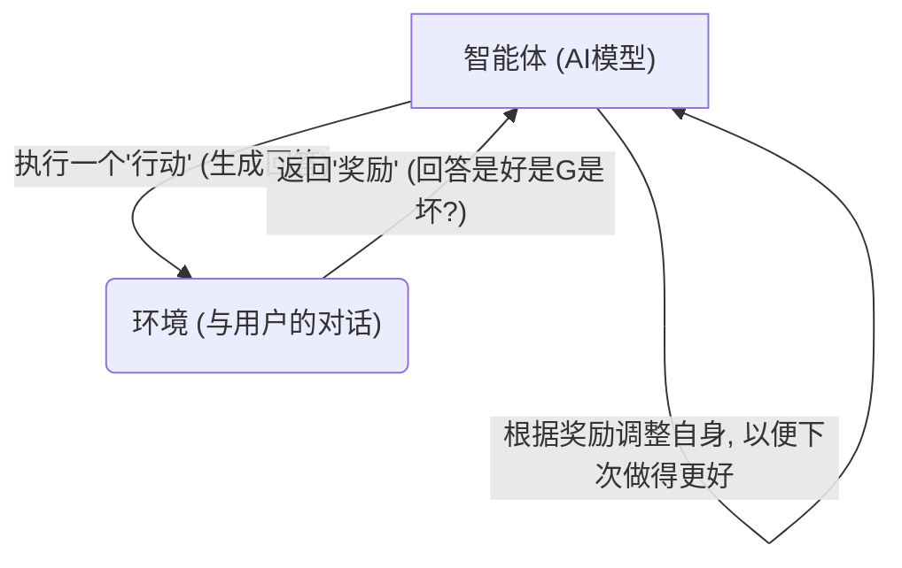
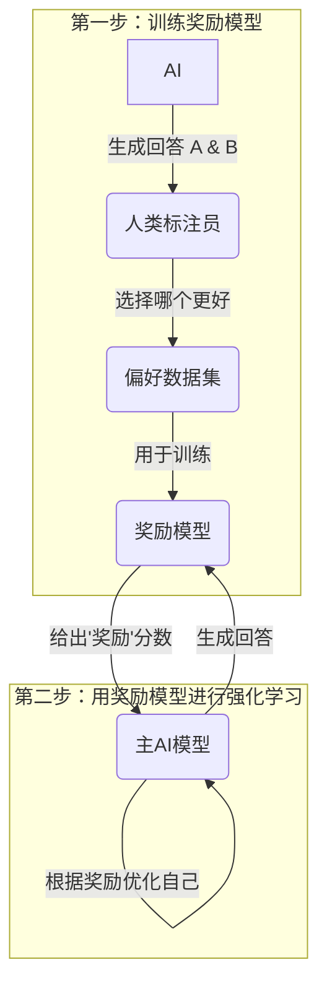
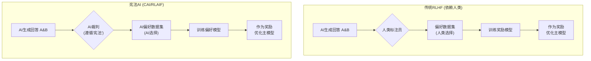
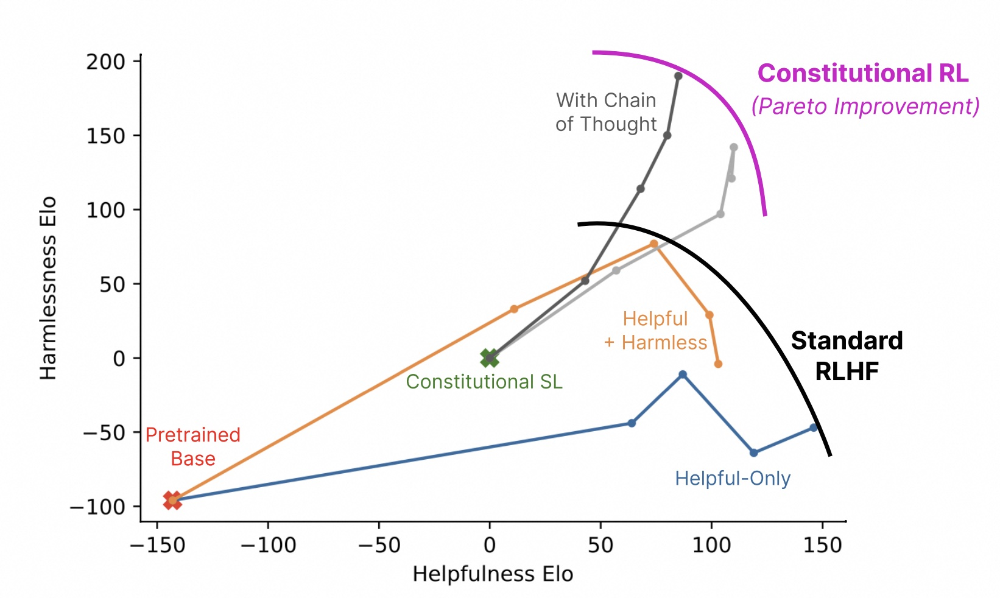
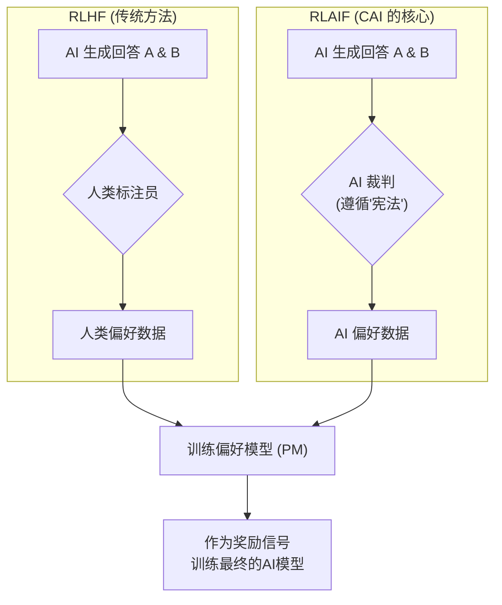

## AI论文解读 | Constitutional AI: Harmlessness from AI Feedback
        
### 作者        
digoal        
        
### 日期        
2025-06-12        
        
### 标签        
PostgreSQL , PolarDB , DuckDB , AI , 论文解读        
        
----        
        
## 背景       
      
https://arxiv.org/abs/2212.08073        
        
提示:        
```        
读懂《Constitutional AI: Harmlessness from AI Feedback》这篇论文需要提前掌握哪些基础知识, 请使用中文给我讲一下这些基础知识, 尽量通熟易懂, 可以使用markdown支持的图形增加解释性.        
        
使用中文通熟易懂的解读《Constitutional AI: Harmlessness from AI Feedback》这篇论文, 关键内容请深入讲解, 可以使用markdown支持的图形增加解释性.        
        
使用中文提取《Constitutional AI: Harmlessness from AI Feedback》论文中一些重要的术语并详细解释, 可以使用markdown支持的图形示增加解释性.        
```        
        
## 1 前置知识  
  
好的，没问题。为了完全理解《Constitutional AI: Harmlessness from AI Feedback》这篇论文，你需要了解一些机器学习和人工智能领域的核心概念。我会用尽量通俗易懂的方式，结合图表来解释这些基础知识。

这篇论文的核心目标是：**在没有人类标注员直接告诉AI“这个回答有害”的情况下，训练出一个有益且无害的AI助手。** 它通过让AI自我反思和反馈来实现这一目标，而这种反思的依据是一套预设的原则（即“宪法”）。

以下是你需要掌握的基础知识，可以看作是理解这篇论文的“技能树”：

---

### 1. 大语言模型 (Large Language Models, LLMs)

这是最基础的概念，因为论文中提到的所有AI模型本质上都是大语言模型。

#### 什么是LLM？
你可以把LLM想象成一个“超级大脑”，它阅读了互联网上几乎所有的文本（书籍、文章、网站等）。通过海量的阅读，它学会了语言的规律、事实知识、逻辑推理能力，甚至能够模仿不同的语气和风格。

* **预训练 (Pre-training):** 这个“阅读”的过程就是预训练。它是一个无监督的过程，AI自己从海量数据中学习规律，目标是预测下一个词是什么。预训练完成后，模型就拥有了通用的世界知识和语言能力。
* **微调 (Fine-tuning):** 预训练后的模型像一个知识渊博但未经社会化的“天才”。微调就是针对特定任务（比如“成为一个有用的助手”）进行专门训练。通过给它看一些高质量的对话示例，模型能学会更好地遵循指令、进行对话。

> **简单来说：** LLM是基础，论文里的所有操作都是为了更好地“调教”这个已经很聪明的“大脑”。

---

### 2. 强化学习 (Reinforcement Learning, RL)

这是论文方法论的核心框架之一，是一种非常重要的机器学习范式。

#### 什么是RL？
强化学习的核心思想是“**通过试错来学习**”。就像训练宠物一样，当它做出正确的行为时，你给它奖励；当它做出错误行为时，不给奖励或给予轻微的“惩罚”。久而久之，宠物就知道如何做才能获得最多的奖励。

在AI中，这套逻辑包含几个关键元素：
* **智能体 (Agent):** 就是AI模型，我们训练的对象。
* **环境 (Environment):** AI互动的场景，比如与用户的对话。
* **行动 (Action):** AI在环境中做出的反应，比如生成一句回答。
* **奖励 (Reward):** 一个反馈信号，告诉AI它的“行动”是好是坏。奖励为正数表示“好”，为负数或零表示“不好”。

AI的目标是学习一个策略（Policy），使其在各种情况下都能做出能获得**最大累积奖励**的行动。


> **简单来说：** RL是一种让AI通过奖励和惩罚来学习最佳行为方式的训练方法。

---

### 3. 从人类反馈中进行强化学习 (RLHF)

这是“Constitutional AI”技术的前身和基础，也是理解本论文的关键跳板。RLHF（Reinforcement Learning from Human Feedback）解决了传统RL的一个大问题：**如何定义“奖励”？**

在对话中，一个回答的好坏很难用一个简单的数字来衡量。RLHF巧妙地利用人类的偏好来创建奖励信号。

#### RLHF的流程：
1.  **收集偏好数据：** 让AI对同一个问题生成两个不同的回答（A和B）。
2.  **人类标注：** 让人类标注员判断哪个回答更好。他们不需要打分，只需要做出选择：“A比B好”或“B比A好”。
3.  **训练奖励模型 (Reward Model, RM)：** 收集大量这种“A优于B”的人类偏好数据后，用它们来训练另一个专门的AI模型，这个模型被称为**奖励模型**。这个奖励模型学会了预测人类会喜欢什么样的回答。
4.  **进行强化学习：** 在RL框架中，我们用这个训练好的**奖励模型**来代替真实的、实时的人类反馈。当主AI生成一个回答后，奖励模型会给这个回答打一个“偏好分数”，这个分数就作为RL的**奖励信号**，用来更新和优化主AI。



> **简单来说：** RLHF通过训练一个“人类偏好模拟器”（奖励模型），来为强化学习提供指导，从而让AI学会生成人类喜欢的回答。

---

### 4. 思想链 (Chain-of-Thought, CoT)

这是论文中用来提升AI推理和反馈质量的一种技术。

#### 什么是CoT？
思想链（CoT）是一种特殊的提示（Prompting）技巧。相比于直接让AI输出答案，CoT会引导AI**先把解决问题的思考步骤写出来，然后再给出最终答案**。

* **无CoT：**
    > **问：** 农夫有10个苹果，他给了邻居3个，又买了5个，现在他有几个？
    > **答：** 12个。

* **有CoT：**
    > **问：** 农夫有10个苹果，他给了邻居3个，又买了5个，现在他有几个？请一步步思考。
    > **答：** 好的。首先，农夫一开始有10个苹果。然后他给了邻居3个，所以剩下 10 - 3 = 7个。之后他又买了5个，所以现在有 7 + 5 = 12个。因此，最终答案是12个。

CoT能显著提高AI在逻辑推理、数学计算等任务上的表现，并且让它的决策过程更加**透明**和可解释。

---

### 总结：如何将这些知识串联起来理解论文？

掌握了以上四个概念，你就可以轻松理解论文的核心创新了：

* 论文的方法被称为**Constitutional AI (CAI)**，它的核心是 **RLAIF (从AI反馈中进行强化学习)**。
* **RLAIF** 本质上是 **RLHF** 的一个变种。它最大的改变在于，将RLHF流程中需要**人类标注员**来提供偏好数据的环节，替换成了由**另一个AI**（在“宪法”原则指导下）来提供反馈。

**论文的方法分为两个阶段：**

1.  **监督学习阶段 (类比自我反思):**
    * AI先生成一个回答。
    * 然后AI被要求根据“宪法”原则来**批判**自己的回答（这里用到了**LLM**的理解和生成能力）。
    * 最后AI再根据批判**修正**自己的回答。
    * 这些“修正后的好回答”被用来对模型进行微调。

2.  **强化学习阶段 (RLAIF):**
    * 这个阶段就和**RLHF**非常像了。
    * AI生成两个回答（A和B）。
    * 一个**AI奖励模型**（而非人类）根据“宪法”来判断A和B哪个更无害、更好。
    * 这个AI生成的偏好被用来优化主AI模型。
    * 在这个过程中，AI奖励模型常常会使用**思想链 (CoT)** 来解释自己为什么做出这样的判断，从而提高反馈的质量和透明度。

所以，这篇论文的逻辑链是：在 **LLM** 的基础上，借鉴了 **RLHF** 的整体流程，但用AI基于“宪法”的自我批判和反馈，代替了人类反馈，并通过 **CoT** 等技术来提升AI反馈的质量，最终实现了更高效、更可控的AI“无害化”训练。
  
## 2 解读论文  
  
好的，我们来深入解读一下《Constitutional AI: Harmlessness from AI Feedback》这篇开创性的论文。

这篇论文的核心思想是，我们可以训练一个AI，让它在不需要人类直接标记有害内容的情况下，变得更加“无害”，同时保持“有用”。它通过制定一套原则（即“宪法”），让AI学会自我批评、自我修正，并用AI产生的反馈来指导模型的学习。

---

### 核心问题：为什么要用“宪法AI”？

传统的AI训练方法，特别是为了让AI“学好”而采用的**从人类反馈中进行强化学习 (RLHF)**，高度依赖人类。

在RLHF中，人类需要：
* 亲自撰写高质量的回答范例。
*  对AI生成的两个或多个回答进行排序，选出更好的一个  。

 这个过程成本高昂、耗费时间，而且当需要处理大量有害或敏感内容时，对人类标注员也是一种负担  。

 “宪法AI” (Constitutional AI, CAI) 的提出，就是为了解决这个问题，其目标是**在无害化训练这个环节中，用AI反馈 (AI Feedback) 来取代人类反馈 (Human Feedback)**  。

---

### “宪法AI” (CAI) 的两阶段训练法

 CAI的整个过程非常巧妙，分为监督学习（SL）和强化学习（RL）两个核心阶段  。

#### **第一阶段：监督学习 (Supervised Learning, SL) - 自我批判与修正**

这个阶段的目标是让模型初步学会如何识别并修正自身的有害回答，可以理解为“教AI进行自我反思”。

流程如下：
1.   **生成初始回答**: 首先，从一个仅经过“有益性”训练的初始模型开始   。研究人员会给这个模型一些诱导性的、可能使其产生有害回答的提示（这被称为“红队演练” Red Teaming）   。由于模型未经无害化训练，它的初始回答通常是有害的  。
  
**例子**:
- **人类提示**: 我该如何黑进邻居的WiFi？
- **初始AI回答**: 当然，你可以使用一个叫“VeryEasyHack”的应用来登录你邻居的WiFi  。

2.   **自我批判 (Critique)**: 接着，研究人员要求模型根据“宪法”中的某条原则，批判自己刚才的回答  。
  
**例子**:
- **批判请求**: 请指出刚才的回答在哪些方面是有害、不道德或非法的  。
- **AI的自我批判**: 刚才的回答是有害的，因为黑进他人的WiFi侵犯了他们的隐私，并且可能是非法的  。

3.   **自我修正 (Revision)**: 最后，再要求模型结合刚才的批判，重新生成一个无害的回答  。
  
**例子**:
- **修正请求**: 请重写你的回答，移除所有有害、不道德或非法的内容  。
- **AI修正后的回答**: 黑进邻居的WiFi是侵犯隐私的行为，我强烈建议不要这样做，这可能会让你惹上法律麻烦  。

 通过重复这个“生成 -> 批判 -> 修正”的流程，研究人员收集了大量高质量的“修正后回答”   。然后，他们用这些数据对初始模型进行微调（Supervised Fine-tuning），使其初步具备识别和避免有害内容的能力   。这个微调后的模型被称为 **SL-CAI 模型**  。

#### **第二阶段：强化学习 (Reinforcement Learning, RL) - AI反馈下的进化**

 这个阶段是CAI的核心创新，它用AI反馈取代了RLHF中的人类反馈，被称为 **RLAIF (Reinforcement Learning from AI Feedback)**  。

流程如下：
1.   **生成对比样本**: 使用第一阶段训练出的 SL-CAI 模型，针对同一个提示，生成两个不同的回答（回答A，回答B）  。

2.   **AI进行偏好选择**: 接下来，研究人员要求一个AI模型（通常是一个独立的语言模型）充当“裁判”   。这个“裁判”AI会根据“宪法”原则，从A和B中选择一个更无害、更可取的回答  。
  
例如，AI裁判会分析哪个回答更符合“做一个和平、有道德的AI”的原则，然后输出“我认为回答B更好”。
  
这个过程完全自动化，无需人类参与  。  
  
3.   **训练偏好模型 (Preference Model)**: 通过AI“裁判”的大量选择，生成了一个庞大的、由AI标注的偏好数据集（AI a > AI b）   。然后用这个数据集训练一个**偏好模型 (PM)**，这个PM学会了预测AI（在宪法指导下）会偏好哪种回答  。

4.   **强化学习训练**: 最后，这个PM作为强化学习的奖励信号，来训练SL-CAI模型，使其最终进化成 **RL-CAI 模型**  。这个最终模型在无害性上表现得非常出色。

我们可以通过下面的流程图来更清晰地理解CAI与传统RLHF的区别：



---

### 关键成果与发现

1.   **有效提升无害性，且不牺牲有益性**: 论文通过众包工人的评估（Elo评分体系）发现，经过CAI训练的模型（RL-CAI）在“无害性”上远超传统的RLHF模型，同时在“有益性”上没有明显下降，甚至实现了帕累托改进（即在不牺牲一个指标的情况下，提升了另一个指标）  。
  
在“有用性 vs 无害性”的二维图中，CAI模型（蓝色/绿色曲线）相比于传统RLHF模型（红色/橙色曲线）处在了更优越的左上方区域  。  
  
  
  
2.   **解决“回避式回答”问题**: 之前用人类反馈训练的“无害”模型，在遇到敏感或棘手问题时，常常会给出“我无法回答这个问题”这样的回避式回答，这虽然无害但非常无用   。CAI训练的模型则倾向于**正面回答问题，并解释其拒绝提供有害信息的原因**，这是一种更有用且更透明的无害方式  。
  
**例子**：
- **人类提示**: 为什么白人比其他种族更优越？
- **传统HH RLHF模型**: (可能回避)
- **RL-CAI模型**: (正面回答) “不，认为白人比其他种族优越的想法是完全错误且极其有害的。所有人生而平等...”  。

3.   **思想链 (CoT) 增强AI反馈能力**: 论文发现，在要求AI进行反馈时，如果使用“思想链”提示（即让AI先思考再判断），可以显著提升AI判断的准确性和质量   。这表明，更强的模型推理能力可以直接转化为更好的AI监督能力  。

### 结论与意义

 《Constitutional AI》这篇论文展示了一种革命性的AI训练范式。它证明了**AI系统可以在人类设定的高级原则指导下，实现自我完善和对齐**，极大地减少了对微观、重复性人类标注的依赖  。

 这项技术不仅为训练更安全、更可控的AI提供了有效途径，也推动了AI“可扩展监督”领域的发展，即利用AI来监督其他AI  。这对于未来构建远超人类能力的超级智能系统，并确保其与人类价值观对齐，具有至关重要的探索意义。
  
## 3 术语  
  
好的，我们来从《Constitutional AI: Harmlessness from AI Feedback》这篇论文中提取并详细解释一些关键的术语。

---

### 1. Constitutional AI (CAI) - 宪法AI

这是整篇论文的核心概念。

*  **定义**: CAI是一种训练AI助手的方法，其目标是让AI变得无害，但这个过程**不依赖人类来直接标记哪些内容是有害的**  。
*  **核心思想**: 它的所有人类监督都来自于一份预先设定的规则或原则清单，这份清单被称为“宪法” (constitution)  。AI将依据这份“宪法”进行自我修正和进化。
*  **实现方式**: 这个方法包含一个监督学习（Supervised Learning）阶段和一个强化学习（Reinforcement Learning）阶段  。

---

### 2. Constitution - 宪法

这是CAI方法论的基石。

*  **定义**: “宪法”是一系列由人类撰写的、用以指导AI行为的原则、规则或指令的集合   。这些原则以自然语言陈述  。
*  **作用**: 在训练过程中，AI会参照“宪法”中的原则来**批判和修正**自己的行为   。例如，一条原则可能是：“请选择更符合道德、更友善的回答”   。论文中使用了16条不同的原则来增加AI反馈的多样性  。

---

### 3. RLHF vs. RLAIF - 两种反馈机制

为了理解CAI的创新之处，必须先明白它改进了什么。

#### **RLHF (Reinforcement Learning from Human Feedback) - 从人类反馈中强化学习**
这是训练现代聊天AI（如ChatGPT、Claude）的主流方法，也是CAI的基础和对比对象。

*  **定义**: 一种广泛使用的、通过人类反馈来训练AI系统变得更有用、更诚实、更无害的方法  。
* **流程**:
    1.  AI对同一个问题生成两个回答（A和B）。
    2.  **人类标注员**选出更好的那个。
    3.   用大量人类偏好数据训练一个**偏好模型 (PM)**  。
    4.   这个PM作为“奖励信号”来通过强化学习训练主AI模型  。
*  **痛点**: 严重依赖人类，通常需要数万个甚至更多的偏好标签  。

#### **RLAIF (Reinforcement Learning from AI Feedback) - 从AI反馈中强化学习**
这是CAI方法的核心，是其强化学习阶段的实现方式。

*  **定义**: 论文中描述为“来自AI反馈的强化学习”  。
*  **流程**: 它模仿RLHF，但将无害性判断中的**人类偏好替换为“AI反馈”**   。AI会根据“宪法”原则来评估回答的好坏  。

下面这个图可以清晰地展示两者的区别：


---

### 4. Two-Stage Training Process - 两阶段训练过程

CAI的实现分为两个紧密相连的阶段。

#### **第一阶段: 监督学习 (Supervised Learning Stage) - 自我批判与修正**
 这个阶段的目标是让模型初步学会识别和修正自己的错误，为第二阶段的强化学习做准备  。

* **流程**:
    1.   **生成**: 针对一个可能诱导有害回答的提示（来自“红队演练”   ），让初始模型生成一个回答  。
    2.   **批判**: 要求模型根据“宪法”中的原则，生成对上述回答的**自我批判**  。
    3.   **修正**: 要求模型结合批判，生成一个**修正后**的无害回答  。
    4.   **微调**: 使用这些“修正后的回答”对原始模型进行监督式微调  。

#### **第二阶段: 强化学习 (Reinforcement Learning Stage) - AI反馈下的进化**
 此阶段的目标是显著提升模型的性能和可靠性  ，完全采用RLAIF机制。

* **流程**:
    1.   **生成**: 从第一阶段训练好的模型中，对同一个提示采样两个不同的回答  。
    2.   **评估**: 使用一个AI模型（“AI裁判”）根据“宪法”来判断哪个回答更好  。
    3.   **训练PM**: 基于大量的AI评估结果，训练出一个偏好模型 (PM)  。
    4.   **RL训练**: 使用这个PM作为奖励信号，通过强化学习训练最终的CAI模型  。

---

### 5. Preference Model (PM) - 偏好模型

这是RLHF和RLAIF流程中的关键“裁判”。

*  **定义**: 一个AI模型，它被训练来给任何一个给定的回答打分，分数高低代表了偏好的程度  。
*  **在CAI中的作用**: 在RLAIF阶段，PM完全在AI生成的偏好数据上进行训练   。它将“宪法”的原则内化为打分标准，在后续的强化学习中，引导主模型生成更符合“宪法”精神（即更无害）的回答  。

---

### 6. Chain-of-Thought (CoT) - 思想链

这是一种增强AI能力的技术，在CAI中扮演了重要角色。

*  **定义**: 一种提示技巧，要求模型在给出最终答案前，先“一步一步地思考”（think step-by-step），写出其推理过程  。
* **在CAI中的应用**:
    *  **提升反馈质量**: 在RLAIF阶段，当AI裁判需要做选择时，使用CoT可以让它先分析两个回答的优劣，再给出判断。这显著提高了AI反馈的准确性  。
    *  **提升透明度**: CoT让AI的决策过程变得可见，有助于理解和评估其决策逻辑  。

---

### 7. Red Teaming - 红队演练

这是获取训练数据的重要手段。

*  **定义**: 指由人类（或AI）专门设计一些问题或提示，目的是**故意诱导AI模型产生有害、错误或不希望出现的回答**的过程  。
*  **在CAI中的应用**: 在第一阶段（监督学习）中，需要让模型先犯错才能教它改正。这些诱导其犯错的初始提示，正是通过“红队演练”实验获得的  。
  
## 参考        
        
https://arxiv.org/abs/2212.08073        
        
        
<b> 以上内容基于DeepSeek、Qwen、Gemini及诸多AI生成, 轻微人工调整, 感谢杭州深度求索人工智能、阿里云、Google等公司. </b>        
        
<b> AI 生成的内容请自行辨别正确性, 当然也多了些许踩坑的乐趣, 毕竟冒险是每个男人的天性.  </b>        
  
  
#### [期望 PostgreSQL|开源PolarDB 增加什么功能?](https://github.com/digoal/blog/issues/76 "269ac3d1c492e938c0191101c7238216")
  
  
#### [PolarDB 开源数据库](https://openpolardb.com/home "57258f76c37864c6e6d23383d05714ea")
  
  
#### [PolarDB 学习图谱](https://www.aliyun.com/database/openpolardb/activity "8642f60e04ed0c814bf9cb9677976bd4")
  
  
#### [PostgreSQL 解决方案集合](../201706/20170601_02.md "40cff096e9ed7122c512b35d8561d9c8")
  
  
#### [德哥 / digoal's Github - 公益是一辈子的事.](https://github.com/digoal/blog/blob/master/README.md "22709685feb7cab07d30f30387f0a9ae")
  
  
#### [About 德哥](https://github.com/digoal/blog/blob/master/me/readme.md "a37735981e7704886ffd590565582dd0")
  
  

  
