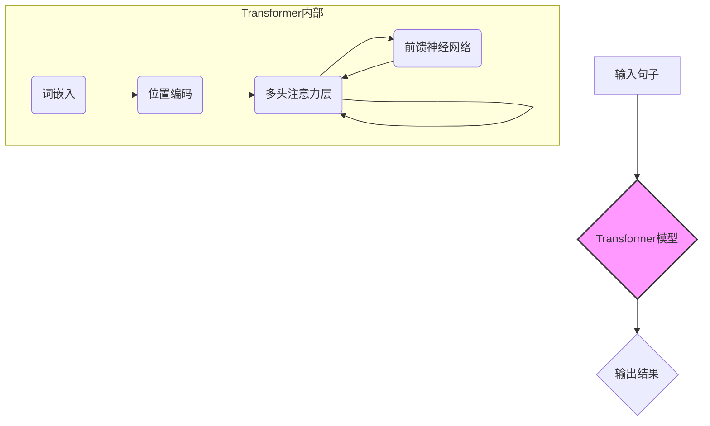
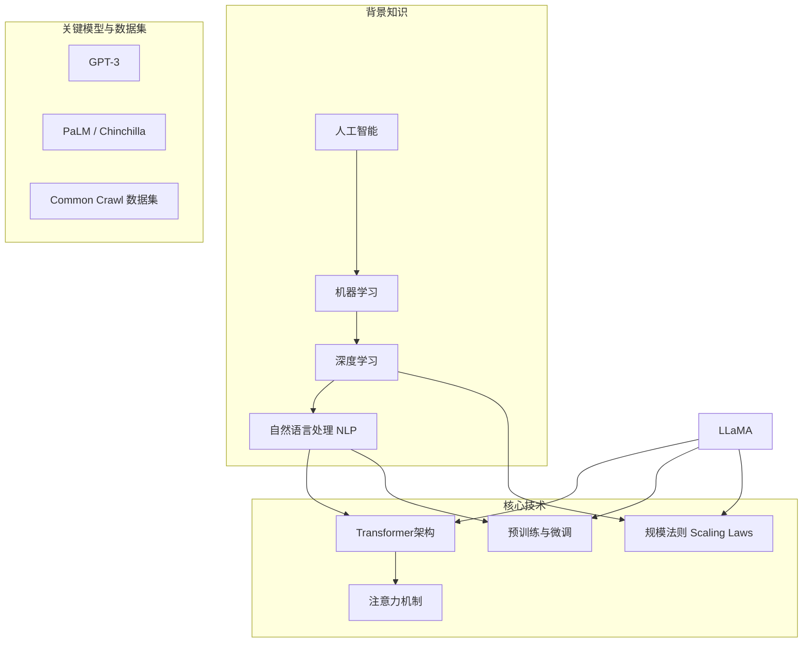

## AI论文解读 | LLaMA: Open and Efficient Foundation Language Models
        
### 作者        
digoal        
        
### 日期        
2025-06-12        
        
### 标签        
PostgreSQL , PolarDB , DuckDB , AI , 论文解读        
        
----        
        
## 背景       
      
https://arxiv.org/pdf/2302.13971        
        
提示:        
```        
读懂《LLaMA: Open and Efficient Foundation Language Models》这篇论文需要提前掌握哪些基础知识, 请使用中文给我讲一下这些基础知识, 尽量通熟易懂, 可以使用markdown支持的图形增加解释性.        
        
使用中文通熟易懂的解读《LLaMA: Open and Efficient Foundation Language Models》这篇论文, 关键内容请深入讲解, 可以使用markdown支持的图形增加解释性.        
        
使用中文提取《LLaMA: Open and Efficient Foundation Language Models》论文中一些重要的术语并详细解释, 可以使用markdown支持的图形示增加解释性.        
```        
        
## 1 前置知识  
  
要读懂 Meta AI 于 2023 年发表的论文《LLaMA: Open and Efficient Foundation Language Models》，你需要对人工智能，特别是自然语言处理（NLP）和深度学习领域的一些核心概念有所了解。这篇论文介绍了一系列名为 LLaMA 的开源大型语言模型，旨在让更多的研究者能够接触和使用最先进的模型。

以下是你需要掌握的基础知识，我会用通俗易懂的方式为你讲解：

### 核心概念

#### 1. 什么是大型语言模型 (LLM)？

想象一个非常聪明的“文字接龙”高手。你给它一段话，它能预测下一个最可能出现的词或句子。大型语言模型 (Large Language Model, LLM) 就是通过在海量文本数据上进行训练，学会了这种能力的巨型神经网络模型。它们不仅能做文字接-龙，还能进行翻译、写摘要、回答问题，甚至编写代码。

* **基础**: 模型通过学习庞大的文本数据（例如整个维基百科、无数书籍和网页）来理解语言的规律。
* **关键点**: “大型”指的是模型的参数量巨大，通常有数十亿甚至上千亿个参数。参数越多，模型通常能力越强，也越复杂。

#### 2. Transformer 架构：LLM 的基石

Transformer 是目前几乎所有主流 LLM（包括 LLaMA、GPT-3）都在使用的神经网络架构。它在 2017 年被提出，彻底改变了自然语言处理领域。

* **核心机制：注意力机制 (Attention Mechanism)**
    * **直观理解**: 当我们阅读句子时，我们会特别关注某些关键词来理解句意。例如，“我昨天在银行存了钱”，这里的“银行”指的是金融机构，而不是河岸。注意力机制让模型在处理一个词时，能够“关注”到句子中其他相关的词，并根据这些相关词来更好地理解当前词的含义。
    * **优势**: 相比于老一代的模型（如 RNN、LSTM），Transformer 可以更好地处理长距离的依赖关系，并且能够并行计算，大大提高了训练效率。



* **你需要了解的**:
    * **词嵌入 (Word Embedding)**: 将文字转换成计算机可以理解的数字向量。
    * **位置编码 (Positional Encoding)**: 因为 Transformer 本身无法感知词的顺序，所以需要额外给模型输入位置信息。
    * **多头注意力 (Multi-Head Attention)**: 同时从不同角度去关注句子的不同部分，就像我们从不同维度去理解一句话一样。

#### 3. 训练过程：预训练与微调

LLM 的训练通常分为两个阶段：

1.   **预训练 (Pre-training)**  
- **目标**: 在大规模、无标注的文本数据上进行训练，让模型掌握通用的语言知识。LLaMA 就是在数万亿的词元（tokens）上进行预训练的  。
- **方式**: 通常是“遮盖语言模型”（像做完形填空）或“下一词预测”（像文字接龙）。
- **耗时耗力**: 这个阶段需要巨大的计算资源（成百上千的 GPU）和非常长的时间（数周甚至数月）  。
  
2.   **微调 (Fine-tuning)**  
- **目标**: 在预训练好的通用模型基础上，使用一个更小、针对特定任务（如翻译、客服对话）的数据集进行二次训练，让模型适应特定领域的需求。
- **优势**: 相比于从零开始训练，微调的成本要低得多。LLaMA 的论文也探讨了指令微调（Instruction Finetuning），即通过微调让模型学会理解和遵循人类的指令  。

#### 4. 关键术语和指标

*  **参数 (Parameters)**: 模型中的可调变量，模型的知识就存储在这些参数中。LLaMA 系列模型的参数量从 70 亿 (7B) 到 650 亿 (65B) 不等  。
*  **词元 (Token)**: 模型处理文本的基本单位。可以是一个词，也可以是半个词或一个字符。例如，“unbelievable” 可能会被拆分成 “un”、“believ” 和 “able” 三个词元。LLaMA 的训练数据量达到了 1.4 万亿个词元  。
*  **Scaling Laws (规模法则)**   : 一个重要的研究发现，即模型的性能与模型大小、数据集大小和计算量之间存在可预测的幂律关系。LLaMA 的研究也受到了 Chinchilla 规模法则的启发   ，即在有限的计算预算下，训练一个较小的模型并使用更多的数据，可能比训练一个巨大的模型但数据量不足效果更好  。
*  **推理 (Inference)**: 使用训练好的模型来生成结果的过程。对于大型模型来说，推理成本也是一个需要重点考虑的因素。LLaMA 的一个重要目标就是提升模型的推理效率  。
*  **开源 (Open Source)**: LLaMA 的一大贡献就是将模型开源  ，这意味着研究人员可以免费获取模型权重，进行自己的研究，这与当时像 GPT-3 等闭源模型形成了鲜明对比。

### 总结

为了顺利阅读 LLaMA 论文，你需要具备以下知识图谱：



 简单来说，如果你能理解“**LLM 是一个基于 Transformer 架构的、通过在海量数据上进行预训练从而学会语言规律的超大模型，而 LLaMA 的贡献在于高效地训练了一系列不同大小的开源模型，让更多人可以用得起、做得好研究**”，那么你就已经掌握了读懂这篇论文的核心思想。在此基础上，再去深入了解论文中提到的具体模型改进（如 RMSNorm 预归一化   、SwiGLU 激活函数   等）和实验结果，就会变得容易得多。
  
## 2 解读论文  
  

  
## 3 术语  
  

  
## 参考        
        
https://arxiv.org/pdf/2302.13971        
        
        
<b> 以上内容基于DeepSeek、Qwen、Gemini及诸多AI生成, 轻微人工调整, 感谢杭州深度求索人工智能、阿里云、Google等公司. </b>        
        
<b> AI 生成的内容请自行辨别正确性, 当然也多了些许踩坑的乐趣, 毕竟冒险是每个男人的天性.  </b>        
  
  
  
#### [期望 PostgreSQL|开源PolarDB 增加什么功能?](https://github.com/digoal/blog/issues/76 "269ac3d1c492e938c0191101c7238216")
  
  
#### [PolarDB 开源数据库](https://openpolardb.com/home "57258f76c37864c6e6d23383d05714ea")
  
  
#### [PolarDB 学习图谱](https://www.aliyun.com/database/openpolardb/activity "8642f60e04ed0c814bf9cb9677976bd4")
  
  
#### [PostgreSQL 解决方案集合](../201706/20170601_02.md "40cff096e9ed7122c512b35d8561d9c8")
  
  
#### [德哥 / digoal's Github - 公益是一辈子的事.](https://github.com/digoal/blog/blob/master/README.md "22709685feb7cab07d30f30387f0a9ae")
  
  
#### [About 德哥](https://github.com/digoal/blog/blob/master/me/readme.md "a37735981e7704886ffd590565582dd0")
  
  

  
