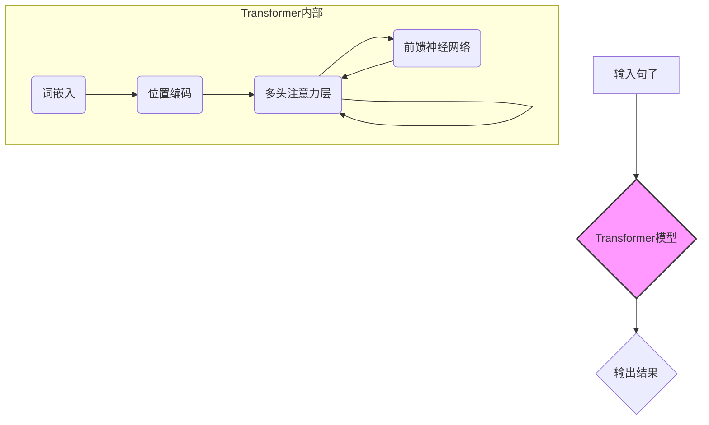
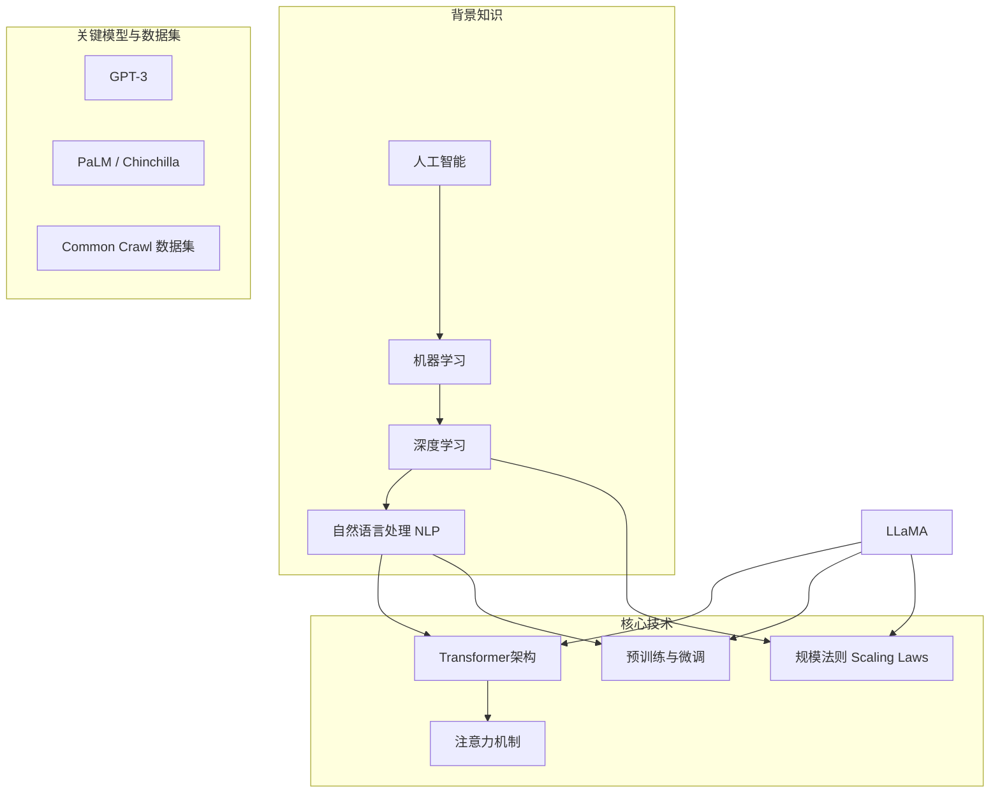
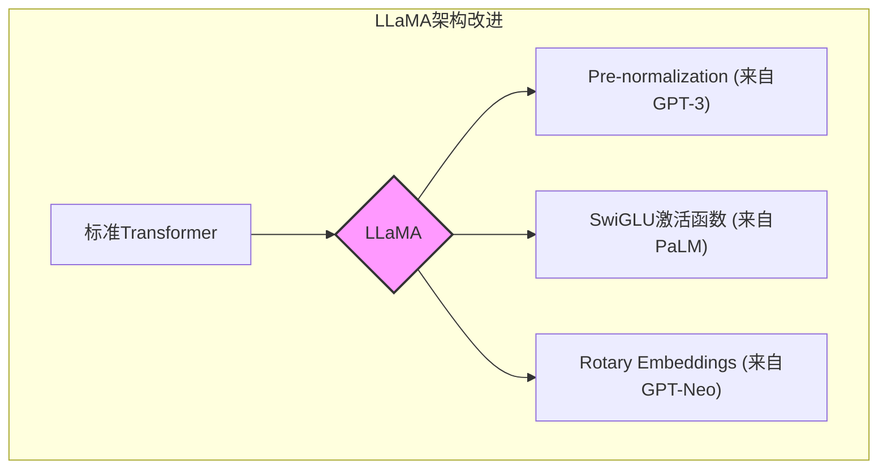
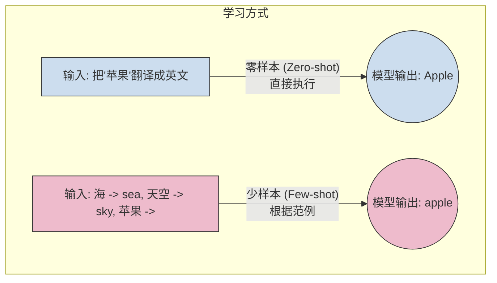

## AI论文解读 | LLaMA: Open and Efficient Foundation Language Models
        
### 作者        
digoal        
        
### 日期        
2025-06-12        
        
### 标签        
PostgreSQL , PolarDB , DuckDB , AI , 论文解读        
        
----        
        
## 背景       
      
https://arxiv.org/pdf/2302.13971        
        
提示:        
```        
读懂《LLaMA: Open and Efficient Foundation Language Models》这篇论文需要提前掌握哪些基础知识, 请使用中文给我讲一下这些基础知识, 尽量通熟易懂, 可以使用markdown支持的图形增加解释性.        
        
使用中文通熟易懂的解读《LLaMA: Open and Efficient Foundation Language Models》这篇论文, 关键内容请深入讲解, 可以使用markdown支持的图形增加解释性.        
        
使用中文提取《LLaMA: Open and Efficient Foundation Language Models》论文中一些重要的术语并详细解释, 可以使用markdown支持的图形示增加解释性.        
```        
        
## 1 前置知识  
  
要读懂 Meta AI 于 2023 年发表的论文《LLaMA: Open and Efficient Foundation Language Models》，你需要对人工智能，特别是自然语言处理（NLP）和深度学习领域的一些核心概念有所了解。这篇论文介绍了一系列名为 LLaMA 的开源大型语言模型，旨在让更多的研究者能够接触和使用最先进的模型。

以下是你需要掌握的基础知识，我会用通俗易懂的方式为你讲解：

### 核心概念

#### 1. 什么是大型语言模型 (LLM)？

想象一个非常聪明的“文字接龙”高手。你给它一段话，它能预测下一个最可能出现的词或句子。大型语言模型 (Large Language Model, LLM) 就是通过在海量文本数据上进行训练，学会了这种能力的巨型神经网络模型。它们不仅能做文字接-龙，还能进行翻译、写摘要、回答问题，甚至编写代码。

* **基础**: 模型通过学习庞大的文本数据（例如整个维基百科、无数书籍和网页）来理解语言的规律。
* **关键点**: “大型”指的是模型的参数量巨大，通常有数十亿甚至上千亿个参数。参数越多，模型通常能力越强，也越复杂。

#### 2. Transformer 架构：LLM 的基石

Transformer 是目前几乎所有主流 LLM（包括 LLaMA、GPT-3）都在使用的神经网络架构。它在 2017 年被提出，彻底改变了自然语言处理领域。

* **核心机制：注意力机制 (Attention Mechanism)**
    * **直观理解**: 当我们阅读句子时，我们会特别关注某些关键词来理解句意。例如，“我昨天在银行存了钱”，这里的“银行”指的是金融机构，而不是河岸。注意力机制让模型在处理一个词时，能够“关注”到句子中其他相关的词，并根据这些相关词来更好地理解当前词的含义。
    * **优势**: 相比于老一代的模型（如 RNN、LSTM），Transformer 可以更好地处理长距离的依赖关系，并且能够并行计算，大大提高了训练效率。



* **你需要了解的**:
    * **词嵌入 (Word Embedding)**: 将文字转换成计算机可以理解的数字向量。
    * **位置编码 (Positional Encoding)**: 因为 Transformer 本身无法感知词的顺序，所以需要额外给模型输入位置信息。
    * **多头注意力 (Multi-Head Attention)**: 同时从不同角度去关注句子的不同部分，就像我们从不同维度去理解一句话一样。

#### 3. 训练过程：预训练与微调

LLM 的训练通常分为两个阶段：

1.   **预训练 (Pre-training)**  
- **目标**: 在大规模、无标注的文本数据上进行训练，让模型掌握通用的语言知识。LLaMA 就是在数万亿的词元（tokens）上进行预训练的  。
- **方式**: 通常是“遮盖语言模型”（像做完形填空）或“下一词预测”（像文字接龙）。
- **耗时耗力**: 这个阶段需要巨大的计算资源（成百上千的 GPU）和非常长的时间（数周甚至数月）  。
  
2.   **微调 (Fine-tuning)**  
- **目标**: 在预训练好的通用模型基础上，使用一个更小、针对特定任务（如翻译、客服对话）的数据集进行二次训练，让模型适应特定领域的需求。
- **优势**: 相比于从零开始训练，微调的成本要低得多。LLaMA 的论文也探讨了指令微调（Instruction Finetuning），即通过微调让模型学会理解和遵循人类的指令  。

#### 4. 关键术语和指标

*  **参数 (Parameters)**: 模型中的可调变量，模型的知识就存储在这些参数中。LLaMA 系列模型的参数量从 70 亿 (7B) 到 650 亿 (65B) 不等  。
*  **词元 (Token)**: 模型处理文本的基本单位。可以是一个词，也可以是半个词或一个字符。例如，“unbelievable” 可能会被拆分成 “un”、“believ” 和 “able” 三个词元。LLaMA 的训练数据量达到了 1.4 万亿个词元  。
*  **Scaling Laws (规模法则)**   : 一个重要的研究发现，即模型的性能与模型大小、数据集大小和计算量之间存在可预测的幂律关系。LLaMA 的研究也受到了 Chinchilla 规模法则的启发   ，即在有限的计算预算下，训练一个较小的模型并使用更多的数据，可能比训练一个巨大的模型但数据量不足效果更好  。
*  **推理 (Inference)**: 使用训练好的模型来生成结果的过程。对于大型模型来说，推理成本也是一个需要重点考虑的因素。LLaMA 的一个重要目标就是提升模型的推理效率  。
*  **开源 (Open Source)**: LLaMA 的一大贡献就是将模型开源  ，这意味着研究人员可以免费获取模型权重，进行自己的研究，这与当时像 GPT-3 等闭源模型形成了鲜明对比。

### 总结

为了顺利阅读 LLaMA 论文，你需要具备以下知识图谱：



 简单来说，如果你能理解“**LLM 是一个基于 Transformer 架构的、通过在海量数据上进行预训练从而学会语言规律的超大模型，而 LLaMA 的贡献在于高效地训练了一系列不同大小的开源模型，让更多人可以用得起、做得好研究**”，那么你就已经掌握了读懂这篇论文的核心思想。在此基础上，再去深入了解论文中提到的具体模型改进（如 RMSNorm 预归一化   、SwiGLU 激活函数   等）和实验结果，就会变得容易得多。
  
## 2 解读论文  
  
好的，我们来一起深入解读这篇具有里程碑意义的论文——《LLaMA: Open and Efficient Foundation Language Models》。

 这篇论文的核心贡献是，Meta AI 推出了一系列参数规模从 70 亿 (7B) 到 650 亿 (65B) 的基础语言模型，名为 **LLaMA**。其最突出的特点是**开源**且**高效**。研究证明，在性能上，LLaMA 能够在远小于竞争对手（如 GPT-3）模型规模的情况下，达到甚至超越它们的水平，并且完全使用公开可用的数据集进行训练  。

---

### **论文动机：让先进的 LLM 更触手可及**

在 LLaMA 出现之前，性能最顶尖的大型语言模型（如 OpenAI 的 GPT-3 或 Google 的 PaLM）通常是闭源的，研究者无法获取其模型权重，这极大地限制了对模型工作机制、鲁棒性、偏见等问题的深入研究。

Meta 的研究动机可以概括为以下几点：

1.   **突破“越大越好”的定势**：当时普遍的观点是，模型参数越多，性能越好   。但最近的研究（如 DeepMind 的 Chinchilla）指出，在给定的计算预算下，用更多的数据训练一个较小的模型，效果可能优于用较少数据训练一个巨大的模型  。
2.   **关注推理效率**：对于实际应用而言，模型的推理成本至关重要。一个训练时间更长但尺寸更小的模型，在部署和使用时会便宜得多、快得多  。LLaMA 的目标就是训练出一系列在不同推理预算下性能最优的模型。
3.   **坚持使用公开数据**：为了保证研究的开放性和可复现性，LLaMA 坚持只使用公开可用的数据集，而不依赖于任何私有或未公开的数据  。
4.   **推动社区研究**：通过发布这些模型，Meta 希望能“民主化”对 LLM 的访问权限，让更多没有巨大计算资源的研究机构也能参与到这个领域的前沿探索中来  。

---

### **关键内容深入讲解**

#### **1. 预训练数据：纯净的“公开口粮”**

 LLaMA 的训练数据完全来自公开来源，总计约 1.4 万亿（Trillion）个词元 (tokens)   。数据配比如下表所示，主要以英文为主  。

| 数据集 | 采样比例 | 训练轮数 (Epochs on 1.4T) | 磁盘大小 | 来源与特点 |
| :--- | :---: | :---: | :---: | :--- |
| **CommonCrawl** | 67% | 1.10 | 3.3 TB |  经过 CCNet 流水线处理的网页数据，去重、去除非英语和低质量内容  。 |
| **C4** | 15% | 1.06 | 783 GB |  同样是网页数据，但使用了不同的清洗和过滤方法，增加数据多样性  。 |
| **GitHub** | 4.5% | 0.64 | 328 GB |  仅包含使用 Apache, BSD 和 MIT 等宽松许可证的开源代码项目  。 |
| **Wikipedia** | 4.5% | 2.45 | 83 GB |  覆盖 20 种语言的维基百科数据，移除了超链接和模板等格式  。 |
| **Books** | 4.5% | 2.23 | 85 GB |  混合了 Gutenberg 项目（公共领域书籍）和 ThePile 的 Books3 部分（当代书籍） 。 |
| **ArXiv** | 2.5% | 1.06 | 92 GB |  用于增加科学文献数据，移除了引言前和参考文献后的所有内容  。 |
| **Stack Exchange** | 2.0% | 1.03 | 78 GB |  一个高质量的问答网站数据，覆盖从计算机到化学的多个领域  。 |

 *表格内容源自原论文 Table 1  。*

**值得注意的细节**：
*  大部分数据在训练中只使用一次，但 Wikipedia 和 Books 这两个高质量数据集被使用了约 2 个轮次（epochs） 。
* 与 PaLM 或 Chinchilla 不同，LLaMA 使用的代码数据相对较少。

#### **2. 模型架构：在巨人肩膀上的微创新**

 LLaMA 的基础架构仍然是 **Transformer**，但它融合了后续研究中被证明有效的多项改进  。



*  **Pre-normalization (预归一化)**   : 为了提升训练稳定性，LLaMA 将归一化层（Normalization Layer）放在了每个 Transformer 子层（注意力层和前馈网络层）的输入部分，而不是输出部分。它使用的是 **RMSNorm**，这是一种计算更简单的归一化方法  。
*  **SwiGLU Activation Function (SwiGLU 激活函数)**   : LLaMA 使用了 PaLM 模型中引入的 SwiGLU 激活函数来替换标准的 ReLU 函数，这被证明可以显著提升性能   。同时，它将前馈网络的中间层维度从标准的 `4d` 缩小到了 `(2/3)*4d`，在提升性能的同时减少了参数量  。
*  **Rotary Embeddings (RoPE, 旋转位置编码)**   : LLaMA 放弃了绝对位置编码，转而使用由 GPT-Neo 模型引入的旋转位置编码。RoPE 将位置信息添加到了网络的每一层，能更好地捕捉词与词之间的相对位置关系  。

#### **3. 训练与效率：又快又省**

训练大型模型是一个巨大的工程挑战。LLaMA 在效率上做了很多优化。

*  **高效的注意力实现**：使用了 `xformers` 库中一个高效的、内存友好的多头注意力实现   。这种方法通过不存储巨大的注意力权重矩阵，以及不计算那些因为因果关系而被遮盖掉的键/查询得分，来减少内存占用和运行时间  。
*  **Checkpointing 优化**：在反向传播过程中，为了减少需要重新计算的激活值数量，LLaMA 选择性地保存那些计算成本高昂的激活值（如线性层的输出），而不是全部保存  。
*  **训练速度**：在 2048 个 A100 80GB GPU 上训练 65B 模型时，处理速度约为每秒每 GPU 380 个词元   。完成整个 1.4T 词元的训练大约需要 **21天**  。

#### **4. 核心结果：小模型大能量**

LLaMA 的性能非常出色，颠覆了人们对模型尺寸的传统认知。

*  **LLaMA-13B vs GPT-3 (175B)**: 在绝大多数基准测试上，**130亿参数的 LLaMA 模型性能超越了 1750 亿参数的 GPT-3**，尽管其尺寸小了超过 10 倍   。这是一个惊人的结果，充分证明了“小模型+更多数据”策略的有效性。例如，在常识推理（Common Sense Reasoning）任务上，LLaMA-13B 在多数指标上都优于 GPT-3  。
*  **LLaMA-65B vs Chinchilla-70B & PaLM-540B**: 650 亿参数的 LLaMA 模型，其性能与业界顶尖的 Chinchilla-70B 和 PaLM-540B 模型不相上下，非常有竞争力   。例如，在常识推理上，LLaMA-65B 的平均表现超过了 Chinchilla-70B  。

*常识推理任务零样本（Zero-shot）性能对比 (部分数据)*
| 模型 | 参数量 | BoolQ | PIQA | HellaSwag | WinoGrande |
| :--- | :---: | :---: | :---: | :---: | :---: |
| GPT-3 | 175B | 60.5 | 81.0 | 78.9 | 70.2 |
| Chinchilla | 70B | 83.7 | 81.8 | 80.8 | 74.9 |
| PaLM | 540B | 88.0 | 82.3 | 83.4 | 81.1 |
| **LLaMA-13B** | **13B** | **78.1** | **80.1** | **79.2** | **73.0** |
| **LLaMA-65B** | **65B** | **85.3** | **82.8** | **84.2** | **77.0** |

 *数据源自原论文 Table 3  。*

---

### **论文的意义与影响**

LLaMA 的发布是大型语言模型发展史上的一个重要转折点。

* **降低研究门槛**：它让学术界和中小型公司的研究者也能用上最先进的模型，极大地促进了 LLM 领域的创新和研究的多样性。后续许多著名的开源模型（如 Alpaca, Vicuna）都是在 LLaMA 的基础上通过指令微调发展而来的。
* **验证了 Chinchilla 的 scaling laws**：LLaMA 的成功实践，强有力地证明了在算力受限的情况下，优先增加数据量是比盲目增大模型尺寸更优的策略。
* **引领了开源潮流**：LLaMA 的开源推动了整个行业的开放氛围，促使更多的公司和研究机构分享他们的模型和研究成果，加速了技术的发展和普及。

总而言之，LLaMA 不仅仅是发布了一系列强大的模型，更重要的是，它向整个 AI 社区传递了一种**开放、高效、务实**的研究理念。它证明了不依赖私有数据和无限制的计算资源，同样可以达到世界一流的水平，从而开启了开源大型语言模型的新纪元。
  
## 3 术语  
  
好的，以下是《LLaMA: Open and Efficient Foundation Language Models》论文中的一些重要术语及其详细解释。

### **核心概念**

#### **Foundation Language Models (基础语言模型)**
 这指的是像 LLaMA 或 GPT-3 这样，通过在海量数据上进行预训练而获得的通用模型   。它们不为解决某个特定任务而生，而是掌握了广泛的语言知识和推理能力，可以作为各种下游应用（如翻译、问答、写作）的“基础”   。通过微调（fine-tuning）或上下文学习（in-context learning），它们能快速适应新任务  。

---
#### **Scaling Laws (规模法则)**
 规模法则是指模型性能与**模型大小**、**数据集大小**和**训练计算量**之间存在的可预测关系   。论文提到，近期的工作（如 Hoffmann et al., 2022）发现，对于给定的计算预算，最佳性能并非由最大的模型实现，而是由在更多数据上训练的较小模型实现   。LLaMA 的研究深受这一法则启发，其目标就是在不同推理预算下找到性能最佳的模型尺寸和数据配比  。

---
#### **Inference Budget (推理预算)**
 这指的是在实际部署和使用模型时，对计算资源（如时间、硬件）的限制   。论文强调，即使训练一个大模型可能更快达到某一性能水平，但一个训练更久的小模型在推理时会更便宜、更高效   。因此，LLaMA 的设计高度关注推理效率，旨在成为在给定性能水平下，推理速度最快的模型  。

---
#### **Zero-shot & Few-shot Learning (零样本 & 少样本学习)**
这是大型语言模型展示其强大泛化能力的主要方式。
*  **Zero-shot (零样本)**：在不提供任何范例的情况下，仅通过对任务的文字描述，就让模型直接执行任务  。例如，直接对模型说：“把‘你好’翻译成英文”。
*  **Few-shot (少样本)**：在任务指令之外，还给模型提供少量（1到64个）的“问题-答案”范例，让模型通过上下文学习如何更好地完成任务  。


---
### **架构与训练**
#### **Transformer Architecture (Transformer 架构)**
 这是 LLaMA 和当前几乎所有主流大型语言模型的基础神经网络架构  。论文在此基础上集成了一些关键的改进，以提升性能和训练稳定性。

---
#### **Pre-normalization (预归一化)**
 为了提升训练稳定性，LLaMA 采用了预归一化方法   。具体来说，它在每个 Transformer 子层的输入端（而不是输出端）进行归一化操作   。论文中使用了 **RMSNorm** (Root Mean Square Layer Normalization)，这是一种计算上更简单的归一化技术  。

---
#### **SwiGLU Activation Function (SwiGLU 激活函数)**
 LLaMA 使用了 SwiGLU 激活函数来替换了标准的 ReLU 非线性函数，以提升模型性能   。这一做法借鉴自 PaLM 模型   。同时，模型的中间层维度也从 `4d` 减少到了 `(2/3)*4d`  。

---
#### **Rotary Embeddings (RoPE, 旋转位置编码)**
 LLaMA 移除了传统的绝对位置嵌入，转而在网络的每一层都添加了旋转位置编码   。这种方法能更有效地将词的相对位置信息融入自注意力计算中，由 GPT-Neo 模型引入  。

---
#### **Tokenizer (分词器)**
 分词器负责将原始文本切分成模型能够理解的最小单元，即“词元”(token)。LLaMA 使用了**字节对编码 (Byte-Pair Encoding, BPE)** 算法   。一个显著的特点是，它会将所有数字拆分成单个数字进行编码，并能回退到字节级别来处理未知的 UTF-8 字符   。整个训练数据集在分词后包含了约 1.4 万亿个词元  。

  
## 参考        
        
https://arxiv.org/pdf/2302.13971        
        
        
<b> 以上内容基于DeepSeek、Qwen、Gemini及诸多AI生成, 轻微人工调整, 感谢杭州深度求索人工智能、阿里云、Google等公司. </b>        
        
<b> AI 生成的内容请自行辨别正确性, 当然也多了些许踩坑的乐趣, 毕竟冒险是每个男人的天性.  </b>        
  
  
  
#### [期望 PostgreSQL|开源PolarDB 增加什么功能?](https://github.com/digoal/blog/issues/76 "269ac3d1c492e938c0191101c7238216")
  
  
#### [PolarDB 开源数据库](https://openpolardb.com/home "57258f76c37864c6e6d23383d05714ea")
  
  
#### [PolarDB 学习图谱](https://www.aliyun.com/database/openpolardb/activity "8642f60e04ed0c814bf9cb9677976bd4")
  
  
#### [PostgreSQL 解决方案集合](../201706/20170601_02.md "40cff096e9ed7122c512b35d8561d9c8")
  
  
#### [德哥 / digoal's Github - 公益是一辈子的事.](https://github.com/digoal/blog/blob/master/README.md "22709685feb7cab07d30f30387f0a9ae")
  
  
#### [About 德哥](https://github.com/digoal/blog/blob/master/me/readme.md "a37735981e7704886ffd590565582dd0")
  
  

  
