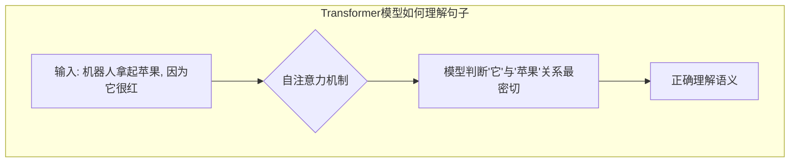
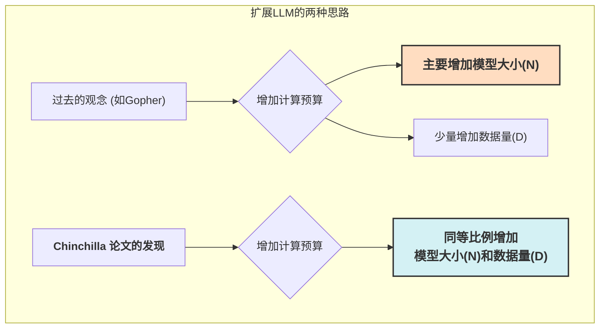
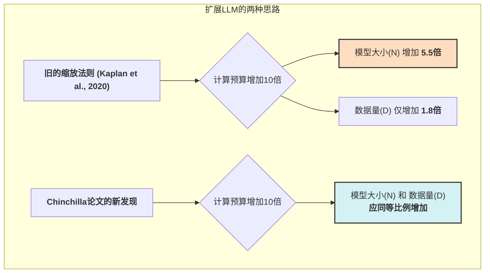
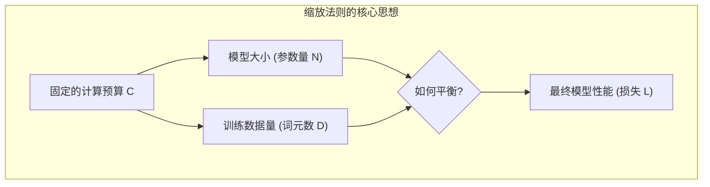
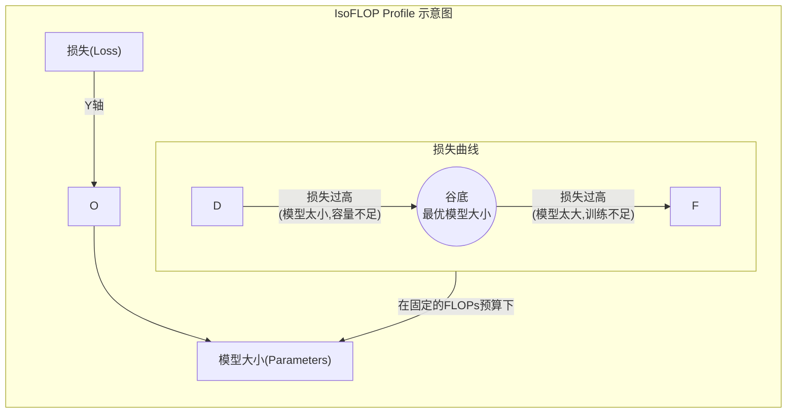

## AI论文解读 | Training Compute-Optimal Large Language Models
        
### 作者        
digoal        
        
### 日期        
2025-06-13        
        
### 标签        
PostgreSQL , PolarDB , DuckDB , AI , 论文解读        
        
----        
        
## 背景       
      
https://arxiv.org/pdf/2203.15556        
        
提示:        
```        
读懂《Training Compute-Optimal Large Language Models》这篇论文需要提前掌握哪些基础知识, 请使用中文给我讲一下这些基础知识, 尽量通熟易懂, 可以使用markdown支持的图形增加解释性.        
        
使用中文通熟易懂的解读《Training Compute-Optimal Large Language Models》这篇论文, 关键内容请深入讲解, 可以使用markdown支持的图形增加解释性.        
        
使用中文提取《Training Compute-Optimal Large Language Models》论文中一些重要的术语并详细解释, 可以使用markdown支持的图形示增加解释性.        
```        
        
## 1 前置知识  
  
当然可以！为了完全理解DeepMind的这篇著名论文《Training Compute-Optimal Large Language Models》（也就是“Chinchilla”论文），你需要了解一些关于人工智能、特别是自然语言处理（NLP）的基础知识。

我会将这些知识点分为几个部分，用通俗易懂的语言和图示来解释。

---

### Part 1: 核心概念：什么是大语言模型 (LLM)？

首先，你需要知道这篇论文研究的主体是什么。

**大语言模型 (Large Language Model, LLM)** 可以被想象成一个非常博学的“文字接龙”或“句子补全”大师。你给它一段话，它的核心任务就是预测下一个最可能出现的词或字是什么。通过在海量（上千亿甚至上万亿词）的文本数据上进行训练，它学会了语法、事实、逻辑、风格，甚至一定的推理能力。

**关键技术：Transformer 架构**

 现代几乎所有最先进的LLM（包括GPT系列、Gopher和本篇论文的主角Chinchilla）都基于一个叫做 **Transformer** 的神经网络架构  。你不需要了解它所有的数学细节，但需要明白它的核心创新：

* **自注意力机制 (Self-Attention):** 这是Transformer的“秘密武器”。当模型处理一个句子时，自注意力机制能让它在生成下一个词时，**关注**到输入句子中所有其他词，并判断每个词与当前位置的相关性（即“权重”）。

举个例子，在句子“机器人拿起苹果，因为它很红”中，为了理解“它”指代什么，模型需要特别关注“苹果”而不是“机器人”。自注意力机制就能做到这一点。


 这篇论文研究的就是这种基于Transformer架构的自生成（Autoregressive）模型  。

---

### Part 2: 训练的"配方"：关键要素解析

这篇论文的核心是关于如何**最高效地训练**LLM。你需要理解训练过程中的几个关键“配方”或变量。

1.  **参数 (Parameters, N):**
    * **是什么：** 模型内部的可调变量，可以理解为模型大脑中的“神经元连接强度”。
    *  **意义：** 参数量的大小直接决定了模型的“容量”或“潜力”。参数越多，模型理论上能学习和记忆的知识就越多，模型也就越“大”。例如，GPT-3有1750亿（175B）个参数   ，而Gopher有2800亿（280B）个  。

2.  **训练数据 (Training Tokens, D):**
    * **是什么：** 用来训练模型的文本数据。这些文本被切分成一个个的“词元”（Token），一个Token可以是一个单词、一个词根或一个标点。
    * **意义：** 喂给模型的数据量，相当于让一个学生读了多少本书。数据量越大，模型见过的世面就越广。

3.  **计算量 (Compute, C, measured in FLOPs):**
    * **是什么：** Floating Point Operations per Second，即每秒浮点运算次数。它衡量了训练一个模型所需要消耗的计算资源总量。
    *  **意义：** 这可以看作是你的“总预算”。在现实中，计算资源（比如GPU/TPU的使用时间）是有限且昂贵的  。这篇论文的所有讨论都基于一个大前提：**在给定的计算量预算下**。

4.  **损失函数 (Loss Function, L):**
    * **是什么：** 一个衡量模型预测有多“差”的数学函数。它计算模型预测的下一个词与真实文本中下一个词之间的差距。
    * **意义：** 训练的目标就是不断调整模型的参数（N），使得这个“损失值”尽可能地**降到最低**。损失值越低，说明模型预测得越准。

---

### Part 3: 论文的核心论点：计算最优缩放法则 (Compute-Optimal Scaling Laws)

这是理解本篇论文最核心的部分。

 在Chinchilla论文发表之前，主流观点认为，要提升模型性能，最有效的方法是**大力增加模型的参数量（N）**，而训练数据量（D）的增长则相对较慢   。这个趋势导致了像Gopher (280B)和Megatron-Turing NLG (530B)这样的“巨无霸”模型的诞生  。

 然而，DeepMind的研究者们提出了一个不同的问题：**在固定的计算量（C）预算下，如何分配资源给模型大小（N）和数据量（D）才能达到最佳性能（即最低的损失L）？**  

**Chinchilla的革命性发现是：**

 为了达到计算最优，**模型大小（N）和训练数据量（D）应该以大致相同的比例进行扩展**  。换句话说，当你将计算预算加倍时，你不应该只把模型尺寸加倍，而应该同时增加模型尺寸和训练数据量。



 这篇论文通过超过400次不同规模的训练实验，拟合出了一条“最优缩放曲线”，发现最优的模型参数量和数据量都大约与计算量的平方根成正比（即 $N_{opt} \propto C^{0.5}$ 和 $D_{opt} \propto C^{0.5}$）  。

 这个发现意味着，过去的大多数LLM实际上是“**训练不足**”的（undertrained）  。它们虽然参数量巨大，但没有“阅读”足够多的书籍来充分发挥其潜力。

---

### Part 4: 如何衡量"好坏"：评估指标与方法

要理解论文的结论，你需要知道作者们是如何证明Chinchilla模型更优秀的。

*  **下游任务 (Downstream Tasks):** 指的是将预训练好的通用大模型应用到一些具体任务上，比如问答、摘要、情感分析等，以测试其泛化和应用能力  。

* **Zero-shot / Few-shot Learning:**
    * **Zero-shot (零样本):** 直接向模型提问，不给任何范例。考验模型的基础知识和泛化能力。
    * **Few-shot (少样本):** 在提问前，先给模型看一两个例子。考验模型的快速学习和模仿能力。

* **关键评估基准 (Key Benchmarks):**
    *  **MMLU (Massive Multitask Language Understanding):** 一个非常全面的“大考”，涵盖了从高中到专业级别的57个不同学科（如化学、法律、数学等）的知识   。Chinchilla在这个测试中取得了67.5%的准确率，显著超过了比它大得多的Gopher模型（60.0%）  。
    * **Perplexity (PPL) / Bits-per-byte (bpb):** 这是衡量语言模型本身性能的指标，可以理解为模型对一段文本的“困惑程度”。分数越低，说明模型对文本的预测能力越强，性能越好。

### 总结

为了读懂Chinchilla论文，你需要掌握的知识可以归纳为：

1.  **基本原理：** 了解LLM是基于Transformer架构的、通过预测下一个词来工作的模型。
2.  **核心变量：** 知道**参数量 (N)** 代表模型大小，**数据量 (D)** 代表训练数据多少，而**计算量 (C)** 是训练的总预算。
3.  **核心论点：** 理解论文的突破性发现在于，为了达到计算最优，**N和D应该同步增长**，这与之前主要增长N的思路不同。
4.  **评估方法：** 明白通过MMLU等下游任务和PPL等指标可以衡量一个模型的优劣。

 有了这些背景知识，你就能更好地理解为什么Chinchilla模型（70B参数）虽然比Gopher（280B参数）小得多，却能在几乎所有任务上都表现得更好——因为它虽然“脑容量”小一些，但“读书”读得多了4倍  ，从而实现了更优的计算效率和性能。
  
## 2 解读论文  
  
好的，我们来深入解读一下这篇在人工智能领域具有里程碑意义的论文——《Training Compute-Optimal Large Language Models》，也就是著名的 **Chinchilla（龙猫）** 论文。

这篇论文的核心思想可以用一句话概括：**在训练大型语言模型时，模型的“脑容量”（参数量）和“阅读量”（数据量）同等重要。** 它颠覆了当时“模型越大越好”的普遍认知，为如何高效利用计算资源指明了新的方向。

---

### 1. 时代背景：越大越好的“军备竞赛”

 在Chinchilla论文发表之前，大型语言模型（LLM）领域的主流趋势是不断扩大模型的参数规模  。研究者们认为，模型的参数量（可以理解为神经网络中的连接数量）越大，其学习和推理能力就越强。

这导致了一场“军备竞赛”，催生了众多“巨无霸”模型：

*  **GPT-3 (OpenAI):** 1750亿参数  
*  **Gopher (DeepMind):** 2800亿参数  
*  **Megatron-Turing NLG (NVIDIA & Microsoft):** 5300亿参数  

 然而，这些模型在参数量暴增的同时，其训练数据量却增长缓慢，大多停留在约3000亿个词元（tokens）的水平上  。

**论文要解决的核心问题：**
> 假设你有固定的计算资源（例如，一万块GPU用一个月），你是应该把这些资源用来训练一个参数巨大但只看少量书的“天才”，还是一个参数适中但博览群书的“学霸”？哪种方式能培养出更“聪明”的模型？

---

### 2. 核心发现：颠覆性的“计算最优”缩放法则

 这篇论文通过训练超过400个不同规模的模型，得出了一个革命性的结论：**对于计算最优的训练，模型大小（参数量 N）和训练数据量（词元数 D）应该按同等比例进行扩展  。**

 这意味着，如果你的计算预算增加一倍，最明智的做法不是把模型参数量加倍，而是应该同时增加参数量和数据量  。

我们可以通过一个图表来清晰地对比新旧两种思路：



这篇论文的研究发现，为了达到最低的训练损失（即模型性能最好），对于给定的计算量C，最优的模型参数N和数据量D满足以下关系：
*  $N_{opt} \propto C^{0.5}$  
*  $D_{opt} \propto C^{0.5}$  

 这组指数（0.5 和 0.5）明确指出，两者应该“齐头并进”。而之前的研究（Kaplan et al., 2020）给出的指数分别是0.73和0.27  ，这导致了大家过度投资于模型大小。

 这个发现意味着，当时所有的大型模型，如Gopher，实际上都处于“**训练不足**”（significantly undertrained）的状态  。它们的潜力因为没有“阅读”足够多的数据而远未被完全挖掘。

---

### 3. 实验验证：Chinchilla vs. Gopher

为了证明自己的理论，DeepMind团队进行了一场堪称经典的对决。他们严格遵守新发现的缩放法则，设计并训练了一个新的“计算最优”模型，并将其命名为 **Chinchilla**。

| 特征 | Gopher (旧思路) | Chinchilla (新思路) |
| :--- | :--- | :--- |
| **参数量 (N)** |  2800亿   |  **700亿** (小4倍)   |
| **训练数据量 (D)** |  3000亿 词元   |  **1.4万亿** 词元 (多4倍以上)   |
| **计算量 (FLOPs)** |  **完全相同**   |  **完全相同**   |

**对决结果：Chinchilla全面胜出！**

 尽管Chinchilla的参数量只有Gopher的四分之一，但它在几乎所有被评估的下游任务上都显著优于Gopher以及当时更大的模型，如GPT-3（175B）和Megatron-Turing NLG（530B）  。

*  **MMLU（大规模多任务语言理解）基准测试**：这是一个衡量模型综合知识和推理能力的“高考”。Chinchilla的平均准确率达到了 **67.5%**，相比Gopher的60.0%有**超过7%的巨大提升**  。
*  **阅读理解和常识推理**：Chinchilla在RACE-h、RACE-m等阅读理解任务上的准确率提升超过10%   ，并在多个常识推理任务上超越了Gopher和GPT-3  。
*  **语言建模**：在衡量模型基础能力的The Pile评估集上，Chinchilla在所有子任务上的表现都优于Gopher  。

 Chinchilla的成功雄辩地证明了，一个参数更小但训练数据更充足的模型，其性能可以超越一个参数巨大但训练不足的模型  。

---

### 4. 论文的深远影响与启示

Chinchilla论文的发表，为大型语言模型的发展带来了深刻的变革：

1.   **效率的胜利**：证明了“聪明”地分配计算资源比盲目堆砌参数更重要。一个更小的模型意味着更低的推理和微调成本，极大地便利了模型的实际应用和部署  。
2.   **数据成为新的焦点**：将研究界的注意力从无休止的“参数竞赛”转移到了**高质量、大规模数据集**的构建上。论文强调，为了进一步扩展语言模型的能力，获取更多高质量的训练数据将扮演关键角色  。
3.  **重新定义“最优”**：为后续的LLM（如LLaMA系列）设计提供了一套更科学的“配方”，即在设计模型时需要同时考虑参数量和计划使用的训练数据量，以达到最佳的费效比。

**总结：**

Chinchilla论文就像一位智者，它告诉我们：培养一个全能的AI“学霸”，不仅要给它一个足够大的“脑袋”，更要让它“博览群书”。通过科学地平衡模型大小和数据量，我们可以在有限的资源下，训练出更强大、更高效的语言模型。这一发现至今仍在指导着整个领域的发展方向。
  
## 3 术语  
  
好的，我们来从《Training Compute-Optimal Large Language Models》这篇论文中提取一些重要的术语，并结合原文内容进行通俗易懂的详细解释。

---

### 1. 计算最优 (Compute-Optimal)

这是整篇论文的灵魂和核心目标。

*  **解释**：指在**给定一个固定的计算资源预算（Compute Budget）** 的前提下，通过最优化地配置**模型大小（Parameters）** 和**训练数据量（Tokens）**，来达到最低的最终模型损失（Loss），从而获得最佳性能  。简单来说，就是如何把有限的钱（计算资源）花在刀刃上，培养出最“聪明”的模型。
*  **论文中的意义**：这篇论文挑战了“模型越大越好”的传统观念，探索了“如何最高效”的问题   。它的核心贡献就是为“计算最优”训练提供了一套全新的、经过实验验证的指导法则  。

### 2. 缩放法则 (Scaling Laws)

*  **解释**：指描述模型性能（通常用损失 Loss 来衡量）与模型大小（N）、数据量（D）以及计算量（C）之间关系的数学规律，通常表现为幂律（Power Law）关系  。通过这个法则，研究者可以预测当投入更多资源时，模型的性能会如何提升。
*  **论文中的意义**：这篇论文的主要工作就是提出了一个新的缩放法则  。
    *  **旧法则 (Kaplan et al., 2020)**：认为增加计算预算时，模型大小（N）的增长速度应远快于数据量（D）的增长速度  。
    *  **新法则 (Chinchilla)**：发现为了达到计算最优，**模型大小（N）和数据量（D）应该以几乎相等的比例进行扩展**  。



### 3. 参数 (Parameters, N)

*  **解释**：指神经网络模型中可以被训练和调整的变量（或权重）的数量   。参数量的大小直接决定了模型的规模和复杂性，常被用来衡量一个模型有多“大”  。
*  **论文中的意义**：论文研究了参数量从7000万到超过160亿的各种模型   。它证明了并非参数量越大就一定越好，关键在于参数量要与训练数据量相匹配。例如，700亿参数的Chinchilla就击败了2800亿参数的Gopher  。

### 4. 词元 (Tokens, D)

*  **解释**：是处理文本数据的基本单位，可以是一个单词、一个词组、或甚至一个字符或标点。在训练过程中，海量的文本数据被切分成数十亿甚至上万亿个词元，用来“喂”给模型学习  。
*  **论文中的意义**：论文强调了增加训练词元数量的极端重要性。Chinchilla模型使用了1.4万亿个词元进行训练，是Gopher（3000亿词元）的4倍多  ，这是它成功的关键因素。

### 5. FLOPs (Floating Point Operations)

*  **解释**：即浮点运算次数，是衡量计算量的单位，代表了训练一个模型所需的总计算资源   。对于Transformer模型，计算量（C）约等于 `6 * 参数量(N) * 训练词元数(D)`，即 `C ≈ 6ND`  。
*  **论文中的意义**：FLOPs是整个研究的“锚点”或“预算上限”   。论文的所有分析都基于一个前提：**在FLOPs固定的情况下，如何分配N和D**   。Chinchilla和Gopher的训练就用了完全相同的FLOPs预算  。

### 6. 损失 (Loss)

*  **解释**：一个数学函数，用来衡量模型预测结果与真实标签之间的差距   。在语言模型中，它代表了模型对下一个词预测的“错误程度”。训练过程的目标就是通过不断调整参数来最小化损失值  。
*  **论文中的意义**：这篇论文通过对超过400个模型的最终训练损失进行建模，来寻找N和D的最优关系  。他们发现，当N和D等比例增长时，损失下降得最快，即模型性能提升最高效。

### 7. 训练不足 (Undertrained)

*  **解释**：这是论文对当时（2022年以前）绝大多数大型语言模型状态的一个核心诊断。它指模型的参数量（N）相对于其训练数据量（D）来说**过大**了，导致模型的巨大潜力没有被充分的数据来“激发”或“训练”出来  。
*  **论文中的意义**：这是一个颠覆性的判断。它指出，当时LLM的性能瓶颈不在于模型不够大，而在于数据不够多  。正是因为Gopher等模型“训练不足”，才给了参数更小但数据充足的Chinchilla反超的机会。

### 8. 等计算量曲线 (IsoFLOP Profile)

*  **解释**：这是论文中用来寻找最优模型大小的三种研究方法之一（Approach 2）  。具体做法是，先固定一个总计算量（FLOPs），然后训练一系列不同大小（不同参数N）的模型，并观察哪个模型的最终损失最低  。
*  **论文中的意义**：通过绘制这种曲线，研究者可以清晰地看到一个“U型”的山谷，谷底对应的模型大小就是在该计算预算下的“最优大小”  。这种直观的实验方法有力地支持了论文的结论。


  
## 参考        
        
https://arxiv.org/pdf/2203.15556        
        
        
<b> 以上内容基于DeepSeek、Qwen、Gemini及诸多AI生成, 轻微人工调整, 感谢杭州深度求索人工智能、阿里云、Google等公司. </b>        
        
<b> AI 生成的内容请自行辨别正确性, 当然也多了些许踩坑的乐趣, 毕竟冒险是每个男人的天性.  </b>        
  
  
  
#### [期望 PostgreSQL|开源PolarDB 增加什么功能?](https://github.com/digoal/blog/issues/76 "269ac3d1c492e938c0191101c7238216")
  
  
#### [PolarDB 开源数据库](https://openpolardb.com/home "57258f76c37864c6e6d23383d05714ea")
  
  
#### [PolarDB 学习图谱](https://www.aliyun.com/database/openpolardb/activity "8642f60e04ed0c814bf9cb9677976bd4")
  
  
#### [PostgreSQL 解决方案集合](../201706/20170601_02.md "40cff096e9ed7122c512b35d8561d9c8")
  
  
#### [德哥 / digoal's Github - 公益是一辈子的事.](https://github.com/digoal/blog/blob/master/README.md "22709685feb7cab07d30f30387f0a9ae")
  
  
#### [About 德哥](https://github.com/digoal/blog/blob/master/me/readme.md "a37735981e7704886ffd590565582dd0")
  
  

  
