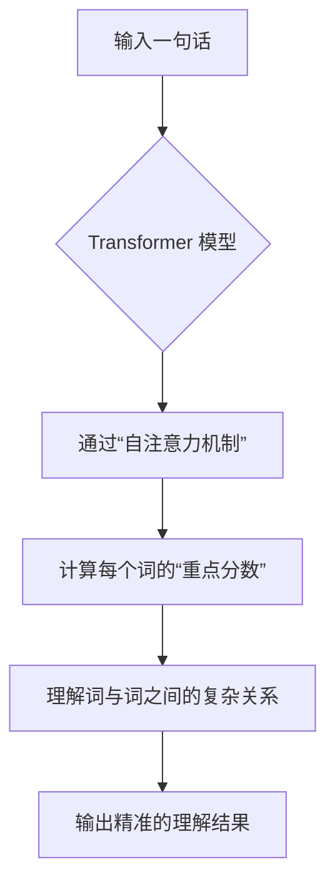
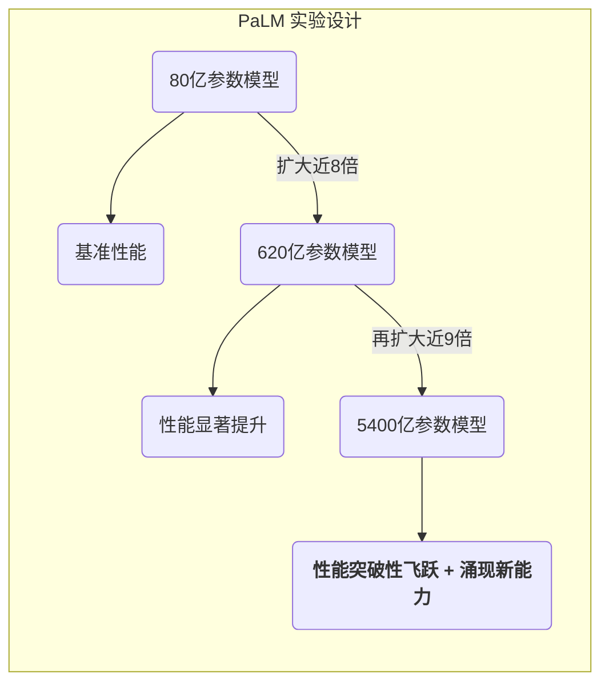
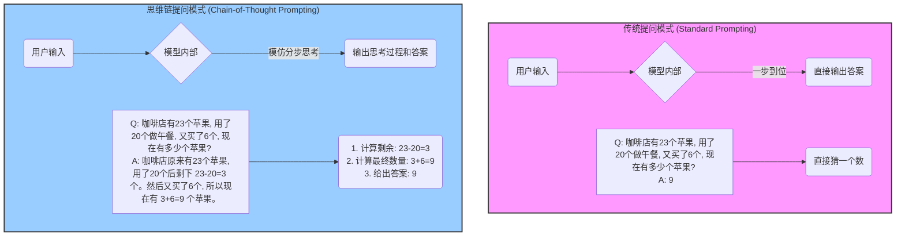
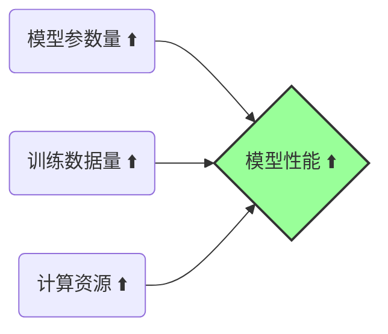
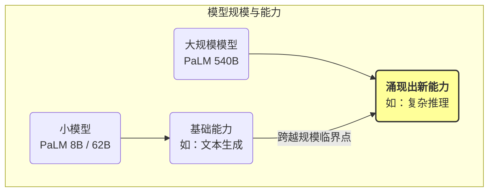

## AI论文解读 | PaLM: Scaling Language Modeling with Pathways
        
### 作者        
digoal        
        
### 日期        
2025-06-14        
        
### 标签        
PostgreSQL , PolarDB , DuckDB , AI , 论文解读        
        
----        
        
## 背景       
      
https://arxiv.org/pdf/2204.02311        
        
提示:        
```        
读懂《PaLM: Scaling Language Modeling with Pathways》这篇论文需要提前掌握哪些基础知识, 请使用中文给我讲一下这些基础知识, 尽量通熟易懂, 可以使用markdown支持的图形增加解释性.        
        
使用中文通熟易懂的解读《PaLM: Scaling Language Modeling with Pathways》这篇论文, 关键内容请深入讲解, 可以使用markdown支持的图形增加解释性.        
        
使用中文提取《PaLM: Scaling Language Modeling with Pathways》论文中一些重要的术语并详细解释, 可以使用markdown支持的图形示增加解释性.        
```        
        
## 1 前置知识 
  
当然可以！读懂《PaLM》这篇论文，就像是挑战一个大 BOSS 之前，先了解它的技能和背景。掌握一些核心概念会让整个阅读过程事半功倍。

下面我为你梳理了所需的基础知识，并用通俗易懂的语言和图示来解释。

---

### 核心基础：你需要了解的 4 个关键概念

要理解 PaLM 的强大之处，首先需要明白它建立在哪些巨人的肩膀上。

#### 1. 语言模型 (Language Model) - 究极的“文字接龙”大师

想象一个超级聪明的“文字接龙”玩家。你给它一句话的前半部分，它能以极高的准确率猜出下一个词。

> **“今天天气真不错，我们一起去...”**

语言模型计算后会告诉你，下一个词很可能是“**公园**”、“**吃饭**”或者“**打球**”，而不是“**睡觉**”或“**开会**”。

**简单来说，语言模型就是一个用来计算一句话出现概率的数学模型**。PaLM 就是一个规模巨大、能力超强的语言模型。它通过学习海量的文本数据（比如整个互联网的公开网页和书籍），掌握了人类语言的规律、知识甚至一定的推理能力。

#### 2. Transformer 模型 - 让机器学会“划重点”

Transformer 是包括 PaLM 在内几乎所有现代大型语言模型（LLM）的“心脏”和“大脑”。它最核心的创新是 **“自注意力机制” (Self-Attention)**。

这个机制解决了什么问题呢？在理解一句话时，每个词的重要性是不同的。

比如这句话：“**它**坐在垫子上，因为**它**很累了。”
为了理解第二个“它”指代的是谁，你的大脑会自动把注意力更多地放在开头的某个词上。

Transformer 模型就像给机器装上了“划重点”的能力。在处理一句话时，它会同时审视所有词，并计算出每个词与其他所有词之间的关联度，然后根据这个关联度来决定“注意力”应该放在哪里。


正是因为这个强大的机制，模型才能处理很长的句子，并精准捕捉上下文的含义，这是 PaLM 能够如此强大的基石。

#### 3. 少样本学习 (Few-shot Learning) - 无需训练，举一反三

传统的机器学习模型要学习一个新任务（比如，翻译、写摘要），需要成千上万个标注好的“学习材料”（数据集）进行专门训练（这个过程叫“微调” Finetuning）。

而像 PaLM 这样的超大语言模型，因为它已经“博览群书”，所以具备了惊人的“举一反三”能力。你不需要再对它进行复杂的训练，只需要在下达指令时，给它看一两个例子就行了。

**这就是“少样本学习”（Few-shot Learning）。**

**例子：教模型把比喻翻译成大白话**

> **我给模型的指令 (Prompt):**
>
> **任务：** 将比喻句转换成直白的描述。
>
> **例子1:**
> 比喻：他紧张得像热锅上的蚂蚁。
> 直白：他非常焦虑，坐立不安。
>
> **例子2:**
> 比喻：会议室里安静得连一根针掉在地上都能听见。
> 直白：会议室里极其安静。
>
> **现在，请转换这个句子:**
> 比喻：听到这个消息，他的心沉到了谷底。
> **直白：** [让 PaLM 来回答]

PaLM 就能立刻理解你的意图，并给出答案：“**他感到非常绝望和失落。**”
整个过程，我们只给了两个例子（2-shot），模型就学会了新任务。这是衡量大模型“智能”程度的关键指标。

#### 4. 思维链提示 (Chain-of-Thought Prompting) - 教会模型“思考过程”

对于复杂的逻辑或数学问题，直接让模型给答案，它很容易出错。PaLM 论文的一大亮点就是验证了 **“思维链”（Chain-of-Thought, CoT）** 提示的巨大威力。

这个技巧的核心是：**在给模型范例时，不仅给它答案，还把解题的“思考步骤”一并展示出来。**

**例子：一道简单的应用题**

* **传统提问 (Standard Prompting):**
    > **问题：** 一个书架有5层，每层可以放10本书。现在已经放了32本书，还能放多少本？
    > **答案：** 18

* **思维链提问 (CoT Prompting):**
    > **问题：** 一个书架有5层，每层可以放10本书。现在已经放了32本书，还能放多少本？
    > **答案：** 书架总共可以放 5 * 10 = 50 本书。已经放了32本。所以，还能放 50 - 32 = 18 本书。

神奇的是，当你用第二种方式提问时，模型在解决新问题时也会模仿这种“分步思考”的模式，从而大大提高在数学、逻辑和推理任务上的准确率。这是大模型“涌现”出的高级能力之一。

---

### 核心思想与背景：PaLM 论文的“世界观”

除了具体技术，理解这篇论文背后的两大“世界观”也同样重要。

#### 1. “大力出奇迹”的缩放定律 (Scaling Laws) 📈

在 PaLM 诞生的那个时代，一个核心的理念主导着整个领域：**只要模型够大、数据够多、计算够猛，模型的能力就会持续、可预测地变强。** 这就是“缩放定律”。

PaLM 就是这个理念的极致体现。论文标题中的“Scaling”正是此意。研究者们把模型参数从几十亿一路推高到了 **5400亿（540B）**，并观察到随着规模的扩大，模型在各项任务上的性能都获得了突破性的提升，甚至涌现出了前面提到的“思维链”等新能力。

#### 2. Pathways 系统 - 为了训练“巨兽”而生的超级计算机架构 🏗️

训练一个有 5400 亿参数的“巨兽”，传统的计算架构是无法胜任的。Google 为此专门设计了 **Pathways 系统**。

你可以把 Pathways 想象成一个极其灵活、高效的“AI 工厂”。它能够将一个庞大的模型（比如 PaLM）拆分成许多小块，并让成千上万个处理器（TPU）高度协同、并行地进行计算，从而极大地提升了训练效率，使得训练这种规模的模型成为可能。

### 总结

掌握了以上这些知识点，你再去看 PaLM 论文时，就不会迷失在各种术语和数据中了。你的阅读路径会非常清晰：

1.  **背景**: 这是一篇关于“缩放定律”的论文，目标是探索把基于 **Transformer** 的**语言模型**做得超大（540B 参数）会发生什么。
2.  **方法**: 他们使用了 **Pathways** 这个牛X的系统才完成了训练。
3.  **验证**: 他们通过大量的 **少样本学习** 任务来测试模型的能力。
4.  **惊喜发现**: 他们发现当模型大到一定程度，使用 **思维链提示** 能让模型的推理能力产生质的飞跃。

希望这份“预习指南”能帮助你顺利读懂这篇具有里程碑意义的论文！
  
## 2 解读论文  
  
好的，我们来一起深入解读这篇具有里程碑意义的论文——《PaLM: Scaling Language Modeling with Pathways》。

这篇论文不仅仅是发布了一个新模型，它更像是一场雄心勃勃的科学实验，旨在探索一个核心问题：**如果我们将语言模型的“规模”推向极致，会发生什么？**

---

### 一、论文核心思想：一句话读懂 PaLM

PaLM 论文的核心思想是：**通过一个名为 "Pathways" 的新型 AI 架构，将一个基于 Transformer 的语言模型“缩放”（Scale）到了前所未有的 5400 亿参数，并在这个过程中，不仅观察到模型性能的巨大提升，还发现了一种名为“思维链（Chain-of-Thought）”的、只在超大规模模型中才会“涌现”出的惊人推理能力。**

可以把这篇论文看作一个登山故事：
* **目标山峰**：探索语言智能的极限。
* **登山路线**：“缩放定律”——相信山爬得越高，风景越好（模型越大，能力越强）。
* **交通工具**：“Pathways” 系统——一架能把登山队直接送到极高海拔的超级直升机。
* **惊人发现**：在山顶（5400亿参数），登山队员（模型）不仅看得更远了，还突然学会了“飞行”（复杂的逻辑推理）。

---

### 二、关键内容深入讲解

让我们把这座“大山”拆解成几个关键部分来深入理解。

#### 1. “缩放”的野望：为什么越大越好？(Scaling Hypothesis)

这是 PaLM 的出发点和信仰。在 PaLM 之前，研究人员已经发现了一个规律，即 **“缩放定律”（Scaling Laws）**：

> **模型参数量 (Model Size)** + **训练数据量 (Dataset Size)** + **计算资源 (Compute)** = **模型性能 (Performance)**

这个关系是平滑且可预测的。就像一个学生，读的书越多（数据量），大脑越发达（参数量），学习时间越长（计算资源），他的考试成绩就越好。

PaLM 的目标就是验证这个定律的上限。他们设计了三个不同尺寸的模型进行对比：80亿、620亿 和 5400亿 参数。


这篇论文用海量的数据证明，从 80亿到 5400亿，模型在几乎所有任务上的表现都遵循着“越大越好”的规律，而且性能提升的幅度非常惊人。

#### 2. “神级辅助”：Pathways 系统如何支撑起 5400 亿参数？

训练一个 5400 亿参数的“巨兽”，就像在几天内盖起一座摩天大楼，传统的工具和方法根本行不通。为此，Google 专门打造了 **Pathways** 这个“超级工程系统”。

Pathways 的核心优势是 **“超高效的并行计算”**。

想象一下，你要翻译一本巨厚的书（训练一个大模型）。
* **传统方法**：找一个专家，让他从头到尾翻译。速度很慢。
* **Pathways 方法**：
    1.  **数据并行 (Data Parallelism)**：把书拆成 100 份，找 100 个专家同时翻译不同的部分。
    2.  **模型并行 (Model Parallelism)**：如果一个句子太复杂，一个专家搞不定。就把这个句子拆成语法、词汇、语境等多个部分，让多个专家（比如一个语法专家，一个词汇专家）协同工作，一起翻译这个句子。

Pathways 系统能够将一个 PaLM 模型高效地分布在 **6144 个 TPUv4 芯片**上协同工作，同时处理模型和数据，实现了前所未有的训练效率。没有 Pathways，PaLM 540B 根本无法在合理的时间内完成训练。

#### 3. 性能大跃进：PaLM 540B 究竟有多强？

PaLM 在海量的自然语言任务上进行了测试，其表现（尤其是在“少样本学习”上）全面超越了当时所有的顶尖模型。

**少样本学习（Few-shot Learning）的压倒性优势**：
PaLM 540B 表现出了极强的“举一反三”能力。在很多任务上，你只要给它看 1 到 5 个例子，它的表现甚至就超过了用成千上万个例子“微调”（Fine-tuning）过的旧模型。

| 任务类型 | 之前最好的模型 (Fine-tuned) | PaLM 540B (Few-shot) | 结果 |
| :--- | :--- | :--- | :--- |
| **常识推理** | 89.2% | **92.2%** | 🥇 超越 |
| **阅读理解** | 87.4 | **88.0** | 🥇 超越 |
| **代码生成** | 20.4% | **24.5%** | 🥇 超越 |

这证明了：当模型规模大到一定程度，它从海量数据中学到的“通用知识”已经足够强大，不再需要为每个具体任务进行专门的、昂贵的训练了。

#### 4. 全文高光：思维链 (Chain-of-Thought) 的“涌现”

这是 PaLM 论文最令人兴奋的发现，也是对整个 AI 领域影响最深远的部分。

研究者发现，当模型规模不够大时（如 PaLM 8B 和 62B），“思维链提示”几乎没有效果。但当模型达到 5400 亿参数时，这种能力就像是被“解锁”了一样，突然“涌现”（Emerge）出来，让模型在需要逻辑、数学和多步推理的任务上表现飙升。

**什么是“涌现”？** 想象水结冰。在 1 度时，水还是水。但一旦跨过 0 度这个临界点，它会突然发生“相变”，变成冰，拥有了全新的物理性质。思维链能力对于 PaLM 540B 来说，就是这样一次“相变”。

**思维链如何工作？**

让我们用一个经典的数学题来展示区别：



通过在提示中展示“思考过程”，PaLM 540B 学会了将一个复杂问题分解成多个简单的、按部就班的步骤来解决。这使得它在 GSM8K（一个小学数学应用题基准测试）等任务上的 **准确率翻了一倍以上**，从之前的最好成绩大幅提升到了一个新的高度，首次达到了与人类小学生相当的水平。

这个发现的意义在于：**它证明了超大规模模型不只是一个更会“背书”的知识库，而是开始具备了初步的、可解释的逻辑推理能力。**

---

### 三、结论与影响

《PaLM》这篇论文的贡献是巨大的，可以总结为以下几点：

1.  **验证了缩放定律的威力**：它用无可辩驳的数据证明，“大力真的能出奇迹”，坚定了学术界和工业界继续沿着“更大规模”方向探索的信心。
2.  **展示了 Pathways 系统的价值**：它为如何构建和训练未来更大、更复杂的多模态模型提供了工程上的蓝图。
3.  **发现了“思维链”这一涌现能力**：这是最重要的贡献。它揭示了当模型规模跨越某个阈值后，会发生从量变到质变的飞跃，模型开始能够“思考”，而不仅仅是“记忆”。这直接启发了后续所有大语言模型（包括 GPT-4 等）在提升推理能力方面的研究。

总而言之，PaLM 如同一座灯塔，不仅照亮了通往更强 AI 的“缩放之路”，还让我们首次瞥见了机器内部“逻辑思维”的火花。阅读这篇论文，就是理解现代大型语言模型从何而来，以及未来将向何处去的关键一步。
  
## 3 术语  
  
好的，我们来从《PaLAM》这篇论文中提取最重要的几个术语，并用通俗易懂的方式进行详细解释。

---

### 1. 缩放定律 (Scaling Laws)

**简单解释**：一个指导原则，即**模型越大、数据越多、训练越久，模型就会越聪明**，并且这种性能的提升是平滑且可以预测的。

**详细讲解**：
“缩放定律”是整个 PaLM 论文的基石。它描述了语言模型性能与三个关键因素之间的关系：
* **模型规模 (Model Scale)**：模型的参数数量。PaLM 最大的版本有 5400 亿个参数。
* **训练数据量 (Training Dataset Size)**：用来训练模型的文本数量。PaLM 使用了 7800 亿个词元（tokens）。
* **计算资源 (Training Compute)**：用于训练模型的总计算量。

这篇论文通过实验证明，只要你持续增大这三个要素，模型的性能（比如在解答问题、翻译或写摘要等任务上的表现）就会稳定地、可预测地提升。PaLM 540B 的成功，就是这个定律最强有力的证明。



---

### 2. Pathways 系统

**简单解释**：Google 为了训练像 PaLM 这样的“巨兽级”模型而专门打造的**新一代 AI 基础架构**。

**详细讲解**：
训练一个 5400 亿参数的模型，需要同时调动数千个计算芯片。Pathways 系统就像一个能力超凡的“总指挥官”，能够高效地协调成千上万个处理器（Google 的 TPU v4）同时工作。

它的核心优势在于能够实现**高效的并行化**。想象一下，一个巨大的 PaLM 模型被拆分成很多小块，同时，海量的训练数据也被分成很多份。Pathways 系统能够让一部分芯片处理这一块模型和这一份数据，另一部分芯片处理那一块模型和那一份数据，所有芯片各司其职又高度协同，极大地加速了训练过程。没有 Pathways，训练 PaLM 540B 几乎是不可能完成的任务。

---

### 3. 涌现能力 (Emergent Abilities)

**简单解释**：当模型规模小的时候不具备，但当规模大到突破某个**临界点**后，突然“凭空出现”的惊人新能力。

**详细讲解**：
这是 PaLM 论文最令人兴奋的发现之一。“涌现”意味着模型的进步不是平滑的线性增长，而是会发生“质变”。就像把水加热，温度从 98°C 到 99°C 只是量变，但从 99°C 到 100°C 则会发生“相变”，水变成了蒸汽。

PaLM 论文发现，许多复杂的推理能力就是“涌现”出来的。比如后面要讲的“思维链”推理能力，在 80 亿和 620 亿参数的模型上几乎看不到效果，但在 5400 亿参数的模型上却表现优异。



这表明，单纯地“放大”模型，就能催生出意想不到的高级智能。

---

### 4. 思维链提示 (Chain-of-Thought Prompting / CoT)

**简单解释**：一种特殊的提问技巧，通过在示例中展示**解决问题的详细步骤**，来引导模型进行复杂的逻辑推理。

**详细讲解**：
对于需要多步推理的问题（比如数学应用题），直接让模型给答案，它很容易出错。CoT 的核心是“授之以渔”，而不是“授之以鱼”。

* **标准提问**：只给问题和最终答案。
    > **问**：小明有5个苹果，他又买了2盒，每盒3个。他现在有几个苹果？
    > **答**：11
* **思维链提问**：给出问题、思考过程和答案。
    > **问**：小明有5个苹果，他又买了2盒，每盒3个。他现在有几个苹果？
    > **答**：他买了2盒，每盒3个，所以新买了 2 * 3 = 6 个苹果。他原来有5个，所以现在一共有 5 + 6 = 11 个苹果。

PaLM 论文发现，当对 5400 亿参数的模型使用 CoT 提问时，模型会模仿这种“分步思考”的方式，从而大幅提升在数学和逻辑推理任务上的准确率。这正是上面提到的最重要的“涌现能力”之一。

---

### 5. 少样本学习 (Few-shot Learning)

**简单解释**：不需要成千上万的例子来训练模型学习新任务，只需要在提示（prompt）中给它**看一两个例子**，它就能举一反三。

**详细讲解**：
这是衡量大模型“智商”和通用性的一个关键指标。传统的 AI 模型需要大量的、针对特定任务的数据集进行“微调”（fine-tuning）才能学会新技能。

而 PaLM 540B 强大到什么程度呢？在很多任务上，研究者只在输入指令时附上 1-shot (一个例子) 或 5-shot (五个例子)，PaLM 的表现就能超过那些经过专门微调的旧模型。这证明了超大规模模型已经从海量数据中学会了非常通用的底层知识和能力，可以快速适应新任务，极大地降低了 AI 的使用门槛。

---

### 6. 解码器-仅架构 (Decoder-only Architecture)

**简单解释**：PaLM 所采用的一种 **Transformer 模型结构**，非常擅长于根据前面的文本预测下一个词。

**详细讲解**：
经典的 Transformer 模型包含“编码器”（Encoder）和“解码器”（Decoder）两部分，编码器负责理解输入文本，解码器负责生成输出文本，常用于翻译任务。

而像 GPT 系列和 PaLM 这样的模型，采用了“解码器-仅”（Decoder-only）的架构。你可以把它理解成一个纯粹的“续写”大师。它的工作模式是单向的，总是根据已经生成的文本（从左到右）来预测下一个最可能的词。这种结构非常适合做开放式的文本生成、对话、问答等任务，因为它本质上就是一个究极的“文字接龙”玩家。
  
## 参考        
        
https://arxiv.org/pdf/2204.02311        
        
        
<b> 以上内容基于DeepSeek、Qwen、Gemini及诸多AI生成, 轻微人工调整, 感谢杭州深度求索人工智能、阿里云、Google等公司. </b>        
        
<b> AI 生成的内容请自行辨别正确性, 当然也多了些许踩坑的乐趣, 毕竟冒险是每个男人的天性.  </b>        
  
  
  
#### [期望 PostgreSQL|开源PolarDB 增加什么功能?](https://github.com/digoal/blog/issues/76 "269ac3d1c492e938c0191101c7238216")
  
  
#### [PolarDB 开源数据库](https://openpolardb.com/home "57258f76c37864c6e6d23383d05714ea")
  
  
#### [PolarDB 学习图谱](https://www.aliyun.com/database/openpolardb/activity "8642f60e04ed0c814bf9cb9677976bd4")
  
  
#### [PostgreSQL 解决方案集合](../201706/20170601_02.md "40cff096e9ed7122c512b35d8561d9c8")
  
  
#### [德哥 / digoal's Github - 公益是一辈子的事.](https://github.com/digoal/blog/blob/master/README.md "22709685feb7cab07d30f30387f0a9ae")
  
  
#### [About 德哥](https://github.com/digoal/blog/blob/master/me/readme.md "a37735981e7704886ffd590565582dd0")
  
  

  
