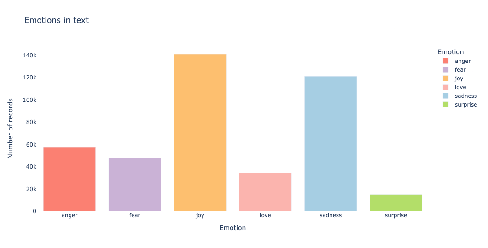
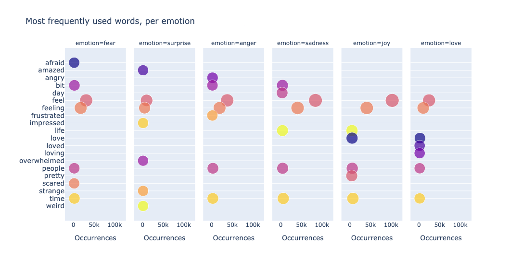
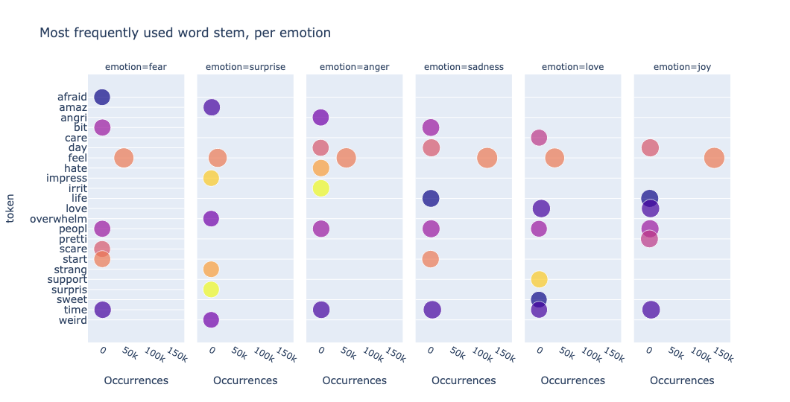
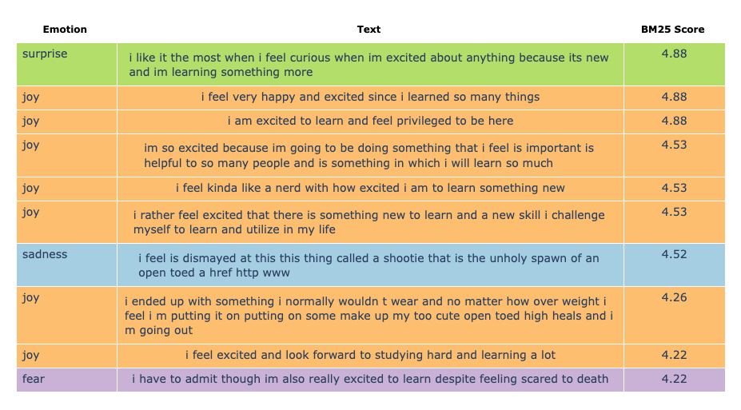
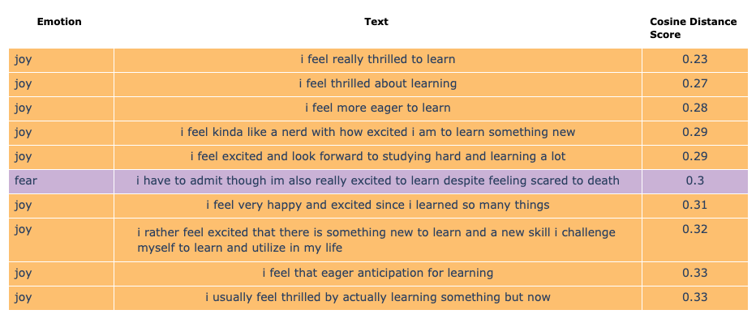
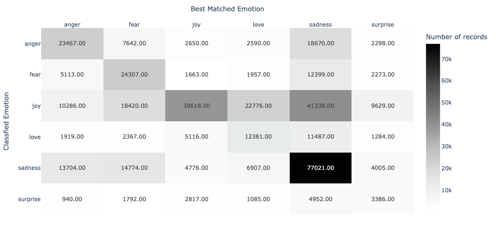

## DuckDB进军AI数据库底座, 坐实了 | 文本语义(向量)搜索、全文检索、bm25搜索与排序、模糊搜索详解  
          
### 作者          
digoal          
          
### 日期          
2025-06-14          
          
### 标签          
PostgreSQL , PolarDB , DuckDB , vss , fts , 搜索 , AI Agent 数据库底座 , 图式搜索 , 语义(向量)搜索 , 全文检索 , bm25搜索与排序 , 模糊检索   
          
----          
          
## 背景   
如果你看过 GraphRAG, KAG 的论文, 想必你应该知道, 将数据拆分成实体, 通过连线和属性将实体进行连接, 并按关联强度进行聚集形成知识图谱. 最终在召回与问题相关的内容时更加精准, 从而提升RAG的质量.   
  
[《AI论文解读 | Retrieval-Augmented Generation with Graphs (GraphRAG)》](../202505/20250514_01.md)    
[《AI论文解读 | KAG: Boosting LLMs in Professional Domains via Knowledge Augmented Generation》](../202505/20250515_01.md)    
  
所以图数据库能力是AI打造RAG的关键技术之一.   
  
DuckDB 有此布局: [《DuckDB 1.3.0 CTE递归增强(支持USING KEY、循环表访问) - 大型图查询`结果集爆减、性能飙升、内存爆省`》](../202505/20250526_01.md)    
  
如果你看过我之前一篇对RAG的召回性能的分析, 以及优化方法的实践文章, 你应该清楚, 除了图以外, 文本召回还涉及到: 语义(向量)搜索、全文检索、bm25搜索与排序、模糊检索  
- [《为什么用了RAG, 我的AI还是笨得跟猪一样! RAG效果评测与优化》](../202504/20250414_04.md)    
- [《维基百科(wikipedia) RAG 优化 | PolarDB + AI》](../202504/20250417_01.md)    
- [《VectorChord-bm25项目中BM25分数计算的Block-WeakAnd算法》](../202505/20250522_05.md)    
- [《VectorChord 向量插件学习心得》](../202505/20250513_01.md)    
- [《召回精度提升插件: pg_tokenizer + VectorChord-BM25 reranking》](../202504/20250427_04.md)    
  
语义(向量)搜索 DuckDB也有布局: [《DuckDB 发布vss 向量插件》](../202405/20240505_03.md)    
  
上一篇文章 [《祝贺DuckDB斩获30K star, Roadmap暴露野心, 估值可能过百亿》](../202506/20250610_04.md) , roadmap指出DuckDB要支持“通过GO/Rust开发扩展插件”的功能, 我个人分析DuckDB一定会进军AI数据库底座这个未来最大的数据库赛道.   
  
今天这篇更加坐实了我的判断, 来看看DuckDB 如何进行 “语义(向量)搜索、全文检索、bm25搜索与排序、模糊检索” ?  
  
---  
  
下面翻译自: https://duckdb.org/2025/06/13/text-analytics.html  
  
# 使用DuckDB的轻量级文本分析工作流程  
  
  
TL;DR：在这篇文章中，我们演示了如何使用 DuckDB 进行带有嵌入的关键字、全文和语义相似性搜索。  
  
## 介绍  
文本分析是许多现代数据工作流的核心组成部分(说得太隐晦了, 直接说AI Agent必备功能吧)，涵盖关键字匹配、全文搜索和语义比较等任务。传统工具通常需要复杂的管道和大量的基础设施，这可能会带来巨大的挑战。DuckDB 提供了一个高性能的 SQL 引擎，可以简化和精简文本分析。在本文中，我们将演示如何利用 DuckDB 在 Python 中高效地执行高级文本分析。  
  
> 以下实现在marimo Python 笔记本( https://marimo.io/ )中执行，该笔记本可在 GitHub 上的示例存储库( https://github.com/duckdb/duckdb-blog-examples/tree/main/text_analytics_with_duckdb )中找到。  
  
## 数据准备  
我们将使用Hugging Face( https://huggingface.co/datasets/dair-ai/emotion )上提供的公共数据集，其中包含英文 Twitter 消息及其对以下情绪之一的分类：愤怒、恐惧、喜悦、爱、悲伤和惊讶。  
  
使用 DuckDB，我们可以通过`hf://`前缀访问 Hugging Face 数据集：  
```  
from_hf_rel = conn.read_parquet(  
        "hf://datasets/dair-ai/emotion/unsplit/train-00000-of-00001.parquet",  
        file_row_number=True  
    )  
from_hf_rel = from_hf_rel.select("""  
    text,  
    label as emotion_id,  
    file_row_number as text_id  
""")  
from_hf_rel.to_table("text_emotions")  
```  
  
> 如何使用 DuckDB 访问 Hugging Face 数据集在文章“使用 DuckDB 访问 Hugging Face 的 150k+ 数据集”中有详细说明。 https://duckdb.org/2024/05/29/access-150k-plus-datasets-from-hugging-face-with-duckdb.html   
  
在上述数据中，我们仅提供了情绪的标识符（`emotion_id`），而没有其描述信息。因此，根据数据集描述中提供的列表，我们通过解除 Python 列表的嵌套并使用以下`generate_subscripts`函数( https://duckdb.org/docs/stable/sql/query_syntax/unnest.html#keeping-track-of-list-entry-positions )检索每个值的索引来创建参考表：  
```  
emotion_labels = ["sadness", "joy", "love", "anger", "fear", "surprise"]  
  
from_labels_rel = conn.values([emotion_labels])  
from_labels_rel = from_labels_rel.select("""  
    unnest(col0) as emotion,  
    generate_subscripts(col0, 1) - 1 as emotion_id  
""")  
from_labels_rel.to_table("emotion_ref")  
```  
  
最后，我们通过连接两个表来定义关系：  
```  
text_emotions_rel = conn.table("text_emotions").join(  
    conn.table("emotion_ref"), condition="emotion_id"  
)  
```  
  
> 通过执行将创建`text_emotions_rel.to_view("text_emotions_v", replace=True)`一个具有名称的视图`text_emotions_v`，该视图可以在 SQL 单元格中使用。  
  
我们在条形图上绘制情绪分布，以便对我们的数据有初步的了解：  
  
  
  
## 关键词搜索  
关键字搜索是最基本的文本检索形式，使用 SQL 条件（例如 `CONTAINS` 、`ILIKE` 或其他 DuckDB 文本函数 ）在文本字段中匹配精确的单词或短语。它速度快，无需预处理，非常适合结构化查询，例如过滤日志、匹配标签或查找产品名称。  
  
例如，获取包含`excited to learn`短语的文本及其情感标签就是使用`filter`定义的关系的问题：  
```  
text_emotions_rel.filter("text ilike '%excited to learn%'").select("""  
    emotion,  
    substring(  
        text,  
        position('excited to learn' in text),  
        len('excited to learn')  
    ) as substring_text   
""")  
  
┌─────────┬──────────────────┐  
│ emotion │  substring_text  │  
│ varchar │     varchar      │  
├─────────┼──────────────────┤  
│ sadness │ excited to learn │  
│ joy     │ excited to learn │  
│ joy     │ excited to learn │  
│ fear    │ excited to learn │  
│ fear    │ excited to learn │  
│ joy     │ excited to learn │  
│ joy     │ excited to learn │  
│ sadness │ excited to learn │  
└─────────┴──────────────────┘  
```  
  
文本处理中一个常见的步骤是将文本拆分成标记（关键词），即将原始文本分解成更小的单元（通常是单词），以便进行分析或索引。这个过程称为标记化，它有助于将非结构化文本转换为适合关键词搜索的结构化形式。在 DuckDB 中，可以使用`regexp_split_to_table`函数( https://duckdb.org/docs/stable/sql/functions/text.html#regexp_split_to_tablestring-regex )来实现此过程，该函数将根据提供的正则表达式拆分文本，并按行返回每个关键词。  
  
> 此步骤区分大小写，因此在处理之前将所有文本转换为一致的大小写（通过应用`lcase`或`ucase`）非常重要。  
  
在下面的代码片段中，我们通过将文本拆分为一个或多个非单词字符（除 `[a-zA-Z0-9_]` 之外的任何字符）来选择所有关键字：  
```  
text_emotions_tokenized_rel = text_emotions_rel.select("""  
    text_id,  
    emotion,  
    regexp_split_to_table(text, '\\W+') as token  
""")  
```  
  
在标记化步骤中，我们通常会排除常用词（例如`and、the`），这些词被称为stopwords 。在 DuckDB 中，我们通过在 GitHub 上托管的 CSV 文件上应用 `ANTI JOIN` 来实现`exclusion`查询：  
```  
english_stopwords_rel = duckdb_conn.read_csv(  
    "https://raw.githubusercontent.com/stopwords-iso/stopwords-en/refs/heads/master/stopwords-en.txt",  
    header=False,  
).select("column0 as token")  
  
text_emotions_tokenized_rel.join(  
    english_stopwords_rel,  
    condition="token",  
    how="anti",  
).to_table("text_emotion_tokens")  
```  
  
现在我们已经对文本进行了标记和清理，我们可以通过使用相似度函数（例如`Jaccard` ）对匹配进行排名来实现关键字搜索：  
  
说到相似搜索, 我不得不插一嘴, 提一下PG的这个插件:  
- [《17种文本相似算法与GIN索引 - pg_similarity》](../201705/20170524_01.md)    
  
```  
text_token_rel = conn.table(  
    "text_emotion_tokens"  
).select("token, emotion, jaccard(token, 'learn') as jaccard_score")  
  
text_token_rel = text_token_rel.max(  
    "jaccard_score",  
    groups="emotion, token",  
    projected_columns="emotion, token"  
)  
  
text_token_rel.order("3 desc").limit(10)  
  
┌──────────┬─────────┬────────────────────┐  
│ emotion  │  token  │ max(jaccard_score) │  
│ varchar  │ varchar │       double       │  
├──────────┼─────────┼────────────────────┤  
│ fear     │ learn   │                1.0 │  
│ surprise │ learn   │                1.0 │  
│ love     │ learn   │                1.0 │  
│ joy      │ lerna   │                1.0 │  
│ sadness  │ learn   │                1.0 │  
│ fear     │ learner │                1.0 │  
│ anger    │ learn   │                1.0 │  
│ joy      │ leaner  │                1.0 │  
│ fear     │ allaner │                1.0 │  
│ anger    │ learner │                1.0 │  
├──────────┴─────────┴────────────────────┤  
│ 10 rows                       3 columns │  
└─────────────────────────────────────────┘  
```  
  
我们还可以通过可视化数据来获得洞见。一种简单有效的方法是绘制最常用的单词。通过统计数据集中标记的出现次数并将其显示在气泡图中，我们可以快速识别文本中的主导主题、重复关键词或异常模式。例如，我们根据情绪绘制散点图来绘制数据： ( https://plotly.com/python/facet-plots/ )  
  
  
  
从上图中，我们观察到重复的关键词，例如`feel - feeling`，`love - loved - loving`。为了去除这类数据的重复，我们需要查看词干而不是单词本身。这就引出了全文搜索。  
  
## 全文搜索 & bm25 打分  
全文搜索 (FTS) DuckDB 扩展是一个实验性扩展，它实现了两个主要的全文搜索功能：( https://duckdb.org/docs/stable/core_extensions/full_text_search.html )  
- 函数`stem`，检索词干；  
- 函数`match_bm25`，计算最佳匹配分数。  
  
通过应用于`stem`标记列，我们现在可以可视化数据中最常用的词干：  
  
  
  
我们观察到`feel`和`love`只出现一次，并且绘制了新的词干，例如`support`，`surpris`。  
  
虽然该`stem`函数可以独立使用，但`match_bm25`则需要构建 FTS 索引，这是一种特殊的索引，可以通过索引列中的单词（标记）来快速有效地搜索文本：  
```  
conn.sql("""  
    PRAGMA create_fts_index(  
        "text_emotions",   
        text_id,   
        "text",   
        stemmer = 'english',  
        stopwords = 'english_stopwords',  
        ignore = '(\\.|[^a-z])+',  
        strip_accents = 1,   
        lower = 1,   
        overwrite = 1  
    )  
""")  
```  
  
在 FTS 索引创建中，我们使用与标记化过程中相同的英语停用词列表，将其保存到名为 `english_stopwords` 的表中。由于使用`lower`参数，索引不区分大小写，该参数会自动将文本小写。  
  
> 警告  
> 索引只能在表上创建，并且需要文本的唯一标识符。当底层数据被修改时，也需要重建索引。  
  
一旦创建了索引，我们就可以对`text`列和`excited to learn`短语之间的匹配进行排名：  
```  
text_emotions_rel  
.select("""  
    emotion,  
    text,  
    emotion_color,  
    fts_main_text_emotions.match_bm25(  
        text_id,  
        'excited to learn'  
    )::decimal(3, 2) as bm25_score  
""")  
.order("bm25_score desc")  
.limit(10)  
```  
  
  
  
在上面的表格中显示的 10 个返回文本中( https://plotly.com/python/table/ )，有 2 个与我们的搜索输入匹配度较差；可能是因为 BM25 评分受到常用术语或文档长度差异的影响。  
  
## 语义搜索  
与关键字搜索和全文搜索相比，语义搜索会考虑文本的含义和上下文。它不仅仅寻找精确的词语，还使用向量嵌入( https://github.com/veekaybee/what_are_embeddings )等技术来捕捉底层概念。语义搜索不区分大小写，可以通过使用（同样处于实验阶段的）向量相似性搜索扩展( https://duckdb.org/docs/stable/core_extensions/vss.html )在 DuckDB 中实现。  
  
可以使用`sentence-transformers`库( https://sbert.net/ )和预先训练的`all-MiniLM-L6-v2`模型( https://sbert.net/docs/sentence_transformer/pretrained_models.html )来计算文本（列表）的向量嵌入：  
```  
from sentence_transformers import SentenceTransformer  
  
model = SentenceTransformer('all-MiniLM-L6-v2')  
  
def get_text_embedding_list(list_text: list[str]):  
    """  
    Return the list of normalized vector embeddings for list_text.  
    """  
    return model.encode(list_text, normalize_embeddings=True)  
```  
  
例如，`get_text_embedding_list(['excited to learn'])` 将返回：  
```  
array([[ 3.14795598e-02, -6.66208193e-02,  1.05058309e-02,  
         4.12571728e-02, -8.67664907e-03, -1.79746319e-02,  
        ...  
        -2.50727013e-02, -3.00881546e-03,  1.55055271e-02]], dtype=float32)  
```  
  
我们将模型推理函数注册为用户定义Python 函数( https://duckdb.org/docs/stable/clients/python/function.html )，并创建一个表，其中包含用于将嵌入加载到其中的`FLOAT[384]`类型列：  
```  
conn.create_function(  
    "get_text_embedding_list",  
    get_text_embedding_list,  
    return_type='FLOAT[384][]'  
)  
  
conn.sql("""  
    create table text_emotion_embeddings (  
        text_id integer,  
        text_embedding FLOAT[384]  
    )  
""")  
```  
  
使用 Python UDF，我们分批将模型输出保存在`text_emotion_embeddings`：  
```  
for i in range(num_batches):  
    selection_query = (  
        duckdb_conn.table("text_emotions")  
        .order("text_id")  
        .limit(batch_size, offset=batch_size*i)  
        .select("*")  
    )  
  
    (  
        selection_query.aggregate("""  
            array_agg(text) as text_list,  
            array_agg(text_id) as id_list,  
            get_text_embedding_list(text_list) as text_emb_list  
        """).select("""  
            unnest(id_list) as text_id,  
            unnest(text_emb_list) as text_embedding  
        """)  
    ).insert_into("text_emotion_embeddings")  
```  
  
> 我们在文章《使用 DuckDB 和 scikit-learn 进行机器学习原型设计》( https://duckdb.org/2025/05/16/scikit-learn-duckdb.html )中撰写了有关 DuckDB 中的模型推理的内容。  
  
我们现在可以使用搜索文本`excited to learntext`的向量嵌入与`column`的嵌入之间的余弦距离( https://en.wikipedia.org/wiki/Cosine_similarity#Cosine_distance )来执行语义搜索：  
```  
input_text_emb_rel = conn.sql("""  
    select get_text_embedding_list(['excited to learn'])[1] as input_text_embedding  
""")  
  
text_emotions_rel  
.join(conn.table("text_emotion_embeddings"), condition="text_id")  
.join(input_text_emb_rel, condition="1=1")  
.select("""  
        text,   
        emotion,  
        emotion_color,  
        array_cosine_distance(  
            text_embedding,  
            input_text_embedding  
        )::decimal(3, 2) as cosine_distance_score  
    """)  
.order("cosine_distance_score asc")  
.limit(10)  
```  
  
  
  
有趣的是，`i am excited to learn and feel privileged to be here`这个短语在我们的语义搜索中没有进入前 10 ！  
  
## 相似性JOIN  
向量嵌入最为人熟知的功能是其在搜索引擎中的可用性，但它也适用于各种文本分析用例，例如主题分组、分类或文档之间的语义匹配。VSS 扩展提供了向量相似性JOIN ( https://duckdb.org/docs/stable/core_extensions/vss.html#bonus-vector-similarity-search-joins )，可用于执行这些类型的分析。  
  
例如，我们在下面的热力图( https://plotly.com/python/heatmaps/ )中显示了每种情绪标签组合的文本数量，其中 x 轴对应于文本和情绪之间的语义匹配，y 轴对应于分类的情绪，颜色表示分配给每对的文本数量：  
  
  
  
尤其值得注意的是，在这 6 种情绪中，只有`sadness`与归类为相同标签的文本具有较高的语义匹配度。与全文搜索一样，语义搜索也会受到文档长度差异的影响（在本例中，是情绪关键词与文本的长度差异）。  
  
## 混合搜索  
虽然每种类型的搜索都有其自身的适用性，但我们观察到一些结果并不像预期的那样：  
- 关键词搜索和全文搜索不考虑词义；  
- 语义搜索对同义词的评分高于搜索文本。  
  
在实际操作中，我们会将这三种搜索方法结合起来，形成“混合搜索”，以提高搜索的相关性和准确性。我们首先会计算每种搜索类型的得分，并实现自定义逻辑，例如检查情绪：  
```  
if(  
    emotion = 'joy' and contains(text, 'excited to learn'),  
    1,  
    0  
) exact_match_score,  
  
fts_main_text_emotions.match_bm25(  
        text_id,  
        'excited to learn'  
)::decimal(3, 2) as bm25_score,  
  
array_cosine_similarity(  
    text_embedding,  
    input_text_embedding  
)::decimal(3, 2) as cosine_similarity_score  
```  
  
BM25 得分按降序排列，余弦距离按升序排列。在混合搜索中，我们使用`array_cosine_similarity`得分来确保相同的排序顺序（在本例中为降序）。  
```  
cosine similarity = 1 - cosine distance  
```  
  
因为理论上 BM25 分数可以是无界的，所以我们需要通过实现最小-最大标准化将分数缩放( https://en.wikipedia.org/wiki/Feature_scaling )到`[0, 1]`区间：  
```  
max(bm25_score) over () as max_bm25_score,  
min(bm25_score) over () as min_bm25_score,  
(bm25_score - min_bm25_score) / nullif((max_bm25_score - min_bm25_score), 0) as norm_bm25_score  
```  
  
混合搜索分数是通过对 BM25 和余弦相似度分数应用权重来计算的：  
```  
if(  
    exact_match_score = 1,  
    exact_match_score,  
    cast(  
        0.3 * coalesce(norm_bm25_score, 0) +  
        0.7 * coalesce(cosine_similarity_score, 0)  
        as  
        decimal(3, 2)  
    )  
) as hybrid_score  
```  
  
这就是结果！好多了，你不觉得吗？  
  
  
  
## 结论  
在本文中，我们展示了如何结合关键词、全文和语义搜索技术，将 DuckDB 用于文本分析。通过使用`fts`和`vss`插件以及`vsssentence-transformers`库，我们演示了 DuckDB 如何支持传统和现代的文本分析工作流程。  
  
看到这里, 你是不是越来越认同我的判断, DuckDB 就是要进军AI Agent数据库底座, “图搜索、语义(向量)搜索、全文检索、bm25搜索与排序、模糊检索” 通吃!    
    
  
#### [期望 PostgreSQL|开源PolarDB 增加什么功能?](https://github.com/digoal/blog/issues/76 "269ac3d1c492e938c0191101c7238216")
  
  
#### [PolarDB 开源数据库](https://openpolardb.com/home "57258f76c37864c6e6d23383d05714ea")
  
  
#### [PolarDB 学习图谱](https://www.aliyun.com/database/openpolardb/activity "8642f60e04ed0c814bf9cb9677976bd4")
  
  
#### [PostgreSQL 解决方案集合](../201706/20170601_02.md "40cff096e9ed7122c512b35d8561d9c8")
  
  
#### [德哥 / digoal's Github - 公益是一辈子的事.](https://github.com/digoal/blog/blob/master/README.md "22709685feb7cab07d30f30387f0a9ae")
  
  
#### [About 德哥](https://github.com/digoal/blog/blob/master/me/readme.md "a37735981e7704886ffd590565582dd0")
  
  

  
